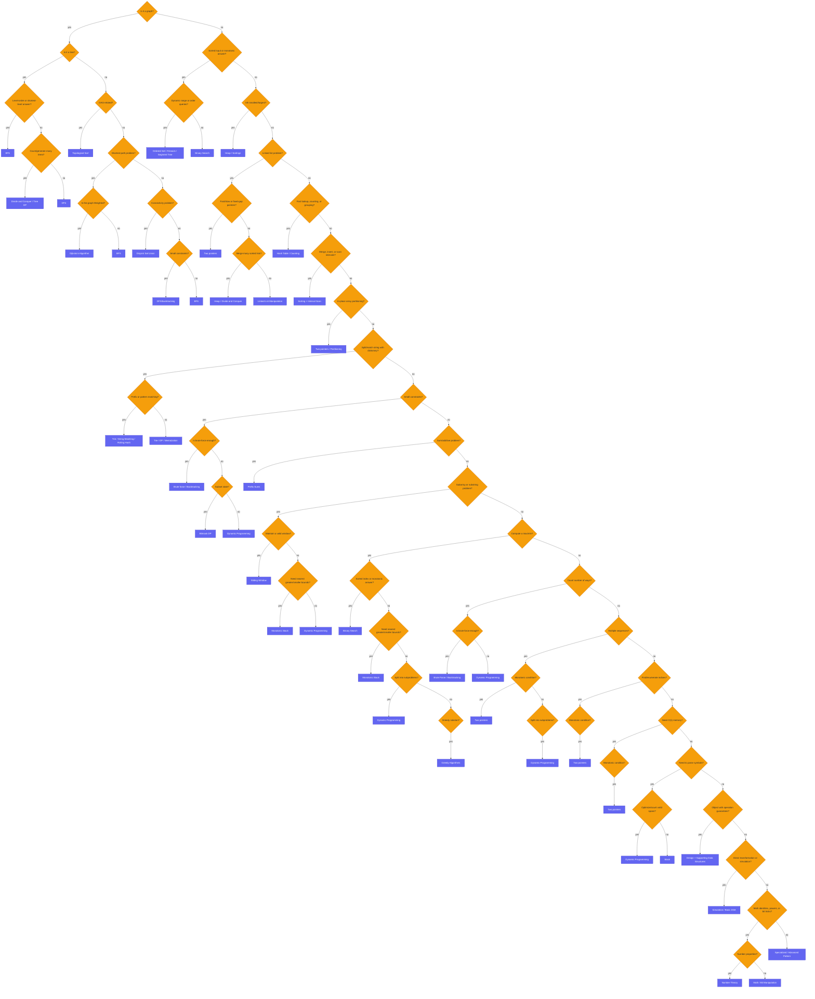

# AlgoMonster Decision Flowchart (Reviewer)

This reviewer reproduces, node-for-node, the decision flowchart published by
[AlgoMonster](https://algo.monster/flowchart): a single top-down decision tree you walk one yes/no answer at
a time, from the root *"Is it a graph?"* down to a recommended technique. It is the dedicated companion to
the [Algorithm Patterns Index](algorithm-patterns-index-reviewer.md) — the index does the fast, cue-based
triage; this page is the exhaustive walk for when no single cue jumps out. All **91 nodes** are here (47
question diamonds routing to 44 technique leaves): the **diamonds** are questions about the problem, the
**rounded boxes** are the technique to reach for once you land on a leaf.

> **Tip — the inline diagram below is dense (91 nodes).** For a full-screen view you can zoom and pan, with
> a top-down ↔ left-right layout toggle, open the interactive companion
> **[algomonster-flowchart.html](algomonster-flowchart.html)** (double-click it to open in your browser).

Related: [Algorithm Patterns Index](algorithm-patterns-index-reviewer.md) · [Glossary](algorithms-glossary-reviewer.md)

## How to read it

> Traverse from the root, answering each diamond about the *problem description* — its
> shape, its [constraints](algorithms-glossary-reviewer.md#constraints "The limits a problem places on inputs; reading them first picks your complexity target."), and what it asks for. The first leaf you reach is the suggested pattern. Four of the
> deepest diamonds (`Greedy solution?`, and the innermost `Monotonic condition?` / `Split into subproblems?`
> checks) have only a **yes** branch by design: a "no" there means none of the cheap tricks apply, so you
> keep moving down the spine to the next question. Treat this chart as a **complement** to the cue sheet —
> the cue sheet is fast recognition from one signal word; this flowchart is the exhaustive walk for when no
> single cue jumps out.

## The shape of the tree

The root question — *Is it a graph?* — splits the whole chart in two. A **yes**
drops into the compact graph region — tree vs.
[DAG](algorithms-glossary-reviewer.md#dag "A directed graph with no cycles; its vertices can be topologically ordered.")
vs. shortest-path vs. connectivity, landing on BFS/DFS,
[topological sort](algorithms-glossary-reviewer.md#topological-sort "A linear order of a DAG's vertices where every edge points forward."),
[Dijkstra](algorithms-glossary-reviewer.md#dijkstra "Finds shortest paths from a source on non-negative weights via a min-heap."),
or [union-find](algorithms-glossary-reviewer.md#union-find "Tracks elements in groups with near-O(1) find-group and merge-groups operations.").
A **no** enters a long, left-leaning spine where each subsequent *no*
steps you down through progressively more specific families: search & order → linked lists → hashing →
intervals → partitioning → strings → small-constraint brute force/DP → subarray/window → max-min & counting
optimization → the multi-sequence / two-pointer family → and finally a tail of symbol parsing,
data-structure design, simulation, and number theory. Because *no* answers cascade down that spine, the
**earliest questions carry the most weight** — answer *Is it a graph?* and *Sorted input or monotonic
answer?* correctly and you have already pruned most of the tree.

## The flowchart



*The complete AlgoMonster flowchart, reproduced node-for-node: orange diamonds are yes/no questions about the problem, indigo boxes are the technique to use. The decision structure is AlgoMonster's; the routing and annotations below are this suite's.*

## Where each flowchart leaf lives in this suite

Every technique the chart can land on, mapped to the reviewer that teaches it. A few leaves repeat because
more than one branch resolves to the same tool (the count in parentheses is how many leaves carry that
label); a few are advanced or composite tools that the core suite does not give a standalone reviewer.

| Flowchart leaf (technique) | Where this suite teaches it |
| --- | --- |
| BFS (×3), DFS, DFS/backtracking | [Graphs](graphs-reviewer.md) · [Trees & BSTs](trees-and-binary-search-trees-reviewer.md) (BFS/DFS traversal); [Backtracking](backtracking-reviewer.md) for the small-constraint DFS |
| Topological Sort | [Graphs](graphs-reviewer.md) (DAG ordering) |
| Dijkstra's Algorithm | [Graphs](graphs-reviewer.md) (weighted [shortest path](algorithms-glossary-reviewer.md#shortest-path "The route between two vertices with the smallest total cost or fewest edges.")) |
| Disjoint Set Union | [Graphs](graphs-reviewer.md) ([union-find](algorithms-glossary-reviewer.md#union-find "Tracks elements in groups with near-O(1) find-group and merge-groups operations.")) |
| Divide and Conquer / Tree DP | [Recursion & Divide and Conquer](recursion-and-divide-and-conquer-reviewer.md) · [Dynamic Programming](dynamic-programming-reviewer.md) · [Trees & BSTs](trees-and-binary-search-trees-reviewer.md) |
| Binary Search (×2) | [Binary Search](binary-search-reviewer.md) (on data and on the answer) |
| Ordered Set / Fenwick / Segment Tree | [Segment Trees & Fenwick Trees](segment-tree-and-fenwick-reviewer.md) (dynamic range queries with point/range updates); [Prefix Sums & Difference Arrays](prefix-sums-and-difference-arrays-reviewer.md) for static ranges |
| Heap / Sortings | [Heaps & Priority Queues](heaps-and-priority-queues-reviewer.md) · [Sorting Algorithms](sorting-algorithms-reviewer.md) |
| Heap / Divide and Conquer | [Heaps & Priority Queues](heaps-and-priority-queues-reviewer.md) · [Recursion & Divide and Conquer](recursion-and-divide-and-conquer-reviewer.md) |
| Two pointers (×4), Two pointers / Partitioning | [Two Pointers](two-pointers-reviewer.md); partitioning also in [Sorting Algorithms](sorting-algorithms-reviewer.md) |
| Linked List Manipulation | [Linked Lists](linked-lists-reviewer.md) |
| Hash Table / Counting | [Arrays & Hashing](arrays-and-hashing-reviewer.md) |
| Sorting + Interval Scan | [Intervals](intervals-reviewer.md) · [Sorting Algorithms](sorting-algorithms-reviewer.md) |
| Trie / String Matching / Rolling Hash | [Tries](tries-reviewer.md); rolling hash in [Math & Number Theory](math-and-number-theory-reviewer.md) |
| Trie / DP / Memoization | [Tries](tries-reviewer.md) · [Dynamic Programming](dynamic-programming-reviewer.md) |
| Brute force / Backtracking (×2) | [Backtracking](backtracking-reviewer.md) |
| Bitmask DP | [Dynamic Programming](dynamic-programming-reviewer.md) · [Bit Manipulation](bit-manipulation-reviewer.md) |
| Dynamic Programming (×6) | [Dynamic Programming](dynamic-programming-reviewer.md) |
| Prefix Sums | [Prefix Sums & Difference Arrays](prefix-sums-and-difference-arrays-reviewer.md) |
| Sliding Window | [Sliding Window](sliding-window-reviewer.md) |
| Monotonic Stack (×2), Stack | [Stacks & Monotonic Stacks](stacks-and-monotonic-stacks-reviewer.md) |
| Greedy Algorithms | [Greedy](greedy-reviewer.md) |
| Math / Bit Manipulation, Number Theory | [Math & Number Theory](math-and-number-theory-reviewer.md) · [Bit Manipulation](bit-manipulation-reviewer.md) |
| Design + Supporting Data Structures | Compose core structures (hash map + heap + linked list, etc.); no standalone reviewer |
| Simulation / Basic DSA | Direct array/string simulation; no standalone reviewer |
| Specialized / Advanced Pattern | Catch-all for problems outside the recurring patterns |

## Walking the flowchart: three traversals

The fastest way to internalize the chart is to run real prompts through it. Each line below is the diamond
you hit, verbatim, with the answer that selects the next edge; the bracketed box is the leaf you land on.

```text
  LC 207 — "Can you finish all courses, given the prerequisites?"
     Is it a graph? yes -> Is it a tree? no -> DAG-related? yes -> [Topological Sort]

  LC 215 — "Return the kth largest element in an array"
     Is it a graph? no -> Sorted input or monotonic answer? no
     -> kth smallest/largest? yes -> [Heap / Sortings]

  LC 3 — "Longest substring without repeating characters"
     Is it a graph? no -> Sorted input or monotonic answer? no -> kth smallest/largest? no
     -> Linked list problem? no -> Fast lookup, counting, or grouping? no
     -> Merge, insert, or scan intervals? no -> In-place array partitioning? no
     -> Split/match string with dictionary? no -> Small constraints? no
     -> Sum/additive problem? no -> Subarray or substring problem? yes
     -> Maintain a valid window? yes -> [Sliding Window]
```

*Three end-to-end walks (diamond labels verbatim). The deep third path is the lesson: the tree is left-leaning, so a routine sliding-window problem sits ten "no"s down the spine — which is exactly the case where recognizing the cue sheet's one-glance signal ("contiguous substring with a property") beats walking the whole chart.*

## References

- AlgoMonster — [Decision Tree / Coding Interview Flowchart](https://algo.monster/flowchart).
- NeetCode — [Roadmap](https://neetcode.io/roadmap) (the pattern-ordered path this suite mirrors).
