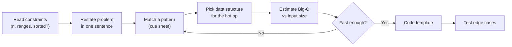
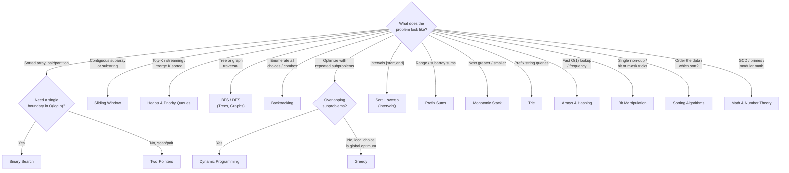
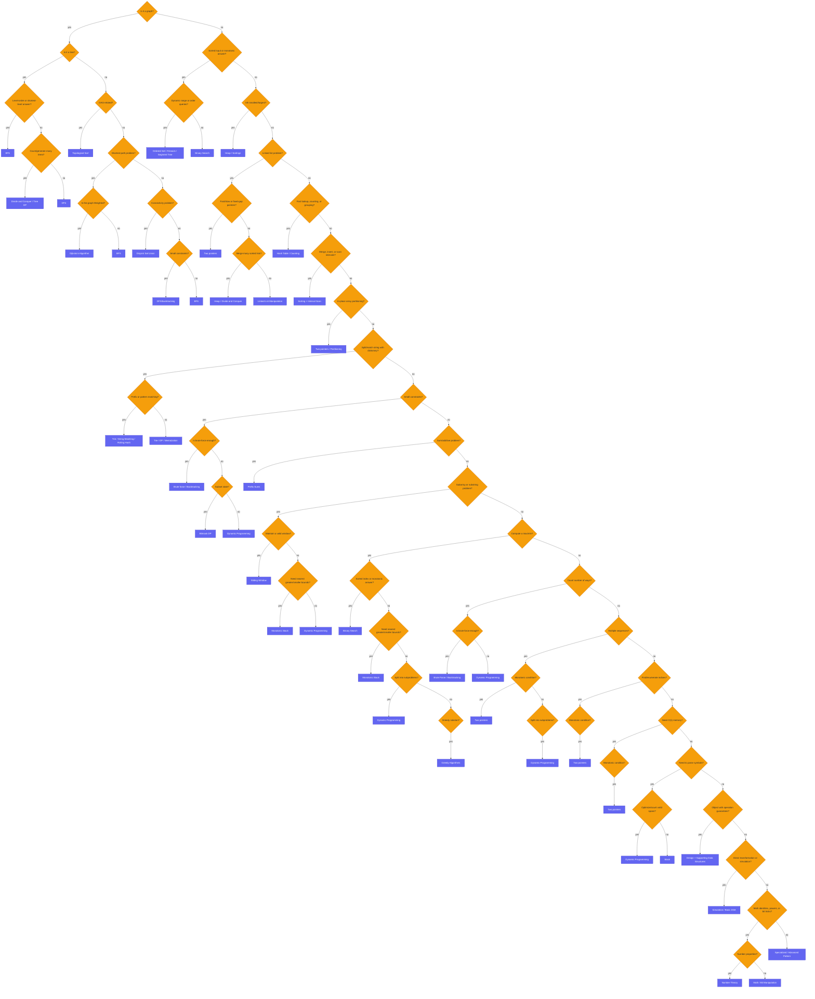
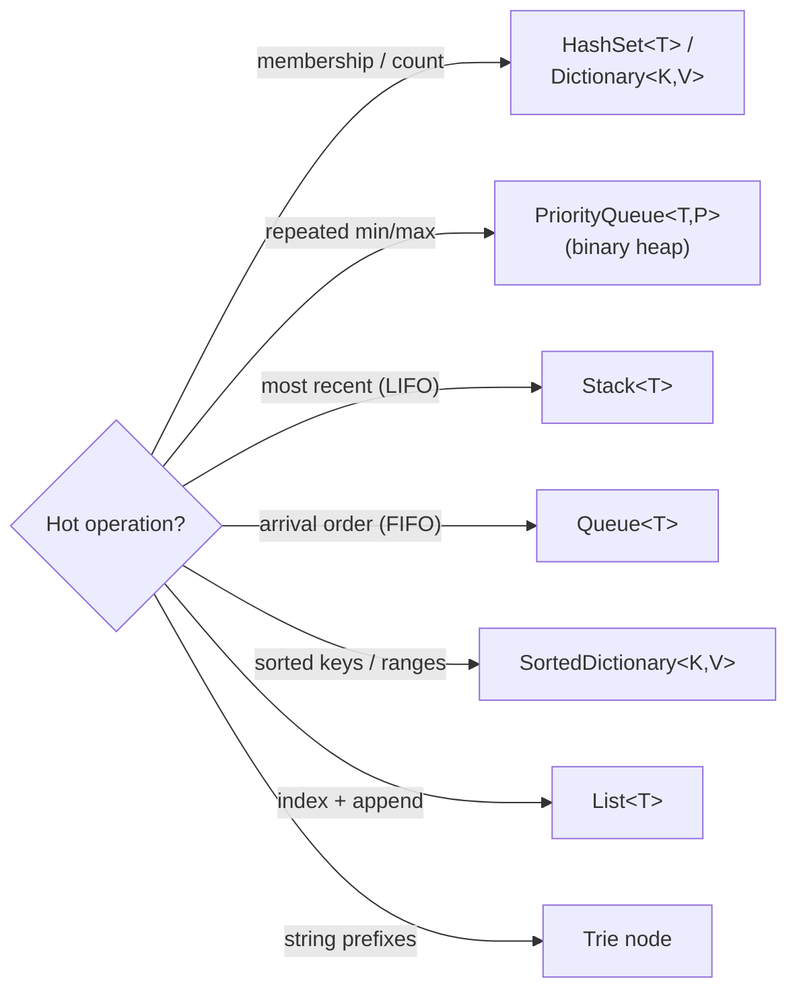
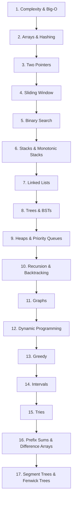

# Algorithm Patterns Index (Reviewer)

This is the **hub** for the algorithms/data-structures study suite — a coding-interview and
algorithm-exam playbook. Most interview problems are not novel; they are one of roughly twenty
recurring **patterns** wearing a fresh costume. The skill that separates a flailing candidate from a
fast one is **pattern recognition**: reading the problem, spotting the signal ("sorted input",
"contiguous subarray", "top K", "next greater element"), and reaching for the [data structure](algorithms-glossary-reviewer.md#data-structure "A way of organizing data in memory so the operations you need run fast.") and
template that solves that family. This index teaches you to do that triage, then routes you to the
deep-dive reviewer for each pattern.

> **New to algorithms?** Throughout this suite, jargon terms are clickable links — **hover** over one for
> a one-line definition, or **click** it to jump to the full entry in the
> [Glossary](algorithms-glossary-reviewer.md), a beginner-friendly reference that defines every
> algorithm, data-structure, and LeetCode term used across these reviewers (with examples and common
> pitfalls). If a word ever looks unfamiliar, it is almost certainly a link.

A reliable problem-solving loop works the same way every time. **(1) Read the [constraints](algorithms-glossary-reviewer.md#constraints "The limits a problem places on inputs; reading them first picks your complexity target.") first** —
the input bounds (`n`), value ranges, and whether the data is sorted/unique tell you the target
complexity before you have read the prose carefully. **(2) Restate and find the pattern** — map the
ask to one of the cue-sheet rows below. **(3) Pick the data structure** that makes the key operation
cheap ([hash map](algorithms-glossary-reviewer.md#hash-map "Stores key-value pairs and retrieves a value by key in O(1) average time.") for O(1) lookup, [heap](algorithms-glossary-reviewer.md#heap "A tree structure keeping the smallest or largest element instantly accessible.") for streaming top-K, [stack](algorithms-glossary-reviewer.md#stack "A last-in-first-out collection: you add and remove only at the top.") for "most recent", etc.).
**(4) Estimate complexity from `n`** and sanity-check it against the time limit (a rough budget of
~10^8 simple operations per second). **(5) Code the template, then test [edge cases](algorithms-glossary-reviewer.md#edge-case "An input at the boundary of valid or typical, where buggy code tends to break.")** — empty input,
one element, all-equal, negatives, [overflow](algorithms-glossary-reviewer.md#integer-overflow "A value exceeds its integer type's max and silently wraps to a wrong value."), and the "no answer exists" case. Doing this loop
deliberately is the single highest-leverage interview habit, and it is exactly what the cue sheet and
decision flowchart on this page are built to drill.

Related: [Complexity & Big-O](complexity-and-big-o-reviewer.md) · [Recursion & Divide and Conquer](recursion-and-divide-and-conquer-reviewer.md) · [Two Pointers](two-pointers-reviewer.md) · [Glossary](algorithms-glossary-reviewer.md)

## Contents
- [How to attack any problem](#how-to-attack-any-problem)
- [Pattern recognition cue sheet](#pattern-recognition-cue-sheet)
- [Pattern decision flowchart](#pattern-decision-flowchart)
- [The AlgoMonster decision flowchart](#the-algomonster-decision-flowchart)
- [Input size to target complexity](#input-size-to-target-complexity)
- [Complexity ladder cheat-sheet](#complexity-ladder-cheat-sheet)
- [Choosing a data structure](#choosing-a-data-structure)
- [Suggested study order](#suggested-study-order)
- [The full reviewer suite](#the-full-reviewer-suite)
- [Interview Q&A](#interview-qa)
- [Rapid-fire round](#rapid-fire-round)
- [Exam-style questions](#exam-style-questions)
- [30-second takeaway](#30-second-takeaway)
- [Quick recall checklist](#quick-recall-checklist)
- [References](#references)

---

## How to attack any problem

A repeatable triage beats raw cleverness. Run the same five steps on every problem so that under
pressure you are executing a habit, not improvising.

Key points:

- **Constraints first, prose second.** `1 <= n <= 20` screams [backtracking](algorithms-glossary-reviewer.md#backtracking "Explore all candidates by building one choice at a time and undoing dead ends."); `n <= 1e5` rules out
  O(n^2). The bounds pre-select your complexity target (see the input-size table below).
- **Restate the problem in one sentence**, then match it to a cue in the next section. Naming the
  pattern out loud ("this is a [sliding window](algorithms-glossary-reviewer.md#sliding-window "A contiguous range you expand and shrink to track a property in one pass.") over a [substring](algorithms-glossary-reviewer.md#subarray-subsequence-and-substring "Subarray/substring is a contiguous slice; subsequence keeps order but may skip.")") is half the solve.
- **Pick the data structure by the hot operation.** Need O(1) "have I seen this?" → [hash set](algorithms-glossary-reviewer.md#hash-set "Stores unique keys with O(1) average membership testing and no values."). Need
  "smallest so far, repeatedly" → [min-heap](algorithms-glossary-reviewer.md#min-heap-and-max-heap "A min-heap keeps the smallest at its root; a max-heap keeps the largest."). Need "most recent unmatched" → stack. Need "is x in this
  sorted range?" → binary search.
- **Estimate complexity before coding.** Multiply your loop nesting by `n` and compare to the budget.
  If your plan is O(n^2) and `n = 1e5`, stop and find a better pattern now, not after coding it.
- **Test the edges deliberately:** empty, single element, all duplicates, already-sorted and
  reverse-sorted, negatives/zero, integer overflow, and "answer does not exist". Most wrong-answer
  verdicts hide in these.



*The problem-solving loop: constraints drive the pattern, the pattern drives the data structure, and complexity is checked before a single line is written.*

The loop in action on a concrete prompt — "given a **sorted** [array](algorithms-glossary-reviewer.md#array "A fixed-size contiguous block of same-type elements accessed by position in O(1)."), return indices of the two
numbers that add to `target = 9`":

```text
  step                            reasoning                                  decision
  ----------------------------------------------------------------------------------------
  1. read constraints   nums is SORTED, n up to 1e5                 ->  budget: O(n log n) or O(n)
  2. restate            find a pair nums[i]+nums[j] == 9
  3. match a pattern    "sorted array + pair to target"            ->  Two Pointers
  4. data structure     converge from both ends, no extra memory   ->  two index pointers
  5. estimate Big-O     single pass over n                          ->  O(n) time, O(1) space  OK
  6. run the template:
        nums = [2, 7, 11, 15]   target = 9
         index   0   1    2    3
                 L             R    sum = 2 + 15 = 17 > 9  -> move R left
                 L        R         sum = 2 + 11 = 13 > 9  -> move R left
                 L   R              sum = 2 + 7  =  9      -> match, return [0, 1]
  7. edge cases         empty array, no valid pair, duplicates      ->  handle "L >= R -> none"
```

*The full triage applied end to end: constraints select the pattern, the pattern selects two converging pointers, and the trace confirms `[0, 1]` before any code is committed.*

## Pattern recognition cue sheet

Scan the problem for these signals. The first column is what you read in the prompt; the second is the
family it almost always belongs to; the third routes you to the deep dive.

| Problem cue / signal | Likely pattern | Reviewer link |
| --- | --- | --- |
| "How fast does this scale?", analyzing nested loops, [amortized cost](algorithms-glossary-reviewer.md#amortized-analysis "Average cost per operation across a worst-case sequence, not a probability.") | Algorithmic Complexity & Big-O | [Complexity & Big-O](complexity-and-big-o-reviewer.md) |
| Self-similar subproblems, "solve halves and combine", merge sort / [quickselect](algorithms-glossary-reviewer.md#quickselect "Finds the k-th smallest element in O(n) average by partitioning around a pivot.") feel | Recursion & Divide and Conquer | [Recursion & Divide and Conquer](recursion-and-divide-and-conquer-reviewer.md) |
| **Sorted** array, pair/triplet summing to a target, [in-place](algorithms-glossary-reviewer.md#in-place "Transforms its input using only O(1) extra memory, rearranging in place.") [partition](algorithms-glossary-reviewer.md#partition "Rearranging an array around a pivot so smaller items precede larger ones."), [palindrome](algorithms-glossary-reviewer.md#palindrome "A sequence that reads the same forwards and backwards, like racecar.") check | Two Pointers | [Two Pointers](two-pointers-reviewer.md) |
| **Contiguous** subarray/substring, "longest/shortest window with property", fixed-size window | Sliding Window | [Sliding Window](sliding-window-reviewer.md) |
| **Sorted** input and you need O(log n), "find boundary / first true", search on the answer | Binary Search | [Binary Search](binary-search-reviewer.md) |
| "Have I seen this?", frequency counts, group-by, dedupe, O(1) lookup | Arrays & Hashing | [Arrays & Hashing](arrays-and-hashing-reviewer.md) |
| Matching brackets, "most recent unmatched", **next greater/smaller element** | Stacks & Monotonic Stacks | [Stacks & Monotonic Stacks](stacks-and-monotonic-stacks-reviewer.md) |
| Pointer reversal, [cycle](algorithms-glossary-reviewer.md#cycle "A path that starts and ends at the same vertex without reusing an edge.") detection, "merge two lists", [fast/slow pointers](algorithms-glossary-reviewer.md#fast-and-slow-pointers "One pointer moves twice as fast as another, meeting only if a cycle exists.") | Linked Lists | [Linked Lists](linked-lists-reviewer.md) |
| [Tree traversal](algorithms-glossary-reviewer.md#tree-traversal "Visiting every node of a tree in a systematic order.") (in/pre/post/level order), [BST](algorithms-glossary-reviewer.md#binary-search-tree "A binary tree where left subtree values are smaller and right are larger.") ordering, lowest common ancestor | Trees & Binary Search Trees | [Trees & Binary Search Trees](trees-and-binary-search-trees-reviewer.md) |
| **Top-K**, "K largest/smallest", streaming median, merge K sorted, scheduling by priority | Heaps & Priority Queues | [Heaps & Priority Queues](heaps-and-priority-queues-reviewer.md) |
| Nodes and edges, grid as [graph](algorithms-glossary-reviewer.md#graph "Vertices connected by edges, modeling arbitrary relationships, possibly cyclic."), [shortest path](algorithms-glossary-reviewer.md#shortest-path "The route between two vertices with the smallest total cost or fewest edges."), connectivity, [topological order](algorithms-glossary-reviewer.md#topological-sort "A linear order of a DAG's vertices where every edge points forward.") | Graphs | [Graphs](graphs-reviewer.md) |
| Enumerate **all** [combinations](algorithms-glossary-reviewer.md#combination "A selection of elements where order does not matter.")/[permutations](algorithms-glossary-reviewer.md#permutation "An ordered arrangement of elements; n distinct items have n! permutations.")/[subsets](algorithms-glossary-reviewer.md#subset "Any selection from a set; n elements have 2^n subsets including empty and full."), "place N things with constraints", maze of choices | Backtracking | [Backtracking](backtracking-reviewer.md) |
| **[Optimal substructure](algorithms-glossary-reviewer.md#optimal-substructure "An optimal solution can be built from optimal solutions to its subproblems.") + [overlapping subproblems](algorithms-glossary-reviewer.md#overlapping-subproblems "The recursive breakdown keeps hitting the same smaller subproblems repeatedly.")**, "count ways", "min/max cost", knapsack | Dynamic Programming | [Dynamic Programming](dynamic-programming-reviewer.md) |
| Locally optimal choice is globally optimal, "minimum number of ...", [exchange argument](algorithms-glossary-reviewer.md#exchange-argument "Proving greedy is optimal by swapping any optimum into the greedy choice safely.") | Greedy Algorithms | [Greedy](greedy-reviewer.md) |
| **Intervals** `[start, end]`, merge/overlap, meeting rooms, sort by start then sweep | Intervals | [Intervals](intervals-reviewer.md) |
| **Range sum / range query**, "subarray sums to K", range increment updates | Prefix Sums & Difference Arrays | [Prefix Sums & Difference Arrays](prefix-sums-and-difference-arrays-reviewer.md) |
| **Range query with updates** between queries, "mutable" range sum, dynamic range min/max | Segment Trees & Fenwick Trees | [Segment Trees & Fenwick Trees](segment-tree-and-fenwick-reviewer.md) |
| Prefix **string** queries, autocomplete, "words starting with", word dictionary | Tries (Prefix Trees) | [Tries](tries-reviewer.md) |
| Single non-duplicate number, set/clear/toggle a bit, **[XOR](algorithms-glossary-reviewer.md#xor "Bitwise operator giving 1 only when exactly one input bit is 1; x ^ x = 0.") tricks**, [bitmask](algorithms-glossary-reviewer.md#bitmask "Using an integer's bits to represent a set of flags or a subset of items.") as a set | Bit Manipulation | [Bit Manipulation](bit-manipulation-reviewer.md) |
| "Sort first", which sort is [stable](algorithms-glossary-reviewer.md#stable-sort "A sort that preserves the relative order of elements comparing equal.")/in-place, partition mechanics, [counting](algorithms-glossary-reviewer.md#counting-sort "Sorts integers in a small range by counting occurrences, O(n + k).")/[radix](algorithms-glossary-reviewer.md#radix-sort "Sorts numbers digit by digit using a stable counting sort each pass.") on bounded keys | Sorting Algorithms | [Sorting Algorithms](sorting-algorithms-reviewer.md) |
| [GCD](algorithms-glossary-reviewer.md#gcd "The largest integer that divides two numbers with no remainder.")/[LCM](algorithms-glossary-reviewer.md#lcm "The smallest positive number that two integers both divide evenly into."), [primes](algorithms-glossary-reviewer.md#prime-number "An integer above 1 whose only positive divisors are 1 and itself.")/[sieve](algorithms-glossary-reviewer.md#sieve-of-eratosthenes "Finds all primes up to n by marking each prime's multiples as composite."), [modular arithmetic](algorithms-glossary-reviewer.md#modulo-and-modular-arithmetic "The remainder after division, and doing math while always taking that remainder."), [fast exponentiation](algorithms-glossary-reviewer.md#exponentiation-by-squaring "Computes base^exp in O(log exp) by squaring the base and halving the exponent."), digit/overflow tricks | Math & Number Theory | [Math & Number Theory](math-and-number-theory-reviewer.md) |

A few high-value disambiguations the table compresses:

- **[Two pointers](algorithms-glossary-reviewer.md#two-pointers "Two index variables moving through a sequence to solve it in one linear pass.") vs sliding window.** Both walk a sequence with two indices. Use **two pointers** when
  the array is sorted and you converge from both ends (or run a fast/slow pair); use **sliding window**
  when you grow/shrink a **contiguous** range to maintain a property over a subarray/substring.
- **Binary search vs two pointers on sorted input.** If you need a single boundary or membership in
  O(log n), binary search; if you need to pair/scan elements, two pointers.
- **DP vs greedy.** Both optimize. Greedy commits to the locally best choice and never reconsiders;
  it is correct only when an exchange argument holds. DP explores overlapping subproblems and is the
  safe fallback when a greedy choice can be "regretted" later.
- **Backtracking vs DP.** Backtracking enumerates *all* valid configurations (output is the set);
  DP counts/optimizes over overlapping subproblems (output is a number or one optimum). If you are
  printing every arrangement, it is backtracking.

## Pattern decision flowchart



*Read the shape of the input and the ask, then follow the edge to the pattern family — most prompts land on exactly one leaf.*

## The AlgoMonster decision flowchart

[AlgoMonster](https://algo.monster/flowchart) publishes a widely-shared decision flowchart that, like the
cue sheet above, turns a problem statement into a recommended technique — but it does so as a single
top-down **decision tree** you walk one yes/no answer at a time. It is reproduced **in full** here (all
**91 nodes**: 47 question diamonds routing to 44 technique leaves) so you can drill the same triage without
leaving the suite. The **diamonds** are questions you ask about the problem; the **rounded boxes** are the
technique to reach for once you hit a leaf. Start at the top ("Is it a graph?") and follow the branch your
answer selects until you land on a box.

> **How to read it.** Traverse from the root, answering each diamond about the *problem description* — its
> shape, its [constraints](algorithms-glossary-reviewer.md#constraints "The limits a problem places on inputs; reading them first picks your complexity target."), and what it asks for. The first leaf you reach is the suggested pattern. Four of the
> deepest diamonds (`Greedy solution?`, and the innermost `Monotonic condition?` / `Split into subproblems?`
> checks) have only a **yes** branch by design: a "no" there means none of the cheap tricks apply, so you
> keep moving down the spine to the next question. Treat this chart as a **complement** to the cue sheet —
> the cue sheet is fast recognition from one signal word; this flowchart is the exhaustive walk for when no
> single cue jumps out.

**The shape of the tree.** The root question — *Is it a graph?* — splits the whole chart in two. A **yes**
drops into the compact graph region — tree vs.
[DAG](algorithms-glossary-reviewer.md#dag "A directed graph with no cycles; its vertices can be topologically ordered.")
vs. shortest-path vs. connectivity, landing on BFS/DFS,
[topological sort](algorithms-glossary-reviewer.md#topological-sort "A linear order of a DAG's vertices where every edge points forward."),
[Dijkstra](algorithms-glossary-reviewer.md#dijkstra "Finds shortest paths from a source on non-negative weights via a min-heap."),
or [union-find](algorithms-glossary-reviewer.md#union-find "Tracks elements in groups with near-O(1) find-group and merge-groups operations.").
A **no** enters a long, left-leaning spine where each subsequent *no*
steps you down through progressively more specific families: search & order → linked lists → hashing →
intervals → partitioning → strings → small-constraint brute force/DP → subarray/window → max-min & counting
optimization → the multi-sequence / two-pointer family → and finally a tail of symbol parsing,
data-structure design, simulation, and number theory. Because *no* answers cascade down that spine, the
**earliest questions carry the most weight** — answer *Is it a graph?* and *Sorted input or monotonic
answer?* correctly and you have already pruned most of the tree.



*The complete AlgoMonster flowchart, reproduced node-for-node: orange diamonds are yes/no questions about the problem, indigo boxes are the technique to use. The decision structure is AlgoMonster's; the routing and annotations below are this suite's.*

### Where each flowchart leaf lives in this suite

Every technique the chart can land on, mapped to the reviewer that teaches it. A few leaves repeat because
more than one branch resolves to the same tool (the count in parentheses is how many leaves carry that
label); a few are advanced or composite tools that the core suite does not give a standalone reviewer.

| Flowchart leaf (technique) | Where this suite teaches it |
| --- | --- |
| BFS (×3), DFS, DFS/backtracking | [Graphs](graphs-reviewer.md) · [Trees & BSTs](trees-and-binary-search-trees-reviewer.md) (BFS/DFS traversal); [Backtracking](backtracking-reviewer.md) for the small-constraint DFS |
| Topological Sort | [Graphs](graphs-reviewer.md) (DAG ordering) |
| Dijkstra's Algorithm | [Graphs](graphs-reviewer.md) (weighted [shortest path](algorithms-glossary-reviewer.md#shortest-path "The route between two vertices with the smallest total cost or fewest edges.")) |
| Disjoint Set Union | [Graphs](graphs-reviewer.md) ([union-find](algorithms-glossary-reviewer.md#union-find "Tracks elements in groups with near-O(1) find-group and merge-groups operations.")) |
| Divide and Conquer / Tree DP | [Recursion & Divide and Conquer](recursion-and-divide-and-conquer-reviewer.md) · [Dynamic Programming](dynamic-programming-reviewer.md) · [Trees & BSTs](trees-and-binary-search-trees-reviewer.md) |
| Binary Search (×2) | [Binary Search](binary-search-reviewer.md) (on data and on the answer) |
| Ordered Set / Fenwick / Segment Tree | [Segment Trees & Fenwick Trees](segment-tree-and-fenwick-reviewer.md) (dynamic range queries with point/range updates); [Prefix Sums & Difference Arrays](prefix-sums-and-difference-arrays-reviewer.md) for static ranges |
| Heap / Sortings | [Heaps & Priority Queues](heaps-and-priority-queues-reviewer.md) · [Sorting Algorithms](sorting-algorithms-reviewer.md) |
| Heap / Divide and Conquer | [Heaps & Priority Queues](heaps-and-priority-queues-reviewer.md) · [Recursion & Divide and Conquer](recursion-and-divide-and-conquer-reviewer.md) |
| Two pointers (×4), Two pointers / Partitioning | [Two Pointers](two-pointers-reviewer.md); partitioning also in [Sorting Algorithms](sorting-algorithms-reviewer.md) |
| Linked List Manipulation | [Linked Lists](linked-lists-reviewer.md) |
| Hash Table / Counting | [Arrays & Hashing](arrays-and-hashing-reviewer.md) |
| Sorting + Interval Scan | [Intervals](intervals-reviewer.md) · [Sorting Algorithms](sorting-algorithms-reviewer.md) |
| Trie / String Matching / Rolling Hash | [Tries](tries-reviewer.md); rolling hash in [Math & Number Theory](math-and-number-theory-reviewer.md) |
| Trie / DP / Memoization | [Tries](tries-reviewer.md) · [Dynamic Programming](dynamic-programming-reviewer.md) |
| Brute force / Backtracking (×2) | [Backtracking](backtracking-reviewer.md) |
| Bitmask DP | [Dynamic Programming](dynamic-programming-reviewer.md) · [Bit Manipulation](bit-manipulation-reviewer.md) |
| Dynamic Programming (×6) | [Dynamic Programming](dynamic-programming-reviewer.md) |
| Prefix Sums | [Prefix Sums & Difference Arrays](prefix-sums-and-difference-arrays-reviewer.md) |
| Sliding Window | [Sliding Window](sliding-window-reviewer.md) |
| Monotonic Stack (×2), Stack | [Stacks & Monotonic Stacks](stacks-and-monotonic-stacks-reviewer.md) |
| Greedy Algorithms | [Greedy](greedy-reviewer.md) |
| Math / Bit Manipulation, Number Theory | [Math & Number Theory](math-and-number-theory-reviewer.md) · [Bit Manipulation](bit-manipulation-reviewer.md) |
| Design + Supporting Data Structures | Compose core structures (hash map + heap + linked list, etc.); no standalone reviewer |
| Simulation / Basic DSA | Direct array/string simulation; no standalone reviewer |
| Specialized / Advanced Pattern | Catch-all for problems outside the recurring patterns |

### Walking the flowchart: three traversals

The fastest way to internalize the chart is to run real prompts through it. Each line below is the diamond
you hit, verbatim, with the answer that selects the next edge; the bracketed box is the leaf you land on.

```text
  LC 207 — "Can you finish all courses, given the prerequisites?"
     Is it a graph? yes -> Is it a tree? no -> DAG-related? yes -> [Topological Sort]

  LC 215 — "Return the kth largest element in an array"
     Is it a graph? no -> Sorted input or monotonic answer? no
     -> kth smallest/largest? yes -> [Heap / Sortings]

  LC 3 — "Longest substring without repeating characters"
     Is it a graph? no -> Sorted input or monotonic answer? no -> kth smallest/largest? no
     -> Linked list problem? no -> Fast lookup, counting, or grouping? no
     -> Merge, insert, or scan intervals? no -> In-place array partitioning? no
     -> Split/match string with dictionary? no -> Small constraints? no
     -> Sum/additive problem? no -> Subarray or substring problem? yes
     -> Maintain a valid window? yes -> [Sliding Window]
```

*Three end-to-end walks (diamond labels verbatim). The deep third path is the lesson: the tree is left-leaning, so a routine sliding-window problem sits ten "no"s down the spine — which is exactly the case where recognizing the cue sheet's one-glance signal ("contiguous substring with a property") beats walking the whole chart.*

## Input size to target complexity

The constraint on `n` is a hint at the intended complexity. Read it before anything else. The budget
assumes roughly 10^8–10^9 primitive operations per second; aim well under the limit because constant
factors and language overhead eat into it.

| Input size `n` | Affordable complexity | Typical patterns |
| --- | --- | --- |
| `n <= 12` (sometimes 20) | `O(n!)`, `O(2^n)` | Backtracking, [brute-force](algorithms-glossary-reviewer.md#brute-force "Trying every possibility directly; correct but often too slow.") permutations, bitmask DP over subsets |
| `n <= 20` | `O(2^n)`, `O(n^2 * 2^n)` | Subset/bitmask DP, exhaustive search |
| `n <= 100` | `O(n^3)` | Floyd-Warshall, interval/matrix DP |
| `n <= 2000` (a few thousand) | `O(n^2)` | Pairwise DP, O(n^2) two-loop scans, edit distance |
| `n <= 1e5` (10^5) | `O(n log n)` | Sorting, heaps, binary search, [balanced trees](algorithms-glossary-reviewer.md#balanced-tree "A tree kept near minimum height (about log n) so operations stay O(log n)."), [sweep line](algorithms-glossary-reviewer.md#sweep-line "Processing sorted events as a line sweeps across, updating a running state.") |
| `n <= 1e6` (10^6) | `O(n)` or `O(n log n)` | [Hashing](algorithms-glossary-reviewer.md#hashing "Turning a key into a fixed-size integer used to place or find it in a table."), two pointers, sliding window, [prefix sums](algorithms-glossary-reviewer.md#prefix-sum "Running totals up to each position, making any range sum an O(1) subtraction."), single sort |
| `n >= 1e7`–`1e8` | `O(n)` or `O(log n)` | Linear scan, O(1)/O(log n) math, careful I/O; avoid sorting if possible |

How to read it: pick the row matching the constraint, and the second column is your *budget*. If your
candidate algorithm is slower than the budget, you have the wrong pattern. The classic example: a sum
problem with `n <= 1e5` forbids the O(n^2) double loop — you must move to sorting + two pointers
(O(n log n)) or a hash map (O(n)).

## Complexity ladder cheat-sheet

From fastest to slowest growth. Internalize the ordering so you can rank two solutions instantly. Full
derivations, the formal definitions of O / Θ / Ω, the [master theorem](algorithms-glossary-reviewer.md#master-theorem "Formula that solves divide-and-conquer recurrences T(n)=aT(n/b)+f(n)."), and amortized analysis live in
the [Complexity & Big-O](complexity-and-big-o-reviewer.md) reviewer.

| Class | Name | `n = 1e6` order of magnitude | Where you meet it |
| --- | --- | --- | --- |
| `O(1)` | [Constant](algorithms-glossary-reviewer.md#constant-time "Cost does not depend on input size; the same fixed work every time.") | 1 | Hash lookup, [array index](algorithms-glossary-reviewer.md#index "The integer position of an element; 0-indexed starts at 0, 1-indexed at 1."), stack push/pop |
| `O(log n)` | [Logarithmic](algorithms-glossary-reviewer.md#logarithmic-time "Each step discards a constant fraction, so steps equal the log of n.") | ~20 | Binary search, balanced-tree / heap operation |
| `O(n)` | [Linear](algorithms-glossary-reviewer.md#linear-time "Work grows in direct proportion to input size, about one unit per element.") | 10^6 | Single pass, two pointers, sliding window, prefix sums |
| `O(n log n)` | [Linearithmic](algorithms-glossary-reviewer.md#linearithmic-time "A linear pass repeated a logarithmic number of times; good-sort speed.") | ~2 x 10^7 | [Comparison sorts](algorithms-glossary-reviewer.md#comparison-sort "A sort that orders elements only by comparing pairs; floor is O(n log n)."), heap-based top-K, [divide and conquer](algorithms-glossary-reviewer.md#divide-and-conquer "Split a problem into independent subproblems, solve each, then combine.") |
| `O(n^2)` | [Quadratic](algorithms-glossary-reviewer.md#quadratic-time "Work grows like the square of n, typically a nested loop over the same data.") | 10^12 | Nested loops, naive pair comparison, simple DP tables |
| `O(n^3)` | Cubic | 10^18 | Triple loops, Floyd-Warshall, some interval DP |
| `O(2^n)` | [Exponential](algorithms-glossary-reviewer.md#exponential-time "Adding one element roughly doubles the work; cost of two choices per item.") | astronomically large | Subsets, backtracking without [pruning](algorithms-glossary-reviewer.md#pruning "Cutting off search branches that cannot lead to a valid or better solution.") |
| `O(n!)` | [Factorial](algorithms-glossary-reviewer.md#factorial-time "Cost of enumerating every ordering of n items; grows faster than exponential.") | beyond exponential | All permutations, brute-force TSP |

*Anything at or below `O(n log n)` scales to large inputs; `O(n^2)` caps out around a few thousand; `O(2^n)`/`O(n!)` only for tiny `n`.*

The same ordering, visualized as a ladder you climb only as far as the input forces you:

```text
  growth (slower is better, top is cheapest)
  ----------------------------------------------------------
  O(1)        | flat ............................. best
  O(log n)    | .. (binary search)
  O(n)        | ...... (single pass)
  O(n log n)  | ............ (sorting)
  O(n^2)      | ........................ (nested loops)   <- n <= a few thousand
  O(2^n)      | ........................................  <- n <= ~20
  O(n!)       | ........................................  <- n <= ~12
  ----------------------------------------------------------
  pick the HIGHEST row your input size still allows
```

*Climb the ladder only as far as `n` forces you: small `n` can afford the expensive bottom rows; large `n` must stay near the top.*

## Choosing a data structure

The pattern tells you the algorithm; the **data structure** is what makes the hot operation cheap.
Match the operation you repeat most to the structure that does it in the lowest [Big-O](algorithms-glossary-reviewer.md#big-o-notation "Upper bound on how an algorithm's cost grows as input size increases."). For the full
.NET cost table see [Collections & Big-O](../dotnet/csharp/collections-and-big-o-reviewer.md).

| You need to repeatedly... | Use | Cost | .NET type |
| --- | --- | --- | --- |
| Ask "have I seen x?" / dedupe | Hash set | O(1) avg | `HashSet<T>` |
| Look up a value by key / count frequencies | Hash map | O(1) avg | `Dictionary<K,V>` |
| Take the min (or max) repeatedly | [Binary heap](algorithms-glossary-reviewer.md#binary-heap "A heap as a complete binary tree packed in an array; children at 2i+1, 2i+2.") | O(log n) push/pop | `PriorityQueue<TElement,TPriority>` |
| Access "most recent" / undo / [DFS](algorithms-glossary-reviewer.md#depth-first-search "Explores as far down one branch as possible before backtracking.") | Stack (LIFO) | O(1) | `Stack<T>` |
| Process in arrival order / [BFS](algorithms-glossary-reviewer.md#breadth-first-search "Explores a structure level by level, visiting nearer nodes before farther ones.") | [Queue](algorithms-glossary-reviewer.md#queue "A first-in-first-out collection: add at the back, remove from the front.") (FIFO) | O(1) | `Queue<T>` |
| Index a sequence, append at end | [Dynamic array](algorithms-glossary-reviewer.md#dynamic-array "A resizable array that grows automatically by copying into a larger backing array.") | O(1) index, O(1) amortized append | `List<T>` / `T[]` |
| Keep keys sorted, range queries | Balanced BST | O(log n) | `SortedDictionary<K,V>` / `SortedSet<T>` |
| Match prefixes of strings | [Trie](algorithms-glossary-reviewer.md#trie "A tree where each path spells a string, so shared prefixes share nodes.") | O(L) per word, L = length | custom node class |
| Union/find [connected components](algorithms-glossary-reviewer.md#connected-component "A maximal group of vertices all reachable from one another.") | [Disjoint set](algorithms-glossary-reviewer.md#union-find "Tracks elements in groups with near-O(1) find-group and merge-groups operations.") | ~O(α(n)) amortized | custom (parent array) |



*The data structure follows from the operation you repeat most — pick the one that makes that operation cheapest.*

## Suggested study order

Build the suite bottom-up. Each stage assumes the ones before it: hashing underpins almost everything,
two-pointer/window thinking sets up binary search, stacks/linked-lists/trees build structural
intuition, and [recursion](algorithms-glossary-reviewer.md#recursion "A function solving a problem by calling itself on smaller versions of it.") is the foundation for backtracking, graphs, and DP. Greedy, intervals,
tries, and prefix sums round out the toolbox.



*A beginner-to-advanced roadmap: fundamentals and hashing first, structural patterns in the middle, then recursion-heavy and optimization-heavy patterns last.*

Milestones along the way:

- **Foundations (1–5):** complexity intuition plus the linear-scan patterns (hashing, two pointers,
  sliding window) and binary search. These four patterns alone clear a large fraction of "easy" and
  "medium" problems.
- **Structures (6–9):** stacks, linked lists, trees, and heaps — the data structures you wield in
  the harder mediums.
- **Recursion-heavy (10–11):** backtracking and graph traversal, both built on the recursion you
  practiced earlier.
- **Optimization (12–14):** dynamic programming, greedy, and intervals — where most "hard" verdicts
  live.
- **Specialized tools (15–17):** tries, prefix sums, and the dynamic range structures (Fenwick and
  segment trees) — narrower but decisive when their cue appears.

## The full reviewer suite

Every reviewer in this folder, with the cue it answers. Open the one matching your problem's signal.

| Reviewer | One-line description |
| --- | --- |
| [Glossary](algorithms-glossary-reviewer.md) | **Start here if any term is unfamiliar** — plain-English definitions of every algorithm, data-structure, and LeetCode term, with examples and pitfalls |
| [Algorithmic Complexity & Big-O](complexity-and-big-o-reviewer.md) | O / Θ / Ω notation, the master theorem, amortized analysis, reading complexity from code |
| [Recursion & Divide and Conquer](recursion-and-divide-and-conquer-reviewer.md) | [Base](algorithms-glossary-reviewer.md#base-case "The condition where a recursive function stops and returns a direct answer.")/recursive cases, the [call stack](algorithms-glossary-reviewer.md#call-stack "Memory tracking active function calls; each call pushes a frame, popped on return."), merge sort / quickselect, [recurrence](algorithms-glossary-reviewer.md#recurrence-relation "An algorithm's running time expressed in terms of its cost on smaller inputs.") solving |
| [Two Pointers](two-pointers-reviewer.md) | Converging and fast/slow pointers over sorted data; pairs, partitions, palindromes |
| [Sliding Window](sliding-window-reviewer.md) | Fixed and variable windows over contiguous subarrays/substrings |
| [Binary Search](binary-search-reviewer.md) | Search on sorted data and on the answer; finding boundaries without off-by-one bugs |
| [Arrays & Hashing](arrays-and-hashing-reviewer.md) | Hash maps/sets for O(1) lookup, frequency counts, grouping, dedupe |
| [Stacks & Monotonic Stacks](stacks-and-monotonic-stacks-reviewer.md) | LIFO problems, bracket matching, next greater/smaller element |
| [Linked Lists](linked-lists-reviewer.md) | Pointer manipulation, reversal, Floyd cycle detection, merging |
| [Trees & Binary Search Trees](trees-and-binary-search-trees-reviewer.md) | Traversals, BST [invariants](algorithms-glossary-reviewer.md#invariant "A condition that stays true at every step, used to prove correctness."), [depth](algorithms-glossary-reviewer.md#height-depth-and-level "Depth measures down from the root; height measures up from leaves; level groups by depth.")/height, lowest common ancestor |
| [Heaps & Priority Queues](heaps-and-priority-queues-reviewer.md) | Binary heaps, top-K, streaming median, merge K sorted, scheduling |
| [Graphs](graphs-reviewer.md) | BFS/DFS, shortest paths ([Dijkstra](algorithms-glossary-reviewer.md#dijkstra "Finds shortest paths from a source on non-negative weights via a min-heap.")/BFS), topological sort, union-find |
| [Backtracking](backtracking-reviewer.md) | Systematic enumeration of subsets/permutations/combinations with pruning |
| [Dynamic Programming](dynamic-programming-reviewer.md) | [Memoization](algorithms-glossary-reviewer.md#memoization "Speeding up recursion by caching each subproblem's result the first time.") vs [tabulation](algorithms-glossary-reviewer.md#tabulation "Bottom-up DP filling a table of subproblem answers iteratively, no recursion."), 1D/2D states, knapsack, edit distance, LIS |
| [Greedy](greedy-reviewer.md) | Locally-optimal choices, exchange arguments, interval scheduling |
| [Intervals](intervals-reviewer.md) | Sort-and-sweep, merging overlaps, meeting rooms, insertion |
| [Prefix Sums & Difference Arrays](prefix-sums-and-difference-arrays-reviewer.md) | O(1) range sums, subarray-sum-equals-K, range-update difference arrays |
| [Segment Trees & Fenwick Trees](segment-tree-and-fenwick-reviewer.md) | Dynamic range queries — Fenwick (BIT) and segment trees, O(log n) query + update, lazy propagation |
| [Tries (Prefix Trees)](tries-reviewer.md) | Prefix-tree structure, insert/search, autocomplete, word dictionaries |
| [Bit Manipulation](bit-manipulation-reviewer.md) | AND/OR/XOR/shift idioms, test/set/clear/toggle, single-number XOR fold, bitmasks |
| [Sorting Algorithms](sorting-algorithms-reviewer.md) | Comparison vs non-comparison sorts, stability/in-place, partition mechanics, .NET sort internals |
| [Math & Number Theory](math-and-number-theory-reviewer.md) | GCD/LCM, primes and the sieve, modular arithmetic, fast exponentiation, overflow safety |

For hands-on practice, the companion repo organizes solutions by pattern under folders that mirror
this suite — for example `two-pointers/convergent`, `sliding-window/variable`,
`arrays-and-hashing/frequency-count`, `binary-search/on-answer`, and `dynamic-programming/1d` — so you
can drill a pattern right after reading its reviewer.

## Interview Q&A

### Strategy and triage

Q: You are handed a problem and the interviewer is watching. What is the very first thing you do?
A: Read the constraints, not the prose. The bounds on `n`, the value ranges, and whether the input is sorted or has duplicates tell you the target complexity and pre-select the pattern. Talking through the constraints out loud also buys thinking time and signals method.

Q: How do constraints hint at the intended algorithm?
A: They set a complexity budget. `n <= 20` invites exponential/backtracking; `n <= 2000` allows O(n^2); `n <= 1e5` demands O(n log n); `n <= 1e6` demands roughly O(n). If your candidate solution exceeds the budget for that `n`, you have the wrong pattern and should reconsider before coding.

Q: How do you tell two pointers from sliding window?
A: Both use two indices. Two pointers usually need **sorted** input and converge from both ends (or a fast/slow pair); sliding window grows and shrinks a **contiguous** range to maintain a property over a subarray or substring. "Longest/shortest contiguous ... such that" is the window tell.

Q: Greedy or DP — how do you decide?
A: Try to justify a greedy choice with an exchange argument (swapping in the greedy pick never makes the answer worse). If you can prove it, greedy is simpler and faster. If a choice can be regretted later because subproblems overlap and interact, fall back to DP. When unsure under time pressure, DP is the safer bet because it explores all subproblems.

Q: When is backtracking the answer rather than DP?
A: When you must produce *every* valid configuration (all subsets, permutations, or arrangements) rather than count or optimize. Backtracking's output is the set of solutions; DP's output is a number or a single optimum. Small `n` (often `<= 20`) plus "list all ..." is the backtracking signature.

Q: The cue sheet and the AlgoMonster flowchart can feel redundant — when do you use which?
A: They end at the same pattern families but suit different moments. The cue sheet is **recognition**: you spot one signal word ("contiguous substring", "next greater", "top-K", "sorted pair") and jump straight to the pattern — fast, and it signals fluency in an interview. The flowchart is the **systematic fallback** for when no single cue jumps out: you answer its diamonds one at a time and let elimination route you. Try recognition first; drop to the flowchart's question-by-question walk only when the prompt does not obviously match a cue. Note the flowchart is left-leaning, so a familiar pattern can sit deep down the "no" spine — another reason to lead with recognition.

### Complexity and verification

Q: A problem has `n <= 1e5` and your first idea is an O(n^2) double loop. What now?
A: Reject it: 1e5 squared is 1e10 operations, far over budget. Look for a way to drop a factor of n — sort then two-pointer (O(n log n)), or a hash map for O(1) lookups (O(n)). The hashing and two-pointer reviewers cover the standard rewrites.

Q: How do you read the [time complexity](algorithms-glossary-reviewer.md#time-complexity "How the number of steps an algorithm performs grows with input size.") of a code snippet quickly?
A: Multiply the iteration counts of nested loops, add (not multiply) sequential phases, and account for the cost of work inside each iteration (a hash lookup is O(1); a `Contains` on a list is O(n); a sort is O(n log n)). Recursive code follows its recurrence — solve it with the master theorem or by drawing the recursion tree.

Q: What edge cases should you always check before claiming a solution works?
A: Empty input, a single element, all elements equal, already-sorted and reverse-sorted input, negatives and zero, potential integer overflow, and the case where no valid answer exists. Run the algorithm against your own worked example and confirm the trace matches the expected output.

Q: Why estimate complexity *before* coding instead of after?
A: Because rewriting a wrong-pattern solution costs far more than thirty seconds of arithmetic. If the estimate exceeds the budget for the given `n`, you change patterns on paper, not after burning interview time on code that cannot pass.

## Rapid-fire round

- Sorted array, find a pair summing to target → **Two pointers (or hash map), O(n).**
- Longest contiguous substring with a property → **Sliding window.**
- Find first index where a sorted condition flips → **Binary search.**
- "Have I seen this value before?" → **Hash set, O(1) average.**
- Next greater element to the right → **[Monotonic stack](algorithms-glossary-reviewer.md#monotonic-stack "A stack kept in sorted order to find next/previous greater or smaller in O(n).").**
- Detect a cycle in a [linked list](algorithms-glossary-reviewer.md#linked-list "A chain of nodes each holding a value and a reference to the next node.") → **Floyd fast/slow pointers.**
- K largest elements / streaming top-K → **Heap ([priority queue](algorithms-glossary-reviewer.md#priority-queue "Serves elements by priority rather than arrival; usually a heap.")).**
- Shortest path in an unweighted graph → **BFS.**
- Enumerate all subsets/permutations → **Backtracking.**
- Optimal substructure + overlapping subproblems → **Dynamic programming.**
- "Minimum number of ..." with a provable local choice → **Greedy.**
- Merge overlapping `[start, end]` ranges → **Sort by start, then sweep (intervals).**
- Many range-sum queries on a static array → **Prefix sums.**
- Many range-increment updates → **[Difference array](algorithms-glossary-reviewer.md#difference-array "Stores changes so a range increment is two O(1) updates, rebuilt by prefix sum.").**
- Autocomplete / "words starting with" → **Trie.**
- "Find the single non-duplicated number" → **XOR ([bit manipulation](bit-manipulation-reviewer.md)).**
- `n <= 20` and "list all arrangements" → **Exponential backtracking.**
- `n <= 1e5` → **target O(n log n).**
- `n <= 1e6` → **target O(n).**
- Need keys kept sorted with O(log n) ops → **Balanced BST (`SortedDictionary`/`SortedSet`).**

## Exam-style questions

1. A problem gives an array of `n <= 1e5` integers and asks whether any two sum to a target `k`. Your
   first instinct is the nested-loop check below. Is it acceptable, and what is the better approach?

```csharp
for (int i = 0; i < nums.Length; i++)
    for (int j = i + 1; j < nums.Length; j++)
        if (nums[i] + nums[j] == k) return true;
```

**Answer:** Not acceptable. It is O(n^2); with `n = 1e5` that is ~10^10 operations, well over budget.
Use a hash set in one pass: for each `x`, check whether `k - x` was already seen, else add `x`. That is
O(n) time, O(n) space. (If the array were sorted, converging two pointers would also work in
O(n log n) including the sort.) This maps to the [Arrays & Hashing](arrays-and-hashing-reviewer.md) and
[Two Pointers](two-pointers-reviewer.md) reviewers.

2. You must list **every** permutation of a string of length `n`. What pattern is this, and what `n`
   could it possibly handle?

**Answer:** Backtracking — you build each permutation position by position and undo (backtrack) after
exploring. There are `n!` permutations, so the output alone is `O(n!)`; this is only feasible for
small `n` (roughly `n <= 10`). The constraint being tiny is itself the cue that an exponential/factorial
enumeration is intended. See [Backtracking](backtracking-reviewer.md).

3. Given an array and many queries of the form "sum of elements from index `l` to `r`", how do you
   answer each query in O(1)?

**Answer:** Precompute a prefix-sum array `P` where `P[i]` is the sum of the first `i` elements. Then
the sum of `[l, r]` is `P[r + 1] - P[l]`, computed in O(1) after an O(n) preprocessing pass and O(n)
extra space. This is the core of [Prefix Sums & Difference Arrays](prefix-sums-and-difference-arrays-reviewer.md).

4. A problem asks for the *length of the longest substring without repeating characters*. Which
   pattern and data structure?

**Answer:** Sliding window plus a hash set/map. Expand the right edge while characters stay unique;
when a duplicate appears, shrink the left edge until the window is valid again, tracking the maximum
length. It is O(n) time and O(min(n, alphabet)) space. The "contiguous substring with a property" cue
points straight at [Sliding Window](sliding-window-reviewer.md).

5. You need to repeatedly extract the smallest pending task by priority from a growing set. Which data
   structure, and what are the operation costs?

```csharp
var pq = new PriorityQueue<string, int>();   // System.Collections.Generic
pq.Enqueue("backup", 5);
pq.Enqueue("alert", 1);
pq.Enqueue("report", 3);
string next = pq.Dequeue();                  // "alert" (lowest priority value first)
```

**Answer:** A min-heap, exposed in .NET as `PriorityQueue<TElement,TPriority>`. `Enqueue` and `Dequeue`
are O(log n); `Peek` is O(1). `Dequeue` here returns `"alert"` because the smallest priority value (1)
comes out first — .NET's `PriorityQueue` is a **min**-priority queue by default. This is the bread and
butter of [Heaps & Priority Queues](heaps-and-priority-queues-reviewer.md).

## 30-second takeaway

> Interview problems are pattern recognition, not invention. **Read the constraints first** — the bound
> on `n` sets your complexity budget (`<= 20` → backtracking, `<= 2000` → O(n^2), `<= 1e5` →
> O(n log n), `<= 1e6` → O(n)). **Match the cue to a pattern**: sorted-pair → two pointers, contiguous
> subarray → sliding window, sorted-search → binary search, seen-before → hashing, next-greater →
> monotonic stack, top-K → heap, traversal → BFS/DFS, list-all-choices → backtracking, optimize over
> overlapping subproblems → DP, provable local choice → greedy, `[start,end]` → sort+sweep, range sums
> → prefix sums, prefix strings → trie. **Pick the data structure** that makes the hot operation cheap,
> estimate Big-O before coding, then test the edges. The deep dive for each pattern lives in its own
> reviewer in this folder.

## Quick recall checklist

- **Constraints before prose.** The bound on `n` pre-selects the complexity target and the pattern.
- **Budget by input size:** `n <= 20` → exponential/backtracking; `n <= 2000` → O(n^2); `n <= 1e5` →
  O(n log n); `n <= 1e6` → O(n).
- **Complexity ladder:** O(1) < O(log n) < O(n) < O(n log n) < O(n^2) < O(2^n) < O(n!). Below
  O(n log n) scales large; O(n^2) caps at a few thousand.
- **Cue → pattern:** sorted pair → two pointers; contiguous window → sliding window; sorted search →
  binary search; lookup/count → hashing; next greater/smaller → monotonic stack; top-K → heap; nodes
  and edges → graph BFS/DFS; list all choices → backtracking; optimize overlapping subproblems → DP;
  provable local choice → greedy; intervals → sort+sweep; range sums → prefix sums; prefix strings →
  trie; XOR/mask tricks → [bit manipulation](bit-manipulation-reviewer.md).
- **Data structure by hot op:** membership/count → hash set/map (O(1) avg); repeated min/max → heap
  (O(log n)); most-recent → stack; arrival order → queue; sorted keys/ranges → balanced BST; string
  prefixes → trie.
- **Disambiguations:** two pointers (sorted, converge) vs sliding window (contiguous, grow/shrink); DP
  (count/optimize, overlapping) vs backtracking (enumerate all); greedy needs an exchange argument.
- **Always test edges:** empty, single element, all duplicates, sorted/reverse-sorted, negatives/zero,
  overflow, no-answer-exists.
- **Study order:** complexity → arrays & hashing → two pointers → sliding window → binary search →
  stacks → linked lists → trees → heaps → recursion/backtracking → graphs → DP → greedy → intervals →
  tries → prefix sums.

## References

- NeetCode — [Roadmap](https://neetcode.io/roadmap) (the pattern-ordered learning path this suite mirrors).
- LeetCode — [Study Plans](https://leetcode.com/studyplan/) (official topic-grouped problem sets).
- Wikipedia — [Analysis of algorithms](https://en.wikipedia.org/wiki/Analysis_of_algorithms).
- Wikipedia — [Big O notation](https://en.wikipedia.org/wiki/Big_O_notation).
- Wikipedia — [Time complexity](https://en.wikipedia.org/wiki/Time_complexity).
- cp-algorithms — [Main page](https://cp-algorithms.com/) (concise competitive-programming algorithm references).
- Microsoft Learn — [`PriorityQueue<TElement,TPriority>` Class](https://learn.microsoft.com/en-us/dotnet/api/system.collections.generic.priorityqueue-2).
- Microsoft Learn — [Collections and Data Structures (.NET)](https://learn.microsoft.com/en-us/dotnet/standard/collections/).
