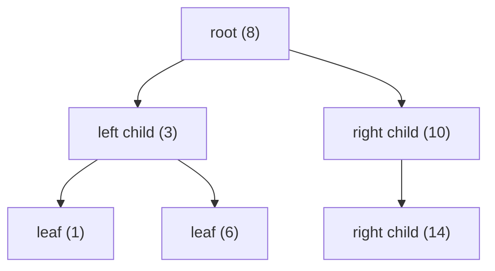

# Algorithms & LeetCode Glossary (Reviewer)

This is the shared vocabulary for the whole algorithms study suite — a plain-language dictionary of
every term the other reviewers use, written for someone who may be brand new to data structures and
algorithms as well as for someone who wants a quick, trustworthy refresher. Each entry gives a one
sentence definition, a short explanation with a tiny example or everyday analogy, why the term tends
to matter in interviews and exams, a "do not mix this up with..." note where two ideas are easy to
confuse, and a "See:" link to the reviewer that covers it in depth.

You do not read a glossary front to back. Terms here are linked from across the suite: when another
reviewer mentions, say, *amortized analysis* or *backtracking*, that phrase links here. Hover the
linked term anywhere to see the one-line definition in a tooltip; click it to land on the full entry
below. Use the Contents to jump to a category, or your browser's find to jump to a word. When two
closely related ideas are usually learned together (min-heap and max-heap, memoization and
tabulation), they share one entry so you see the contrast in one place.

Related: [Algorithm Patterns Index](algorithm-patterns-index-reviewer.md) · [Complexity & Big-O](complexity-and-big-o-reviewer.md) · [Recursion & Divide and Conquer](recursion-and-divide-and-conquer-reviewer.md)

## Contents
- [Complexity & math](#complexity--math)
- [Core data structures](#core-data-structures)
- [Trees & graphs](#trees--graphs)
- [Techniques & patterns](#techniques--patterns)
- [Sorting](#sorting)
- [LeetCode & interview meta](#leetcode--interview-meta)
- [General CS terms](#general-cs-terms)
- [How to use this glossary](#how-to-use-this-glossary)
- [References](#references)

---

## Complexity & math

### Algorithm
**An algorithm is a precise, finite sequence of steps that turns an input into a desired output.** It
is the recipe, independent of the programming language you write it in. "Sort these numbers
smallest-to-largest" is a goal; *merge sort* and *quicksort* are two different algorithms that achieve
it. A good algorithm is correct (it always produces the right answer) and efficient (it does not waste
time or memory). Interviews are almost entirely about choosing and writing the right algorithm for a
problem, so this is the root word of the whole field. Do not confuse an algorithm (the steps) with a
*data structure* (the way data is organized so those steps run fast) — you almost always pick the two
together.
See: [Algorithm Patterns Index](algorithm-patterns-index-reviewer.md)

### Data structure
**A data structure is a specific way of organizing data in memory so that the operations you need are
fast.** Different structures make different operations cheap: an array gives instant access by
position, a hash map gives instant lookup by key, a heap gives instant access to the smallest item.
Picking the structure that makes your *hot operation* (the one you repeat most) cheap is half of
solving a problem. For interviews, recognizing "I need O(1) membership checks, so reach for a hash
set" is a core skill. Do not confuse a data structure with an *algorithm*: the structure is the
filing cabinet, the algorithm is what you do with the files.
See: [Algorithm Patterns Index](algorithm-patterns-index-reviewer.md) · [Arrays & Hashing](arrays-and-hashing-reviewer.md)

### Big-O notation
**Big-O describes the upper bound on how an algorithm's cost grows as the input gets large, ignoring
constant factors and smaller terms.** Saying an algorithm is O(n^2) means "for big inputs, its work
grows at most like n-squared." We drop constants because `3n^2 + 100n + 7` and `n^2` scale the same
way once `n` is large. Almost every interview ends with "what's the time and space complexity?", and
Big-O is the language you answer in. Do not confuse Big-O (an upper bound) with *Big-Theta* (the
tight, exact growth class); in casual speech people say "O" but usually mean the tight bound. Also
called order-of-growth or asymptotic notation.
See: [Complexity & Big-O](complexity-and-big-o-reviewer.md)

### Big-Theta
**Big-Theta is the tight bound: it holds when an algorithm's growth is sandwiched between the same
function from above and below.** If something is both O(f(n)) and Omega(f(n)), it is Theta(f(n)) — the
exact growth class, not just a ceiling. For example, a single loop over `n` items is Theta(n): it
cannot be faster (you must touch each item) and is no slower. Exams care about the distinction because
quoting a loose O bound (calling a linear algorithm O(n^2)) is technically true but graded as
imprecise. Do not mix up Big-Theta (both bounds) with Big-O (upper only) or Big-Omega (lower only).
Written Θ(f(n)).
See: [Complexity & Big-O](complexity-and-big-o-reviewer.md)

### Big-Omega
**Big-Omega is the lower bound: it says an algorithm grows at least as fast as some function.** If
something is Omega(n), no input of size `n` can make it finish in fewer than roughly `n` steps. The
classic use is proving a problem is *inherently* hard — for instance, comparison-based sorting is
Omega(n log n), meaning no comparison sort can beat that. Interviews rarely ask for Omega directly,
but exams use it to state best-case behavior and impossibility results. Do not confuse Big-Omega (a
floor on growth) with Big-O (a ceiling). Written Ω(f(n)).
See: [Complexity & Big-O](complexity-and-big-o-reviewer.md)

### Time complexity
**Time complexity is how the number of steps an algorithm performs grows with the input size.** It is
expressed in Big-O: a single pass is O(n), a nested loop over the same data is O(n^2), repeatedly
halving is O(log n). You estimate it by counting loops and the work inside them, not by timing a
stopwatch — actual milliseconds depend on hardware, but time complexity is hardware-independent.
Estimating it *before* coding tells you whether your plan will pass the time limit. Do not confuse it
with *space complexity* (memory growth) — a fast algorithm can still use too much memory.
See: [Complexity & Big-O](complexity-and-big-o-reviewer.md)

### Space complexity
**Space complexity is how the extra memory an algorithm needs grows with the input size, beyond the
input itself.** A solution that builds a hash set of all `n` items uses O(n) extra space; one that
only keeps a couple of pointers uses O(1). A commonly forgotten contributor is the recursion *call
stack*: a recursion `n` levels deep costs O(n) space even if each level stores almost nothing.
Interviewers ask for it right after time complexity, and the time-versus-space trade-off (use more
memory to go faster, as in Two Sum's hash map) is a recurring theme. Do not confuse total space with
*auxiliary space* — see those entries.
See: [Complexity & Big-O](complexity-and-big-o-reviewer.md)

### Asymptotic analysis
**Asymptotic analysis studies how an algorithm behaves as the input grows toward infinity, which is
why we drop constants and lower-order terms.** "Asymptotic" means "what happens in the limit": for
huge `n`, `n^2` dwarfs `100n`, so `n^2 + 100n` is just O(n^2). This is the justification for all of
Big-O/Theta/Omega. It matters because two algorithms are compared by growth shape, not by who is
faster on a tiny test input. Do not over-apply it: for very small `n`, constant factors and the
"slower" algorithm can genuinely win — asymptotics only describe the large-input regime. Also called
asymptotics.
See: [Complexity & Big-O](complexity-and-big-o-reviewer.md)

### Constant time
**Constant time, O(1), means the cost does not depend on the input size at all.** Whether the array
has 10 or 10 million elements, `arr[5]` and `dict[key]` take the same fixed amount of work. Think of
grabbing a specific page of a book by page number versus flipping through every page. O(1) operations
are the building blocks of fast algorithms, and recognizing which structure gives O(1) for which
operation (hash lookup, array index, stack push) is essential. Do not confuse "constant time" with
"fast in absolute terms" — an O(1) operation with a huge constant can still be slow; it just does not
grow with `n`. Also called O(1).
See: [Complexity & Big-O](complexity-and-big-o-reviewer.md)

### Logarithmic time
**Logarithmic time, O(log n), means each step throws away a constant fraction of the remaining work,
so the count of steps is the logarithm of the input size.** Binary search on a million sorted items
finishes in about 20 comparisons because each comparison halves the range. The growth is agonizingly
slow — log2 of a billion is only about 30 — which is why O(log n) lookups feel almost free. It matters
because "sorted input, need O(log n)" is a direct cue for binary search or a balanced tree. Do not
confuse O(log n) (halving) with O(n) (touching everything); the difference is dramatic at scale. Also
called O(log n).
See: [Complexity & Big-O](complexity-and-big-o-reviewer.md) · [Binary Search](binary-search-reviewer.md)

### Linear time
**Linear time, O(n), means the work grows in direct proportion to the input size — roughly one unit of
work per element.** Reading every item once, a single loop, a two-pointer sweep, and a sliding window
are all O(n). If you double the input, you double the work. It matters because O(n) is the target for
large inputs (n up to a million) where anything quadratic times out, and many "optimal" solutions are
exactly one clever linear pass. Do not confuse O(n) with O(log n): a linear scan visits all `n` items,
while a logarithmic search visits only about log n of them. Also called O(n).
See: [Complexity & Big-O](complexity-and-big-o-reviewer.md)

### Linearithmic time
**Linearithmic time, O(n log n), is a linear pass repeated a logarithmic number of times — the speed
of a good comparison sort.** It shows up in divide-and-conquer that splits the input to depth log n
and does O(n) work merging at each level (merge sort), and in heap-based top-K. It is only slightly
slower than linear and scales comfortably to inputs of a million. It matters because "n up to 1e5"
usually means the intended solution is O(n log n), commonly "sort first, then sweep." Do not confuse
O(n log n) with O(n^2): for n = 1e6 the former is about 2e7 operations while the latter is 1e12 — the
difference between passing and timing out. Also called O(n log n).
See: [Complexity & Big-O](complexity-and-big-o-reviewer.md) · [Sorting Algorithms](sorting-algorithms-reviewer.md)

### Quadratic time
**Quadratic time, O(n^2), means the work grows like the square of the input — typically a nested loop
where the inner loop also runs `n` times.** Comparing every pair of elements is the classic source: n
items have about n^2/2 pairs. It is fine for small inputs (a few thousand) but explodes beyond that. It
matters because spotting an accidental O(n^2) (a `Contains` on a list inside a loop, say) and replacing
it with hashing or two pointers is one of the most common interview optimizations. Do not assume a
double loop is always O(n^2): if the inner loop runs over a *different*, independent size `m`, it is
O(n*m). Also called O(n^2).
See: [Complexity & Big-O](complexity-and-big-o-reviewer.md)

### Exponential time
**Exponential time, O(2^n), means adding one element roughly doubles the work — the cost of branching
into two choices per item.** Enumerating all subsets of `n` items is O(2^n) because each item is either
in or out. At n = 20 that is about a million (fine); at n = 50 it is astronomically large (hopeless).
It matters because a tiny constraint like "n <= 20" is itself a hint that an exponential
subset/bitmask approach is intended. Do not confuse O(2^n) (exponential, base raised to `n`) with
O(n^2) (polynomial, `n` raised to a fixed power) — they look similar but behave nothing alike.
Also called O(2^n).
See: [Complexity & Big-O](complexity-and-big-o-reviewer.md) · [Backtracking](backtracking-reviewer.md)

### Factorial time
**Factorial time, O(n!), is the cost of enumerating every possible ordering of `n` items.** There are
n! ways to arrange `n` distinct things, so generating all permutations is at least O(n!). It grows even
faster than exponential: 10! is about 3.6 million, but 13! already exceeds 6 billion. It matters
because "list all permutations / arrangements" is the cue, and the constraint will be tiny (often n
<= 10). Do not confuse O(n!) with O(2^n): factorial (orderings) grows faster than exponential
(subsets) for the same `n`. Also called O(n!).
See: [Complexity & Big-O](complexity-and-big-o-reviewer.md) · [Backtracking](backtracking-reviewer.md)

### Amortized analysis
**Amortized analysis is the average cost per operation across a worst-case sequence of operations — not
a probabilistic average.** A dynamic array's append is "O(1) amortized": most appends just write to a
free slot, and the rare resize that copies everything is so infrequent that, spread over all appends,
each one averages O(1). Over `n` appends the total copy work is `1 + 2 + 4 + ... < 2n`. It matters
because interviewers expect you to justify "append is O(1)" despite individual appends sometimes
costing O(n). Do not confuse amortized (a guarantee over any sequence, no probability) with
*average-case* (an expectation over a distribution of inputs). Also called amortized cost.
See: [Complexity & Big-O](complexity-and-big-o-reviewer.md)

### Recurrence relation
**A recurrence relation expresses an algorithm's running time in terms of the time it takes on smaller
inputs.** For recursive algorithms you write `T(n) = a * T(n/b) + f(n)`: `a` recursive calls each on
size `n/b`, plus `f(n)` non-recursive work this level. Merge sort is `T(n) = 2 T(n/2) + n`. You then
solve the recurrence (by the Master Theorem or by drawing a recursion tree) to get the Big-O. It
matters because analyzing any recursive solution starts here. Do not confuse the *combine* term `f(n)`
with the call count `a` — the combine term is what decides between O(n) and O(n log n) for the same
two-way split.
See: [Recursion & Divide and Conquer](recursion-and-divide-and-conquer-reviewer.md) · [Complexity & Big-O](complexity-and-big-o-reviewer.md)

### Master Theorem
**The Master Theorem is a formula that solves divide-and-conquer recurrences of the form `T(n) = a
T(n/b) + f(n)` by comparing the combine work `f(n)` against a watershed value `n^(log_b a)`.** If the
combine work is smaller, the leaves dominate (Case 1); if equal, you get an extra log factor (Case 2);
if larger, the top-level work dominates (Case 3). Merge sort lands in Case 2, giving Theta(n log n). It
matters because it lets you read off the complexity of recursive code without drawing the whole tree.
Do not over-trust it: it does not cover unequal-size subproblems or combine work that is not
polynomially comparable to the watershed — fall back to a recursion tree there. Also called the master
method.
See: [Complexity & Big-O](complexity-and-big-o-reviewer.md) · [Recursion & Divide and Conquer](recursion-and-divide-and-conquer-reviewer.md)

### In-place
**In-place means an algorithm transforms its input using only a constant amount of extra memory,
rearranging data within the original structure.** Reversing an array by swapping ends inward is
in-place: no second array needed, just a couple of index variables, so O(1) auxiliary space. It matters
because interviewers often add "do it in-place" as a constraint to rule out the easy
copy-into-a-new-array solution. Do not confuse "in-place" with "no variables at all" — a few O(1)
helper variables are still in-place; what matters is that the extra memory does not grow with `n`.
A subtle case: in-place quicksort still uses O(log n) stack space for recursion, so some authors call
it "in-place" loosely.
See: [Complexity & Big-O](complexity-and-big-o-reviewer.md) · [Sorting Algorithms](sorting-algorithms-reviewer.md)

### Auxiliary space
**Auxiliary space is the extra memory an algorithm allocates beyond the input, including temporary
arrays, hash sets, and the recursion call stack.** Merge sort needs an O(n) merge buffer, so its
auxiliary space is O(n); iterative binary search needs only a few variables, so O(1). "In-place" is
just the name for O(1) auxiliary space. It matters because space complexity questions usually mean
auxiliary space, and forgetting the call stack is the most common mistake. Do not confuse auxiliary
space (extra) with total space (extra plus the input itself); state which convention you are using if
it is ambiguous.
See: [Complexity & Big-O](complexity-and-big-o-reviewer.md)

### Call stack
**The call stack is the region of memory that tracks active function calls; each call pushes a frame
holding its local variables and return address, popped when the function returns.** When `f` calls `g`,
`g`'s frame sits on top of `f`'s until `g` finishes. Recursion piles frames as deep as the recursion
goes, which is why recursion depth equals stack space. It matters because the call stack is the
often-forgotten space cost of recursive solutions and the thing that overflows when recursion runs too
deep. Do not confuse the call stack (managed automatically by the runtime for function calls) with a
*stack* data structure you create yourself — though they share the LIFO idea.
See: [Recursion & Divide and Conquer](recursion-and-divide-and-conquer-reviewer.md) · [Complexity & Big-O](complexity-and-big-o-reviewer.md)

### Recursion depth and stack overflow
**Recursion depth is how many nested recursive calls are active at once; a stack overflow happens when
that depth exhausts the call stack's fixed memory and the program crashes.** Recursing once per element
on a list of a million items can blow the stack, because each pending call holds a frame. Balanced
divide-and-conquer keeps depth at O(log n) and is safe; linear recursion (`T(n-1)`) reaches depth `n`
and risks overflow on large inputs. It matters because an otherwise-correct recursive solution can
crash on big test cases, and the fix is often to convert it to iteration with an explicit stack. Do
not confuse depth (how deep the nesting goes, the space cost) with the total number of calls (which can
be far larger and is the time cost).
See: [Recursion & Divide and Conquer](recursion-and-divide-and-conquer-reviewer.md)

### Best, average, and worst case
**These describe how an algorithm's cost varies with the specific input: the luckiest input (best), a
typical input over some distribution (average), and the most punishing input (worst).** Linear search
is O(1) best (target is first), O(n) worst (target is last or absent). Quicksort is O(n log n) average
but O(n^2) worst on already-sorted input with a naive pivot. Interviews default to the *worst case*
unless told otherwise, because it is the guarantee you can promise. It matters because hash lookups are
the classic trap: O(1) average but O(n) worst when everything collides — say "average O(1)" out loud.
Do not confuse average-case (an expectation over inputs) with *amortized* (a guarantee over a sequence
of operations).
See: [Complexity & Big-O](complexity-and-big-o-reviewer.md)

### Monotonic
**Monotonic means consistently moving in one direction — either never decreasing or never increasing.**
A sorted-ascending array is monotonically non-decreasing; a pointer that only ever moves right is
monotonic. The word names a property algorithms exploit: if a condition flips from false to true
exactly once along a sorted range, that monotonic boundary is what binary search finds. A *monotonic
stack* keeps its elements in sorted order to answer "next greater element" questions. It matters
because spotting monotonicity unlocks binary search and the monotonic-stack pattern. Do not confuse
"monotonic" (one consistent direction) with "strictly sorted" — monotonic allows equal neighbors
(non-strict), strictly sorted does not.
See: [Binary Search](binary-search-reviewer.md) · [Stacks & Monotonic Stacks](stacks-and-monotonic-stacks-reviewer.md)

### Invariant
**An invariant is a condition that stays true at every step of an algorithm, used to argue the
algorithm is correct.** In binary search the invariant is "if the target exists, it lies within the
current `[lo, hi]` range"; each step preserves it while shrinking the range, so when the range is empty
you can conclude the target is absent. Loop invariants are the backbone of correctness proofs. It
matters because stating the invariant out loud both prevents off-by-one bugs and impresses an
interviewer. Do not confuse an invariant (always true during the run) with a postcondition (true only
when the algorithm finishes).
See: [Binary Search](binary-search-reviewer.md) · [Complexity & Big-O](complexity-and-big-o-reviewer.md)

### Integer overflow
**Integer overflow happens when a computed value exceeds the maximum a fixed-size integer type can
hold, silently wrapping around to a wrong (often negative) value.** A 32-bit `int` maxes out near 2.1
billion; `(lo + hi)` in binary search can overflow even when both fit, which is why you write `lo +
(hi - lo) / 2` instead. It matters because overflow is a sneaky source of wrong answers that passes
small tests and fails large ones, and interviewers plant it deliberately. Do not assume "the numbers
are small" — sums, products, and midpoints can overflow even when individual values are fine; reach for
a 64-bit `long` or overflow-safe arithmetic when in doubt.
See: [Math & Number Theory](math-and-number-theory-reviewer.md) · [Binary Search](binary-search-reviewer.md)

### Modulo and modular arithmetic
**The modulo operation gives the remainder after division, and modular arithmetic is doing math while
always taking that remainder so values stay within a fixed range.** `17 mod 5 = 2`; a clock does
modular arithmetic mod 12. Problems that ask for a huge count "modulo 1e9 + 7" want you to apply the
mod after each multiplication or addition so the running value never overflows. It matters because
large-count problems almost always require it, and using a wrapping index (`(i + 1) % n` for a circular
array) is a common trick. Do not assume `%` of a negative number is non-negative in every language —
in C# `-1 % 5` is `-1`, so add the modulus and mod again when you need a value in `[0, m)`.
See: [Math & Number Theory](math-and-number-theory-reviewer.md)

### GCD
**The greatest common divisor of two integers is the largest number that divides both without a
remainder.** GCD(12, 18) = 6. The Euclidean algorithm finds it fast by repeatedly replacing the larger
number with the remainder of dividing the two: GCD(a, b) = GCD(b, a mod b) until one becomes zero. It
matters because GCD underlies fraction reduction, LCM, and many number-theory problems, and the
Euclidean algorithm is a classic "do you know it cold?" question. Do not confuse GCD (greatest common
divisor, a *divisor* of both) with LCM (least common multiple, a *multiple* of both) — they are
related by `a * b = GCD * LCM`. Also called greatest common factor or HCF.
See: [Math & Number Theory](math-and-number-theory-reviewer.md)

### LCM
**The least common multiple of two integers is the smallest positive number that both divide evenly
into.** LCM(4, 6) = 12. You compute it from the GCD: `LCM(a, b) = a / GCD(a, b) * b` (divide before
multiplying to avoid overflow). Think of two gears with 4 and 6 teeth — they realign after 12 teeth
pass. It matters because LCM appears in scheduling, cycle-alignment, and fraction problems, and the
GCD-based formula is the expected way to compute it. Do not confuse LCM (a common *multiple*, always >=
the larger input) with GCD (a common *divisor*, always <= the smaller input). Also called lowest common
multiple.
See: [Math & Number Theory](math-and-number-theory-reviewer.md)

### Prime number
**A prime number is an integer greater than 1 whose only positive divisors are 1 and itself.** 2, 3, 5,
7, 11 are prime; 12 is not (it equals 3 x 4). To test whether `n` is prime you only need to check
divisors up to its square root, because any factor larger than the square root pairs with one smaller.
It matters because primality testing, prime factorization, and the *Sieve of Eratosthenes* are staple
number-theory topics. Do not forget the edge cases: 1 is *not* prime (only one divisor), and 2 is the
only even prime. A composite number is any integer above 1 that is not prime.
See: [Math & Number Theory](math-and-number-theory-reviewer.md)

### Sieve of Eratosthenes
**The Sieve of Eratosthenes finds all primes up to a limit `n` by marking the multiples of each prime
as composite, leaving the primes unmarked.** Start with all numbers candidate-prime; take 2, cross out
4, 6, 8, ...; take the next unmarked (3), cross out 6, 9, 12, ...; continue. What survives is the prime
list. It runs in about O(n log log n) time — far faster than testing each number individually. It
matters because "find all primes below N" problems expect the sieve, not repeated primality tests. Do
not confuse the sieve (precompute *all* primes in a range, great when you need many) with single-number
trial division (test *one* number, fine when you need just one).
See: [Math & Number Theory](math-and-number-theory-reviewer.md)

### Floor and ceiling
**Floor rounds a real number down to the nearest integer; ceiling rounds it up.** Floor(3.7) = 3,
Ceiling(3.2) = 4; for negatives, Floor(-1.5) = -2. Integer division in most languages already floors
toward zero for non-negatives, which is why `7 / 2 = 3`. A handy identity for positive integers is that
ceiling division equals `(a + b - 1) / b`. It matters because off-by-one bugs often trace to using
floor where you needed ceiling (computing the number of full pages for `n` items, say). Do not assume
language integer division equals mathematical floor for negatives — C# truncates toward zero, so `-7 /
2 = -3`, not -4.
See: [Math & Number Theory](math-and-number-theory-reviewer.md)

### Logarithm
**A logarithm answers "to what power must I raise the base to get this number?" — log base 2 of 8 is 3
because 2^3 = 8.** In algorithms the base is usually 2 because we repeatedly halve things, and log2 n
is roughly the number of times you can halve `n` before reaching 1. Logarithms grow extremely slowly,
which is the whole appeal of O(log n). It matters because every binary search, balanced tree, and heap
operation hides a logarithm. Do not worry about the base in Big-O: log2 n and log10 n differ only by a
constant factor, so all logarithms are the same complexity class. The inverse of a logarithm is
exponentiation.
See: [Complexity & Big-O](complexity-and-big-o-reviewer.md) · [Math & Number Theory](math-and-number-theory-reviewer.md)

### Exponentiation by squaring
**Exponentiation by squaring computes `base^exp` in O(log exp) multiplications by squaring the base and
halving the exponent instead of multiplying `exp` times.** To get `a^13`, note 13 in binary is 1101, so
`a^13 = a^8 * a^4 * a^1` — you square `a` to get a^2, a^4, a^8 and multiply in the ones you need. It
matters because naive repeated multiplication is O(exp), too slow for huge exponents, and modular
exponentiation (this technique with a mod at each step) is standard in number-theory and hashing
problems. Do not confuse the time (O(log exp)) with the result's size — the technique is about the
number of multiplications, not avoiding overflow, which is why you usually combine it with a modulus.
Also called fast exponentiation or binary exponentiation.
See: [Math & Number Theory](math-and-number-theory-reviewer.md)

### Number base (radix)
**A number base (or radix) is how many distinct digits a numeral system uses; each position is worth the
next power of that base.** Base 10 has digits 0-9, so the places are 1, 10, 100, ...; base 2 has only 0
and 1, so the places are 1, 2, 4, 8, ..., and binary `1011` is `8 + 2 + 1 = 11`. Computers use base 2
because a circuit is naturally on/off. It matters because binary intuition underlies bitmasks, and
"powers of 2" thinking is what makes logarithms and tree heights click. Do not confuse the *base* (how
many digits) with the *value* — the same quantity is written `1011` in base 2 and `11` in base 10.
See: [Math Basics](math-basics-reviewer.md) · [Bit Manipulation](bit-manipulation-reviewer.md)

### Factorial
**The factorial of `n`, written `n!`, is the product `n * (n-1) * ... * 1`, and it counts the number of
ways to order `n` distinct items.** `5! = 5 * 4 * 3 * 2 * 1 = 120`, and `0! = 1` by convention. It
matters because permutation counts are factorials, and `n!` grows faster than any exponential, so
"enumerate all orderings" is feasible only for tiny `n` (around 10) — itself a cue for backtracking. Do
not confuse the factorial *operation* (`n!`, a number) with *factorial time* O(n!) (a complexity class);
note also that `n!` overflows a 64-bit `long` past `20!`.
See: [Math Basics](math-basics-reviewer.md) · [Backtracking](backtracking-reviewer.md)

### Arithmetic sequence
**An arithmetic sequence has a constant difference between consecutive terms, and its sum is
`(first + last) * count / 2`.** `2, 5, 8, 11` is arithmetic (difference 3); its sum is
`(2 + 11) * 4 / 2 = 26`. The formula comes from pairing the smallest term with the largest. It matters
most for nested-loop analysis: `1 + 2 + ... + n = n(n+1)/2`, which is why a triangular double loop is
O(n^2). Do not confuse an arithmetic sequence (constant *difference*, add each step) with a *geometric*
sequence (constant *ratio*, multiply each step).
See: [Math Basics](math-basics-reviewer.md) · [Complexity & Big-O](complexity-and-big-o-reviewer.md)

### Geometric sequence
**A geometric sequence has a constant ratio between consecutive terms, and its sum is
`first * (ratio^n - 1) / (ratio - 1)` for ratio != 1.** `1, 2, 4, 8` is geometric (ratio 2); its sum is
`1 + 2 + 4 + 8 = 15 = 2^4 - 1`. It matters because a doubling sum is "one less than the next power,"
which counts the nodes of a perfect binary tree (`2^(h+1) - 1`) and shows the bottom level holds about
half of them. Do not confuse a geometric sequence (constant *ratio*, multiply) with an *arithmetic*
sequence (constant *difference*, add) — the giveaway is whether terms scale or step up evenly.
See: [Math Basics](math-basics-reviewer.md) · [Trees & Binary Search Trees](trees-and-binary-search-trees-reviewer.md)

## Core data structures

### Array
**An array is a fixed-size, contiguous block of memory holding elements of the same type, accessed
instantly by numeric position.** Because the elements sit side by side, the computer computes the
address of element `i` with simple arithmetic, giving O(1) access. The trade-off is rigidity: the size
is fixed at creation, and inserting in the middle means shifting everything after it (O(n)). It matters
because the array is the most fundamental structure and the substrate for hashing, heaps, and many DP
tables. Do not confuse a plain array (fixed size) with a *dynamic array* / list (grows automatically) —
in C# `int[]` is fixed, `List<int>` grows.
See: [Arrays & Hashing](arrays-and-hashing-reviewer.md)

### Dynamic array
**A dynamic array is a resizable array that grows automatically by allocating a larger backing array
and copying elements over when it fills up.** It usually doubles capacity on each resize, which makes
appending O(1) amortized even though an individual resize is O(n). C#'s `List<T>`, Java's `ArrayList`,
and Python's `list` are dynamic arrays. It matters because it is the default "growable sequence" you
reach for, and explaining why its append is O(1) amortized (geometric growth, copies sum to under 2n)
is a classic question. Do not confuse a dynamic array (fast random access by index, slow middle inserts)
with a *linked list* (slow random access, fast inserts given a node). Also called array list or vector.
See: [Arrays & Hashing](arrays-and-hashing-reviewer.md) · [Complexity & Big-O](complexity-and-big-o-reviewer.md)

### Index
**An index is the integer position of an element within a sequence, and "0-indexed" means the first
element is at position 0 while "1-indexed" means it is at position 1.** Most programming languages
(C#, Java, Python) are 0-indexed, so a length-`n` array has valid indices 0 through n-1. Math notation
and some problem statements are 1-indexed. It matters because mixing the two conventions is a top cause
of off-by-one errors and out-of-bounds crashes. Do not assume a problem's "the k-th element" is
0-indexed — read carefully; "first" usually means index 0 in code but position 1 in prose. Also called
position or subscript.
See: [Arrays & Hashing](arrays-and-hashing-reviewer.md)

### Pointer
**A pointer (or reference) is a value that refers to the location of another piece of data rather than
holding the data directly.** In low-level languages a pointer is a memory address; in C#/Java a
reference is the managed equivalent — a variable that "points at" an object. Following a pointer to get
the object it refers to is called dereferencing. In algorithm problems "pointer" often just means an
index variable walking an array, as in the two-pointer pattern. It matters because linked lists, trees,
and graphs are all built from nodes connected by references. Do not confuse a reference (points to an
object, can be reassigned to point elsewhere) with the object itself; reassigning the reference does
not change the object. Also called reference.
See: [Linked Lists](linked-lists-reviewer.md) · [Two Pointers](two-pointers-reviewer.md)

### Linked list
**A linked list is a chain of nodes where each node holds a value and a reference to the next node,
rather than storing elements contiguously.** To reach the 5th element you follow references from the
head through four nodes (O(n) access), but inserting or deleting a node — once you have a reference to
it — is O(1) because you only rewire a couple of links. Think of a treasure hunt where each clue points
to the next location. It matters because pointer-rewiring problems (reverse a list, detect a cycle,
merge two lists) are an interview staple. Do not confuse a linked list (no random access, cheap
splicing) with an array (O(1) random access, costly middle inserts).
See: [Linked Lists](linked-lists-reviewer.md)

### Singly and doubly linked list
**A singly linked list's nodes point only forward to the next node; a doubly linked list's nodes also
point backward to the previous node.** Singly lists are leaner (one reference per node) but you can only
traverse forward and cannot easily delete a node without its predecessor. Doubly lists cost an extra
reference per node but allow O(1) deletion given just the node and O(1) backward traversal — the basis
of a deque and an LRU cache. It matters because the choice affects which operations are O(1), a common
design question. Do not confuse the two: "remove this node in O(1)" is trivial in a doubly linked list
but needs the previous node in a singly linked one.
See: [Linked Lists](linked-lists-reviewer.md)

### Node
**A node is a single container in a linked structure that holds a value plus references to its
neighbors.** In a linked list a node has a value and a `next` reference; in a binary tree a node has a
value and `left`/`right` references; in a graph a node (vertex) tracks its edges. Nodes are the
building blocks you allocate and wire together. It matters because nearly every non-array structure
(lists, trees, tries, graphs) is "a node class plus the links between instances." Do not confuse a node
(the container holding the value and links) with the value it stores — two nodes can hold equal values
yet be distinct objects at different positions.
See: [Linked Lists](linked-lists-reviewer.md) · [Trees & Binary Search Trees](trees-and-binary-search-trees-reviewer.md)

### Dummy node
**A dummy node (or sentinel) is a placeholder node added before the real head of a list to remove
special-case handling for the first element.** When you build or modify a linked list, the head can
change (or the list can become empty), forcing awkward `if (head == null)` checks; a dummy node whose
`next` points at the real list lets you always work with `dummy.next` and return it at the end. It
matters because dummy-node tricks make list code dramatically cleaner and are an expected technique in
list problems. Do not confuse a dummy node (an extra node you add for convenience, never part of the
real data) with a real node — remember to return `dummy.next`, not `dummy`. Also called a sentinel node.
See: [Linked Lists](linked-lists-reviewer.md)

### Hashing
**Hashing turns a key of any type into a fixed-size integer (a hash code) used to decide where to store
or find the key in a table.** A good hash function spreads keys evenly so that lookups land in
different buckets. Hashing is what makes hash maps and hash sets answer "where is this key?" in O(1)
average time instead of scanning. It matters because the entire arrays-and-hashing pattern — frequency
counts, dedupe, "have I seen this?" — rests on it. Do not confuse the hash code (a number derived from
the key) with the key itself: different keys can produce the same hash code, which is a *collision* the
table must resolve.
See: [Arrays & Hashing](arrays-and-hashing-reviewer.md)

### Hash table
**A hash table is the underlying structure that stores key-based data in buckets chosen by a hash
function, giving O(1) average insert, lookup, and delete.** It is the engine inside both hash maps and
hash sets. When two keys hash to the same bucket (a collision), the table resolves it — typically by
chaining (a small list per bucket) or open addressing (probing for the next free slot). It matters
because understanding buckets, collisions, and load factor explains why hash operations are O(1)
average but O(n) worst. Do not confuse the hash table (the mechanism) with the hash map (the key-value
API built on it) or hash set (the keys-only API) — they share the same machinery.
See: [Arrays & Hashing](arrays-and-hashing-reviewer.md)

### Hash map
**A hash map stores key-value pairs and retrieves the value for a given key in O(1) average time using
hashing.** "Map the key to its value": a phone book maps names to numbers. In C# it is
`Dictionary<K,V>`, in Python `dict`, in Java `HashMap`. It matters because it is the single most useful
interview structure — counting frequencies, caching results, mapping values to indices (Two Sum), and
grouping all rely on it. Do not confuse a hash map (keys mapped to values, unordered) with a
*SortedDictionary* / balanced BST (keys kept in sorted order, O(log n) operations) — reach for the
sorted version only when you need ordering or range queries. Also called dictionary, associative array,
or map.
See: [Arrays & Hashing](arrays-and-hashing-reviewer.md)

### Hash set
**A hash set stores a collection of unique keys with O(1) average membership testing, but no associated
values.** It answers one question fast: "is this element present?" In C# it is `HashSet<T>`, in Python
`set`. Use it to dedupe a collection or to remember which items you have already seen during a single
pass. It matters because "have I seen this before?" is one of the most common subproblems, and a hash
set is the O(1) answer. Do not confuse a hash set (keys only, membership) with a hash map (keys *plus*
values) — if you need to remember something *about* each key (a count, an index), you want a map.
See: [Arrays & Hashing](arrays-and-hashing-reviewer.md)

### Hash collision
**A hash collision occurs when two different keys produce the same hash code (or land in the same
bucket), so the table must store both and tell them apart.** Collisions are unavoidable because there
are more possible keys than buckets (pigeonhole principle); good tables handle them with chaining or
probing. When too many keys collide, lookups degrade from O(1) toward O(n). It matters because
collisions are exactly why hash lookups are "O(1) *average*, O(n) worst" — the worst case is everything
colliding into one bucket. Do not confuse a collision (two keys, same bucket — handled, just slower)
with a bug — collisions are expected and resolved automatically; the table only slows down if there are
too many.
See: [Arrays & Hashing](arrays-and-hashing-reviewer.md)

### Load factor
**The load factor is the ratio of stored entries to available buckets in a hash table, controlling the
trade-off between memory and collision frequency.** A load factor of 0.75 means the table grows
(rehashes everything into a bigger array) once it is three-quarters full. Keeping it below a threshold
keeps collisions rare and operations near O(1). It matters because it explains why hash tables
occasionally pay an O(n) rehash (similar to a dynamic array's resize) and why they trade extra memory
for speed. Do not confuse load factor (how full the table is, a tuning knob) with capacity (the raw
number of buckets) — the load factor is entries divided by capacity.
See: [Arrays & Hashing](arrays-and-hashing-reviewer.md)

### Bucket
**A bucket is one slot in a hash table where keys that hash to the same location are stored together.**
The hash function maps each key to a bucket index; if several keys map to the same bucket, they share
it (as a small chained list, for example). Ideally each bucket holds zero or one key, keeping lookups
O(1). It matters because the bucket is where collisions live, and "what happens when keys share a
bucket?" is a common follow-up. Do not confuse a bucket in a hash table (collision slot) with *bucket
sort*'s buckets (ranges of values you distribute elements into before sorting) — same word, different
structures.
See: [Arrays & Hashing](arrays-and-hashing-reviewer.md)

### Key-value pair
**A key-value pair is a single entry in a map: a unique key together with the value it is associated
with.** In a frequency map the key is the item and the value is its count; in a cache the key is the
input and the value is the cached result. The key is what you look up by; the value is what you get
back. It matters because the key-value model is the mental picture behind every hash map and dictionary
problem. Do not confuse the key (the lookup handle, must be unique within the map) with the value (the
payload, can repeat across keys). In C# an entry is a `KeyValuePair<K,V>`.
See: [Arrays & Hashing](arrays-and-hashing-reviewer.md)

### Frequency map
**A frequency map is a hash map from each distinct item to how many times it appears.** Counting the
letters in "banana" gives `{b:1, a:3, n:2}`. You build it in one O(n) pass, incrementing the count for
each item, and then answer questions like "which element appears most?" or "are these two strings
anagrams?" in O(1) per query. It matters because frequency counting is one of the most common building
blocks across arrays, strings, and sliding-window problems. Do not confuse a frequency map (counts per
item, order ignored) with a *prefix sum* (running totals over positions) — both count, but one is keyed
by value and the other by index. Also called a counter or count map.
See: [Arrays & Hashing](arrays-and-hashing-reviewer.md)

### Stack
**A stack is a last-in-first-out (LIFO) collection: you add and remove only from the top.** Like a stack
of plates, the last plate you put on is the first you take off. The operations are push (add to top),
pop (remove from top), and peek (look at the top), all O(1). It matters because stacks model "most
recent unmatched" problems — bracket matching, undo, depth-first traversal, and the monotonic-stack
pattern. Do not confuse a stack (LIFO, take from the same end you added) with a *queue* (FIFO, take from
the opposite end). In C# use `Stack<T>`. Also called LIFO.
See: [Stacks & Monotonic Stacks](stacks-and-monotonic-stacks-reviewer.md)

### Queue
**A queue is a first-in-first-out (FIFO) collection: you add at the back and remove from the front.**
Like a line at a checkout, whoever arrived first leaves first. The operations are enqueue (add to back)
and dequeue (remove from front), both O(1). It matters because queues drive breadth-first search and
any "process in arrival order" task. Do not confuse a queue (FIFO, fair ordering) with a *stack* (LIFO,
most-recent-first) or a *priority queue* (serves by priority, not arrival order). In C# use `Queue<T>`.
Also called FIFO.
See: [Graphs](graphs-reviewer.md) · [Algorithm Patterns Index](algorithm-patterns-index-reviewer.md)

### Deque
**A deque (double-ended queue) lets you add and remove from both the front and the back in O(1).** It
generalizes both stack and queue: push/pop at either end. It is the workhorse behind the
sliding-window-maximum trick, where you keep a deque of candidate indices in decreasing order. It
matters because "maintain the max/min of a moving window" problems expect a monotonic deque for an O(n)
solution. Do not confuse a deque (both ends open) with a plain queue (front-remove, back-add only). In
C# `LinkedList<T>` offers double-ended operations. Pronounced "deck."
See: [Sliding Window](sliding-window-reviewer.md) · [Stacks & Monotonic Stacks](stacks-and-monotonic-stacks-reviewer.md)

### Priority queue
**A priority queue serves elements in order of priority rather than arrival, always giving you the
highest- (or lowest-) priority item next.** Think of an emergency room: the most urgent patient is
seen first regardless of arrival time. It is almost always implemented as a binary heap, giving
O(log n) insert and remove-top and O(1) peek-top. It matters because "repeatedly take the smallest /
largest," top-K, merge-K-sorted, and Dijkstra all need one. Do not confuse a priority queue (the
abstract "serve by priority" behavior) with a heap (the usual array-based implementation) — every heap
is a priority queue, but the priority queue is the interface. In C# it is `PriorityQueue<TElement,
TPriority>`.
See: [Heaps & Priority Queues](heaps-and-priority-queues-reviewer.md)

### Heap
**A heap is a tree-based structure that keeps the smallest (or largest) element instantly accessible at
its root, supporting O(log n) insert and remove-top.** It maintains a loose ordering — every parent is
smaller (or larger) than its children — which is weaker than a sorted array but enough to always know
the extreme. It is the standard way to implement a priority queue. It matters because top-K, streaming
median, and scheduling problems all lean on it. Do not confuse the heap data structure (priority
ordering) with "the heap" in memory management (the region where objects are allocated) — same word,
unrelated concepts. The usual implementation is a binary heap stored in an array.
See: [Heaps & Priority Queues](heaps-and-priority-queues-reviewer.md)

### Min-heap and max-heap
**A min-heap keeps the smallest element at the root; a max-heap keeps the largest at the root.** The
only difference is the comparison direction: a min-heap's parent is <= its children, a max-heap's parent
is >= its children. Which one you pick depends on what extreme you need fast. A neat trick: to find the
K *largest* elements, keep a *min*-heap of size K, so the smallest of your top-K is at the root and
easy to evict. It matters because choosing the wrong direction is a common bug, and the
"K-largest-needs-a-min-heap" inversion trips people up. Do not assume a language default: C#'s
`PriorityQueue` is a *min*-priority queue (lowest priority value dequeues first); negate priorities or
supply a comparer for max behavior.
See: [Heaps & Priority Queues](heaps-and-priority-queues-reviewer.md)

### Binary heap
**A binary heap is a heap implemented as a complete binary tree packed into an array, where a node at
index `i` has children at `2i+1` and `2i+2`.** Because the tree is complete (filled left to right with
no gaps), it maps perfectly onto a contiguous array with no wasted space and no node objects. Insert
sifts a new element up, remove-top moves the last element to the root and sifts it down — both O(log n).
It matters because it is the concrete structure behind nearly every priority queue, and the
index-arithmetic parent/child relationship is a common whiteboard question. Do not confuse a binary heap
(near-complete, only root ordering, array-backed) with a binary *search* tree (fully sorted left-to-right,
node-and-pointer based).
See: [Heaps & Priority Queues](heaps-and-priority-queues-reviewer.md)

### Complete binary tree
**A complete binary tree is one where every level is fully filled except possibly the last, which is
filled from left to right with no gaps.** This shape is exactly what lets a binary heap live in an
array: positions map to indices with no holes. A tree of `n` nodes that is complete has height about
log2 n. It matters because "complete" is the structural guarantee that makes heap index arithmetic
work and keeps the height logarithmic. Do not confuse complete (last level left-packed, the heap shape)
with *full* (every node has 0 or 2 children) or *perfect* (every level completely full) — these are
distinct tree-shape definitions exams like to test.
See: [Heaps & Priority Queues](heaps-and-priority-queues-reviewer.md) · [Trees & Binary Search Trees](trees-and-binary-search-trees-reviewer.md)

### Heapify
**Heapify is the process of restoring the heap ordering after an insert or removal by moving an element
up (sift-up) or down (sift-down) until parents and children are in the right order.** Sift-up bubbles a
too-small element toward the root after insertion; sift-down pushes a too-large element toward the
leaves after the root is removed. Building a heap from an arbitrary array by sifting down from the last
parent is O(n) — surprisingly, not O(n log n). It matters because the sift operations are the core of
every heap method, and the O(n) build-heap result is a favorite "gotcha" question. Do not confuse the
O(n) one-shot build (heapify the whole array) with inserting `n` elements one at a time (O(n log n)) —
they sound similar but differ. Also called sift up / sift down or bubble up / bubble down.
See: [Heaps & Priority Queues](heaps-and-priority-queues-reviewer.md)

### Abstract data type
**An abstract data type (ADT) is a data type defined purely by the operations it supports and how they behave, with no commitment to how it is built underneath.** It is the contract — the "what," not the "how." A *list* ADT promises operations like add, get, and remove; that same contract can be fulfilled by an array behind the scenes or by a linked list, and callers cannot tell the difference. Likewise an *associative array* (map) ADT promises "store a value under a key and fetch it back," and a hash table is one common implementation. It matters because interviewers test whether you can separate the interface you need from the structure you choose to back it. Do not confuse an abstract data type (the behavior/interface) with a *data structure* (the concrete memory layout that implements it).
See: [Hash Table Internals](hash-tables-reviewer.md) · [Algorithm Patterns Index](algorithm-patterns-index-reviewer.md)

### Collection
**A collection is a container object that groups many elements together so you can treat them as a single thing.** Lists, sets, queues, stacks, dictionaries, and trees are all collections — each just organizes its elements with different rules and different fast operations. Think of a shopping bag: instead of carrying twelve loose items, you hold one bag and the items travel together. It matters because almost every algorithm problem starts by loading data into the right collection (a hash set for fast membership, a queue for breadth-first order), and naming the collection you need is often the key insight. Do not confuse a collection (the whole container) with an *element* (one item inside it), and note that "collection" is the general family while "list," "set," and "map" are specific kinds.
See: [Algorithm Patterns Index](algorithm-patterns-index-reviewer.md) · [Arrays & Hashing](arrays-and-hashing-reviewer.md)

### Tombstone
**A tombstone is a special "deleted" marker left in a slot of an open-addressing hash table when an entry is removed, so that searches for other keys still work.** In open addressing, keys that collide are stored in nearby slots along a probe sequence; if you simply emptied a slot on deletion, a later lookup would hit that gap, conclude the key is absent, and stop early — even though the key sits just past the hole. The tombstone says "something was here, keep probing" while still being reusable for future inserts. The catch is that tombstones pile up over time, lengthen probe chains, and eventually force a full rehash to clean them out. It matters because "how do you delete from an open-addressed table?" is a classic follow-up that trips people up. Do not confuse a tombstone (a marker that keeps probe chains intact) with a truly empty slot (which signals "stop searching, the key is not here").
See: [Hash Table Internals](hash-tables-reviewer.md)

## Trees & graphs

### Tree
**A tree is a hierarchical structure of nodes connected by edges, with exactly one root and no cycles,
where each node has one parent (except the root) and any number of children.** A file system is a tree:
folders contain folders contain files. Because there are no cycles, there is exactly one path between
any two nodes. It matters because trees model hierarchy everywhere — parse trees, decision trees,
heaps, tries — and traversal is a fundamental skill. Do not confuse a tree (connected, no cycles, one
parent per node) with a general *graph* (may have cycles, multiple paths, multiple "parents"); a tree
is a special, restricted graph.
See: [Trees & Binary Search Trees](trees-and-binary-search-trees-reviewer.md)

### Binary tree
**A binary tree is a tree where every node has at most two children, conventionally called left and
right.** The two-child limit is what makes traversal patterns (preorder, inorder, postorder) and
recursion on trees so clean — each node splits into exactly two subproblems. It is the base shape for
binary search trees, heaps, and expression trees. It matters because most tree interview problems are
on binary trees, and recursive "process node, recurse left, recurse right" templates apply directly.
Do not confuse a binary tree (at most two children, no ordering rule) with a *binary search tree* (the
added rule that left < node < right) — every BST is a binary tree, but not vice versa.
See: [Trees & Binary Search Trees](trees-and-binary-search-trees-reviewer.md)

*Anatomy of a binary search tree: one root, each node with up to two children, and leaves at the bottom; here every left value is smaller and every right value larger than its parent.*

### Binary search tree
**A binary search tree (BST) is a binary tree with an ordering rule: for every node, all values in its
left subtree are smaller and all values in its right subtree are larger.** That rule lets you search,
insert, and delete in O(log n) on a balanced tree by going left or right at each step, just like binary
search on an array — and an inorder traversal visits the values in sorted order. It matters because BSTs
back ordered maps/sets (C#'s `SortedDictionary`/`SortedSet`) and "validate / search a BST" is a common
problem. Do not assume a BST is automatically balanced: inserting sorted data into a naive BST degrades
it to a linked list with O(n) operations — self-balancing variants (red-black, AVL) fix this.
See: [Trees & Binary Search Trees](trees-and-binary-search-trees-reviewer.md)

### Root
**The root is the single topmost node of a tree, the one with no parent, from which the entire structure
descends.** Every traversal and recursive tree algorithm starts at the root. In a heap the root holds
the minimum or maximum; in a BST it is the first node you compare against. It matters because "start at
the root" is the entry point for essentially every tree algorithm, and an empty tree (null root) is the
base case you must handle. Do not confuse the root (top, no parent) with a *leaf* (bottom, no children)
— they are opposite ends of the tree.
See: [Trees & Binary Search Trees](trees-and-binary-search-trees-reviewer.md)

### Leaf
**A leaf is a node with no children — the endpoint of a branch.** In a file-system tree the files (not
folders) are leaves; in a decision tree the leaves are the final outcomes. Recursion on trees usually
bottoms out at leaves (or at the null children just past them). It matters because many problems ask
specifically about leaves (sum of leaf values, depth of the shallowest leaf) and because leaves are
where recursive base cases trigger. Do not confuse a leaf (no children) with the *root* (no parent); a
single-node tree is simultaneously the root and a leaf.
See: [Trees & Binary Search Trees](trees-and-binary-search-trees-reviewer.md)

### Parent, child, and sibling
**In a tree, a parent is a node directly above another; that lower node is its child; two nodes sharing
the same parent are siblings.** The root is the only node with no parent; leaves are the only nodes with
no children. These family terms describe the immediate links — a parent connects to its children by
edges. It matters because traversal and tree-construction problems are described in this vocabulary
("return the parent of node X", "are these nodes siblings?"). Do not confuse parent/child (a direct,
one-level link) with *ancestor*/descendant (any number of levels up or down) — your grandparent is an
ancestor but not your parent.
See: [Trees & Binary Search Trees](trees-and-binary-search-trees-reviewer.md)

### Subtree
**A subtree is any node together with all of its descendants, treated as a tree in its own right.** The
left child of the root, plus everything hanging below it, is the root's left subtree. Recursive tree
algorithms work precisely because each child's subtree is a smaller version of the same problem. It
matters because the recursive template "solve the left subtree, solve the right subtree, combine" is
the heart of nearly every tree solution. Do not confuse a subtree (a node and *all* its descendants)
with a single child (just the one node directly below).
See: [Trees & Binary Search Trees](trees-and-binary-search-trees-reviewer.md)

### Height, depth, and level
**Depth is the distance from the root down to a node; height is the distance from a node down to its
deepest leaf; level groups all nodes at the same depth.** The root has depth 0; its children are at
depth 1 (level 1); a leaf's height is 0. The height of the whole tree is the height of its root. It
matters because balanced trees have height about log n (fast) while degenerate ones have height n
(slow), and many problems ask for max depth or specific levels. Do not mix up depth (measured downward
from the root) with height (measured upward from the leaves) — a node deep in the tree has large depth
but small height.
See: [Trees & Binary Search Trees](trees-and-binary-search-trees-reviewer.md)

### Balanced tree
**A balanced tree keeps its height close to the minimum (about log n) by ensuring no part of the tree
gets much deeper than another.** Self-balancing BSTs (red-black, AVL) rearrange nodes on insert/delete
to maintain this, guaranteeing O(log n) operations. The opposite, a degenerate tree, looks like a
linked list (height n) and gives O(n) operations. It matters because the O(log n) promise of a BST or
heap depends entirely on balance, and "what if the input is sorted?" is the standard way to expose an
unbalanced tree. Do not assume a plain BST is balanced — only self-balancing variants guarantee it;
inserting sorted keys into a naive BST produces the degenerate worst case.
See: [Trees & Binary Search Trees](trees-and-binary-search-trees-reviewer.md)

### Tree traversal
**Tree traversal is the act of visiting every node in a tree in a systematic order.** The main families
are depth-first (preorder, inorder, postorder — go deep before wide) and breadth-first (level-order — go
wide before deep). Which order you choose depends on the task: inorder on a BST yields sorted output,
level-order answers "process the tree layer by layer." It matters because almost every tree problem
reduces to "traverse in the right order and do something at each node." Do not confuse traversal *order*
(which node you visit when) with the *mechanism* (recursion or an explicit stack/queue) — the same order
can be produced either way.
See: [Trees & Binary Search Trees](trees-and-binary-search-trees-reviewer.md)

### Depth-first search
**Depth-first search (DFS) explores as far down one branch as possible before backtracking to try
another.** On a tree it dives to a leaf, then returns and explores the next branch; on a graph it does
the same while marking nodes visited to avoid revisiting. It is naturally recursive (or uses an explicit
stack) and uses O(depth) space. It matters because DFS underlies tree traversals, connectivity,
cycle detection, topological sort, and backtracking. Do not confuse DFS (go deep first, uses a stack /
recursion, finds *a* path) with BFS (go wide first, uses a queue, finds the *shortest* path in an
unweighted graph). Also called DFS.
See: [Graphs](graphs-reviewer.md) · [Trees & Binary Search Trees](trees-and-binary-search-trees-reviewer.md)

### Breadth-first search
**Breadth-first search (BFS) explores a structure level by level, visiting all neighbors at the current
distance before moving farther out.** It uses a queue: enqueue the start, then repeatedly dequeue a node
and enqueue its unvisited neighbors. Because it expands in rings of increasing distance, the first time
it reaches a node is via a shortest path (in an unweighted graph). It matters because "shortest path in
an unweighted graph" and "level-order traversal" both mean BFS. Do not confuse BFS (queue, level by
level, shortest unweighted path) with DFS (stack/recursion, deep first) — using DFS where BFS is needed
gives *a* path, not the shortest one. Also called BFS.
See: [Graphs](graphs-reviewer.md) · [Trees & Binary Search Trees](trees-and-binary-search-trees-reviewer.md)

### Preorder, inorder, and postorder
**These are the three depth-first orders for visiting a binary tree, differing only in when you process
the current node relative to its children.** Preorder is node-then-left-then-right (good for copying or
serializing a tree); inorder is left-then-node-then-right (yields sorted order on a BST); postorder is
left-then-right-then-node (good for deleting a tree or computing values that depend on children). It
matters because choosing the right order is often the whole trick — "give me the BST values in sorted
order" is just inorder. Do not confuse them by the child order (always left before right); only the
*position of the node visit* changes. The mnemonic: the prefix (pre/in/post) tells you when the node is
handled.
See: [Trees & Binary Search Trees](trees-and-binary-search-trees-reviewer.md)

### Level-order traversal
**Level-order traversal visits a tree's nodes one depth-level at a time, top to bottom and left to
right within each level.** It is breadth-first search applied to a tree, implemented with a queue:
process the current level's nodes while enqueuing their children for the next level. It matters because
"print the tree by levels," "right-side view," and "zigzag order" problems all build on it, and tracking
the queue size at the start of each level lets you group nodes by depth. Do not confuse level-order
(breadth-first, uses a queue) with the depth-first orders (preorder/inorder/postorder, use
recursion/a stack) — level-order is the odd one out.
See: [Trees & Binary Search Trees](trees-and-binary-search-trees-reviewer.md)

### Trie
**A trie is a tree where each path from the root spells out a string, so shared prefixes share nodes —
making prefix queries extremely fast.** Storing "cat", "car", and "card" shares the "ca" path; each node
typically has up to one child per alphabet letter, and a flag marks where a complete word ends. Looking
up a word or prefix of length L is O(L), independent of how many words are stored. It matters because
autocomplete, "words starting with...", and word-dictionary problems are exactly what tries solve. Do
not confuse a trie (branches by character, depth = string length, O(L) lookup) with a hash set of strings
(O(L) to hash but no prefix structure) — only the trie answers "all words with this prefix" efficiently.
Also called prefix tree; pronounced "try."
See: [Tries](tries-reviewer.md)

### Graph
**A graph is a collection of vertices (nodes) connected by edges, used to model arbitrary relationships
— including cycles and multiple connections.** A road map (cities and roads), a social network (people
and friendships), and course prerequisites are all graphs. Unlike a tree, a graph can have cycles,
disconnected pieces, and no notion of a single root. It matters because a huge class of problems
(shortest path, connectivity, scheduling, grids) are graph problems in disguise. Do not confuse a graph
(general, may have cycles) with a tree (a connected, acyclic graph with n-1 edges) — recognizing a grid
or a set of relationships *as* a graph is often the key insight.
See: [Graphs](graphs-reviewer.md)

### Vertex
**A vertex is a single node in a graph — one of the entities being connected.** Cities on a map, people
in a network, and cells in a grid are all vertices. Edges connect pairs of vertices. The number of
vertices is usually written `V`, and graph algorithm complexities are stated in terms of `V` and the
edge count `E` (for example, BFS/DFS is O(V + E)). It matters because the whole vocabulary of graphs
(degree, adjacency, connectivity) is defined relative to vertices. Do not confuse a vertex (the node /
entity) with an *edge* (the connection between two vertices). Also called a node.
See: [Graphs](graphs-reviewer.md)

### Edge
**An edge is a connection between two vertices in a graph, representing a relationship between them.** A
road between two cities, a friendship between two people, or a prerequisite link between two courses is
an edge. Edges can be directed (one-way) or undirected (mutual), and weighted (carrying a cost) or
unweighted. It matters because the number and nature of edges drive both the algorithm choice and the
complexity (O(V + E)). Do not confuse an edge (the link) with a vertex (the thing being linked), and
note that a weighted edge's weight is separate from whether it is directed — those are independent
properties.
See: [Graphs](graphs-reviewer.md)

### Directed and undirected
**In a directed graph edges have a direction (A to B does not imply B to A); in an undirected graph
edges go both ways.** A one-way street and a Twitter "follow" are directed; a two-way street and a
Facebook "friend" are undirected. The distinction changes everything downstream — reachability, cycle
detection, and topological sort only make sense with direction in mind. It matters because using the
wrong model (treating a one-way relationship as mutual) silently corrupts the answer. Do not confuse
directedness (does the edge have a one-way arrow?) with weightedness (does the edge carry a cost?) —
a graph can be any combination of the two. Directed graphs are also called digraphs.
See: [Graphs](graphs-reviewer.md)

### Weighted graph
**A weighted graph attaches a numeric cost (weight) to each edge, representing distance, time, or any
quantity to minimize or maximize.** Road maps weight edges by distance; flight networks by price. The
weight changes what "shortest path" means — fewest edges (BFS) versus least total weight (Dijkstra). It
matters because the presence of weights is the cue that switches you from plain BFS to a weighted
shortest-path algorithm. Do not confuse a weighted graph (edges carry costs, use Dijkstra/Bellman-Ford)
with an unweighted one (all edges equal, BFS finds the shortest path) — running BFS on a weighted graph
gives the fewest-hops path, not the cheapest.
See: [Graphs](graphs-reviewer.md)

### Adjacency list
**An adjacency list represents a graph as, for each vertex, a list of the vertices it connects to.** For
a graph with vertices 0, 1, 2, it might be `{0: [1, 2], 1: [2], 2: []}`. It uses O(V + E) space and lets
you iterate a vertex's neighbors directly, which is ideal for the sparse graphs common in practice (far
fewer edges than the maximum possible). It matters because it is the default graph representation for
BFS/DFS and most interview graph problems. Do not confuse an adjacency list (space O(V + E), great for
sparse graphs, listing neighbors is fast) with an adjacency matrix (space O(V^2), great for dense graphs
and O(1) edge-existence checks) — the choice hinges on graph density.
See: [Graphs](graphs-reviewer.md)

### Adjacency matrix
**An adjacency matrix represents a graph as a V-by-V grid where entry [i][j] records whether (or how
heavily) vertex i connects to vertex j.** Checking "is there an edge from i to j?" is O(1), but the
matrix always uses O(V^2) space even if there are few edges. It shines for dense graphs and constant-time
edge queries. It matters because the representation choice affects both space and which operations are
cheap. Do not confuse an adjacency matrix (O(V^2) space, O(1) edge lookup, best for dense graphs) with
an adjacency list (O(V + E) space, fast neighbor iteration, best for sparse graphs) — using a matrix for
a huge sparse graph wastes enormous memory.
See: [Graphs](graphs-reviewer.md)

### Degree and in-degree
**A vertex's degree is the number of edges touching it; in a directed graph, in-degree counts incoming
edges and out-degree counts outgoing ones.** A person with five friendships has degree 5; a webpage with
three inbound links has in-degree 3. In topological sort, vertices with in-degree 0 (no prerequisites)
are the ones you can process first. It matters because degree drives algorithms like Kahn's topological
sort (repeatedly remove in-degree-0 nodes) and signals structure (a degree-1 node is a graph "leaf").
Do not confuse in-degree (edges pointing *in*) with out-degree (edges pointing *out*) — in a course
graph, in-degree is "how many prerequisites does this course have."
See: [Graphs](graphs-reviewer.md)

### Connected component
**A connected component is a maximal group of vertices that are all reachable from one another, with no
connections to vertices outside the group.** A social network might split into several friend clusters
with no links between them — each cluster is a component. You count components by running BFS/DFS from
each unvisited vertex; each launch discovers one whole component. It matters because "count the islands,"
"number of friend groups," and "is the graph fully connected?" are all component-counting problems. Do
not confuse a connected component (a reachability group in an undirected graph) with a *strongly
connected component* (mutual reachability in a *directed* graph) — the directed version is stricter.
See: [Graphs](graphs-reviewer.md)

### Cycle
**A cycle is a path in a graph that starts and ends at the same vertex without reusing an edge,
indicating the structure loops back on itself.** Course A requiring B, B requiring C, and C requiring A
is a cycle — and an impossible schedule. Trees, by definition, have no cycles. Detecting cycles uses
DFS (a back-edge to an in-progress node) or union-find. It matters because cycle detection decides
whether a schedule is feasible, whether a graph is a tree or a DAG, and whether a linked list loops. Do
not confuse a cycle in a graph (a structural loop) with an *infinite loop* in code — though failing to
mark visited nodes while traversing a cyclic graph causes exactly that.
See: [Graphs](graphs-reviewer.md)

### DAG
**A DAG (directed acyclic graph) is a directed graph with no cycles — you can never follow the arrows
back to where you started.** Task dependencies, build systems, and course prerequisites form DAGs: the
arrows impose an order with no contradictions. Only a DAG can be topologically sorted. It matters
because recognizing "this is a DAG" unlocks topological sort and DAG-based dynamic programming, and a
cycle is exactly what makes those impossible. Do not confuse a DAG (directed *and* acyclic — both
required) with any directed graph; a directed graph with a cycle is not a DAG and cannot be topologically
ordered.
See: [Graphs](graphs-reviewer.md)

### Topological sort
**A topological sort is a linear ordering of a DAG's vertices such that every edge points from earlier to
later in the order — a valid sequence respecting all dependencies.** For course prerequisites it produces
an order in which to take the courses so you never take one before its prerequisite. Two standard methods
are Kahn's algorithm (repeatedly remove in-degree-0 vertices) and DFS post-order reversed. It matters
because scheduling, build-order, and "can all tasks be completed?" problems are topological sorts. Do not
attempt it on a graph with a cycle — a cycle means no valid order exists, and detecting that impossibility
is often part of the question. Only DAGs have topological orderings.
See: [Graphs](graphs-reviewer.md)

### Union-find
**Union-find (a disjoint-set data structure) tracks a collection of elements partitioned into groups,
supporting near-O(1) "which group is x in?" and "merge the groups of x and y."** Each group has a
representative; `find(x)` returns x's representative, `union(x, y)` merges two groups. With path
compression and union by rank it runs in near-constant amortized time. It matters because it is the go-to
for connectivity, counting components, cycle detection in undirected graphs, and Kruskal's MST. Do not
confuse union-find (great for *incremental* merging and membership, but cannot easily split groups) with
graph traversal (BFS/DFS) — union-find shines when edges arrive one at a time. Also called disjoint set
union or DSU.
See: [Graphs](graphs-reviewer.md)

### Path compression
**Path compression is the optimization in union-find that flattens the tree during a `find` by pointing
every node visited directly at the group's representative.** The first `find(x)` walks up the chain to
the root; on the way back it rewires each node straight to the root, so future lookups are nearly
instant. Combined with union by rank, it gives the famous near-constant (inverse-Ackermann) amortized
cost. It matters because without it, union-find degrades to O(n) per operation, and naming this
optimization is a common follow-up. Do not confuse path compression (flattens during find) with union by
rank/size (keeps the tree shallow during union) — they are two separate optimizations that work best
together.
See: [Graphs](graphs-reviewer.md)

### Shortest path
**The shortest path between two vertices is the route with the smallest total cost — fewest edges in an
unweighted graph, or least total weight in a weighted one.** The right tool depends on the graph: BFS for
unweighted, Dijkstra for non-negative weights, Bellman-Ford when negative weights are possible. It
matters because "minimum steps / cost to get from A to B" is one of the most common graph problems, on
explicit graphs and on grids. Do not use BFS on a weighted graph expecting the cheapest path — it returns
the fewest-edges path, which can be far more expensive; switch to Dijkstra when edges have unequal
weights.
See: [Graphs](graphs-reviewer.md)

### Dijkstra
**Dijkstra's algorithm finds the shortest paths from a source vertex to all others in a graph with
non-negative edge weights, by always expanding the closest unfinalized vertex next.** It uses a min-heap
(priority queue) keyed by tentative distance: pop the nearest vertex, finalize it, and relax its
neighbors' distances. With a binary heap it runs in O((V + E) log V). It matters because it is the
standard weighted shortest-path algorithm and a frequent hard-problem component. Do not run Dijkstra on a
graph with negative edge weights — its greedy "finalize the closest" assumption breaks; use Bellman-Ford
there. On unweighted graphs, plain BFS is simpler and equivalent.
See: [Graphs](graphs-reviewer.md)

### Flood fill
**Flood fill is the technique of spreading out from a starting cell to all connected cells that share a
property, like filling a bounded region with color.** The paint-bucket tool in an image editor is flood
fill: from the clicked pixel, recolor every same-colored neighbor reachable without crossing a boundary.
On a grid it is just BFS or DFS where the "graph" is cells and the "edges" are adjacency. It matters
because grid problems — counting islands, surrounded regions, connected blobs — are flood fill in
disguise. Do not forget to mark cells visited (or mutate them) as you go; without that, flood fill loops
forever on the same cells. It is the grid-shaped face of BFS/DFS.
See: [Graphs](graphs-reviewer.md)

### Minimum spanning tree
**A minimum spanning tree (MST) is the cheapest set of edges that connects every vertex of a connected,
undirected, weighted graph — exactly `V − 1` edges, no cycle, minimum total weight.** Picture wiring
several towns with the least total cable: every town must be connected (spanning) with no wasteful loop
(tree) at the lowest cost (minimum). Two greedy algorithms build it. **Kruskal** sorts all edges and
adds each one whose endpoints lie in different components, using union-find to detect the cycles it must
skip. **Prim** grows a single tree outward, repeatedly adding the lightest edge that leaves it, using a
min-heap exactly like Dijkstra. Both are O(E log V) and both rest on the **cut property**: the lightest
edge crossing any split of the vertices into two non-empty sides is always safe to include in some MST.
It matters because MST is a classic weighted-graph interview topic and the model for network design and
clustering. Do not confuse an MST with a shortest-path tree — Dijkstra minimizes distance *from a
source* to each vertex, while an MST minimizes *total edge weight* over the whole graph, so the two
trees are usually different.
See: [Graphs](graphs-reviewer.md)

### Fenwick tree and segment tree
**A Fenwick tree (binary indexed tree) and a segment tree are compact structures that answer range
queries on a *changing* array — both a range aggregate and a point update in O(log n) each.** They
exist because prefix sums answer a range sum in O(1) but cost O(n) to update; these structures accept a
log factor on the query so updates become cheap too. A **Fenwick tree** is a 1-indexed array where
`tree[i]` holds the sum of a block of length `i & -i` (its lowest set bit) ending at `i`; a query peels
that bit off down to 0 and an update adds it on past `n`, both O(log n). A **segment tree** is a binary
tree over index ranges (stored flat in `4n`), each node holding its range's aggregate; it is more
general — it handles min/max/gcd and range updates via lazy propagation, which a Fenwick tree cannot. It
matters whenever a problem mixes updates with range queries (LC 307 Range Sum Query Mutable, counting
inversions). Do not confuse the two: a Fenwick tree is smaller and faster but limited to invertible
aggregates like sum, while a segment tree is bigger but handles non-invertible aggregates (min/max) and
range updates. Reach for the Fenwick tree when sum + point-update is all you need.
See: [Segment Trees & Fenwick Trees](segment-tree-and-fenwick-reviewer.md)

### AVL tree
**An AVL tree is a self-balancing binary search tree that keeps every node's left and right subtree heights within 1 of each other, rotating after each insert or delete to guarantee O(log n) height, search, insert, and remove.** Named after inventors Adelson-Velsky and Landis, it stores a balance factor at each node and, the moment an insertion or deletion pushes that factor out of range, performs one or two rotations to restore balance. Imagine a librarian who reshelves immediately after every book is added so no aisle ever gets lopsided. It matters because it is the textbook answer to "how do you keep a BST from degenerating into a linked list," and exams love asking which rotation fixes a given imbalance. Do not confuse an AVL tree with a plain BST: a plain BST can degrade to O(n), while an AVL tree's strict balancing guarantees O(log n) — at the cost of more rotations on writes than a red-black tree.
See: [Balanced Trees & AVL](balanced-trees-and-avl-reviewer.md)

### Balance factor
**A node's balance factor is the height of its left subtree minus the height of its right subtree, and an AVL tree keeps this value in {−1, 0, +1} at every node.** A balance factor of 0 means both sides are equally tall, +1 means the left side is one taller, −1 means the right side is one taller; the instant some node reaches +2 or −2 (|bf| > 1), the tree performs a rotation to fix it. Think of it as a tilt gauge on each node — once a node tilts too far, you straighten it. It matters because reading balance factors is exactly how you decide which AVL rotation (left, right, left-right, or right-left) to apply, a staple of tree exams. Do not confuse the balance factor (a per-node height difference) with the tree's overall height — a tree can be tall yet perfectly balanced if every node's factor stays in range.
See: [Balanced Trees & AVL](balanced-trees-and-avl-reviewer.md)

### Tree rotation
**A tree rotation is a local, O(1) pointer rewiring — a left rotation or a right rotation — that changes a binary search tree's shape while preserving the in-order ordering of its values.** It takes a parent and one of its children and pivots them so the child moves up and the parent moves down, relinking the one subtree caught in the middle; only three pointers change. Picture two people on a seesaw trading places — their relative left-to-right order is unchanged, just the heights swap. It matters because rotation is the single mechanism that AVL and red-black trees use to rebalance, so "show the tree after a right rotation at node X" is a classic exam task. Do not confuse a rotation (a constant-time, height-fixing move that preserves sorted order) with a full re-build or re-sort of the tree — a rotation touches only a handful of nodes.
See: [Balanced Trees & AVL](balanced-trees-and-avl-reviewer.md)

### Red-black tree
**A red-black tree is a self-balancing binary search tree that colors each node red or black and enforces 5 invariants to keep its height within 2·log(n+1), guaranteeing O(log n) operations.** The rules — root is black, red nodes have black children, every root-to-null path has the same number of black nodes, and so on — together stop any path from being more than twice as long as another. Because its balance condition is looser than an AVL tree's, it does fewer rotations on inserts and deletes but can be a little taller. It matters because red-black trees back the ordered maps and sets in many standard libraries (C++ `std::map`, Java `TreeMap`), so "what balances `TreeMap`?" is a real interview question. Do not confuse a red-black tree (loose balance, fewer write rotations, slightly taller) with an AVL tree (strict balance, more write rotations, shorter and faster lookups) — the trade-off is write speed versus search speed.
See: [Balanced Trees & AVL](balanced-trees-and-avl-reviewer.md)

### Branching factor
**The branching factor is the number of children a node may have, also called its fan-out.** A binary tree has a branching factor of 2 — each node points to at most a left and a right child — while a B-tree node can have a branching factor of many (often hundreds), so each node fans out into a wide row of children. Picture a company org chart where one manager has 200 direct reports versus one with only 2: the wide chart is far shallower for the same number of people. It matters because a high branching factor is exactly what keeps a B-tree shallow over enormous data, so each search touches only a few disk pages. Do not confuse the branching factor (how many children per node, a width measure) with the tree's height (how many levels deep, a depth measure) — a larger branching factor is what drives the height down.
See: [B-Trees](b-trees-reviewer.md)

### Multiway tree
**A multiway tree is a tree whose nodes can each have more than two children — a high branching factor — generalizing the binary tree.** Where a binary tree caps each node at two children, a multiway tree lets a node fan out to many, which is how structures like B-trees and tries pack lots of keys or characters into a single wide node. Think of a table of contents where one chapter heading lists a dozen sub-sections directly beneath it rather than forcing them into a strict left/right split. It matters because the major disk-and-database trees (B-trees, B+ trees) and the string-indexing trie are all multiway trees, and exams contrast them with binary trees. Do not confuse a multiway tree (any node may have many children) with a binary tree (at most two children per node) — the binary tree is just the special case where the branching factor is fixed at 2.
See: [B-Trees](b-trees-reviewer.md)

### Separator key
**A separator key is a key stored in a B-tree's internal node that partitions its child subtrees into non-overlapping value ranges, so everything in child i falls between separator i−1 and separator i.** Each internal node holds an ordered row of separator keys interleaved with child pointers; to search, you scan the separators to find which gap your target lands in, then follow the one child pointer for that range. It is like the letter tabs on a card catalog drawer — "Ma–Mc" tells you exactly which slice of cards to open next. It matters because separator keys are what let a B-tree narrow a search to one child per level, giving its shallow O(log n) lookups, and "which child do we descend into?" is a common exam step. Do not confuse a separator key (a routing signpost in an internal node) with the actual data records, which in a B+ tree live only in the leaves.
See: [B-Trees](b-trees-reviewer.md)

### Underflow
**Underflow is the state in a B-tree — or any minimum-occupancy structure — where a node drops below its required minimum number of keys after a deletion, violating the structure's fill rule.** A B-tree of minimum degree t requires each non-root node to hold at least t−1 keys; remove a key and slip under that floor, and you must repair the node by either borrowing a key from an adjacent sibling (a rotation through the parent) or merging with a sibling into one fuller node. Think of a carpool lane that legally needs at least two riders: drop to one and you must either pick someone up or merge into a regular lane. It matters because handling underflow is the trickiest part of B-tree deletion and a frequent exam and interview question. Do not confuse underflow (too few keys, fixed by borrow or merge) with overflow (too many keys after an insert, fixed by splitting the node) — they are the opposite repairs.
See: [B-Trees](b-trees-reviewer.md)

## Techniques & patterns

### Brute force
**A brute-force solution tries every possibility directly, without any cleverness — correct but often too
slow.** Checking all pairs for a target sum (O(n^2)), trying every substring, or enumerating every subset
are brute force. It is valuable as a starting point: get a correct brute-force solution, state its
complexity, then optimize. It matters because interviewers often want you to begin with brute force
(showing you understand the problem) before improving it, and sometimes brute force is acceptable for
tiny constraints. Do not confuse "brute force" (tries everything, usually slow) with "wrong" — a brute
force is correct; it just may not meet the time limit. The opposite goal is the *optimal solution*.
See: [Algorithm Patterns Index](algorithm-patterns-index-reviewer.md)

### Optimal solution
**An optimal solution is one whose time and space complexity cannot be meaningfully improved for the
problem — the best achievable answer.** For Two Sum the optimal is O(n) with a hash map; you cannot do
better than reading the input once. Recognizing the optimal target (often hinted by the input
constraints) tells you when to stop optimizing. It matters because interviews reward reaching the optimal
complexity, and knowing the theoretical floor (e.g. comparison sorting cannot beat O(n log n)) keeps you
from chasing impossible speedups. Do not confuse "optimal" (best possible complexity for the problem)
with "fastest code" (low constant factors) — an optimal-complexity solution can still be tuned, and a
clever-looking solution can be sub-optimal.
See: [Algorithm Patterns Index](algorithm-patterns-index-reviewer.md)

### Two pointers
**The two-pointers technique uses two index variables that move through a sequence — often from opposite
ends toward the middle — to solve a problem in one linear pass.** On a *sorted* array, to find a pair
summing to a target, start one pointer at each end: if the sum is too big move the right pointer left, too
small move the left pointer right. This replaces an O(n^2) double loop with O(n). It matters because
sorted-array pair/triplet, palindrome checks, and in-place partitioning all use it. Do not confuse two
pointers (typically converging from both ends on sorted data, or a fast/slow pair) with a *sliding
window* (both pointers move the same direction, maintaining a contiguous range) — the window is a
specialized two-pointer variant.
See: [Two Pointers](two-pointers-reviewer.md)

### Fast and slow pointers
**The fast-and-slow-pointers technique (Floyd's cycle detection) advances one pointer two steps for every
one step of another, so they meet if and only if there is a cycle.** On a linked list, if the fast pointer
ever catches the slow one, the list loops; if fast reaches the end, it does not. The same idea finds a
list's middle (slow is at the midpoint when fast hits the end). It matters because cycle detection,
finding the cycle's start, and locating the middle are classic list problems solved in O(1) space this
way. Do not confuse fast/slow pointers (two speeds, same direction, for cycles/midpoints) with converging
two pointers (opposite ends, for sorted pairs). Also called Floyd's tortoise and hare.
See: [Linked Lists](linked-lists-reviewer.md) · [Two Pointers](two-pointers-reviewer.md)

### Sliding window
**The sliding-window technique maintains a contiguous range over an array or string, expanding and
shrinking it to track a property in a single O(n) pass.** For "longest substring without repeating
characters," grow the window's right edge while characters stay unique, and shrink the left edge when a
duplicate appears. Both pointers only ever move forward, so the total work is linear. It matters because
"longest/shortest contiguous subarray or substring with property X" is an extremely common cue. Do not
confuse a sliding window (contiguous range, both pointers move right) with two pointers converging from
both ends, and note that the window must be *contiguous* — for non-contiguous selections you need a
different pattern.
See: [Sliding Window](sliding-window-reviewer.md)

### Lower bound and upper bound
**In a sorted array, the lower bound is the first position where a target could be inserted to keep order
(first element >= target); the upper bound is the first position strictly greater than the target.** They
are binary-search variants: the gap between lower and upper bound is exactly the count of elements equal
to the target. C++ calls these `lower_bound`/`upper_bound`; you implement them by tweaking the comparison
in binary search. It matters because "first/last occurrence," "count of a value," and "insertion point"
problems are lower/upper-bound searches, and getting the boundary right avoids off-by-one bugs. Do not
confuse these search boundaries with the complexity-theory meanings of "lower bound" (Omega) and "upper
bound" (Big-O) — same words, unrelated to sorted arrays.
See: [Binary Search](binary-search-reviewer.md)

### Recursion
**Recursion is a technique where a function solves a problem by calling itself on smaller versions of the
same problem until reaching a trivial case.** Computing a factorial is recursive: `fact(n) = n *
fact(n-1)`, stopping at `fact(0) = 1`. Each call handles one piece and delegates the rest to itself. It
matters because trees, graphs, divide-and-conquer, backtracking, and many DP solutions are naturally
recursive. Do not write recursion without a *base case* that stops it, or it recurses forever and
overflows the stack; and remember every pending call costs stack space (O(depth)). Recursion can always
be rewritten as iteration with an explicit stack.
See: [Recursion & Divide and Conquer](recursion-and-divide-and-conquer-reviewer.md)

### Base case
**A base case is the condition under which a recursive function stops calling itself and returns a direct
answer.** In `fact(n)`, the base case is `n == 0` returning 1; in tree recursion it is usually `node ==
null`. Without a base case (or with one that is never reached), recursion never terminates and overflows
the stack. It matters because every recursive solution needs a correct base case, and a wrong or missing
one is the most common recursion bug. Do not confuse the base case (where recursion *stops*) with the
recursive case (where it *continues* by calling itself on a smaller input) — a correct recursion needs
both, and the recursive case must always make progress toward the base case.
See: [Recursion & Divide and Conquer](recursion-and-divide-and-conquer-reviewer.md)

### Divide and conquer
**Divide and conquer solves a problem by splitting it into smaller independent subproblems, solving each
(usually recursively), and combining their results.** Merge sort divides the array in half, sorts each
half, and merges them; binary search divides the range and recurses on one half. The complexity comes from
a recurrence solved by the Master Theorem. It matters because it is the strategy behind merge sort,
quicksort, quickselect, and many "solve halves and combine" problems. Do not confuse divide and conquer
(independent subproblems, combine results) with *dynamic programming* (overlapping subproblems, reuse
results) — the difference is whether the subproblems repeat.
See: [Recursion & Divide and Conquer](recursion-and-divide-and-conquer-reviewer.md)

### Memoization
**Memoization speeds up recursion by caching the result of each subproblem the first time it is computed,
so repeated calls return instantly from the cache.** Naive recursive Fibonacci recomputes `fib(3)` many
times (O(2^n)); storing each `fib(k)` in a dictionary the first time drops it to O(n). It is "top-down"
dynamic programming — you write the natural recursion and add a cache. It matters because it converts an
exponential recursion into a polynomial one with a one-line cache, a frequent optimization. Do not confuse
memoization (top-down: recursion plus a cache, computes only the subproblems it needs) with *tabulation*
(bottom-up: fill a table iteratively) — both are DP, differing in direction.
See: [Dynamic Programming](dynamic-programming-reviewer.md) · [Recursion & Divide and Conquer](recursion-and-divide-and-conquer-reviewer.md)

### Tabulation
**Tabulation is bottom-up dynamic programming: you fill a table of subproblem answers iteratively, from
the smallest cases up to the one you want, with no recursion.** For Fibonacci you start with `dp[0]` and
`dp[1]` and loop forward computing each `dp[i] = dp[i-1] + dp[i-2]`. Because you build from the base up,
every value a cell depends on is already filled. It matters because it avoids recursion's stack overhead
and often allows space optimization (keeping only the last few rows). Do not confuse tabulation (bottom-up
iteration, computes *all* subproblems in order) with *memoization* (top-down recursion, computes only
needed subproblems on demand) — pick bottom-up to avoid deep recursion, top-down when the recursion is
clearer.
See: [Dynamic Programming](dynamic-programming-reviewer.md)

### Dynamic programming
**Dynamic programming (DP) solves problems with overlapping subproblems by computing each subproblem once
and reusing the result, via either memoization (top-down) or tabulation (bottom-up).** The classic
examples — Fibonacci, knapsack, edit distance, longest increasing subsequence — all break into smaller
subproblems that recur. DP applies when the problem has *optimal substructure* and *overlapping
subproblems*. It matters because DP is where many "hard" verdicts live, and recognizing the two
properties is the trigger to use it. Do not confuse DP (overlapping subproblems, reuse answers) with
divide and conquer (independent subproblems) or with *greedy* (commit to a local choice without
reconsidering); DP explores and remembers, greedy decides and moves on.
See: [Dynamic Programming](dynamic-programming-reviewer.md)

### Optimal substructure
**Optimal substructure means an optimal solution to a problem can be built from optimal solutions to its
subproblems.** The shortest path from A to C through B is the shortest A-to-B path plus the shortest
B-to-C path — the whole optimum is composed of sub-optima. This is one of the two prerequisites for
dynamic programming (and for greedy). It matters because, without it, you cannot safely combine
subproblem answers, so DP and greedy would not apply. Do not confuse optimal substructure (sub-optima
compose into the global optimum) with *overlapping subproblems* (the same subproblem recurs) — DP needs
*both*; a problem can have one without the other.
See: [Dynamic Programming](dynamic-programming-reviewer.md)

### Overlapping subproblems
**Overlapping subproblems means the recursive breakdown of a problem keeps hitting the same smaller
subproblems repeatedly.** Naive Fibonacci recomputes `fib(2)` again and again; that repetition is the
overlap. Caching those repeated answers (memoization) or filling them once (tabulation) is what makes DP
pay off. It matters because overlapping subproblems is the signal that turns a slow recursion into fast
DP — if subproblems never repeat, DP buys nothing. Do not confuse overlapping subproblems (same
subproblem recurs, so caching helps — DP) with *independent* subproblems (each is distinct, caching
gives no benefit — divide and conquer). The presence of overlap is what separates DP from plain
recursion.
See: [Dynamic Programming](dynamic-programming-reviewer.md)

### State and state space
**A state is the minimal set of variables that fully describes a subproblem; the state space is the set of
all possible states.** In a DP over an array, the state might be "the best answer considering the first
`i` items with capacity `c` left" — captured by `(i, c)`. The size of the state space times the work per
state is the DP's complexity. It matters because correctly defining the state is the hardest and most
important step of any DP, and the state space size tells you immediately whether the DP will fit the time
limit. Do not confuse the state (the parameters that identify a subproblem) with the *value* stored for
that state (the subproblem's answer) — designing the state is the modeling work; the value is the result.
See: [Dynamic Programming](dynamic-programming-reviewer.md) · [Backtracking](backtracking-reviewer.md)

### Greedy
**A greedy algorithm builds a solution by always taking the choice that looks best right now, never
reconsidering past decisions.** To make change with fewest coins (in standard currencies), repeatedly take
the largest coin that fits. Greedy is simple and fast, but it is only *correct* when local optimality
guarantees global optimality. It matters because many "minimum number of..." and interval-scheduling
problems have clean greedy solutions — when they apply. Do not confuse greedy (commit to the local best,
never backtrack) with *dynamic programming* (explore all subproblems, reconsider). Greedy is correct only
when you can prove it with an *exchange argument*; when a choice can be regretted later, fall back to DP.
See: [Greedy](greedy-reviewer.md)

### Greedy-choice property
**The greedy-choice property holds when making the locally optimal choice at each step leads to a globally
optimal solution.** It is the formal condition that makes a greedy algorithm correct: you can always reach
an optimum by taking the greedy pick first and then solving the rest. Interval scheduling (always pick the
meeting that ends earliest) has it; the 0/1 knapsack does not. It matters because checking this property
(usually via an exchange argument) is how you decide whether greedy is safe or whether you must use DP. Do
not confuse the greedy-choice property (the local choice is safe — use greedy) with *optimal substructure*
(sub-optima compose — needed by both greedy and DP); greedy needs both, but the greedy-choice property is
the extra one that lets you avoid exploring alternatives.
See: [Greedy](greedy-reviewer.md)

### Exchange argument
**An exchange argument proves a greedy choice is optimal by showing that any optimal solution can be
transformed into the greedy one by swapping elements, without making it worse.** To prove "schedule the
earliest-finishing meeting first," you argue that any optimal schedule can have its first meeting swapped
for the earliest-finishing one without losing any meetings. It matters because it is the standard proof
technique for justifying greedy in an interview or exam — a greedy claim without a justification is a
guess. Do not confuse the exchange argument (a *proof* that greedy is correct) with the greedy algorithm
itself; the algorithm makes the choices, the exchange argument justifies that they are safe.
See: [Greedy](greedy-reviewer.md)

### Backtracking
**Backtracking systematically explores all candidate solutions by building them one choice at a time and
undoing ("backing out of") a choice as soon as it cannot lead to a valid solution.** Solving a maze,
generating all permutations, or placing N queens: you make a choice, recurse, and if it fails or you
finish exploring, you undo it and try the next option. It matters because "list/find all valid
configurations" with small constraints is the backtracking signature, and the choose-explore-unchoose
template is highly reusable. Do not confuse backtracking (enumerate *all* solutions, output is the set)
with *dynamic programming* (count or optimize over overlapping subproblems, output is a number/one
optimum). Backtracking is brute force made systematic, sped up by *pruning*.
See: [Backtracking](backtracking-reviewer.md)

### Pruning
**Pruning is cutting off branches of a search that cannot possibly lead to a valid or better solution,
avoiding wasted exploration.** In N-Queens, the moment two queens threaten each other you stop extending
that arrangement instead of filling the rest of the board. Pruning does not change the worst-case Big-O
but often makes an exponential search finish quickly in practice. It matters because naive backtracking is
too slow, and good pruning is what makes it pass. Do not confuse pruning (skip hopeless branches early, an
optimization within backtracking) with *memoization* (cache and reuse subproblem answers, the DP
optimization) — pruning discards work, memoization remembers it.
See: [Backtracking](backtracking-reviewer.md)

### Decision tree
**A decision tree is the conceptual tree of all the choices a backtracking or recursive algorithm could
make, with each node a partial solution and each branch a choice.** Generating subsets of {1,2,3} forms a
tree where at each level you decide whether to include the next element. Visualizing this tree is how you
reason about the number of leaves (the count of candidate solutions) and where to prune. It matters
because drawing the decision tree clarifies a backtracking problem's structure and complexity. Do not
confuse this algorithmic decision tree (the search space of choices) with a machine-learning decision tree
(a trained predictive model) — same name, entirely different context.
See: [Backtracking](backtracking-reviewer.md)

### Prefix sum
**A prefix sum array stores, at each position, the running total of all elements up to that point, so any
range sum becomes a single subtraction.** With prefix array `P`, the sum of elements from index `l` to `r`
is `P[r+1] - P[l]` — O(1) per query after an O(n) preprocessing pass. It matters because "many range-sum
queries on a static array" and "subarray sums to K" are textbook prefix-sum problems, turning repeated
O(n) sums into O(1) lookups. Do not confuse a prefix sum (cumulative totals for fast *range queries* on a
static array) with a *difference array* (records changes for fast *range updates*) — they are duals: one
optimizes queries, the other optimizes updates. Also called cumulative sum.
See: [Prefix Sums & Difference Arrays](prefix-sums-and-difference-arrays-reviewer.md)

### Difference array
**A difference array stores the change between consecutive elements, so adding a constant to a whole range
becomes just two O(1) updates instead of touching every element.** To add 5 to indices [l, r], you do
`diff[l] += 5` and `diff[r+1] -= 5`; a final prefix-sum pass reconstructs the actual array. It matters
because "apply many range-increment updates, then read the result" is its exact use case, turning O(n)
per update into O(1). Do not confuse a difference array (fast *range updates*, reconstruct at the end)
with a *prefix sum* array (fast *range queries* on static data) — they are inverse operations, and you
prefix-sum a difference array to recover the original values.
See: [Prefix Sums & Difference Arrays](prefix-sums-and-difference-arrays-reviewer.md)

### Monotonic stack
**A monotonic stack is a stack kept in sorted (always-increasing or always-decreasing) order, used to find
the next or previous greater/smaller element for every item in O(n).** As you scan, before pushing a new
element you pop all elements that violate the order; each popped element has just found its "next greater
(or smaller)" neighbor. Each element is pushed and popped at most once, so the whole scan is linear. It
matters because "next greater element," "daily temperatures," and "largest rectangle in a histogram" are
monotonic-stack problems. Do not confuse a monotonic stack (maintains order, for next-greater/smaller)
with a plain stack (no ordering, for matching/LIFO) — the monotonic discipline is what gives the O(n)
result.
See: [Stacks & Monotonic Stacks](stacks-and-monotonic-stacks-reviewer.md)

### Quickselect
**Quickselect finds the k-th smallest element in an unsorted array in O(n) average time, by partitioning
around a pivot and recursing into only the side that contains the answer.** It is quicksort that only
recurses on one half: after partitioning, if the pivot landed at position k you are done; otherwise recurse
left or right. Because it discards one side each step, the average work is n + n/2 + n/4 + ... = O(n). It
matters because "find the k-th largest/smallest" or "top K" can be done in O(n) average without fully
sorting (O(n log n)). Do not confuse quickselect (finds *one* order statistic, O(n) average) with
quicksort (sorts *everything*, O(n log n)); both share the partition step but recurse differently.
See: [Sorting Algorithms](sorting-algorithms-reviewer.md) · [Recursion & Divide and Conquer](recursion-and-divide-and-conquer-reviewer.md)

### Partition
**Partitioning rearranges an array around a chosen pivot value so that everything smaller comes before it
and everything larger comes after, leaving the pivot in its final sorted position.** It is the core step
of quicksort and quickselect, done in one O(n) pass with swaps. After partitioning, the pivot is exactly
where it belongs even though neither side is fully sorted. It matters because partition mechanics
(Lomuto and Hoare schemes) are common whiteboard questions and the engine behind quicksort's average
O(n log n). Do not confuse partitioning (arrange around a pivot, pivot ends up sorted) with fully sorting
(every element sorted) — one partition pass sorts exactly one element, the pivot.
See: [Sorting Algorithms](sorting-algorithms-reviewer.md)

### Pivot
**A pivot is the element chosen during partitioning that everything else is compared against and arranged
around.** Quicksort picks a pivot, partitions the array so smaller elements go left and larger go right,
then recurses on each side. The pivot choice determines balance: a median-like pivot gives balanced halves
(O(n log n)), while a worst-case pivot (the smallest or largest, common on already-sorted input) gives
lopsided splits and O(n^2). It matters because poor pivot selection is exactly why naive quicksort
degrades, and strategies like median-of-three or random pivots fix it. Do not confuse the pivot in
sorting (the comparison anchor) with a "pivot" in data analysis (reshaping a table) — unrelated uses.
See: [Sorting Algorithms](sorting-algorithms-reviewer.md)

### Kadane's algorithm
**Kadane's algorithm finds the maximum-sum contiguous subarray in O(n) by tracking, at each position, the
best subarray sum ending there.** At each element you decide: extend the previous best subarray, or start
fresh from the current element — whichever sum is larger; the overall answer is the maximum seen. For
`[-2, 1, -3, 4, -1, 2, 1]` it finds `[4, -1, 2, 1]` summing to 6. It matters because "maximum subarray
sum" (and its variants) is a classic, and Kadane is the elegant one-pass dynamic-programming solution. Do
not confuse it with a sliding window — Kadane handles negative numbers by *resetting* when the running sum
goes negative, which a fixed window does not do. It is essentially 1-D DP.
See: [Dynamic Programming](dynamic-programming-reviewer.md) · [Prefix Sums & Difference Arrays](prefix-sums-and-difference-arrays-reviewer.md)

### Bitmask
**A bitmask uses the individual bits of an integer to represent a set of yes/no flags or a subset of
elements compactly.** With `n` items, an `n`-bit integer can represent any subset: bit `i` set means item
`i` is included, so the integer `0b101` represents the subset {0, 2}. You test, set, and clear membership
with bitwise operations. It matters because bitmask DP (iterating over all `2^n` subsets as integers) is
the standard approach for "n <= 20" subset problems, and it is extremely fast and memory-compact. Do not
confuse a bitmask (a set of flags packed into one integer) with a *mask* used purely to extract bits — the
bitmask is specifically the "subset/flags as an integer" idea. Practical only for small `n` (around 20).
See: [Bit Manipulation](bit-manipulation-reviewer.md) · [Dynamic Programming](dynamic-programming-reviewer.md)

### Sweep line
**A sweep-line algorithm processes geometric or interval events in sorted order, as if a line sweeps across
them, updating a running state at each event.** For "maximum number of overlapping meetings," sort all
start and end times, then sweep left to right adding 1 at each start and subtracting 1 at each end,
tracking the running maximum. It matters because interval-overlap, skyline, and scheduling problems often
reduce to sorting events and sweeping once in O(n log n). Do not confuse a sweep line (process sorted
events, maintain a running count/structure) with brute-force interval comparison (check every pair,
O(n^2)) — the sweep is the efficient version. Closely related to interval merging.
See: [Intervals](intervals-reviewer.md)

### Binary search
**Binary search finds a target (or a boundary) in a sorted range by repeatedly halving the search interval, running in O(log n).** Look up a word in a dictionary: open to the middle, decide whether your word is before or after, and discard half the book; repeat until one page remains. A million-element search takes only about 20 comparisons. The same halving idea powers "binary search on the answer": when a yes/no feasibility test is monotonic (once true, it stays true), you binary-search the smallest value that passes — useful for "minimum capacity," "smallest divisor," and "max distance" optimization questions. It matters because boundary/insertion-point and minimize-the-maximum problems are everywhere, and the off-by-one details are a classic interview filter. Do not confuse binary search (the data or the predicate is sorted/monotonic) with linear scan, which works on unsorted input but costs O(n).
See: [Binary Search](binary-search-reviewer.md)

### Boyer-Moore
**Boyer-Moore is a fast substring search that scans the pattern window right-to-left and uses a bad-character (and optionally good-suffix) skip table to jump ahead many positions on a mismatch.** Because it aligns the pattern's end first, a single mismatched letter that does not appear in the pattern lets it skip the whole window at once — sublinear ~O(n/m) in the best case, O(n) on average, but O(n·m) in the adversarial worst case. Searching "EXAMPLE" in a long text, a mismatch on a rare character shifts the window forward by the pattern's full length. Its simplified Boyer-Moore-Horspool variant keeps only the bad-character rule for a smaller, simpler table. It matters because Boyer-Moore is the practical default for single-pattern text search (grep-style tools lean on it). Do not confuse it with KMP, which scans left-to-right and trades raw speed for a guaranteed linear worst case.
See: [String Searching](string-searching-reviewer.md)

### KMP
**KMP (Knuth-Morris-Pratt) is a substring search that preprocesses the pattern into a prefix/failure table and scans the text left-to-right without ever re-examining a text character, guaranteeing O(n + m).** When a mismatch happens, the failure table says how far the pattern can shift based on the prefix it has already matched, so the text pointer never moves backward. Matching "ABABC" against "ABABAB...", a mismatch reuses the "ABAB" already seen instead of restarting from scratch. It matters because KMP is the textbook answer when an interviewer wants a strict linear-time guarantee even on adversarial input. Do not confuse KMP (left-to-right, no backtracking, guaranteed O(n + m)) with Boyer-Moore (right-to-left, often faster in practice, but no linear worst-case guarantee).
See: [String Searching](string-searching-reviewer.md)

### Rabin-Karp
**Rabin-Karp is a substring search that compares each text window to the pattern by a rolling hash, doing the slow character-by-character check only when the hashes match.** Instead of comparing every window letter by letter, it fingerprints each window with a number and matches numbers; on the rare hash collision it confirms with a direct comparison. Hunting for a quote inside many documents, you compute the quote's hash once and slide a same-width hash across the text. It runs in O(n + m) on average and shines for multi-pattern search and fingerprinting/plagiarism detection, since many patterns can share one pass. It matters because "find these K phrases" and "detect duplicate substrings" cues point straight at it. Do not confuse Rabin-Karp (hash-and-verify, average-case linear) with KMP or Boyer-Moore, which compare characters directly with no hashing.
See: [String Searching](string-searching-reviewer.md)

### Rolling hash
**A rolling hash is a hash of a fixed-width window that updates in O(1) as the window slides — subtract the leaving character's contribution and add the entering one — instead of recomputing the whole window from scratch.** Think of a 5-digit odometer-style number over the text: shifting one position drops the highest digit and appends a new low digit in constant time. This is what makes Rabin-Karp's per-window work cheap, turning an O(n·m) recompute into O(n) overall. It matters because rolling hashes also power "longest duplicate substring" and many sliding-substring problems where you need a quick window fingerprint. Do not confuse a rolling hash (a comparison shortcut that may collide, so matches must be verified) with a checksum used for integrity — here a hash match is only a hint, not a proof.
See: [String Searching](string-searching-reviewer.md)

### Pattern
**In string searching, the pattern is the short string of length m you are looking for inside a longer text of length n, with m ≤ n; it is also called the needle or the search string.** When you Ctrl-F for "cat" in an article, "cat" is the pattern and the article is the text. Algorithms like KMP, Boyer-Moore, and Rabin-Karp all preprocess this pattern (a failure table, a skip table, or a hash) before scanning the text. It matters because problem statements and APIs constantly split inputs into pattern versus text, and mixing them up flips the whole algorithm. Do not confuse the pattern (the needle, what you search for) with the text (the haystack, what you search through) — the pattern is the smaller one.
See: [String Searching](string-searching-reviewer.md)

### Set algebra
**Set algebra is the four operations that combine two sets: union (elements in either), intersection (elements in both), difference (in the first but not the second), and symmetric difference (in exactly one).** Given fans of cats {Ann, Bo} and dogs {Bo, Cy}, union is {Ann, Bo, Cy}, intersection is {Bo}, difference cats−dogs is {Ann}, and symmetric difference is {Ann, Cy}. With a hash set these run in roughly linear time by membership tests. It matters because "common elements," "items in A but not B," and deduplication questions are set-algebra in disguise, and naming the operation clarifies your approach. Do not confuse difference (asymmetric — A−B differs from B−A) with symmetric difference (the elements neither set shares with the other, the same regardless of order).
See: [Sets & Set Algorithms](sets-and-set-algorithms-reviewer.md)

## Sorting

### Comparison sort
**A comparison sort orders elements solely by comparing pairs of them (asking "is a < b?"), and no such
sort can beat O(n log n) in the worst case.** Merge sort, quicksort, heap sort, and insertion sort are all
comparison sorts. The O(n log n) floor is a proven lower bound: there are n! possible orderings, and each
comparison only distinguishes two, so you need at least log2(n!) ≈ n log n comparisons. It matters because
it sets the speed limit for general-purpose sorting and explains why faster sorts must avoid comparisons.
Do not confuse comparison sorts (general, O(n log n) floor) with non-comparison sorts (counting, radix,
bucket — can be O(n) but only for bounded/structured keys, not arbitrary data).
See: [Sorting Algorithms](sorting-algorithms-reviewer.md)

### Stable sort
**A stable sort preserves the relative order of elements that compare equal.** If two records have the same
sort key, a stable sort keeps them in their original input order; an unstable sort may swap them. This
matters when sorting by multiple keys in passes (sort by name, then stably by age, and equal-age people
stay name-sorted). It matters because some problems require stability, and knowing which sorts are stable
(merge sort: yes; heap sort and typical quicksort: no) is a common question. Do not confuse stability
(equal elements keep their order) with correctness — an unstable sort still sorts correctly; it just may
reorder ties. C#'s `Array.Sort` is not stable; `OrderBy` (LINQ) is.
See: [Sorting Algorithms](sorting-algorithms-reviewer.md)

### In-place sort
**An in-place sort rearranges the elements within the original array using only O(1) (or O(log n))
auxiliary memory, rather than building a separate sorted copy.** Quicksort, heap sort, and insertion sort
are in-place; standard merge sort is not, because its merge step needs an O(n) buffer. It matters because
"sort in O(1) extra space" rules out merge sort and points to heap or in-place quicksort, a common
constraint. Do not confuse in-place sort (sorts the array itself, minimal extra memory) with stability
(preserving equal-element order) — they are independent properties; a sort can be in-place but unstable
(quicksort) or stable but not in-place (merge sort).
See: [Sorting Algorithms](sorting-algorithms-reviewer.md)

### Counting sort
**Counting sort orders integers in a small known range by counting how many times each value appears, then
emitting them in order — achieving O(n + k) for `n` items in a range of size `k`.** To sort exam scores
0-100, tally each score's count, then walk the tally from low to high. It beats the O(n log n) comparison
floor because it never compares elements; it indexes by value instead. It matters because "sort values in
a small bounded range" can be O(n), and counting sort is the stable subroutine inside radix sort. Do not
use counting sort when the value range `k` is huge (e.g. arbitrary 64-bit integers) — the count array
would be enormous; it only wins when `k` is comparable to `n`.
See: [Sorting Algorithms](sorting-algorithms-reviewer.md)

### Radix sort
**Radix sort orders numbers (or fixed-length strings) digit by digit, using a stable counting sort on each
digit from least to most significant.** Sorting `[170, 45, 75, 90]` first by ones digit, then tens, then
hundreds, leaves them fully sorted — because each pass is stable, earlier-digit order survives. It runs in
O(d * (n + k)) for `d` digits, effectively O(n) when `d` is small. It matters because it sorts large sets
of bounded-width integers faster than comparison sorts. Do not confuse radix sort (multiple stable
counting-sort passes over digits, O(n)-ish) with a single counting sort (one pass over the whole value,
needs the full range to be small) — radix breaks a big range into manageable digit-sized chunks.
See: [Sorting Algorithms](sorting-algorithms-reviewer.md)

### Bucket sort
**Bucket sort distributes elements into several buckets by value range, sorts each bucket, then
concatenates them — fast when the data is spread evenly across the range.** To sort numbers in [0, 1),
drop each into one of `n` buckets by its leading digits, sort each small bucket, and read them out in
order. With uniform data it averages O(n). It matters because uniformly distributed floating-point data is
its sweet spot, and it is a common "can you beat O(n log n)?" answer. Do not confuse bucket sort (range
buckets, then sort within each) with counting sort (one bucket per exact value, no inner sort); bucket
sort's performance degrades to O(n^2) if all elements clump into one bucket.
See: [Sorting Algorithms](sorting-algorithms-reviewer.md)

### Merge step
**The merge step combines two already-sorted sequences into one sorted sequence by repeatedly taking the
smaller front element — the heart of merge sort.** With two pointers, one at the front of each sorted half,
you compare the fronts, copy the smaller into the output, and advance that pointer; this is O(n) for `n`
total elements. It matters because the merge is what makes merge sort O(n log n) (O(n) merge at each of
log n levels) and the same "merge sorted runs" idea solves "merge K sorted lists." Do not confuse the
merge step (combining *sorted* inputs, linear) with sorting from scratch — merging only works because the
inputs are already in order.
See: [Sorting Algorithms](sorting-algorithms-reviewer.md)

### Introsort
**Introsort (introspective sort) is a hybrid that starts with quicksort but switches to heap sort if the
recursion gets too deep, guaranteeing O(n log n) worst case while keeping quicksort's speed in practice.**
It also falls back to insertion sort for tiny subarrays where simple sorts are fastest. C#'s `Array.Sort`
and C++'s `std::sort` use introsort. It matters because it explains how production sorts avoid quicksort's
O(n^2) worst case without giving up its cache-friendly average performance. Do not confuse introsort (a
practical hybrid, the real-world default) with plain quicksort (great average, O(n^2) worst on adversarial
input) — introsort's whole point is to cap that worst case. Also called introspective sort.
See: [Sorting Algorithms](sorting-algorithms-reviewer.md)

## LeetCode & interview meta

### LeetCode
**LeetCode is a popular online platform hosting thousands of coding problems used to practice for
technical interviews, each with an automated judge that runs your solution against hidden test cases.**
Problems are tagged by topic and difficulty (Easy/Medium/Hard) and referenced by number and title, like
"LC 1 — Two Sum." This study suite mirrors LeetCode's pattern-based approach. It matters because most
software interviews draw from this style of problem, and pattern recognition across LeetCode problems is
the core skill being trained. Do not treat it as a memorization race — the goal is recognizing which
*pattern* a new problem belongs to, not recalling specific solutions. Often abbreviated LC.
See: [Algorithm Patterns Index](algorithm-patterns-index-reviewer.md)

### LC number
**An LC number is the unique identifier LeetCode assigns each problem, used to reference it unambiguously
— "LC 704" is Binary Search.** Because titles can be similar, the number is the precise handle; this suite
writes problems as "LC <number> — Title." It matters only as shorthand: it lets reviewers and discussions
point at a specific problem without ambiguity. Do not read meaning into the number's size — a low number
means it was added early, not that it is easier; difficulty is a separate Easy/Medium/Hard label. Also
written LeetCode number.
See: [Algorithm Patterns Index](algorithm-patterns-index-reviewer.md)

### Subarray, subsequence, and substring
**A subarray (or substring, for strings) is a contiguous slice of the original; a subsequence keeps the
original order but may skip elements.** From `[1, 2, 3]`: `[2, 3]` is a subarray (contiguous); `[1, 3]` is
a subsequence (skips 2) but not a subarray. "Substring" is the string version of "subarray" (contiguous
characters). It matters because the single word in a problem statement dictates the pattern: "subarray /
substring" suggests sliding window or prefix sums, while "subsequence" suggests dynamic programming. Do not
mix them up — solving a subsequence problem with a contiguous-window approach (or vice versa) gives wrong
answers. Contiguous is the dividing line.
See: [Sliding Window](sliding-window-reviewer.md) · [Dynamic Programming](dynamic-programming-reviewer.md)

### Permutation
**A permutation is an arrangement of elements in a specific order; the number of permutations of `n`
distinct items is n!.** The permutations of {1, 2, 3} include (1,2,3), (1,3,2), (2,1,3), and so on — order
matters, so (1,2,3) and (2,1,3) are different. Generating all permutations is a classic backtracking
exercise. It matters because "all orderings / arrangements" problems are permutations, instantly capping
feasible `n` near 10 because n! explodes. Do not confuse a permutation (order matters, n! of them) with a
*combination* (order does not matter, fewer of them) — picking 2 of {a,b,c} gives 6 permutations (ab, ba,
ac, ...) but only 3 combinations (ab, ac, bc).
See: [Backtracking](backtracking-reviewer.md)

### Combination
**A combination is a selection of elements where order does not matter — choosing *which* items, not in
what sequence.** From {a, b, c}, the 2-combinations are {a,b}, {a,c}, {b,c}: {a,b} and {b,a} are the same
combination. The count is "n choose k." Generating combinations is a standard backtracking template (only
move forward to avoid duplicates). It matters because "choose k items," "all combinations summing to a
target," and similar prompts are combination problems. Do not confuse a combination (order ignored, fewer
results) with a *permutation* (order matters, more results) — the giveaway is whether reordering the same
elements counts as a new answer.
See: [Backtracking](backtracking-reviewer.md)

### Subset
**A subset is any selection of elements from a set, including the empty set and the full set; a set of `n`
elements has 2^n subsets.** From {1, 2}: the subsets are {}, {1}, {2}, {1, 2}. Each element is
independently in or out, which is why the count is 2^n and why subsets map perfectly onto *bitmasks*.
Generating all subsets ("the power set") is a core backtracking template. It matters because "all
subsets / power set" problems and bitmask DP both rest on this, and the 2^n count caps `n` near 20. Do
not confuse a subset (any selection, order irrelevant, includes empty and full) with a *combination* of
fixed size k (subsets are all sizes at once; a combination fixes the size).
See: [Backtracking](backtracking-reviewer.md) · [Bit Manipulation](bit-manipulation-reviewer.md)

### Palindrome
**A palindrome is a sequence that reads the same forwards and backwards.** "racecar" and "level" are
palindromes; so is the number sequence [1, 2, 1]. You check one in O(n) with two pointers moving inward
from both ends, comparing as they go. It matters because palindrome checks, "longest palindromic
substring," and "valid palindrome after deleting a character" are common string problems blending two
pointers and dynamic programming. Do not confuse checking a palindrome (two pointers, O(n)) with finding
the *longest palindromic substring* (often DP or expand-around-center, more work) — the simple check is
just one ingredient of the harder problems.
See: [Two Pointers](two-pointers-reviewer.md)

### Anagram
**Two strings are anagrams if one is a rearrangement of the other — same characters with the same
counts, in any order.** "listen" and "silent" are anagrams. You test it by comparing character-frequency
maps (or by sorting both strings): equal counts means anagram. It matters because "valid anagram" and
"group anagrams" are classic frequency-map / hashing problems, and the frequency-map approach is O(n)
versus O(n log n) for sorting. Do not confuse an anagram (same multiset of characters, order differs)
with a *palindrome* (reads the same both directions) — an anagram compares two strings' contents; a
palindrome is a property of one string's symmetry.
See: [Arrays & Hashing](arrays-and-hashing-reviewer.md)

### Edge case
**An edge case is an input at the boundary of what is valid or typical — exactly where buggy code tends to
break.** Common ones: empty input, a single element, all elements equal, already-sorted and reverse-sorted
input, negatives and zero, the largest allowed value (overflow), and "no answer exists." It matters
because a solution that is correct on the example but crashes on an empty array fails the hidden tests, and
deliberately listing edge cases before coding is a strong interview habit. Do not confuse an edge case (a
valid but extreme input you must handle correctly) with an invalid input (which the problem's constraints
may rule out) — read the constraints to know which boundaries you actually have to defend against. Also
called a corner case or boundary case.
See: [Algorithm Patterns Index](algorithm-patterns-index-reviewer.md)

### Constraints
**Constraints are the limits a problem places on its inputs — the bounds on `n`, the value ranges, and
properties like "sorted" or "all distinct."** They appear as lines like `1 <= n <= 10^5` and `-10^9 <=
nums[i] <= 10^9`. Reading them first is the single highest-leverage interview habit: the bound on `n`
pre-selects your complexity target (n <= 20 hints exponential/backtracking; n <= 1e5 hints O(n log n)).
It matters because constraints tell you the intended algorithm before you have read the prose carefully,
and they flag overflow and edge-case risks. Do not ignore constraints as boilerplate — they are the most
information-dense part of the problem and often the whole hint.
See: [Algorithm Patterns Index](algorithm-patterns-index-reviewer.md) · [Complexity & Big-O](complexity-and-big-o-reviewer.md)

### Time limit exceeded
**Time Limit Exceeded (TLE) is the judge's verdict that your solution is correct but too slow to finish
within the allowed time.** It almost always means your algorithm's complexity is too high for the input
size — an O(n^2) solution on `n = 1e5`, say, doing about 1e10 operations against a roughly 1e8-ops-per-
second budget. It matters because TLE is a complexity problem, not a bug: the fix is a better algorithm or
data structure, not micro-optimizing the same approach. Do not confuse TLE (right answer, too slow — rethink
the pattern) with Wrong Answer (incorrect logic) or Memory Limit Exceeded (uses too much space) — each
points at a different kind of fix. Abbreviated TLE.
See: [Complexity & Big-O](complexity-and-big-o-reviewer.md) · [Algorithm Patterns Index](algorithm-patterns-index-reviewer.md)

### Test case
**A test case is a specific input paired with its expected output, used to check whether a solution is
correct.** Online judges run your code against many hidden test cases, including the tricky edge cases,
and you pass only if every one matches. Writing your own test cases — especially edge cases — before
submitting catches bugs early. It matters because "does it work?" means "does it pass all test cases,"
and tracing your algorithm by hand on a sample test case is how you verify before claiming success. Do not
confuse a sample test case (the visible example in the problem) with the hidden tests (the larger,
trickier set the judge actually grades against) — passing the sample is necessary but far from sufficient.
See: [Algorithm Patterns Index](algorithm-patterns-index-reviewer.md)

## General CS terms

### Bit and bitwise operators
**A bit is the smallest unit of data, a single 0 or 1; bitwise operators (AND, OR, XOR, NOT, and shifts)
manipulate numbers at the level of their individual bits.** A 32-bit integer is 32 bits; `&` (AND) keeps
bits set in both operands, `|` (OR) keeps bits set in either, `<<` and `>>` shift bits left or right
(multiplying or dividing by powers of two). It matters because bit tricks give O(1) set operations, compact
storage, and elegant solutions (checking if a number is a power of two, counting set bits). Do not confuse
bitwise operators (`&`, `|`, operating on each bit) with logical operators (`&&`, `||`, operating on whole
true/false values) — `5 & 3` is 1 (bitwise), whereas a logical `and` of two truthy values is just true.
See: [Bit Manipulation](bit-manipulation-reviewer.md)

### Two's complement
**Two's complement is the standard way computers represent signed integers, where the leftmost bit signals
the sign and negatives are stored as the bitwise-NOT of the value plus one.** In 8 bits, `-1` is
`11111111` and `-128` is `10000000`. Its elegance is that ordinary binary addition works for both positive
and negative numbers with no special cases, and there is a single representation of zero. It matters
because it explains integer overflow wraparound (the max value plus one wraps to the most negative) and
why right-shifting a negative number behaves as it does. Do not confuse two's complement (the encoding of
*signed* integers) with plain unsigned binary — the same bit pattern means different values depending on
whether the type is signed.
See: [Bit Manipulation](bit-manipulation-reviewer.md)

### XOR
**XOR (exclusive or, written `^`) is a bitwise operator that outputs 1 only when exactly one of its two
input bits is 1.** Its magic properties make it a frequent interview trick: `x ^ x = 0`, `x ^ 0 = x`, and
it is commutative and associative. So XOR-ing every element of an array where all values appear twice
except one cancels the pairs and leaves the unique value — the "single number" problem in O(n) time and
O(1) space. It matters because XOR solves find-the-unique, swap-without-a-temp, and toggle problems
elegantly. Do not confuse XOR (`^`, true when inputs differ) with OR (`|`, true when either is set) — they
agree except when both bits are 1, where XOR gives 0 and OR gives 1.
See: [Bit Manipulation](bit-manipulation-reviewer.md)

### Mask
**A mask is a carefully chosen bit pattern combined with a value (via AND, OR, or XOR) to isolate, set,
clear, or toggle specific bits.** To check whether bit 3 of `x` is set, AND with the mask `1 << 3` and see
if the result is nonzero; to clear it, AND with the inverted mask. Masks are how you read and write
individual flags packed into one integer. It matters because masking is the mechanical basis of all bit
manipulation and bitmask techniques, from extracting a color channel to toggling a feature flag. Do not
confuse a mask (a tool: a bit pattern used to operate on bits) with a *bitmask* used as data (an integer
that *represents* a set/subset) — the same machinery, but one is the operator and the other is the
operand.
See: [Bit Manipulation](bit-manipulation-reviewer.md)

### Strategy pattern
**The Strategy pattern is a design pattern that encapsulates a family of interchangeable algorithms behind one common interface, so a caller can swap implementations without changing its own code.** Imagine an `IStringSearchAlgorithm.Search` interface implemented by naive scan, Knuth-Morris-Pratt, and Boyer-Moore; the calling code holds an `IStringSearchAlgorithm` and works the same whichever concrete strategy you plug in. Picking the strategy at runtime is like choosing a route in a maps app — same "get me there" contract, different algorithm under the hood. It matters because it shows up in design questions and lets you A/B different approaches cleanly. Do not confuse the Strategy pattern (swap the *whole algorithm* behind an interface) with the Template Method pattern (a fixed algorithm skeleton where subclasses fill in only specific steps).
See: [String Searching](string-searching-reviewer.md)

### Thread-safe
**A structure or operation is thread-safe when it stays correct under concurrent access from multiple threads without the caller adding external locking.** A plain `Queue<T>` corrupts if two threads enqueue at once, whereas `ConcurrentQueue<T>` is built to be hammered from many threads safely. Think of a bank teller window with a proper line versus a free-for-all — the thread-safe version has the coordination built in. It matters because interviewers ask "is this collection safe to share?" and the answer drives whether you reach for a concurrent type or a lock. Do not confuse thread-safe (correct under concurrency by design) with simply *fast* — a thread-safe type often pays a synchronization cost a single-threaded type avoids.
See: [Collection Concurrency](collection-concurrency-reviewer.md)

### Race condition
**A race condition is a correctness bug where the outcome depends on the nondeterministic interleaving of concurrent operations on shared state.** The classic case: two threads each run `count++`, both read 5, both write 6, and one increment vanishes — the final value is wrong only on unlucky timing. It is like two people editing the same shared note at once and one person's edit clobbering the other's. It matters because race conditions pass most test runs and fail intermittently, making them a favorite "what's wrong here?" interview trap. Do not confuse a race condition (a high-level *wrong result* from bad interleaving) with a deadlock (threads *freeze* forever) or a data race (the low-level *unsynchronized memory access* that often causes the race).
See: [Collection Concurrency](collection-concurrency-reviewer.md)

### Data race
**A data race occurs when two threads access the same memory location concurrently, at least one of them writing, with no synchronization ordering the accesses.** It is the low-level cause behind many race conditions: without a lock or atomic operation, the reads and writes can overlap and the CPU/compiler may even reorder them, producing values that "shouldn't be possible." Picture two hands grabbing for the same Lego brick at the same instant with no rule about who goes first. It matters because eliminating data races (via locks, `Interlocked`, or concurrent collections) is the foundation of correct multithreaded code. Do not confuse a data race (a specific *unsynchronized memory access* defined by the memory model) with a race condition (a broader *logic bug* about ordering that can exist even when every individual access is synchronized).
See: [Collection Concurrency](collection-concurrency-reviewer.md)

### Atomic operation
**An atomic operation is one that appears indivisible: it either completes fully or not at all, and no other thread can observe it halfway done.** Incrementing a counter with `Interlocked.Increment` is atomic, whereas a plain `count++` is really three steps (read, add, write) that another thread can interrupt. Think of swiping a transit card — the balance either goes through or it doesn't; there is no in-between state riders can catch. It matters because atomicity is what makes operations safe to run concurrently without a surrounding lock. Do not confuse atomic (no thread sees a *partial* result) with thread-safe in general — a sequence of individually atomic steps, like check-then-act, can still race overall.
See: [Collection Concurrency](collection-concurrency-reviewer.md)

### Deadlock
**A deadlock is a liveness bug where two or more threads each hold a lock the other needs, so all of them block forever and make no progress.** Thread A locks resource X and waits for Y while thread B locks Y and waits for X — neither can proceed, like two people in a narrow hallway each refusing to step aside. The program freezes rather than producing wrong data. It matters because deadlocks are a top interview topic, and the standard cure (always acquire locks in a consistent global order) is expected knowledge. Do not confuse a deadlock (threads *stuck*, nothing happens) with a race condition (threads *run* but produce a wrong result) — one is a frozen program, the other is a corrupted answer.
See: [Collection Concurrency](collection-concurrency-reviewer.md)

### Monitor lock
**A monitor lock is the simplest mutual-exclusion mechanism: only one thread can hold it at a time, and any other thread that tries to enter blocks until the holder releases it.** In C# you use it through `lock(obj) { ... }`, which compiles to `Monitor.Enter`/`Monitor.Exit`, guarding the enclosed critical section. It works like a single key to a one-person restroom — whoever has the key is in, everyone else waits outside. It matters because it is the default, easy-to-reason-about tool for protecting shared state, and most lock-based code starts here. Do not confuse a monitor lock (the *enforcement mechanism* that grants exclusive entry) with the critical section it guards (the *region of code* that needs that exclusive access).
See: [Collection Concurrency](collection-concurrency-reviewer.md)

### Critical section
**A critical section is a region of code that touches shared state and must execute with mutual exclusion — only one thread inside it at a time.** It is the body protected by a lock: the few lines that read-modify-write a shared counter or update a shared dictionary. Keep it small and short, like minimizing the time you occupy a single shared phone booth so the line moves. It matters because oversized critical sections serialize threads and kill throughput, so interviewers look for you to lock the *minimum* necessary code. Do not confuse the critical section (the *protected code region*) with the monitor lock or mutex (the *mechanism* that grants one thread at a time into that region).
See: [Collection Concurrency](collection-concurrency-reviewer.md)

### Lock-free algorithm
**A lock-free algorithm coordinates threads using atomic instructions like compare-and-swap instead of locks, so no single thread being slow or paused can block the others from progressing.** Instead of "take the lock, change the value, release," a thread reads the current value, computes the new one, and atomically swaps it in only if nothing changed underneath — retrying if it did. This is how `ConcurrentQueue<T>` and `ConcurrentStack<T>` stay fast under contention. It matters because lock-free designs avoid deadlock entirely and scale better, and explaining the CAS-retry loop signals real concurrency depth. Do not confuse lock-free (the system as a whole *always* makes progress, though one thread may retry) with wait-free (the stronger guarantee that *every* thread finishes in a bounded number of steps).
See: [Collection Concurrency](collection-concurrency-reviewer.md)

### Reader-writer lock
**A reader-writer lock allows many threads to read shared state concurrently OR a single thread to write exclusively, but never readers and a writer at the same time.** In C# `ReaderWriterLockSlim` exposes separate read and write locks; readers pile in together, but a writer waits for all readers to leave and then locks everyone else out. Picture a museum exhibit: any number of visitors can look at once, but when a curator rearranges it the room is cleared. It matters because it dramatically boosts throughput when reads vastly outnumber writes, a common real-world pattern. Do not confuse a reader-writer lock (asymmetric: *shared* reads, *exclusive* writes) with a plain monitor lock (symmetric: every entry is exclusive, even read-only ones).
See: [Collection Concurrency](collection-concurrency-reviewer.md)

### Compare-and-swap
**Compare-and-swap (CAS) is a single atomic CPU instruction that writes a new value to a location only if it still holds an expected value, and reports whether the write succeeded.** A thread reads the current value, computes its update, then CASes "if you're still the old value, become the new one"; if another thread changed it first, the CAS fails and the thread loops to try again. In .NET it surfaces as `Interlocked.CompareExchange`. It matters because CAS is the fundamental primitive every lock-free structure is built on, so interviewers expect you to describe the read-compute-CAS-retry loop. Do not confuse compare-and-swap (a *conditional* atomic write that can fail and retry) with a plain atomic store or `Interlocked.Exchange` (an *unconditional* write that always succeeds).
See: [Collection Concurrency](collection-concurrency-reviewer.md)

### Interlocked
**Interlocked is the family of .NET helper methods (`Interlocked.Increment`, `Add`, `Exchange`, `CompareExchange`) that update a single variable indivisibly using hardware atomic instructions, with no lock required.** Where `count++` is a racy three-step read-modify-write, `Interlocked.Increment(ref count)` performs the whole bump as one uninterruptible action. Think of it as a tamper-proof turnstile counter that can't lose a click no matter how many people pass at once. It matters because it is the correct, lock-free way to do concurrent counters and flags, and reaching for it instead of a lock shows you know the lightweight tool. Do not confuse Interlocked (atomic updates to a *single* variable) with a monitor lock (needed when you must update *several* fields together as one consistent unit).
See: [Collection Concurrency](collection-concurrency-reviewer.md)

### Lost update
**A lost update happens when two threads read the same value, each modify their copy independently, and write back, so one thread's change silently overwrites the other's.** It is the canonical `count++` race: both threads read 10, both compute 11, both store 11, and the result is 11 instead of 12 — one increment is gone. Picture two people editing the same wiki paragraph from the same starting text; whoever saves last erases the other's edit. It matters because it is the textbook motivation for atomic increments, locks, or optimistic concurrency with version checks. Do not confuse a lost update (a *write* clobbering another write) with a torn read (a *read* observing a half-updated value mid-write).
See: [Collection Concurrency](collection-concurrency-reviewer.md)

### Torn read
**A torn read occurs when one thread reads a value while another is partway through writing it, so the reader observes an inconsistent, half-updated snapshot.** On some platforms a 64-bit value written without synchronization can be seen with its high half new and low half old — a number that never actually existed. It is like photographing a flip-clock at the instant the digits are mid-flip and catching a garbled time. It matters because torn reads explain why you must synchronize even when "just reading," and why atomic or properly-aligned types exist. Do not confuse a torn read (a *single* value seen partially written) with a lost update (two complete writes where one *overwrites* the other) — torn read is about a corrupt snapshot, lost update is about a missing change.
See: [Collection Concurrency](collection-concurrency-reviewer.md)

### Happens-before
**Happens-before is a guarantee that the memory effects of one operation are visible to another, establishing a causal ordering between them across threads.** For example, releasing a lock happens-before another thread acquiring that same lock, so everything the first thread wrote before releasing is guaranteed visible to the second after it acquires. Without such an edge, the compiler and CPU are free to reorder or cache writes, and one thread may never see another's updates. It matters because happens-before is the precise rule that tells you whether your synchronization actually publishes data, a deeper-level concurrency question. Do not confuse happens-before (a *visibility and ordering* guarantee about memory) with mutual exclusion (a *one-at-a-time access* guarantee) — a lock provides both, but they are distinct properties.
See: [Collection Concurrency](collection-concurrency-reviewer.md)

### Check-then-act
**Check-then-act is a non-atomic two-step pattern — test a condition, then act on it — that races when another thread changes the state in the gap between the check and the act.** A classic example is `if (!dict.Contains(k)) dict.Add(k, v)`: two threads can both pass the `Contains` check before either calls `Add`, and the second `Add` throws or overwrites. It is like two people both seeing the last seat is empty and both sitting down. It matters because it is one of the most common concurrency bugs in real code, and the fix is an atomic operation such as `ConcurrentDictionary.TryAdd` or `GetOrAdd`. Do not confuse check-then-act (a *composite* action that is racy even when each step is individually safe) with a single atomic operation (which fuses the test and the update into one indivisible step).
See: [Collection Concurrency](collection-concurrency-reviewer.md)

## How to use this glossary

> Terms throughout the algorithms suite link here. Hover any linked term to see its one-line definition
> in a tooltip without leaving the page you are reading; click it to jump to the full entry above, with
> the example, the interview/exam angle, the common confusion, and a "See:" link to the reviewer that
> covers it in depth. Browse by category using the Contents, or use your browser's find (Ctrl+F / Cmd+F)
> to jump straight to a word. When two ideas are easy to mix up — min-heap versus max-heap, memoization
> versus tabulation, subarray versus subsequence — they are explained together so the contrast is right
> in front of you.

## References

- NeetCode — [Roadmap](https://neetcode.io/roadmap) (the pattern-ordered learning path this suite mirrors).
- LeetCode — [Study Plans](https://leetcode.com/studyplan/) (official topic-grouped problem sets).
- Wikipedia — [List of data structures](https://en.wikipedia.org/wiki/List_of_data_structures).
- Wikipedia — [List of algorithms](https://en.wikipedia.org/wiki/List_of_algorithms).
- Wikipedia — [Big O notation](https://en.wikipedia.org/wiki/Big_O_notation).
- Wikipedia — [Glossary of computer science](https://en.wikipedia.org/wiki/Glossary_of_computer_science).
- cp-algorithms — [Main page](https://cp-algorithms.com/) (concise competitive-programming algorithm references).
