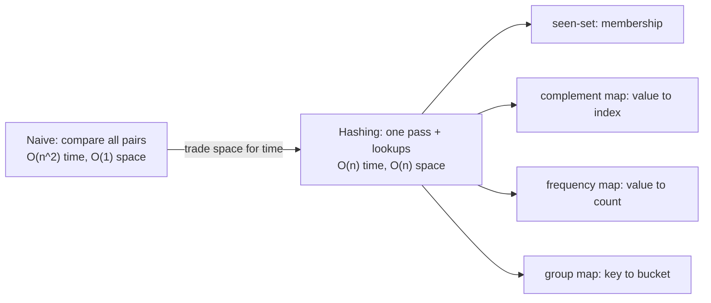
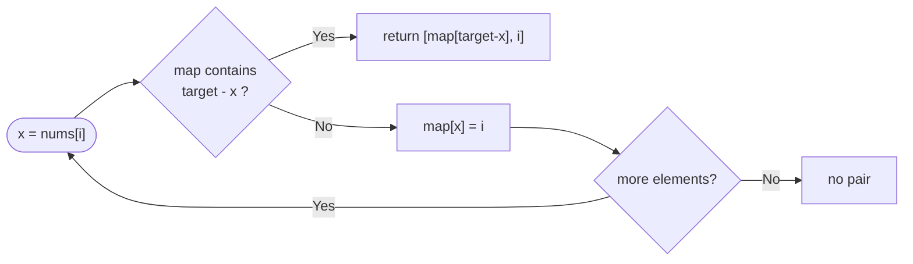
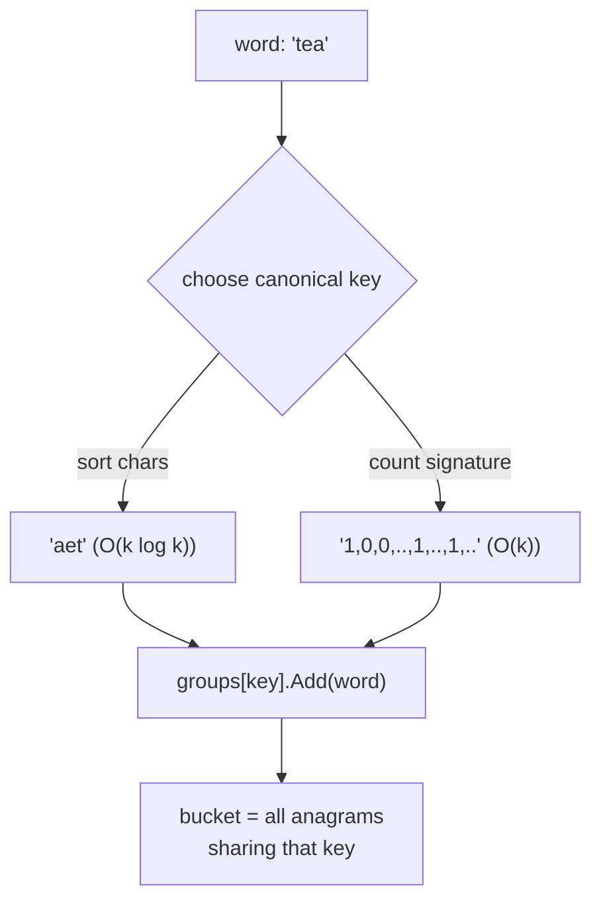
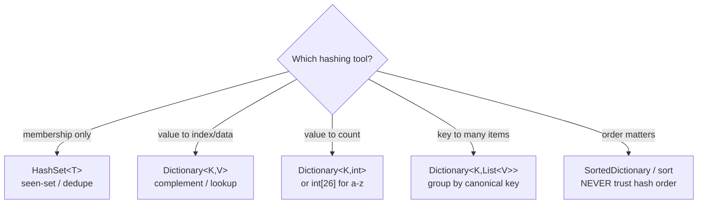

# Arrays & Hashing (Reviewer)

Arrays & Hashing is the bread-and-butter pattern of coding interviews: you trade **space for time** by remembering what you have already seen in a [hash map](algorithms-glossary-reviewer.md#hash-map "Stores key-value pairs and retrieves a value by key in O(1) average time.") or [hash set](algorithms-glossary-reviewer.md#hash-set "Stores unique keys with O(1) average membership testing and no values."), turning an [O(n^2)](algorithms-glossary-reviewer.md#quadratic-time "Work grows like the square of n, typically a nested loop over the same data.") nested scan into a single [O(n)](algorithms-glossary-reviewer.md#linear-time "Work grows in direct proportion to input size, about one unit per element.") pass. Almost every "have I seen this before?", "how many times does this appear?", or "group these by some key" problem collapses to a `Dictionary<K,V>` or `HashSet<T>` lookup that runs in [O(1)](algorithms-glossary-reviewer.md#constant-time "Cost does not depend on input size; the same fixed work every time.") average time.

This reviewer covers the core [hashing](algorithms-glossary-reviewer.md#hashing "Turning a key into a fixed-size integer used to place or find it in a table.") moves — seen-sets, complement lookups, [frequency maps](algorithms-glossary-reviewer.md#frequency-map "A hash map from each distinct item to how many times it appears."), grouping by a canonical key, top-K by [bucket sort](algorithms-glossary-reviewer.md#bucket-sort "Distributes elements into range buckets, sorts each, then concatenates.") — plus a few pure-array tricks (prefix/suffix products, set-membership run extension) that share the same "precompute and look up" mindset. It is the natural first stop on the NeetCode roadmap and the foundation the later patterns ([two pointers](algorithms-glossary-reviewer.md#two-pointers "Two index variables moving through a sequence to solve it in one linear pass."), [sliding window](algorithms-glossary-reviewer.md#sliding-window "A contiguous range you expand and shrink to track a property in one pass."), [prefix sums](algorithms-glossary-reviewer.md#prefix-sum "Running totals up to each position, making any range sum an O(1) subtraction.")) build on. Hands-on practice for every problem here lives in the `arrays-hashing` folder of the practice repo.

Related: [Algorithm Patterns Index](algorithm-patterns-index-reviewer.md) · [Two Pointers](two-pointers-reviewer.md) · [Prefix Sums & Difference Arrays](prefix-sums-and-difference-arrays-reviewer.md) · [Heaps & Priority Queues](heaps-and-priority-queues-reviewer.md) · [Collections & Big-O](../dotnet/csharp/collections-and-big-o-reviewer.md) · [Glossary](algorithms-glossary-reviewer.md)

## Contents

- [Why hashing turns O(n^2) into O(n)](#why-hashing-turns-on2-into-on)
- [Hash map and hash set mechanics recap](#hash-map-and-hash-set-mechanics-recap)
- [The seen-set pattern (Contains Duplicate)](#the-seen-set-pattern-contains-duplicate)
- [The complement pattern (Two Sum in one pass)](#the-complement-pattern-two-sum-in-one-pass)
- [Frequency maps and the int[26] trick (Valid Anagram)](#frequency-maps-and-the-int26-trick-valid-anagram)
- [Grouping by a canonical key (Group Anagrams)](#grouping-by-a-canonical-key-group-anagrams)
- [Top-K frequent: bucket sort vs heap](#top-k-frequent-bucket-sort-vs-heap)
- [Product of array except self](#product-of-array-except-self)
- [Longest consecutive sequence](#longest-consecutive-sequence)
- [Encode and decode strings (length-prefix framing)](#encode-and-decode-strings-length-prefix-framing)
- [Pitfalls and misconceptions](#pitfalls-and-misconceptions)
- [Complexity cheat-sheet](#complexity-cheat-sheet)
- [Interview Q&A](#interview-qa)
- [Rapid-fire round](#rapid-fire-round)
- [Exam-style questions](#exam-style-questions)
- [30-second takeaway](#30-second-takeaway)
- [Quick recall checklist](#quick-recall-checklist)
- [References](#references)

---

## Why hashing turns O(n^2) into O(n)

The naive way to answer "is there a pair/duplicate/match?" is to compare every element against every other element — two nested loops, O(n^2). Hashing replaces the inner loop with a [constant-time](algorithms-glossary-reviewer.md#constant-time "Cost does not depend on input size; the same fixed work every time.") lookup: as you walk the [array](algorithms-glossary-reviewer.md#array "A fixed-size contiguous block of same-type elements accessed by position in O(1).") once, you record what you have seen (or count it), and ask the structure a question that used to cost a full scan.

Key points:
- **The trade**: you spend O(n) extra memory to store seen elements/counts, and in return each "have I seen X?" question is O(1) average instead of O(n). Net result: O(n) time, O(n) space.
- **One pass beats two passes**: you can usually interleave "check" and "insert" so the answer falls out during a single traversal (Two Sum, Contains Duplicate).
- **Order is sacrificed**: a hash map/set gives you membership and counts, not ordering. If you need order back, recover it with a sort, a bucket, or a separate index.
- **"Average" is the operative word**: O(1) lookup is the *expected* cost with a good hash; adversarial [collisions](algorithms-glossary-reviewer.md#hash-collision "When two different keys produce the same hash code and land in one bucket.") can degrade it to O(n). See the recap below.



*The four shapes every Arrays & Hashing problem reduces to, all derived from the same space-for-time trade.*

## Hash map and hash set mechanics recap

A `Dictionary<K,V>` (hash map) and `HashSet<T>` (hash set) both store items in **[buckets](algorithms-glossary-reviewer.md#bucket "A slot in a hash table where keys hashing to the same location are stored.")** indexed by the item's hash code. To find a key, the structure hashes it to a bucket and walks that bucket's short chain comparing with `Equals`. With a good hash, buckets stay tiny, so lookup, insert, and remove are **O(1) on average**.

Key points:
- **O(1) average, O(n) [worst case](algorithms-glossary-reviewer.md#best-average-and-worst-case "How an algorithm's cost varies across the luckiest, typical, and hardest inputs.")**: if every key hashes to the same bucket (a pathological or adversarial hash), the chain becomes a linear list and operations degrade to O(n). For interview answers, state both.
- **`GetHashCode`/`Equals` contract**: equal objects must return equal hash codes; the converse need not hold (collisions are legal). Break this and items get "lost" — stored under one hash, searched under another.
- **Keys must be effectively immutable**: if a field used by `GetHashCode` mutates while the key sits in the map, the entry lands in the wrong bucket and becomes unreachable.
- **Use `TryGetValue`/`TryAdd` to avoid double work**: `ContainsKey` followed by the indexer hashes the key twice. `TryGetValue` does it once.
- **Counting idiom**: `dict.TryGetValue(k, out var c); dict[k] = c + 1;` or `CollectionsMarshal.GetValueRefOrAddDefault` for the allocation-free hot path. The everyday form below is plenty for interviews.

```csharp
using System.Collections.Generic;

var seen = new HashSet<int>();
seen.Add(5);                 // O(1) average
bool has = seen.Contains(5); // O(1) average -> true

var count = new Dictionary<char, int>();
foreach (char c in "banana")
{
    count.TryGetValue(c, out int n); // n = 0 if absent
    count[c] = n + 1;                // single re-hash on assign
}
// count: { 'b':1, 'a':3, 'n':2 }
```

Deep BCL detail — load factors, prime bucket counts, resizing, `IEquatable<T>`, `StringComparer` — lives in the [Collections & Big-O](../dotnet/csharp/collections-and-big-o-reviewer.md) reviewer. Here we use these structures as O(1)-average black boxes.

## The seen-set pattern (Contains Duplicate)

The simplest hashing move: walk the array, and for each element ask the set "have I seen you?" before adding it. [LC 217](algorithms-glossary-reviewer.md#lc-number "The unique identifier LeetCode assigns each problem, like LC 704.") — Contains Duplicate is the canonical example. Practice folder: `contains-duplicate`.

Key points:
- **Check-then-add, in that order**: ask `Contains` (or rely on `Add`'s return value) *before* inserting, so an element never matches itself.
- **`HashSet<T>.Add` returns `bool`**: `false` means the element was already present — a duplicate. This fuses the check and the insert into one call.
- **Complexity**: O(n) time, O(n) space. You touch each element once and the set holds at most n elements.
- **Early exit**: return as soon as the first duplicate is found; you rarely need to scan the whole array.
- **Sorting alternative**: sort then scan adjacent pairs is [O(n log n)](algorithms-glossary-reviewer.md#linearithmic-time "A linear pass repeated a logarithmic number of times; good-sort speed.") time, O(1) extra space (if sorting in place) — a valid space/time trade to mention.

```csharp
public bool ContainsDuplicate(int[] nums)
{
    var seen = new HashSet<int>();
    foreach (int x in nums)
    {
        if (!seen.Add(x)) // Add returns false if x was already present
            return true;
    }
    return false;
}
```

```text
nums = [1, 2, 3, 1]
 index   0   1   2   3
seen = { }            x=1  Add -> true  (new)   seen={1}
seen = {1}            x=2  Add -> true  (new)   seen={1,2}
seen = {1,2}          x=3  Add -> true  (new)   seen={1,2,3}
seen = {1,2,3}        x=1  Add -> false (dup!)  -> return true
```

*`Add` doubles as the membership test: a `false` return is the duplicate signal, so no separate `Contains` call is needed.*

## The complement pattern (Two Sum in one pass)

For LC 1 — Two Sum you must find two indices whose values sum to `target`. The [brute force](algorithms-glossary-reviewer.md#brute-force "Trying every possibility directly; correct but often too slow.") is O(n^2). The hashing insight: for each value `x`, its partner is the **complement** `target - x`. Store value → index as you go, and look up the complement *before* inserting the current element. Practice folder: `two-sum`.

Key points:
- **Look up before insert**: checking the map before adding `x` guarantees the two indices are distinct, and avoids matching `x` with itself when `target == 2*x` unless a genuine earlier partner exists.
- **Map stores value → index**: you need the index for the answer, not just membership, so it is a `Dictionary<int,int>`, not a `HashSet`.
- **Complexity**: O(n) time, O(n) space. Each element triggers one O(1) lookup and one O(1) insert.
- **Exactly one solution** (per the problem) means you can return immediately on the first match.
- **Contrast with two pointers**: the sorted-array two-pointer Two Sum (LC 167) is O(n) time, O(1) space *but* requires sorted input and returns positions in the sorted order — different problem. See the [Two Pointers](two-pointers-reviewer.md) reviewer.

```csharp
public int[] TwoSum(int[] nums, int target)
{
    var indexByValue = new Dictionary<int, int>();
    for (int i = 0; i < nums.Length; i++)
    {
        int need = target - nums[i];
        if (indexByValue.TryGetValue(need, out int j)) // complement seen earlier?
            return new[] { j, i };
        indexByValue[nums[i]] = i; // record AFTER the lookup
    }
    return Array.Empty<int>(); // unreachable given the problem guarantee
}
```



*Each element asks for its complement first, then records itself — so a match can only pair with a strictly earlier index.*

```text
nums = [3, 2, 4]   target = 6
 i  x  need=target-x  map before        action
 0  3      3          { }               need 3 absent -> map={3:0}
 1  2      4          {3:0}             need 4 absent -> map={3:0, 2:1}
 2  4      2          {3:0, 2:1}        need 2 PRESENT at index 1 -> return [1, 2]
```

*Tracing the one-pass map: 4 looks up its complement 2, finds it at index 1, and returns [1, 2].*

## Frequency maps and the int[26] trick (Valid Anagram)

LC 242 — Valid Anagram asks whether two strings are [permutations](algorithms-glossary-reviewer.md#permutation "An ordered arrangement of elements; n distinct items have n! permutations.") of each other. Two strings are [anagrams](algorithms-glossary-reviewer.md#anagram "A string that is a rearrangement of another: same characters, same counts.") iff they have the **same multiset of characters** — identical character counts. Practice folder: `valid-anagram`.

Key points:
- **Quick reject on length**: different lengths can never be anagrams; check `s.Length != t.Length` first and bail.
- **Count then compare**: increment counts for `s`, decrement for `t`; if every count returns to zero, they match. A single nonzero count means not an anagram.
- **`int[26]` beats a `Dictionary` for lowercase a–z**: a fixed 26-slot array indexed by `c - 'a'` is a perfect hash with no hashing overhead, no boxing, no collisions — faster constant factor and **O(1) space** (a fixed 26 ints, independent of input size).
- **Complexity**: O(n) time where n is the string length, O(1) space with the `int[26]` (or O(k) with a dictionary, k = distinct characters, bounded by the alphabet).
- **Unicode caveat**: `int[26]` assumes lowercase ASCII letters. For arbitrary Unicode use a `Dictionary<char,int>` (or `Dictionary<Rune,int>` to handle surrogate pairs correctly).

```csharp
public bool IsAnagram(string s, string t)
{
    if (s.Length != t.Length) return false;

    Span<int> freq = stackalloc int[26]; // stack buffer, no heap allocation
    for (int i = 0; i < s.Length; i++)
    {
        freq[s[i] - 'a']++;
        freq[t[i] - 'a']--;
    }
    foreach (int c in freq)
        if (c != 0) return false; // a surplus or deficit means not an anagram
    return true;
}
```

```text
s = "anagram"   t = "nagaram"     freq indexed by c - 'a'
                                  a  g  m  n  r   (only nonzero slots shown)
start                             0  0  0  0  0
s[0]='a' +a   t[0]='n' -n        +1  0  0 -1  0
s[1]='n' +n   t[1]='a' -a         0  0  0  0  0
s[2]='a' +a   t[2]='g' -g        +1 -1  0  0  0
s[3]='g' +g   t[3]='a' -a         0  0  0  0  0
s[4]='r' +r   t[4]='r' -r         0  0  0  0  0
s[5]='a' +a   t[5]='a' -a         0  0  0  0  0
s[6]='m' +m   t[6]='m' -m         0  0  0  0  0
final                             0  0  0  0  0  -> all zero -> ANAGRAM
```

*Incrementing for `s` and decrementing for `t` in lockstep: every slot nets to zero, so the two strings hold the same multiset of letters.*

## Grouping by a canonical key (Group Anagrams)

LC 49 — Group Anagrams clusters strings that are anagrams of each other. The trick is a **canonical key**: a deterministic fingerprint that is identical for all members of a group and different across groups. All anagrams of a word share one canonical key, so you bucket strings into a `Dictionary<string, List<string>>` keyed by that fingerprint. Practice folder: `group-anagrams`.

Key points:
- **Sorted-string key**: sort each word's characters; `"eat"`, `"tea"`, `"ate"` all sort to `"aet"`. Building the key is O(k log k) per word (k = word length), giving O(n·k log k) overall.
- **Count-signature key**: a 26-length count vector encoded as a string (e.g. `"1,0,0,...,1,0,0,1"`). Building it is O(k) per word, giving **O(n·k)** overall — faster when words are long, at the cost of more code.
- **Complexity**: O(n·k log k) time (sorted key) or O(n·k) time (count key); O(n·k) space to hold all strings in the buckets.
- **The map value is a bucket** (`List<string>`); use `TryGetValue` or `CollectionsMarshal` to fetch-or-create the list.
- **Output order is unspecified** by the problem, so the dictionary's enumeration order is acceptable.

```csharp
public IList<IList<string>> GroupAnagrams(string[] strs)
{
    var groups = new Dictionary<string, IList<string>>();
    foreach (string word in strs)
    {
        // Canonical key: O(26)=O(1) count signature, faster than sorting for long words.
        Span<int> counts = stackalloc int[26];
        foreach (char c in word)
            counts[c - 'a']++;
        string key = string.Join(',', counts.ToArray());

        if (!groups.TryGetValue(key, out var bucket))
            groups[key] = bucket = new List<string>();
        bucket.Add(word);
    }
    return new List<IList<string>>(groups.Values);
}
```



*Both keying strategies map every anagram of a word to the same dictionary key; the bucket collects them.*

```text
strs = ["eat","tea","tan","ate","nat","bat"]   (sorted-string keys shown)
word   key('aet'-style)   groups after insert
eat -> "aet"              { aet:[eat] }
tea -> "aet"              { aet:[eat,tea] }
tan -> "ant"              { aet:[eat,tea], ant:[tan] }
ate -> "aet"              { aet:[eat,tea,ate], ant:[tan] }
nat -> "ant"              { aet:[eat,tea,ate], ant:[tan,nat] }
bat -> "abt"              { aet:[eat,tea,ate], ant:[tan,nat], abt:[bat] }
result = [[eat,tea,ate], [tan,nat], [bat]]
```

*Anagrams collapse onto a shared key, so each new word lands in the right bucket in O(1) average after the key is built.*

## Top-K frequent: bucket sort vs heap

LC 347 — Top K Frequent Elements wants the k most frequent values. Two solid approaches; pick by what the interviewer is probing. Practice folder: `top-k-frequent-elements`.

Key points:
- **Step 1 is always a frequency map** (`Dictionary<int,int>`), O(n) time.
- **Bucket sort by frequency** is O(n): a value can appear at most n times, so make an array of n+1 buckets indexed by frequency, drop each value into `buckets[freq]`, then walk buckets from high to low collecting until you have k. Total O(n) time, O(n) space.
- **[Heap](algorithms-glossary-reviewer.md#heap "A tree structure keeping the smallest or largest element instantly accessible.") of size k** is O(n log k): push (value, freq) pairs into a [min-heap](algorithms-glossary-reviewer.md#min-heap-and-max-heap "A min-heap keeps the smallest at its root; a max-heap keeps the largest.") keyed by frequency; pop when size exceeds k so only the k largest survive. Uses `PriorityQueue<TElement,TPriority>` from the BCL. Total O(n log k) time, O(n + k) space. Detailed heap mechanics live in the [Heaps & Priority Queues](heaps-and-priority-queues-reviewer.md) reviewer.
- **Which to quote**: bucket sort is the optimal O(n) answer; the heap is the more general "top-K stream" pattern and the one to reach for when n is huge and k is tiny, or when elements arrive online.
- **Sorting the whole frequency list** is O(n log n) — correct but strictly worse than both above; mention it only as the naive baseline.

```csharp
using System.Collections.Generic;

public int[] TopKFrequent(int[] nums, int k)
{
    var freq = new Dictionary<int, int>();
    foreach (int x in nums)
    {
        freq.TryGetValue(x, out int c);
        freq[x] = c + 1;
    }

    // buckets[f] holds every value that occurs exactly f times.
    var buckets = new List<int>[nums.Length + 1];
    foreach (var (value, count) in freq)
        (buckets[count] ??= new List<int>()).Add(value);

    var result = new List<int>(k);
    for (int f = buckets.Length - 1; f >= 0 && result.Count < k; f--)
    {
        if (buckets[f] is null) continue;
        foreach (int value in buckets[f])
        {
            result.Add(value);
            if (result.Count == k) break;
        }
    }
    return result.ToArray();
}
```

```csharp
// Heap variant: O(n log k) time, O(n + k) space. Min-heap keyed by frequency.
public int[] TopKFrequentHeap(int[] nums, int k)
{
    var freq = new Dictionary<int, int>();
    foreach (int x in nums)
    {
        freq.TryGetValue(x, out int c);
        freq[x] = c + 1;
    }

    var minHeap = new PriorityQueue<int, int>(); // element = value, priority = frequency
    foreach (var (value, count) in freq)
    {
        minHeap.Enqueue(value, count);
        if (minHeap.Count > k)
            minHeap.Dequeue(); // evict the current least-frequent
    }

    var result = new int[k];
    for (int i = 0; i < k; i++)
        result[i] = minHeap.Dequeue();
    return result;
}
```

```text
nums = [1,1,1,2,2,3]   k = 2
freq  = { 1:3, 2:2, 3:1 }
buckets indexed by frequency (size = n+1 = 7):
  f:  0   1     2     3   4 5 6
      -  [3]   [2]   [1]  - - -
walk f high->low, collect until k=2:
  f=6..4 empty
  f=3 -> take 1   result=[1]
  f=2 -> take 2   result=[1,2]  (count == k, stop)
answer = [1, 2]
```

*Bucket sort indexes by frequency so the most frequent values sit in the highest buckets; one right-to-left sweep yields the top K in O(n).*

## Product of array except self

LC 238 — Product of Array Except Self: `output[i]` is the product of every element *except* `nums[i]`, with two constraints — **no division** (a zero in the array would break the divide-the-total trick) and O(n) time. The hashing-adjacent insight is precomputation: `output[i]` = (product of everything to the **left** of i) × (product of everything to the **right** of i). Practice folder: `product-of-array-except-self`.

Key points:
- **Two passes, prefix then suffix**: first pass fills `output[i]` with the running product of all elements *before* i; second pass multiplies in the running product of all elements *after* i.
- **O(1) extra space**: reuse the output array for the prefix products, then sweep right-to-left with a single running suffix variable. The output array does not count as extra space per the problem.
- **Complexity**: O(n) time, O(1) extra space (excluding the output).
- **Handles zeros naturally**: because there is no division, one or even two zeros in the input produce correct results automatically.
- **Edge values**: the element before index 0 and after index n−1 contribute a product of 1 (the multiplicative identity), so `output[0]` starts at 1 and the suffix starts at 1.

```csharp
public int[] ProductExceptSelf(int[] nums)
{
    int n = nums.Length;
    var output = new int[n];

    // Pass 1 (left->right): output[i] = product of all elements BEFORE i.
    int prefix = 1;
    for (int i = 0; i < n; i++)
    {
        output[i] = prefix;   // nothing to the left of 0 -> 1
        prefix *= nums[i];
    }

    // Pass 2 (right->left): multiply in product of all elements AFTER i.
    int suffix = 1;
    for (int i = n - 1; i >= 0; i--)
    {
        output[i] *= suffix;  // nothing to the right of n-1 -> 1
        suffix *= nums[i];
    }
    return output;
}
```

```text
nums = [1, 2, 3, 4]
 index      0    1    2    3

PASS 1 (prefix, left->right): output[i] = product of everything left of i
 prefix=1   write output[0]=1   then prefix*=1 -> 1
 prefix=1   write output[1]=1   then prefix*=2 -> 2
 prefix=2   write output[2]=2   then prefix*=3 -> 6
 prefix=6   write output[3]=6   then prefix*=4 -> 24
 output  = [ 1,   1,   2,   6 ]

PASS 2 (suffix, right->left): output[i] *= product of everything right of i
 suffix=1   output[3]=6*1 =6    then suffix*=4 -> 4
 suffix=4   output[2]=2*4 =8    then suffix*=3 -> 12
 suffix=12  output[1]=1*12=12   then suffix*=2 -> 24
 suffix=24  output[0]=1*24=24   then suffix*=1 -> 24
 output  = [24,  12,   8,   6 ]
```

*The prefix pass stores left-products in place; the suffix pass folds in right-products with one scalar, so each output cell ends as left × right with no division and O(1) extra space.*

## Longest consecutive sequence

LC 128 — Longest Consecutive Sequence: given an unsorted array, find the length of the longest run of consecutive integers (e.g. `[100,4,200,1,3,2]` → `1,2,3,4` → length 4), in **O(n)** time. Sorting would be O(n log n); hashing does better. Practice folder: `longest-consecutive-sequence`.

Key points:
- **Dump everything into a `HashSet`** for O(1) membership, which also dedupes.
- **Only start counting at a sequence start**: a number `x` is the start of a run iff `x - 1` is **not** in the set. From a start, walk `x+1, x+2, …` while they are present, counting the length.
- **Why this is O(n), not O(n^2)**: the inner walk only ever runs from true starts, and each element is visited by exactly one inner walk across the whole algorithm. Without the `x-1` guard you would re-walk the same run from every member — that is the classic mistake that makes it O(n^2).
- **Complexity**: O(n) time, O(n) space.
- **Sorting alternative**: sort then scan adjacent equal/consecutive pairs is O(n log n) time, O(1) extra space — fine if O(n log n) is acceptable.

```csharp
public int LongestConsecutive(int[] nums)
{
    var set = new HashSet<int>(nums); // dedupe + O(1) membership
    int longest = 0;

    foreach (int x in set)
    {
        if (set.Contains(x - 1)) continue; // x is NOT a sequence start; skip

        int length = 1;
        int next = x + 1;
        while (set.Contains(next)) // extend the run upward
        {
            length++;
            next++;
        }
        longest = Math.Max(longest, length);
    }
    return longest;
}
```

```text
nums = [100, 4, 200, 1, 3, 2]
set  = {100, 4, 200, 1, 3, 2}

For each x, is (x-1) in set?  -> only START a count when NO predecessor.
 x=100 : 99  in set? no  -> START. walk 101? no. run = {100}        len 1
 x=4   : 3   in set? YES -> skip (4 is mid-run, counted from its start)
 x=200 : 199 in set? no  -> START. walk 201? no. run = {200}        len 1
 x=1   : 0   in set? no  -> START. walk 2,3,4 present, 5 no.
                              run = {1,2,3,4}                       len 4  <-- longest
 x=3   : 2   in set? YES -> skip
 x=2   : 1   in set? YES -> skip
answer = 4
```

*The `x-1` guard ensures each run is walked exactly once — from its smallest element — so total inner-loop work is O(n), not O(n^2).*

## Encode and decode strings (length-prefix framing)

LC 271 — Encode and Decode Strings: serialize a list of strings into one string and recover it exactly, where any character (including your delimiter) may appear in the data. A naive single-character delimiter fails because the delimiter can occur inside a string. The robust fix is **length-prefix framing**: write each string's length, a separator, then the raw bytes. Practice folder: `encode-and-decode-strings`.

Key points:
- **Frame format**: for each string `s`, emit `len(s)` + a non-digit marker (e.g. `#`) + `s`. The decoder reads digits up to `#`, parses the length, then slices exactly that many characters.
- **Delimiter-safety**: because the decoder uses an explicit length, the payload may contain `#`, digits, newlines, or anything — there is no ambiguity, unlike a plain `,`-join.
- **Complexity**: encode and decode are both O(N) total time over the total number of characters N; O(N) space for the produced string/list.
- **Empty strings and empty list**: `""` encodes as `0#`; an empty input list encodes as the empty string and decodes back to an empty list.
- **Length is character count**, not byte count — keep the unit consistent between encoder and decoder. For Unicode beyond the BMP, decide up front whether "length" means UTF-16 code units or runes and stick to it.

```csharp
public string Encode(IList<string> strs)
{
    var sb = new System.Text.StringBuilder();
    foreach (string s in strs)
        sb.Append(s.Length).Append('#').Append(s); // <len>#<payload>
    return sb.ToString();
}

public IList<string> Decode(string s)
{
    var result = new List<string>();
    int i = 0;
    while (i < s.Length)
    {
        int j = i;
        while (s[j] != '#') j++;          // read the length digits
        int len = int.Parse(s.AsSpan(i, j - i));
        string word = s.Substring(j + 1, len); // slice exactly len chars
        result.Add(word);
        i = j + 1 + len;                  // jump past this frame
    }
    return result;
}
```

```text
strs = ["lc", "le#et", ""]                 # second string CONTAINS the marker
encode:
  "lc"    -> "2#lc"
  "le#et" -> "5#le#et"
  ""      -> "0#"
  joined  -> "2#lc5#le#et0#"

decode "2#lc5#le#et0#":
  i=0  read digits "2" up to '#' at 1  -> len=2  slice [2..4)="lc"     i=4
  i=4  read digits "5" up to '#' at 5  -> len=5  slice [6..11)="le#et" i=11
  i=11 read digits "0" up to '#' at 12 -> len=0  slice [13..13)=""     i=13
  result = ["lc", "le#et", ""]
```

*The explicit length tells the decoder exactly how far to read, so an embedded `#` in `le#et` is treated as data, not a boundary.*

## Pitfalls and misconceptions

Key points:
- **Mutating a key after insertion**: if you change a field that `GetHashCode` depends on while the object is in a `Dictionary`/`HashSet`, the entry moves to a bucket it is no longer searched in and becomes unreachable. Use immutable keys.
- **Relying on dictionary ordering**: `Dictionary<K,V>` and `HashSet<T>` enumeration order is **unspecified** and must not be depended on. It often looks insertion-ordered, but that is an implementation detail that breaks after removals/resizes. Use `SortedDictionary`/`SortedSet` or sort explicitly when order matters.
- **Hash collisions degrade to O(n)**: O(1) is *average*. Adversarial inputs or a bad `GetHashCode` collapse a hash structure to a linked list. Quote "O(1) average, O(n) worst" in interviews.
- **Matching an element with itself**: in complement/seen patterns, look up *before* inserting the current element; inserting first lets `x` pair with itself (e.g. Two Sum returning `[i, i]`).
- **`ContainsKey` + indexer double-hashes**: prefer `TryGetValue`/`TryAdd`/`GetValueOrDefault` to hash the key once.
- **`int[26]` assumptions**: the fixed-array trick only works for a known small alphabet (lowercase a–z here). Reach for a dictionary for arbitrary or Unicode characters.
- **Counting "space" wrong**: for Product of Array Except Self the output array is not "extra" space; the algorithm is O(1) *extra*. Be precise about what the prompt excludes.
- **Forgetting the length-prefix is what makes framing safe**: a join on `,` or any single char is wrong whenever that char can appear in the data.



*[Decision tree](algorithms-glossary-reviewer.md#decision-tree "The conceptual tree of all choices a backtracking algorithm could make."): pick the structure by what question you ask it, and never lean on hash enumeration order.*

## Complexity cheat-sheet

| Problem (LC) | Technique | Time | Space | Note |
| --- | --- | --- | --- | --- |
| 217 Contains Duplicate | seen-set | O(n) | O(n) | `Add` returns false on dup; sort alt O(n log n)/O(1) |
| 242 Valid Anagram | `int[26]` frequency | O(n) | O(1) | dictionary alt O(n)/O(k) for Unicode |
| 1 Two Sum | complement map | O(n) | O(n) | look up before insert |
| 49 Group Anagrams | canonical-key buckets | O(n·k log k) sorted / O(n·k) count | O(n·k) | k = word length |
| 347 Top K Frequent | bucket sort | O(n) | O(n) | heap alt O(n log k)/O(n + k) |
| 238 Product Except Self | prefix · suffix | O(n) | O(1) extra | no division; output excluded |
| 271 Encode/Decode | length-prefix framing | O(N) | O(N) | N = total chars; delimiter-safe |
| 128 Longest Consecutive | set + start-only walk | O(n) | O(n) | only start at x with no x−1 |

*Memorize the columns that differ from the obvious baseline — they are the answers interviewers are listening for.*

## Interview Q&A

### Hashing fundamentals

Q: Why is a hash map lookup O(1) on average but O(n) in the worst case?
A: The key is hashed to a bucket (O(1)) and the bucket's short chain is scanned with `Equals`. A good hash keeps chains tiny, so it is effectively constant. If every key collides into one bucket (bad or adversarial `GetHashCode`), the chain is a linear list and lookup degrades to O(n).

Q: When does using `int[26]` beat a `Dictionary<char,int>` for counting?
A: When the alphabet is small and known (lowercase a–z). The array is a perfect hash — no hashing, no boxing, no collisions, no resize — so it has a smaller constant factor and O(1) space. The trade-off is it only works for that fixed alphabet; arbitrary/Unicode characters need a dictionary.

Q: In the complement pattern, why must you look up before inserting?
A: So the current element cannot match itself. If you insert `nums[i]` first and `target == 2*nums[i]`, the lookup would find the element you just added and return a pair of identical indices. Looking up first guarantees the match is with a strictly earlier element.

### Pattern selection

Q: Two Sum has a hashing O(n)/O(n) solution and a two-pointer O(n)/O(1) solution. Why not always use the latter?
A: The two-pointer version requires the array to be **sorted**. LC 1 gives an unsorted array and asks for original indices; sorting destroys those indices (you would need to track them) and costs O(n log n). The hash-map pass keeps original indices and stays O(n). Two pointers is the right tool when the input is already sorted (LC 167).

Q: For Top K Frequent, when do you prefer the heap over bucket sort?
A: Bucket sort is the optimal O(n) batch solution. The size-k heap (O(n log k)) wins when k is small relative to n and you want lower auxiliary memory, or when elements stream in online and you cannot allocate n+1 buckets up front — the heap maintains the running top-K incrementally.

Q: Why does Longest Consecutive Sequence only start counting at numbers with no predecessor?
A: To make it O(n). Each consecutive run is then walked exactly once, from its smallest member. If you counted upward from every element, every member of a length-m run would trigger an m-long walk, making it O(n·m) ≈ O(n^2) in the worst case.

### Correctness traps

Q: Why is joining strings with a comma a buggy way to implement Encode/Decode?
A: Because a comma (or any single delimiter) can appear inside the data, the decoder cannot tell a real boundary from a literal character. Length-prefix framing (`<len>#<payload>`) sidesteps this: the decoder reads an explicit length and slices exactly that many characters, so the payload may contain any character including `#`.

Q: Product of Array Except Self forbids division — what breaks if you divide the total product by each element?
A: A zero in the array. Dividing the total by `nums[i]` is undefined when `nums[i] == 0`, and if there is exactly one zero only that index should be nonzero. Special-casing zeros is fragile; the prefix/suffix approach handles zero(s) correctly with no division.

Q: Can you rely on a `Dictionary`'s enumeration returning keys in insertion order?
A: No. The order is unspecified and an implementation detail; it can change after removals or a resize. If you need a defined order, use `SortedDictionary`/`SortedSet`, sort the keys explicitly, or maintain a separate ordered list.

## Rapid-fire round

- Trade hashing makes → **space for time: O(n^2) scan becomes O(n) with O(n) memory.**
- `HashSet<T>.Add` return value → **`false` if the element was already present (duplicate signal).**
- Two Sum partner of `x` → **the complement `target - x`.**
- Two Sum: look up vs insert order → **look up the complement first, then insert.**
- Anagram fast counter for a–z → **`int[26]` indexed by `c - 'a'`, O(1) space.**
- Group Anagrams key choices → **sorted string (O(k log k)) or count signature (O(k)).**
- Top K optimal complexity → **O(n) via bucket sort by frequency.**
- Top K with a heap → **O(n log k), size-k min-heap, `PriorityQueue<int,int>`.**
- Product Except Self space → **O(1) extra; output array excluded; no division.**
- Product Except Self passes → **prefix (left→right) then suffix (right→left).**
- Longest Consecutive start condition → **`x-1` not in the set.**
- Longest Consecutive complexity → **O(n) time, O(n) space.**
- Encode/Decode safe framing → **length-prefix: `<len>#<payload>`.**
- Hash map worst case → **O(n) under colliding keys / bad `GetHashCode`.**
- Avoid double hashing on read → **`TryGetValue`, not `ContainsKey` + indexer.**
- Trust dictionary order → **never; it is unspecified.**
- Mutating a key in a map → **corrupts its bucket; use immutable keys.**

## Exam-style questions

1. What does this print, and what is the bug it demonstrates?

```csharp
int[] nums = { 3, 3 };
int target = 6;
var map = new Dictionary<int, int>();
for (int i = 0; i < nums.Length; i++)
{
    map[nums[i]] = i;                  // insert FIRST
    if (map.TryGetValue(target - nums[i], out int j) && j != i)
        Console.WriteLine($"[{j}, {i}]");
}
```

**Answer:** It prints NOTHING. Tracing `nums = { 3, 3 }`: at `i = 0` the map becomes `{3: 0}`, the complement lookup finds `j = 0`, and the `j != i` guard (`0 != 0`) is false. At `i = 1` the insert overwrites the entry to `{3: 1}`, the lookup finds `j = 1`, and again `1 != 1` is false. Because inserting first clobbers the earlier index of the duplicate key, the looked-up index always equals the current index and the guard always rejects it — so even the genuine pair `[0, 1]` is never reported. This is the bug: insert-before-lookup not only risks self-matching but, with duplicate keys, destroys the earlier index entirely. Without the `j != i` guard it would instead print two self-matched lines, `[0, 0]` then `[1, 1]`. The clean pattern looks up the complement *before* inserting, so the earlier index survives and no guard is needed.

2. State the time and space complexity, and name the cheaper alternative.

```csharp
public bool IsAnagram(string s, string t)
{
    return string.Concat(s.OrderBy(c => c)) == string.Concat(t.OrderBy(c => c));
}
```

**Answer:** O(n log n) time (two sorts) and O(n) space (two new strings). It is correct but suboptimal. The cheaper alternative is an `int[26]` (or `Dictionary<char,int>`) frequency count: O(n) time and O(1) space for lowercase a–z, incrementing for `s` and decrementing for `t` and checking every slot is zero.

3. Why is this Longest Consecutive Sequence attempt O(n^2) in the worst case, and what one line fixes it?

```csharp
var set = new HashSet<int>(nums);
int longest = 0;
foreach (int x in set)
{
    int len = 1, next = x + 1;
    while (set.Contains(next)) { len++; next++; }   // walks up from EVERY x
    longest = Math.Max(longest, len);
}
```

**Answer:** It walks the run upward starting from *every* element, so for a single length-m run it does 1 + 2 + … + m ≈ O(m^2) work, i.e. O(n^2) overall. The fix is to only start a walk from a run's smallest element: `if (set.Contains(x - 1)) continue;` at the top of the loop. Then each run is walked once and the total is O(n).

4. What does this print, and which property of the framing makes it correct?

```csharp
var enc = new Codec();
string s = enc.Encode(new List<string> { "a#b", "" , "12#" });
Console.WriteLine(enc.Decode(s).Count);
// Encode emits  len + '#' + payload  for each string
```

**Answer:** It prints `3`. The encoded string is `3#a#b0#3#12#`. Decoding reads `3`→`#`→slice 3 chars `"a#b"`; then `0`→`#`→slice 0 chars `""`; then `3`→`#`→slice 3 chars `"12#"`. The length prefix is what makes it correct: the decoder uses an explicit count rather than a delimiter, so payloads containing `#` or digits are unambiguous, and the list of three strings round-trips.

5. Give the complexity of each labeled line.

```csharp
var freq = new Dictionary<int, int>();
foreach (int x in nums) { freq.TryGetValue(x, out int c); freq[x] = c + 1; } // (a)
var buckets = new List<int>[nums.Length + 1];                                // (b)
foreach (var (v, c) in freq) (buckets[c] ??= new()).Add(v);                  // (c)
```

**Answer:** (a) O(n) — one pass with O(1) average map operations per element. (b) O(n) — allocating an array of n+1 bucket slots. (c) O(d) where d is the number of distinct values (d ≤ n), each placed in O(1) — so O(n) in the worst case. The whole top-K-by-bucket pipeline is O(n) time, O(n) space.

## 30-second takeaway

> Arrays & Hashing is the **space-for-time** pattern: remember what you have seen in a `HashSet`/`Dictionary` so each "seen it? / counted it? / grouped it?" question is O(1) average, collapsing O(n^2) scans to O(n). Four shapes cover almost everything — **seen-set** (Contains Duplicate), **complement map** (Two Sum, look up before insert), **frequency map** (Valid Anagram, use `int[26]` for a–z), and **group-by-canonical-key** (Group Anagrams). Top-K is O(n) by bucket sort or O(n log k) by a size-k heap; Product Except Self is prefix×suffix with O(1) extra space and no division; Longest Consecutive is O(n) only if you start each run from the element whose predecessor is absent; Encode/Decode needs **length-prefix framing** to stay delimiter-safe. Always quote O(1) **average**, O(n) **worst**, never trust hash enumeration order, and keep keys immutable.

## Quick recall checklist

- Hashing trades O(n) space to make membership/count/group lookups O(1) average, turning O(n^2) into O(n).
- Hash map/set ops are O(1) **average**, O(n) **worst** (collisions / bad `GetHashCode`); keys must be immutable.
- Seen-set: `HashSet<T>.Add` returns `false` on a duplicate — check before/while inserting.
- Complement: store value→index, look up `target - x` **before** inserting `x`.
- Frequency: `int[26]` (index `c - 'a'`) is O(1) space and beats a dictionary for lowercase a–z; check length first for anagrams.
- Group by a **canonical key**: sorted string (O(k log k)) or count signature (O(k)); bucket into `Dictionary<string,List<string>>`.
- Top-K: bucket sort by frequency is O(n); a size-k min-heap (`PriorityQueue<int,int>`) is O(n log k).
- Product Except Self: prefix pass then suffix pass, O(n) time, O(1) extra space, no division (handles zeros).
- Longest Consecutive: dump to a set, only start a run where `x-1` is absent, walk upward — O(n) time, O(n) space.
- Encode/Decode: length-prefix framing `<len>#<payload>` is delimiter-safe; a single-char join is not.
- Never rely on `Dictionary`/`HashSet` enumeration order; use `TryGetValue` to avoid double hashing.

## References

- Hash table — Wikipedia: https://en.wikipedia.org/wiki/Hash_table
- `Dictionary<TKey,TValue>` — Microsoft Learn: https://learn.microsoft.com/dotnet/api/system.collections.generic.dictionary-2
- `HashSet<T>` — Microsoft Learn: https://learn.microsoft.com/dotnet/api/system.collections.generic.hashset-1
- `PriorityQueue<TElement,TPriority>` — Microsoft Learn: https://learn.microsoft.com/dotnet/api/system.collections.generic.priorityqueue-2
- Counting sort / bucket sort — Wikipedia: https://en.wikipedia.org/wiki/Counting_sort
- NeetCode roadmap (Arrays & Hashing): https://neetcode.io/roadmap
- LeetCode study plans hub: https://leetcode.com/studyplan/
