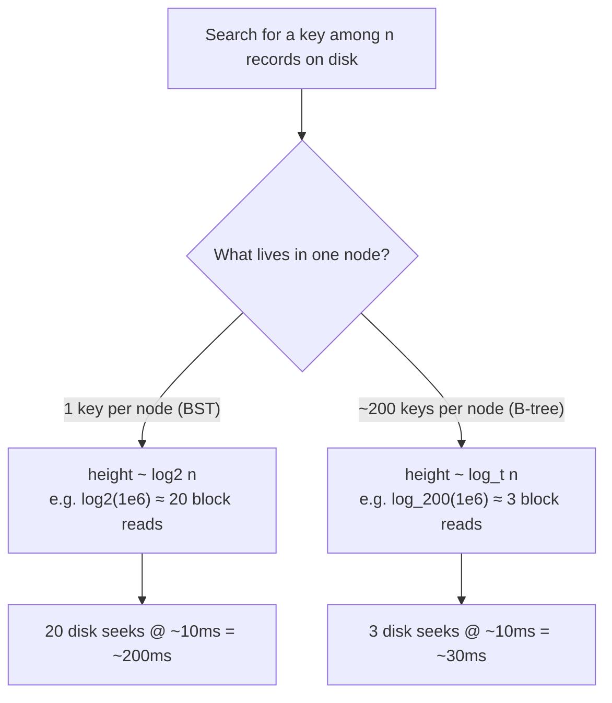
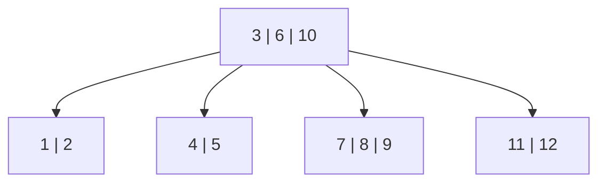
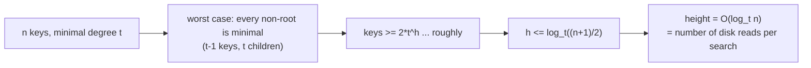
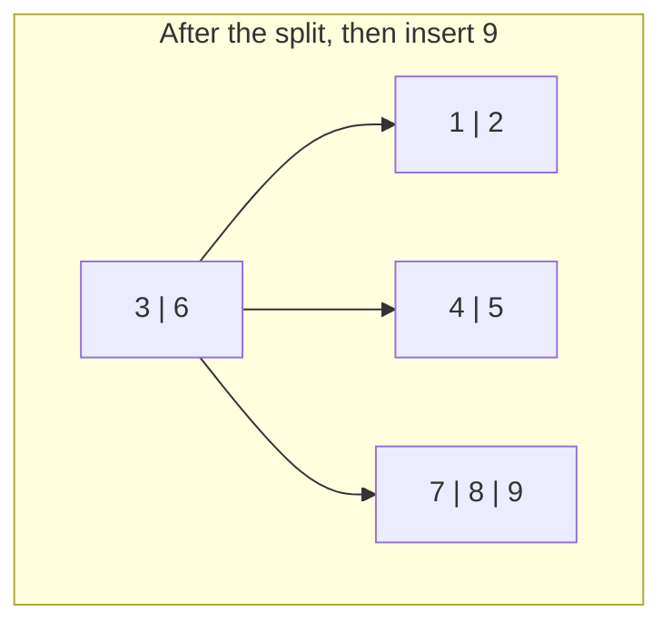
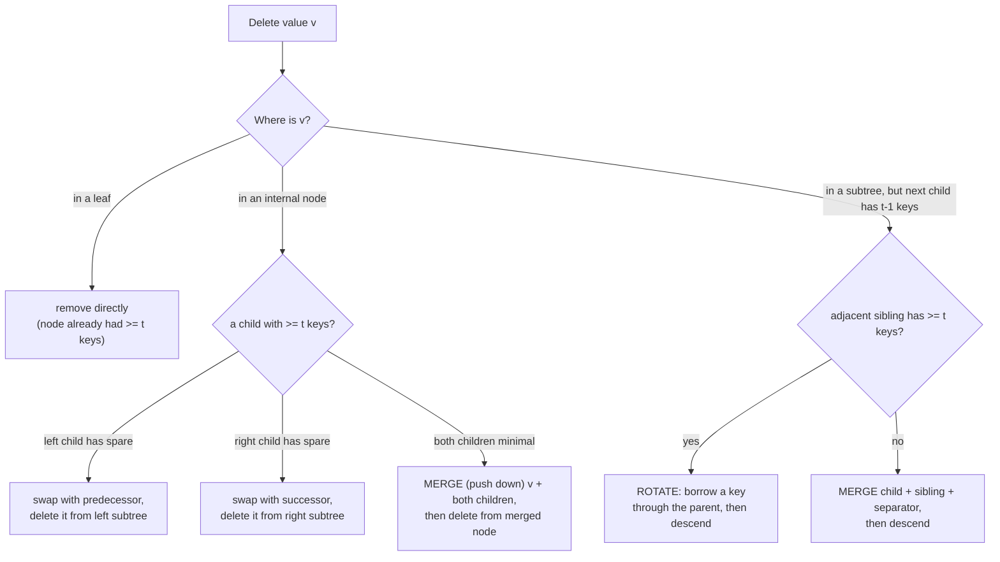
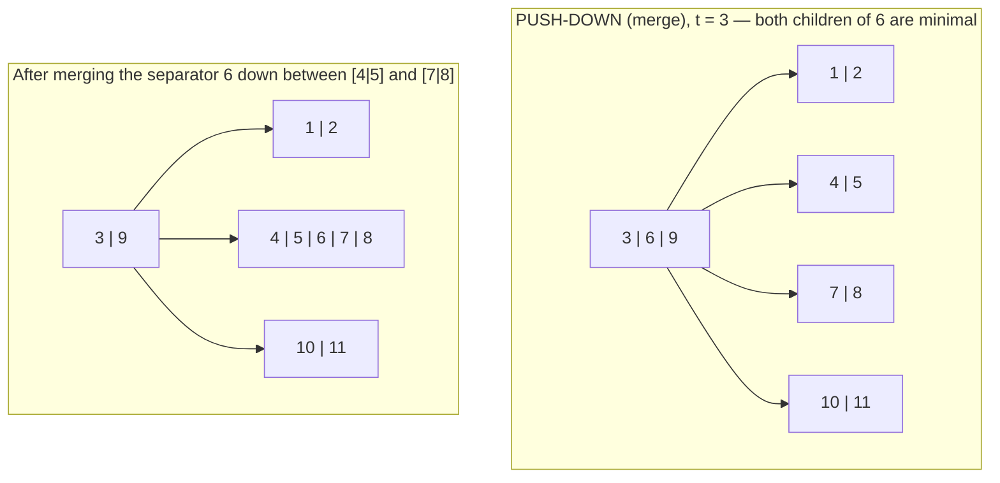

# B-Trees (Reviewer)

A **B-tree** is a sorted, [balanced tree](algorithms-glossary-reviewer.md#balanced-tree "A tree whose height stays O(log n) so operations don't degrade to O(n).") in which every [node](algorithms-glossary-reviewer.md#node "A container in a linked structure holding a value plus references to neighbors.") holds **many keys** and has **many children**, designed for data that lives on slow media such as disk or tape drives. Where a [binary search tree](algorithms-glossary-reviewer.md#binary-search-tree "A binary tree where left subtree values are smaller and right are larger.") makes a left-or-right decision at each node and so needs `~log2 n` comparisons (and, on disk, potentially that many block reads), a B-tree packs hundreds of keys into a single node sized to one disk block, makes a **multiway** decision per node, and reaches the same key in `~log_t n` block reads. When a block read costs milliseconds and a comparison costs nanoseconds, the number that matters is **block reads**, and high [fan-out](algorithms-glossary-reviewer.md#branching-factor "The number of children per node; higher fan-out means a shallower tree.") is what minimizes it. That single idea — make the tree wide and shallow so each expensive I/O does a lot of work — is why B-trees and their cousin **B+ trees** underpin nearly every relational database index, key-value store, and filesystem (NTFS, ext4, HFS+).

The structure is governed by one parameter, the **minimal degree** `t`: every non-root node holds between `t - 1` and `2t - 1` keys and has between `t` and `2t` children, and **all leaves sit at the same depth**. That uniform-depth invariant is what keeps the tree balanced; it is maintained not by post-hoc rotations (as in [AVL](algorithms-glossary-reviewer.md#balanced-tree "A tree whose height stays O(log n) so operations don't degrade to O(n).") or red-black trees) but by **splitting** a full node on the way down during insertion and by **merging** or **borrowing** (rotation) on the way down during deletion. This reviewer covers the disk/I-O motivation, the degree-`t` invariants and height bound, multiway search, insertion by splitting full nodes and pushing the median up, deletion with its leaf/internal cases and the push-down/rotation fixes for underflow, the complexity summary, and the contrast with in-memory balanced BSTs.

Related: [Algorithm Patterns Index](algorithm-patterns-index-reviewer.md) · [Balanced Trees & AVL](balanced-trees-and-avl-reviewer.md) · [Trees & Binary Search Trees](trees-and-binary-search-trees-reviewer.md) · [Segment Tree & Fenwick](segment-tree-and-fenwick-reviewer.md) · [Glossary](algorithms-glossary-reviewer.md)

## Contents

- [Why B-trees: the disk / I-O motivation](#why-b-trees-the-disk--i-o-motivation)
- [B-tree properties and the minimal degree t](#b-tree-properties-and-the-minimal-degree-t)
- [Height is O(log_t n)](#height-is-olog_t-n)
- [Searching a B-tree](#searching-a-b-tree)
- [Insertion: splitting full nodes](#insertion-splitting-full-nodes)
- [A worked insertion: splitting a full leaf](#a-worked-insertion-splitting-a-full-leaf)
- [Deletion: the cases](#deletion-the-cases)
- [Fixing underflow: rotation and push-down](#fixing-underflow-rotation-and-push-down)
- [Complexity summary](#complexity-summary)
- [B-trees vs AVL / red-black trees](#b-trees-vs-avl--red-black-trees)
- [B+ trees and real-world indexes](#b-trees-and-real-world-indexes)
- [Interview Q&A](#interview-qa)
- [Rapid-fire round](#rapid-fire-round)
- [Exam-style questions](#exam-style-questions)
- [30-second takeaway](#30-second-takeaway)
- [Quick recall checklist](#quick-recall-checklist)
- [References](#references)

---

## Why B-trees: the disk / I-O motivation

Key points:

- **The cost model is block reads, not comparisons.** Main memory access is ~100 ns; a single random disk seek is ~10 ms — five orders of magnitude slower. An algorithm tuned for disk minimizes the number of **nodes (blocks) touched**, even if it does more comparisons per node.
- **A binary tree wastes I/O.** Storing `n` keys in a balanced BST gives height `~log2 n`. Searching it on disk reads one node per level: `log2(10^6) ≈ 20` reads, each a potential seek. Most of each tiny node-block is wasted because a BST node holds only one key.
- **A B-tree fills the block.** Disks transfer data in fixed **blocks** (e.g. 4 KB or 16 KB). If one block holds, say, 200 keys, a B-tree node holds ~200 keys and has ~200 children. Height becomes `~log_200 n`: `log_200(10^6) ≈ 2.6`, so **3 reads** instead of 20. Same data, a fraction of the I/O.
- **High [fan-out](algorithms-glossary-reviewer.md#branching-factor "The number of children per node; higher fan-out means a shallower tree.") is the whole trick.** Increasing keys-per-node raises the logarithm's base, flattening the tree. The extra in-node comparisons are essentially free because they happen in RAM after the one block is read.
- The same logic applies to any storage with a high fixed access cost and bulk transfer: SSD pages, network-attached storage, and CPU cache lines all reward wide, shallow trees.



*Each level of the tree is one potential disk seek; packing many keys per node turns 20 seeks into 3.*

## B-tree properties and the minimal degree t

A B-tree is parameterized by a **minimal degree** `t >= 2`, the minimum number of children every non-root node must have. All the structural rules fall out of `t`.

Key points:

- **Key bounds.** Every non-root node holds **at least `t - 1`** and **at most `2t - 1`** keys. The root may hold as few as `1` key (or `0` when the tree is empty).
- **Children bounds.** An internal non-root node has **at least `t`** and **at most `2t`** children. The defining relationship is simple: **a node with `k` keys has exactly `k + 1` children** — one more child than values, because the children fill the gaps between and around the keys.
- **Keys are sorted within a node**, and the children interleave them: keys `k1 < k2 < ... < km` separate children `c0, c1, ..., cm`, where every key in `c0` is `< k1`, every key in `ci` lies between `ki` and `ki+1`, and every key in `cm` is `> km`. This is the multiway generalization of the BST ordering invariant.
- **All leaves are at the same depth.** This is the balance condition. A B-tree never has one branch deeper than another; height grows only when the root splits.
- Two named extremes: a **minimal node** has exactly `t - 1` keys and `t` children; a **full node** has exactly `2t - 1` keys and `2t` children. Full nodes are the ones that must be split before you descend into them.



*A valid B-tree with t = 3: the root holds 3 keys and 4 children; every leaf is at depth 1; each node has between t-1=2 and 2t-1=5 keys. The separators 3, 6, 10 partition the children into key ranges (<3), (3..6), (6..10), (>10).*

The invariants in one table:

| Property | Root | Every other node |
| --- | --- | --- |
| Min keys | `1` | `t - 1` |
| Max keys | `2t - 1` | `2t - 1` |
| Min children (if internal) | `2` | `t` |
| Max children | `2t` | `2t` |
| Children vs keys | always `keys + 1` | always `keys + 1` |
| Leaf depth | — | all leaves equal depth |

## Height is O(log_t n)

Key points:

- **Why the height is logarithmic in base `t`.** Worst case (sparsest legal tree), the root has `1` key and `2` children, and every other node is minimal with `t - 1` keys and `t` children. The node count per level then grows by a factor of `t`, so a tree of height `h` holds at least `1 + 2(t^h - 1)/(t - 1)` keys. Solving for `h` gives `h <= log_t((n + 1) / 2)`, i.e. **`h = O(log_t n)`**.
- Because `t` can be in the hundreds, `log_t n` is tiny: with `t = 200`, even a billion keys give height ~4. **The height bound is the I/O bound** — height equals the number of block reads for a root-to-leaf path.
- Compare to a balanced BST's `log2 n`. The B-tree's height is smaller by a factor of `log2 t`. That factor is exactly the keys-per-node win, paid back as fewer levels.
- **Height changes only at the root.** Insertions increase height only when a full root splits (adding one level on top); deletions decrease height only when the root loses its last key to a merge of its two children. All other restructuring happens without changing depth, which is how every leaf stays at the same level.



*The number of levels — and therefore the number of block reads — grows like the logarithm of n in base t.*

## Searching a B-tree

Searching mirrors BST search but is **multiway**: at each node you scan the sorted keys to find either a match or the single child whose key range contains the target, then descend.

Key points:

- At a node, walk the keys left to right (or [binary-search](algorithms-glossary-reviewer.md#binary-search "Repeatedly halve a sorted range to locate a target in O(log n).") them, since they are sorted). If you find `value == key`, return success. Otherwise stop at the first key **greater than** the target; the child to its **left** is the one to descend into. If the target exceeds every key, descend into the **last** child.
- Recurse (or loop) into that child. A `null` child — i.e. you are at a leaf and ran out of keys — means the value is absent.
- **Two cost components.** Per node you do `O(log t)` comparisons if you binary-search the keys (or `O(t)` if you scan linearly). You visit `O(log_t n)` nodes. So total comparisons are `O(t · log_t n)` for a linear in-node scan, or `O(log t · log_t n) = O(log n)` with binary search inside the node. But the metric that dominates on disk is the **`O(log_t n)` node (block) reads**.
- Within a node the keys are sorted, so the in-node lookup is itself a perfect candidate for **binary search** — large `t` makes this worthwhile.

```csharp
// Multiway B-tree search. Returns true if value is present.
// node.Keys is sorted ascending; node.Children[i] holds keys between Keys[i-1] and Keys[i].
public static bool Search(BTreeNode node, int value)
{
    if (node == null) return false;          // descended past a leaf: not found

    int i = 0;
    while (i < node.Keys.Count && value > node.Keys[i])
        i++;                                  // scan to first key >= value

    if (i < node.Keys.Count && value == node.Keys[i])
        return true;                          // exact match in this node

    if (node.IsLeaf)
        return false;                         // no child to descend into

    return Search(node.Children[i], value);   // descend into the gap child
}
```

```text
B-tree (t = 3), search for 8:

                 [ 3 | 6 | 10 ]
                /     |     |    \
          [1|2]   [4|5]  [7|8|9]  [11|12]

 At root: 8 > 3, 8 > 6, 8 < 10  -> first key > 8 is 10 (index 2) -> descend child[2] = [7|8|9]
 At [7|8|9]: 8 > 7, 8 == 8      -> match, return true

 Block reads: 2 (root, then the leaf). Comparisons: 4.
```

*Search makes a multiway branch per node — scan keys, pick the gap child — touching only one node per level.*

## Insertion: splitting full nodes

Values are only ever added to **leaf** nodes. The challenge is what to do when the target leaf is already full. B-trees solve this with **proactive splitting on the way down**: as you descend toward the insertion leaf, you split any full node you are about to enter, so the leaf is guaranteed non-full when you arrive.

Key points:

- **Splitting a full node** (`2t - 1` keys): the **median** key (index `t - 1`) is **pushed up** into the parent, the `t - 1` keys to its left become a new left node, and the `t - 1` keys to its right become a new right node. The parent gains one key and one child. Each resulting child is exactly minimal (`t - 1` keys) — legal.
- **Split-on-the-way-down** keeps the algorithm single-pass: because you split full nodes before entering them, the parent always has room to absorb a pushed-up median (it was made non-full on the previous step). You never have to walk back up to fix an overflow.
- **The root is special.** If the root itself is full, you allocate a fresh empty root, make the old full root its only child, and split that child. **This is the only operation that increases the tree's height**, and it adds the level at the top, preserving equal leaf depth.
- The driver is two routines: `Add` handles the full-root case, then calls `InsertNonFull`, which either drops the value into a leaf or finds the right child, splits it if full, and recurses.

```csharp
// Top-level insert. Splits the root if it is full, then inserts into a guaranteed non-full tree.
public void Add(int value)
{
    if (Root == null) { Root = new BTreeNode(leaf: true); Root.Keys.Add(value); return; }

    if (IsFull(Root))                         // root full -> grow height by one
    {
        var newRoot = new BTreeNode(leaf: false);
        newRoot.Children.Add(Root);
        SplitChild(newRoot, 0);               // split old root into two children of newRoot
        Root = newRoot;
    }
    InsertNonFull(Root, value);
}

// Insert into a node known to be non-full.
private void InsertNonFull(BTreeNode node, int value)
{
    if (node.IsLeaf)
    {
        int i = node.Keys.Count - 1;
        node.Keys.Add(0);
        while (i >= 0 && value < node.Keys[i]) { node.Keys[i + 1] = node.Keys[i]; i--; }
        node.Keys[i + 1] = value;             // sorted insert into the leaf
        return;
    }

    int c = node.Keys.Count - 1;
    while (c >= 0 && value < node.Keys[c]) c--;
    c++;                                       // c = index of child to descend into

    if (IsFull(node.Children[c]))              // split a full child BEFORE entering it
    {
        SplitChild(node, c);
        if (value > node.Keys[c]) c++;        // median moved up; pick correct side
    }
    InsertNonFull(node.Children[c], value);
}

// Split node.Children[i] (which is full, 2t-1 keys) around its median.
private void SplitChild(BTreeNode parent, int i)
{
    BTreeNode full = parent.Children[i];
    var right = new BTreeNode(leaf: full.IsLeaf);
    int mid = T - 1;                           // median index

    // right node takes the top t-1 keys (and their children, if internal)
    for (int j = mid + 1; j < full.Keys.Count; j++) right.Keys.Add(full.Keys[j]);
    if (!full.IsLeaf)
        for (int j = mid + 1; j < full.Children.Count; j++) right.Children.Add(full.Children[j]);

    int median = full.Keys[mid];
    full.Keys.RemoveRange(mid, full.Keys.Count - mid);          // left node keeps bottom t-1
    if (!full.IsLeaf) full.Children.RemoveRange(mid + 1, full.Children.Count - (mid + 1));

    parent.Children.Insert(i + 1, right);     // wire the new right node in
    parent.Keys.Insert(i, median);            // push the median up into the parent
}

private bool IsFull(BTreeNode n) => n.Keys.Count == 2 * T - 1;
```

## A worked insertion: splitting a full leaf

Take `t = 3` (so a full node has `2t - 1 = 5` keys). Start with a tree whose right leaf is full and insert `9`.

```text
Before — inserting 9, target leaf [4|5|6|7|8] is FULL (5 keys):

            [ 3 ]
           /     \
      [1|2]    [4|5|6|7|8]

 Descending from root toward the right child [4|5|6|7|8]:
 it is full, so SPLIT it before entering.

 Median of [4|5|6|7|8] is 6 (index t-1 = 2).
   left  = [4|5]   (bottom t-1 = 2 keys)
   right = [7|8]   (top    t-1 = 2 keys)
   6 is pushed up into the parent (the root).
```



*The full leaf splits: median 6 rises into the root (now 3 | 6), leaving leaves [4|5] and [7|8]; the descent continues into [7|8], which has room, and 9 slots in to give [7|8|9].*

Key points on the trace:

- The split happened **on the way down**, before we knew exactly where `9` would land. Because the root had room (it held only `3`), it absorbed the median `6` cleanly.
- After the split, `9 > 6`, so we descend into the new right child `[7|8]`, which is non-full, and insert `9` to get `[7|8|9]`.
- Net effect: one full node became two minimal-ish nodes plus one key promoted to the parent. No leaf changed depth. Had the root also been full, we would have split it first and the tree height would have grown by one.

## Deletion: the cases

Deletion is the most intricate B-tree operation because removing a key must never leave a node below the `t - 1` minimum. The unifying rule is the mirror of insertion: **ensure every node you descend into already has at least `t` keys** (one above the minimum), so that after a removal it still has at least `t - 1`. This is enforced on the way down by **borrowing (rotation)** or **merging (push-down)**.

Key points:

- **Case 1 — key is in a leaf.** Simply remove it. The earlier on-the-way-down fixes guarantee the leaf had at least `t` keys, so it still satisfies `>= t - 1` afterward.
- **Case 2 — key is in an internal node.** You cannot just remove it (it separates two children). Replace it with its **predecessor** (the largest key in the left subtree) or **successor** (the smallest key in the right subtree), then recursively delete that predecessor/successor from the child it lives in — pushing the problem down to a leaf.
  - If the **left child** of the key has `>= t` keys, swap in the predecessor and delete it from the left subtree.
  - Else if the **right child** has `>= t` keys, swap in the successor and delete it from the right subtree.
  - Else (both children minimal), **merge** the key and the two children into one node (push-down), then delete from the merged node.
- **Case 3 — descending toward a key in a child that has only `t - 1` keys.** Before recursing into that child, top it up to `t` keys by either **rotating** a key in from an adjacent sibling that has a spare (`>= t` keys), or **merging** it with a sibling and a separator key from the parent (push-down).
- **Two fix-up tools**, chosen by the situation:
  - **Rotation (borrow):** use when an **adjacent sibling has a spare key** (`>= t`). Cheap — moves one key.
  - **Push-down (merge):** use when **no sibling can spare a key** (all adjacent siblings are minimal). Combines two minimal children plus the separating parent key into one full-ish node, shrinking the parent by one key.



*Every path guarantees the node you enter has at least t keys, so a later removal keeps it legal.*

## Fixing underflow: rotation and push-down

These are the two balancing operations that keep deletion legal. They are the deletion-time counterparts of the insertion-time split.

Key points:

- **Rotation (left / right) — "borrow from a sibling through the parent."** When the child you want to enter is minimal but an adjacent sibling has a spare key, you rotate one key around the parent. In a **right rotation**, the parent's separating key moves *down* into the deficient (right-hand) child as its new smallest key, and the left sibling's *largest* key moves *up* to replace that separator. A **left rotation** is the mirror: the separator drops into the deficient left child as its new largest key, and the right sibling's *smallest* key rises to become the new separator. Either way the deficient child gains a key, the generous sibling loses one, and all ordering invariants hold.
- **Push-down (merge) — "merge two children with a parent key between them."** When neither adjacent sibling can spare a key, you merge: pull the separating key *down* from the parent and place it between the two minimal children, fusing them into a single node of `(t-1) + 1 + (t-1) = 2t - 1` keys — a legal full node. The parent loses one key and one child.
- **Push-down minimal root.** A special, height-shrinking case: if the root holds a single key and both its children are minimal, merging that key with both children produces a new full root, and the tree's height drops by one. This is the only way a B-tree gets shorter.
- **When to use which** (the rule of thumb): rotate when a sibling has a key to spare (it is cheaper and preserves more nodes); merge/push-down only when no sibling can spare one. Rotation requires the parent to have a spare key to give down (it does, except possibly at the root); push-down is what handles the case where the parent is itself thin.

```text
ROTATION (borrow), t = 3 — deficient child [7|8] needs a key; right sibling [10|11] has a spare:

        [ 3 | 9 ]                                   [ 3 | 10 ]
       /    |    \              left rotation       /    |    \
   [1|2]  [7|8]  [10|11]   ───────────────────►  [1|2] [7|8|9] [11]

 The separator 9 drops down into the deficient child -> [7|8|9].
 The right sibling's smallest key 10 rises to become the new separator.
 Deficient child now has t = 3 keys; sibling [11] still legal (t-1 = 2... here shown after losing one).
```



*Push-down pulls separator 6 out of the parent and fuses the two minimal children [4|5] and [7|8] into one node [4|5|6|7|8]; the parent shrinks from three keys to two.*

## Complexity summary

Key points:

- All three operations — search, insert, delete — visit `O(log_t n)` nodes (one root-to-leaf path, plus at most one pass of splits/merges along it).
- **Comparisons / CPU work** is `O(t · log_t n)` with a linear in-node scan, or `O(log t · log_t n) = O(log n)` if each node is binary-searched. Splitting, rotating, and merging each touch only `O(t)` keys, once per level.
- **Disk accesses** — the metric the structure exists to minimize — are `O(log_t n)`: one block read per level on the way down, plus `O(log_t n)` writes in the worst case for the split/merge path.

| Operation | Comparisons (CPU) | Disk accesses (I/O) |
| --- | --- | --- |
| Search | `O(t · log_t n)` or `O(log n)` with in-node binary search | `O(log_t n)` reads |
| Insert | `O(t · log_t n)` | `O(log_t n)` reads + `O(log_t n)` writes |
| Delete | `O(t · log_t n)` | `O(log_t n)` reads + `O(log_t n)` writes |
| Space | `O(n)` total; each node `Θ(t)` | — |

- The `log` in every row is **base `t`**. Choosing `t` so a node fills exactly one disk block is the design lever: bigger `t` means fewer, larger reads.
- These bounds are **worst case**, not just average — the equal-leaf-depth invariant rules out the degenerate-skew failure mode that plagues an unbalanced BST.

## B-trees vs AVL / red-black trees

Key points:

- **AVL and red-black trees are binary** balanced BSTs: one key per node, height `O(log2 n)`, kept balanced by **rotations** after insert/delete. They are excellent **in memory**, where every node access costs the same and pointer-chasing is cheap.
- **On disk, a binary tree is the wrong shape.** Its `log2 n` height means `log2 n` block reads, and each tiny one-key node wastes most of the block it occupies. A B-tree's `log_t n` height collapses that to a handful of reads by **filling each block with keys** — fan-out beats depth when I/O dominates.
- **Conceptually they are the same family.** A red-black tree is essentially a binary encoding of a B-tree of order 4 (a "2-3-4 tree"): the `t = 2` B-tree variant maps directly onto red-black coloring. So the choice is not really about the algorithm but about **where the data lives**.
- **Rule of thumb:** data fits in RAM and you want a balanced map → AVL or red-black (or just a hash table if you don't need order). Data lives on disk/SSD or is too big for RAM, and you need ordered access or range scans → **B-tree / B+ tree**.

| | AVL / red-black | B-tree / B+ tree |
| --- | --- | --- |
| Keys per node | 1 | `t - 1` to `2t - 1` (often hundreds) |
| Height | `O(log2 n)` | `O(log_t n)` |
| Balanced by | rotations | split / merge / rotation |
| Optimized for | in-memory access | disk / block I/O |
| Typical use | in-memory ordered map/set | database & filesystem indexes |

## B+ trees and real-world indexes

Key points:

- A **B+ tree** is the variant used in practice by databases and filesystems. It differs from a plain B-tree in two ways: **all actual records (or row pointers) live in the leaves**, with internal nodes holding only separator keys for routing; and **the leaves are linked in a sorted chain**. This makes **range queries and full ordered scans** trivially fast — find the start leaf, then walk the leaf chain — which is exactly what `WHERE x BETWEEN a AND b` and `ORDER BY` need.
- Because internal nodes carry no data payload, they pack **even more separator keys per block**, raising fan-out further and shrinking height even more than a plain B-tree.
- **Where you'll meet them:** the clustered and secondary indexes in essentially every relational engine (PostgreSQL, MySQL/InnoDB, SQL Server, Oracle, SQLite), key-value stores, and on-disk filesystem metadata (NTFS, ext4's HTree directories, HFS+, Btrfs). When someone says "the database index," a B+ tree is almost always what they mean.
- The interview-relevant takeaway is the **why**: indexes use B+/B-trees because they minimize disk reads for both point lookups (`O(log_t n)` reads) and range scans (`O(log_t n)` to find the start, then sequential leaf traversal).

## Interview Q&A

### Fundamentals

Q: What problem does a B-tree solve that a balanced BST does not?
A: It minimizes **disk I/O**. A balanced BST has height `log2 n`, so a disk-resident search costs `~log2 n` block reads, and each one-key node wastes most of its block. A B-tree packs many keys (sized to a disk block) into each node, giving height `log_t n` and far fewer block reads. The win is **high fan-out → shallow tree → fewer expensive seeks**.

Q: Define the minimal degree `t` and state the key and children bounds.
A: `t` (`>= 2`) is the minimum number of children every non-root node must have. Every non-root node holds **`t - 1` to `2t - 1` keys** and has **`t` to `2t` children**; the root may have as few as `1` key (`2` children). Always, **children = keys + 1**.

Q: What keeps a B-tree balanced?
A: The invariant that **all leaves are at the same depth**, maintained not by rotations after the fact but by **splitting full nodes during insertion** and **merging/borrowing during deletion**. Height changes only at the root — it grows when a full root splits and shrinks when the root's last key merges down.

Q: What is the height of a B-tree, and why does it matter?
A: **`O(log_t n)`**. It matters because height equals the number of block reads on a root-to-leaf path — it *is* the I/O cost. With `t` in the hundreds, even a billion keys give height ~4.

### Operations

Q: Walk through inserting into a full leaf.
A: Insertion splits full nodes **on the way down**. When you reach a full node (`2t - 1` keys) before entering it, you split it: the **median** key is pushed up into the parent, and the remaining keys form two new children of `t - 1` keys each. Because you split before descending, the parent always has room for the promoted median, so it's a single downward pass. If the root is full you create a new root above it first — the only operation that increases height.

Q: How does deletion avoid leaving a node with too few keys?
A: By the mirror rule: **ensure every node you descend into has at least `t` keys before entering it**. If the next child is minimal (`t - 1` keys), you top it up first — **rotate** (borrow) a key from an adjacent sibling that has a spare, or, if no sibling can spare one, **merge (push-down)** the child with a sibling and the separating parent key. Deleting from an internal node first swaps the key with its predecessor/successor to push the deletion down to a leaf.

Q: Rotation vs push-down — when do you use each?
A: **Rotate** when an adjacent sibling has a spare key (`>= t`): one key moves through the parent into the deficient child. **Push-down (merge)** when no adjacent sibling can spare a key: combine the deficient child, a sibling, and the separating parent key into one node, shrinking the parent. Rotation is cheaper and preferred; merge is the fallback (and merging the root's last key is what reduces height).

## Rapid-fire round

- What a B-tree is → **a sorted, balanced, high-fan-out tree for disk/block storage.**
- Why high fan-out → **fewer levels → fewer block reads; I/O dominates, not comparisons.**
- Minimal degree `t` → **min children per non-root node; `t >= 2`.**
- Keys per non-root node → **between `t - 1` and `2t - 1`.**
- Children per node → **between `t` and `2t`; always `keys + 1`.**
- Full node → **`2t - 1` keys, `2t` children.**
- Minimal node → **`t - 1` keys, `t` children.**
- Balance invariant → **all leaves at the same depth.**
- Height → **`O(log_t n)` = the number of block reads.**
- Where keys are added → **only to leaf nodes.**
- Insert overflow fix → **split the full node, push the median up.**
- When height grows → **only when a full root splits.**
- Where keys are removed → **effectively from leaves (swap internal key with pred/succ first).**
- Delete underflow fixes → **rotation (borrow from sibling) or push-down (merge).**
- Rotation vs merge → **rotate if a sibling has a spare key; merge otherwise.**
- When height shrinks → **only when the root's last key merges its children down.**
- Search cost (disk) → **`O(log_t n)` block reads.**
- Search cost (CPU) → **`O(log n)` with in-node binary search.**
- B-tree vs AVL → **B-tree wins on disk (fan-out); AVL fine in memory.**
- B+ tree extra → **data in leaves, leaves linked → fast range scans; used by DB indexes.**

## Exam-style questions

1. For a B-tree with minimal degree `t = 3`, what are the minimum and maximum number of keys and children for (a) a non-root node and (b) the root?

**Answer:** A full node has `2t - 1 = 5` keys and `2t = 6` children; a minimal non-root node has `t - 1 = 2` keys and `t = 3` children. So **(a) a non-root node** holds **2 to 5 keys** and (if internal) **3 to 6 children**. **(b) the root** may hold **1 to 5 keys** and (if internal) **2 to 6 children** — its only relaxation is the lower bound of one key.

2. Insert the keys `1, 2, 3, 4, 5, 6` in order into an initially empty B-tree with `t = 2` (a full node has `2t - 1 = 3` keys). Show where the first split happens and the resulting tree.

**Answer:** Insert `1, 2, 3` → a single leaf `[1|2|3]`, now full. Inserting `4` first splits the full root `[1|2|3]`: median `2` pushed up to a new root, leaving children `[1]` and `[3]`; then `4` lands in `[3]` → `[3|4]`. Insert `5` → `[3|4|5]` (right leaf now full). Insert `6`: descending right, the full leaf `[3|4|5]` splits — median `4` rises into the root (now `[2|4]`), leaving `[3]` and `[5]`; then `6` joins `[5]` → `[5|6]`. Final tree:

```text
            [ 2 | 4 ]
           /    |    \
        [1]    [3]    [5|6]
```

All leaves at depth 1; the first split occurred when inserting `4` into the full root.

3. A B-tree with `t = 3` has a node `[7|8]` (minimal, `t - 1 = 2` keys) from which a key must be removed, dropping it below the minimum. Its left sibling is `[1|2|3|4]` and the separating parent key is `5`. Which fix-up applies, and what is the result?

**Answer:** The left sibling `[1|2|3|4]` has **4 keys, well above the minimum**, so it has a key to spare → use a **rotation (borrow), specifically a right rotation**. The separating parent key `5` drops down to become the new smallest key of the deficient node (`[5|7|8]`), and the sibling's largest key `4` rises to take `5`'s place as the new separator in the parent. The sibling becomes `[1|2|3]`, the parent's separator is now `4`, and the once-deficient node is `[5|7|8]` — back to a legal `t` keys, ready for the removal. (Had the sibling been minimal too, you would instead **merge/push-down**: pull `5` down and fuse the two minimal nodes into one.)

## 30-second takeaway

> A **B-tree** is a sorted, balanced tree built for **disk**: each node fills a block with many keys, so the tree is wide and shallow (height `O(log_t n)`) and a search touches only a handful of blocks instead of the `log2 n` a binary tree would. The shape is set by the **minimal degree `t`**: every non-root node has **`t - 1` to `2t - 1` keys** and **`t` to `2t` children** (children = keys + 1), and **all leaves sit at the same depth**. Insert by **splitting full nodes on the way down** and pushing the **median** up (the only thing that grows height); delete by ensuring each node you enter has **`>= t` keys**, fixing underflow by **rotating** (borrow from a sibling) or **merging/push-down** (the only thing that shrinks height). Search, insert, and delete are all `O(log_t n)` block reads. In memory, AVL/red-black are fine; on disk, **fan-out wins**, which is why **B+ trees** power database and filesystem indexes.

## Quick recall checklist

- **Purpose:** minimize disk/block I/O by packing many keys per node — high fan-out → shallow tree → few block reads.
- **Minimal degree `t` (`>= 2`):** non-root nodes have `t - 1` to `2t - 1` keys and `t` to `2t` children; root has `1` to `2t - 1` keys.
- **Children = keys + 1**, keys sorted within a node, children interleave them (multiway BST ordering).
- **Balance invariant:** all leaves at the same depth; height `= O(log_t n)` = block reads per search.
- **Search:** scan/binary-search keys in the node, descend into the gap child; `O(log_t n)` reads.
- **Insert:** add only to leaves; **split any full node on the way down**, pushing the **median** up; full root splits → height +1 (the only growth).
- **Full node** = `2t - 1` keys; **minimal node** = `t - 1` keys.
- **Delete:** ensure each descended node has `>= t` keys; internal-node key → swap with predecessor/successor and delete from the leaf.
- **Underflow fix — rotation:** borrow a key from an adjacent sibling through the parent (use when a sibling has `>= t` keys).
- **Underflow fix — push-down (merge):** fuse a deficient child + sibling + separating parent key into one node (use when no sibling can spare a key); merging the root's last key → height -1 (the only shrink).
- **Complexity:** search/insert/delete each `O(t · log_t n)` comparisons (or `O(log n)` with in-node binary search), `O(log_t n)` disk accesses.
- **vs AVL/red-black:** binary balanced BSTs win in memory; B-trees win on disk because fan-out beats depth. A red-black tree is essentially a `t = 2` (2-3-4) B-tree in disguise.
- **B+ tree:** data in leaves, leaves linked → fast range scans; the structure behind database and filesystem indexes.

## References

- Cormen, Leiserson, Rivest, Stein — *Introduction to Algorithms* (CLRS), Chapter 18, "B-Trees".
- Wikipedia — [B-tree](https://en.wikipedia.org/wiki/B-tree).
- Wikipedia — [B+ tree](https://en.wikipedia.org/wiki/B%2B_tree).
- Robert Horvick — *Data Structures and Algorithms* (Pluralsight), B-trees module.
- cp-algorithms — [Balanced search trees and B-trees overview](https://cp-algorithms.com/).
- Microsoft Learn — [SQL Server index architecture (B+ tree based)](https://learn.microsoft.com/en-us/sql/relational-databases/sql-server-index-design-guide).
