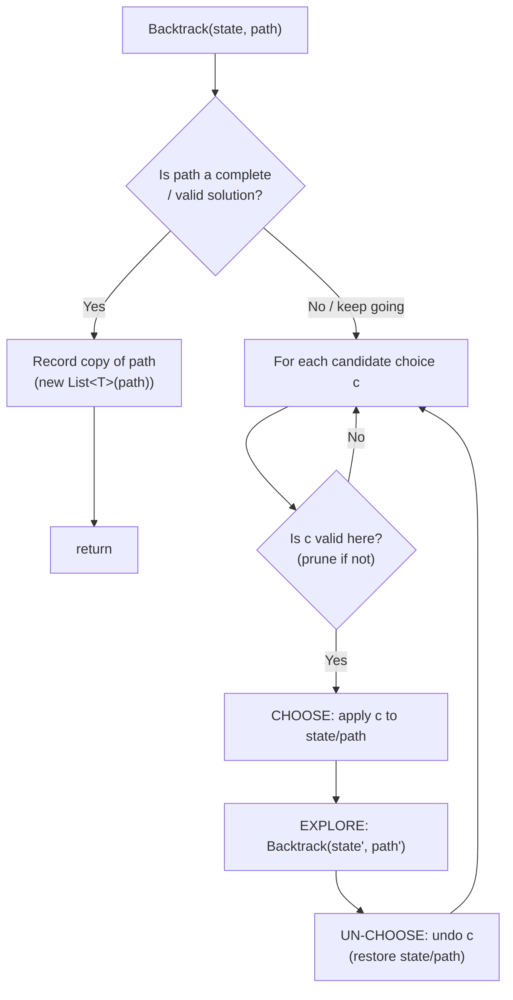
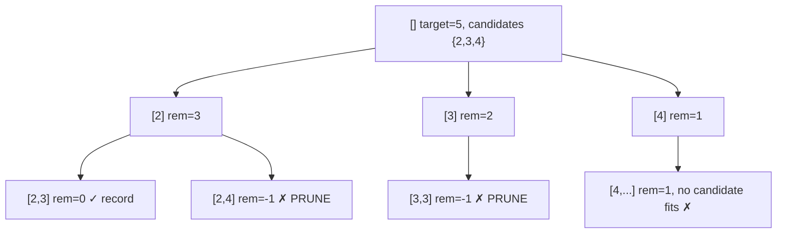
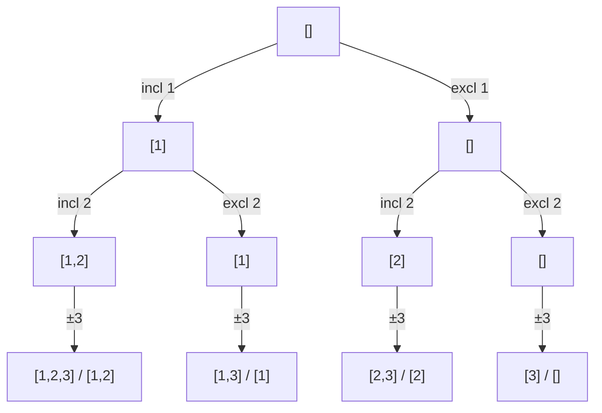
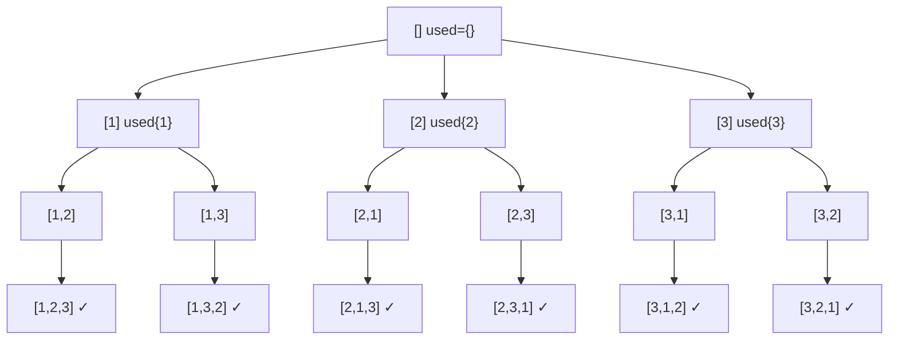
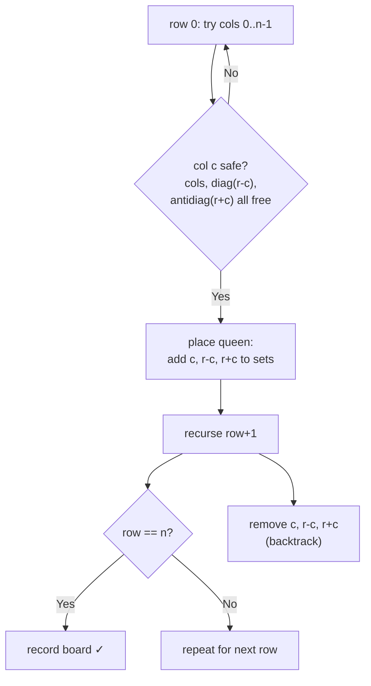
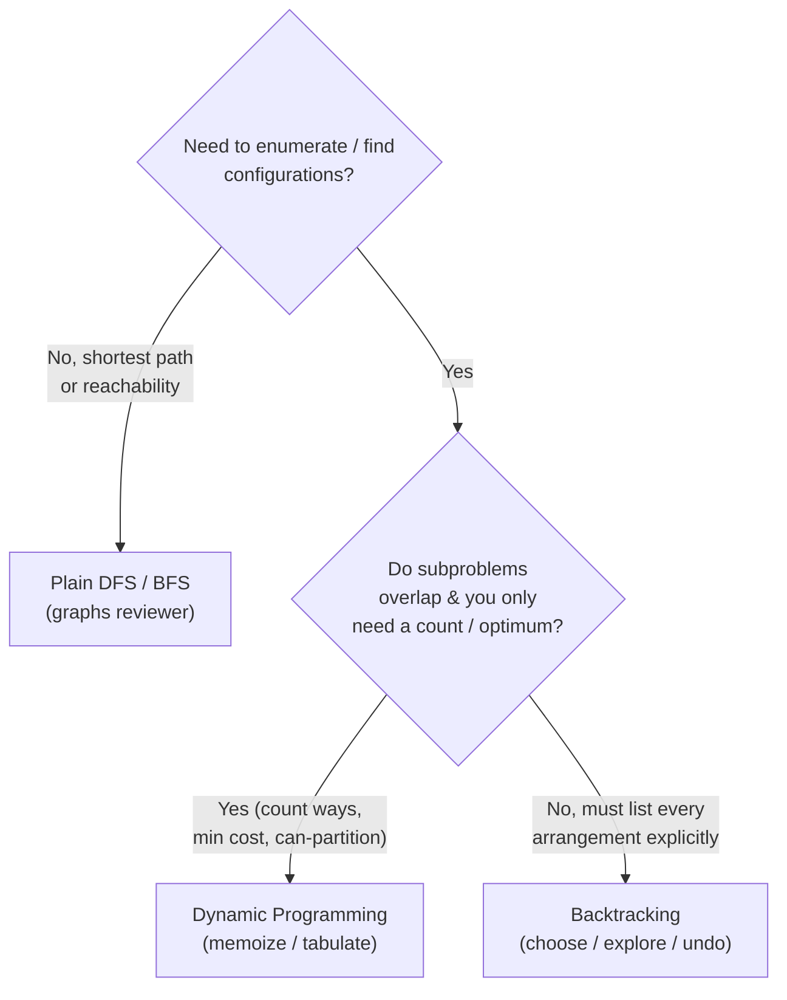

# Backtracking (Reviewer)

[Backtracking](algorithms-glossary-reviewer.md#backtracking "Explore all candidates by building one choice at a time and undoing dead ends.") is **systematic exhaustive search** over a tree of partial solutions. At each step you make a *choice*, [recurse](algorithms-glossary-reviewer.md#recursion "A function solving a problem by calling itself on smaller versions of it.") to extend the partial solution, then **undo** that choice before trying the next one. It is the universal tool for problems that ask you to *enumerate* or *find* configurations: all [subsets](algorithms-glossary-reviewer.md#subset "Any selection from a set; n elements have 2^n subsets including empty and full."), all [permutations](algorithms-glossary-reviewer.md#permutation "An ordered arrangement of elements; n distinct items have n! permutations."), all [combinations](algorithms-glossary-reviewer.md#combination "A selection of elements where order does not matter.") summing to a target, all ways to place N queens, every path through a grid that spells a word. Whenever the answer is "produce every valid arrangement" or "does any valid arrangement exist", backtracking is the default pattern.

The defining mental model is the **[decision tree](algorithms-glossary-reviewer.md#decision-tree "The conceptual tree of all choices a backtracking algorithm could make.")** (also called the state-space tree). The root is the empty partial solution; each edge is one choice; each leaf is a complete candidate. A naive search visits every leaf, which is [exponential](algorithms-glossary-reviewer.md#exponential-time "Adding one element roughly doubles the work; cost of two choices per item.") — `2^n` for include/exclude subset trees, `n!` for permutation trees. Backtracking earns its keep through **[pruning](algorithms-glossary-reviewer.md#pruning "Cutting off search branches that cannot lead to a valid or better solution.")**: when a partial solution can never lead to a valid answer, you abandon the entire subtree below it without exploring it. The skill being tested in interviews is (1) recognizing the decision tree, (2) writing the clean choose / explore / un-choose template, and (3) pruning correctly so you do not double-count or recompute. This maps directly to the `backtracking` folder in `leet-practice` (e.g. `backtracking/subsets`, `backtracking/permutations`).

Related: [Algorithm Patterns Index](algorithm-patterns-index-reviewer.md) · [Recursion & Divide and Conquer](recursion-and-divide-and-conquer-reviewer.md) · [Dynamic Programming](dynamic-programming-reviewer.md) · [Graphs](graphs-reviewer.md) · [Trees & BSTs](trees-and-binary-search-trees-reviewer.md) · [Glossary](algorithms-glossary-reviewer.md)

## Contents
- [The backtracking template](#the-backtracking-template)
- [The state-space tree and pruning](#the-state-space-tree-and-pruning)
- [Subsets (include / exclude)](#subsets-include--exclude)
- [Subsets II (duplicates in input)](#subsets-ii-duplicates-in-input)
- [Combinations (choose k with a start index)](#combinations-choose-k-with-a-start-index)
- [Permutations (used[] and swap-in-place)](#permutations-used-and-swap-in-place)
- [Combination Sum (reuse allowed)](#combination-sum-reuse-allowed)
- [Combination Sum II (each used once)](#combination-sum-ii-each-used-once)
- [Grid backtracking: Word Search](#grid-backtracking-word-search)
- [Palindrome Partitioning](#palindrome-partitioning)
- [Letter Combinations of a Phone Number](#letter-combinations-of-a-phone-number)
- [Generate Parentheses](#generate-parentheses)
- [N-Queens with conflict sets](#n-queens-with-conflict-sets)
- [Complexity of backtracking](#complexity-of-backtracking)
- [Backtracking vs DFS vs DP](#backtracking-vs-dfs-vs-dp)
- [Interview Q&A](#interview-qa)
- [Rapid-fire round](#rapid-fire-round)
- [Exam-style questions](#exam-style-questions)
- [30-second takeaway](#30-second-takeaway)
- [Quick recall checklist](#quick-recall-checklist)
- [References](#references)

---

## The backtracking template

Every backtracking solution is the same three-line skeleton wrapped around a [base case](algorithms-glossary-reviewer.md#base-case "The condition where a recursive function stops and returns a direct answer."): **choose** a candidate, **explore** (recurse), then **un-choose** (restore state). The un-choose step is what makes it "backtracking" — it rewinds the world so the next sibling branch starts from a clean slate.

Key points:

- The recursive function carries the **current partial solution** (a path/state buffer) and enough context to enumerate the next choices.
- The **base case** records a complete solution (copy it — see below) and returns.
- The loop body does **choose → recurse → un-choose** for each candidate. If you mutate shared state (a `List`, a `bool[]`, a grid cell), you must undo it on the way out.
- **Always copy the path when recording** (`new List<int>(path)`). The path buffer keeps changing as recursion continues; storing the reference would leave every result pointing at the same, eventually-empty, list.
- **Pruning** lives at the top of the loop (skip invalid choices) or as an early `return` in the base case.



*The general backtracking template: test the base case, then loop choices doing choose / recurse / undo, pruning invalid choices before descending.*

```csharp
void Backtrack(State state, List<T> path, IList<IList<T>> results)
{
    if (IsComplete(state, path))
    {
        results.Add(new List<T>(path)); // copy! path keeps mutating
        return;
    }

    foreach (T choice in CandidatesFor(state))
    {
        if (!IsValid(state, choice)) continue; // prune

        path.Add(choice);                       // CHOOSE
        Backtrack(Apply(state, choice), path, results); // EXPLORE
        path.RemoveAt(path.Count - 1);          // UN-CHOOSE
    }
}
```

## The state-space tree and pruning

The state-space tree is the conceptual tree of all partial solutions. Drawing it (even roughly) is the fastest way to reason about correctness and complexity. **Pruning** = cutting a [node](algorithms-glossary-reviewer.md#node "A container in a linked structure holding a value plus references to neighbors.") whose entire [subtree](algorithms-glossary-reviewer.md#subtree "A node together with all of its descendants, treated as a tree itself.") is guaranteed to contain no valid [leaf](algorithms-glossary-reviewer.md#leaf "A node with no children; the endpoint of a branch.").

Key points:

- **Depth** of the tree = length of a complete solution (n for permutations/subsets of n items).
- **Branching factor** = number of choices at each node. It can shrink as you descend (permutations: n, then n-1, then n-2 …).
- A prune at a node near the [root](algorithms-glossary-reviewer.md#root "The single topmost node of a tree, the one with no parent.") removes an **entire subtree** — that is why early, aggressive pruning matters far more than micro-optimizing the leaf.
- Two classic prunes: **feasibility** (this choice already violates a [constraint](algorithms-glossary-reviewer.md#constraints "The limits a problem places on inputs; reading them first picks your complexity target."), e.g. sum overshoots target, queen attacked) and **de-duplication** (skip an equal sibling to avoid generating the same set twice).



*Pruning a state-space tree: any node whose remaining target goes negative is abandoned, killing its whole subtree before it is explored.*

## Subsets (include / exclude)

The cleanest decision tree: for each element, **include it or exclude it**. With n elements there are `2^n` subsets. Maps to LC 78 — Subsets and the `backtracking/subsets` practice folder.

Key points:

- Two equivalent formulations: the **binary include/exclude** tree (decide on element `i`, then recurse on `i+1`), or the **start-index loop** that adds the path at every node.
- There are **2^n** subsets; each must be copied out, and the average subset length is n/2, so total work is **O(n · 2^n)** time, **O(n · 2^n)** space for the output (plus O(n) recursion stack).
- No `used[]` is needed because the **start [index](algorithms-glossary-reviewer.md#index "The integer position of an element; 0-indexed starts at 0, 1-indexed at 1.") `i`** guarantees you only ever look forward — each element is decided exactly once.
- Record the path at **every node**, not only leaves: the empty set, singletons, etc. are all valid subsets.



*The subsets decision tree for `[1,2,3]`: each level chooses include or exclude for one element; the 8 leaves are the 8 subsets.*

```csharp
public IList<IList<int>> Subsets(int[] nums)
{
    var results = new List<IList<int>>();
    var path = new List<int>();

    void Backtrack(int start)
    {
        results.Add(new List<int>(path)); // every node is a valid subset
        for (int i = start; i < nums.Length; i++)
        {
            path.Add(nums[i]);             // CHOOSE
            Backtrack(i + 1);              // EXPLORE (forward only)
            path.RemoveAt(path.Count - 1); // UN-CHOOSE
        }
    }

    Backtrack(0);
    return results;
}
```

For `nums = [1,2,3]` this returns `[[], [1], [1,2], [1,2,3], [1,3], [2], [2,3], [3]]` — 8 subsets.

## Subsets II (duplicates in input)

When the input has duplicates (LC 90 — Subsets II), the naive tree produces duplicate subsets. The fix is universal across all "II" variants: **sort, then at the same tree depth skip an element equal to its previous sibling.**

Key points:

- **Sort first** so equal values are adjacent. Without sorting you cannot detect equal siblings cheaply.
- In the loop, skip when `i > start && nums[i] == nums[i-1]`. The `i > start` guard is critical: it allows the **first** occurrence at this level to branch, but blocks the **second-and-later** equal siblings, which would regenerate an identical subset.
- This does **not** forbid using a duplicate value twice in one subset — it only forbids two siblings choosing the same value at the same position. Going *deeper* with the next equal element is still allowed because there `i == start`.

```text
nums sorted = [1, 2, 2]      depth d, start index s
 path=[]         s=0   i=0 ->[1]   i=1 ->[2]   i=2 skip (i>s & nums[2]==nums[1])
 path=[1]        s=1   i=1 ->[1,2] i=2 skip (i>s & equal)
 path=[1,2]      s=2   i=2 ->[1,2,2]
 path=[2]        s=2   i=2 ->[2,2]
results: [], [1], [1,2], [1,2,2], [2], [2,2]   (no dup)
```

*Subsets II skip rule: at each level the second equal sibling (`i>start && nums[i]==nums[i-1]`) is pruned, so `[2]` is generated once though there are two 2s.*

```csharp
public IList<IList<int>> SubsetsWithDup(int[] nums)
{
    Array.Sort(nums);
    var results = new List<IList<int>>();
    var path = new List<int>();

    void Backtrack(int start)
    {
        results.Add(new List<int>(path));
        for (int i = start; i < nums.Length; i++)
        {
            if (i > start && nums[i] == nums[i - 1]) continue; // skip equal sibling
            path.Add(nums[i]);
            Backtrack(i + 1);
            path.RemoveAt(path.Count - 1);
        }
    }

    Backtrack(0);
    return results;
}
```

## Combinations (choose k with a start index)

A combination is an **unordered** selection — `{1,2}` and `{2,1}` are the same. The start index makes order irrelevant by only ever moving forward, so each combination is generated exactly once. (No [LeetCode](algorithms-glossary-reviewer.md#leetcode "An online platform of coding-interview problems with an automated judge.") citation from this topic's list maps here; this section establishes the start-index idea that combination-sum problems reuse.)

Key points:

- Choosing **k of n** uses the same start-index loop as subsets, but the base case records only when `path.Count == k`.
- The start index `i+1` (move past the chosen element) prevents reuse and prevents producing both `{a,b}` and `{b,a}`.
- A strong extra prune: stop the loop when **too few elements remain** to reach size k — if `n - i < k - path.Count`, no completion is possible.
- There are `C(n,k)` combinations; the tree depth is k.

```csharp
public IList<IList<int>> Combine(int n, int k)
{
    var results = new List<IList<int>>();
    var path = new List<int>();

    void Backtrack(int start)
    {
        if (path.Count == k)
        {
            results.Add(new List<int>(path));
            return;
        }
        // prune: need (k - path.Count) more, only (n - start + 1) remain
        for (int i = start; i <= n - (k - path.Count) + 1; i++)
        {
            path.Add(i);
            Backtrack(i + 1);
            path.RemoveAt(path.Count - 1);
        }
    }

    Backtrack(1);
    return results;
}
```

## Permutations (used[] and swap-in-place)

A permutation is an **ordered** arrangement using every element (LC 46 — Permutations). Unlike subsets/combinations, every position can be any *not-yet-used* element, so the branching factor starts at n and shrinks by one each level. Maps to `backtracking/permutations`.

Key points:

- Two idiomatic implementations: a **`used[]` boolean [array](algorithms-glossary-reviewer.md#array "A fixed-size contiguous block of same-type elements accessed by position in O(1).")** (mark an element used, recurse, unmark), or **swap-in-place** (swap the current index with each later index to fix one position at a time).
- There are **n!** permutations; the tree has n levels with branching n, n-1, n-2, …, 1. Time is **O(n · n!)** (the extra n is the per-leaf copy), space is **O(n)** for the recursion stack and `used[]` plus the output.
- **Order matters**, so there is no start index — you iterate over *all* indices each level and skip the ones already used.
- The pruned tree is much smaller than a full n-ary tree of depth n: once an element is used on the current path, that branch is cut.



*The permutations decision tree for `[1,2,3]`: used elements are pruned from each branch, so the branching factor drops 3 -&gt; 2 -&gt; 1, yielding 3! = 6 leaves.*

```csharp
public IList<IList<int>> Permute(int[] nums)
{
    var results = new List<IList<int>>();
    var path = new List<int>();
    var used = new bool[nums.Length];

    void Backtrack()
    {
        if (path.Count == nums.Length)
        {
            results.Add(new List<int>(path));
            return;
        }
        for (int i = 0; i < nums.Length; i++)
        {
            if (used[i]) continue;        // skip already-placed elements
            used[i] = true; path.Add(nums[i]);              // CHOOSE
            Backtrack();                                    // EXPLORE
            used[i] = false; path.RemoveAt(path.Count - 1); // UN-CHOOSE
        }
    }

    Backtrack();
    return results;
}
```

The swap-in-place variant avoids the `used[]` array and the path buffer by mutating `nums` directly:

```csharp
public IList<IList<int>> PermuteSwap(int[] nums)
{
    var results = new List<IList<int>>();

    void Backtrack(int start)
    {
        if (start == nums.Length)
        {
            results.Add(new List<int>(nums));
            return;
        }
        for (int i = start; i < nums.Length; i++)
        {
            (nums[start], nums[i]) = (nums[i], nums[start]); // CHOOSE: fix nums[start]
            Backtrack(start + 1);                            // EXPLORE
            (nums[start], nums[i]) = (nums[i], nums[start]); // UN-CHOOSE: swap back
        }
    }

    Backtrack(0);
    return results;
}
```

Note the swap version does **not** emit permutations in lexicographic order, whereas the `used[]` version does when the input is sorted ascending.

## Combination Sum (reuse allowed)

LC 39 — Combination Sum: find all combinations of `candidates` (distinct) summing to `target`, where **each candidate may be reused unlimited times**. The reuse is encoded by recursing with the **same index `i`** (not `i+1`).

Key points:

- Recurse with **`i`, not `i+1`**, to allow picking the same candidate again. Using a start index (never going backward) is what stops `[2,3]` and `[3,2]` both appearing.
- **Prune on overshoot**: if `remaining - candidates[i] < 0`, skip. If you **sort candidates first**, you can `break` instead of `continue` — once one candidate overshoots, every later (larger) one does too.
- The depth of the tree is bounded by `target / min(candidates)`; complexity is exponential and hard to tighten — roughly **O(n^(target/min))** in the worst case.

```text
candidates = [2,3,6,7]   target = 7   (sorted)
choose/explore/un-choose stack, rem = remaining target:

push 2  rem=5  path=[2]
  push 2  rem=3  path=[2,2]
    push 2  rem=1  path=[2,2,2]
      candidates[i]=2 > rem=1  -> break (larger candidates also overshoot)
    pop 2         path=[2,2]
    push 3  rem=0  path=[2,2,3]  -> RECORD [2,2,3]
    pop 3         path=[2,2]
  pop 2           path=[2]
  push 3  rem=2  path=[2,3]
    candidates[i]=3 > rem=2  -> break
  pop 3           path=[2]
pop 2             path=[]
push 3  rem=4  path=[3]
  push 3  rem=1  path=[3,3]
    candidates[i]=3 > rem=1  -> break
  pop 3           path=[3]
  candidates[i]=6 > rem=4  -> break
pop 3             path=[]
push 6  rem=1  path=[6]
  candidates[i]=6 > rem=1  -> break
pop 6             path=[]
push 7  rem=0  path=[7]  -> RECORD [7]
pop 7
results: [[2,2,3], [7]]
```

*Choose / explore / un-choose stack for Combination Sum on `[2,3,6,7]`, target 7: the stack grows on a choice, shrinks on backtrack, and records whenever the remaining target hits 0.*

```csharp
public IList<IList<int>> CombinationSum(int[] candidates, int target)
{
    Array.Sort(candidates); // enables the break-on-overshoot prune
    var results = new List<IList<int>>();
    var path = new List<int>();

    void Backtrack(int start, int remaining)
    {
        if (remaining == 0)
        {
            results.Add(new List<int>(path));
            return;
        }
        for (int i = start; i < candidates.Length; i++)
        {
            if (candidates[i] > remaining) break; // sorted -> rest also overshoot
            path.Add(candidates[i]);
            Backtrack(i, remaining - candidates[i]); // i, not i+1 -> reuse allowed
            path.RemoveAt(path.Count - 1);
        }
    }

    Backtrack(0, target);
    return results;
}
```

## Combination Sum II (each used once)

LC 40 — Combination Sum II: the input may contain **duplicates**, and **each element may be used at most once**. This combines the start-index "no reuse" rule (recurse with `i+1`) with the Subsets II "skip equal sibling" de-dup rule.

Key points:

- Recurse with **`i+1`** so each *position* in the array is used at most once (a true duplicate value at another index can still be picked when you descend).
- **Sort, then skip** `i > start && candidates[i] == candidates[i-1]` to avoid emitting the same combination twice from two equal siblings.
- Same overshoot prune as Combination Sum (`break` after sort).
- The two rules are orthogonal: `i+1` handles "use each index once"; the sibling-skip handles "don't repeat a combination."

```csharp
public IList<IList<int>> CombinationSum2(int[] candidates, int target)
{
    Array.Sort(candidates);
    var results = new List<IList<int>>();
    var path = new List<int>();

    void Backtrack(int start, int remaining)
    {
        if (remaining == 0)
        {
            results.Add(new List<int>(path));
            return;
        }
        for (int i = start; i < candidates.Length; i++)
        {
            if (i > start && candidates[i] == candidates[i - 1]) continue; // skip dup sibling
            if (candidates[i] > remaining) break;                          // overshoot prune
            path.Add(candidates[i]);
            Backtrack(i + 1, remaining - candidates[i]);                   // i+1 -> each used once
            path.RemoveAt(path.Count - 1);
        }
    }

    Backtrack(0, target);
    return results;
}
```

For `candidates = [10,1,2,7,6,1,5]`, `target = 8` (sorted to `[1,1,2,5,6,7,10]`) this returns `[[1,1,6], [1,2,5], [1,7], [2,6]]`.

## Grid backtracking: Word Search

LC 79 — Word Search: does `word` exist in a 2-D `board` along a path of orthogonally adjacent cells, with no cell reused? The backtracking twist is that the "state to undo" is **a board cell you marked visited** — you must restore it on the way out.

Key points:

- From each starting cell, [DFS](algorithms-glossary-reviewer.md#depth-first-search "Explores as far down one branch as possible before backtracking.") in 4 directions. The path is implicit (the recursion stack); the **visited mark** is the mutable state.
- **Mark and restore in place**: overwrite the cell with a sentinel (e.g. `'#'`) before recursing, then write the original character back after. This avoids a separate `bool[,]` visited array and the allocation it needs.
- **Prune immediately**: bounds check, character-mismatch check, and visited check at the top of the recursive call return `false` fast.
- Worst-case time is **O(m · n · 4^L)** where L = `word.Length` (each of m·n starts can branch 4 ways up to depth L; really 3^L after the first step since you never go back). Space is **O(L)** recursion depth.

```text
board:           word = "SEE"
  A B C E        path so far marked with #, restored after backtrack
  S F E S
  A D E E

start (1,0)='S'  matches 'S'   mark -> board[1][0]='#'
  visit (2,0)='A' != 'E'  fail
  visit (0,0)='A' != 'E'  fail
  visit (1,1)='F' != 'E'  fail            (only 3 in-bounds neighbors; left at col -1 is out of bounds)
  -> dead end, RESTORE board[1][0]='S', backtrack

start (1,3)='S'  matches 'S'   mark -> board[1][3]='#'
  visit (2,3)='E' == 'E'  mark -> board[2][3]='#'    (down first, per code order)
    need next 'E': visit (2,2)='E' == 'E'  word consumed -> return TRUE
  (success: cells restored as the stack unwinds)
```

*Word Search marks a cell `'#'` on entry and restores its letter on exit; the trace shows a dead-end branch fully restored before a second start finds "S-E-E".*

```csharp
public bool Exist(char[][] board, string word)
{
    int rows = board.Length, cols = board[0].Length;

    bool Dfs(int r, int c, int k)
    {
        if (k == word.Length) return true;                       // whole word matched
        if (r < 0 || r >= rows || c < 0 || c >= cols) return false;
        if (board[r][c] != word[k]) return false;                // mismatch / sentinel

        char saved = board[r][c];
        board[r][c] = '#';                                       // MARK visited
        bool found = Dfs(r + 1, c, k + 1) || Dfs(r - 1, c, k + 1)
                  || Dfs(r, c + 1, k + 1) || Dfs(r, c - 1, k + 1);
        board[r][c] = saved;                                     // RESTORE
        return found;
    }

    for (int r = 0; r < rows; r++)
        for (int c = 0; c < cols; c++)
            if (Dfs(r, c, 0)) return true;

    return false;
}
```

## Palindrome Partitioning

LC 131 — Palindrome Partitioning: split a string into [substrings](algorithms-glossary-reviewer.md#subarray-subsequence-and-substring "Subarray/substring is a contiguous slice; subsequence keeps order but may skip.") that are **all [palindromes](algorithms-glossary-reviewer.md#palindrome "A sequence that reads the same forwards and backwards, like racecar.")**, returning every such partition. The choices at each step are the possible **next cut points**.

Key points:

- At position `start`, try every end index `i`; if `s[start..i]` is a palindrome, **choose** it, recurse from `i+1`, then **un-choose**.
- The base case is `start == s.Length` (the whole string consumed) → record the current list of pieces.
- The palindrome check itself is an O(length) [two-pointer](algorithms-glossary-reviewer.md#two-pointers "Two index variables moving through a sequence to solve it in one linear pass.") test; you can precompute an `O(n^2)` [DP](algorithms-glossary-reviewer.md#dynamic-programming "Solving problems with overlapping subproblems by computing each once and reusing it.") table of `isPalindrome[i][j]` to make each check O(1), but for interview purposes the inline check is fine.
- Worst case (e.g. all identical characters) there are `2^(n-1)` partitions, so time is **O(n · 2^n)**.

```csharp
public IList<IList<string>> Partition(string s)
{
    var results = new List<IList<string>>();
    var path = new List<string>();

    static bool IsPalindrome(string s, int lo, int hi)
    {
        while (lo < hi)
            if (s[lo++] != s[hi--]) return false;
        return true;
    }

    void Backtrack(int start)
    {
        if (start == s.Length)
        {
            results.Add(new List<string>(path));
            return;
        }
        for (int i = start; i < s.Length; i++)
        {
            if (!IsPalindrome(s, start, i)) continue;      // prune non-palindromic cuts
            path.Add(s.Substring(start, i - start + 1));   // CHOOSE the piece
            Backtrack(i + 1);                              // EXPLORE the remainder
            path.RemoveAt(path.Count - 1);                 // UN-CHOOSE
        }
    }

    Backtrack(0);
    return results;
}
```

For `s = "aab"` this returns `[["a","a","b"], ["aa","b"]]`.

## Letter Combinations of a Phone Number

LC 17 — Letter Combinations of a Phone Number: map a digit string to all letter combinations (like old T9 keypads). The branching factor per digit is 3 or 4; the depth is the number of digits.

Key points:

- Each digit contributes one level of the tree; the choices at that level are its 3–4 letters.
- There is **no de-dup and no start index** — every position is independent, so it is a pure Cartesian product.
- For an input of length n with up to 4 letters per digit, there are at most **4^n** combinations; time is **O(n · 4^n)**, space **O(n)** stack.
- Guard the empty input: an empty digit string yields an **empty result list**, not a list containing the empty string.

```csharp
public IList<string> LetterCombinations(string digits)
{
    var results = new List<string>();
    if (string.IsNullOrEmpty(digits)) return results;

    string[] map = { "", "", "abc", "def", "ghi", "jkl", "mno", "pqrs", "tuv", "wxyz" };
    var sb = new System.Text.StringBuilder();

    void Backtrack(int index)
    {
        if (index == digits.Length)
        {
            results.Add(sb.ToString());
            return;
        }
        foreach (char letter in map[digits[index] - '0'])
        {
            sb.Append(letter);            // CHOOSE
            Backtrack(index + 1);         // EXPLORE next digit
            sb.Length--;                  // UN-CHOOSE (drop last char)
        }
    }

    Backtrack(0);
    return results;
}
```

For `digits = "23"` this returns `["ad","ae","af","bd","be","bf","cd","ce","cf"]` — 9 = 3 × 3 combinations.

## Generate Parentheses

LC 22 — Generate Parentheses: produce all well-formed strings of `n` pairs of parentheses. The pruning here is what makes it efficient — you never build an invalid prefix.

Key points:

- Track counts of **open** and **close** parens placed so far.
- **Prune rules:** you may add `'('` only while `open < n`; you may add `')'` only while `close < open` (otherwise the prefix is already invalid).
- Because invalid prefixes are never built, every leaf is a valid string — no validity filter at the end.
- The number of results is the **n-th Catalan number** `C(n) = (2n)! / ((n+1)! · n!)`; total time is **O(4^n / sqrt(n))** (asymptotic Catalan growth), space O(n).

```csharp
public IList<string> GenerateParenthesis(int n)
{
    var results = new List<string>();
    var sb = new System.Text.StringBuilder();

    void Backtrack(int open, int close)
    {
        if (sb.Length == 2 * n)
        {
            results.Add(sb.ToString());
            return;
        }
        if (open < n)                       // can still open
        {
            sb.Append('('); Backtrack(open + 1, close); sb.Length--;
        }
        if (close < open)                   // can close only if it stays balanced
        {
            sb.Append(')'); Backtrack(open, close + 1); sb.Length--;
        }
    }

    Backtrack(0, 0);
    return results;
}
```

For `n = 2` this returns `["(())", "()()"]` — Catalan(2) = 2.

## N-Queens with conflict sets

LC 51 — N-Queens: place n queens on an n×n board so none attack another. The elegant formulation places **one queen per row** and tracks attacked **columns and the two diagonals** in [hash sets](algorithms-glossary-reviewer.md#hash-set "Stores unique keys with O(1) average membership testing and no values.") for **O(1)** conflict checks.

Key points:

- Place queens **row by row**; at row `r`, try each column `c`. This automatically prevents two queens in the same row.
- Three constant-time conflict checks via sets:
  - **column** `c` already used.
  - **major diagonal** identified by `r - c` (constant along a "\\" diagonal).
  - **minor (anti) diagonal** identified by `r + c` (constant along a "/" diagonal).
- Choose: add `c`, `r-c`, `r+c` to the sets and record the queen's column for this row. Un-choose: remove all three and pop the row.
- Worst case is **O(n!)**-ish (column branching shrinks by conflicts), space O(n) for the sets and the recursion.



*N-Queens decision flow: one queen per row, O(1) safety check against the column / diagonal / anti-diagonal sets, then choose-recurse-undo.*

```csharp
public IList<IList<string>> SolveNQueens(int n)
{
    var results = new List<IList<string>>();
    var cols = new HashSet<int>();
    var diag = new HashSet<int>();   // r - c
    var anti = new HashSet<int>();   // r + c
    var queenCol = new int[n];       // queenCol[r] = column of the queen in row r

    void Backtrack(int r)
    {
        if (r == n)
        {
            var board = new List<string>(n);
            for (int row = 0; row < n; row++)
            {
                var line = new char[n];
                Array.Fill(line, '.');
                line[queenCol[row]] = 'Q';
                board.Add(new string(line));
            }
            results.Add(board);
            return;
        }
        for (int c = 0; c < n; c++)
        {
            if (cols.Contains(c) || diag.Contains(r - c) || anti.Contains(r + c)) continue;
            cols.Add(c); diag.Add(r - c); anti.Add(r + c); queenCol[r] = c;   // CHOOSE
            Backtrack(r + 1);                                                 // EXPLORE
            cols.Remove(c); diag.Remove(r - c); anti.Remove(r + c);           // UN-CHOOSE
        }
    }

    Backtrack(0);
    return results;
}
```

For `n = 4` this finds **2** distinct solutions; for `n = 8` it finds **92**.

## Complexity of backtracking

Backtracking is inherently exponential because the **outputs themselves are exponential** — you cannot enumerate `2^n` subsets in less than `Ω(2^n)` time. Pruning lowers the *constant* and prunes whole subtrees, but does not change the worst-case class when the answer set is genuinely large.

| Problem | LeetCode | # results (worst) | Time | Space (excl. output) |
| --- | --- | --- | --- | --- |
| Subsets | LC 78 | `2^n` | O(n · 2^n) | O(n) stack |
| Subsets II | LC 90 | ≤ `2^n` | O(n · 2^n) | O(n) stack |
| Permutations | LC 46 | `n!` | O(n · n!) | O(n) stack + used[] |
| Combinations C(n,k) | — | `C(n,k)` | O(k · C(n,k)) | O(k) stack |
| Combination Sum | LC 39 | exponential | O(n^(T/min)) | O(T/min) stack |
| Combination Sum II | LC 40 | exponential | O(2^n) worst | O(n) stack |
| Word Search | LC 79 | boolean | O(m·n·4^L) | O(L) stack |
| Palindrome Partitioning | LC 131 | ≤ `2^(n-1)` | O(n · 2^n) | O(n) stack |
| Letter Combinations | LC 17 | ≤ `4^n` | O(n · 4^n) | O(n) stack |
| Generate Parentheses | LC 22 | Catalan(n) | O(4^n / √n) | O(n) stack |
| N-Queens | LC 51 | varies | O(n!) | O(n) sets + stack |

*The extra factor (n, k, L) in each "Time" is the cost of copying/serializing one complete solution into the output; the recursion-stack depth equals the solution length.*

Key points:

- **Output-bound.** When the answer is "all of them," time is at least the number of answers times the cost to write one. No algorithm beats that.
- **Pruning helps constants, sometimes a lot.** Generate Parentheses prunes so hard it visits only Catalan(n) leaves, not `2^(2n)`. N-Queens' diagonal sets cut huge swaths early.
- **Space** is the recursion depth (one frame per level) plus any auxiliary structure (`used[]`, conflict sets) — usually O(n), not exponential, because we hold one path at a time, not the whole tree.
- Counting "the number of leaves explored" is the honest way to reason about a specific backtracking run; the table gives the asymptotic worst case.

## Backtracking vs DFS vs DP



*Decision guide: backtracking enumerates explicit arrangements; DP collapses [overlapping subproblems](algorithms-glossary-reviewer.md#overlapping-subproblems "The recursive breakdown keeps hitting the same smaller subproblems repeatedly.") when you only need a count or an optimum; DFS is the bare traversal both build on.*

Key points:

- **Backtracking is DFS over the state-space tree with un-choose.** Every backtracking routine *is* a DFS; the distinguishing feature is the explicit *undo* that restores shared state between sibling branches.
- **DFS** (in the graphs sense) traverses a fixed graph to answer reachability/ordering; it does not generally need to "undo" choices because nodes are visited once.
- **DP wins when subproblems overlap and you only need a number or an optimum**, not the explicit list. "How many ways to make change" (count) is DP; "list every way to make change" is backtracking. If you find yourself [memoizing](algorithms-glossary-reviewer.md#memoization "Speeding up recursion by caching each subproblem's result the first time.") a backtracking function and the answer is a single value, you have crossed into DP — see the [Dynamic Programming](dynamic-programming-reviewer.md) reviewer.
- A frequent interview misconception: "add memoization to any backtracking and it's faster." Memoization only helps when **states repeat** *and* you do not need to materialize each distinct path. Enumerating all permutations has no overlapping subproblems to memoize — every path is unique — so DP cannot help there.

## Interview Q&A

### Template & correctness

Q: What are the three steps of the backtracking template?
A: Choose (apply a candidate to the current state/path), explore (recurse to extend the partial solution), un-choose (undo the change so the next sibling branch starts clean). Wrapped around a base case that records a *copy* of a complete solution.

Q: Why must you copy the path when recording a solution?
A: The path buffer is mutated continuously by later choose/un-choose steps. Storing the reference would make every recorded result alias the same list, which ends up empty (or wrong) after recursion unwinds. `new List<int>(path)` snapshots it.

Q: When do you record at every node vs only at leaves?
A: Subsets record at every node (each partial path is itself a valid subset). Permutations, combinations of fixed size k, combination sums, and parentheses record only when the base case (complete/valid) is met.

### Duplicates & ordering

Q: How do you avoid duplicate results when the input has duplicates?
A: Sort the input, then in the per-level loop skip an element equal to the previous one at the same depth: `if (i > start && nums[i] == nums[i-1]) continue;`. The `i > start` guard lets the first occurrence branch but blocks repeated equal siblings. Used in Subsets II and Combination Sum II.

Q: Why does the duplicate-skip use `i > start` and not `i > 0`?
A: `i > 0` would wrongly block using a duplicate value deeper in the same path (legitimate reuse across levels). `i > start` only blocks the *second equal sibling at the current level*, which is exactly the duplicate-result case.

Q: Combination Sum recurses with `i`; Combination Sum II with `i+1`. Why?
A: Combination Sum allows reusing a candidate, so you stay at index `i` to pick it again. Combination Sum II uses each element at most once, so you advance to `i+1`; duplicates in the input are then handled by the sibling-skip rule.

### Permutations vs combinations

Q: Why do permutations need `used[]` (or swapping) but combinations need only a start index?
A: Combinations are unordered, so a forward-only start index visits each set once. Permutations are ordered and use every element, so each level may pick any *not-yet-used* index — there is no "forward only," hence a `used[]` marker or in-place swapping.

Q: Does the swap-in-place permutation generator produce results in lexicographic order?
A: No. Swapping reorders the array as it goes, so output order is not lexicographic. The `used[]` version over a sorted input does yield lexicographic order.

### Grid & constraints

Q: In Word Search, why overwrite the cell instead of using a visited array?
A: Overwriting with a sentinel (`'#'`) marks the cell visited in place with zero extra allocation, and restoring the original character on backtrack is a single assignment. It also doubles as the mismatch check, since `'#'` never equals a real word character.

Q: How does N-Queens check diagonals in O(1)?
A: Cells on the same major diagonal share a constant `r - c`; cells on the same anti-diagonal share a constant `r + c`. Storing used `r-c` and `r+c` values (plus used columns) in hash sets makes each safety check three O(1) lookups.

### Complexity & DP boundary

Q: Can pruning make backtracking polynomial?
A: Not when the output is exponential — you must still emit every result. Pruning cuts impossible subtrees (lowering the constant, sometimes dramatically as in Generate Parentheses), but enumerating `2^n` subsets is inherently `Ω(2^n)`.

Q: When should you switch from backtracking to DP?
A: When subproblems overlap *and* you only need a count or an optimum (not the explicit list of arrangements). Memoize the recursion on its state; if the answer is a single value and states repeat, that is DP. If every path is unique (e.g. all permutations) there is nothing to memoize.

## Rapid-fire round

- The three template steps → **choose, explore (recurse), un-choose (undo).**
- Why copy the path on record → **the buffer keeps mutating; store a snapshot.**
- Subsets count for n elements → **2^n.**
- Permutations count for n elements → **n!.**
- Subsets: record at every node or only leaves → **every node.**
- Avoid reuse / unordered selection → **start index, recurse with `i+1`.**
- Allow reuse (Combination Sum) → **recurse with `i`, not `i+1`.**
- De-dup with duplicate input → **sort, then skip `i > start && nums[i]==nums[i-1]`.**
- Permutations need this, combinations don't → **`used[]` (or swap-in-place).**
- Word Search visited trick → **overwrite cell with `'#'`, restore on backtrack.**
- N-Queens diagonal keys → **`r-c` (major), `r+c` (anti).**
- Generate Parentheses prune → **open only if `open<n`, close only if `close<open`.**
- Generate Parentheses result count → **Catalan(n).**
- Letter Combinations branching per digit → **3 or 4 letters.**
- N-Queens solutions for n=4 / n=8 → **2 / 92.**
- Backtracking is fundamentally → **DFS over the state-space tree with undo.**
- When DP beats backtracking → **overlapping subproblems + need only a count/optimum.**
- Space of a backtracking run (excl. output) → **O(depth) recursion stack.**

## Exam-style questions

1. What does this print, and why is it wrong?

```csharp
var results = new List<IList<int>>();
var path = new List<int>();
void Backtrack(int[] nums, int start)
{
    results.Add(path);                 // <-- note: no copy
    for (int i = start; i < nums.Length; i++)
    {
        path.Add(nums[i]);
        Backtrack(nums, i + 1);
        path.RemoveAt(path.Count - 1);
    }
}
Backtrack(new[] {1, 2}, 0);
// Console.WriteLine(results.Count + " lists, first = " + string.Join(",", results[0]));
```

**Answer:** Every entry in `results` is the **same reference** to `path`, which is empty after the
recursion fully unwinds. `results.Count` is 4 (`[], [1], [1,2], [2]` were *intended*) but each element
prints as empty. Fix: `results.Add(new List<int>(path));`. This is the single most common backtracking
bug.

2. Trace which combinations this produces for `candidates = [2,3,5]`, `target = 8`, and state the rule that prevents duplicates like `[3,5]` and `[5,3]`.

```csharp
// Combination Sum (reuse allowed), recursing with i (not i+1)
```

**Answer:** Results are `[[2,2,2,2], [2,3,3], [3,5]]`. The **start index** (the loop begins at `i`, never
revisiting earlier indices) makes selection forward-only, so `[3,5]` is generated but `[5,3]` never is.
Reuse is allowed because the recursion passes `i`, letting `2` repeat.

3. For `nums = [1, 2, 2]`, why does Subsets II skip an iteration, and what is the full output?

```csharp
Array.Sort(nums); // [1,2,2]
// skip when i > start && nums[i] == nums[i-1]
```

**Answer:** At the top level, `start = 0`. The first `2` (index 1) branches normally. The second `2`
(index 2) satisfies `i > start && nums[i] == nums[i-1]`, so it is skipped — otherwise it would
regenerate the subset `[2]` (and everything below it) a second time. Output:
`[[], [1], [1,2], [1,2,2], [2], [2,2]]` — six distinct subsets.

4. In N-Queens, two queens are at `(1, 3)` and `(2, 4)`. Are they attacking each other? Show the check.

```csharp
// queen A: r=1, c=3   queen B: r=2, c=4
```

**Answer:** Yes. Different rows and different columns, but the **anti-diagonal key** `r + c` is `1+3 = 4`
for A and `2+4 = 6` for B — those differ, so not the anti-diagonal. The **major-diagonal key** `r - c`
is `1-3 = -2` for A and `2-4 = -2` for B — **equal**, so they share a `"\\"` diagonal and attack. The
set-based check (`diag.Contains(r-c)`) catches this in O(1).

5. Will adding memoization speed up `Permute` (LC 46)? Explain.

```csharp
// memoize Backtrack() on its state?
```

**Answer:** No. Generating all permutations has **no overlapping subproblems** — every partial path is a
distinct prefix reached exactly once, and the output (n! permutations) must all be materialized.
Memoization only helps when identical states recur and you need a count/optimum rather than the explicit
list. This is the backtracking-vs-DP boundary.

## 30-second takeaway

> Backtracking is **DFS over a decision tree** with one extra move: after you recurse, you **undo** the
> choice so the next branch starts clean — choose, explore, un-choose. Record a **copy** of the path at
> the base case (and at every node for subsets). Use a **start index** for unordered selection
> (combinations: `i+1` no reuse, combination sum: `i` reuse); use **`used[]` or swap** for ordered
> permutations. Kill duplicate results by **sorting then skipping equal siblings** (`i > start &&
> nums[i]==nums[i-1]`). Mark-and-restore in-place for grid problems; use `r-c`/`r+c` diagonal sets for
> N-Queens. It is exponential because the **output** is, but **pruning** cuts whole subtrees and is
> where the real speedups live. Reach for DP only when subproblems overlap and you need a count/optimum.

## Quick recall checklist

- Template: **choose → explore (recurse) → un-choose**, around a base case that records a **copy**.
- **Subsets** = include/exclude, `2^n`, record at **every** node, start index, recurse `i+1`.
- **Permutations** = `n!`, ordered, need **`used[]`** or **swap-in-place**, no start index.
- **Combinations / Combination Sum**: start index; recurse **`i+1`** (no reuse) vs **`i`** (reuse).
- **Duplicates** → **sort**, then **`if (i > start && nums[i]==nums[i-1]) continue;`** (Subsets II, Combination Sum II).
- **Overshoot prune** after sort → `if (candidates[i] > remaining) break;`.
- **Word Search**: mark cell `'#'`, recurse 4 directions, **restore**; O(m·n·4^L).
- **Palindrome Partitioning**: try each cut, keep only palindromic pieces; ≤ `2^(n-1)` partitions.
- **Generate Parentheses**: open if `open<n`, close if `close<open`; **Catalan(n)** results.
- **N-Queens**: one queen per row; conflict sets keyed by **column**, **`r-c`**, **`r+c`**; n=4 → 2, n=8 → 92.
- Time is **output-bound and exponential**; space is **O(depth)** recursion stack (+ aux).
- **DP > backtracking** when subproblems overlap and only a **count/optimum** is needed.

## References

- Wikipedia — [Backtracking](https://en.wikipedia.org/wiki/Backtracking).
- Wikipedia — [Eight queens puzzle](https://en.wikipedia.org/wiki/Eight_queens_puzzle).
- Wikipedia — [Catalan number](https://en.wikipedia.org/wiki/Catalan_number).
- NeetCode — [Roadmap](https://neetcode.io/roadmap) (Backtracking section).
- LeetCode — [Study Plans](https://leetcode.com/studyplan/).
- Microsoft Learn — [`HashSet<T>` Class](https://learn.microsoft.com/en-us/dotnet/api/system.collections.generic.hashset-1).
- Microsoft Learn — [`List<T>` Class](https://learn.microsoft.com/en-us/dotnet/api/system.collections.generic.list-1).
- Microsoft Learn — [`Array.Sort` Method](https://learn.microsoft.com/en-us/dotnet/api/system.array.sort).
- Microsoft Learn — [`StringBuilder` Class](https://learn.microsoft.com/en-us/dotnet/api/system.text.stringbuilder).
- Collections Big-O in .NET — [Collections & Big-O reviewer](../dotnet/csharp/collections-and-big-o-reviewer.md).
