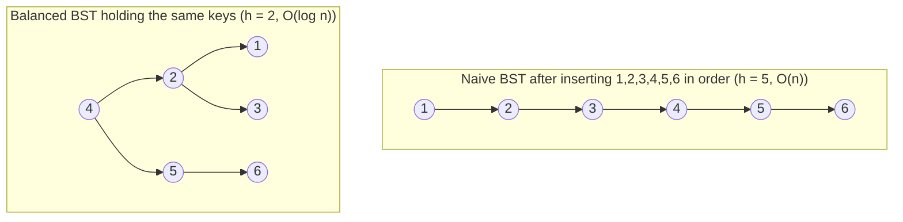
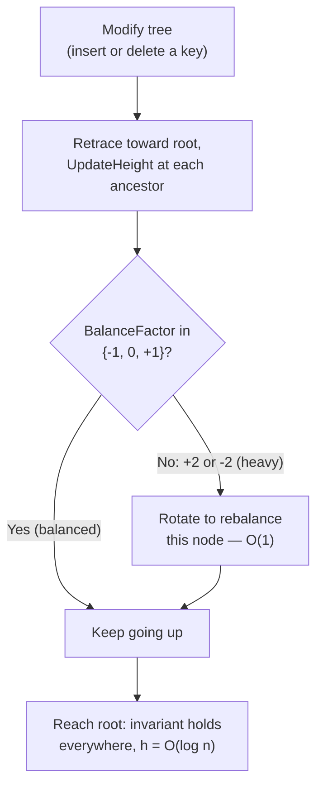
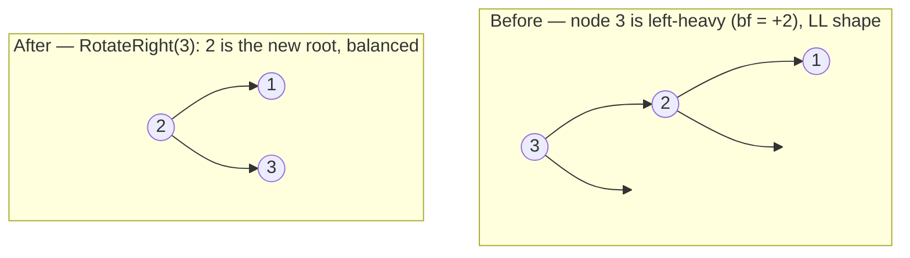
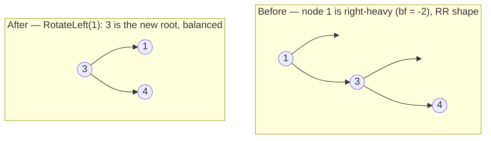
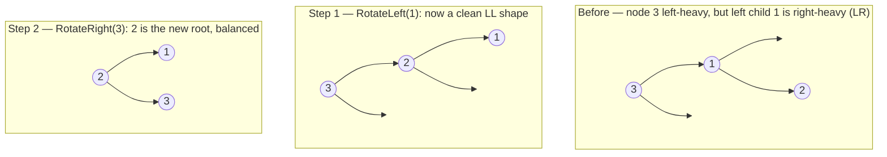
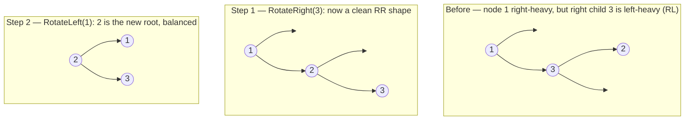
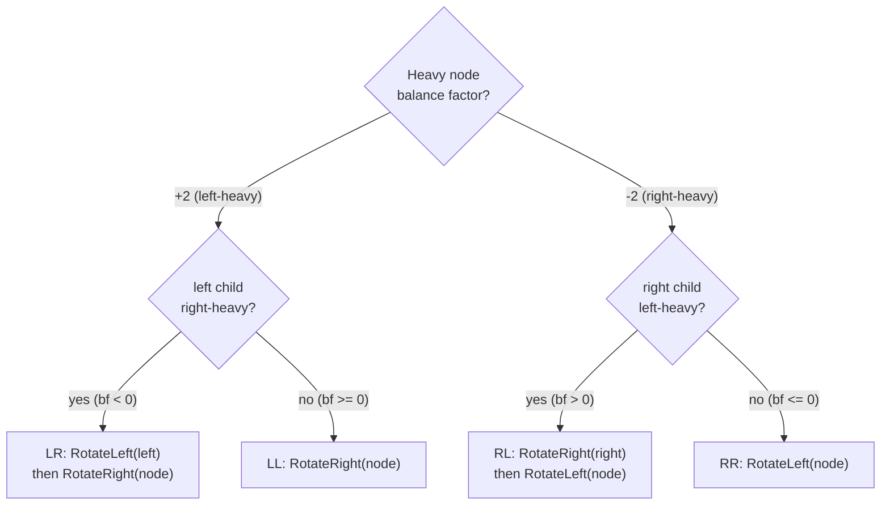
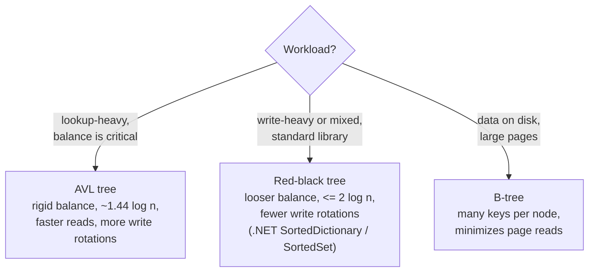

# Balanced Binary Search Trees & AVL Trees (Reviewer)

A plain **[binary search tree](algorithms-glossary-reviewer.md#binary-search-tree "A binary tree where left subtree values are smaller and right are larger.") (BST)** promises `O(h)` search, insert, and delete — but that promise is only as good as the [height](algorithms-glossary-reviewer.md#height-depth-and-level "Depth measures down from the root; height measures up from leaves; level groups by depth.") `h`. Feed a naive BST already-sorted keys (1, 2, 3, 4, 5, …) and every insert lands on the right spine: the tree degenerates into a "vine" — effectively a [linked list](algorithms-glossary-reviewer.md#linked-list "A linear structure of nodes each pointing to the next; no random access.") — and `h` grows to `n`, dragging every operation back to **[O(n)](algorithms-glossary-reviewer.md#linear-time "Work grows in direct proportion to input size, about one unit per element.")**. The whole reason to reach for a tree evaporates.

A **balanced** BST keeps `h` bounded by `O(log n)` no matter the insertion order, restoring **[O(log n)](algorithms-glossary-reviewer.md#logarithmic-time "Each step discards a constant fraction, so steps equal the log of n.")** search/insert/delete. The classic self-balancing scheme is the **AVL tree** (Adelson-Velsky and Landis, 1962): every node tracks the height of its subtrees, and after each modification the tree checks a **balance factor** and applies **rotations** — constant-time pointer rewirings — to restore balance. This reviewer covers why balance matters, height and balance factor with C# helpers, the AVL invariant, the four rotation cases (LL, RR, LR, RL), how insert and delete trigger rebalancing, the complexity summary, and a contrast with red-black trees (what .NET's `SortedDictionary`/`SortedSet` actually use).

Related: [Algorithm Patterns Index](algorithm-patterns-index-reviewer.md) · [Trees & Binary Search Trees](trees-and-binary-search-trees-reviewer.md) · [B-Trees](b-trees-reviewer.md) · [Sets & Set Algorithms](sets-and-set-algorithms-reviewer.md) · [Glossary](algorithms-glossary-reviewer.md)

## Contents

- [Why balance matters: the degenerate vine](#why-balance-matters-the-degenerate-vine)
- [Height and balance factor](#height-and-balance-factor)
- [The AVL invariant](#the-avl-invariant)
- [The node model and rotation toolkit](#the-node-model-and-rotation-toolkit)
- [Case LL: right rotation](#case-ll-right-rotation)
- [Case RR: left rotation](#case-rr-left-rotation)
- [Case LR: left-right rotation](#case-lr-left-right-rotation)
- [Case RL: right-left rotation](#case-rl-right-left-rotation)
- [Choosing the rotation](#choosing-the-rotation)
- [Insertion and the retrace](#insertion-and-the-retrace)
- [Deletion and rebalancing](#deletion-and-rebalancing)
- [Complexity summary](#complexity-summary)
- [AVL vs red-black trees](#avl-vs-red-black-trees)
- [Interview Q&A](#interview-qa)
- [Rapid-fire round](#rapid-fire-round)
- [Exam-style questions](#exam-style-questions)
- [30-second takeaway](#30-second-takeaway)
- [Quick recall checklist](#quick-recall-checklist)
- [References](#references)

---

## Why balance matters: the degenerate vine

Key points:

- A BST's operations cost **`O(h)`**, where `h` is the height. Balanced, `h = O(log n)`; degenerate, `h = n - 1`.
- **Insertion order is the enemy.** Insert sorted (or reverse-sorted) keys into a naive BST and every new key is larger (or smaller) than all before it, so each one chains off the previous on the same side. The result is a one-sided "vine."
- A fully unbalanced binary tree **is just a linked list** — same `O(n)` traversal cost — except it wastes a `null` child pointer per node. You lose every advantage the tree was supposed to give.
- This is not a rare corner case: bulk-loading already-sorted data is extremely common (importing a sorted file, replaying ordered events). A **self-balancing** tree makes the worst case impossible by construction.



*Same six keys, same BST ordering — but the unbalanced vine searches in `O(n)`, while the balanced tree searches in `O(log n)`.*

The takeaway: BST correctness (the ordering invariant) and BST **performance** (bounded height) are two separate guarantees. A naive BST gives you the first for free and the second only by luck. AVL trees pay a small bookkeeping cost on every write to guarantee both.

## Height and balance factor

Two measurements drive every balancing decision.

Key points:

- **Height** of a node = the maximum number of edges from that node down to a leaf. A leaf has height `0`; the height of a `null` child is conventionally **`-1`** so that a leaf computes as `1 + max(-1, -1) = 0`.
- **Balance factor** of a node = `height(left) - height(right)`. It measures which way the node leans:
  - `0` — perfectly even.
  - `+1` — **left-heavy** by one (left subtree one taller).
  - `-1` — **right-heavy** by one.
- A node is **"heavy"** (out of balance) when its balance factor's magnitude exceeds one — i.e. `+2` or `-2`. That is the trigger for a rotation.
- Storing height **in each node** and updating it on the way back up makes `Height` and `BalanceFactor` both `O(1)` reads. Recomputing height by walking the subtree every time would be `O(n)` and defeat the purpose.

```csharp
// Height stored on the node; null subtree has height -1 so a leaf is height 0.
private static int Height(AvlNode? node) => node?.Height ?? -1;

// Balance factor = left height minus right height. In {-1, 0, +1} when balanced.
private static int BalanceFactor(AvlNode node) => Height(node.Left) - Height(node.Right);

// Recompute a node's cached height from its children (call after any structural change).
private static void UpdateHeight(AvlNode node) =>
    node.Height = 1 + Math.Max(Height(node.Left), Height(node.Right));
```

```text
        4          BalanceFactor(4) = height(left=2 subtree) - height(right=5 subtree)
       / \                          = 1 - 0 = +1   (left-heavy by one: OK, |bf| <= 1)
      2   5
     /
    1            height(1)=0, height(2)=1, height(5)=0, height(4)=2
```

*A balance factor of `+1` means the left subtree is one taller — still legal. `+2` or `-2` means the node is heavy and must be rebalanced.*

## The AVL invariant

Key points:

- **The AVL invariant:** for *every* node in the tree, `BalanceFactor(node) ∈ {-1, 0, +1}`. Equivalently, the heights of a node's two subtrees differ by at most one.
- This single local condition forces a **global** bound: an AVL tree of `n` nodes has height at most about `1.44 · log2(n)`. So `h = O(log n)`, and all operations are `O(log n)`.
- The invariant is maintained **incrementally**. A single insert or delete can break it at one or more ancestors of the changed node; the fix is to retrace from the modified node toward the root and rotate at the **first** node found to be heavy.
- Because a rotation rewires only a constant number of pointers and **lowers** the height of the rebalanced subtree back to what it was before the insert, fixing the first heavy ancestor is enough — the imbalance does not propagate further up after an insertion.



*The AVL invariant is local (per node) but guarantees a global `O(log n)` height; it is restored by retracing and rotating the heavy ancestor.*

## The node model and rotation toolkit

The node carries a value, two children, and a cached height. Each of the four rebalancing cases is built from two primitives — a **right rotation** and a **left rotation** — each of which is `O(1)` pointer rewiring.

Key points:

- A rotation **preserves the BST ordering invariant** while changing the shape: it promotes a child to be the new subtree root and re-parents one grandchild.
- Every rotation moves exactly one subtree across the pivot. The mnemonic from the slides: in a **left rotation**, the right child becomes the new root, the new root's left subtree is handed to the old root's right, and the old root becomes the new root's left child. A **right rotation** is the mirror image.
- After rewiring, **recompute heights** for the two affected nodes (old root first, since it is now lower, then the new root). Forgetting to update heights silently corrupts every later balance check.

```csharp
public class AvlNode
{
    public int Value;
    public AvlNode? Left;
    public AvlNode? Right;
    public int Height;          // cached; leaf = 0

    public AvlNode(int value) { Value = value; Height = 0; }
}

// Right rotation (fixes a LEFT-heavy node). Left child becomes the new root.
private static AvlNode RotateRight(AvlNode root)
{
    AvlNode newRoot = root.Left!;       // left child becomes the new root
    root.Left = newRoot.Right;          // its right subtree becomes old root's left
    newRoot.Right = root;               // old root becomes new root's right child
    UpdateHeight(root);                 // old root is now lower — update it first
    UpdateHeight(newRoot);
    return newRoot;                     // caller links this in place of `root`
}

// Left rotation (fixes a RIGHT-heavy node). Right child becomes the new root.
private static AvlNode RotateLeft(AvlNode root)
{
    AvlNode newRoot = root.Right!;      // right child becomes the new root
    root.Right = newRoot.Left;          // its left subtree becomes old root's right
    newRoot.Left = root;                // old root becomes new root's left child
    UpdateHeight(root);
    UpdateHeight(newRoot);
    return newRoot;
}
```

These two functions are the entire balancing toolkit. The four named cases below are just *which* of these to apply, and in what combination, based on where the new imbalance lives.

## Case LL: right rotation

The **left-left (LL)** case: a node became left-heavy (`bf = +2`) because of an insertion into the **left subtree of its left child**. The tree leans uniformly left, so a single **right rotation** straightens it.

Key points:

- Detect LL: the heavy node has `BalanceFactor = +2` **and** its left child is left-heavy or balanced (`BalanceFactor(left) >= 0`).
- Fix: **right rotation** at the heavy node. One rotation, `O(1)`.



*LL case: keys `3, 2, 1` inserted in order make node 3 left-heavy; a single right rotation lifts `2` to the root.*

```csharp
// LL: pure left-heavy. One right rotation at the unbalanced node.
private static AvlNode FixLeftLeft(AvlNode node) => RotateRight(node);
```

## Case RR: left rotation

The **right-right (RR)** case is the mirror of LL: a node became right-heavy (`bf = -2`) from an insertion into the **right subtree of its right child**. The tree leans uniformly right, so a single **left rotation** fixes it.

Key points:

- Detect RR: the heavy node has `BalanceFactor = -2` **and** its right child is right-heavy or balanced (`BalanceFactor(right) <= 0`).
- Fix: **left rotation** at the heavy node. One rotation, `O(1)`.



*RR case: keys `1, 3, 4` inserted in order make node 1 right-heavy; a single left rotation lifts `3` to the root.*

```csharp
// RR: pure right-heavy. One left rotation at the unbalanced node.
private static AvlNode FixRightRight(AvlNode node) => RotateLeft(node);
```

## Case LR: left-right rotation

A single rotation does **not** fix a "bent" imbalance. The **left-right (LR)** case: a node is left-heavy (`bf = +2`), but the offending insertion went into the **right subtree of its left child** — a zig-zag. A plain right rotation here just bends the tree the other way without balancing it.

Key points:

- Detect LR: heavy node has `BalanceFactor = +2` **and** its left child is right-heavy (`BalanceFactor(left) < 0`).
- Fix in two steps: **left-rotate the left child** (turning the LR shape into an LL shape), **then right-rotate the node**.



*LR case: keys `3, 1, 2` — left-rotate the left child to make it LL, then right-rotate the root.*

```csharp
// LR: left child is right-heavy. Left-rotate the child, then right-rotate the node.
private static AvlNode FixLeftRight(AvlNode node)
{
    node.Left = RotateLeft(node.Left!);   // step 1: child becomes left-heavy (LL)
    return RotateRight(node);             // step 2: single right rotation finishes it
}
```

## Case RL: right-left rotation

The mirror of LR. The **right-left (RL)** case: a node is right-heavy (`bf = -2`), but the insertion went into the **left subtree of its right child** — the opposite zig-zag.

Key points:

- Detect RL: heavy node has `BalanceFactor = -2` **and** its right child is left-heavy (`BalanceFactor(right) > 0`).
- Fix in two steps: **right-rotate the right child** (turning RL into RR), **then left-rotate the node**.



*RL case: keys `1, 3, 2` — right-rotate the right child to make it RR, then left-rotate the root.*

```csharp
// RL: right child is left-heavy. Right-rotate the child, then left-rotate the node.
private static AvlNode FixRightLeft(AvlNode node)
{
    node.Right = RotateRight(node.Right!); // step 1: child becomes right-heavy (RR)
    return RotateLeft(node);               // step 2: single left rotation finishes it
}
```

## Choosing the rotation

All four cases collapse into one decision procedure: look at the heavy node's balance factor to pick a side, then look at the relevant child's balance factor to decide single vs double rotation. This mirrors the slide's `Which Rotation?` table.

Key points:

- **Heavy node `bf = +2` (left-heavy):** if the **left child** is right-heavy (`bf < 0`) it's the **LR** zig-zag → left-right rotation; otherwise it's straight **LL** → single right rotation.
- **Heavy node `bf = -2` (right-heavy):** if the **right child** is left-heavy (`bf > 0`) it's the **RL** zig-zag → right-left rotation; otherwise it's straight **RR** → single left rotation.
- The child's balance factor — not the grandchild's value — is what disambiguates straight from bent. Reading the child's `bf` is `O(1)` thanks to cached heights.



*Two `O(1)` balance-factor reads pick exactly one of the four cases.*

```csharp
// Rebalance one node if it is heavy; return the (possibly new) subtree root.
private static AvlNode Rebalance(AvlNode node)
{
    UpdateHeight(node);
    int bf = BalanceFactor(node);

    if (bf > 1)                                  // left-heavy (+2)
        return BalanceFactor(node.Left!) < 0
            ? FixLeftRight(node)                 // LR zig-zag
            : FixLeftLeft(node);                 // LL straight

    if (bf < -1)                                 // right-heavy (-2)
        return BalanceFactor(node.Right!) > 0
            ? FixRightLeft(node)                 // RL zig-zag
            : FixRightRight(node);               // RR straight

    return node;                                 // already balanced
}
```

## Insertion and the retrace

AVL insert is ordinary BST insert plus a **retrace**: as the recursion unwinds back toward the root, every ancestor updates its height and rebalances if heavy.

Key points:

- Recurse down to the correct leaf position by the BST ordering rule, attach the new node, then on the way **back up** call `Rebalance` at each ancestor.
- Recursion makes the retrace free: returning the (possibly new) subtree root lets the parent re-link automatically. The first heavy ancestor encountered is fixed, which **restores the subtree to its pre-insert height**, so no ancestor above it can still be heavy — at most one rotation case fires per insertion.
- Total cost: `O(log n)` to descend, `O(1)` per level on the way up, at most one `O(1)` rotation — overall **`O(log n)`**.

```csharp
public AvlNode Insert(AvlNode? node, int value)
{
    if (node is null) return new AvlNode(value);   // found the slot — attach a leaf

    if (value < node.Value)
        node.Left = Insert(node.Left, value);      // go left, re-link on return
    else if (value > node.Value)
        node.Right = Insert(node.Right, value);    // go right, re-link on return
    else
        return node;                                // duplicate: no-op (set semantics)

    return Rebalance(node);                          // retrace: update height + fix if heavy
}
```

```text
Insert 1, 2, 3 into an empty AVL tree:

  insert 1:    1                          (balanced)

  insert 2:    1                          node 1 bf = -1 (right-heavy by one: OK)
                \
                 2

  insert 3:    1        node 1 bf = -2 (RR, right-heavy)  -> RotateLeft(1)
                \
                 2              2
                  \    ==>     / \
                   3          1   3        (balanced, h = 1 instead of 2)
```

*Without rebalancing, `1,2,3` would form a vine of height 2; the AVL retrace catches node 1's `-2` and left-rotates to height 1.*

## Deletion and rebalancing

Deletion follows the standard BST delete, then retraces and rebalances exactly like insert — with one wrinkle: a delete can require rebalancing at **multiple** ancestors, not just the first.

Key points:

- **BST delete** has three cases: a leaf is removed outright; a node with one child is replaced by that child; a node with two children is replaced by its **inorder successor** (smallest key in the right subtree), then that successor is deleted from the right subtree.
- After the structural removal, retrace toward the root and `Rebalance` each ancestor — identical machinery to insert.
- Unlike insertion, a deletion **shrinks** a subtree's height, and one rotation may not restore the ancestor's original height, so the imbalance can propagate. You must keep checking and rotating **all the way to the root** — but that is still only `O(log n)` levels, each `O(1)`, so delete remains **`O(log n)`**.

```csharp
public AvlNode? Delete(AvlNode? node, int value)
{
    if (node is null) return null;                  // not found

    if (value < node.Value)
        node.Left = Delete(node.Left, value);
    else if (value > node.Value)
        node.Right = Delete(node.Right, value);
    else
    {
        // Found it. Handle 0- and 1-child cases by splicing in the lone child.
        if (node.Left is null) return node.Right is null ? null : Rebalance(node.Right);
        if (node.Right is null) return Rebalance(node.Left);

        // Two children: copy inorder successor's value, then delete it from the right.
        AvlNode succ = Min(node.Right);
        node.Value = succ.Value;
        node.Right = Delete(node.Right, succ.Value);
    }

    return Rebalance(node);                          // retrace up — may fire at several levels
}

private static AvlNode Min(AvlNode node)
{
    while (node.Left is not null) node = node.Left;  // leftmost node = smallest key
    return node;
}
```

## Complexity summary

Key points:

- The AVL invariant caps height at `~1.44 · log2(n)`, so the height-dependent operations are all logarithmic.
- Rotations themselves are **`O(1)`** — a fixed handful of pointer assignments plus two height updates. The cost of a write is dominated by the `O(log n)` descent, not the rotation.
- Space is **`O(n)`** for the nodes; recursive implementations add **`O(log n)`** [call-stack](algorithms-glossary-reviewer.md#call-stack "Memory tracking active function calls; each call pushes a frame, popped on return.") depth (bounded because the tree is balanced).

| Operation | AVL (balanced) | Naive BST (worst case) | Notes |
| --- | --- | --- | --- |
| Search | **O(log n)** | O(n) | descend by ordering |
| Insert | **O(log n)** | O(n) | descend + retrace + ≤1 rotation |
| Delete | **O(log n)** | O(n) | descend + retrace + ≤O(log n) rotations |
| Single rotation | **O(1)** | — | constant pointer rewiring |
| Min / Max | **O(log n)** | O(n) | leftmost / rightmost |
| Inorder traversal | **O(n)** | O(n) | visits all keys in sorted order |
| Height | **O(log n)** | O(n) | guaranteed bound vs. unbounded |
| Space | O(n) | O(n) | + O(log n) recursion stack |

*The point of AVL is the worst-case column: it turns the naive BST's `O(n)` worst case into a guaranteed `O(log n)`.*

## AVL vs red-black trees

AVL is not the only self-balancing BST. The **red-black tree** is the other workhorse — and the one the .NET Base Class Library actually uses internally.

Key points:

- **Red-black trees** color each node red or black and enforce weaker invariants (no two consecutive reds; every root-to-leaf path has the same black count). This guarantees height `<= 2 · log2(n + 1)` — looser than AVL's `~1.44 · log2 n`, so red-black trees can be slightly **taller** for the same `n`.
- **.NET's `SortedDictionary<TKey,TValue>` and `SortedSet<T>` are red-black trees.** They give `O(log n)` insert/lookup/delete and iterate keys in sorted order. (`SortedList<TKey,TValue>`, by contrast, is a sorted array — `O(log n)` lookup but `O(n)` insert.) The BCL exposes **no** AVL tree; you'd implement one yourself if you needed it.
- **Trade-off:** AVL is more rigidly balanced → shallower tree → **faster lookups**, at the cost of **more rotations on writes**. Red-black does **fewer rotations per insert/delete** (at most a constant number, and recoloring is often enough) → **faster mutation**, at the cost of slightly deeper trees.
- **Rule of thumb:** read-heavy workloads (lookups dominate) favor **AVL**; write-heavy or mixed workloads favor **red-black**. Both are `O(log n)` for everything — the difference is the constant factor and which side you optimize.
- Both differ from **[B-trees](b-trees-reviewer.md)**, which keep many keys per node to minimize disk/page reads — the right choice when the data lives on disk rather than in memory.



*All three are `O(log n)` ordered structures; pick by read/write mix and whether data is in memory or on disk.*

## Interview Q&A

### Fundamentals

Q: Why isn't a plain BST good enough — why do we need balancing?
A: A BST's operations cost `O(h)`. If keys arrive sorted (or reverse-sorted), each insert lands on the same side and the tree degenerates into a **vine** — a linked list with `h = n - 1` — pushing search, insert, and delete to `O(n)`. A self-balancing tree keeps `h = O(log n)` regardless of insertion order, so the `O(log n)` guarantee actually holds.

Q: What is a balance factor, and what range must it stay in?
A: `BalanceFactor(node) = height(left subtree) - height(right subtree)`. For an AVL tree it must stay in **{-1, 0, +1}** at every node. `+2` means the node is left-heavy and `-2` means right-heavy — either triggers a rotation.

Q: What is the AVL invariant and what height does it guarantee?
A: Every node's two subtrees differ in height by at most one (balance factor in {-1, 0, +1}). This local rule forces a global height bound of about `1.44 · log2(n)`, so the tree is always `O(log n)` tall and all operations are `O(log n)`.

### Rotations

Q: Name the four rebalancing cases and the rotation each needs.
A: **LL** (left-heavy, left child left-heavy) → single **right** rotation. **RR** (right-heavy, right child right-heavy) → single **left** rotation. **LR** (left-heavy, left child right-heavy) → **left-right**: left-rotate the child, then right-rotate the node. **RL** (right-heavy, right child left-heavy) → **right-left**: right-rotate the child, then left-rotate the node.

Q: How do you decide between a single and a double rotation?
A: Look at the heavy node's balance factor to pick the side, then the relevant child's balance factor. If the child leans the **same** way as the parent (straight LL or RR), one rotation suffices. If the child leans the **opposite** way (a zig-zag, LR or RL), you need the double rotation — first straighten the child, then rotate the node.

Q: What's the cost of a rotation, and why doesn't it dominate?
A: A rotation is **O(1)** — it rewires a fixed number of child pointers and recomputes two cached heights. The cost of an insert or delete is dominated by the `O(log n)` descent and retrace, not the rotation, which is why writes stay `O(log n)`.

### Operations and library

Q: Does deletion differ from insertion in how rebalancing propagates?
A: Yes. After an **insertion**, fixing the first heavy ancestor restores that subtree's original height, so at most one rotation case fires. After a **deletion** the subtree shrinks and a rotation may not restore the original height, so the imbalance can propagate — you must retrace and rebalance all the way to the root. Both remain `O(log n)`.

Q: What self-balancing tree does .NET use, and is it AVL?
A: Not AVL. `SortedDictionary<TKey,TValue>` and `SortedSet<T>` are **red-black trees**. They give `O(log n)` operations and sorted iteration. The BCL ships no AVL tree; you'd write your own if you specifically needed AVL's tighter balance.

## Rapid-fire round

- Why balance a BST → **a vine of sorted inserts makes `h = n`, so ops degrade to `O(n)`.**
- A fully unbalanced binary tree is → **just a linked list, `O(n)`.**
- Height of a leaf → **0; height of a `null` child → -1 by convention.**
- Balance factor formula → **`height(left) - height(right)`.**
- AVL legal balance factors → **`{-1, 0, +1}`.**
- "Heavy" node → **balance factor `+2` or `-2`.**
- LL case fix → **single right rotation.**
- RR case fix → **single left rotation.**
- LR case fix → **left-rotate the left child, then right-rotate the node.**
- RL case fix → **right-rotate the right child, then left-rotate the node.**
- Right rotation promotes → **the left child to new root.**
- Left rotation promotes → **the right child to new root.**
- Cost of one rotation → **`O(1)`.**
- AVL search / insert / delete → **all `O(log n)`.**
- After insert, how many rotation cases fire → **at most one.**
- After delete, how far can rebalancing propagate → **up to the root (`O(log n)` levels).**
- Two-children delete uses → **the inorder successor (min of right subtree).**
- .NET's `SortedDictionary` / `SortedSet` use → **red-black trees, not AVL.**
- AVL vs red-black trade-off → **AVL = stricter balance, faster reads; red-black = fewer write rotations.**
- AVL height bound → **about `1.44 · log2(n)`.**

## Exam-style questions

1. Insert the keys `10, 20, 30, 40, 50, 25` into an initially empty AVL tree. Which rotations fire, and what is the final root?

**Answer:** `10,20,30` triggers an **RR** at `10` → left-rotate, making `20` the root with children `10, 30`. Insert `40`: balanced. Insert `50`: node `30` becomes right-heavy `-2` (RR) → left-rotate `30`, so the right subtree becomes `40` with children `30, 50`; tree root `20`, children `10` and `40`. Insert `25`: it goes left of `30`; node `40`'s left side now outweighs — trace up to `20`, which becomes left-heavy... actually the imbalance surfaces at the subtree rooted where left child is right-heavy, an **RL/LR** double rotation rebalances it. The final tree is balanced with **root `30`** (children `20` and `40`), height `2`. The key teaching point: sorted-ish input forces repeated rotations, exactly what keeps the height at `O(log n)`.

2. A node has balance factor `+2`; its left child has balance factor `-1`. Which case is this and what is the fix?

**Answer:** Heavy node is **left-heavy** (`+2`) but its left child is **right-heavy** (`-1`) — a zig-zag, so this is the **LR** case. Fix: **left-rotate the left child** (converting it to an LL shape), then **right-rotate the node**. A single right rotation alone would not balance it.

3. True or false: after a single insertion into an AVL tree, you may need to perform rotations at several different ancestors. Explain.

**Answer:** **False** for insertion. Fixing the first (lowest) heavy ancestor restores that subtree to its pre-insertion height, so no ancestor above it can still be unbalanced — at most one rotation case (one single or one double rotation) fires per insert. (This is *not* true for deletion, where a shrinking subtree can force rebalancing all the way up to the root.)

## 30-second takeaway

> A plain BST is `O(log n)` only if it stays short; feed it sorted keys and it degenerates into an `O(n)` **vine** (a linked list). An **AVL tree** keeps itself balanced by storing each node's height and enforcing the **balance-factor invariant** `height(left) - height(right) ∈ {-1, 0, +1}` at every node. After each insert/delete it **retraces** toward the root and, at the first heavy node (`bf = ±2`), applies one of four `O(1)` **rotations** — **LL → right**, **RR → left**, **LR → left-then-right**, **RL → right-then-left** — choosing single vs double by the offending child's lean. The result: search, insert, and delete are all guaranteed **`O(log n)`**. .NET's `SortedDictionary`/`SortedSet` use the related **red-black** tree (looser balance, fewer write rotations); prefer AVL for read-heavy work, red-black for write-heavy.

## Quick recall checklist

- **The problem:** BST ops are `O(h)`; sorted inserts make `h = n` (a vine ≈ linked list) → `O(n)`. Balancing keeps `h = O(log n)`.
- **Height:** leaf = 0, `null` = -1, `node = 1 + max(left, right)`; cache it on the node for `O(1)` reads.
- **Balance factor:** `height(left) - height(right)`; AVL invariant keeps it in **{-1, 0, +1}** everywhere.
- **Heavy:** `bf = +2` (left-heavy) or `-2` (right-heavy) triggers a rotation.
- **Four cases:** **LL** → right rotation; **RR** → left rotation; **LR** → left-rotate child then right-rotate node; **RL** → right-rotate child then left-rotate node.
- **Choosing:** side from the node's `bf`; single vs double from the child's `bf` (same lean = single, opposite lean = double).
- **Rotations:** `O(1)` pointer rewiring; right rotation promotes the left child, left rotation promotes the right child; recompute the two heights after.
- **Insert:** BST insert + retrace; at most one rotation case fires; `O(log n)`.
- **Delete:** BST delete (use inorder successor for two children) + retrace; may rebalance up to the root; `O(log n)`.
- **Complexity:** search/insert/delete `O(log n)`; rotation `O(1)`; space `O(n)` + `O(log n)` recursion.
- **Library:** .NET `SortedDictionary`/`SortedSet` are **red-black**, not AVL. AVL = stricter balance/faster reads; red-black = fewer write rotations; B-trees for on-disk data.

## References

- Wikipedia — [AVL tree](https://en.wikipedia.org/wiki/AVL_tree).
- Wikipedia — [Red-black tree](https://en.wikipedia.org/wiki/Red%E2%80%93black_tree).
- Wikipedia — [Self-balancing binary search tree](https://en.wikipedia.org/wiki/Self-balancing_binary_search_tree).
- Wikipedia — [Tree rotation](https://en.wikipedia.org/wiki/Tree_rotation).
- Microsoft Learn — [`SortedDictionary<TKey,TValue>` Class](https://learn.microsoft.com/en-us/dotnet/api/system.collections.generic.sorteddictionary-2).
- Microsoft Learn — [`SortedSet<T>` Class](https://learn.microsoft.com/en-us/dotnet/api/system.collections.generic.sortedset-1).
- cp-algorithms — [Balanced search trees](https://cp-algorithms.com/).
- Adelson-Velsky, Landis (1962) — original AVL tree paper.
