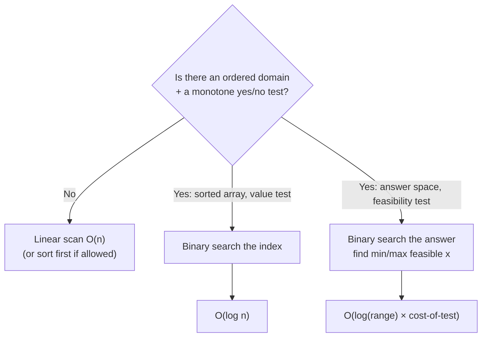
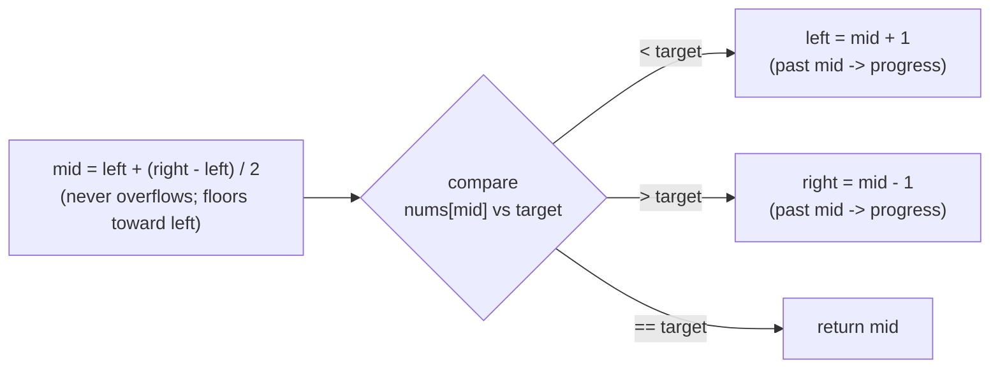
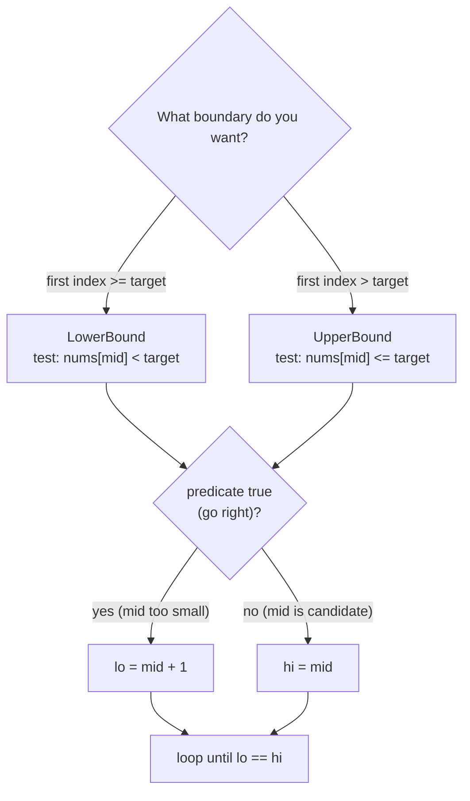
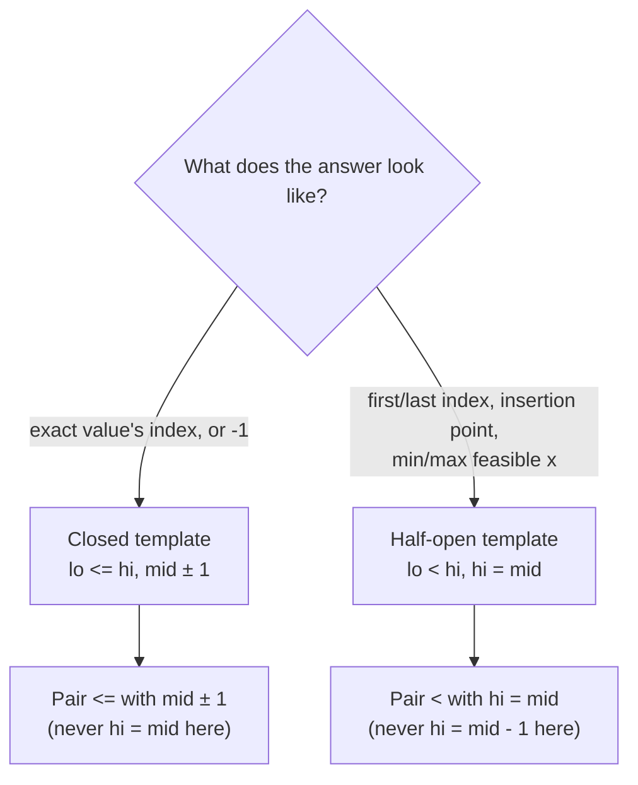
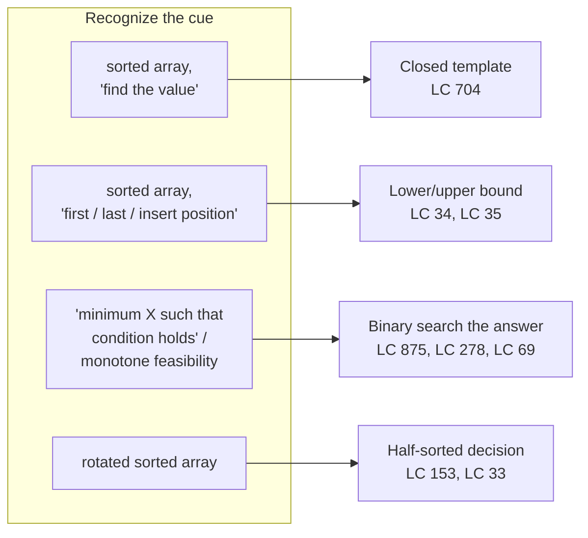

# Binary Search (Reviewer)

Binary search is the canonical "halve the search space" [algorithm](algorithms-glossary-reviewer.md#algorithm "A precise, finite sequence of steps that turns an input into a desired output."): in a domain where you can decide,
in [O(1)](algorithms-glossary-reviewer.md#constant-time "Cost does not depend on input size; the same fixed work every time.") or O(k), whether the answer lies left or right of a probe point, each comparison throws away
half the remaining candidates, so the whole search costs **[O(log n)](algorithms-glossary-reviewer.md#logarithmic-time "Each step discards a constant fraction, so steps equal the log of n.")**. The literal version searches a
**[sorted array](algorithms-glossary-reviewer.md#array "A fixed-size contiguous block of same-type elements accessed by position in O(1).")** for a value, but the pattern's real reach is much wider — anywhere a yes/no
predicate is **[monotonic](algorithms-glossary-reviewer.md#monotonic "Consistently moving one direction; never decreasing or never increasing.")** over an ordered domain (false, false, …, false, true, true, …, true) you
can binary-search for the boundary, even when there is no array in sight ("binary search the answer").

This is one of the highest-leverage interview patterns: easy to state, deceptively easy to get wrong.
The bugs live in the boundaries — `left <= right` vs `left < right`, `mid - 1` vs `mid`, and the
classic `(left + right) / 2` [integer overflow](algorithms-glossary-reviewer.md#integer-overflow "A value exceeds its integer type's max and silently wraps to a wrong value."). This reviewer pins down one closed-interval template
and one half-open (lower/upper-bound) template, proves they terminate, and applies them to value
search, first/last occurrence, the feasibility-predicate family (Koko), and rotated arrays. Master two
templates cold and you can derive every variant on the spot.

Related: [Algorithm Patterns Index](algorithm-patterns-index-reviewer.md) · [Two Pointers](two-pointers-reviewer.md) · [Recursion & Divide and Conquer](recursion-and-divide-and-conquer-reviewer.md) · [Sorting Algorithms](sorting-algorithms-reviewer.md) · [Complexity & Big-O](complexity-and-big-o-reviewer.md) · [Glossary](algorithms-glossary-reviewer.md)

## Contents
- [When binary search applies](#when-binary-search-applies)
- [The classic template and its invariant](#the-classic-template-and-its-invariant)
- [Overflow-safe mid and termination](#overflow-safe-mid-and-termination)
- [Lower bound vs upper bound](#lower-bound-vs-upper-bound)
- [First and last occurrence (LC 34)](#first-and-last-occurrence-lc-34)
- [Search insert position and first bad version](#search-insert-position-and-first-bad-version)
- [Binary search on the answer (Koko)](#binary-search-on-the-answer-koko)
- [Rotated sorted array](#rotated-sorted-array)
- [Integer sqrt and overflow](#integer-sqrt-and-overflow)
- [The three templates and which to memorize](#the-three-templates-and-which-to-memorize)
- [Array.BinarySearch in the BCL](#arraybinarysearch-in-the-bcl)
- [Problem cue to template map](#problem-cue-to-template-map)
- [Interview Q&A](#interview-qa)
- [Rapid-fire round](#rapid-fire-round)
- [Exam-style questions](#exam-style-questions)
- [30-second takeaway](#30-second-takeaway)
- [Quick recall checklist](#quick-recall-checklist)
- [References](#references)

---

## When binary search applies

Key points:

- The requirement is **monotonicity over an ordered domain**, not literally a sorted array. If you can
  define a boolean `isFeasible(x)` whose value, as `x` increases, switches from `false` to `true` (or
  `true` to `false`) **exactly once**, you can binary-search for that switch point.
- A sorted array is just the special case where the predicate is "`nums[i] >= target`" — monotone in
  `i`. The same machinery finds the smallest eating speed, the smallest ship capacity, the integer
  square root, the boundary of bad versions, and the minimum of a rotated array.
- **No monotone predicate, no binary search.** An unsorted array of distinct values has no usable
  ordering, so finding an arbitrary value there is [O(n)](algorithms-glossary-reviewer.md#linear-time "Work grows in direct proportion to input size, about one unit per element.") linear scan — binary search does not help.
- Cost is **O(log n)** comparisons. With a predicate that itself costs O(k) to evaluate, the total is
  **O(k log n)** (e.g. Koko's feasibility scan is O(n), giving O(n log maxPile)).



*Binary search needs a monotone predicate; the domain can be array indices or an abstract answer range.*

This pattern is foundational for the practice folders under `heap/k-largest-elements` (binary-search-
on-value is a [quickselect](algorithms-glossary-reviewer.md#quickselect "Finds the k-th smallest element in O(n) average by partitioning around a pivot.") alternative for "kth" questions) and complements `two-pointers/convergent`
problems on sorted data — both exploit order to beat [O(n^2)](algorithms-glossary-reviewer.md#quadratic-time "Work grows like the square of n, typically a nested loop over the same data.").

## The classic template and its invariant

Closed interval `[left, right]`: both ends are **candidate indices still in play**. The loop runs while
the interval is non-empty (`left <= right`) and returns on an exact hit.

Key points:

- **[Invariant](algorithms-glossary-reviewer.md#invariant "A condition that stays true at every step, used to prove correctness."):** if the target exists, it is within `[left, right]`. Every iteration shrinks the
  interval by excluding `mid`, so the invariant is preserved and the interval strictly shrinks.
- On `nums[mid] < target` the target must be to the right, so `left = mid + 1` (exclude `mid`). On
  `nums[mid] > target`, `right = mid - 1`. Both move **past** `mid` — that guarantees progress.
- Use `<=` in the loop condition because with a closed interval, `left == right` still describes a
  one-element interval that must be examined.

```csharp
// LC 704 — Binary Search. Returns the index of target, or -1.
public static int Search(int[] nums, int target)
{
    int left = 0, right = nums.Length - 1;
    while (left <= right)
    {
        int mid = left + (right - left) / 2;   // overflow-safe midpoint
        if (nums[mid] == target) return mid;
        if (nums[mid] < target) left = mid + 1; // target is in the right half
        else right = mid - 1;                   // target is in the left half
    }
    return -1;                                   // empty interval: not found
}
```

```text
nums = [1, 3, 5, 7, 9, 11]   target = 9
 index   0    1    2    3    4    5

 iter 1: L=0                      R=5      mid = 0 + (5-0)/2 = 2
         L         mid            R
         nums[2]=5 < 9  -> search right -> L = mid+1 = 3

 iter 2:                L=3       R=5      mid = 3 + (5-3)/2 = 4
                        L    mid  R
         nums[4]=9 == 9 -> match, return 4
```

*Closed-interval search for 9: two probes, each discarding half; the match returns index 4.*

## Overflow-safe mid and termination

Key points:

- **Never write `mid = (left + right) / 2`.** For large `int` indices `left + right` can exceed
  `int.MaxValue` and wrap negative — a real bug famously latent in `java.util.Arrays.binarySearch` for
  ~9 years. Use `mid = left + (right - left) / 2`, which never overflows because `right - left >= 0`.
- This computes the **lower-middle** (it floors). With the closed-interval template that is fine. In
  the half-open lower-bound template, flooring toward `left` is exactly what keeps the loop from
  spinning, as shown below.
- **Termination** rests on every branch strictly shrinking the live interval. In the closed template
  both updates jump past `mid` (`mid + 1` / `mid - 1`), so `right - left` decreases by at least one
  each turn and the loop ends in at most `floor(log2 n) + 1` iterations.
- The infamous infinite loop comes from pairing `left = mid` (not `mid + 1`) with a floored `mid`:
  when `right == left + 1`, `mid == left`, and `left = mid` makes no progress. Either move past `mid`
  or restructure as the half-open template that uses `hi = mid` deliberately with `lo < hi`.



*Both non-match branches step past `mid`, so the interval always shrinks and the loop terminates.*

## Lower bound vs upper bound

These two half-open searches are the most reusable primitives. They never test for equality; they
locate a **boundary** and always terminate at a single [index](algorithms-glossary-reviewer.md#index "The integer position of an element; 0-indexed starts at 0, 1-indexed at 1.") in `[0, n]`.

Key points:

- **[Lower bound](algorithms-glossary-reviewer.md#lower-bound-and-upper-bound "In a sorted array, the first index >= target and the first index > target.")** = first index `i` with `nums[i] >= target` (the leftmost position where `target`
  could be inserted to keep order). Predicate `nums[i] < target` is the "still too small, go right"
  test.
- **Upper bound** = first index `i` with `nums[i] > target` (one past the last occurrence). Differs
  from lower bound by a single `<` vs `<=` in the comparison.
- Both use the **half-open interval `[lo, hi)`**: `hi` starts at `nums.Length` (a valid "not found,
  insert at end" answer), the loop runs while `lo < hi`, and the converging branch is `hi = mid`
  (keep `mid` as a candidate) — **not** `hi = mid - 1`.
- Because `mid` floors toward `lo` and the shrinking branches are `lo = mid + 1` / `hi = mid`, the
  interval always narrows; the loop ends with `lo == hi` pointing at the boundary.

```csharp
// First index i with nums[i] >= target  (in [0, n]).
public static int LowerBound(int[] nums, int target)
{
    int lo = 0, hi = nums.Length;               // half-open: hi is exclusive
    while (lo < hi)
    {
        int mid = lo + (hi - lo) / 2;
        if (nums[mid] < target) lo = mid + 1;   // mid too small -> discard left half incl. mid
        else hi = mid;                          // mid is a candidate -> keep it, shrink right
    }
    return lo;                                   // lo == hi == boundary
}

// First index i with nums[i] > target  (in [0, n]).  Only the comparison changes.
public static int UpperBound(int[] nums, int target)
{
    int lo = 0, hi = nums.Length;
    while (lo < hi)
    {
        int mid = lo + (hi - lo) / 2;
        if (nums[mid] <= target) lo = mid + 1;  // <= here is the only difference
        else hi = mid;
    }
    return lo;
}
```



*Lower vs upper bound differ only by `<` vs `<=`; the converging branch is always `hi = mid`.*

## First and last occurrence (LC 34)

Key points:

- For a sorted array with duplicates, **first occurrence = `LowerBound(target)`** and **last
  occurrence = `UpperBound(target) - 1`**. Two boundary searches, each O(log n), give the full range.
- Guard the "not present" case: if `LowerBound` returns `n` **or** `nums[first] != target`, the value
  is absent — return `[-1, -1]`. You must check `nums[first]`, because lower bound returns an
  insertion point even when the target is missing.

```csharp
// LC 34 — Find First and Last Position of Element in Sorted Array.
public static int[] SearchRange(int[] nums, int target)
{
    int first = LowerBound(nums, target);
    if (first == nums.Length || nums[first] != target)
        return new[] { -1, -1 };                // target not present
    int last = UpperBound(nums, target) - 1;    // one before "first index > target"
    return new[] { first, last };
}
```

```text
nums = [5, 7, 7, 8, 8, 10]   target = 8
 index   0    1    2    3    4    5

 LowerBound(8): first i with nums[i] >= 8
   lo=0 hi=6 mid=3 nums[3]=8 >= 8 -> hi=3
   lo=0 hi=3 mid=1 nums[1]=7 <  8 -> lo=2
   lo=2 hi=3 mid=2 nums[2]=7 <  8 -> lo=3
   lo=3 hi=3 -> stop, first = 3

 UpperBound(8): first i with nums[i] > 8
   lo=0 hi=6 mid=3 nums[3]=8 <= 8 -> lo=4
   lo=4 hi=6 mid=5 nums[5]=10 > 8 -> hi=5
   lo=4 hi=5 mid=4 nums[4]=8 <= 8 -> lo=5
   lo=5 hi=5 -> stop, upper = 5  ->  last = 5 - 1 = 4

 result = [3, 4]    (the run of 8s occupies indices 3 and 4)
```

*Two boundary searches bracket the duplicate run: first=3 from lower bound, last=4 from upper bound minus one.*

## Search insert position and first bad version

Key points:

- **[LC 35](algorithms-glossary-reviewer.md#lc-number "The unique identifier LeetCode assigns each problem, like LC 704.") — Search Insert Position** is *exactly* lower bound: return the first index `>= target`,
  which is where the value goes if absent and where it already is if present. No special-casing
  needed.
- **LC 278 — First Bad Version** is binary search on a monotone predicate `isBadVersion(v)` over
  `[1, n]`. Once a version is bad, all later versions are bad — `false…false,true…true` — so lower
  bound on "is bad" finds the first bad one. The predicate is an API call, not an array read, which is
  the whole point: binary search doesn't care where the boolean comes from.
- Use a half-open / `lo < hi` shape with `hi = mid` on a bad version (it stays a candidate) and
  `lo = mid + 1` on a good one. Bound `hi = n`, `lo = 1` per the problem's 1-based versions.

```csharp
// LC 35 — Search Insert Position. Identical to LowerBound.
public static int SearchInsert(int[] nums, int target) => LowerBound(nums, target);

// LC 278 — First Bad Version. isBad encapsulates the given isBadVersion(int) API.
public static int FirstBadVersion(int n, Func<int, bool> isBad)
{
    int lo = 1, hi = n;
    while (lo < hi)
    {
        int mid = lo + (hi - lo) / 2;   // overflow-safe even when n == int.MaxValue
        if (isBad(mid)) hi = mid;       // mid might be the first bad one -> keep it
        else lo = mid + 1;              // mid is good -> first bad is strictly right
    }
    return lo;                          // first version where isBad flips to true
}
```

For LC 35, `[1,3,5,6]` with target `5` returns `2` (present, at its index), target `2` returns `1`,
and target `7` returns `4` (insert at the end) — all just lower-bound results.

## Binary search on the answer (Koko)

This is the pattern that separates people who "memorized binary search" from people who **understand**
it. There is no sorted input array to search; instead you binary-search the **space of possible
answers** using a feasibility predicate.

Key points:

- **LC 875 — Koko Eating Bananas:** find the minimum integer eating speed `k` such that Koko finishes
  all piles within `h` hours. Hours needed at speed `k` is `sum(ceil(pile / k))`, which **decreases
  monotonically** as `k` grows — so `isFeasible(k) = hoursNeeded(k) <= h` is a monotone
  `false…false,true…true` predicate. Lower bound over `k` finds the minimum feasible speed.
- The answer range is `[1, max(piles)]`: speed `1` is the slowest meaningful rate, and a speed equal
  to the largest pile already eats every pile in one hour each (more speed cannot help). So
  `lo = 1`, `hi = max(piles)`.
- Compute `ceil(pile / k)` with integer math as `(pile + k - 1) / k` to avoid floating point. Sum into
  a `long` to be safe against many large piles.
- Complexity: **[O(n log(max(piles)))](algorithms-glossary-reviewer.md#linearithmic-time "A linear pass repeated a logarithmic number of times; good-sort speed.")** time — `log` over the speed range, each feasibility test an
  O(n) scan — and **O(1)** [extra space](algorithms-glossary-reviewer.md#auxiliary-space "Extra memory beyond the input, including temporaries and the call stack.").

```csharp
// LC 875 — Koko Eating Bananas. Minimum integer speed to finish within h hours.
public static int MinEatingSpeed(int[] piles, int h)
{
    int lo = 1, hi = 0;
    foreach (int p in piles) hi = Math.Max(hi, p);  // hi = max(piles)
    while (lo < hi)
    {
        int mid = lo + (hi - lo) / 2;
        if (CanFinish(piles, mid, h)) hi = mid;     // feasible -> try a slower speed
        else lo = mid + 1;                          // too slow -> must go faster
    }
    return lo;                                       // minimum feasible speed
}

private static bool CanFinish(int[] piles, int speed, int h)
{
    long hours = 0;
    foreach (int p in piles)
        hours += (p + speed - 1) / speed;            // ceil(p / speed), integer math
    return hours <= h;
}
```

```text
piles = [3, 6, 7, 11]   h = 8   answer space k in [1, 11]
hours(k) = ceil(3/k)+ceil(6/k)+ceil(7/k)+ceil(11/k)

 lo=1  hi=11  mid=6   hours(6)=1+1+2+2 = 6  <= 8  feasible -> hi=6  (try slower)
 lo=1  hi=6   mid=3   hours(3)=1+2+3+4 = 10 >  8  too slow -> lo=4  (must speed up)
 lo=4  hi=6   mid=5   hours(5)=1+2+2+3 = 8  <= 8  feasible -> hi=5
 lo=4  hi=5   mid=4   hours(4)=1+2+2+3 = 8  <= 8  feasible -> hi=4
 lo=4  hi=4   -> stop

 minimum feasible speed = 4
```

*The feasibility test collapses the speed range [1,11] to 4 in four probes — no array is sorted; the predicate is.*

The same shape solves capacity/threshold problems: ship-within-D-days, split-array-largest-sum,
minimize-max-distance — anything where "can we do it with budget `x`?" is monotone in `x`. Identify
the answer range and the monotone predicate, and the loop is identical.

## Rotated sorted array

A sorted array rotated at an unknown [pivot](algorithms-glossary-reviewer.md#pivot "The element partitioning compares against and arranges the array around.") is no longer globally sorted, but **at least one half of any
`[lo, hi]` window is still sorted**. That residual order is enough to binary-search.

Key points:

- **LC 153 — Find Minimum in Rotated Sorted Array** (distinct values): compare `nums[mid]` to
  `nums[hi]`. If `nums[mid] > nums[hi]`, the rotation point (the minimum) is strictly to the right, so
  `lo = mid + 1`; otherwise the minimum is at `mid` or to its left, so `hi = mid`. Converges on the
  minimum in O(log n). Comparing to `nums[hi]` (not `nums[lo]`) is what makes the two cases clean.
- **LC 33 — Search in Rotated Sorted Array:** at each step decide which half is sorted by testing
  `nums[lo] <= nums[mid]`. If the **left** half is sorted and `target` falls inside `[nums[lo],
  nums[mid])`, search left; else search right. If the **right** half is sorted, mirror the logic with
  `(nums[mid], nums[hi]]`. Closed-interval `lo <= hi` here because we test equality for a hit.
- Both are **O(log n)** time, **O(1)** space (iterative). With duplicates allowed (a separate, harder
  variant) the half-sorted test can be ambiguous and [worst case](algorithms-glossary-reviewer.md#best-average-and-worst-case "How an algorithm's cost varies across the luckiest, typical, and hardest inputs.") degrades to O(n); the problems above
  guarantee distinct values, so O(log n) holds.

```csharp
// LC 153 — Find Minimum in Rotated Sorted Array (distinct values).
public static int FindMin(int[] nums)
{
    int lo = 0, hi = nums.Length - 1;
    while (lo < hi)
    {
        int mid = lo + (hi - lo) / 2;
        if (nums[mid] > nums[hi]) lo = mid + 1; // min is to the right of mid
        else hi = mid;                          // min is mid or to its left
    }
    return nums[lo];                            // lo == hi == index of minimum
}

// LC 33 — Search in Rotated Sorted Array. Returns index of target or -1.
public static int SearchRotated(int[] nums, int target)
{
    int lo = 0, hi = nums.Length - 1;
    while (lo <= hi)
    {
        int mid = lo + (hi - lo) / 2;
        if (nums[mid] == target) return mid;
        if (nums[lo] <= nums[mid])                       // left half [lo, mid] is sorted
        {
            if (nums[lo] <= target && target < nums[mid]) hi = mid - 1; // target in left
            else lo = mid + 1;
        }
        else                                             // right half [mid, hi] is sorted
        {
            if (nums[mid] < target && target <= nums[hi]) lo = mid + 1; // target in right
            else hi = mid - 1;
        }
    }
    return -1;
}
```

```text
nums = [4, 5, 6, 7, 0, 1, 2]   target = 0
 index   0    1    2    3    4    5    6
(rotated: the sorted run wraps at the pivot between index 3 and 4)

 lo=0 hi=6 mid=3  nums[3]=7
   nums[lo]=4 <= nums[mid]=7  -> LEFT half [4,5,6,7] is sorted
   is 0 in [4, 7)?  no  -> search right -> lo = mid+1 = 4

 lo=4 hi=6 mid=5  nums[5]=1
   nums[lo]=0 <= nums[mid]=1  -> LEFT half [0,1] is sorted
   is 0 in [0, 1)?  yes -> search left -> hi = mid-1 = 4

 lo=4 hi=4 mid=4  nums[4]=0 == 0  -> return 4
```

*Each probe identifies the sorted half via `nums[lo] <= nums[mid]`, then keeps or discards it by range membership.*

## Integer sqrt and overflow

Key points:

- **LC 69 — Sqrt(x):** return `floor(sqrt(x))` for `x >= 0`. The predicate `mid * mid <= x` is monotone
  in `mid`, so binary-search the answer over `[1, x/2]` (for `x >= 2`) and keep the largest `mid` that
  satisfies it. Handle `x < 2` directly (`sqrt(0)=0`, `sqrt(1)=1`).
- The **overflow trap**: `mid * mid` can exceed `int.MaxValue` even when `mid` itself is a valid index.
  For `x = int.MaxValue` the answer is `46340`, and `46340 * 46340 = 2_147_395_600`, which **overflows
  `int`**. Cast one operand to `long` — `(long)mid * mid <= x` — or the comparison silently breaks.
  This is the single most common bug in this problem.

```csharp
// LC 69 — Sqrt(x). Returns floor(sqrt(x)) using a monotone predicate.
public static int MySqrt(int x)
{
    if (x < 2) return x;                       // 0 -> 0, 1 -> 1
    int lo = 1, hi = x / 2, ans = 1;           // sqrt(x) <= x/2 for x >= 2
    while (lo <= hi)
    {
        int mid = lo + (hi - lo) / 2;
        if ((long)mid * mid <= x)              // cast prevents int overflow
        {
            ans = mid;                         // mid feasible -> remember, try larger
            lo = mid + 1;
        }
        else hi = mid - 1;                     // too big -> shrink
    }
    return ans;
}
```

`MySqrt(8)` returns `2` (since `2*2=4 <= 8 < 9 = 3*3`), `MySqrt(16)` returns `4`, and
`MySqrt(int.MaxValue)` returns `46340` — only because the `long` cast keeps `46340 * 46340` from
wrapping.

## The three templates and which to memorize

There are three boundary shapes floating around. You only need to **memorize two** and derive the rest.

| Template | Interval | Loop | Converge branch | Returns | Use for |
| --- | --- | --- | --- | --- | --- |
| Closed (exact match) | `[left, right]` | `while (left <= right)` | `right = mid - 1` / `left = mid + 1` | index or `-1` | LC 704, LC 33 (equality hit) |
| Half-open (lower/upper bound) | `[lo, hi)` | `while (lo < hi)` | `hi = mid` | boundary index in `[0, n]` | LC 34, LC 35, LC 153, predicate search |
| "Find feasible" answer search | `[lo, hi]` over answers | `while (lo < hi)` | `hi = mid` | min/max feasible value | LC 875, LC 278 |

Key points:

- **Memorize the closed template** (equality search, `<=`, `mid +/- 1`) and the **half-open template**
  (`lo < hi`, `hi = mid`, `lo = mid + 1`). The "answer search" is just the half-open template with a
  predicate instead of an array compare — same skeleton.
- **Mixing the two shapes is the bug factory:** `lo <= hi` paired with `hi = mid` loops forever (when
  `lo == hi`, `mid == lo`, nothing moves); `lo < hi` paired with `hi = mid - 1` skips the boundary.
  Keep each template internally consistent: `<=` ↔ `mid - 1`, and `<` ↔ `hi = mid`.
- When in doubt, **decide what the loop should leave you with**: an exact index (closed) or the first
  index satisfying a predicate (half-open). That choice dictates every other detail.



*Pick the template by the shape of the answer, then keep its comparison and update consistent.*

## Array.BinarySearch in the BCL

Key points:

- **`Array.BinarySearch`** and **`List<T>.BinarySearch`** implement this for you on a **sorted**
  collection. On a hit they return the **index**; on a miss they return the **bitwise complement of the
  insertion point**, `~insertionIndex` (a negative number), so `~result` is exactly where the element
  would go — the lower-bound answer for free.
- The collection **must already be sorted** by the same comparer; on unsorted input the result is
  undefined. With duplicates, the returned index is **any** matching element, not necessarily the
  first — so for LC 34's first/last, roll your own lower/upper bound rather than relying on it.
- `List<T>.BinarySearch` accepts an `IComparer<T>`; this is the idiomatic way to binary-search by a
  custom key in .NET without writing the loop.

```csharp
int[] a = { 1, 3, 5, 7, 9, 11 };
int hit = Array.BinarySearch(a, 7);     // 3  (found at index 3)
int miss = Array.BinarySearch(a, 8);    // -5  ( = ~4: would insert at index 4)
int insertAt = ~miss;                    // 4
```

## Problem cue to template map



*From the problem's wording to the template: value vs boundary vs feasibility vs rotation.*

## Interview Q&A

### Fundamentals

Q: What is the precondition for binary search?
A: A **monotone predicate over an ordered domain** — classically a sorted array, but more generally any `isFeasible(x)` that flips from false to true (or true to false) exactly once as `x` increases. Without that monotonicity each comparison can't reliably discard half the space, and you're back to O(n).

Q: Why `mid = left + (right - left) / 2` instead of `(left + right) / 2`?
A: To avoid integer overflow. `left + right` can exceed `int.MaxValue` for large indices and wrap to a negative value, producing an out-of-range or negative `mid`. `right - left` is always non-negative, so the safe form never overflows. It was a real bug in widely used library code for years.

Q: When do you use `left <= right` vs `left < right`?
A: `left <= right` with a **closed** interval `[left, right]` and `mid +/- 1` updates — used when you search for an exact match. `left < right` with a **half-open** interval `[lo, hi)` and `hi = mid` — used when you search for a boundary (lower/upper bound, first feasible). Mixing them causes either an infinite loop or a skipped boundary.

Q: What's the complexity of binary search, in time and space?
A: **O(log n)** comparisons. Space is **O(1)** iteratively, or **O(log n)** recursively due to the [call stack](algorithms-glossary-reviewer.md#call-stack "Memory tracking active function calls; each call pushes a frame, popped on return."). If the comparison/feasibility test costs O(k), total time is **O(k log n)**.

### Bounds and duplicates

Q: Define lower bound and upper bound.
A: **Lower bound** is the first index with `nums[i] >= target`; **upper bound** is the first index with `nums[i] > target`. They differ only by `<` vs `<=` in the probe comparison. With duplicates, `[lowerBound, upperBound)` is exactly the run of equal elements.

Q: How do you find the first and last occurrence of a value? (LC 34)
A: First = lower bound of target; last = upper bound of target minus one. Each is O(log n). Guard absence by checking that `lowerBound != n` and `nums[lowerBound] == target`; otherwise return `[-1, -1]`.

Q: Why does the lower-bound loop use `hi = mid` and not `hi = mid - 1`?
A: Because `mid` itself may be the boundary (it could be the first element `>= target`). Discarding it with `mid - 1` would skip the answer. The half-open interval treats `hi` as exclusive, so `hi = mid` keeps `mid` as a live candidate while still shrinking the window.

### Binary search the answer

Q: What does "binary search on the answer" mean?
A: Instead of searching positions in an array, you search the **range of possible answers** using a monotone feasibility predicate. Example: the minimum eating speed in Koko — `hoursNeeded(speed) <= h` is monotone in `speed`, so lower bound over `[1, max(piles)]` finds the smallest feasible speed.

Q: For Koko (LC 875), what are the search bounds and the complexity?
A: Bounds are `[1, max(piles)]`: speed 1 is the slowest sensible rate, and a speed equal to the largest pile finishes every pile in one hour each. Complexity is **O(n log(max(piles)))** time (log over speeds, O(n) feasibility scan each) and **O(1)** space.

Q: How do you compute `ceil(a / b)` with integer arithmetic?
A: `(a + b - 1) / b` for positive integers — avoids floating point and its rounding error. In Koko, `(pile + speed - 1) / speed` is the hours for one pile.

### Rotated arrays

Q: In a rotated sorted array, how do you decide which half to search? (LC 33)
A: Compute `mid`; the half `[lo, mid]` is sorted iff `nums[lo] <= nums[mid]`. If it's sorted and the target lies in `[nums[lo], nums[mid])`, go left; otherwise go right. If instead the right half is sorted, mirror with `(nums[mid], nums[hi]]`. Each step still halves the window, so it's O(log n).

Q: For finding the minimum of a rotated array (LC 153), why compare `nums[mid]` to `nums[hi]` and not `nums[lo]`?
A: Comparing to `nums[hi]` cleanly distinguishes the two cases: `nums[mid] > nums[hi]` means the rotation pivot (the minimum) is strictly right of `mid`, so `lo = mid + 1`; otherwise the minimum is at `mid` or left of it, so `hi = mid`. Comparing to `nums[lo]` is ambiguous when the window is already sorted.

## Rapid-fire round

- Precondition for binary search → **monotone predicate over an ordered domain (not just a sorted array).**
- Time / space complexity → **O(log n) time; O(1) iterative, O(log n) recursive space.**
- Overflow-safe midpoint → **`mid = left + (right - left) / 2`.**
- Closed-interval loop condition + updates → **`left <= right`, `mid + 1` / `mid - 1`.**
- Half-open loop condition + converge branch → **`lo < hi`, `hi = mid`.**
- Lower bound is → **first index with `nums[i] >= target`.**
- Upper bound is → **first index with `nums[i] > target`.**
- First/last occurrence (LC 34) → **`lowerBound` and `upperBound - 1`.**
- Search insert position (LC 35) → **just `lowerBound`.**
- First Bad Version (LC 278) → **lower bound over a boolean API predicate.**
- Koko bounds (LC 875) → **`[1, max(piles)]`, feasibility `hoursNeeded(k) <= h`.**
- `ceil(a / b)` in ints → **`(a + b - 1) / b`.**
- Rotated min (LC 153) test → **`nums[mid] > nums[hi]` ? `lo = mid + 1` : `hi = mid`.**
- Rotated search (LC 33) sorted-half test → **`nums[lo] <= nums[mid]`.**
- Sqrt(x) overflow fix (LC 69) → **`(long)mid * mid <= x`.**
- `Array.BinarySearch` miss returns → **`~insertionIndex` (bitwise complement, negative).**
- Infinite-loop cause → **`left = mid` with a floored mid (no progress when window is size 2).**
- Two templates to memorize → **closed (exact match) and half-open (boundary).**

## Exam-style questions

1. What does this print, and is the midpoint computation safe?

```csharp
int[] nums = { 2, 4, 4, 4, 8 };
Console.WriteLine(BS.LowerBound(nums, 4));
Console.WriteLine(BS.UpperBound(nums, 4));
```

**Answer:** `1` then `4`. Lower bound is the first index with `nums[i] >= 4`, which is index `1`.
Upper bound is the first index with `nums[i] > 4`, which is index `4` (value `8`). The run of 4s is
`[1, 4)` = indices 1, 2, 3, so last occurrence = `upperBound - 1 = 3`. The midpoint `lo + (hi - lo)/2`
is overflow-safe.

2. This Koko-style call — what minimum speed does it return, and what's the time complexity?

```csharp
int[] piles = { 30, 11, 23, 4, 20 };
Console.WriteLine(BS.MinEatingSpeed(piles, 6));
```

**Answer:** `23`. At speed 23, hours are `ceil(30/23)+ceil(11/23)+ceil(23/23)+ceil(4/23)+ceil(20/23)
= 2+1+1+1+1 = 6 <= 6` (feasible), while speed 22 needs `2+1+2+1+1 = 7 > 6` (infeasible), so 23 is the
minimum. Complexity is **O(n log(max(piles)))** = O(n log 30) time, O(1) space.

3. Find the bug.

```csharp
int LowerBoundBuggy(int[] nums, int target)
{
    int lo = 0, hi = nums.Length;
    while (lo <= hi)                       // <-- note: <=
    {
        int mid = lo + (hi - lo) / 2;
        if (nums[mid] < target) lo = mid + 1;
        else hi = mid;
    }
    return lo;
}
```

**Answer:** Two bugs from mixing templates. (1) The loop uses `lo <= hi` with the half-open
converge branch `hi = mid`; when `lo == hi`, `mid == lo` and the `else` branch sets `hi = mid = lo`,
so nothing changes — **infinite loop**. (2) With `hi = nums.Length` (an exclusive bound), the first
iteration when `lo == hi == n` indexes `nums[n]` — **out of range**. Fix: use `while (lo < hi)`, which
is the correct half-open shape.

4. What does each line print?

```csharp
int[] a = { 1, 3, 5, 7, 9, 11 };
Console.WriteLine(BS.Search(a, 11));            // (a)
Console.WriteLine(BS.Search(a, 4));             // (b)
Console.WriteLine(Array.BinarySearch(a, 4));    // (c)
```

**Answer:** (a) `5` — found at the last index. (b) `-1` — `4` is absent, custom search returns the
not-found sentinel. (c) `-3` — `Array.BinarySearch` returns `~insertionIndex`; `4` would insert at
index `2`, and `~2 == -3`. The two "not found" conventions differ: roll-your-own returns `-1`, the BCL
returns the complement of the insertion point.

5. Trace finds the minimum of this rotated array; what is returned and how many iterations?

```csharp
int[] nums = { 4, 5, 6, 7, 0, 1, 2 };
Console.WriteLine(BS.FindMin(nums));
```

**Answer:** `0`, in three iterations. `lo=0,hi=6,mid=3`: `nums[3]=7 > nums[6]=2` so `lo=4`.
`lo=4,hi=6,mid=5`: `nums[5]=1 <= nums[6]=2` so `hi=5`. `lo=4,hi=5,mid=4`: `nums[4]=0 <= nums[5]=1` so
`hi=4`. Now `lo == hi == 4`, return `nums[4] = 0`. O(log n) overall.

## 30-second takeaway

> Binary search needs a **monotone predicate over an ordered domain** — a sorted array is just the
> special case. Memorize two templates: the **closed** one (`left <= right`, `mid +/- 1`) for an exact
> value, and the **half-open** one (`lo < hi`, `hi = mid`) for a boundary — lower bound (first `>=
> target`), upper bound (first `> target`), or the **minimum feasible answer** (Koko, sqrt, first bad
> version). Always use the overflow-safe `mid = left + (right - left) / 2`, keep `<=`↔`mid - 1` and
> `<`↔`hi = mid` consistent so the loop terminates, and watch the two classic traps: `int` overflow in
> `mid * mid`, and an infinite loop from `left = mid` with a floored midpoint. It's O(log n) time, O(1)
> space.

## Quick recall checklist

- **Precondition:** monotone yes/no test over an ordered domain; sorted array is one instance, "binary
  search the answer" is the general form.
- **Midpoint:** `mid = left + (right - left) / 2` — never `(left + right) / 2` (overflow).
- **Closed template:** `[left, right]`, `while (left <= right)`, `left = mid + 1` / `right = mid - 1`,
  returns exact index or `-1`. (LC 704, LC 33.)
- **Half-open template:** `[lo, hi)`, `while (lo < hi)`, `lo = mid + 1` / `hi = mid`, returns a
  boundary in `[0, n]`. (LC 34, LC 35, LC 153, LC 278.)
- **Lower bound** = first `>= target`; **upper bound** = first `> target`; differ by `<` vs `<=`.
  First/last occurrence = `lowerBound` and `upperBound - 1`.
- **Answer search:** identify the answer range and a monotone `isFeasible(x)`; lower-bound the first
  feasible `x`. Koko bounds `[1, max(piles)]`, `O(n log(max(piles)))`. (LC 875, LC 69.)
- **Rotated:** find min (LC 153) via `nums[mid] > nums[hi]`; search (LC 33) via the sorted-half test
  `nums[lo] <= nums[mid]`. O(log n) with distinct values.
- **Sqrt(x) (LC 69):** binary-search `mid * mid <= x`, cast to `long` to avoid overflow.
- **BCL:** `Array.BinarySearch` returns the index, or `~insertionIndex` on a miss; collection must be
  sorted; duplicate-position not guaranteed to be the first.
- **Termination:** every non-match branch must shrink the interval; keep comparison and update
  consistent (`<=`↔`mid - 1`, `<`↔`hi = mid`).

## References

- Wikipedia — [Binary search algorithm](https://en.wikipedia.org/wiki/Binary_search_algorithm).
- cp-algorithms — [Binary search](https://cp-algorithms.com/num_methods/binary_search.html).
- Microsoft Learn — [`Array.BinarySearch` Method](https://learn.microsoft.com/en-us/dotnet/api/system.array.binarysearch).
- Microsoft Learn — [`List<T>.BinarySearch` Method](https://learn.microsoft.com/en-us/dotnet/api/system.collections.generic.list-1.binarysearch).
- NeetCode — [Roadmap](https://neetcode.io/roadmap) (Binary Search section).
- LeetCode — [Study Plans](https://leetcode.com/studyplan/).
