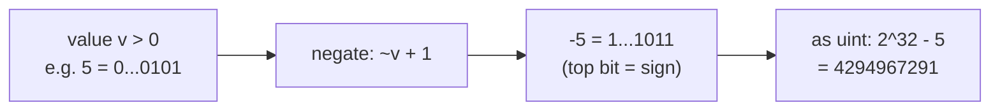
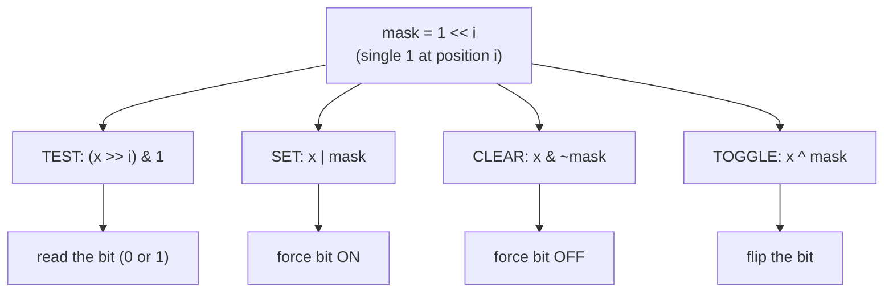
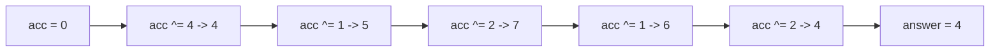
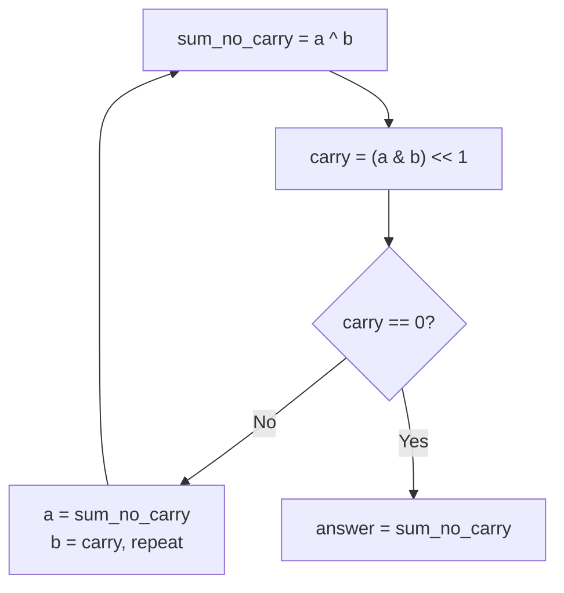
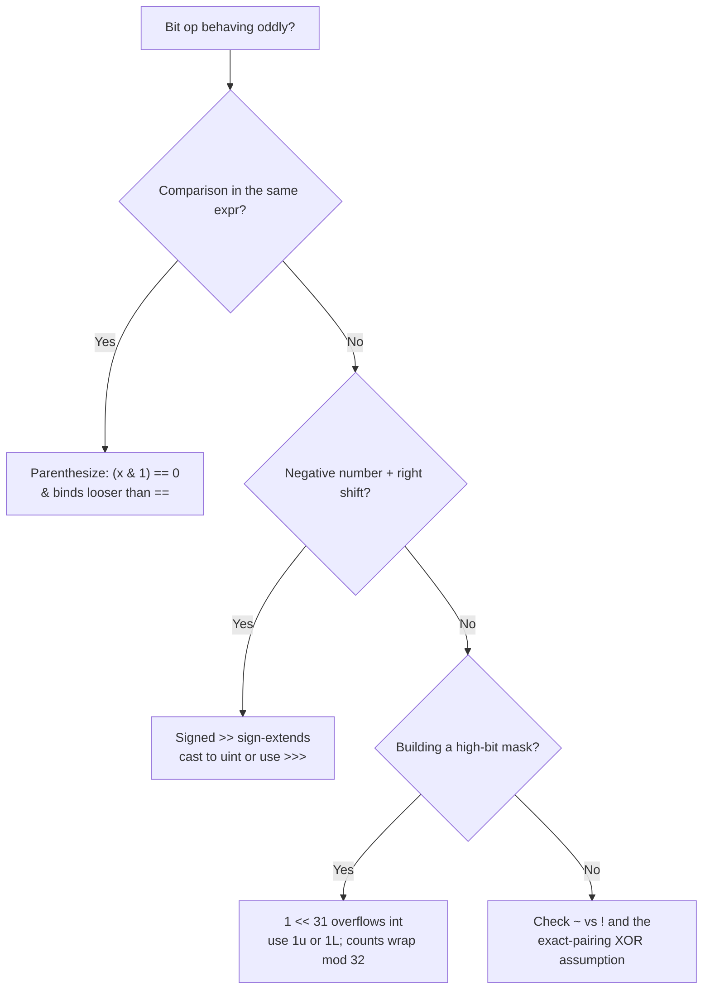

# Bit Manipulation (Reviewer)

**Bit manipulation** is the art of treating an integer as a fixed-width row of bits and operating on
those bits directly with `&`, `|`, `^`, `~`, `<<`, and `>>`. Instead of arithmetic on the *value*,
you reason about the *binary representation*: each of the 32 bits of an `int` (or 64 of a `long`) is a
boolean you can test, set, clear, or toggle in `O(1)`. A small toolbox of idioms — isolate the lowest
set bit, clear the lowest set bit, count set bits, build/iterate a [bitmask](algorithms-glossary-reviewer.md#bitmask "Using an integer's bits to represent a set of flags or a subset of items.") — covers almost every
interview question in this category.

For interviews and exams this topic is high-yield precisely because the tricks are *closed-form*: a
whole family of "find the unique number" problems collapses to a single `O(n)`-time, **`O(1)`-space**
[XOR](algorithms-glossary-reviewer.md#xor "Bitwise operator giving 1 only when exactly one input bit is 1; x ^ x = 0.") fold, and counting/reversing bits becomes a tight loop with no auxiliary structures. The hard
part is not the loops but the fundamentals — [two's-complement](algorithms-glossary-reviewer.md#twos-complement "The standard encoding of signed integers where the top bit signals the sign."), signed vs unsigned shifts, and operator
precedence — so this reviewer drills those first, then the idioms, then the canonical problems. Bit
masks also reappear as a *set representation* inside [DP](algorithms-glossary-reviewer.md#dynamic-programming "Solving problems with overlapping subproblems by computing each once and reusing it.") and [backtracking](algorithms-glossary-reviewer.md#backtracking "Explore all candidates by building one choice at a time and undoing dead ends."), so the skill pays off far
beyond the dedicated problems.

Related: [Algorithm Patterns Index](algorithm-patterns-index-reviewer.md) · [Math & Number Theory](math-and-number-theory-reviewer.md) · [Arrays & Hashing](arrays-and-hashing-reviewer.md) · [Dynamic Programming](dynamic-programming-reviewer.md) · [Glossary](algorithms-glossary-reviewer.md)

## Contents
- [The operators and their truth tables](#the-operators-and-their-truth-tables)
- [Shifts and the signed vs unsigned question in C#](#shifts-and-the-signed-vs-unsigned-question-in-c)
- [Reading binary and two's-complement](#reading-binary-and-twos-complement)
- [Core idioms: test, set, clear, toggle](#core-idioms-test-set-clear-toggle)
- [Lowest set bit and clearing it (Brian Kernighan)](#lowest-set-bit-and-clearing-it-brian-kernighan)
- [XOR properties and the single-number family](#xor-properties-and-the-single-number-family)
- [Missing Number](#missing-number)
- [Number of 1 Bits](#number-of-1-bits)
- [Counting Bits with DP](#counting-bits-with-dp)
- [Reverse Bits](#reverse-bits)
- [Sum of Two Integers without plus](#sum-of-two-integers-without-plus)
- [Bitmasks as sets](#bitmasks-as-sets)
- [Pitfalls and misconceptions](#pitfalls-and-misconceptions)
- [Complexity cheat-sheet](#complexity-cheat-sheet)
- [Interview Q&A](#interview-qa)
- [Rapid-fire round](#rapid-fire-round)
- [Exam-style questions](#exam-style-questions)
- [30-second takeaway](#30-second-takeaway)
- [Quick recall checklist](#quick-recall-checklist)
- [References](#references)

---

## The operators and their truth tables

Six operators do all the work. Five are bitwise (apply per bit position independently); the last two
are shifts (move the whole pattern left or right).

Key points:

- **AND `&`** — 1 only when *both* bits are 1. Used to **test/[mask](algorithms-glossary-reviewer.md#mask "A bit pattern combined with a value to isolate, set, clear, or toggle bits.")** bits (keep only the bits you ask
  for) and to clear bits.
- **OR `|`** — 1 when *either* bit is 1. Used to **set** bits (force them on).
- **XOR `^`** — 1 when the bits *differ*. Used to **toggle** bits and to cancel pairs (the heart of the
  single-number trick).
- **NOT `~`** — flips every bit (one's complement). On a signed `int`, `~x == -x - 1`.
- **Shift left `<<`** — `x << k` multiplies by `2^k` (within range), filling new low bits with 0.
- **Shift right `>>`** — `x >> k` divides by `2^k` (floored). For signed types it is *arithmetic*
  (sign-extends); for unsigned it is *logical* (fills with 0). See the next section.

```text
   a   b | a&b  a|b  a^b        a | ~a   (32-bit int)
   ------+--------------        --+----------------------
   0   0 |  0    0    0         0 |  ...11111111  (= -1)
   0   1 |  0    1    1         1 |  ...11111110  (= -2)
   1   0 |  0    1    1
   1   1 |  1    1    0         ~x = -x - 1  for signed int
```

*Truth tables for the per-bit operators; `~` flips all 32 bits, so `~0` is `-1` and `~x == -x - 1`.*

```csharp
int a = 0b1100; // 12
int b = 0b1010; // 10
int and = a & b;  // 0b1000 = 8   (bits set in both)
int or  = a | b;  // 0b1110 = 14  (bits set in either)
int xor = a ^ b;  // 0b0110 = 6   (bits that differ)
int not = ~a;     // -13          (~12 == -12 - 1)
```

## Shifts and the signed vs unsigned question in C#

The single most common bit-manipulation bug is mishandling the **right shift** on a negative number.
C# picks the shift semantics from the operand's type, not from a separate operator.

Key points:

- On `int`/`long` (signed), `>>` is an **arithmetic** shift: it copies the sign bit into the new
  high bits, so `(-8) >> 1 == -4` (it preserves the negative sign, i.e. floored division by 2).
- On `uint`/`ulong` (unsigned), `>>` is a **logical** shift: it fills with 0, so
  `unchecked((uint)-8) >> 1 == 2147483644` (the `unchecked` is required because casting the negative
  *constant* `(uint)-8` is otherwise a `CS0221` compile error — see two's-complement below).
- C# also has an explicit **unsigned right shift `>>>`** (since C# 11): `(-8) >>> 1` does the logical
  shift on a signed type without casting, giving `2147483644`.
- Left shift `<<` is the same for both: zeros fill in from the right. Beware [overflow](algorithms-glossary-reviewer.md#integer-overflow "A value exceeds its integer type's max and silently wraps to a wrong value.") — `1 << 31` on
  `int` is `int.MinValue`; if you need all 32 bits as a positive magnitude, work in `uint`.
- The shift count is taken **mod 32** for `int`/`uint` and **mod 64** for `long`/`ulong`. So
  `1 << 32 == 1`, not `0` — a classic surprise.
- **Rule of thumb:** for bit-twiddling over all 32 bits (reverse, count, masks), cast to `uint` so the
  high bit is just data, not a sign. Several of the problems below do exactly this.

```text
 int  -8  >> 1  : 1111...11111000  >> 1  = 1111...11111100  = -4   (sign-extended)
 uint  ... >> 1 : (uint)-8 = 4294967288, >>1 = 2147483644          (zero-filled)
 1 << 31 (int)  : 1000...00000000 = -2147483648 (int.MinValue)
 1 << 32 (int)  : count is 32 % 32 = 0, so == 1   (NOT 0!)
```

*Right shift depends on the operand type: signed sign-extends (arithmetic), unsigned zero-fills (logical); shift counts wrap mod 32.*

## Reading binary and two's-complement

A 32-bit `int` stores negative numbers in **two's-complement**: the top bit (bit 31) is the sign, and
a negative value `-v` is stored as `2^32 - v`. That is why negative numbers look like huge bit
patterns when you print them as unsigned.

Key points:

- To negate in two's complement: **flip all bits and add 1**, i.e. `-x == ~x + 1`. Equivalently
  `~x == -x - 1`.
- `-1` is all ones (`0xFFFFFFFF`); `int.MinValue` is `0x80000000` (only the sign bit set).
- Casting `int -> uint` does **not** change the bits, only their interpretation: `(uint)(-1)` is
  `4294967295`. Note that the *constant* `(uint)(-1)` is a compile error (`CS0221`) — you must cast a
  *variable* or use `unchecked((uint)-1)` / the literal `0xFFFFFFFFu`.
- The number of set bits in `-1` is 32 (all ones); this is a good sanity check for a popcount routine
  on negatives.



*Two's-complement: negation is "flip all bits, add 1"; the same bits read as `uint` give the large value `2^32 - v`.*

## Core idioms: test, set, clear, toggle

These four one-liners are the alphabet of bit manipulation. In each, `i` is a zero-based bit [index](algorithms-glossary-reviewer.md#index "The integer position of an element; 0-indexed starts at 0, 1-indexed at 1.") and
`1 << i` is a **mask** with a single 1 at position `i`.

Key points:

- **Test bit `i`**: `(x >> i) & 1` (or `(x & (1 << i)) != 0`). Result is the bit's value, 0 or 1.
- **Set bit `i`**: `x | (1 << i)` — OR forces that bit on, leaves the rest.
- **Clear bit `i`**: `x & ~(1 << i)` — the inverted mask is all ones except position `i`, so AND zeroes
  just that bit.
- **Toggle bit `i`**: `x ^ (1 << i)` — XOR with a 1 flips the bit; XOR with 0 elsewhere keeps it.
- **Update to a value `b` (0/1)**: `x = (x & ~(1 << i)) | (b << i)` — clear then conditionally set.
- For bit indices `>= 31`, use `1L << i` (long) or `1u << i` to avoid signed-`int` overflow.

```csharp
static int  TestBit  (int x, int i) => (x >> i) & 1;       // 0 or 1
static int  SetBit   (int x, int i) => x | (1 << i);
static int  ClearBit (int x, int i) => x & ~(1 << i);
static int  ToggleBit(int x, int i) => x ^ (1 << i);
static int  UpdateBit(int x, int i, int b) => (x & ~(1 << i)) | (b << i);
```



*Each idiom builds the single-bit mask `1 << i`, then chooses the operator: AND to test/clear, OR to set, XOR to toggle.*

```text
 x = 1010 (10), idioms at the labeled bit:
   bit:  3 2 1 0
   x  =  1 0 1 0
 test i=1 : (x>>1)&1 = 1            -> bit 1 is set
 test i=2 : (x>>2)&1 = 0            -> bit 2 is clear
 set  i=0 : x | 0001 = 1011 = 11
 clear i=1: x & ~0010 = 1000 = 8
 toggle i=3: x ^ 1000 = 0010 = 2
```

*Concrete idiom trace on `x = 10` (binary 1010): testing, setting, clearing, and toggling individual bits.*

## Lowest set bit and clearing it (Brian Kernighan)

Two expressions are worth memorizing because they show up everywhere.

Key points:

- **Isolate the lowest set bit**: `x & -x`. Because `-x == ~x + 1`, the subtraction flips every bit up
  to and including the lowest 1, so the AND keeps exactly that single lowest set bit. For `x = 12`
  (`1100`), `x & -x == 4` (`0100`).
- **Clear the lowest set bit**: `x & (x - 1)`. Subtracting 1 turns the lowest 1 into 0 and all bits
  below it into 1; AND-ing wipes that whole low run and keeps everything above. For `x = 10` (`1010`),
  `x & (x - 1) == 8` (`1000`).
- **Brian Kernighan's popcount**: repeatedly do `x &= x - 1` and count the iterations. Each iteration
  removes exactly one set bit, so the loop runs **once per 1-bit**, i.e. `O(popcount)` — faster than
  scanning all 32 positions when the value is sparse.
- A value is a **power of two** iff it is positive and `x & (x - 1) == 0` (exactly one set bit).

```csharp
// LC 191 — Number of 1 Bits (Brian Kernighan): O(set-bit count) iterations.
public int HammingWeight(int n)
{
    uint x = (uint)n;     // cast so the sign bit is plain data, not a sign
    int count = 0;
    while (x != 0)
    {
        x &= x - 1;       // drop the lowest set bit
        count++;
    }
    return count;
}
```

```text
 x & -x  isolates the lowest set bit. x = 12:
   x   = 0000 1100   (12)
  -x   = 1111 0100   (two's complement = ~x + 1)
  x&-x = 0000 0100   (4)   <- only the lowest set bit survives
```

*`x & -x` keeps only the lowest set bit because two's-complement negation flips everything below it and the AND filters out the rest.*

```text
 Brian Kernighan popcount of x = 11 (1011):
   step 0:  x = 1011                    count = 0
   x &= x-1 (1011 & 1010) = 1010        count = 1   (cleared bit 0)
   x &= x-1 (1010 & 1001) = 1000        count = 2   (cleared bit 1)
   x &= x-1 (1000 & 0111) = 0000        count = 3   (cleared bit 3)
   x == 0  -> stop, popcount = 3
```

*Brian Kernighan clears one set bit per pass via `x & (x - 1)`, so the loop count equals the number of 1-bits (3 here), not 32.*

## XOR properties and the single-number family

XOR is the workhorse of this topic because of three algebraic facts:

Key points:

- **Self-inverse**: `a ^ a == 0`. Anything XOR-ed with itself cancels.
- **Identity**: `a ^ 0 == a`. Zero is neutral.
- **Commutative and associative**: `a ^ b == b ^ a` and `(a ^ b) ^ c == a ^ (b ^ c)`. Order does not
  matter, so you can fold a whole [array](algorithms-glossary-reviewer.md#array "A fixed-size contiguous block of same-type elements accessed by position in O(1).") in one pass.
- **Consequence — single number**: in **LC 136 — Single Number**, every value appears twice except one.
  XOR the whole array; the pairs cancel to 0 and the lone value remains. `O(n)` time, **`O(1)` space**
  (the [hash-set](algorithms-glossary-reviewer.md#hash-set "Stores unique keys with O(1) average membership testing and no values.") alternative is `O(n)` space).
- **Swap without a temp**: `a ^= b; b ^= a; a ^= b;` swaps two integers using no extra variable
  (interview trivia — a tuple swap `(a, b) = (b, a)` is clearer in real code).

```csharp
// LC 136 — Single Number: XOR fold, O(n) time, O(1) space.
public int SingleNumber(int[] nums)
{
    int acc = 0;
    foreach (int v in nums)
        acc ^= v;          // pairs cancel (a^a=0); the unique value survives
    return acc;
}
```

```text
 XOR fold of nums = [4, 1, 2, 1, 2]  (bit columns, low bit on the right)
   value   bit2 bit1 bit0
   4    =   1    0    0
   1    =   0    0    1
   2    =   0    1    0
   1    =   0    0    1
   2    =   0    1    0
   ----------------------   XOR each column (1 if an odd count of 1s)
   acc  =   1    0    0   = 4   <- every column with a duplicated value cancels to 0
```

*Each bit column XORs to 1 only where an odd number of values had that bit set; duplicates appear an even number of times and cancel, leaving the unique value 4.*



*Running the XOR fold value-by-value: the two 1s and two 2s cancel across the stream, so the accumulator returns to the lone 4.*

## Missing Number

**LC 268 — Missing Number**: an array holds `n` distinct numbers drawn from `0..n` with exactly one
omitted. XOR turns this into the same cancellation trick.

Key points:

- XOR together **all indices `0..n`** and **all array values**. Every present number appears once as a
  value and once as an index and cancels; the missing number appears only as an index, so it survives.
- Seed the accumulator with `n` (the largest index, which has no matching array slot), then XOR each
  `i ^ nums[i]`.
- `O(n)` time, **`O(1)` space**, and — unlike the Gauss-sum formula `n*(n+1)/2 - sum` — it **cannot
  overflow**, which is its main advantage on large `n`.

```csharp
// LC 268 — Missing Number via XOR: O(n) time, O(1) space, overflow-proof.
public int MissingNumber(int[] nums)
{
    int missing = nums.Length;            // start with n (the unmatched index)
    for (int i = 0; i < nums.Length; i++)
        missing ^= i ^ nums[i];           // each present value cancels its index
    return missing;
}
```

```text
 nums = [3, 0, 1]  (n = 3, expected 0..3, missing one)
   start missing = 3
   i=0: missing ^= 0 ^ nums[0]=3  ->  3 ^ 0 ^ 3 = 0
   i=1: missing ^= 1 ^ nums[1]=0  ->  0 ^ 1 ^ 0 = 1
   i=2: missing ^= 2 ^ nums[2]=1  ->  1 ^ 2 ^ 1 = 2
   result: 2   (the absent number)
```

*XOR of all indices `0..3` and all values leaves only the index with no matching value — here 2.*

## Number of 1 Bits

**LC 191 — Number of 1 Bits** (population count / popcount): count the set bits of a 32-bit value. Two
standard approaches, both `O(1)` time per call (bounded by 32) and `O(1)` space.

Key points:

- **Brian Kernighan loop** (`x &= x - 1`): iterates once per set bit — best when bits are sparse. Shown
  in the [lowest-set-bit section](#lowest-set-bit-and-clearing-it-brian-kernighan).
- **Shift-and-mask loop**: check `x & 1`, then `x >>= 1`, 32 times. Cast to `uint` so the right shift
  is logical and the loop terminates (a signed `>>` on a negative number keeps the sign bit forever and
  would spin).
- **Built-in**: .NET exposes `System.Numerics.BitOperations.PopCount(uint)` (and `int.PopCount` in .NET
  7+), which compiles to a hardware `popcnt` instruction. Worth naming in an interview, but be ready to
  implement it by hand.

```csharp
using System.Numerics;

// Shift-and-mask popcount; uint makes the right shift logical so it terminates.
public int HammingWeightShift(int n)
{
    uint x = (uint)n;
    int count = 0;
    for (int i = 0; i < 32; i++)
    {
        count += (int)(x & 1u);   // add the low bit
        x >>= 1;                  // logical shift (uint)
    }
    return count;
}

// Built-in, hardware-accelerated alternative.
public int HammingWeightBuiltin(int n) => BitOperations.PopCount((uint)n);
```

## Counting Bits with DP

**LC 338 — Counting Bits**: return an array where `result[i]` is the popcount of `i` for all
`i` in `0..n`. The naive approach calls a popcount per element for `O(n log n)`; DP gets it to
**`O(n)`**.

Key points:

- **[Recurrence](algorithms-glossary-reviewer.md#recurrence-relation "An algorithm's running time expressed in terms of its cost on smaller inputs.")**: `dp[i] = dp[i >> 1] + (i & 1)`. Dropping the lowest bit (`i >> 1`) gives a smaller,
  already-computed number; you add back 1 if the bit you dropped was a 1 (`i & 1`).
- Equivalent recurrence using Brian Kernighan: `dp[i] = dp[i & (i - 1)] + 1` (the value with its lowest
  set bit removed, plus that one bit).
- `dp[0] = 0`. Build left to right so every dependency is already filled.
- Time `O(n)`, space `O(n)` for the output array (which is required by the problem).

```csharp
// LC 338 — Counting Bits: dp[i] = dp[i >> 1] + (i & 1). O(n) time, O(n) output.
public int[] CountBits(int n)
{
    int[] dp = new int[n + 1];
    for (int i = 1; i <= n; i++)
        dp[i] = dp[i >> 1] + (i & 1);
    return dp;
}
```

```text
 CountBits(5): build left to right using dp[i] = dp[i>>1] + (i&1)
   i  binary  i>>1  dp[i>>1]  i&1   dp[i]
   0   000     -      -        -     0
   1   001    000     0        1     1
   2   010    001     1        0     1
   3   011    001     1        1     2
   4   100    010     1        0     1
   5   101    010     1        1     2
   result: [0, 1, 1, 2, 1, 2]
```

*The DP reuses the popcount of `i >> 1` (already computed) and adds the dropped low bit, filling the table in one `O(n)` left-to-right sweep.*

## Reverse Bits

**LC 190 — Reverse Bits**: reverse the order of the 32 bits of an unsigned integer (bit 0 swaps with
bit 31, and so on).

Key points:

- Build the result one bit at a time: shift `result` left to make room, OR in the **low** bit of the
  input, then shift the input right. Repeat 32 times.
- Operate on `uint` so both shifts behave (logical right shift, no sign issues). [LeetCode](algorithms-glossary-reviewer.md#leetcode "An online platform of coding-interview problems with an automated judge.")'s signature
  for this problem is unsigned.
- `O(1)` time (exactly 32 iterations) and `O(1)` space.
- [Edge cases](algorithms-glossary-reviewer.md#edge-case "An input at the boundary of valid or typical, where buggy code tends to break."): reversing `1` yields `2147483648` (bit 0 moves to bit 31); reversing all-ones stays
  all-ones.

```csharp
// LC 190 — Reverse Bits: 32 fixed iterations, O(1) time and space.
public uint ReverseBits(uint n)
{
    uint result = 0;
    for (int i = 0; i < 32; i++)
    {
        result = (result << 1) | (n & 1u);  // append n's low bit to result
        n >>= 1;                            // logical shift toward the next bit
    }
    return result;
}
```

```text
 ReverseBits on an 8-bit slice (the 32-bit version is the same idea, longer):
   n = 0000 0001                       result = 0000 0000
   i=0: result = (0<<1)|1 = 0000 0001  n = 0000 0000
   i=1: result = (1<<1)|0 = 0000 0010  n = 0000 0000
   i=2: result = (2<<1)|0 = 0000 0100  ...
   ... after 8 steps (32 in real code) the single 1 lands in the top bit
   8-bit reverse of 0000 0001 -> 1000 0000 ; 32-bit reverse of 1u -> 2147483648
```

*Reverse bits pours the input's low bit into the result's low bit while sliding the result up, so after 32 steps bit 0 has migrated to bit 31.*

## Sum of Two Integers without plus

**LC 371 — Sum of Two Integers**: add two integers using only bitwise operators — no `+` or `-`.

Key points:

- **XOR is addition without carry**: `a ^ b` gives the sum of each column ignoring carries.
- **AND-then-shift is the carry**: `(a & b) << 1` is the carry that must be added into the next column.
- Loop: set `a = a ^ b` (partial sum) and `b = (a & b) << 1` (carry) until the carry is 0. It
  terminates because each round pushes carries leftward until they fall off the top.
- **C# overflow caveat**: shifting a negative `a & b` left can overflow a signed `int` and throw under
  `checked` arithmetic. Compute the carry in `uint` (`(int)((uint)(a & b) << 1)`) so it wraps cleanly
  in two's complement, which is exactly the behavior real addition has anyway.
- Works for all sign combinations because two's-complement addition is the same bit operation for
  positive and negative values.

```csharp
// LC 371 — Sum of Two Integers using only bitwise ops.
public int GetSum(int a, int b)
{
    while (b != 0)
    {
        int carry = (int)((uint)(a & b) << 1);  // carry, computed in uint to avoid signed overflow
        a = a ^ b;                              // sum without carry
        b = carry;                              // fold the carry in next round
    }
    return a;
}
```

```text
 GetSum(3, 5):  3 = 011, 5 = 101
   round 1: a^b = 011 ^ 101 = 110 (6)   carry = (011 & 101)<<1 = 001<<1 = 010 (2)
            a = 6, b = 2
   round 2: a^b = 110 ^ 010 = 100 (4)   carry = (110 & 010)<<1 = 010<<1 = 100 (4)
            a = 4, b = 4
   round 3: a^b = 100 ^ 100 = 000 (0)   carry = (100 & 100)<<1 = 100<<1 = 1000 (8)
            a = 0, b = 8
   round 4: a^b = 000 ^ 1000 = 1000 (8) carry = (000 & 1000)<<1 = 0
            a = 8, b = 0  -> stop, sum = 8
```

*XOR sums each column while AND-shift propagates carries; the loop ends when no carry remains, yielding 3 + 5 = 8.*



*Full-adder as a loop: XOR is the carry-less sum, AND-shift is the carry, and you iterate until the carry vanishes.*

## Bitmasks as sets

An integer doubles as a **[subset](algorithms-glossary-reviewer.md#subset "Any selection from a set; n elements have 2^n subsets including empty and full.") of `{0, 1, ..., 31}`**: bit `i` set means element `i` is in the set.
This is the standard way to carry "which items are chosen" through DP and backtracking cheaply.

Key points:

- **Membership**: `(mask >> i) & 1` (is `i` in the set?). **Add**: `mask | (1 << i)`. **Remove**:
  `mask & ~(1 << i)`. **Size**: popcount of `mask`.
- **Enumerate all subsets** of an `n`-element universe: loop `mask` from `0` to `(1 << n) - 1`. There
  are `2^n` masks, so this is `O(2^n)` total — fine for `n` up to about 20.
- **Iterate the elements of a mask**: peel off the lowest set bit with `mask & -mask`, process it, then
  `mask &= mask - 1`.
- **Enumerate submasks** of a fixed `mask` (a common DP trick): `for (int s = mask; s > 0; s = (s - 1) & mask)`
  visits every nonzero submask in `O(3^n)` total across all masks.
- Used as DP [state](algorithms-glossary-reviewer.md#state-and-state-space "The minimal variables describing a subproblem, and the set of all such states.") in bitmask DP (e.g. travelling-salesman-style "visited set") and to encode chosen
  rows/columns in backtracking — see [Dynamic Programming](dynamic-programming-reviewer.md) and
  [Backtracking](backtracking-reviewer.md).

```csharp
// Enumerate every subset of an n-element set as a bitmask.
public IList<IList<int>> AllSubsets(int n)
{
    var result = new List<IList<int>>();
    for (int mask = 0; mask < (1 << n); mask++)
    {
        var subset = new List<int>();
        for (int i = 0; i < n; i++)
            if ((mask & (1 << i)) != 0)   // is element i in this subset?
                subset.Add(i);
        result.Add(subset);
    }
    return result;
}
```

```text
 Subsets of {a, b, c} as 3-bit masks (bit i = element i present):
   mask  binary  subset
    0     000    {}
    1     001    {a}
    2     010    {b}
    3     011    {a, b}
    4     100    {c}
    5     101    {a, c}
    6     110    {b, c}
    7     111    {a, b, c}
```

*Counting `mask` from `0` to `2^n - 1` enumerates every subset; bit `i` of the mask decides whether element `i` is included.*

## Pitfalls and misconceptions

Key points:

- **Operator precedence: `&` is *lower* than `==`.** Writing `if (x & 1 == 0)` parses as
  `x & (1 == 0)`, which in C# is a **compile error** (`CS0019`: `&` cannot apply to `int` and `bool`).
  Always parenthesize: `if ((x & 1) == 0)`. The bitwise operators sit below the comparison and equality
  operators in the precedence table.
- **Signed right shift on negatives.** `(-8) >> 1` is `-4`, not a large positive number — it
  sign-extends. For all-32-bits work (popcount, reverse), cast to `uint` first, or use `>>>`.
- **`1 << 31` overflows `int`.** It produces `int.MinValue`. To build a mask for bit 31+ as a magnitude
  use `1u << 31` or `1L << 31`.
- **Shift counts wrap mod 32 (or 64).** `1 << 32 == 1`, not `0`. Don't rely on "shifting everything
  out" by an over-large count.
- **`checked` overflow on the carry in LC 371.** Left-shifting a negative `a & b` can overflow a signed
  `int`; do the carry in `uint` so it wraps in two's complement.
- **Casting `(uint)(-1)` as a *constant* won't compile.** Cast a variable, use `unchecked`, or write
  the `0xFFFFFFFFu` literal.
- **`~` is not `!`.** `~` flips bits (`~5 == -6`); `!` is logical negation on `bool`. Mixing them is a
  silent logic bug.
- **XOR single-number assumes the exact pairing.** LC 136 needs *every other element to appear exactly
  twice*. If elements can appear three times (a different problem), the plain XOR fold does **not**
  work — you need bit-count-mod-3 logic instead.



*Decision tree for the classic bit-manipulation bugs: precedence, signed shifts, mask overflow, and operator confusion.*

## Complexity cheat-sheet

| Problem | Technique | Time | Space | Notes |
| --- | --- | --- | --- | --- |
| LC 136 — Single Number | XOR fold | `O(n)` | `O(1)` | Pairs cancel; beats the `O(n)`-space hash set |
| LC 268 — Missing Number | XOR indices and values | `O(n)` | `O(1)` | Overflow-proof vs the Gauss-sum formula |
| LC 191 — Number of 1 Bits | Brian Kernighan `x & (x-1)` | `O(set bits)` | `O(1)` | Shift-and-mask is `O(32)`; both `O(1)` per call |
| LC 338 — Counting Bits | DP `dp[i] = dp[i>>1] + (i&1)` | `O(n)` | `O(n)` | Output array is the required space |
| LC 190 — Reverse Bits | Shift-in 32 bits | `O(1)` | `O(1)` | Exactly 32 iterations; work in `uint` |
| LC 371 — Sum of Two Integers | XOR sum + AND-shift carry | `O(1)` | `O(1)` | Bounded by word width (32); carry in `uint` |

Every problem in this category is `O(1)` [auxiliary space](algorithms-glossary-reviewer.md#auxiliary-space "Extra memory beyond the input, including temporaries and the call stack.") except Counting Bits, whose `O(n)` is the
*output* the problem asks for. That constant-space property is exactly why XOR tricks are prized over
the [hashing](algorithms-glossary-reviewer.md#hashing "Turning a key into a fixed-size integer used to place or find it in a table.") alternatives covered in [Arrays & Hashing](arrays-and-hashing-reviewer.md); for how the
collection-based alternatives compare in .NET, see
[Collections & Big-O](../dotnet/csharp/collections-and-big-o-reviewer.md). This is a standalone exam
category that complements the [Math & Number Theory](math-and-number-theory-reviewer.md) reviewer.

## Interview Q&A

### Fundamentals

Q: What do `&`, `|`, `^`, and `~` each compute, in one phrase?
A: `&` keeps bits set in *both* (mask/test), `|` sets bits in *either* (set), `^` flips where bits *differ* (toggle/cancel), `~` flips *all* bits (one's complement, `~x == -x - 1`).

Q: How does a signed right shift differ from an unsigned one in C#?
A: On `int`/`long`, `>>` is arithmetic — it sign-extends, so `(-8) >> 1 == -4`. On `uint`/`ulong`, `>>` is logical — it zero-fills. C# 11+ also has `>>>` for an explicit logical shift on signed types.

Q: Why do negative integers print as huge values when read as unsigned?
A: They are stored in two's complement, where `-v` is the bit pattern `2^32 - v`. Reinterpreting those same bits as `uint` gives the large positive number; the cast changes interpretation, not bits.

### Idioms

Q: Give the four single-bit idioms.
A: Test `(x >> i) & 1`; set `x | (1 << i)`; clear `x & ~(1 << i)`; toggle `x ^ (1 << i)`.

Q: What does `x & -x` produce and why?
A: It isolates the lowest set bit. Negation is `~x + 1`, which flips all bits up to and including the lowest 1, so the AND keeps only that bit.

Q: What does `x & (x - 1)` do, and what is it used for?
A: It clears the lowest set bit. Repeating it counts set bits in `O(popcount)` (Brian Kernighan), and `x & (x - 1) == 0` (for `x > 0`) tests for a power of two.

### XOR family

Q: Why does XOR-ing the whole array solve Single Number?
A: XOR is associative, commutative, self-inverse (`a ^ a == 0`), and has identity 0. Every value that appears twice cancels, leaving the unique one — in `O(n)` time and `O(1)` space.

Q: How does Missing Number use XOR, and what is its advantage over the sum formula?
A: XOR all indices `0..n` with all values; each present number cancels its matching index, leaving the missing one. Unlike `n*(n+1)/2 - sum`, XOR cannot overflow.

Q: Does the XOR trick still work if the duplicate elements appear three times instead of twice?
A: No. Plain XOR only cancels *pairs*. For triples you count each bit position mod 3 (or use the `ones`/`twos` two-mask method) — a genuinely different algorithm.

### Problems

Q: What is the DP recurrence for Counting Bits and why is it `O(n)`?
A: `dp[i] = dp[i >> 1] + (i & 1)`: the popcount of `i` is the popcount of `i` with its low bit dropped, plus that low bit. Each entry is `O(1)` given earlier entries, so the whole array is `O(n)`.

Q: How do you add two integers without `+`?
A: Loop: `sum = a ^ b` (add without carry), `carry = (a & b) << 1`, then fold the carry in until it is 0. Compute the carry in `uint` so a negative `a & b` shift does not overflow a `checked` `int`.

Q: How is an integer used as a set, and what is the cost of enumerating all subsets?
A: Bit `i` means element `i` is present; add with `| (1 << i)`, remove with `& ~(1 << i)`, test with `(mask >> i) & 1`. Enumerating all subsets is looping `mask` over `0..2^n - 1`, i.e. `O(2^n)`.

## Rapid-fire round

- `a ^ a` → **`0`**.
- `a ^ 0` → **`a`**.
- `~x` for signed int → **`-x - 1`**.
- Isolate lowest set bit → **`x & -x`**.
- Clear lowest set bit → **`x & (x - 1)`**.
- Test if `x` is a power of two → **`x > 0 && (x & (x - 1)) == 0`**.
- Test bit `i` → **`(x >> i) & 1`**.
- Set bit `i` → **`x | (1 << i)`**.
- Clear bit `i` → **`x & ~(1 << i)`**.
- Toggle bit `i` → **`x ^ (1 << i)`**.
- Single Number technique / space → **XOR fold / `O(1)`.**
- Missing Number vs Gauss sum advantage → **XOR cannot overflow.**
- Counting Bits recurrence → **`dp[i] = dp[i >> 1] + (i & 1)`.**
- Reverse Bits iterations → **exactly 32.**
- Sum of Two Integers: sum part / carry part → **`a ^ b` / `(a & b) << 1`.**
- `(-8) >> 1` on `int` → **`-4` (arithmetic shift).**
- `1 << 31` as `int` → **`int.MinValue`.**
- `1 << 32` as `int` → **`1` (count wraps mod 32).**
- Precedence of `&` vs `==` → **`==` binds tighter; parenthesize `(x & 1) == 0`.**
- Enumerate all subsets of `n` items → **`mask` from `0` to `2^n - 1`.**

## Exam-style questions

1. What does this print?

```csharp
int x = 0b1011_0100; // 180
Console.WriteLine(x & -x);
```

**Answer:** `4`. `x & -x` isolates the lowest set bit. The lowest 1 in `1011_0100` is at position 2
(value `0b100 = 4`), so the result is `4`.

2. What is the output for `nums = [9, 6, 4, 2, 3, 5, 7, 0, 1]`?

```csharp
int missing = nums.Length;
for (int i = 0; i < nums.Length; i++) missing ^= i ^ nums[i];
Console.WriteLine(missing);
```

**Answer:** `8`. The array has `n = 9` elements covering `0..9` with one gap. Seeding with `9` and
XOR-ing each `i ^ nums[i]` cancels every number that is present (it shows up once as a value and once
as an index), leaving the absent `8`.

3. Why does `if (x & 1 == 0)` fail to compile in C#, and what is the fix?

**Answer:** Equality `==` has *higher* precedence than bitwise `&`, so the compiler parses it as
`x & (1 == 0)`, i.e. `int & bool`, which is invalid (`CS0019`). The fix is to parenthesize:
`if ((x & 1) == 0)`. This precedence is the single most common bit-manipulation gotcha.

4. What does `CountBits` return for `n = 7`?

```csharp
int[] dp = new int[n + 1];
for (int i = 1; i <= n; i++) dp[i] = dp[i >> 1] + (i & 1);
```

**Answer:** `[0, 1, 1, 2, 1, 2, 2, 3]`. Popcounts of `0..7`: `0->0`, `1->1`, `2->1`, `3->2`, `4->1`,
`5->2`, `6->2`, `7->3`. Each `dp[i]` reuses `dp[i >> 1]` and adds the dropped low bit `i & 1`.

5. Identify the bug:

```csharp
public int HammingWeight(int n)
{
    int count = 0;
    while (n != 0) { count += n & 1; n >>= 1; }
    return count;
}
```

**Answer:** For a **negative** `n` this is an infinite loop. `n` is a signed `int`, so `n >>= 1` is an
*arithmetic* shift that keeps copying the sign bit; a negative `n` never becomes `0`. The fix is to
operate on `uint` (`uint x = (uint)n;` then `x >>= 1;`), use `>>>`, or switch to the Brian Kernighan
form `n &= n - 1` (which also terminates but should still cast to `uint` for clarity/safety on
`int.MinValue`).

6. What does `GetSum(-2, 3)` return, and trace why?

```csharp
public int GetSum(int a, int b)
{
    while (b != 0)
    {
        int carry = (int)((uint)(a & b) << 1);
        a = a ^ b;
        b = carry;
    }
    return a;
}
```

**Answer:** `1`. The XOR/carry loop performs full two's-complement addition: `-2 + 3 == 1`. The carry
is computed in `uint` so the left shift wraps cleanly rather than overflowing a `checked` `int`; after
the carries propagate and reach 0, `a` holds `1`.

## 30-second takeaway

> Treat an `int` as 32 bits and use six operators: `&` (test/mask), `|` (set), `^` (toggle/cancel),
> `~` (flip all, `~x == -x - 1`), `<<`/`>>` (multiply/divide by powers of two). Memorize the idioms —
> test `(x>>i)&1`, set `x|(1<<i)`, clear `x&~(1<<i)`, toggle `x^(1<<i)`, isolate lowest set bit
> `x&-x`, clear lowest `x&(x-1)` (Brian Kernighan popcount). XOR's self-inverse + identity +
> associativity solve the single-number family in `O(1)` space (Single Number, Missing Number).
> Counting Bits is the DP `dp[i]=dp[i>>1]+(i&1)`; addition without `+` is `a^b` plus carry
> `(a&b)<<1`. Watch the traps: `==` binds tighter than `&` (parenthesize!), signed `>>` sign-extends
> (cast to `uint`), and `1<<31` overflows.

## Quick recall checklist

- **Operators:** `&` both, `|` either, `^` differ, `~` all-flip (`~x == -x - 1`), `<<`/`>>` power-of-two
  scale.
- **Shifts:** signed `>>` is arithmetic (sign-extends); `uint` `>>` is logical; `>>>` forces logical;
  counts wrap **mod 32** (`1 << 32 == 1`); `1 << 31` is `int.MinValue`.
- **Two's complement:** `-x == ~x + 1`; `-1` is all ones; `(uint)(-1) == 4294967295` (cast a variable,
  not a literal).
- **Idioms:** test `(x>>i)&1`, set `x|(1<<i)`, clear `x&~(1<<i)`, toggle `x^(1<<i)`.
- **Lowest bit:** `x & -x` isolates it; `x & (x-1)` clears it; power of two iff `x>0 && (x&(x-1))==0`.
- **XOR family:** Single Number (LC 136) = XOR fold, `O(1)` space; Missing Number (LC 268) = XOR
  indices and values, overflow-proof.
- **Popcount (LC 191):** Brian Kernighan `x&=x-1` is `O(set bits)`; cast to `uint` for shift-and-mask.
- **Counting Bits (LC 338):** `dp[i] = dp[i>>1] + (i&1)`, `O(n)` time, `O(n)` output.
- **Reverse Bits (LC 190):** 32 fixed iterations, shift result up and OR in the input's low bit; use
  `uint`.
- **Sum without + (LC 371):** `sum = a^b`, `carry = (a&b)<<1`, loop until carry 0; carry in `uint`.
- **Bitmask as set:** add `|1<<i`, remove `&~(1<<i)`, test `(m>>i)&1`, size = popcount; all subsets =
  loop `0..2^n - 1` (`O(2^n)`).
- **Top pitfall:** `(x & 1) == 0` must be parenthesized — `==` outranks `&`.

## References

- Wikipedia — [Bitwise operation](https://en.wikipedia.org/wiki/Bitwise_operation).
- Wikipedia — [Two's complement](https://en.wikipedia.org/wiki/Two%27s_complement).
- Wikipedia — [Hamming weight (population count)](https://en.wikipedia.org/wiki/Hamming_weight).
- cp-algorithms — [Bit manipulation](https://cp-algorithms.com/algebra/bit-manipulation.html).
- Microsoft Learn — [Bitwise and shift operators](https://learn.microsoft.com/en-us/dotnet/csharp/language-reference/operators/bitwise-and-shift-operators).
- Microsoft Learn — [`System.Numerics.BitOperations`](https://learn.microsoft.com/en-us/dotnet/api/system.numerics.bitoperations).
- NeetCode — [Roadmap](https://neetcode.io/roadmap) (Bit Manipulation section).
- LeetCode — [Study Plans hub](https://leetcode.com/studyplan/).
