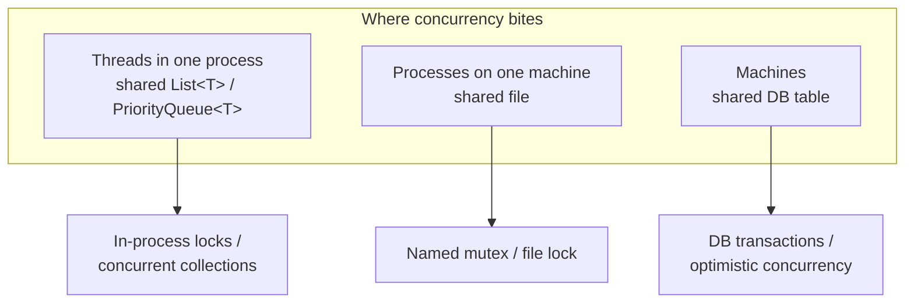
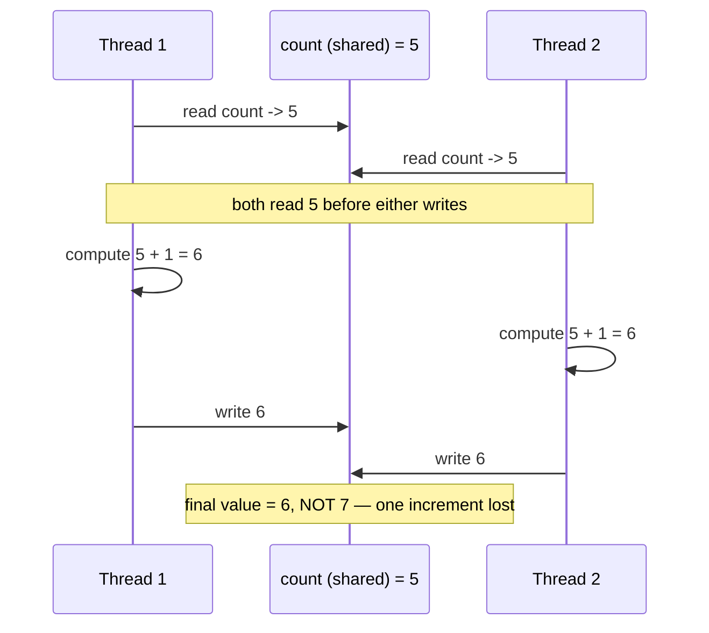
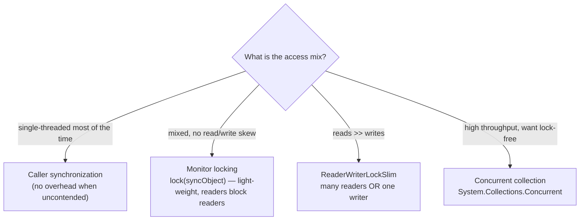
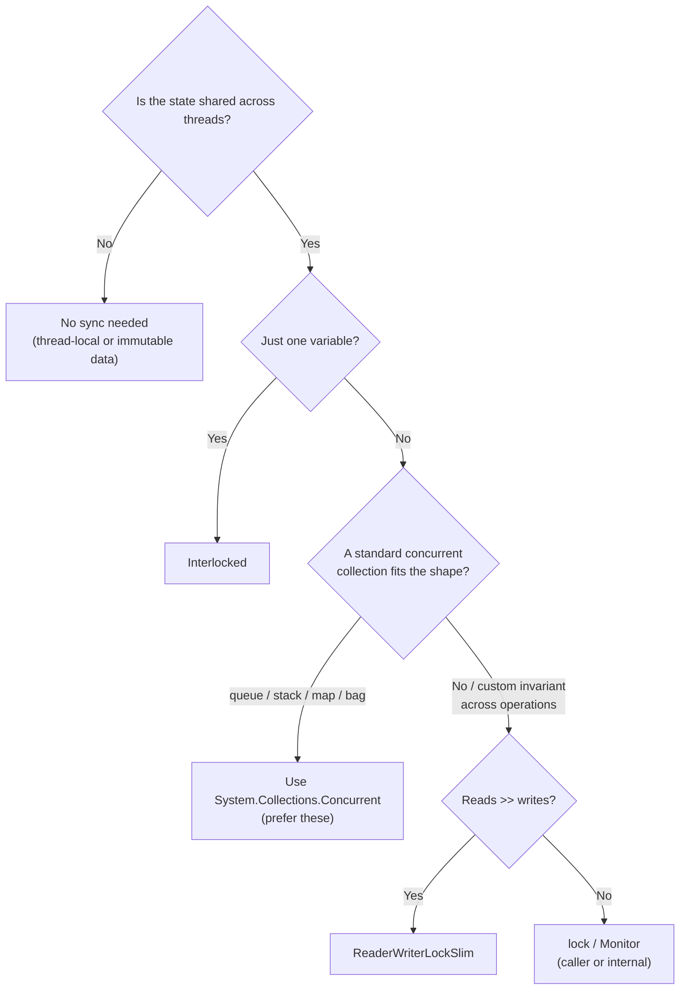

# Collection Concurrency (Reviewer)

**Concurrency** is two or more operations executing at the same time. The classic flavor is *multiple threads inside one process* sharing a mutable [collection](algorithms-glossary-reviewer.md#collection "An object that groups multiple elements, like a list, set, queue, or dictionary.") — a shared `List<T>`, a `Dictionary<K,V>`, a `PriorityQueue<T>` — but the same hazard appears one tier up (multiple processes sharing a file) and one tier up again (multiple machines sharing a database table). The unit of trouble is always the same: **shared mutable state touched without coordination**. The standard library collections (`List<T>`, `Dictionary<TKey,TValue>`, `Queue<T>`, `Stack<T>`) are explicitly *not* thread-safe — they assume a single writer, and concurrent writers silently corrupt them.

The danger is not theoretical. A single logical operation like "enqueue" or "increment a count" compiles into several memory reads and writes; when two threads interleave those steps, you get **race conditions**, **torn reads**, lost updates, and shattered [invariants](algorithms-glossary-reviewer.md#invariant "A condition that stays true at every step, used to prove correctness.") (a heap that no longer satisfies the heap property, a linked list whose `Count` lies about its length). This reviewer pins down *why* unsynchronized collections break, then walks the three locking strategies in order of sophistication — **caller synchronization**, internal **monitor locking**, and **reader/writer locking** — before turning to .NET's purpose-built `System.Collections.Concurrent` types and the rule that survives all of them: even a thread-safe collection cannot make a **check-then-act** sequence atomic for you.

Related: [Algorithm Patterns Index](algorithm-patterns-index-reviewer.md) · [Linked Lists](linked-lists-reviewer.md) · [Hash Tables](hash-tables-reviewer.md) · [Heaps & Priority Queues](heaps-and-priority-queues-reviewer.md) · [Glossary](algorithms-glossary-reviewer.md)

## Contents
- [What concurrency is and the levels it lives at](#what-concurrency-is-and-the-levels-it-lives-at)
- [Why shared mutable collections are unsafe](#why-shared-mutable-collections-are-unsafe)
- [A race condition, step by step](#a-race-condition-step-by-step)
- [Strategy 1: caller synchronization](#strategy-1-caller-synchronization)
- [Strategy 2: internal monitor locking](#strategy-2-internal-monitor-locking)
- [Strategy 3: reader/writer locking](#strategy-3-readerwriter-locking)
- [Lock-based vs lock-free](#lock-based-vs-lock-free)
- [.NET concurrent collections](#net-concurrent-collections)
- [The Try pattern and atomic compound operations](#the-try-pattern-and-atomic-compound-operations)
- [Atomicity, Interlocked, and check-then-act](#atomicity-interlocked-and-check-then-act)
- [Choosing a strategy](#choosing-a-strategy)
- [Interview Q&A](#interview-qa)
- [Rapid-fire round](#rapid-fire-round)
- [Exam-style questions](#exam-style-questions)
- [30-second takeaway](#30-second-takeaway)
- [Quick recall checklist](#quick-recall-checklist)
- [References](#references)

---

## What concurrency is and the levels it lives at

Key points:

- **Concurrency = two or more operations executing at the same time.** When they touch a shared resource, their interleaving — not your source order — determines the result, and the scheduler chooses the interleaving.
- The same problem recurs at three scales, each with its own coordination primitive:
  - **Threads in one process** sharing a `List<T>` or `PriorityQueue<T>` → in-process locks (`lock`, `Monitor`, `ReaderWriterLockSlim`) or concurrent collections.
  - **Processes on one machine** sharing a file → OS primitives (named mutexes, file locks).
  - **Machines** sharing a database row → distributed coordination (DB transactions, optimistic concurrency, distributed locks).
- This reviewer focuses on the **in-process / shared-collection** tier, but the mental model — *identify the shared mutable state, serialize the conflicting accesses* — transfers directly.
- A **thread-safe** type is one whose own operations remain correct under concurrent calls. The everyday BCL collections are **not** thread-safe for writers; treating them as if they were is the root cause.



*The same hazard — shared mutable state — appears at three scales; this reviewer lives at the top one.*

## Why shared mutable collections are unsafe

Key points:

- A collection holds an **invariant** that several fields must agree on: a `List<T>` keeps `_items`, `_size`, and `_version` consistent; a binary heap keeps every parent ≤ its children; a `Dictionary<K,V>` keeps bucket pointers coherent. A write touches *several* of those fields, and the write is **not** a single indivisible step.
- If thread B observes the collection **midway** through thread A's write, B sees a state that violates the invariant — a **torn read**. If A and B both write, one update can be silently overwritten (a **lost update**) or the internal arrays can be left pointing into the void.
- Concrete failure modes from concurrent `List<T>.Add` without synchronization: an `IndexOutOfRangeException` (two threads grab the same slot index, then one writes past the array), a **lost element** (both write the same slot), a wrong `Count`, or — worst — **no exception at all**, just quietly missing data.
- The slides' summary is exact: *"Concurrent updates to non-concurrency-safe collections can lead to unexpected behavior and data loss."* The "unexpected behavior" includes corruption that surfaces minutes later, far from the real bug.
- Reads are not automatically safe either: reading a field while another thread writes it can return a **partially updated** value (especially for large structs or references being reseated).

Consider the slides' running example: a `PriorityQueue<Job>` (a binary heap) with **four producer threads**, each enqueuing 25 jobs:

```csharp
var jobs = new PriorityQueue<Job>();        // NOT thread-safe
Thread[] adders = new Thread[4];

ThreadStart addJobs = () =>
{
    for (int i = 0; i < 25; i++)
        jobs.Enqueue(new Job(i));            // each Enqueue = push + sift-up (many steps)
};

for (int i = 0; i < adders.Length; i++)
{
    adders[i] = new Thread(addJobs);
    adders[i].Start();                       // four threads racing on one heap
}
```

`Enqueue` appends to the backing array, then **sifts the new node up** swapping with parents until the heap property holds. Two threads doing that simultaneously interleave their swaps, leave the array length inconsistent with the element count, and produce a heap that is no longer a heap — later `Dequeue` calls then return the wrong "highest priority" job or throw.

## A race condition, step by step

The smallest illustrative case is two threads each running `count = count + 1`. That single line is three machine steps: **read** `count`, **add** one, **write** back. Interleave them and one increment vanishes.



*Two `count++` operations interleave; both read 5, both write 6, and one increment is silently lost — the classic lost-update race.*

Key points:

- The bug is **non-deterministic**: most interleavings produce the right answer, so it passes locally and fails in production under load. This is why concurrency bugs are notoriously hard to reproduce.
- The exact same shape scales up to a collection: replace "read/modify/write `count`" with "read the heap array, sift up, write back length". The interleaving corrupts the *structure*, not just a number.
- A **data race** specifically is two threads accessing the same location, at least one writing, with no synchronization ordering them. The fix is to establish a **happens-before** ordering — that is what every lock below provides.
- "It works on my machine" is the signature symptom. Correctness under concurrency must be *designed in*, not tested in.

## Strategy 1: caller synchronization

Here the collection stays a plain, non-thread-safe type, and **the caller takes a lock** around every access. The collection knows nothing about threads; responsibility is pushed to call sites.

Key points:

- Use a **dedicated private lock object** (`private readonly object _lock = new();`). Never `lock(this)` or `lock` a public/`typeof` object — external code could lock the same monitor and deadlock you.
- `lock(obj) { ... }` is C# sugar for `Monitor.Enter`/`Monitor.Exit` in a `try`/`finally`. One thread holds the monitor at a time; others **block** until it is released. This serializes access and restores the happens-before ordering the race destroyed.
- **The lock scope must cover the whole logical operation**, not each method call. The slides' key warning: a `while (jobs.Count > 0) { ... Dequeue() ... }` loop where `Count` and `Dequeue` are locked *separately* still races — another thread can drain the queue between the `Count` check and the `Dequeue`, so `Dequeue` throws on an empty queue. This is a **check-then-act** bug.

```csharp
private readonly object _jobsLock = new();
private readonly PriorityQueue<Job> _jobs = new();

// Producer: lock around the whole enqueue.
void AddJob(Job j)
{
    lock (_jobsLock) { _jobs.Enqueue(j); }
}

// WRONG: Count and Dequeue locked separately — another thread can empty the
// queue between the check and the act, so Dequeue throws on empty.
while (_jobs.Count > 0)              // checked OUTSIDE any lock
{
    Job next;
    lock (_jobsLock) { next = _jobs.Dequeue(); }   // may throw: queue now empty
    next.Process();
}

// RIGHT: re-check the count INSIDE the lock; act only if still non-empty.
bool running = true;
while (running)
{
    Job next = null;
    lock (_jobsLock)
    {
        if (_jobs.Count > 0) next = _jobs.Dequeue();  // check + act atomically
        else running = false;
    }
    if (next != null) next.Process();   // process OUTSIDE the lock — keep it short
}
```

Trade-offs:

- **Pros:** lets non-thread-safe collections run in concurrent code; **zero overhead when used single-threaded** (you simply don't lock); the caller picks the optimal granularity — one lock can guard several related operations atomically.
- **Cons:** the caller is responsible for *all* synchronization, which is **easy to get wrong** (forget one call site and the whole thing is unsafe); **readers block readers** (a plain monitor doesn't distinguish reads from writes); and the lock leaks into every call site, hurting encapsulation.
- **Do as little as possible inside the lock.** Notice `Process()` runs *outside* the lock above — holding a lock during slow work serializes everything and kills throughput, and worse, calling unknown code while holding a lock invites **deadlock**.

## Strategy 2: internal monitor locking

Push the lock *into* the collection. The container owns a private `syncObject` and wraps each operation in `lock(syncObject){...}`, so callers use it like an ordinary collection and get thread safety for free **per operation**.

Key points:

- A single monitor lock **serializes all access** to the container — every reader and writer takes the same lock, one at a time. `Monitor` locks are very light-weight, so this is cheap per acquisition.
- Encapsulation improves: thread safety is the collection's job, not every caller's. Fewer places to get it wrong.
- The cost is the same monitor weakness: **readers block other readers**, so a read-heavy workload serializes needlessly even though concurrent reads can't conflict.
- **It does not make compound operations atomic.** Each *method* is atomic, but a caller doing `if (q.Count > 0) q.Dequeue();` across two locked calls still has a check-then-act gap. Internal locking buys per-call safety, not per-transaction safety.

```csharp
public sealed class LockingPriorityQueue<T>
{
    private readonly object _syncLock = new();   // single internal monitor
    private readonly PriorityQueue<T> _heap = new();

    public void Enqueue(T value)
    {
        lock (_syncLock) { _heap.Push(value); }  // lock taken for any heap mutation
    }

    public bool TryDequeue(out T value)          // expose an atomic check-then-act
    {
        lock (_syncLock)
        {
            if (_heap.Count == 0) { value = default; return false; }
            value = _heap.Pop();
            return true;
        }
    }

    public int Count { get { lock (_syncLock) return _heap.Count; } }
}
```

Note the design lesson: rather than expose `Count` and `Dequeue` separately (inviting the race), the collection exposes a single **`TryDequeue`** that does the check and the act *under one lock*. Good thread-safe APIs hand the caller atomic compound operations instead of atomic primitives.

## Strategy 3: reader/writer locking

When **reads vastly outnumber writes**, a single monitor wastes the natural parallelism of reading. `ReaderWriterLockSlim` allows **many concurrent readers OR one exclusive writer** — readers no longer block each other; only a writer demands exclusivity.

Key points:

- A single `ReaderWriterLockSlim` serializes *writes* and blocks writes while reads are in flight, but lets **multiple readers proceed at once**. Concurrent reading can overcome the performance cost a plain monitor pays under read-heavy load.
- Pair the calls religiously and always release in a **`finally`**: `EnterReadLock`/`ExitReadLock` for read-only methods, `EnterWriteLock`/`ExitWriteLock` for mutations. A missed exit (e.g. an exception with no `finally`) **deadlocks** every future caller.
- Writes are **exclusive**: while a write lock is held, all reads and writes block until it is released. So a write still stops the world — the win is purely on the read side.
- **It wins when reads dominate** (caches, lookup tables, config). For roughly balanced or write-heavy loads the extra bookkeeping (`ReaderWriterLockSlim` is heavier than `Monitor`) can make it *slower* than a plain `lock`. Measure.
- `EnterUpgradeableReadLock` exists for the read-then-maybe-write pattern (hold an upgradeable read, upgrade to a write only if needed) without dropping the lock in between.

```csharp
public sealed class RwPriorityQueue<T>
{
    private readonly ReaderWriterLockSlim _rw = new();
    private readonly PriorityQueue<T> _heap = new();

    public void Enqueue(T value)            // a writer: exclusive
    {
        _rw.EnterWriteLock();               // blocks all readers and writers
        try { _heap.Push(value); }
        finally { _rw.ExitWriteLock(); }    // ALWAYS release in finally
    }

    public T Peek()                         // a reader: shared with other readers
    {
        _rw.EnterReadLock();                // many readers can hold this at once
        try { return _heap.Top(); }
        finally { _rw.ExitReadLock(); }     // writes resume when reader count hits 0
    }
}
```



*Granularity and the read/write skew pick the strategy: plain lock for balanced loads, RW lock for read-heavy, concurrent types for throughput.*

## Lock-based vs lock-free

Key points:

- **Lock-based** synchronization uses mutual exclusion: a thread acquires a lock, others **block** (the OS may deschedule them). Simple to reason about, but blocking threads, lock contention, priority inversion, and **deadlock** (two threads each waiting on the other's lock) are real costs.
- **Lock-free** algorithms make progress without mutual exclusion, typically built on an atomic **compare-and-swap (CAS)** — read a value, compute a new one, and atomically swap it in *only if it hasn't changed*; retry if it has. No thread can block the others by holding a lock, so one stalled thread can't freeze the system.
- Lock-free is **harder to implement correctly** (the ABA problem, memory ordering, subtle retries) but can scale better under high contention because there is no lock to serialize on.
- In .NET you rarely hand-roll either: **`Interlocked`** gives you atomic single-variable operations (`Increment`, `Add`, `Exchange`, `CompareExchange`), and the **concurrent collections** below package lock-free or fine-grained-locking implementations behind ordinary-looking method calls.

## .NET concurrent collections

`System.Collections.Concurrent` provides collections designed for concurrent access. They are **not drop-in replacements** for `List<T>`/`Dictionary<K,V>` — the API differs (no indexer mutation, `Try*` methods) — but you should **prefer them** in code that needs thread-safe collections rather than bolting locks onto the non-safe types.

| Type | Order / semantics | Thread-safety mechanism | Typical use | Key methods |
| --- | --- | --- | --- | --- |
| `ConcurrentQueue<T>` | FIFO | **lock-free** | producer/consumer pipelines, work queues | `Enqueue`, `TryDequeue`, `TryPeek` |
| `ConcurrentStack<T>` | LIFO | **lock-free** | undo stacks, depth-first work, pools | `Push`, `PushRange`, `TryPop`, `TryPeek` |
| `ConcurrentBag<T>` | **unordered** | thread-local storage + work-stealing | many threads add *and* take their own items | `Add`, `TryTake`, `TryPeek` |
| `ConcurrentDictionary<TKey,TValue>` | key→value map | **fine-grained locking** (striped) + lock-free reads | shared caches, lookup tables, counters | `TryAdd`, `TryGetValue`, `GetOrAdd`, `AddOrUpdate`, `TryUpdate`, `TryRemove` |

Key points:

- **`ConcurrentQueue<T>` and `ConcurrentStack<T>` are lock-free.** They never block a caller on a lock, so they scale well in producer/consumer scenarios.
- **`ConcurrentBag<T>`** is optimized for the case where the *same* threads both add and remove; each thread prefers its own local set and only "steals" from others when empty. Use it when you don't care about order and threads consume what they produce; avoid it when one set of threads only produces and another only consumes (a `ConcurrentQueue<T>` fits that better).
- **`ConcurrentDictionary<TKey,TValue>`** is the workhorse. Reads are largely lock-free; writes lock only one of several internal buckets (lock striping), so independent keys rarely contend. Its `GetOrAdd` and `AddOrUpdate` are the atomic compound operations that make it genuinely useful.
- All of them use the **`Try` pattern** for removal/peek: `TryDequeue`, `TryPop`, `TryTake`, `TryGetValue` return a `bool` and an `out` value, so they never throw on an empty/missing case — essential because between any "is it there?" and "take it" another thread may have changed the answer.

```csharp
using System.Collections.Concurrent;

var queue = new ConcurrentQueue<int>();
queue.Enqueue(1);                         // same shape as Queue<T>.Enqueue

if (queue.TryPeek(out int head))          // Try pattern: no throw if empty
    Console.WriteLine(head);

if (queue.TryDequeue(out int value))      // returns false (not an exception) if empty
    Console.WriteLine(value);
```

The four-producer `PriorityQueue<Job>` example from the slides becomes trivially safe by swapping the bare heap for a concurrent collection (or by wrapping it with one of the lock strategies above). Note that .NET ships no `ConcurrentPriorityQueue<T>`; for a thread-safe priority queue you wrap `PriorityQueue<T>` with a `lock` (Strategy 1/2) or use a `ConcurrentDictionary` keyed by priority bucket.

## The Try pattern and atomic compound operations

`ConcurrentDictionary` is worth its own section because its compound operations are exactly what prevent the check-then-act races a naive lock-around-a-`Dictionary` would still allow.

Key points:

- **`GetOrAdd(key, valueFactory)`** returns the existing value if the key is present, otherwise adds the factory's value and returns it — **atomically**. Replaces the racy `if (!d.ContainsKey(k)) d[k] = make();`.
- **`AddOrUpdate(key, addValue, updateFn)`** inserts if absent or applies `updateFn` to the current value if present — atomically. The canonical concurrent-counter idiom.
- **Caveat:** the `valueFactory`/`updateFn` may run **more than once** under contention (the dictionary retries its CAS), and its *side effects are not part of the atomic guarantee*. Keep these delegates **pure and cheap** — don't open a file or mutate external state inside them.
- `TryUpdate(key, newValue, comparisonValue)` is a CAS on a dictionary entry: it updates only if the current value still equals `comparisonValue`. `TryRemove(key, out value)` removes-and-returns atomically.

```csharp
var counts = new ConcurrentDictionary<string, int>();

// Atomic "first time, add 1; thereafter, increment" — no lock, no race.
counts.AddOrUpdate("a", addValue: 1, updateValueFactory: (key, cur) => cur + 1);

// Atomic get-or-create; the factory runs only when the key is absent
// (and possibly more than once under contention — keep it side-effect free).
var list = perKeyLists.GetOrAdd("a", _ => new ConcurrentBag<int>());
```

## Atomicity, Interlocked, and check-then-act

The most-missed rule: **a thread-safe collection makes each *operation* atomic, not each *transaction* you build out of operations.**

Key points:

- A sequence like *"check `TryPeek`, then `TryDequeue`"* or *"`ContainsKey` then index-set"* is **two atomic steps with a gap** — another thread can act in the gap. The collection cannot close that gap for you; you must either use a single compound method (`GetOrAdd`, `AddOrUpdate`, `TryDequeue`) or wrap your own steps in a lock.
- For **single shared variables**, use **`Interlocked`** rather than a lock: `Interlocked.Increment(ref count)` does the read-add-write of the earlier race as **one atomic instruction**, so two threads incrementing never lose an update. `Interlocked.CompareExchange` is the CAS primitive for hand-rolled lock-free updates.
- Even with `Interlocked`, *combining* two interlocked operations is again non-atomic — atomicity does not compose. If two variables must change together, you need a lock or a single CAS over a combined state.
- Rule of thumb: **one variable → `Interlocked`; one collection operation → the concurrent collection's own atomic method; multiple operations that must be all-or-nothing → a lock.**

```csharp
// Lost-update race FIXED for a single counter: one atomic instruction.
int count = 0;
Interlocked.Increment(ref count);     // read+add+write, indivisible — no lost updates

// check-then-act done RIGHT on a concurrent queue: one atomic call.
if (queue.TryDequeue(out var job))    // no gap between "is there one?" and "take it"
    job.Process();
```

## Choosing a strategy



*Prefer immutability, then Interlocked for one variable, then a concurrent collection, and reach for explicit locks only when an invariant spans multiple operations.*

Key points:

- **First choice: avoid shared mutable state.** Immutable data (or thread-local copies, `ThreadLocal<T>`) needs no synchronization at all — there's nothing to corrupt. This is the cheapest "lock".
- **One variable → `Interlocked`.** Don't take a lock to increment an `int`.
- **A standard shape (FIFO/LIFO/map/bag) → a concurrent collection.** They're tested, often lock-free, and hand you atomic compound operations.
- **A custom collection or an invariant spanning several operations → explicit locks**: a plain `lock` for balanced loads, `ReaderWriterLockSlim` only when reads truly dominate. Keep critical sections tiny and never call out to unknown code while holding a lock (deadlock risk).
- **Measure.** Reader/writer locks and even some concurrent collections can be slower than a plain `lock` under low contention. Synchronization is a cost; buy only what the workload needs.

## Interview Q&A

### Fundamentals

Q: Why isn't `List<T>` (or `Dictionary<K,V>`) thread-safe?
A: Their write operations mutate several internal fields (backing array, size, version) that must stay mutually consistent, and a write is **not** a single atomic step. If a second thread reads or writes mid-update, it sees a torn, invariant-violating state — producing `IndexOutOfRangeException`, lost elements, a wrong `Count`, or silent corruption. They're designed for a single writer.

Q: What is a race condition, and why are they so hard to find?
A: A race condition is when the result depends on the **non-deterministic interleaving** of threads accessing shared state. The textbook case is two `count++` operations both reading the same value and both writing back the same incremented value — one increment is lost. They're hard to find because most interleavings give the right answer, so the bug appears only under specific timing, usually under production load, and rarely reproduces in a debugger.

Q: What's the difference between a race condition and a deadlock?
A: A **race condition** is a correctness bug from unsynchronized access (lost updates, corruption). A **deadlock** is a liveness bug where two or more threads each hold a lock the other needs and all of them block forever. Locks fix races but, used carelessly (lock ordering, calling out while holding a lock), introduce deadlocks.

### The locking strategies

Q: Compare caller synchronization with internal (collection) synchronization.
A: **Caller synchronization** keeps the collection non-thread-safe and makes each call site take a lock — zero overhead when used single-threaded and full control over granularity, but the caller must get *every* access right and it's easy to do wrong. **Internal/monitor synchronization** moves the lock inside the collection so callers can't forget it — better encapsulation, but every call pays the lock and it only guarantees per-method atomicity, not per-transaction.

Q: When does `ReaderWriterLockSlim` beat a plain `lock`, and when does it lose?
A: It **wins when reads vastly outnumber writes**, because it lets many readers run concurrently while a plain monitor would serialize them. It **loses** on write-heavy or balanced workloads, where its heavier bookkeeping costs more than a simple `Monitor` and writes are exclusive anyway. Always release locks in a `finally`.

Q: Why must the lock cover the whole compound operation, not each call?
A: Because thread safety per method doesn't make a *sequence* atomic. The classic bug is `while (q.Count > 0) { ... q.Dequeue(); }` with `Count` and `Dequeue` locked separately — another thread drains the queue in the gap, so `Dequeue` throws on empty. You must re-check the count **inside** the same lock as the dequeue (or use an atomic `TryDequeue`).

### Concurrent collections

Q: Which `System.Collections.Concurrent` types are lock-free, and what's the `Try` pattern?
A: `ConcurrentQueue<T>` and `ConcurrentStack<T>` are **lock-free**. The `Try` pattern — `TryDequeue`, `TryPop`, `TryTake`, `TryGetValue` — returns a `bool` plus an `out` value instead of throwing when the collection is empty or the key is missing. It exists because between checking "is something there?" and taking it, another thread may have changed the answer, so the check and the take must be one atomic call.

Q: What do `GetOrAdd` and `AddOrUpdate` do, and what's the gotcha?
A: On `ConcurrentDictionary`, `GetOrAdd` atomically returns the existing value or inserts and returns a new one; `AddOrUpdate` atomically inserts-or-updates. The gotcha: their factory/update **delegates may run more than once** under contention and their side effects are **not** part of the atomic guarantee, so keep them pure and cheap.

Q: A thread-safe collection is in use — am I now race-free?
A: No. Each *operation* is atomic, but any **check-then-act** you build from several operations still has a gap another thread can exploit. Use the collection's own compound atomic methods (`GetOrAdd`, `TryDequeue`), use `Interlocked` for single variables, or wrap the multi-step sequence in a lock.

## Rapid-fire round

- Concurrency in one sentence → **two or more operations executing at the same time on shared state.**
- Are `List<T>`/`Dictionary<K,V>` thread-safe? → **No — single-writer assumption; concurrent writes corrupt them.**
- The `count++` race outcome → **two reads of 5, two writes of 6 → one increment lost.**
- Three locking strategies → **caller synchronization, internal monitor locking, reader/writer locking.**
- `lock(obj)` desugars to → **`Monitor.Enter`/`Monitor.Exit` in try/finally.**
- What to lock on → **a private readonly object; never `this`, a type, or a public object.**
- Caller-sync biggest risk → **easy to implement wrong; one missed call site breaks it.**
- Monitor-lock weakness → **readers block other readers.**
- `ReaderWriterLockSlim` wins when → **reads vastly outnumber writes.**
- RW lock invariant → **many concurrent readers OR one exclusive writer; release in finally.**
- Lock-free types in .NET concurrent → **`ConcurrentQueue<T>` and `ConcurrentStack<T>`.**
- `ConcurrentBag<T>` is best for → **unordered, same threads both add and take.**
- `ConcurrentDictionary` write mechanism → **fine-grained (striped) locking; mostly lock-free reads.**
- Atomic dict compound ops → **`GetOrAdd`, `AddOrUpdate` (factory may run twice).**
- The `Try` pattern returns → **a bool + out value; never throws on empty/missing.**
- One shared integer → **`Interlocked.Increment` / `CompareExchange`, not a lock.**
- Does thread-safe per-op give atomic transactions? → **No — check-then-act still races; wrap it.**
- Cheapest synchronization → **none: use immutable or thread-local data.**

## Exam-style questions

1. What does this print, and why is it not reliably `400`?

```csharp
int count = 0;
var threads = Enumerable.Range(0, 4).Select(_ => new Thread(() =>
{
    for (int i = 0; i < 100; i++) count = count + 1;   // not atomic
})).ToList();
threads.ForEach(t => t.Start());
threads.ForEach(t => t.Join());
Console.WriteLine(count);
```

**Answer:** It prints **some value ≤ 400, non-deterministically** (often a bit less). `count = count + 1` is read-modify-write, three steps; when two threads read the same `count` before either writes, both write the same incremented value and one increment is **lost**. The fix is `Interlocked.Increment(ref count)`, which makes the read-add-write a single atomic instruction and reliably yields `400`.

2. This consumer loop occasionally throws "queue empty" on `Dequeue`. Find the bug and fix it.

```csharp
while (jobs.Count > 0)                 // jobs is a plain Queue<Job>
{
    Job next;
    lock (jobsLock) { next = jobs.Dequeue(); }
    next.Process();
}
```

**Answer:** **Check-then-act race.** `Count` is read *outside* the lock; between that check and acquiring the lock, another consumer can dequeue the last job, so `Dequeue` then throws on an empty queue. The check and the act must be atomic. Fix: re-check inside the lock —

```csharp
while (true)
{
    Job next = null;
    lock (jobsLock)
    {
        if (jobs.Count == 0) break;
        next = jobs.Dequeue();
    }
    next.Process();          // process OUTSIDE the lock
}
```

or switch to a `ConcurrentQueue<Job>` and loop on `while (jobs.TryDequeue(out var next)) next.Process();`.

3. Two engineers wrap a shared lookup cache. One uses a `lock` around a `Dictionary<K,V>`; the other uses `ReaderWriterLockSlim`. Reads outnumber writes ~1000:1. Who is right, and what's the subtle correctness rule both must follow?

**Answer:** The **`ReaderWriterLockSlim`** engineer is right *for this read-heavy mix* — it lets the thousand-to-one readers run concurrently while a plain monitor would serialize every read. (For a balanced or write-heavy mix the plain `lock` could win, since the RW lock is heavier and writes are exclusive either way.) The rule both must follow: **always release in a `finally`** (`ExitReadLock`/`ExitWriteLock` or the `lock` scope), and keep any **check-then-act** — e.g. "if not present, add" — inside a single locked region (or use `ConcurrentDictionary.GetOrAdd`), because per-call safety doesn't make a multi-step sequence atomic.

## 30-second takeaway

> Concurrency is two operations running at once on shared state; the everyday BCL collections (`List<T>`, `Dictionary<K,V>`, `Queue<T>`) are **not thread-safe**, so concurrent writers tear their invariants and lose data. Fix it by **serializing conflicting access**: **caller synchronization** (caller locks each operation — zero cost single-threaded, easy to get wrong), **internal monitor locking** (`lock(syncObject)` inside the collection — readers block readers), or **`ReaderWriterLockSlim`** (many readers OR one writer — wins only when reads dominate). Better yet, prefer `System.Collections.Concurrent`: `ConcurrentQueue`/`ConcurrentStack` (lock-free), `ConcurrentBag`, and `ConcurrentDictionary` with atomic `GetOrAdd`/`AddOrUpdate` and the `Try*` pattern. Remember the rule atomicity doesn't compose around: a thread-safe collection makes each *operation* atomic, not your *check-then-act* sequence — use `Interlocked` for one variable, a compound atomic method for one collection step, and a lock when an invariant spans several. Cheapest of all: avoid shared mutable state entirely.

## Quick recall checklist

- **Concurrency** = two+ operations at once on a shared resource; threads/process/machine are the three scales.
- **BCL collections are single-writer.** Concurrent writes → `IndexOutOfRangeException`, lost elements, wrong `Count`, silent corruption.
- **Race condition:** non-deterministic interleaving; `count++` loses updates because read-modify-write isn't atomic.
- **Caller synchronization:** private `readonly object` lock around each operation; no overhead when single-threaded; easy to do wrong; readers block readers.
- **Monitor locking:** `lock(syncObject)` inside the collection; light-weight; per-method atomic only; readers block readers.
- **Reader/writer locking:** `ReaderWriterLockSlim`, `EnterReadLock`/`ExitReadLock` vs `EnterWriteLock`/`ExitWriteLock`; many readers OR one writer; **wins when reads ≫ writes**; release in `finally`.
- **Lock-free vs lock-based:** lock-free uses CAS, no blocking, harder but scales; `Interlocked` and the concurrent collections package it for you.
- **Concurrent collections:** `ConcurrentQueue<T>`/`ConcurrentStack<T>` (lock-free), `ConcurrentBag<T>` (unordered), `ConcurrentDictionary<K,V>` (striped locking). Prefer these; not drop-in replacements.
- **Compound atomics:** `GetOrAdd`, `AddOrUpdate` (factory may run more than once — keep it pure); `Try*` pattern returns bool + out, never throws on empty/missing.
- **Atomicity doesn't compose:** per-operation safety ≠ atomic transaction. One variable → `Interlocked`; one op → concurrent method; multi-step invariant → a lock.
- **Keep critical sections tiny; never call out to unknown code while holding a lock** (deadlock). Prefer immutable/thread-local data first.

## References

- Microsoft Learn — [Thread-Safe Collections (`System.Collections.Concurrent`)](https://learn.microsoft.com/en-us/dotnet/standard/collections/thread-safe/).
- Microsoft Learn — [`ConcurrentDictionary<TKey,TValue>` Class](https://learn.microsoft.com/en-us/dotnet/api/system.collections.concurrent.concurrentdictionary-2).
- Microsoft Learn — [`ConcurrentQueue<T>` Class](https://learn.microsoft.com/en-us/dotnet/api/system.collections.concurrent.concurrentqueue-1).
- Microsoft Learn — [`ReaderWriterLockSlim` Class](https://learn.microsoft.com/en-us/dotnet/api/system.threading.readerwriterlockslim).
- Microsoft Learn — [`lock` statement](https://learn.microsoft.com/en-us/dotnet/csharp/language-reference/statements/lock) and [`Interlocked` Class](https://learn.microsoft.com/en-us/dotnet/api/system.threading.interlocked).
- Robert Horvick — Pluralsight, *Algorithms and Data Structures*, "Collection Concurrency" module.
