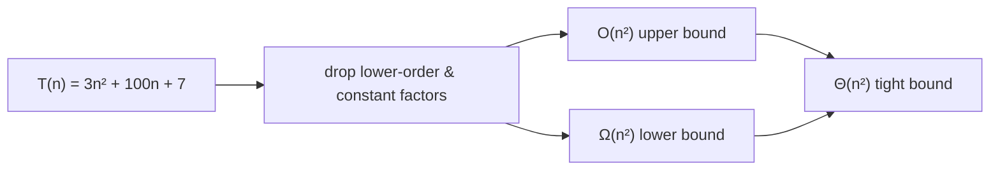
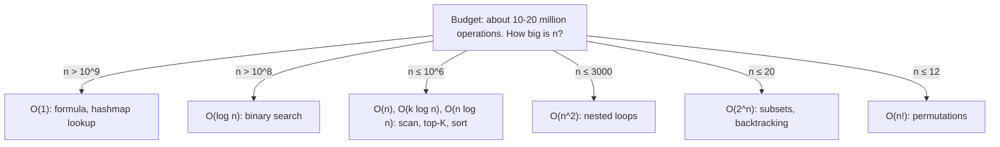
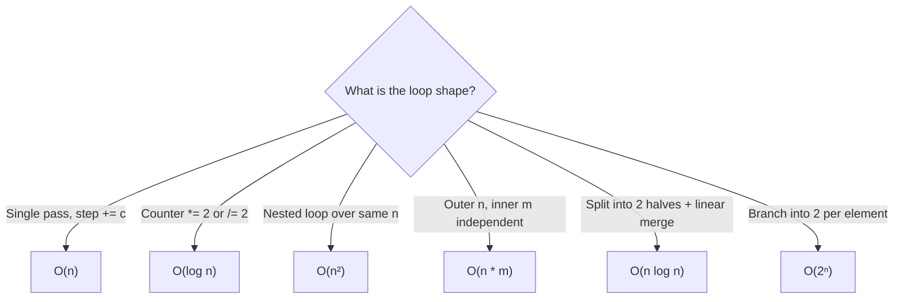
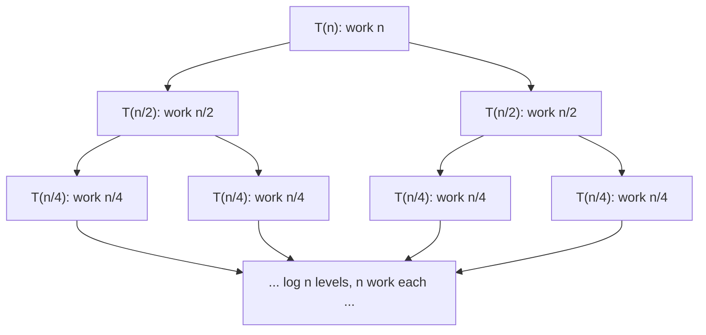
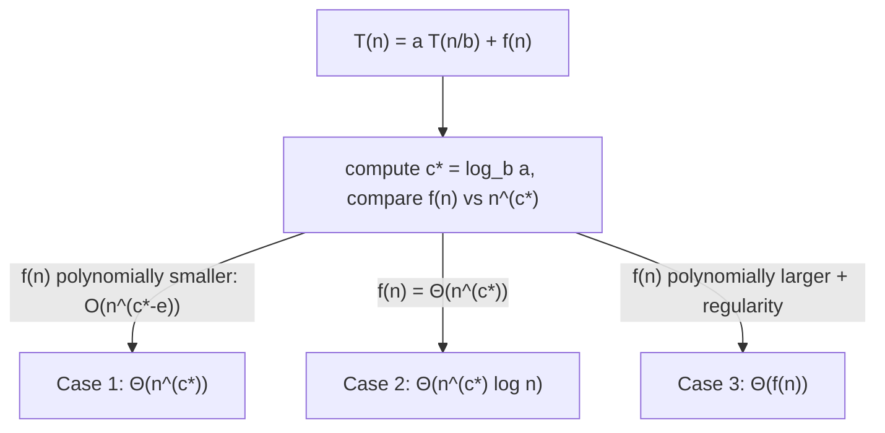
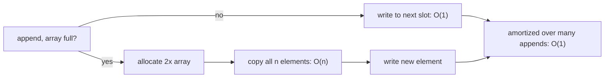
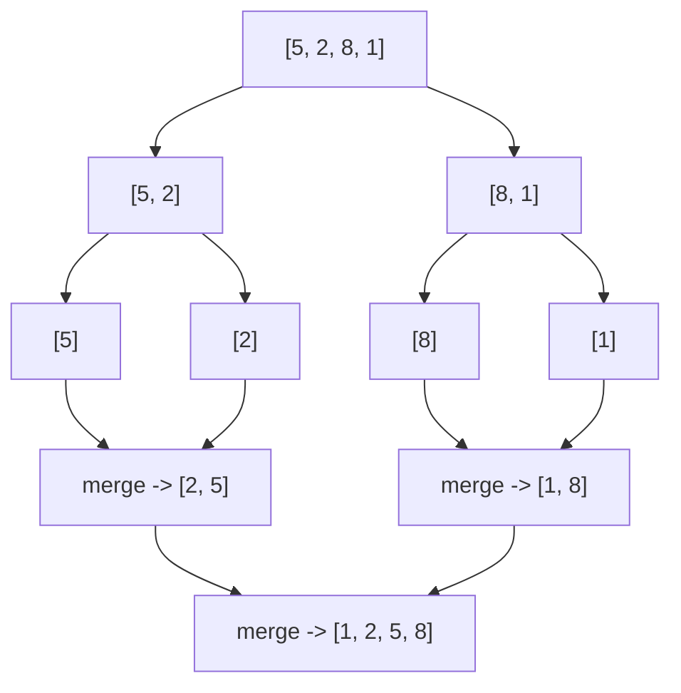

# Algorithmic Complexity & Big-O (Reviewer)

Big-O is the language interviewers and exam graders use to talk about how an [algorithm](algorithms-glossary-reviewer.md#algorithm "A precise, finite sequence of steps that turns an input into a desired output.") *scales* as its
input grows. It deliberately throws away constants and lower-order terms so that two implementations can
be compared by their growth shape alone — an [O(n)](algorithms-glossary-reviewer.md#linear-time "Work grows in direct proportion to input size, about one unit per element.") scan beats an [O(n^2)](algorithms-glossary-reviewer.md#quadratic-time "Work grows like the square of n, typically a nested loop over the same data.") double loop for large `n`
regardless of how tightly either is coded. Almost every coding interview ends with "and what's the time
and space complexity?", and a wrong answer there undoes a correct solution. This reviewer is the
foundation under every other algorithm note: master loop-counting, the [recursion](algorithms-glossary-reviewer.md#recursion "A function solving a problem by calling itself on smaller versions of it.")/[Master-Theorem](algorithms-glossary-reviewer.md#master-theorem "Formula that solves divide-and-conquer recurrences T(n)=aT(n/b)+f(n).")
machinery, and [amortized analysis](algorithms-glossary-reviewer.md#amortized-analysis "Average cost per operation across a worst-case sequence, not a probability.") here, and the complexity claims in all the pattern reviewers become
obvious rather than memorized.

Two ideas carry most of the weight. First, **[asymptotics](algorithms-glossary-reviewer.md#asymptotic-analysis "Studying how an algorithm behaves as input grows toward infinity.")**: we care about behavior as `n` to infinity, so
`3n^2 + 50n + 1000` is just O(n^2). Second, the **complexity ladder** — a small set of growth classes
([constant](algorithms-glossary-reviewer.md#constant-time "Cost does not depend on input size; the same fixed work every time."), [log](algorithms-glossary-reviewer.md#logarithmic-time "Each step discards a constant fraction, so steps equal the log of n."), linear, [linearithmic](algorithms-glossary-reviewer.md#linearithmic-time "A linear pass repeated a logarithmic number of times; good-sort speed."), quadratic, [exponential](algorithms-glossary-reviewer.md#exponential-time "Adding one element roughly doubles the work; cost of two choices per item."), [factorial](algorithms-glossary-reviewer.md#factorial-time "Cost of enumerating every ordering of n items; grows faster than exponential.")) that nearly every interview
problem falls into. Knowing where each ladder rung comes from (a halving loop gives log, a nested loop
gives quadratic) lets you read complexity off the *shape* of the code instead of guessing.

Related: [Algorithm Patterns Index](algorithm-patterns-index-reviewer.md) · [Recursion & Divide and Conquer](recursion-and-divide-and-conquer-reviewer.md) · [Sorting Algorithms](sorting-algorithms-reviewer.md) · [Collections & Big-O (C# data structures)](../dotnet/csharp/collections-and-big-o-reviewer.md) · [Glossary](algorithms-glossary-reviewer.md)

## Contents
- [What Big-O, Big-Theta, and Big-Omega mean](#what-big-o-big-theta-and-big-omega-mean)
- [The complexity ladder](#the-complexity-ladder)
- [Runtime cheat sheet: how big can n be?](#runtime-cheat-sheet-how-big-can-n-be)
- [Counting loops and sequential vs nested code](#counting-loops-and-sequential-vs-nested-code)
- [Logarithms in algorithms](#logarithms-in-algorithms)
- [Analyzing recursion: recursion trees and recurrences](#analyzing-recursion-recursion-trees-and-recurrences)
- [The Master Theorem](#the-master-theorem)
- [Amortized analysis](#amortized-analysis)
- [Space complexity and the call stack](#space-complexity-and-the-call-stack)
- [Best vs average vs worst case](#best-vs-average-vs-worst-case)
- [Reading constraints to guess the target complexity](#reading-constraints-to-guess-the-target-complexity)
- [Worked example: Two Sum, Binary Search, Sort](#worked-example-two-sum-binary-search-sort)
- [Interview Q&A](#interview-qa)
- [Rapid-fire round](#rapid-fire-round)
- [Exam-style questions](#exam-style-questions)
- [30-second takeaway](#30-second-takeaway)
- [Quick recall checklist](#quick-recall-checklist)
- [References](#references)

---

## What Big-O, Big-Theta, and Big-Omega mean

The three asymptotic notations bound a function's growth from above, below, or both. In interviews
people say "[Big-O](algorithms-glossary-reviewer.md#big-o-notation "Upper bound on how an algorithm's cost grows as input size increases.")" loosely to mean "the [tight bound](algorithms-glossary-reviewer.md#big-theta "The tight bound: growth bounded by the same function from above and below.")," but the precise definitions matter for exams.

Key points:

- **Big-O — O(f(n)) — upper bound.** `T(n)` is O(f(n)) if there exist constants `c > 0` and `n0` such
  that `T(n) <= c * f(n)` for all `n >= n0`. It says "grows *no faster than* f(n)."
- **[Big-Omega](algorithms-glossary-reviewer.md#big-omega "Lower bound: an algorithm grows at least as fast as a given function.") — Omega(f(n)) — lower bound.** `T(n) >= c * f(n)` for large `n`. It says "grows *at
  least as fast as* f(n)."
- **Big-Theta — Theta(f(n)) — tight bound.** Both O and Omega hold (possibly different constants). This
  is the "exact growth class," and it is what we usually *mean* when we casually say O.
- **Drop constants and lower-order terms.** `5n` is O(n); `3n^2 + 100n + 7` is O(n^2). Constants depend
  on hardware and coding style, not on the algorithm's scaling; lower-order terms vanish relative to the
  dominant one as `n` grows.
- **Common abuse to know:** quoting O(n^2) for an algorithm that is actually Theta(n) is technically
  *true* (an upper bound) but uselessly loose. Interviewers want the tight bound, so give Theta-level
  answers even while saying "O."



*Big-O bounds from above, Big-Omega from below; when they coincide you get the tight Big-Theta class.*

## The complexity ladder

Almost every interview answer is one of these rungs. Knowing a concrete source for each makes them
recognizable on sight.

| Class | Name | Typical source | Example operation |
| --- | --- | --- | --- |
| O(1) | constant | direct index / hash lookup | `arr[i]`, `dict[key]` |
| O(log n) | logarithmic | halving the search space each step | binary search, balanced-tree lookup |
| O(n) | linear | one pass over the input | single loop, linear scan |
| O(n log n) | linearithmic | [divide-and-conquer](algorithms-glossary-reviewer.md#divide-and-conquer "Split a problem into independent subproblems, solve each, then combine.") with linear merge | merge sort, heap sort, good [comparison sort](algorithms-glossary-reviewer.md#comparison-sort "A sort that orders elements only by comparing pairs; floor is O(n log n).") |
| O(n^2) | quadratic | nested loop over the same input | bubble sort, all-pairs double loop |
| O(2^n) | exponential | branch into 2 each element / all subsets | naive [subset](algorithms-glossary-reviewer.md#subset "Any selection from a set; n elements have 2^n subsets including empty and full.") enumeration, naive recursive Fibonacci |
| O(n!) | factorial | enumerate all orderings | [brute-force](algorithms-glossary-reviewer.md#brute-force "Trying every possibility directly; correct but often too slow.") [permutations](algorithms-glossary-reviewer.md#permutation "An ordered arrangement of elements; n distinct items have n! permutations.") / Traveling Salesman by brute force |

Key points:

- The ordering is strict for large `n`: `1 < log n < n < n log n < n^2 < 2^n < n!`. Anything past
  O(n log n) signals "this only works for small `n` or needs pruning/DP."
- O(2^n) and O(n!) are the **intractable** rungs: at n = 20, 2^20 is about a million, but 20! is about
  2.4 * 10^18 — far beyond what runs in time.
- O(n log n) is the practical floor for comparison-based sorting (proved lower bound) — you cannot
  sort by comparisons faster.

```text
operations as n grows (one "op" = one basic step)
class        n=10        n=100          n=1000
----------   ----------  -------------  -----------------
O(1)                  1              1                  1
O(log n)              3              7                 10     (log2 n, rounded)
O(n)                 10            100               1000
O(n log n)           33            664               9966
O(n^2)              100         10 000          1 000 000
O(2^n)            1 024   1.27 * 10^30            ~10^301  (astronomically off-chart)
O(n!)         3 628 800  ~9.3 * 10^157          off-chart
```

*Concrete operation counts: between O(n^2) and O(2^n) the gap explodes — that is the line between "scales" and "does not."*

## Runtime cheat sheet: how big can n be?

AlgoMonster's *Runtime to Algo* summary turns the [complexity ladder](#the-complexity-ladder) into a
practical cheat sheet: for each class, **how large can `n` get before the solution is too slow?** The
single assumption behind it is a budget of roughly **10–20 million operations** per solution (other
sources phrase the same limit as about `10^8` operations *per second* — either way it is an
order-of-magnitude sanity check, not a hard cap). Constants and lower-order terms drop as usual, so
O(2n) and O(5n) are both O(n), and a loop from `-100` to `5n` is still O(n) — the *class* is what
decides whether you clear the budget. Read against the input bound, this table tells you the intended
complexity and warns you when a candidate will [time out](algorithms-glossary-reviewer.md#time-limit-exceeded "Verdict when a solution is correct but too slow for the input size.").

| Class | Max `n` (rule of thumb) | Typical algorithms at that size |
| --- | --- | --- |
| O(1) | n > 10^9 | hashmap lookup, array access/update, stack push/pop, closed-form formula |
| O(log n) | n > 10^8 | binary search or a variant, balanced-BST lookup, walking the digits of `n` |
| O(n) | n ≤ 10^6 | single array/list scan, two pointers, tree/graph traversal, stack/queue |
| O(k log n) | n ≤ 10^6 | k heap push/pops (top-K), k binary searches |
| O(n log n) | n ≤ 10^6 | sorting, divide-and-conquer with a linear merge |
| O(n^2) | n ≤ 3000 | nested loops over the same data, many brute-force solutions |
| O(2^n) | n ≤ 20 | subsets / backtracking, naive recursive Fibonacci |
| O(n!) | n ≤ 12 | permutations, brute-force orderings |

Key points:

- **It adds two things to the ladder:** the practical *cutoffs*, and the O(k log n) "top-K" rung —
  push/pop a [heap](algorithms-glossary-reviewer.md#heap "A tree structure keeping the smallest or largest element instantly accessible.") `k` times, or run `k` [binary searches](algorithms-glossary-reviewer.md#binary-search "Repeatedly halve a sorted range to locate a target in O(log n)."). With `k` near `n` this is just O(n log n); for
  small `k` it is much cheaper.
- **The cutoffs are soft.** "O(n^2) up to n ≈ 3000" assumes ~10^7 ops with a small constant; the
  *inverse* mapping (constraint → complexity, with reasoning) is tabulated under
  [Reading constraints to guess the target complexity](#reading-constraints-to-guess-the-target-complexity).
- **`log n` is nearly free.** `log2(10^6) ≈ 20` and `log2(10^9) ≈ 30`, so O(log n) clears an `n` far
  larger than anything you could scan — and the `log n` *factor* separating O(n) from O(n log n) rarely
  decides feasibility.
- **The expensive rungs need pruning or memoization.** O(2^n) and O(n!) only finish for tiny `n`; the
  same problems become tractable with [memoization / DP](algorithms-glossary-reviewer.md#memoization "Caching a function's results by its arguments so repeated calls are O(1).") or [backtracking](algorithms-glossary-reviewer.md#backtracking "Building candidate solutions incrementally and abandoning a path as soon as it cannot succeed.") with [pruning](algorithms-glossary-reviewer.md#pruning "Cutting off a search branch early once it cannot lead to a valid or better answer.").



*Match the input bound to the largest class that still fits the operation budget; anything growing faster than your `n` allows is too slow.*

```text
reading a constraint backwards (n up to 100,000, ~10^7-10^8 op budget):
  O(n^2)      -> (10^5)^2 = 10^10 ops  -> times out
  O(n log n)  -> ~1.7 * 10^6 ops       -> fits
  O(n)        -> 10^5 ops              -> fits easily
```

*At n = 10^5 the quadratic shape blows the budget by ~100x while the linearithmic and linear shapes clear it with room to spare — which is why "n up to 10^5" almost always means "find the O(n log n) or O(n) solution."*

A tiny C# example pinned to each class — the same programs AlgoMonster shows in Python/Java/C++/JS,
written in C#:

```csharp
// O(1): a fixed number of operations, independent of n
int a = 5, b = 7, c = 4;
int d = a + b + c + 153;

// O(log n): n is halved each step, so about log2(n) iterations
long m = 100_000_000;
while (m > 0)
    m /= 2;                  // constant work per iteration

// O(n): one pass; constant factors and +k terms drop, so 5n + 17 is still O(n)
for (int i = 0; i < 5 * n + 17; i++) { /* constant-time work */ }
```

```csharp
// O(k log n): pop the k smallest from a heap of n items; each pop is O(log n)
var heap = new PriorityQueue<int, int>();      // assume n items already enqueued
var topK = new List<int>();
for (int i = 0; i < k; i++)
    topK.Add(heap.Dequeue());                  // k pops × O(log n) = O(k log n)

// O(n log n): the default library sort is introsort (n log n) in .NET
Array.Sort(nums);
```

```csharp
// O(n^2): nested loops over the same n. A triangular inner loop (j from i)
// runs 1 + 2 + ... + n = n(n+1)/2 times — still O(n^2).
for (int i = 0; i < n; i++)
    for (int j = i; j < n; j++) { /* constant-time work */ }
```

```csharp
// O(2^n): each call branches into two and recomputes overlapping subproblems
static long Fib(int n)
{
    if (n == 0 || n == 1) return 1;
    return Fib(n - 1) + Fib(n - 2);
}
```

```csharp
// O(n!): the recursion tree that emits every ordering has n! leaves
static void Permute(List<int> nums, int start, List<IList<int>> output)
{
    if (start == nums.Count) { output.Add(new List<int>(nums)); return; }
    for (int i = start; i < nums.Count; i++)
    {
        (nums[start], nums[i]) = (nums[i], nums[start]);   // choose
        Permute(nums, start + 1, output);                  // explore
        (nums[start], nums[i]) = (nums[i], nums[start]);   // un-choose
    }
}
```

## Counting loops and sequential vs nested code

The mechanical rules. Count how many times the innermost work runs as a function of `n`.

Key points:

- **Single loop over n items -> O(n).** A loop whose counter advances by a constant step runs `n`
  times.
- **Nested loops -> multiply.** An outer loop of `n` with an inner loop of `n` runs `n * n = n^2` times.
  If the inner loop depends on the outer (`j` from `i`), it is the *sum* `n + (n-1) + ... + 1 =
  n(n+1)/2`, which is still O(n^2).
- **Sequential blocks -> add, then keep the max.** Code that does an O(n) pass then a separate O(n^2)
  pass is `O(n) + O(n^2) = O(n^2)` — the dominant term wins.
- **Loop that multiplies/divides the counter -> O(log n).** `for (i = 1; i < n; i *= 2)` runs about
  `log2 n` times (see the next section).
- **Different inputs get different variables.** Looping over an `m`-array inside an `n`-array is
  O(n * m), *not* O(n^2) — do not collapse independent sizes into one symbol.

```csharp
// Single loop: O(n)
for (int i = 0; i < n; i++) Use(a[i]);

// Nested, triangular: 1 + 2 + ... + n = n(n+1)/2  ->  O(n^2)
for (int i = 0; i < n; i++)
    for (int j = i; j < n; j++)
        Use(a[i], a[j]);

// Sequential: O(n) + O(n^2) = O(n^2)  (dominant term wins)
for (int i = 0; i < n; i++) Use(a[i]);
for (int i = 0; i < n; i++)
    for (int j = 0; j < n; j++) Use(a[i], a[j]);

// Two independent sizes: O(n * m), not O(n^2)
for (int i = 0; i < n; i++)
    for (int j = 0; j < m; j++) Use(a[i], b[j]);
```



*Read complexity off the loop's shape: a halving counter is logarithmic, a nested same-n loop is quadratic.*

## Logarithms in algorithms

[Logarithms](algorithms-glossary-reviewer.md#logarithm "The power a base must be raised to for a number; in algorithms usually base 2.") appear whenever the problem size is *cut by a constant factor* each step. The intuition is
worth internalizing because it is the source of every O(log n) and the `log n` factor in O(n log n).

Key points:

- **Halving gives O(log n).** Starting at `n` and halving — `n, n/2, n/4, ..., 1` — takes about
  `log2 n` steps to reach 1, because `n / 2^k = 1` means `k = log2 n`.
- **The base does not matter asymptotically.** `log_a n` and `log_b n` differ only by the constant
  factor `1 / log_b a` (change-of-base), and Big-O drops constants. So O(log2 n), O(log10 n), and
  O(ln n) are all just O(log n).
- **What the base *does* tell you:** a base-`b` log means you shrink by a factor of `b` each step. Binary
  search divides by 2 (base 2); a ternary search divides by 3 (base 3) — same O(log n) class, different
  constant.
- **log n grows agonizingly slowly:** `log2(1,000,000)` is about 20; `log2(1,000,000,000)` is about 30.
  That is why O(log n) lookups feel "free."

```text
halving n = 16 down to 1
step:   0     1     2     3     4
size:  16     8     4     2     1
                                ^ reached 1 after log2(16) = 4 steps
```

*Each step halves the remaining size; the number of steps to reach 1 is log2 n — here 4 for n = 16.*

## Analyzing recursion: recursion trees and recurrences

Recursive algorithms are analyzed with a **[recurrence relation](algorithms-glossary-reviewer.md#recurrence-relation "An algorithm's running time expressed in terms of its cost on smaller inputs.")** — the running time `T(n)` expressed in
terms of the work done at this level plus the cost of the recursive calls.

Key points:

- The canonical divide-and-conquer recurrence is **`T(n) = a * T(n/b) + f(n)`**, where `a` is the number
  of recursive calls, `n/b` is the subproblem size, and `f(n)` is the non-recursive work (the
  divide + combine cost) at the current level.
- A **recursion tree** makes the total cost visible: each node is a subproblem, you sum the `f` work
  across each level, then sum the levels. Total work = (work per level) * (number of levels) when the
  per-level work is constant across levels.
- **Number of levels** is the [recursion depth](algorithms-glossary-reviewer.md#recursion-depth-and-stack-overflow "How deep nested calls go; too deep exhausts the call stack and crashes."): with subproblem size `n/b`, the tree has about `log_b n`
  levels before hitting the [base case](algorithms-glossary-reviewer.md#base-case "The condition where a recursive function stops and returns a direct answer.").
- **Beware the trap:** `T(n) = 2 * T(n/2) + O(1)` is O(n) (the leaves dominate), but
  `T(n) = 2 * T(n/2) + O(n)` is O(n log n) (work is equal across levels). The non-recursive term `f(n)`
  decides everything — do not eyeball the call count alone.
- **Linear recursion** like `T(n) = T(n-1) + O(1)` (one call, decrement by 1) gives O(n) time and O(n)
  call-stack space — that is plain iteration in disguise.

Take merge sort: `T(n) = 2 * T(n/2) + n`. Two recursive calls on halves, plus an O(n) merge.



*Every level sums to n total work (n, then 2*(n/2), then 4*(n/4) ...); there are log n levels, so the total is n * log n = O(n log n).*

```text
merge-sort recursion tree, T(n) = 2 T(n/2) + n
level   #nodes   size/node   work/level
  0       1         n            n
  1       2        n/2           n
  2       4        n/4           n
  ...
  k=log n n         1            n
                            ----------
        total = n per level * (log n + 1) levels = O(n log n)
```

*The per-level work stays constant at n while the depth is log n — multiplying gives the linearithmic bound.*

## The Master Theorem

The Master Theorem solves `T(n) = a * T(n/b) + f(n)` for `a >= 1`, `b > 1`, by comparing `f(n)` against
the **watershed** `n^(log_b a)` — the cost the leaves contribute. The exponent `log_b a` is how many
leaves the tree has relative to `n`.

Let `c* = log_b a`. Compare `f(n)` to `n^(c*)`:

- **Case 1 — leaves dominate.** If `f(n) = O(n^(c* - e))` for some `e > 0` (work shrinks faster than the
  leaf count grows), then **`T(n) = Theta(n^(c*))`**.
- **Case 2 — balanced.** If `f(n) = Theta(n^(c*))` (work matches the watershed), then **`T(n) =
  Theta(n^(c*) * log n)`**. (More generally, `f(n) = Theta(n^(c*) * log^k n)` gives an extra `log^(k+1)
  n`.)
- **Case 3 — root dominates.** If `f(n) = Omega(n^(c* + e))` for some `e > 0` **and** the regularity
  condition `a * f(n/b) <= k * f(n)` holds for some `k < 1`, then **`T(n) = Theta(f(n))`**.



*Pick the Master Theorem case by comparing the combine work f(n) against the watershed n^(log_b a).*

Worked examples:

- **Merge sort: `T(n) = 2 T(n/2) + n`.** Here `a = 2`, `b = 2`, so `c* = log_2 2 = 1`, and `n^(c*) = n`.
  Since `f(n) = n = Theta(n^1)`, this is **Case 2**: `T(n) = Theta(n * log n)`. Matches the recursion
  tree above.
- **Binary search: `T(n) = 1 T(n/2) + O(1)`.** Here `a = 1`, `b = 2`, so `c* = log_2 1 = 0`, and
  `n^(c*) = n^0 = 1`. Since `f(n) = O(1) = Theta(n^0)`, this is **Case 2**: `T(n) = Theta(1 * log n) =
  Theta(log n)`.
- **Binary tree traversal: `T(n) = 2 T(n/2) + O(1)`.** `a = 2`, `b = 2`, `c* = 1`, `n^(c*) = n`. Now
  `f(n) = O(1) = O(n^(1 - 1))`, polynomially smaller, so **Case 1**: `T(n) = Theta(n)`. (Visiting every
  node once.)
- **Naive O(n^2)-combine split: `T(n) = 2 T(n/2) + n^2`.** `c* = 1`, and `f(n) = n^2 = Omega(n^(1 +
  1))` with regularity satisfied, so **Case 3**: `T(n) = Theta(n^2)`.

Caveat to state in an interview: the Master Theorem **does not cover every recurrence** — it fails when
`f(n)` is not polynomially comparable to `n^(c*)` (e.g. `T(n) = 2 T(n/2) + n / log n` falls in the gap
between Case 1 and 2), or when subproblems are unequal sizes (`T(n) = T(n/3) + T(2n/3) + n`). For those,
fall back to the recursion-tree method or the Akra-Bazzi formula.

## Amortized analysis

Amortized analysis is the average cost **per operation across a worst-case sequence** of operations — not
a probabilistic average. It is why "append to a dynamic array is O(1)" is a legitimate claim even though
an individual append can cost O(n).

Key points:

- A [dynamic array](algorithms-glossary-reviewer.md#dynamic-array "A resizable array that grows automatically by copying into a larger backing array.") (`List<T>` in .NET) **doubles** its backing capacity when full: 1 -> 2 -> 4 -> 8 -> ...
  Each doubling copies all current elements (O(current size)), but doublings are rare.
- Over `n` appends, the total copy work is `1 + 2 + 4 + ... + n < 2n` (a geometric series sums to less
  than twice its last term). So `n` appends cost O(n) total, i.e. **O(1) amortized** per append.
- **Amortized is not average-case.** It is a guarantee about *any* sequence of `n` ops, with no
  probability involved. The worst single op is still O(n) (the resize), but the worst *sequence* averages
  to O(1) each.
- **Growth factor matters.** Doubling (or any factor > 1) gives O(1) amortized. Growing by a *constant*
  amount (e.g. +1 each time) makes total copies `1 + 2 + ... + n = O(n^2)`, i.e. O(n) amortized — the
  classic mistake.
- The three formal techniques are **aggregate** (total / n, as above), **accounting** (each cheap op
  prepays a credit the expensive op spends), and **potential** (a potential function bounds future cost).
  Aggregate is enough for interviews.

```text
appending 8 items to a doubling array (cap shown after each step)
op#   action          cap   copies this op   running copies
 1    add, grow 0->1    1         0                 0
 2    add, grow 1->2    2         1                 1
 3    add, grow 2->4    4         2                 3
 4    add (room)        4         0                 3
 5    add, grow 4->8    8         4                 7
 6    add (room)        8         0                 7
 7    add (room)        8         0                 7
 8    add (room)        8         0                 7
                                            ----------------
total element-copies after 8 adds = 7  <  2 * 8 = 16   ->  O(1) amortized
```

*Copies only happen on the rare power-of-two resizes; they sum to under 2n, so each append averages O(1).*



*Most appends are a single O(1) write; the occasional O(n) doubling copy, spread across all appends, amortizes to O(1).*

## Space complexity and the call stack

[Space complexity](algorithms-glossary-reviewer.md#space-complexity "How the extra memory an algorithm needs grows with input size.") counts the **extra** memory an algorithm uses as a function of `n`, beyond the input
itself. The most-forgotten contributor is the recursion [call stack](algorithms-glossary-reviewer.md#call-stack "Memory tracking active function calls; each call pushes a frame, popped on return.").

Key points:

- **[Auxiliary space](algorithms-glossary-reviewer.md#auxiliary-space "Extra memory beyond the input, including temporaries and the call stack.")** is the extra space the algorithm allocates (temporary arrays, hash sets, the call
  stack). **[In-place](algorithms-glossary-reviewer.md#in-place "Transforms its input using only O(1) extra memory, rearranging in place.")** means O(1) auxiliary space — you rearrange the input without proportional extra
  memory.
- **Recursion costs stack space.** A recursion of depth `d` holds `d` stack frames simultaneously, so it
  uses **O(d)** space even if each frame is O(1). Linear recursion (`T(n-1)`) is O(n) stack; balanced
  divide-and-conquer is O(log n) stack.
- **Examples to anchor it:**
  - Iterative binary search: O(1) space. Recursive binary search: O(log n) stack space.
  - Merge sort: O(n) auxiliary (the merge buffer) plus O(log n) stack = **O(n)** total.
  - Quicksort: O(1) partition work but O(log n) stack on average, **O(n) stack worst case** (already-sorted
    input, unbalanced recursion) unless you recurse on the smaller side.
  - Building a [hash set](algorithms-glossary-reviewer.md#hash-set "Stores unique keys with O(1) average membership testing and no values.") of all `n` elements: O(n) auxiliary space.
- **Output is sometimes excluded.** Some sources do not count the space needed to *hold the required
  output* (e.g. listing all `n!` permutations is O(n!) output but the working space may be small). State
  your convention.

```csharp
// O(1) auxiliary, O(log n) time — iterative, no stack growth
static int BinarySearch(int[] a, int target)
{
    int lo = 0, hi = a.Length - 1;
    while (lo <= hi)
    {
        int mid = lo + (hi - lo) / 2;   // avoids int overflow vs (lo + hi) / 2
        if (a[mid] == target) return mid;
        if (a[mid] < target) lo = mid + 1;
        else hi = mid - 1;
    }
    return -1;
}

// O(log n) stack space — the recursion depth is the space cost
static int BinarySearchRec(int[] a, int target, int lo, int hi)
{
    if (lo > hi) return -1;
    int mid = lo + (hi - lo) / 2;
    if (a[mid] == target) return mid;
    return a[mid] < target
        ? BinarySearchRec(a, target, mid + 1, hi)
        : BinarySearchRec(a, target, lo, mid - 1);
}
```

## Best vs average vs worst case

The same algorithm can have different complexities depending on the input. Interviews almost always want
the **[worst case](algorithms-glossary-reviewer.md#best-average-and-worst-case "How an algorithm's cost varies across the luckiest, typical, and hardest inputs.")** unless they say otherwise, but knowing all three signals depth.

Key points:

- **Worst case** — the maximum cost over all inputs of size `n`. The default and safest answer; it is an
  upper bound you can promise.
- **Best case** — the minimum cost (a lucky input). Rarely the headline answer, but useful: linear search
  is O(1) best (target first), O(n) worst.
- **Average case** — expected cost over a distribution of inputs. Requires an assumed distribution, so
  state it. Quicksort is O(n log n) average but O(n^2) worst (already-sorted input with a naive pivot).
- **Hash lookups** are the classic gap: O(1) average, **O(n) worst** when every key collides into one
  [bucket](algorithms-glossary-reviewer.md#bucket "A slot in a hash table where keys hashing to the same location are stored."). Say "average O(1)" out loud — claiming a flat O(1) is a known inaccuracy.

| Algorithm | Best | Average | Worst | Space (aux) |
| --- | --- | --- | --- | --- |
| Linear search | O(1) | O(n) | O(n) | O(1) |
| Binary search (sorted) | O(1) | O(log n) | O(log n) | O(1) iterative |
| Quicksort | O(n log n) | O(n log n) | O(n^2) | O(log n) avg stack |
| Merge sort | O(n log n) | O(n log n) | O(n log n) | O(n) |
| Heap sort | O(n log n) | O(n log n) | O(n log n) | O(1) |
| [Hash table](algorithms-glossary-reviewer.md#hash-table "Structure storing keyed data in buckets for O(1) average insert, lookup, delete.") lookup | O(1) | O(1) | O(n) | — |
| Insertion sort | O(n) | O(n^2) | O(n^2) | O(1) |

*Note: merge sort's best case is also O(n log n) because it always splits to depth log n and merges every level regardless of input order.*

## Reading constraints to guess the target complexity

Interview [constraints](algorithms-glossary-reviewer.md#constraints "The limits a problem places on inputs; reading them first picks your complexity target.") (the `n <= ...` line on the problem) are a strong hint about the intended
complexity, because the grader's time limit is roughly "about 10^8 simple operations per second."

| Constraint on n | Likely target complexity | Reasoning |
| --- | --- | --- |
| n <= 10 - 12 | O(n!), O(2^n) | exhaustive search / permutations are fine |
| n <= 20 - 25 | O(2^n), [bitmask](algorithms-glossary-reviewer.md#bitmask "Using an integer's bits to represent a set of flags or a subset of items.") DP | subset enumeration over n elements |
| n <= 100 - 500 | O(n^3) | n^3 around 10^6 - 10^8 |
| n <= 1 000 - 10 000 | O(n^2) | n^2 around 10^6 - 10^8 |
| n <= 10^5 - 10^6 | O(n log n) or O(n) | must avoid quadratic |
| n <= 10^9 or larger | O(log n) or O(1) | cannot even read all input; math/binary-search answer |

Key points:

- "**n up to 10^5, answer in 1 second**" almost always means "find the O(n log n) or O(n) solution" — a
  quadratic loop (10^10 ops) will time out.
- A constraint like "**n <= 20**" practically screams **subset / bitmask DP** (2^20 is about a million).
- When `n` is huge (10^18) but the *answer space* is small, the intended solution is usually **binary
  search on the answer** or a closed-form formula, not iteration over `n`.

## Worked example: Two Sum, Binary Search, Sort

Three canonical problems, each pinning down a complexity class with real C# and a trace.

### LC 1 — Two Sum: O(n^2) brute force vs O(n) hash

The brute force checks every pair — two nested loops, O(n^2) time, O(1) space. The hash approach trades
space for time: one pass, remembering each value's [index](algorithms-glossary-reviewer.md#index "The integer position of an element; 0-indexed starts at 0, 1-indexed at 1."), looking up the complement in O(1) average.

```csharp
// Brute force: O(n^2) time, O(1) space
static int[] TwoSumBrute(int[] nums, int target)
{
    for (int i = 0; i < nums.Length; i++)
        for (int j = i + 1; j < nums.Length; j++)
            if (nums[i] + nums[j] == target)
                return new[] { i, j };
    return Array.Empty<int>();
}

// Hash map: O(n) average time, O(n) space
static int[] TwoSum(int[] nums, int target)
{
    var seen = new Dictionary<int, int>();      // value -> index
    for (int i = 0; i < nums.Length; i++)
    {
        int need = target - nums[i];
        if (seen.TryGetValue(need, out int j))
            return new[] { j, i };
        seen[nums[i]] = i;                      // record current value
    }
    return Array.Empty<int>();
}
```

```text
nums = [2, 7, 11, 15]   target = 9      (hash approach)
 index   0    1    2    3
 i=0  nums[i]=2  need=7   seen={}            7 not in seen -> store 2->0   seen={2:0}
 i=1  nums[i]=7  need=2   seen={2:0}         2 IS in seen at index 0 -> return [0, 1]
```

*The hash map turns the inner O(n) search for the complement into an O(1) lookup, collapsing O(n^2) to O(n).*

This is the bread-and-butter time/space trade-off; the hands-on version lives in the practice repo under
`arrays-hashing` (and the convergent [two-pointer](algorithms-glossary-reviewer.md#two-pointers "Two index variables moving through a sequence to solve it in one linear pass.") variant on a sorted array under
`two-pointers`).

### LC 704 — Binary Search: O(log n)

Binary search on a sorted [array](algorithms-glossary-reviewer.md#array "A fixed-size contiguous block of same-type elements accessed by position in O(1).") halves the candidate range each step — the textbook O(log n). Code is the
iterative `BinarySearch` shown earlier in the space-complexity section.

```text
a = [-1, 0, 3, 5, 9, 12]   target = 9     (lo<=hi, mid = lo + (hi-lo)/2)
 index    0    1    2   3   4    5
 step1   lo=0                       hi=5    mid=2  a[2]=3  < 9  -> lo = 3
 step2                 lo=3         hi=5    mid=4  a[4]=9  = 9  -> return 4
```

*Each comparison discards half the range, so a 6-element array resolves in about log2(6) ~= 3 steps (here 2).*

### LC 912 — Sort an Array: O(n log n)

Any correct general-purpose comparison sort is O(n log n) (the proven lower bound). Merge sort is the
clean O(n log n) worst-case example; its recurrence `T(n) = 2 T(n/2) + n` resolves to Theta(n log n) by
the Master Theorem (Case 2) as derived above. .NET's `Array.Sort` uses an [introspective sort](algorithms-glossary-reviewer.md#introsort "Hybrid sort: quicksort that falls back to heap sort to guarantee O(n log n).")
(quicksort that falls back to heap sort to guarantee O(n log n) worst case).

```csharp
// LC 912 in production C#: Array.Sort is O(n log n), in-place introsort.
static int[] SortArray(int[] nums)
{
    Array.Sort(nums);   // introsort: quicksort + heapsort fallback, O(n log n) worst case
    return nums;
}
```



*Merge sort splits to depth log n (the split tree) and merges O(n) work per level, giving O(n log n) overall.*

Every folder in the practice repo — `arrays-hashing`, `two-pointers`, `sliding-window`,
`heap`, `dynamic-programming`, and the rest — opens its overview with a complexity analysis built on
exactly these counting rules, so this reviewer is the shared foundation for all of them.

## Interview Q&A

### Asymptotics fundamentals

Q: Why do we drop constants and lower-order terms in Big-O?
A: Big-O describes *scaling* as `n` grows, not exact runtime. Constants depend on hardware/compiler and stay fixed as `n` grows, while lower-order terms become negligible relative to the dominant term. `3n^2 + 100n + 7` and `n^2` have the same growth shape, so both are O(n^2).

Q: What is the difference between Big-O, Big-Omega, and Big-Theta?
A: Big-O is an upper bound (grows no faster than), Big-Omega is a lower bound (grows at least as fast as), and Big-Theta is both at once — the tight bound. When people casually say "O" they usually mean the tight Theta bound.

Q: Is O(n^2) a correct complexity for an algorithm that runs in Theta(n)?
A: Technically yes — Big-O is only an upper bound, and n is O(n^2). But it is uselessly loose; interviewers want the tight bound, so you should answer O(n) (Theta(n)).

### Counting and logs

Q: Why does halving the input each step give O(log n)?
A: Starting at `n` and halving repeatedly reaches 1 after `k` steps where `n / 2^k = 1`, so `k = log2 n`. The number of steps is the log of the input size.

Q: Does the logarithm base affect the Big-O class?
A: No. Change-of-base shows `log_a n` and `log_b n` differ only by a constant factor, and Big-O drops constants. O(log2 n) and O(log10 n) are the same class. The base only reflects the shrink factor per step (binary search divides by 2).

Q: A loop does `for (i = 1; i < n; i *= 2)` — what's its complexity?
A: O(log n). The counter multiplies by 2 each iteration, so it takes about log2 n steps to exceed n.

### Recursion and the Master Theorem

Q: What does each part of `T(n) = a T(n/b) + f(n)` mean?
A: `a` is the number of recursive calls, `n/b` is the size of each subproblem, and `f(n)` is the non-recursive work (divide + combine) at the current level. The recursion tree has about log_b n levels.

Q: Apply the Master Theorem to merge sort, `T(n) = 2 T(n/2) + n`.
A: `a = 2`, `b = 2`, so the watershed is `n^(log_2 2) = n^1 = n`. Since `f(n) = n = Theta(n)`, it is Case 2, giving Theta(n log n).

Q: Why is `T(n) = 2 T(n/2) + O(1)` only O(n), but `T(n) = 2 T(n/2) + O(n)` is O(n log n)?
A: In the first, the combine work is constant, so the leaves dominate (Case 1): the number of leaves is n, giving Theta(n). In the second, every level does O(n) total work and there are log n levels (Case 2): n * log n. The combine term `f(n)` decides which.

Q: When can't you use the Master Theorem?
A: When `f(n)` is not polynomially comparable to the watershed (a gap case like `n / log n`), or when subproblems have unequal sizes (`T(n/3) + T(2n/3) + n`). Use a recursion tree or Akra-Bazzi instead.

### Amortized and space

Q: How is "amortized O(1)" different from "average O(1)"?
A: Amortized is a worst-case guarantee over a *sequence* of operations with no probability involved — any n appends cost O(n) total. Average-case assumes a probability distribution over inputs. A single append can still be O(n); the sequence averages to O(1).

Q: Why is appending to a dynamic array O(1) amortized?
A: It doubles capacity when full, so copies happen on resizes only. Over n appends the total copy cost is 1 + 2 + 4 + ... < 2n, i.e. O(n) total, which is O(1) per append.

Q: What breaks the O(1)-amortized append guarantee?
A: Growing by a constant amount instead of a constant factor. Adding +1 capacity each time makes total copies 1 + 2 + ... + n = O(n^2), i.e. O(n) per append.

Q: Does recursion affect space complexity?
A: Yes — each pending recursive call holds a stack frame, so recursion depth `d` costs O(d) space. Recursive binary search is O(log n) space; linear recursion of depth n is O(n) space even with O(1) per frame.

## Rapid-fire round

- Drop constants because → **Big-O measures scaling, not exact runtime.**
- Big-O vs Big-Theta → **upper bound vs tight (both-sided) bound.**
- Halving loop complexity → **O(log n).**
- Does log base matter in Big-O → **no, only a constant factor.**
- Nested same-n loops → **O(n^2).**
- Sequential O(n) then O(n^2) → **O(n^2) (dominant term wins).**
- Outer n, independent inner m → **O(n * m), not O(n^2).**
- Master Theorem watershed → **n^(log_b a).**
- Merge sort recurrence and result → **T(n) = 2T(n/2) + n → Theta(n log n).**
- Binary search recurrence → **T(n) = T(n/2) + O(1) → Theta(log n).**
- Comparison-sort lower bound → **O(n log n).**
- Dynamic-array append cost → **O(1) amortized (O(n) on a resize).**
- Total copies over n appends → **less than 2n.**
- Amortized vs average → **worst-case-sequence guarantee vs probabilistic.**
- Recursion stack space → **O(depth).**
- Recursive binary search space → **O(log n).**
- In-place means → **O(1) auxiliary space.**
- Hash lookup best/avg/worst → **O(1) / O(1) / O(n).**
- Quicksort avg/worst → **O(n log n) / O(n^2).**
- Constraint n <= 20 hints → **O(2^n) / bitmask DP.**
- Constraint n <= 10^5 hints → **O(n log n) or O(n).**
- Two Sum brute vs hash → **O(n^2) → O(n) with a [hash map](algorithms-glossary-reviewer.md#hash-map "Stores key-value pairs and retrieves a value by key in O(1) average time.").**
- Operation budget per solution → **~10–20 million ops (≈ 10^7–10^8/sec) — an order-of-magnitude check.**
- Max n by class → **O(n^2) ≈ 3000, O(2^n) ≈ 20, O(n!) ≈ 12.**
- O(k log n) shows up as → **top-K via a heap, or k binary searches.**
- Binary recursion of depth log n → **O(n) leaves, not O(log n) (2^(log n) = n).**

## Exam-style questions

1. State the tight [time complexity](algorithms-glossary-reviewer.md#time-complexity "How the number of steps an algorithm performs grows with input size.") and explain.

```csharp
int count = 0;
for (int i = 0; i < n; i++)
    for (int j = i; j < n; j++)
        count++;
```

**Answer:** Theta(n^2). The inner loop runs `n - i` times for each `i`, so the total is
`n + (n-1) + ... + 1 = n(n+1)/2`, which is Theta(n^2). The triangular shape does not change the class —
it is still quadratic.

2. What is the time complexity of this loop, and why doesn't the base of the log matter?

```csharp
for (int i = 1; i < n; i *= 3)
    Work();
```

**Answer:** O(log n) — specifically log base 3 of n, since `i` triples each step and reaches `n` after
`log3 n` iterations. The base does not affect the Big-O class because `log3 n = log2 n / log2 3` differs
from `log2 n` only by the constant factor `1 / log2 3`, and Big-O drops constants.

3. Solve `T(n) = 3 T(n/2) + n` with the Master Theorem.

**Answer:** `a = 3`, `b = 2`, watershed `n^(log_2 3)` which is about `n^1.585`. Since
`f(n) = n = O(n^(1.585 - e))` for some `e > 0` (n grows slower than n^1.585), this is Case 1, giving
**Theta(n^(log_2 3))** ≈ Theta(n^1.585). (This is the recurrence for Karatsuba-style splitting; the
leaves dominate.)

4. Is appending to this custom list O(1) amortized? Explain.

```csharp
// pseudo-policy: when full, grow capacity by EXACTLY +10
void Add(T item)
{
    if (count == capacity) Resize(capacity + 10);  // copies all `count` items
    items[count++] = item;
}
```

**Answer:** No. Growing by a constant amount (+10) forces a resize every 10 appends, each copying all
current elements. Total copies over n appends are about `10 + 20 + 30 + ... + n = Theta(n^2)`, i.e.
**O(n) amortized per append**. You only get O(1) amortized by growing by a constant *factor* (e.g.
doubling), which makes total copies a geometric series under 2n.

5. Give the time and the auxiliary space complexity, counting the call stack.

```csharp
static int Fib(int n)             // naive recursive Fibonacci
{
    if (n < 2) return n;
    return Fib(n - 1) + Fib(n - 2);
}
```

**Answer:** Time is **O(2^n)** (more precisely Theta(phi^n), the golden-ratio exponential) because each
call branches into two and recomputes overlapping subproblems. Auxiliary space is **O(n)**: the recursion
explores one root-to-leaf path at a time, and the deepest path has depth n, so at most n frames are on
the stack simultaneously — the space is the depth, not the number of calls.

6. The constraint says `1 <= n <= 100000` with a 1-second limit. What complexity should you target, and
   why is a nested double loop wrong?

**Answer:** Target **O(n log n)** or **O(n)**. With n = 10^5, an O(n^2) double loop is about 10^10
operations, well beyond the roughly 10^8 ops/second budget, so it times out. The constraint is the hint:
"n up to 10^5" almost always means "find the linear or linearithmic solution."

The next six are the AlgoMonster *Big-O practice* drills from the runtime cheat sheet, rewritten in C#
(assume `Next()` reads one input value in O(1) and `Swap(ref a, ref b)` is an O(1) swap).

7. Give the tight asymptotic bound of each expression.

   - `3n + 2n + n`
   - `2n^3 + 5n^2`
   - `n + log n`
   - `n^2 log n`
   - `2^n + n^2`
   - `10`

**Answer:** Drop constants and lower-order terms, keep the dominant one: `3n + 2n + n = 6n →`
**O(n)**; `2n^3 + 5n^2 →` **O(n^3)**; `n + log n →` **O(n)**; `n^2 log n →` **O(n^2 log n)** (already a
single term); `2^n + n^2 →` **O(2^n)** (exponential dominates any polynomial); `10 →` **O(1)** (a
constant — no dependence on n).

8. What is the time complexity?

```csharp
int[] ar = new int[n];
for (int i = 0; i < n; i++) ar[i] = Next();      // read one value: O(1)
int maxVal = ar[0];
for (int i = 1; i < n; i++) maxVal = Math.Max(maxVal, ar[i]);
```

**Answer:** **O(n)**. Allocating the array is O(n), the fill loop is O(n), and the max loop is O(n).
Sequential blocks add and the dominant term is still linear: O(n) + O(n) + O(n) = O(n).

9. What is the time complexity?

```csharp
int[][] ar = new int[n][];
for (int i = 0; i < n; i++) ar[i] = new int[n];
for (int i = 0; i < n; i++)
    for (int j = 0; j < n; j++)
        ar[i][j] = Next();
for (int i = 0; i < n; i++)
    Array.Sort(ar[i]);                           // sort one row of length n: O(n log n)
```

**Answer:** **O(n^2 log n)**. Filling the matrix is O(n^2); sorting each of the `n` rows costs
O(n log n), so the sort phase is `n × O(n log n) = O(n^2 log n)`, which dominates the O(n^2) fill.

10. What is the time complexity?

```csharp
int[,] ar = new int[n, n];
for (int i = 0; i < n; i++)
    for (int j = 0; j < n / 2; j++)
        Swap(ref ar[i, j], ref ar[i, n - j - 1]);   // reverse row i in place
```

**Answer:** **O(n^2)**. The outer loop runs `n` times and the inner loop `n/2` times, so the body runs
`n × n/2 = n^2 / 2` times — the constant ½ drops, leaving O(n^2).

11. What is the time complexity? (`len = log2(n)`.)

```csharp
static void Func(string s, int idx, int len)
{
    if (idx == len) { /* an O(1) op */ }
    else
    {
        Func(s + "a", idx + 1, len);
        Func(s + "b", idx + 1, len);
    }
}
// called as:
Func("", 0, (int)Math.Log2(n));
```

**Answer:** **O(n)**. The recursion branches into two each level and stops at depth `len = log2 n`, so
the call tree has `2^(log2 n) = n` leaves and O(n) nodes total; with O(1) work per node the total is
O(n). The trap: a binary recursion of depth `log2 n` is *linear*, not logarithmic — because
`2^(log n) = n`.

12. What is the time complexity?

```csharp
var bin = new List<int>();
while (n != 0)
{
    bin.Add(n);
    n /= 2;
}
```

**Answer:** **O(log n)**. `n` is integer-halved each iteration, reaching 0 after about `log2 n` steps —
the standard "extract the binary digits of n" loop, which is O(d) for `d = ⌊log2 n⌋ + 1` digits.

## 30-second takeaway

> Big-O is about *scaling*: drop constants and lower-order terms, then place the algorithm on the ladder
> `1 < log n < n < n log n < n^2 < 2^n < n!`. Read it off the code's shape — single loop is O(n), nested
> same-n loop is O(n^2), a halving counter is O(log n), divide-and-conquer with linear combine is
> O(n log n). For recursion, write `T(n) = a T(n/b) + f(n)` and apply the Master Theorem by comparing
> `f(n)` to the watershed `n^(log_b a)`. Remember amortized O(1) for doubling arrays (copies sum to under
> 2n), count the recursion stack as O(depth) space, default to worst-case (hash lookups are O(1) average
> but O(n) worst), and let the `n <=` constraint hint the target complexity.

## Quick recall checklist

- **Asymptotics:** O = upper, Omega = lower, Theta = tight; drop constants and lower-order terms; give
  the *tight* bound even when you say "O."
- **Ladder:** `1 < log n < n < n log n < n^2 < 2^n < n!`; past O(n log n) means "small n or prune/DP."
- **Loop counting:** single → O(n), nested same n → O(n^2), counter `*=`/`/=` → O(log n), independent
  sizes → O(n*m); sequential blocks add (keep the max).
- **Logs:** halving → O(log n); base is irrelevant to the class (constant factor only).
- **Recurrence:** `T(n) = a T(n/b) + f(n)`; recursion tree = (work per level) × (log_b n levels).
- **Master Theorem:** compare `f(n)` to `n^(log_b a)` — smaller → Theta(n^(log_b a)) [Case 1], equal →
  Theta(n^(log_b a) log n) [Case 2], larger + regularity → Theta(f(n)) [Case 3]. Merge sort = Case 2 =
  Theta(n log n); binary search = Theta(log n).
- **Amortized:** doubling array append = O(1) amortized (copies < 2n); constant-increment growth =
  O(n) amortized; amortized ≠ average-case.
- **Space:** auxiliary = extra memory; in-place = O(1) aux; recursion costs O(depth) stack; merge sort
  O(n) aux, quicksort O(log n) avg / O(n) worst stack.
- **Cases:** default to worst case; hash lookup O(1) avg / O(n) worst; quicksort O(n log n) avg / O(n^2)
  worst.
- **Constraints:** n ≤ 20 → O(2^n)/bitmask; n ≤ 10^3 → O(n^2); n ≤ 10^5 → O(n log n)/O(n); n ≥ 10^9 →
  O(log n)/O(1).
- **Runtime cheat sheet (class → max n, ~10–20M-op budget):** O(1) n>10^9, O(log n) n>10^8,
  O(n)/O(k log n)/O(n log n) n≤10^6, O(n^2) n≤3000, O(2^n) n≤20, O(n!) n≤12.

## References

- Wikipedia — [Big O notation](https://en.wikipedia.org/wiki/Big_O_notation).
- Wikipedia — [Master theorem (analysis of algorithms)](https://en.wikipedia.org/wiki/Master_theorem_(analysis_of_algorithms)).
- Wikipedia — [Amortized analysis](https://en.wikipedia.org/wiki/Amortized_analysis).
- Wikipedia — [Time complexity](https://en.wikipedia.org/wiki/Time_complexity).
- Wikipedia — [Dynamic array](https://en.wikipedia.org/wiki/Dynamic_array) (geometric growth, amortized append).
- cp-algorithms — [Binary search](https://cp-algorithms.com/num_methods/binary_search.html).
- Microsoft Learn — [`Array.Sort` Method](https://learn.microsoft.com/en-us/dotnet/api/system.array.sort).
- Microsoft Learn — [`List<T>` Class](https://learn.microsoft.com/en-us/dotnet/api/system.collections.generic.list-1) (capacity doubling).
- AlgoMonster — [Runtime to Algo Cheat Sheet](https://algo.monster/problems/runtime_summary) (the input-size cheat sheet and Big-O practice drills the runtime cheat-sheet section mirrors).
- NeetCode — [Roadmap](https://neetcode.io/roadmap).
- LeetCode — [Study Plans](https://leetcode.com/studyplan/).
