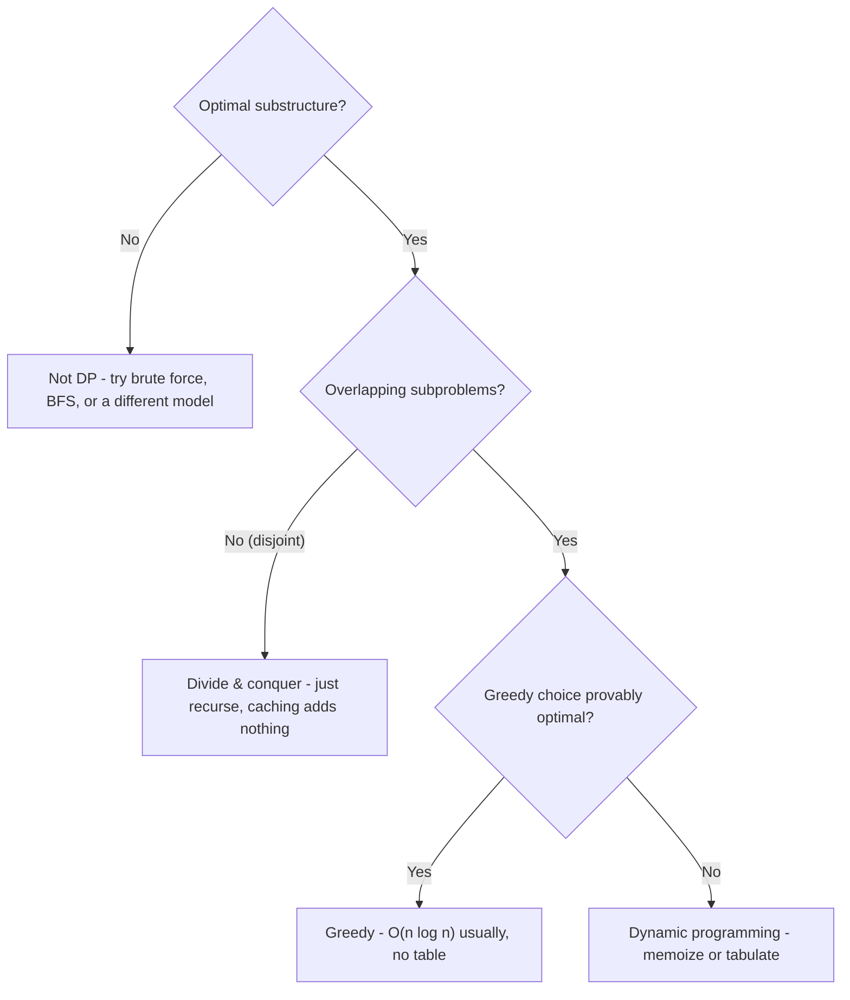
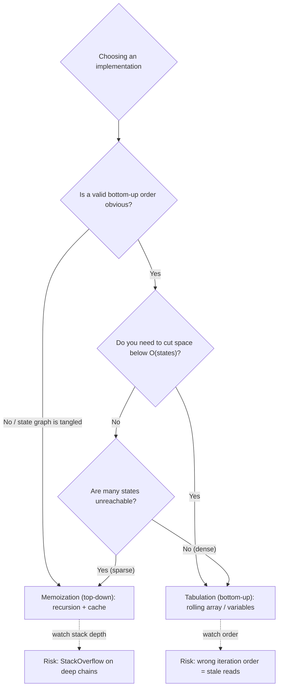
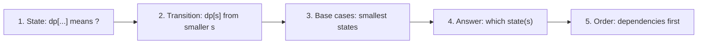
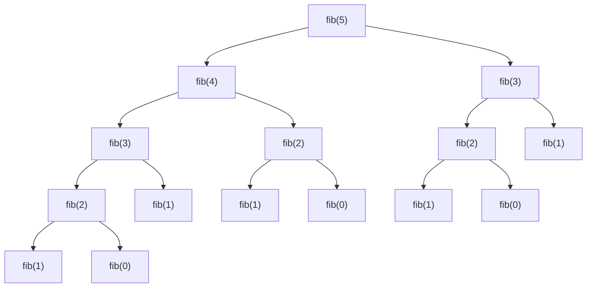
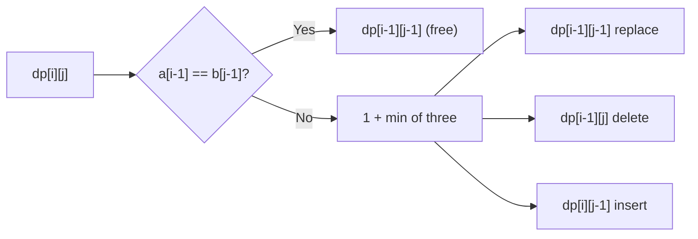
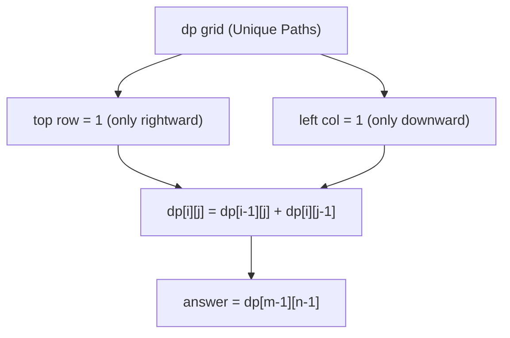

# Dynamic Programming (Reviewer)

[Dynamic programming](algorithms-glossary-reviewer.md#dynamic-programming "Solving problems with overlapping subproblems by computing each once and reusing it.") (DP) is the technique for solving a problem by combining the answers to its
**[overlapping subproblems](algorithms-glossary-reviewer.md#overlapping-subproblems "The recursive breakdown keeps hitting the same smaller subproblems repeatedly.")**, each computed once and cached, rather than recomputed exponentially
many times. It applies precisely when a problem has two properties: **[optimal substructure](algorithms-glossary-reviewer.md#optimal-substructure "An optimal solution can be built from optimal solutions to its subproblems.")** (an
optimal answer is built from optimal answers to smaller pieces) and **overlapping subproblems** (the
naive [recursion](algorithms-glossary-reviewer.md#recursion "A function solving a problem by calling itself on smaller versions of it.") revisits the same smaller inputs again and again). DP turns an [exponential](algorithms-glossary-reviewer.md#exponential-time "Adding one element roughly doubles the work; cost of two choices per item.") recursion
into a polynomial one by trading memory for time — you pay O(states) space to avoid recomputing each
state.

For interviews and exams, DP is the highest-leverage pattern to drill because it is the most
frequently failed: candidates either fail to *see* the [recurrence](algorithms-glossary-reviewer.md#recurrence-relation "An algorithm's running time expressed in terms of its cost on smaller inputs.") or get the **iteration order**,
**[base cases](algorithms-glossary-reviewer.md#base-case "The condition where a recursive function stops and returns a direct answer.")**, or **loop direction** (0/1 vs unbounded) subtly wrong. The cure is a fixed recipe —
define the state, the transition, the base cases, the answer, and the order — and to verify every
table by hand on a tiny example. This reviewer walks the recipe across 1D DP, the knapsack family,
sequence DP, 2D string DP, and grid DP, with traced tables you can reproduce on paper.

Related: [Algorithm Patterns Index](algorithm-patterns-index-reviewer.md) · [Recursion & Divide and Conquer](recursion-and-divide-and-conquer-reviewer.md) · [Greedy](greedy-reviewer.md) · [Backtracking](backtracking-reviewer.md) · [Complexity & Big-O](complexity-and-big-o-reviewer.md) · [Glossary](algorithms-glossary-reviewer.md)

## Contents
- [The two prerequisites](#the-two-prerequisites)
- [DP vs divide-and-conquer vs greedy](#dp-vs-divide-and-conquer-vs-greedy)
- [Memoization vs tabulation](#memoization-vs-tabulation)
- [The DP recipe](#the-dp-recipe)
- [1D DP: climbing stairs and Fibonacci](#1d-dp-climbing-stairs-and-fibonacci)
- [1D DP: house robber](#1d-dp-house-robber)
- [Knapsack family: coin change](#knapsack-family-coin-change)
- [Knapsack family: partition equal subset sum](#knapsack-family-partition-equal-subset-sum)
- [Sequence DP: longest increasing subsequence](#sequence-dp-longest-increasing-subsequence)
- [2D string DP: longest common subsequence](#2d-string-dp-longest-common-subsequence)
- [2D string DP: edit distance](#2d-string-dp-edit-distance)
- [Grid and string DP: unique paths, decode ways, word break](#grid-and-string-dp-unique-paths-decode-ways-word-break)
- [Common pitfalls](#common-pitfalls)
- [Complexity cheat-sheet](#complexity-cheat-sheet)
- [Interview Q&A](#interview-qa)
- [Rapid-fire round](#rapid-fire-round)
- [Exam-style questions](#exam-style-questions)
- [30-second takeaway](#30-second-takeaway)
- [Quick recall checklist](#quick-recall-checklist)
- [References](#references)

---

## The two prerequisites

DP is only the right tool when **both** properties hold. If either is missing, reach for a different
technique.

Key points:

- **Optimal substructure:** the optimal solution to the whole contains optimal solutions to
  subproblems. [Shortest paths](algorithms-glossary-reviewer.md#shortest-path "The route between two vertices with the smallest total cost or fewest edges.") have it (a shortest A→C through B uses a shortest A→B). Longest
  *simple* paths do **not** — so DP over shortest paths works, but not naively over longest paths.
- **Overlapping subproblems:** the same subproblem is solved many times in the naive recursion. This
  is what makes caching pay off. If subproblems never repeat (e.g. merge sort's two halves are
  disjoint), caching buys nothing — that is [divide-and-conquer](algorithms-glossary-reviewer.md#divide-and-conquer "Split a problem into independent subproblems, solve each, then combine."), not DP.
- **[State](algorithms-glossary-reviewer.md#state-and-state-space "The minimal variables describing a subproblem, and the set of all such states.")** = the minimal set of parameters that uniquely identifies a subproblem. Choosing the
  smallest faithful state is the whole art: too small and the recurrence is wrong, too large and you
  blow the memory/time budget.
- **Total cost = number of distinct states × work done per state.** Memorize this formula — it is how
  you compute the complexity of every DP without hand-waving.



*Decision tree: DP sits where optimal substructure meets overlapping subproblems and no greedy choice is provably safe.*

## DP vs divide-and-conquer vs greedy

These three are constantly confused. The distinction is mechanical once you see it.

Key points:

- **Divide-and-conquer** splits into subproblems that **don't overlap** (merge sort, quicksort,
  binary search). No memo table — the subproblems are solved once anyway.
- **Dynamic programming** splits into subproblems that **do overlap**, so it caches each result.
  Equivalently: D&C with [memoization](algorithms-glossary-reviewer.md#memoization "Speeding up recursion by caching each subproblem's result the first time."), when the recursion tree has repeated nodes.
- **[Greedy](algorithms-glossary-reviewer.md#greedy "Always take the choice that looks best right now, never reconsidering.")** makes one locally optimal choice at each step and never reconsiders. It is faster than DP
  when a greedy choice is provably globally optimal (e.g. interval scheduling, Huffman). When it is
  *not* provably safe, greedy gives wrong answers and you need DP. Classic trap: **Coin Change with
  arbitrary denominations** — greedy "take the biggest coin" fails (coins `[1,3,4]`, amount `6`:
  greedy gives `4+1+1=3` coins, DP finds `3+3=2` coins).

| Technique | Subproblems | Caching | Reconsiders choices | Typical cost |
| --- | --- | --- | --- | --- |
| Divide & conquer | Disjoint | No | N/A | Often O(n log n) |
| Dynamic programming | Overlapping | Yes | Explores all, keeps best | states × work |
| Greedy | One choice forward | No | No | Often O(n log n) |

## Memoization vs tabulation

Two ways to implement the same recurrence. They compute identical values; they differ in direction,
control flow, and which subproblems they touch.

Key points:

- **Memoization (top-down):** write the natural recursion, add a cache (array or `Dictionary`) keyed
  by state. On entry, return the cached value if present; otherwise compute, store, return. Computes
  **only the states actually reachable** from the answer. Risk: deep recursion can overflow the stack.
- **[Tabulation](algorithms-glossary-reviewer.md#tabulation "Bottom-up DP filling a table of subproblem answers iteratively, no recursion.") (bottom-up):** fill a table iteratively from base cases up to the answer, in an order
  where every dependency is already computed. No recursion, no stack risk, and it enables **space
  optimization** (drop old rows/variables). May compute states the top-down version would skip.
- **Converting top-down → bottom-up:** identify the state space, find an iteration order respecting
  dependencies (smaller states first), translate the cache reads into table reads.
- **Both are O(states × work-per-state) in time.** Space is O(states) for the table plus O(recursion
  depth) for memoization's [call stack](algorithms-glossary-reviewer.md#call-stack "Memory tracking active function calls; each call pushes a frame, popped on return.").



*Top-down is easiest to write and skips unreachable states; bottom-up avoids [stack overflow](algorithms-glossary-reviewer.md#recursion-depth-and-stack-overflow "How deep nested calls go; too deep exhausts the call stack and crashes.") and unlocks space optimization.*

```csharp
// Top-down memoization (Fibonacci as the canonical shape).
public int FibTopDown(int n)
{
    var memo = new Dictionary<int, int>();
    int Go(int k)
    {
        if (k < 2) return k;                 // base cases
        if (memo.TryGetValue(k, out int v)) return v;
        v = Go(k - 1) + Go(k - 2);           // transition
        memo[k] = v;                         // cache
        return v;
    }
    return Go(n);
}

// Bottom-up tabulation of the same recurrence.
public int FibBottomUp(int n)
{
    if (n < 2) return n;
    var dp = new int[n + 1];
    dp[0] = 0; dp[1] = 1;                     // base cases
    for (int k = 2; k <= n; k++)
        dp[k] = dp[k - 1] + dp[k - 2];        // fill in dependency order
    return dp[n];
}
```

## The DP recipe

Every DP problem in this reviewer is solved by filling in the same five blanks. Write them down
explicitly before coding — most bugs are a wrong answer to one of these.

Key points:

1. **State:** what does `dp[...]` mean? Pin down the parameters and the exact quantity stored (e.g.
   "`dp[i]` = max money robbable from houses `0..i`").
2. **Transition (recurrence):** how is a state built from smaller states? This is the heart.
3. **Base cases:** the smallest states with no dependencies, set directly.
4. **Answer:** which state (or aggregate of states) is the result.
5. **Iteration order:** the order that guarantees every state's dependencies are already filled. For
   1D forward dependencies, go left-to-right; for knapsack-style, the loop *direction* encodes
   reuse-vs-not (covered below).



*The five-blank recipe — fill all five on paper before writing code.*

## 1D DP: climbing stairs and Fibonacci

The simplest DP: a 1D table where each cell depends on a fixed number of earlier cells. Climbing
stairs **is** Fibonacci.

Key points:

- **[LC 70](algorithms-glossary-reviewer.md#lc-number "The unique identifier LeetCode assigns each problem, like LC 704.") — Climbing Stairs:** to reach step `n` you arrive from step `n-1` (one step) or step `n-2`
  (two steps), so `ways(n) = ways(n-1) + ways(n-2)`. Base: `ways(0)=1`, `ways(1)=1`.
- Naive recursion is **O(2^n)** time because the call tree re-expands the same arguments. Memoization
  or tabulation makes it **[O(n)](algorithms-glossary-reviewer.md#linear-time "Work grows in direct proportion to input size, about one unit per element.")** time.
- **Rolling-variable space optimization:** each cell needs only the previous two, so you can drop the
  array and keep two variables — **[O(1)](algorithms-glossary-reviewer.md#constant-time "Cost does not depend on input size; the same fixed work every time.") space**.
- The recurrence is identical to Fibonacci shifted by one; the `fibonacci` practice folder in
  leet-practice exercises exactly this shape (`dynamic-programming/fibonacci`).

The recursion tree below shows *why* naive Fibonacci is exponential — the same nodes (`fib(2)`,
`fib(1)`) recur many times. Memoization caches each on first computation, collapsing the tree to a
linear number of distinct nodes.



*Naive fib(5): fib(3) appears twice, fib(2) three times — memoization computes each distinct call once and reuses it.*

```csharp
// LC 70 - Climbing Stairs, O(n) time, O(1) space.
public int ClimbStairs(int n)
{
    if (n <= 2) return n;          // ways(1)=1, ways(2)=2
    int prev2 = 1, prev1 = 2;      // ways(1), ways(2)
    for (int i = 3; i <= n; i++)
    {
        int cur = prev1 + prev2;   // ways(i) = ways(i-1) + ways(i-2)
        prev2 = prev1;
        prev1 = cur;
    }
    return prev1;
}
```

Note the base case: `ClimbStairs(2)` returns `2` (the two ways `1+1` and `2`), which is `fib(3)` in
the [0-indexed](algorithms-glossary-reviewer.md#index "The integer position of an element; 0-indexed starts at 0, 1-indexed at 1.") Fibonacci sequence `0,1,1,2,3,5,8`. The shift is the only thing that trips people up.

## 1D DP: house robber

A 1D DP with a *decision* per cell: take this element (and skip the neighbor) or skip it.

Key points:

- **LC 198 — House Robber:** maximize the sum of a subset of `nums` with **no two adjacent** chosen.
  State `dp[i]` = max robbable from `nums[0..i]`. Transition `dp[i] = max(dp[i-1], dp[i-2] + nums[i])`
  — either skip house `i` (keep `dp[i-1]`) or rob it (add `nums[i]` to `dp[i-2]`). O(n) time, O(1)
  space with two rolling variables.
- **LC 213 — House Robber II:** houses are in a **circle**, so the first and last are adjacent and
  cannot both be robbed. Solve linear House Robber **twice** — once on `nums[0..n-2]` (exclude last),
  once on `nums[1..n-1]` (exclude first) — and take the max. Handle `n == 1` directly. Still O(n)
  time, O(1) space.

```text
nums = [2, 7, 9, 3, 1]                      rob(i) = max(rob(i-1), rob(i-2)+nums[i])
 index    0   1   2   3   4
 i=0:  take 2                 prev2=0  prev1=2         (max from [2])      = 2
 i=1:  max(2, 0+7)=7          prev2=2  prev1=7         (max from [2,7])    = 7
 i=2:  max(7, 2+9)=11         prev2=7  prev1=11        (max from [2,7,9])  = 11
 i=3:  max(11, 7+3)=11        prev2=11 prev1=11        (..+3)              = 11
 i=4:  max(11, 11+1)=12       prev2=11 prev1=12        (..+1)              = 12  <- answer
```

*House Robber on [2,7,9,3,1]: the optimal pick is houses 0,2,4 = 2+9+1 = 12, exactly what dp[4] reports.*

```csharp
// LC 198 - House Robber, O(n) time, O(1) space.
public int Rob(int[] nums)
{
    int prev2 = 0, prev1 = 0;          // max from nothing yet
    foreach (int x in nums)
    {
        int cur = Math.Max(prev1, prev2 + x);
        prev2 = prev1;
        prev1 = cur;
    }
    return prev1;
}

// LC 213 - House Robber II: circle => run the line twice.
public int RobCircular(int[] nums)
{
    if (nums.Length == 1) return nums[0];
    return Math.Max(RobRange(nums, 0, nums.Length - 2),   // drop last
                    RobRange(nums, 1, nums.Length - 1));  // drop first
}

private int RobRange(int[] nums, int lo, int hi)
{
    int prev2 = 0, prev1 = 0;
    for (int i = lo; i <= hi; i++)
    {
        int cur = Math.Max(prev1, prev2 + nums[i]);
        prev2 = prev1;
        prev1 = cur;
    }
    return prev1;
}
```

## Knapsack family: coin change

The knapsack family is the most exam-relevant DP cluster. The key distinction is **unbounded** (each
item reused any number of times) vs **0/1** (each item used at most once), and it shows up as the
**loop direction** over the capacity axis.

Key points:

- **LC 322 — Coin Change (min coins):** fewest coins to make `amount`, each coin **unbounded**. State
  `dp[a]` = min coins to make amount `a`. Transition `dp[a] = min over coins c of dp[a-c] + 1`. Base
  `dp[0] = 0`. Initialize unreachable amounts to a sentinel (`amount+1`) so `min` never picks them;
  return `-1` if `dp[amount]` stays at the sentinel. Time **O(amount × coins)**, space **O(amount)**.
- **LC 377 — Combination Sum IV (count ordered ways):** number of **ordered** sequences summing to
  `target` (so `1+2` and `2+1` are distinct). State `dp[t]` = number of ways to reach `t`. Transition
  `dp[t] += dp[t-num]` for each num. Loop **target on the outside, nums on the inside** because order
  matters — this counts [permutations](algorithms-glossary-reviewer.md#permutation "An ordered arrangement of elements; n distinct items have n! permutations."). Time **O(target × nums)**, space **O(target)**. (Counting
  *unordered* [combinations](algorithms-glossary-reviewer.md#combination "A selection of elements where order does not matter.") instead would put coins on the outside; the loop nesting *is* the
  ordered-vs-unordered switch.)
- **Unbounded vs 0/1 loop direction (over capacity):** for **unbounded** items iterate capacity
  **ascending** (so a just-updated `dp[a-c]` can be reused within the same item — that reuse is what
  "unbounded" means). For **0/1** items iterate capacity **descending** (so each item contributes at
  most once). Getting this backwards is the single most common knapsack bug.
- The `coin-change` practice folder in leet-practice (`dynamic-programming/coin-change`) drills the
  min-coins variant.

The trace fills `dp` for `coins = [1, 3, 4]`, `amount = 6`. Each cell is the best over all coins that
fit, looking back to a smaller, already-filled amount.

```text
coins = [1, 3, 4]   amount = 6     dp[0]=0, dp[a]=min over c of dp[a-c]+1
 amount a:   0   1   2   3   4   5   6
 dp init :   0   .   .   .   .   .   .
 a=1: min(dp[0]+1)                         = 1            -> dp[1]=1
 a=2: min(dp[1]+1)                         = 2            -> dp[2]=2
 a=3: min(dp[2]+1, dp[0]+1)  = min(3,1)    = 1            -> dp[3]=1   (one 3-coin)
 a=4: min(dp[3]+1, dp[1]+1, dp[0]+1)=min(2,2,1)=1         -> dp[4]=1   (one 4-coin)
 a=5: min(dp[4]+1, dp[2]+1, dp[1]+1)=min(2,3,2)=2         -> dp[5]=2   (4+1)
 a=6: min(dp[5]+1, dp[3]+1, dp[2]+1)=min(3,2,3)=2         -> dp[6]=2   (3+3)
 final dp:   0   1   2   1   1   2   2     answer dp[6]=2
```

*Coin Change on [1,3,4], amount 6: greedy 4+1+1 = 3 coins loses; DP finds 3+3 = 2 coins by checking every coin against an already-computed smaller amount.*

```csharp
// LC 322 - Coin Change (min coins), O(amount * coins) time, O(amount) space.
public int CoinChange(int[] coins, int amount)
{
    int sentinel = amount + 1;                 // unreachable marker (> any real answer)
    var dp = new int[amount + 1];
    Array.Fill(dp, sentinel);
    dp[0] = 0;
    for (int a = 1; a <= amount; a++)          // capacity ascending: unbounded reuse
        foreach (int c in coins)
            if (c <= a)
                dp[a] = Math.Min(dp[a], dp[a - c] + 1);
    return dp[amount] > amount ? -1 : dp[amount];
}

// LC 377 - Combination Sum IV (ordered count). target outside, nums inside.
public int CombinationSum4(int[] nums, int target)
{
    var dp = new long[target + 1];             // long: counts can overflow int
    dp[0] = 1;                                 // one way to make 0: empty sequence
    for (int t = 1; t <= target; t++)
        foreach (int num in nums)
            if (num <= t)
                dp[t] += dp[t - num];
    return (int)dp[target];
}
```

## Knapsack family: partition equal subset sum

A pure **0/1 knapsack** in disguise — it shows the descending-capacity loop direction.

Key points:

- **LC 416 — Partition Equal Subset Sum:** can `nums` be split into two [subsets](algorithms-glossary-reviewer.md#subset "Any selection from a set; n elements have 2^n subsets including empty and full.") of equal sum? Equal
  halves require `total` to be even; the target is `total / 2`. The question reduces to "is there a
  subset summing to `total/2`?" — a 0/1 subset-sum.
- State `dp[s]` (boolean) = is sum `s` reachable using some subset of the items seen so far. Base
  `dp[0] = true`. For each item `x`, for `s` from `target` **down to** `x`: `dp[s] = dp[s] ||
  dp[s-x]`. The **descending** sweep guarantees each item is used at most once (0/1) — ascending would
  let the same `x` be reused and wrongly answer an unbounded problem.
- Time **O(n × target)** = O(n × sum/2), space **O(target)**. This is **pseudo-polynomial**: it is
  polynomial in the *numeric value* of the sum, not in the input's bit-length. Worth naming in an
  exam.

```text
nums = [1, 5, 11, 5]   total = 22   target = 11    dp[s] reachable?  (0/1: s descending)
 start          dp[0]=T, rest F
 item 1:  s=11..1 set dp[s]|=dp[s-1]   -> reachable: {0,1}
 item 5:  s=11..5 set dp[s]|=dp[s-5]   -> reachable: {0,1,5,6}
 item 11: s=11..11 set dp[11]|=dp[0]   -> reachable: {0,1,5,6,11}   dp[11]=T -> YES
```

*Partition [1,5,11,5]: subset {11} hits target 11, mirrored by {1,5,5}; the descending sweep keeps each item single-use.*

```csharp
// LC 416 - Partition Equal Subset Sum, O(n * sum) time, O(sum) space.
public bool CanPartition(int[] nums)
{
    int total = 0;
    foreach (int x in nums) total += x;
    if ((total & 1) == 1) return false;        // odd total can't split evenly
    int target = total / 2;

    var dp = new bool[target + 1];
    dp[0] = true;                              // empty subset sums to 0
    foreach (int x in nums)
        for (int s = target; s >= x; s--)      // descending => 0/1 (each item once)
            dp[s] = dp[s] || dp[s - x];
    return dp[target];
}
```

## Sequence DP: longest increasing subsequence

LIS has two standard solutions whose complexities differ — interviewers love asking for the faster
one after you give the simple one.

Key points:

- **LC 300 — Longest Increasing Subsequence:** length of the longest strictly increasing [subsequence](algorithms-glossary-reviewer.md#subarray-subsequence-and-substring "Subarray/substring is a contiguous slice; subsequence keeps order but may skip.")
  (not necessarily contiguous).
- **[O(n^2)](algorithms-glossary-reviewer.md#quadratic-time "Work grows like the square of n, typically a nested loop over the same data.") DP:** `dp[i]` = length of the LIS **ending at index `i`**. Transition `dp[i] = 1 + max(dp[j]
  for j < i with nums[j] < nums[i])`, default `1`. Answer is `max(dp)`. Time **O(n^2)**, space
  **O(n)**.
- **[O(n log n)](algorithms-glossary-reviewer.md#linearithmic-time "A linear pass repeated a logarithmic number of times; good-sort speed.") patience / tails method:** maintain `tails`, where `tails[k]` is the **smallest
  possible tail** of an increasing subsequence of length `k+1`. For each `x`, binary-search the first
  `tails` entry `>= x`; replace it if found, else append `x`. The **length of `tails`** is the LIS
  length. Time **O(n log n)**, space **O(n)**. Caveat: `tails` is **not** an actual LIS — only its
  length is meaningful (reconstructing the real LIS needs extra parent tracking).
- The binary search uses **[lower-bound](algorithms-glossary-reviewer.md#lower-bound-and-upper-bound "In a sorted array, the first index >= target and the first index > target.")** (first element `>= x`) for *strictly* increasing LIS. For a
  *non-decreasing* LIS you would use upper-bound (first element `> x`). Mixing these up is a classic
  off-by-one.

```text
nums = [10, 9, 2, 5, 3, 7, 101, 18]    tails[] = smallest tail per length; binary-search lower-bound
 x=10 : tails empty -> append                 tails = [10]
 x=9  : first >=9 is tails[0]=10 -> replace   tails = [9]
 x=2  : first >=2 is tails[0]=9  -> replace   tails = [2]
 x=5  : none >=5 -> append                    tails = [2, 5]
 x=3  : first >=3 is tails[1]=5  -> replace   tails = [2, 3]
 x=7  : none >=7 -> append                    tails = [2, 3, 7]
 x=101: none >=101 -> append                  tails = [2, 3, 7, 101]
 x=18 : first >=18 is tails[3]=101 -> replace tails = [2, 3, 7, 18]
 length(tails) = 4  -> LIS length = 4   (e.g. 2,3,7,18 or 2,5,7,101)
```

*LIS patience method on [10,9,2,5,3,7,101,18]: tails stays sorted; each x either extends it (append) or lowers a future tail (replace). Final length 4 is the answer — but [2,3,7,18] is not necessarily a real subsequence in order; only the length is.*

```csharp
// LC 300 - LIS, O(n^2) DP. dp[i] = LIS length ending at i.
public int LengthOfLISQuadratic(int[] nums)
{
    int n = nums.Length;
    var dp = new int[n];
    Array.Fill(dp, 1);                         // every element alone is length 1
    int best = n == 0 ? 0 : 1;
    for (int i = 0; i < n; i++)
        for (int j = 0; j < i; j++)
            if (nums[j] < nums[i] && dp[j] + 1 > dp[i])
            {
                dp[i] = dp[j] + 1;
                best = Math.Max(best, dp[i]);
            }
    return best;
}

// LC 300 - LIS, O(n log n) patience. tails[k] = smallest tail of an LIS of length k+1.
public int LengthOfLIS(int[] nums)
{
    var tails = new List<int>();
    foreach (int x in nums)
    {
        int lo = 0, hi = tails.Count;          // lower-bound: first index with tails[idx] >= x
        while (lo < hi)
        {
            int mid = lo + (hi - lo) / 2;
            if (tails[mid] < x) lo = mid + 1;
            else hi = mid;
        }
        if (lo == tails.Count) tails.Add(x);   // x extends the longest chain
        else tails[lo] = x;                    // x lowers the tail of a length-(lo+1) chain
    }
    return tails.Count;
}
```

## 2D string DP: longest common subsequence

The canonical 2D grid DP: a table indexed by prefixes of two strings, with a clean diagonal-vs-max
recurrence.

Key points:

- **LC 1143 — Longest Common Subsequence:** length of the longest subsequence common to strings `a`
  and `b` (characters in order, not necessarily contiguous).
- State `dp[i][j]` = LCS length of `a[0..i-1]` and `b[0..j-1]` (prefix lengths `i`, `j`). Base: row 0
  and column 0 are all `0` (empty prefix). Transition:
  - if `a[i-1] == b[j-1]`: `dp[i][j] = dp[i-1][j-1] + 1` (extend the diagonal),
  - else: `dp[i][j] = max(dp[i-1][j], dp[i][j-1])` (drop one character, take the better side).
- Answer `dp[m][n]`. Time **O(m × n)**, space **O(m × n)** — reducible to **O(min(m, n))** with two
  rolling rows.
- **Reconstruction:** walk back from `dp[m][n]`. On a diagonal match append the char and go to
  `(i-1, j-1)`; otherwise move toward the larger of `dp[i-1][j]` / `dp[i][j-1]`. Reverse the collected
  chars.
- The `longest-common-subsequence` practice folder in leet-practice
  (`dynamic-programming/longest-common-subsequence`) exercises this grid directly.

```text
a = "abcde"   b = "ace"      dp[i][j] over prefixes; +1 on diagonal match, else max(up, left)
          ""   a   c   e        (j ->)
     ""    0   0   0   0
     a     0   1   1   1        a==a: dp=diag(0)+1=1
     b     0   1   1   1        b vs a/c/e: no match -> max(up,left)
     c     0   1   2   2        c==c: dp[3][2]=diag(1)+1=2
     d     0   1   2   2        no match -> carry max
     e     0   1   2   3        e==e: dp[5][3]=diag(2)+1=3
 answer dp[5][3] = 3   -> LCS = "ace"
```

*LCS of "abcde" and "ace": diagonal matches at a, c, e each add 1; non-matches inherit max(up, left). Bottom-right cell is the LCS length 3.*

```csharp
// LC 1143 - Longest Common Subsequence, O(m*n) time, O(m*n) space.
public int LongestCommonSubsequence(string a, string b)
{
    int m = a.Length, n = b.Length;
    var dp = new int[m + 1, n + 1];            // row/col 0 are zero (empty prefix)
    for (int i = 1; i <= m; i++)
        for (int j = 1; j <= n; j++)
            dp[i, j] = a[i - 1] == b[j - 1]
                ? dp[i - 1, j - 1] + 1                       // diagonal + match
                : Math.Max(dp[i - 1, j], dp[i, j - 1]);      // best of up / left
    return dp[m, n];
}
```

## 2D string DP: edit distance

Edit distance generalizes LCS to three operations and is the textbook example of a 2D recurrence with
a three-way `min`.

Key points:

- **LC 72 — Edit Distance (Levenshtein):** minimum insert/delete/replace operations to turn `a` into
  `b`. State `dp[i][j]` = edits to convert `a[0..i-1]` into `b[0..j-1]`.
- **Base cases (do not skip):** `dp[i][0] = i` (delete all `i` chars), `dp[0][j] = j` (insert all `j`
  chars). Forgetting these is the most common edit-distance bug.
- Transition:
  - if `a[i-1] == b[j-1]`: `dp[i][j] = dp[i-1][j-1]` (no cost, characters already match),
  - else: `dp[i][j] = 1 + min(dp[i-1][j-1] /*replace*/, dp[i-1][j] /*delete*/, dp[i][j-1] /*insert*/)`.
- Answer `dp[m][n]`. Time **O(m × n)**, space **O(m × n)** (reducible to O(min(m, n)) with rolling
  rows).



*Edit distance cell: a match copies the diagonal for free; a mismatch pays 1 plus the cheapest of replace (diagonal), delete (up), insert (left).*

```csharp
// LC 72 - Edit Distance, O(m*n) time, O(m*n) space.
public int MinDistance(string a, string b)
{
    int m = a.Length, n = b.Length;
    var dp = new int[m + 1, n + 1];
    for (int i = 0; i <= m; i++) dp[i, 0] = i; // delete all i chars
    for (int j = 0; j <= n; j++) dp[0, j] = j; // insert all j chars
    for (int i = 1; i <= m; i++)
        for (int j = 1; j <= n; j++)
            dp[i, j] = a[i - 1] == b[j - 1]
                ? dp[i - 1, j - 1]
                : 1 + Math.Min(dp[i - 1, j - 1],            // replace
                      Math.Min(dp[i - 1, j], dp[i, j - 1]));// delete / insert
    return dp[m, n];
}
```

## Grid and string DP: unique paths, decode ways, word break

Three more 2D/1D DPs that round out the standard set.

Key points:

- **LC 62 — Unique Paths:** count paths from top-left to bottom-right of an `m × n` grid moving only
  right or down. State `dp[i][j]` = paths to cell `(i,j)`; transition `dp[i][j] = dp[i-1][j] +
  dp[i][j-1]`; base: the top row and left column are all `1` (only one straight path). Answer
  `dp[m-1][n-1]`. Time **O(m × n)**, space **O(n)** with a single rolling row. (Closed form exists:
  `C(m+n-2, m-1)`, but the DP is the expected interview answer.)
- **LC 91 — Decode Ways:** count decodings of a digit string where `1..26` map to `A..Z`. State
  `dp[i]` = ways to decode the first `i` characters. Transition: add `dp[i-1]` if the single digit
  `s[i-1]` is `1..9` (not `0`); add `dp[i-2]` if the two-digit `s[i-2..i-1]` is `10..26`. Base `dp[0] =
  1`. Leading `'0'` and standalone `'0'` (e.g. `"30"`) are the trap cases that yield `0`. Time
  **O(n)**, space **O(1)** with rolling variables.
- **LC 139 — Word Break:** can `s` be segmented into a space-separated sequence of dictionary words?
  State `dp[i]` = is `s[0..i-1]` segmentable. Transition: `dp[i] = true` if there exists `j < i` with
  `dp[j] == true` and `s[j..i-1]` in the dictionary set. Base `dp[0] = true`. Answer `dp[n]`. Time
  **O(n^2 × L)** where `L` is the cost of a substring+lookup (O(n^2) substrings, each hashed), space
  **O(n)**. Use a `HashSet<string>` for O(1)-average word lookup.



*Unique Paths: every interior cell sums the cell above and the cell to its left, seeded by all-ones top row and left column.*

```csharp
// LC 62 - Unique Paths, O(m*n) time, O(n) space (rolling row).
public int UniquePaths(int m, int n)
{
    var row = new int[n];
    Array.Fill(row, 1);                        // top row: one path each
    for (int i = 1; i < m; i++)
        for (int j = 1; j < n; j++)
            row[j] += row[j - 1];              // dp[i][j] = up (old row[j]) + left (row[j-1])
    return row[n - 1];
}

// LC 91 - Decode Ways, O(n) time, O(1) space.
public int NumDecodings(string s)
{
    if (s.Length == 0 || s[0] == '0') return 0;
    int prev2 = 1, prev1 = 1;                  // dp[0]=1, dp[1]=1 (first char valid here)
    for (int i = 1; i < s.Length; i++)
    {
        int cur = 0;
        if (s[i] != '0') cur += prev1;                          // single digit 1..9
        int two = (s[i - 1] - '0') * 10 + (s[i] - '0');
        if (two >= 10 && two <= 26) cur += prev2;               // pair 10..26
        prev2 = prev1;
        prev1 = cur;
    }
    return prev1;
}

// LC 139 - Word Break, O(n^2 * L) time, O(n) space.
public bool WordBreak(string s, IList<string> wordDict)
{
    var words = new HashSet<string>(wordDict);
    int n = s.Length;
    var dp = new bool[n + 1];
    dp[0] = true;                              // empty prefix is segmentable
    for (int i = 1; i <= n; i++)
        for (int j = 0; j < i; j++)
            if (dp[j] && words.Contains(s.Substring(j, i - j)))
            {
                dp[i] = true;
                break;                         // one valid split is enough
            }
    return dp[n];
}
```

## Common pitfalls

The bugs that fail interviews and exams cluster into a short list. Check each before claiming done.

Key points:

- **Wrong iteration order.** Fill states only after their dependencies exist. A left-to-right pass
  that reads a not-yet-computed cell silently returns garbage. Trace order on a tiny case.
- **Knapsack loop direction.** **0/1** items: sweep capacity **descending** (each item once).
  **Unbounded** items: sweep capacity **ascending** (reuse the just-updated cell). Reversing this is
  the top knapsack bug.
- **Ordered vs unordered counting.** In counting DPs (Coin Change ways vs LC 377 — Combination Sum
  IV), the loop nesting decides it: items-outside counts **unordered combinations**;
  target-outside counts **ordered permutations**.
- **Off-by-one in table sizes.** Prefix-based 2D DP uses dimensions `(m+1) × (n+1)` with row/col 0 as
  the empty-prefix base. Indexing the string is `a[i-1]` when the table index is `i`. Mismatching
  these is endemic.
- **Forgetting base cases.** Edit distance needs `dp[i][0]=i` and `dp[0][j]=j`; LCS needs the zero row
  and column; Decode Ways needs `dp[0]=1`. A missing base case poisons the whole table.
- **Sentinel/overflow.** Coin Change initializes unreachable amounts to `amount+1` (never `int.MaxValue`,
  which [overflows](algorithms-glossary-reviewer.md#integer-overflow "A value exceeds its integer type's max and silently wraps to a wrong value.") on `+1`). Counting DPs (Combination Sum IV) can overflow `int`; use `long`.
- **Strict vs non-strict comparisons.** LIS lower-bound (`>= x`) gives *strictly* increasing;
  upper-bound (`> x`) gives non-decreasing. Pick deliberately.
- **Mistaking a non-DP problem for DP.** Longest *simple* path lacks optimal substructure; a provable
  greedy choice (e.g. canonical coin systems) beats DP. Confirm both prerequisites first.

## Complexity cheat-sheet

Every entry is `states × work-per-state`. "Pseudo-poly" means polynomial in the numeric value, not
the input bit-length.

| Problem | State | Time | Space | Notes |
| --- | --- | --- | --- | --- |
| LC 70 — Climbing Stairs | `dp[i]` | O(n) | O(1) | Fibonacci shifted by one |
| LC 198 — House Robber | `dp[i]` | O(n) | O(1) | Two rolling variables |
| LC 213 — House Robber II | `dp[i]` | O(n) | O(1) | Run the line twice (drop first / last) |
| LC 322 — Coin Change | `dp[a]` | O(amount × coins) | O(amount) | Unbounded, capacity ascending; pseudo-poly |
| LC 377 — Combination Sum IV | `dp[t]` | O(target × nums) | O(target) | Ordered count; target loop outside; use `long` |
| LC 416 — Partition Equal Subset Sum | `dp[s]` bool | O(n × sum) | O(sum) | 0/1, capacity descending; pseudo-poly |
| LC 300 — LIS (DP) | `dp[i]` | O(n^2) | O(n) | Ending-at-i length |
| LC 300 — LIS (patience) | `tails[]` | O(n log n) | O(n) | Length only; tails is not the LIS |
| LC 1143 — LCS | `dp[i][j]` | O(m × n) | O(min(m,n)) | Diagonal +1 / max(up,left) |
| LC 72 — Edit Distance | `dp[i][j]` | O(m × n) | O(min(m,n)) | Three-way min |
| LC 62 — Unique Paths | `dp[i][j]` | O(m × n) | O(n) | Sum of up + left |
| LC 91 — Decode Ways | `dp[i]` | O(n) | O(1) | One-digit + two-digit transitions |
| LC 139 — Word Break | `dp[i]` | O(n^2 × L) | O(n) | `HashSet` dictionary lookup |

## Interview Q&A

### Fundamentals

Q: What are the two prerequisites for DP, and how do you check them?
A: Optimal substructure (an optimal whole is built from optimal subproblems) and overlapping subproblems (the naive recursion solves the same subproblem repeatedly). Check substructure by asking "can I express the answer in terms of answers to smaller inputs?" and overlap by drawing the recursion tree and looking for repeated nodes.

Q: How does DP differ from divide-and-conquer?
A: Both split into subproblems, but D&C's subproblems are disjoint (merge sort's two halves never share work), so there's nothing to cache. DP's subproblems overlap, so caching each result once turns an exponential recursion into a polynomial one. DP is essentially D&C plus memoization where the tree has repeats.

Q: When does greedy beat DP, and when does it fail?
A: Greedy wins when a locally optimal choice is provably globally optimal (interval scheduling, Huffman, canonical coin systems) — it's typically O(n log n) with no table. It fails when local choices can be regretted: Coin Change with coins `[1,3,4]` for amount `6` greedily takes `4+1+1` (3 coins) but the optimum is `3+3` (2 coins). When greedy isn't provably safe, use DP.

### Memoization vs tabulation

Q: Memoization vs tabulation — same complexity, so why choose one?
A: Same O(states × work) time. Top-down memoization is easiest to write (just add a cache to the natural recursion) and only computes reachable states, but risks stack overflow on deep chains. Bottom-up tabulation avoids recursion, enables space optimization (drop old rows/variables), but may compute states the top-down version would skip and requires you to find a valid fill order.

Q: How do you convert a top-down solution to bottom-up?
A: Identify the state space and dependencies, choose an iteration order where every state's dependencies are filled before it (smaller states first), allocate a table sized to the state space with base cases pre-filled, and rewrite each cache read as a table read.

Q: How do you compute a DP's time complexity?
A: Number of distinct states × work per state. Coin Change has `amount` states, each scanning `coins`, so O(amount × coins). LCS has `m × n` states, each O(1) work, so O(m × n). This formula is exact, not a heuristic.

### Knapsack

Q: Unbounded vs 0/1 knapsack — what changes in code?
A: The loop direction over the capacity axis. Unbounded (items reusable) sweeps capacity ascending so a just-updated `dp[a-c]` is reused within the same item. 0/1 (each item once) sweeps capacity descending so an item can't contribute to itself. Same recurrence, opposite direction.

Q: In Coin Change "count ways," why does loop nesting matter?
A: It chooses ordered vs unordered. Items on the outer loop, capacity inner, counts unordered combinations (each multiset once). Capacity on the outer loop, items inner, counts ordered permutations — that's exactly LC 377 — Combination Sum IV, where `1+2` and `2+1` are distinct.

Q: Why is subset-sum / Partition called pseudo-polynomial?
A: Its O(n × sum) cost is polynomial in the *numeric value* of the target sum, not in the number of bits needed to write the input. A sum that doubles only adds one input bit but doubles the runtime, so it's exponential in input size — hence "pseudo."

### Sequences and strings

Q: Give both LIS complexities and the catch in the fast one.
A: The DP is O(n^2) time / O(n) space (`dp[i]` = LIS ending at `i`). The patience/tails method is O(n log n) / O(n): binary-search-insert into `tails`, where `tails[k]` is the smallest tail of a length-`k+1` chain. Catch: `tails` is not an actual increasing subsequence — only its length is the answer; reconstructing the real LIS needs parent pointers.

Q: State the LCS recurrence and its complexity.
A: `dp[i][j]` = LCS of the length-`i` and length-`j` prefixes. If the last chars match, `dp[i][j] = dp[i-1][j-1] + 1`; else `max(dp[i-1][j], dp[i][j-1])`. O(m × n) time, O(m × n) space reducible to O(min(m,n)) with two rolling rows.

Q: What base cases does Edit Distance need and why?
A: `dp[i][0] = i` (delete all `i` characters of `a` to reach the empty string) and `dp[0][j] = j` (insert `j` characters to build `b` from empty). Without them the three-way min reads uninitialized zeros and undercounts. They are the most-forgotten part of the algorithm.

## Rapid-fire round

- Two DP prerequisites → **optimal substructure + overlapping subproblems.**
- DP total cost formula → **states × work-per-state.**
- D&C vs DP → **disjoint subproblems (no cache) vs overlapping (cache).**
- Top-down risk → **stack overflow on deep recursion.**
- Bottom-up perk → **space optimization (drop old rows/variables).**
- Climbing Stairs recurrence → **`f(n)=f(n-1)+f(n-2)`, Fibonacci shifted.**
- House Robber transition → **`dp[i]=max(dp[i-1], dp[i-2]+nums[i])`.**
- House Robber II trick → **run the line twice: exclude first, exclude last.**
- Coin Change min init → **`amount+1` sentinel, never `int.MaxValue`.**
- Unbounded knapsack loop → **capacity ascending.**
- 0/1 knapsack loop → **capacity descending.**
- Combination Sum IV nesting → **target outer, nums inner (ordered).**
- Partition Equal Subset Sum is → **0/1 subset-sum for `total/2`; pseudo-poly.**
- LIS fast method → **patience/tails + binary search, O(n log n).**
- LIS tails caveat → **length only; tails is not the actual subsequence.**
- LCS match rule → **diagonal +1; else max(up, left).**
- Edit Distance base cases → **`dp[i][0]=i`, `dp[0][j]=j`.**
- Unique Paths transition → **`dp[i][j]=dp[i-1][j]+dp[i][j-1]`.**
- Decode Ways trap → **`'0'` (leading or standalone) breaks decoding.**
- Word Break state → **`dp[i]`: is `s[0..i-1]` segmentable; `HashSet` lookup.**

## Exam-style questions

1. What does this print, and what is the bug if `amount` is large?

```csharp
var dp = new int[amount + 1];
Array.Fill(dp, int.MaxValue);
dp[0] = 0;
for (int a = 1; a <= amount; a++)
    foreach (int c in coins)
        if (c <= a)
            dp[a] = Math.Min(dp[a], dp[a - c] + 1);
```

**Answer:** It can throw or produce garbage. When `dp[a - c]` is the sentinel `int.MaxValue`, `dp[a -
c] + 1` **overflows** to `int.MinValue`, which then wins the `Math.Min` and corrupts the table. The
fix is a sentinel that survives `+1`, conventionally `amount + 1` (no real answer exceeds `amount`),
and returning `-1` when `dp[amount]` stays at the sentinel.

2. For `nums = [1, 5, 11, 5]`, does Partition Equal Subset Sum return true? Show the reasoning.

```text
nums = [1, 5, 11, 5]
```

**Answer:** True. `total = 22`, even, so `target = 11`. The subset `{11}` sums to `11`, and its
complement `{1, 5, 5}` also sums to `11`. The 0/1 subset-sum DP marks `dp[11]` reachable (via item
`11` from `dp[0]`), so the answer is true.

3. What is `NumDecodings("226")` and why?

```csharp
int result = NumDecodings("226");
```

**Answer:** `3`. The decodings are `"2 2 6"` → `BBF`, `"22 6"` → `VF`, and `"2 26"` → `BZ`. The DP:
`dp[0]=1`, `dp[1]=1` (`"2"`), `dp[2]=2` (`"2 2"` and `"22"`), `dp[3]=dp[2]+dp[1]=3` because `"6"` is a
valid single digit and `"26"` is a valid pair (10..26).

4. Give the time and space complexity of each, and name the loop-direction rule each relies on.

```text
(a) Coin Change min coins        (unbounded)
(b) Partition Equal Subset Sum   (0/1)
```

**Answer:** (a) **O(amount × coins)** time, **O(amount)** space; capacity loop **ascending** so each
coin is reusable (unbounded). (b) **O(n × sum)** time, **O(sum)** space; capacity loop **descending**
so each number is used at most once (0/1). Both are **pseudo-polynomial** — polynomial in the numeric
target, exponential in input bit-length.

5. This LIS attempt returns the wrong answer for non-strict sequences. What's the issue?

```csharp
// intends strictly increasing LIS
int lo = 0, hi = tails.Count;
while (lo < hi) { int mid = (lo + hi) / 2; if (tails[mid] <= x) lo = mid + 1; else hi = mid; }
```

**Answer:** The condition `tails[mid] <= x` computes an **upper bound** (first element strictly
greater than `x`), which counts equal elements as extendable — that yields the **non-decreasing**
(longest non-strict) subsequence, not the strictly increasing one. For strictly increasing LIS use
`tails[mid] < x` (lower bound: first element `>= x`), so an equal value *replaces* rather than
*extends*.

## 30-second takeaway

> Use DP when a problem has **optimal substructure** and **overlapping subproblems**: define the
> **state**, the **transition**, the **base cases**, the **answer**, and an **iteration order** that
> fills dependencies first. **Top-down memoization** is the easy-to-write recursion-plus-cache;
> **bottom-up tabulation** avoids stack overflow and unlocks rolling-array space optimization. Cost is
> always **states × work-per-state**. For knapsack, the **loop direction** is the whole game —
> ascending capacity for unbounded, descending for 0/1 — and counting DPs flip ordered vs unordered by
> swapping which loop is outer. Verify every table by hand on a tiny example before trusting it.

## Quick recall checklist

- DP needs **both** optimal substructure **and** overlapping subproblems; otherwise use D&C or greedy.
- **Cost = states × work-per-state** — quote it, don't hand-wave.
- **Top-down** = recursion + cache (skips unreachable states, stack risk); **bottom-up** = fill table
  in order (space-optimizable).
- 1D rolling-variable trick collapses O(n) space to **O(1)** (Climbing Stairs, House Robber, Decode
  Ways).
- **Unbounded** knapsack → capacity **ascending**; **0/1** → capacity **descending**.
- Coin Change sentinel = **`amount+1`**, not `int.MaxValue` (overflow); counting DPs may need
  **`long`**.
- LIS: **O(n^2)** DP or **O(n log n)** patience/tails; tails gives **length only**.
- LCS: **diagonal +1 on match, else max(up, left)**; Edit Distance: **three-way min** with base cases
  `dp[i][0]=i`, `dp[0][j]=j`.
- Subset-sum / Partition / Coin Change are **pseudo-polynomial** (poly in numeric value, not bits).
- Prefix-based 2D tables are sized **`(m+1) × (n+1)`** with row/col 0 as the empty-prefix base; index
  the string at `a[i-1]`.

## References

- Wikipedia — [Dynamic programming](https://en.wikipedia.org/wiki/Dynamic_programming).
- Wikipedia — [Optimal substructure](https://en.wikipedia.org/wiki/Optimal_substructure).
- Wikipedia — [Overlapping subproblems](https://en.wikipedia.org/wiki/Overlapping_subproblems).
- Wikipedia — [Memoization](https://en.wikipedia.org/wiki/Memoization).
- Wikipedia — [Knapsack problem](https://en.wikipedia.org/wiki/Knapsack_problem).
- Wikipedia — [Longest increasing subsequence](https://en.wikipedia.org/wiki/Longest_increasing_subsequence).
- Wikipedia — [Longest common subsequence](https://en.wikipedia.org/wiki/Longest_common_subsequence).
- Wikipedia — [Edit distance](https://en.wikipedia.org/wiki/Edit_distance) and [Levenshtein distance](https://en.wikipedia.org/wiki/Levenshtein_distance).
- cp-algorithms — [Longest increasing subsequence](https://cp-algorithms.com/sequences/longest_increasing_subsequence.html).
- cp-algorithms — [Edit distance / Levenshtein](https://cp-algorithms.com/string/edit_distance.html).
- Microsoft Learn — [`Array.Fill`](https://learn.microsoft.com/en-us/dotnet/api/system.array.fill).
- Microsoft Learn — [`HashSet<T>` Class](https://learn.microsoft.com/en-us/dotnet/api/system.collections.generic.hashset-1).
- NeetCode — [Roadmap](https://neetcode.io/roadmap) (1-D and 2-D Dynamic Programming sections).
- LeetCode — [Study Plans hub](https://leetcode.com/studyplan/).
- Collections Big-O in .NET — see [`../dotnet/csharp/collections-and-big-o-reviewer.md`](../dotnet/csharp/collections-and-big-o-reviewer.md).
