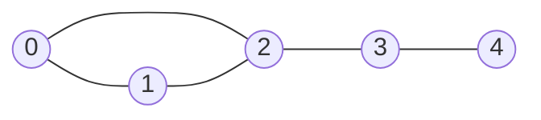
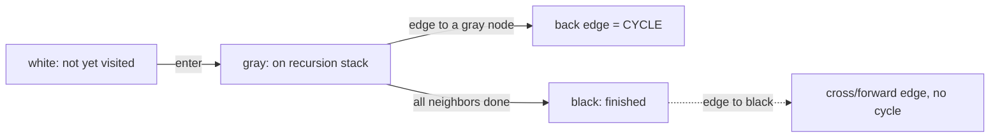
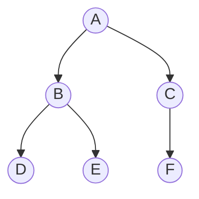
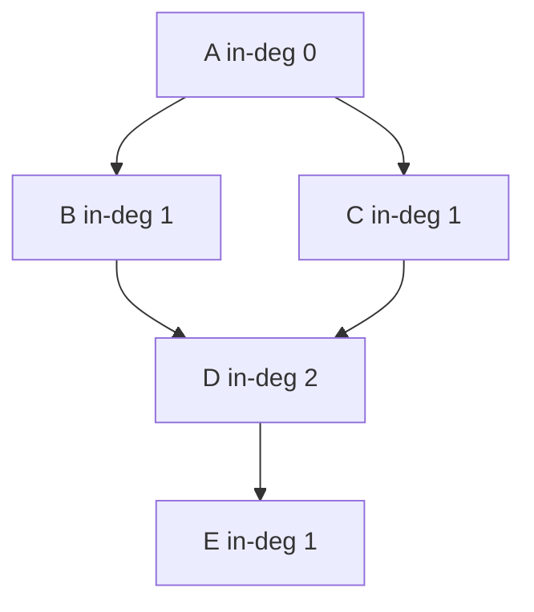
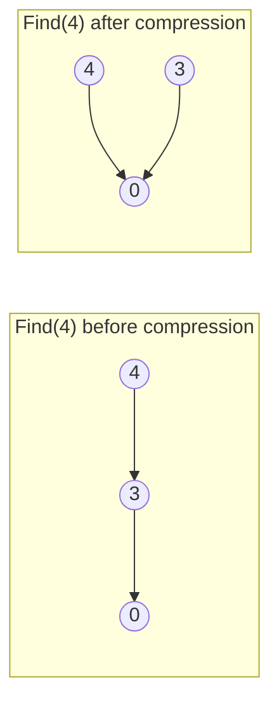
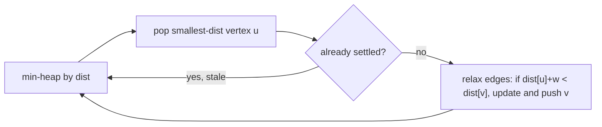
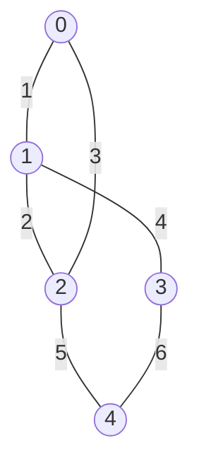
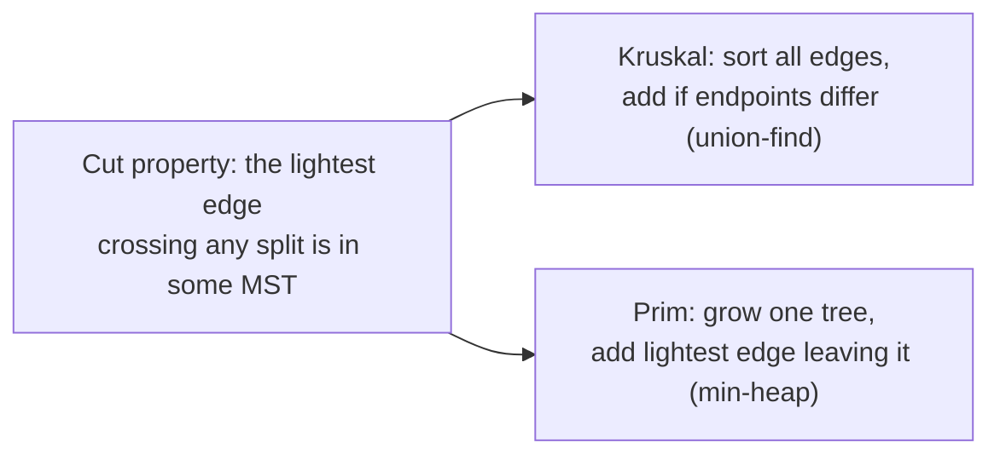
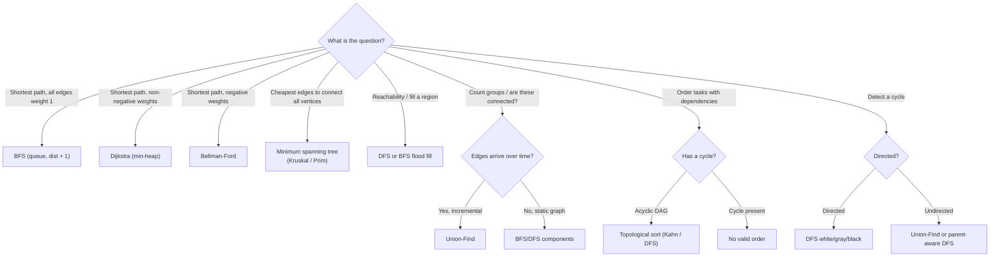

# Graphs (Reviewer)

A [graph](algorithms-glossary-reviewer.md#graph "Vertices connected by edges, modeling arbitrary relationships, possibly cyclic.") is a set of **[vertices](algorithms-glossary-reviewer.md#vertex "A single node in a graph; one of the connected entities.")** (nodes) connected by **[edges](algorithms-glossary-reviewer.md#edge "A connection between two vertices, representing a relationship.")**. It is the most general data
structure in this folder: trees, [linked lists](algorithms-glossary-reviewer.md#linked-list "A chain of nodes each holding a value and a reference to the next node."), and grids are all special cases. Once you can model a
problem as "things and the relationships between them," the same handful of traversals — [BFS](algorithms-glossary-reviewer.md#breadth-first-search "Explores a structure level by level, visiting nearer nodes before farther ones."), [DFS](algorithms-glossary-reviewer.md#depth-first-search "Explores as far down one branch as possible before backtracking."),
[topological sort](algorithms-glossary-reviewer.md#topological-sort "A linear order of a DAG's vertices where every edge points forward."), [union-find](algorithms-glossary-reviewer.md#union-find "Tracks elements in groups with near-O(1) find-group and merge-groups operations."), and [Dijkstra](algorithms-glossary-reviewer.md#dijkstra "Finds shortest paths from a source on non-negative weights via a min-heap.") — solve an enormous fraction of interview and exam
questions. The hard part is rarely the [algorithm](algorithms-glossary-reviewer.md#algorithm "A precise, finite sequence of steps that turns an input into a desired output."); it is **recognizing the graph** hiding inside the
prompt (a grid of cells, a course-prerequisite list, a set of equivalences) and picking the right
traversal.

This reviewer is the practical core: how to represent a graph, how BFS and DFS differ and when each
wins, how to find [connected components](algorithms-glossary-reviewer.md#connected-component "A maximal group of vertices all reachable from one another.") and [flood-fill](algorithms-glossary-reviewer.md#flood-fill "Spreading from a start cell to all connected cells sharing a property.") a grid, how to order a [DAG](algorithms-glossary-reviewer.md#dag "A directed graph with no cycles; the only kind that can be topologically sorted.") and detect [cycles](algorithms-glossary-reviewer.md#cycle "A path that starts and ends at the same vertex without reusing an edge.")
(topological sort), how union-find tracks merging groups in near-constant time, how Dijkstra
extends BFS to weighted edges, and how Kruskal and Prim build a minimum spanning tree. Every
complexity here is stated for the general graph with `V`
vertices and `E` edges, and every code sample is real, compilable .NET 9.

Related: [Algorithm Patterns Index](algorithm-patterns-index-reviewer.md) · [Trees & BSTs](trees-and-binary-search-trees-reviewer.md) · [Heaps & Priority Queues](heaps-and-priority-queues-reviewer.md) · [Backtracking](backtracking-reviewer.md) · [Complexity & Big-O](complexity-and-big-o-reviewer.md) · [Glossary](algorithms-glossary-reviewer.md)

## Contents
- [Representations](#representations)
- [BFS: breadth-first search](#bfs-breadth-first-search)
- [DFS: depth-first search](#dfs-depth-first-search)
- [BFS vs DFS](#bfs-vs-dfs)
- [Connected components and flood fill](#connected-components-and-flood-fill)
- [Grid problems](#grid-problems)
- [Topological sort](#topological-sort)
- [Union-Find (Disjoint Set Union)](#union-find-disjoint-set-union)
- [Dijkstra: shortest paths with weights](#dijkstra-shortest-paths-with-weights)
- [Minimum spanning tree (Kruskal and Prim)](#minimum-spanning-tree-kruskal-and-prim)
- [Clone graph](#clone-graph)
- [Complexity summary](#complexity-summary)
- [Pattern picker](#pattern-picker)
- [Interview Q&A](#interview-qa)
- [Rapid-fire round](#rapid-fire-round)
- [Exam-style questions](#exam-style-questions)
- [30-second takeaway](#30-second-takeaway)
- [Quick recall checklist](#quick-recall-checklist)
- [References](#references)

---

## Representations

Before any algorithm you must decide how the graph lives in memory. The choice drives every
complexity downstream.

Key points:

- **[Adjacency list](algorithms-glossary-reviewer.md#adjacency-list "Graph stored as, for each vertex, the list of vertices it connects to.")** — for each vertex, store a list of its neighbors. Space is **O(V + E)**.
  Iterating a vertex's neighbors is O([degree](algorithms-glossary-reviewer.md#degree-and-in-degree "Degree counts edges touching a vertex; in-degree counts incoming edges.")). This is the default for almost all interview graphs
  because real graphs are **sparse** (`E` much smaller than `V²`).
- **[Adjacency matrix](algorithms-glossary-reviewer.md#adjacency-matrix "Graph stored as a V-by-V grid marking which vertices are connected.")** — a `V × V` boolean (or weight) grid where `m[u][v]` says whether edge `u→v`
  exists. Space is **O(V²)**. Edge lookup is O(1), but iterating a vertex's neighbors is O(V) and the
  matrix wastes space on sparse graphs. Use it only for dense graphs or when you need O(1) edge tests.
- **Implicit grid** — a 2D array of cells where neighbors are the up/down/left/right (and sometimes
  diagonal) cells. There is no explicit edge list; you compute neighbors on the fly from `(r, c)`.
  Most "matrix" [LeetCode](algorithms-glossary-reviewer.md#leetcode "An online platform of coding-interview problems with an automated judge.") problems are graphs in disguise.
- **[Directed vs undirected](algorithms-glossary-reviewer.md#directed-and-undirected "Directed edges have a one-way direction; undirected edges go both ways.")** — in an undirected graph, edge `(u, v)` means you can go both ways, so
  you add `v` to `u`'s list **and** `u` to `v`'s list. In a directed graph you add only `u → v`.
- **Weighted vs unweighted** — an unweighted edge just says "connected"; a [weighted](algorithms-glossary-reviewer.md#weighted-graph "A graph whose edges carry a numeric cost like distance or time.") edge carries a
  cost. BFS finds [shortest paths](algorithms-glossary-reviewer.md#shortest-path "The route between two vertices with the smallest total cost or fewest edges.") only when every edge costs the same (weight 1); weighted graphs need
  Dijkstra or Bellman-Ford.



*An undirected graph drawn as nodes and edges; the adjacency list below encodes exactly the same thing.*

```text
Adjacency list for the graph above (undirected: each edge stored twice)

  0 -> [1, 2]
  1 -> [0, 2]
  2 -> [0, 1, 3]
  3 -> [2, 4]
  4 -> [3]

  Edge count E = 5, stored as 10 directed entries (2E). Space = O(V + E).
```

*Each undirected edge appears in both endpoints' lists — that is why an undirected adjacency list holds `2E` entries.*

```csharp
// Adjacency list as a Dictionary<int, List<int>> built from an edge list.
static Dictionary<int, List<int>> BuildUndirected(int n, int[][] edges)
{
    var adj = new Dictionary<int, List<int>>();
    for (int v = 0; v < n; v++) adj[v] = new List<int>();
    foreach (int[] e in edges)
    {
        adj[e[0]].Add(e[1]);
        adj[e[1]].Add(e[0]); // omit this line for a directed graph
    }
    return adj;
}
```

| Representation | Space | Edge lookup `u–v` | Iterate neighbors of `u` | Best for |
| --- | --- | --- | --- | --- |
| Adjacency list | O(V + E) | O(degree(u)) | O(degree(u)) | Sparse graphs (the default) |
| Adjacency matrix | O(V²) | O(1) | O(V) | Dense graphs, frequent edge tests |
| Implicit grid | O(1) extra | O(1) (compute) | O(1) (4 or 8 dirs) | Matrix/maze problems |

## BFS: breadth-first search

BFS explores the graph in **layers**: all vertices at distance 1 from the source, then all at
distance 2, and so on. It uses a **[FIFO](algorithms-glossary-reviewer.md#queue "A first-in-first-out collection: add at the back, remove from the front.") queue** and a **visited set**. Its signature property: in an
**unweighted** graph it discovers each vertex by a **shortest path** (fewest edges) from the source.

Key points:

- Data structures: a `Queue<T>` of frontier vertices plus a `visited` set (or boolean array).
- **Mark visited when you enqueue, not when you dequeue.** Marking on dequeue lets a vertex enter the
  queue multiple times before it is processed, which can blow up the queue and break the
  shortest-path guarantee's efficiency.
- Time **O(V + E)**: every vertex is enqueued once and every edge is examined once (twice for an
  undirected adjacency list). Space **O(V)** for the queue and visited set.
- Shortest path: track a `dist` value per vertex; a newly discovered neighbor gets
  `dist[neighbor] = dist[current] + 1`. The first time BFS reaches a vertex is via a shortest path.
- **Multi-source BFS**: seed the queue with several sources at distance 0 at once (used by rotting
  oranges and "nearest exit" problems) to compute the distance to the *closest* source.

```text
BFS layers expanding from source S on a grid (. = open cell, # = wall)
Numbers are BFS distance (ring) from S. Frontier grows one ring per step.

  start grid            after BFS fills reachable cells with distance

  S . . #               0 1 2 #
  . # . .        ->     1 # 3 4
  . . . .               2 3 4 5
  # . . .               # 4 5 6

  ring 0: {S}
  ring 1: cells at distance 1  (right of S, below S)
  ring 2: distance 2 ...
  each ring is one Dequeue-the-whole-frontier pass; walls (#) are never enqueued
```

*BFS paints concentric distance rings outward from the source; the queue always holds the current frontier ring.*


*BFS processes the queue front-to-back, so vertices come out in nondecreasing distance order — the source of its shortest-path guarantee.*

```csharp
// BFS shortest path (in edges) from src in an unweighted adjacency list.
static int[] BfsShortest(int n, Dictionary<int, List<int>> adj, int src)
{
    var dist = new int[n];
    Array.Fill(dist, -1);            // -1 == unreached
    var q = new Queue<int>();
    dist[src] = 0;
    q.Enqueue(src);
    while (q.Count > 0)
    {
        int u = q.Dequeue();
        foreach (int v in adj[u])
        {
            if (dist[v] == -1)        // first time we see v -> shortest path
            {
                dist[v] = dist[u] + 1;
                q.Enqueue(v);         // mark-on-enqueue: dist[v] != -1 now
            }
        }
    }
    return dist;
}
```

## DFS: depth-first search

DFS goes **as deep as possible** along one path before [backtracking](algorithms-glossary-reviewer.md#backtracking "Explore all candidates by building one choice at a time and undoing dead ends."). It is naturally [recursive](algorithms-glossary-reviewer.md#recursion "A function solving a problem by calling itself on smaller versions of it.") (the
[call stack](algorithms-glossary-reviewer.md#call-stack "Memory tracking active function calls; each call pushes a frame, popped on return.") is the [stack](algorithms-glossary-reviewer.md#stack "A last-in-first-out collection: you add and remove only at the top.")), but you can also use an explicit `Stack<T>`. DFS does **not** find shortest
paths, but it is the right tool for connectivity, cycle detection, topological ordering, and anything
that wants to fully explore one branch before another.

Key points:

- Recursive DFS uses the call stack; iterative DFS uses an explicit `Stack<T>`. Both are **O(V + E)**
  time and **O(V)** space (recursion depth / stack size; worst case O(V) on a path graph).
- **Visited handling:** mark a vertex visited when you first enter it so you never re-expand it.
- **Cycle detection in a directed graph uses three colors** (states): `white` = unvisited,
  `gray` = on the current recursion stack (being explored), `black` = fully finished. An edge to a
  **gray** vertex is a **back edge** — a cycle. A two-state (visited / not) check is **not** enough
  for directed cycle detection; it cannot tell a back edge from a cross edge to an already-finished
  vertex.
- **Cycle detection in an undirected graph** is simpler: DFS and treat reaching an already-visited
  vertex that is **not the parent** you came from as a cycle. (Union-find does this too — see below.)



*Directed-cycle detection needs three states: an edge into a gray (on-stack) vertex is a back edge and proves a cycle; an edge into a black vertex does not.*

```csharp
// Directed-cycle detection with white/gray/black states.
static bool HasCycle(int n, Dictionary<int, List<int>> adj)
{
    var state = new int[n]; // 0 = white, 1 = gray, 2 = black
    bool Dfs(int u)
    {
        state[u] = 1;                       // gray: now on the stack
        foreach (int v in adj[u])
        {
            if (state[v] == 1) return true; // back edge into a gray node -> cycle
            if (state[v] == 0 && Dfs(v)) return true;
        }
        state[u] = 2;                       // black: finished
        return false;
    }
    for (int u = 0; u < n; u++)
        if (state[u] == 0 && Dfs(u)) return true;
    return false;
}
```

## BFS vs DFS

Same graph, two exploration orders. Picking the wrong one is a common interview misstep.



*One tree-shaped graph; BFS and DFS visit its vertices in different orders.*

```text
Exploration order on the graph above, starting at A:

  BFS (queue, level by level):
    A | B C | D E F          -> A, B, C, D, E, F
    visits all of one depth before going deeper

  DFS (stack / recursion, deep first):
    A -> B -> D (back) -> E (back) -> C -> F
                            -> A, B, D, E, C, F
    dives down B's branch fully before touching C
```

*BFS sweeps level by level (good for shortest paths); DFS plunges down one branch first (good for connectivity and ordering).*

| | BFS | DFS |
| --- | --- | --- |
| Data structure | Queue (FIFO) | Stack / recursion (LIFO) |
| Order | Level by level | Branch by branch |
| Shortest path (unweighted) | **Yes** — first visit is shortest | No |
| Space | O(V) (can be wide: whole frontier) | O(V) (depth of recursion) |
| Typical uses | Shortest path, multi-source, level info | Components, cycles, topo sort, backtracking |
| Time | O(V + E) | O(V + E) |

## Connected components and flood fill

A **connected component** is a maximal set of vertices all reachable from one another. Counting
components, or labeling each vertex with its component, is BFS/DFS run from every not-yet-visited
vertex.

Key points:

- Loop over all vertices; each time you find an unvisited one, run a full BFS/DFS from it — that whole
  traversal is exactly one component. Increment a counter each time you start a fresh traversal.
- Total work is still **O(V + E)** because the outer loop plus all traversals together touch each
  vertex and edge once.
- **Flood fill** is the grid version: from a starting cell, recolor all 4-directionally connected
  cells of the same original color. "Number of islands" is flood fill where each unvisited land cell
  starts a new component.
- Union-find is an alternative for counting components, especially when edges arrive incrementally
  (see below). It maps directly to LC 323 — Number of Connected Components in an Undirected Graph.

```csharp
// Count connected components in an undirected graph with DFS.
static int CountComponents(int n, int[][] edges)
{
    var adj = BuildUndirected(n, edges);
    var visited = new bool[n];
    void Dfs(int u)
    {
        visited[u] = true;
        foreach (int v in adj[u])
            if (!visited[v]) Dfs(v);
    }
    int components = 0;
    for (int u = 0; u < n; u++)
        if (!visited[u]) { components++; Dfs(u); }
    return components;
}
```

## Grid problems

Grids are the most common interview graph. Treat each cell `(r, c)` as a vertex with up to four
neighbors. Two patterns dominate: single-source flood fill and multi-source BFS.

Key points:

- A grid with `R` rows and `C` columns has `V = R*C` cells. Each cell has at most 4 edges, so
  `E = O(R*C)`. BFS/DFS over a grid is therefore **O(R*C)** time and **O(R*C)** space.
- Always **bounds-check** `0 <= nr < R && 0 <= nc < C` before reading a neighbor, and skip walls /
  already-visited cells. A clean way to enumerate the four directions:
  `int[][] dirs = { new[]{1,0}, new[]{-1,0}, new[]{0,1}, new[]{0,-1} };`.
- **Number of islands (LC 200 — Number of Islands):** scan the grid; each unvisited `'1'` starts a
  flood fill that sinks the whole island, and you count one island per flood. Maps to the practice
  folder `depth-first-search/graph-exploration/number-of-islands`.
- **Rotting oranges (LC 994 — Rotting Oranges):** **multi-source BFS** — enqueue every rotten orange
  at minute 0, then expand simultaneously; the answer is the number of BFS layers until no fresh
  orange remains. If a fresh orange is never reached, return `-1`.
- **Pacific Atlantic (LC 417 — Pacific Atlantic Water Flow):** invert the flow. Instead of asking
  which cells flow to an ocean, run a traversal **from each ocean's border inward**, moving to
  neighbors with **height ≥** current (water flows downhill, so reverse search climbs uphill). Cells
  reachable from both oceans' searches are the answer.

```csharp
// LC 200 - Number of Islands via DFS flood fill that sinks land in place.
static int NumIslands(char[][] grid)
{
    int rows = grid.Length, cols = grid[0].Length, count = 0;
    void Sink(int r, int c)
    {
        if (r < 0 || r >= rows || c < 0 || c >= cols || grid[r][c] != '1') return;
        grid[r][c] = '0';                 // mark visited by sinking it
        Sink(r + 1, c); Sink(r - 1, c);
        Sink(r, c + 1); Sink(r, c - 1);
    }
    for (int r = 0; r < rows; r++)
        for (int c = 0; c < cols; c++)
            if (grid[r][c] == '1') { count++; Sink(r, c); }
    return count;
}
```

```csharp
// LC 994 - Rotting Oranges via multi-source BFS. 0 = empty, 1 = fresh, 2 = rotten.
static int OrangesRotting(int[][] grid)
{
    int rows = grid.Length, cols = grid[0].Length, fresh = 0, minutes = 0;
    var q = new Queue<(int r, int c)>();
    for (int r = 0; r < rows; r++)
        for (int c = 0; c < cols; c++)
        {
            if (grid[r][c] == 2) q.Enqueue((r, c)); // all initial sources
            else if (grid[r][c] == 1) fresh++;
        }
    int[][] dirs = { new[] { 1, 0 }, new[] { -1, 0 }, new[] { 0, 1 }, new[] { 0, -1 } };
    while (q.Count > 0 && fresh > 0)
    {
        minutes++;
        for (int i = q.Count; i > 0; i--)    // drain exactly one layer
        {
            var (r, c) = q.Dequeue();
            foreach (int[] d in dirs)
            {
                int nr = r + d[0], nc = c + d[1];
                if (nr >= 0 && nr < rows && nc >= 0 && nc < cols && grid[nr][nc] == 1)
                {
                    grid[nr][nc] = 2;        // rot it
                    fresh--;
                    q.Enqueue((nr, nc));
                }
            }
        }
    }
    return fresh == 0 ? minutes : -1;        // -1 if any fresh orange is unreachable
}
```

## Topological sort

A **topological order** of a directed acyclic graph (DAG) is a linear ordering of vertices such that
every edge `u → v` puts `u` before `v`. It answers "in what order can I do these tasks given their
dependencies?" A valid order exists **iff the graph has no cycle** — that is the whole story behind
course-schedule problems.

Key points:

- **Kahn's algorithm (BFS-based):** compute each vertex's **in-degree** (number of incoming edges).
  Start a queue with all in-degree-0 vertices. Repeatedly dequeue a vertex, append it to the order,
  and decrement each neighbor's in-degree; when a neighbor hits 0, enqueue it. If you output fewer
  than `V` vertices, the graph has a **cycle** (no valid order).
- **DFS-based:** run DFS; when a vertex's recursion fully finishes, **prepend** it (or push to a
  stack). The reversed finish order is a topological order. Use the white/gray/black cycle check to
  reject cyclic input.
- Both are **O(V + E)** time and **O(V)** extra space.
- **LC 207 — Course Schedule** asks only whether a valid order exists (cycle detection → return
  `bool`). **LC 210 — Course Schedule II** asks for the order itself (return the array, or empty if a
  cycle exists).



*A small DAG; Kahn's algorithm peels off in-degree-0 vertices, and the order it removes them is a valid topological order.*

```text
Kahn's algorithm on the DAG above. in[] = in-degrees, Q = ready queue.

  edges: A->B, A->C, B->D, C->D, D->E
  in = {A:0, B:1, C:1, D:2, E:1}

  step  Q (in-deg 0)   pop  output            updates
  ----  -------------  ---  ------            -------------------------
   0    [A]            -    []                seed with in-deg 0
   1    [A]            A    [A]               B:1->0, C:1->0 -> enqueue B,C
   2    [B, C]         B    [A,B]             D:2->1
   3    [C]            C    [A,B,C]           D:1->0 -> enqueue D
   4    [D]            D    [A,B,C,D]         E:1->0 -> enqueue E
   5    [E]            E    [A,B,C,D,E]       done

  output has all 5 vertices -> no cycle; order = A B C D E
```

*Kahn's algorithm: each vertex leaves the queue only after all its prerequisites have, so the pop order is a valid topological order; emitting fewer than V vertices signals a cycle.*

```csharp
// LC 210 - Course Schedule II via Kahn's algorithm. Returns order, or empty on cycle.
static int[] FindOrder(int numCourses, int[][] prerequisites)
{
    var adj = new List<int>[numCourses];
    for (int i = 0; i < numCourses; i++) adj[i] = new List<int>();
    var indeg = new int[numCourses];
    foreach (int[] p in prerequisites) // p = [course, prereq]; edge prereq -> course
    {
        adj[p[1]].Add(p[0]);
        indeg[p[0]]++;
    }
    var q = new Queue<int>();
    for (int i = 0; i < numCourses; i++)
        if (indeg[i] == 0) q.Enqueue(i);
    var order = new List<int>();
    while (q.Count > 0)
    {
        int u = q.Dequeue();
        order.Add(u);
        foreach (int v in adj[u])
            if (--indeg[v] == 0) q.Enqueue(v);
    }
    return order.Count == numCourses ? order.ToArray() : Array.Empty<int>();
}
```

## Union-Find (Disjoint Set Union)

Union-Find (DSU) maintains a partition of elements into disjoint sets and answers two questions fast:
`Find(x)` (which set is `x` in?) and `Union(x, y)` (merge the two sets). It is the go-to structure
for connectivity that **grows over time** — adding edges and asking "are these two now connected?"

Key points:

- Each set is a [tree](algorithms-glossary-reviewer.md#tree "A hierarchy of nodes with one root, no cycles, and one parent per node."); every element points to a `parent`, and the **[root](algorithms-glossary-reviewer.md#root "The single topmost node of a tree, the one with no parent.")** is the set's
  representative. `Find` walks to the root; two elements are in the same set iff they share a root.
- **[Path compression](algorithms-glossary-reviewer.md#path-compression "Union-find optimization that flattens the tree by pointing nodes at the root."):** during `Find`, re-point each visited node directly at the root, flattening the
  tree for future queries.
- **Union by rank/size:** always attach the smaller (or shorter) tree under the larger root, keeping
  trees shallow.
- With **both** optimizations, `Find`/`Union` run in **O(α(n))** [amortized](algorithms-glossary-reviewer.md#amortized-analysis "Average cost per operation across a worst-case sequence, not a probability.") — `α` is the inverse
  Ackermann function, which is ≤ 4 for any practical `n`. This is "near O(1)," **not** literally
  O(1), and not O(log n) (that would be only one optimization).
- Uses: counting connected components (LC 323), detecting a cycle in an **undirected** graph
  (a `Union` whose two endpoints already share a root closes a cycle — LC 684 — Redundant
  Connection), and validating a tree (LC 261 — Graph Valid Tree: exactly `n-1` edges **and** no cycle
  **and** one component).

```text
Union-Find with path compression and union by size.
parent[i] = i means i is its own root. Process edges (0,1),(1,2),(3,4),(2,4).

  init        parent = [0, 1, 2, 3, 4]    (5 singleton sets)

  union(0,1)  roots 0,1 differ -> attach 1 under 0
              parent = [0, 0, 2, 3, 4]    sets: {0,1} {2} {3} {4}

  union(1,2)  find(1)=0, find(2)=2 -> attach 2 under 0
              parent = [0, 0, 0, 3, 4]    sets: {0,1,2} {3} {4}

  union(3,4)  attach 4 under 3
              parent = [0, 0, 0, 3, 3]    sets: {0,1,2} {3,4}

  union(2,4)  find(2)=0, find(4)=3 -> attach 3 under 0
              parent = [0, 0, 0, 0, 3]    sets: {0,1,2,3,4}

  find(4): 4 -> parent 3 -> parent 0 (root).
           path compression re-points 4 directly to 0:
              parent = [0, 0, 0, 0, 0]    next find(4) is one hop
```

*Each union links one root under another; path compression flattens the tree on lookup so later `Find` calls are nearly O(1).*



*Path compression: after one `Find(4)`, every node on the path points straight at the root, so the tree stays flat.*

```csharp
// Disjoint Set Union with path compression and union by size.
sealed class DSU
{
    private readonly int[] _parent;
    private readonly int[] _size;
    public int Count { get; private set; } // number of disjoint sets

    public DSU(int n)
    {
        _parent = new int[n];
        _size = new int[n];
        Count = n;
        for (int i = 0; i < n; i++) { _parent[i] = i; _size[i] = 1; }
    }

    public int Find(int x)
    {
        while (_parent[x] != x)
        {
            _parent[x] = _parent[_parent[x]]; // path halving (compression)
            x = _parent[x];
        }
        return x;
    }

    // Returns false if x and y were already in the same set (would close a cycle).
    public bool Union(int x, int y)
    {
        int rx = Find(x), ry = Find(y);
        if (rx == ry) return false;
        if (_size[rx] < _size[ry]) (rx, ry) = (ry, rx); // attach smaller under larger
        _parent[ry] = rx;
        _size[rx] += _size[ry];
        Count--;
        return true;
    }
}

// LC 684 - Redundant Connection: the first edge that joins two already-connected nodes.
static int[] FindRedundantConnection(int[][] edges)
{
    var dsu = new DSU(edges.Length + 1); // nodes are 1..n
    foreach (int[] e in edges)
        if (!dsu.Union(e[0], e[1])) return e; // both endpoints share a root -> cycle edge
    return Array.Empty<int>();
}
```

## Dijkstra: shortest paths with weights

Dijkstra finds the shortest-path distance from one source to every vertex in a graph with
**non-negative** edge weights. It generalizes BFS: instead of a plain queue, it uses a
**min-[priority queue](algorithms-glossary-reviewer.md#priority-queue "Serves elements by priority rather than arrival; usually a heap.")** keyed by the best-known distance, always expanding the closest unsettled vertex next.

Key points:

- Use a `PriorityQueue<TElement, TPriority>` from `System.Collections.Generic`, where the priority is
  the current distance. Pop the smallest-distance vertex, then **relax** each outgoing edge:
  if `dist[u] + w(u,v) < dist[v]`, update `dist[v]` and push `(v, dist[v])`.
- Once a vertex is popped with its final distance, it is **settled** — Dijkstra never revisits it.
  Because .NET's `PriorityQueue` has no decrease-key, push duplicates and **skip stale pops** (where
  the popped distance is greater than the recorded `dist`).
- Complexity with a [binary heap](algorithms-glossary-reviewer.md#binary-heap "A heap as a complete binary tree packed in an array; children at 2i+1, 2i+2."): **O(E log V)** time (each edge can push once; each pop/push is
  O(log V)), **O(V + E)** space. Some texts write `O((V + E) log V)`; for a connected graph the `E`
  term dominates.
- **Dijkstra requires non-negative weights.** A negative edge can make a "settled" vertex wrong later.
  For negative edges use **Bellman-Ford** (O(V·E), detects negative cycles). For unweighted graphs,
  plain **BFS** is the right tool — Dijkstra would be overkill.
- **LC 743 — Network Delay Time** is textbook Dijkstra: the answer is the maximum of all shortest
  distances from the source (the time for the signal to reach the farthest node), or `-1` if some node
  is unreachable.

```text
Dijkstra from source 0. Edges (directed, weighted):
  0->1 (4), 0->2 (1), 2->1 (2), 1->3 (1), 2->3 (5)

  dist init: [0, inf, inf, inf]   PQ = {(0,d0)}     (pair = (node, dist))

  pop (0,0)  relax 0->1: dist1=4 push(1,4); 0->2: dist2=1 push(2,1)
             dist = [0, 4, 1, inf]   PQ = {(2,1),(1,4)}
  pop (2,1)  relax 2->1: 1+2=3 < 4 -> dist1=3 push(1,3); 2->3: 1+5=6 push(3,6)
             dist = [0, 3, 1, 6]     PQ = {(1,3),(1,4 stale),(3,6)}
  pop (1,3)  relax 1->3: 3+1=4 < 6 -> dist3=4 push(3,4)
             dist = [0, 3, 1, 4]     PQ = {(1,4 stale),(3,4),(3,6 stale)}
  pop (1,4)  stale: 4 > dist1(3) -> skip
  pop (3,4)  relax: no outgoing improves anything
             dist = [0, 3, 1, 4]     PQ = {(3,6 stale)}
  pop (3,6)  stale: 6 > dist3(4) -> skip
  PQ empty -> final dist = [0, 3, 1, 4]
```

*Dijkstra always expands the closest unsettled vertex; relaxing `0→2→1` (cost 3) beats the direct `0→1` (cost 4), and stale heap entries are skipped on pop.*



*Dijkstra's loop: pop the nearest vertex, skip it if a better distance was already finalized, else relax its edges and push improved neighbors.*

```csharp
// LC 743 - Network Delay Time via Dijkstra with PriorityQueue<TElement,TPriority>.
static int NetworkDelayTime(int[][] times, int n, int k)
{
    var adj = new List<(int to, int w)>[n + 1]; // nodes are 1..n
    for (int i = 1; i <= n; i++) adj[i] = new List<(int, int)>();
    foreach (int[] t in times) adj[t[0]].Add((t[1], t[2])); // u, v, weight

    var dist = new int[n + 1];
    Array.Fill(dist, int.MaxValue);
    dist[k] = 0;

    var pq = new PriorityQueue<int, int>(); // element = node, priority = distance
    pq.Enqueue(k, 0);
    while (pq.TryDequeue(out int u, out int d))
    {
        if (d > dist[u]) continue;          // stale entry, already settled better
        foreach (var (v, w) in adj[u])
        {
            int nd = d + w;
            if (nd < dist[v])
            {
                dist[v] = nd;
                pq.Enqueue(v, nd);          // push duplicate; no decrease-key needed
            }
        }
    }

    int ans = 0;
    for (int i = 1; i <= n; i++)
    {
        if (dist[i] == int.MaxValue) return -1; // some node unreachable
        ans = Math.Max(ans, dist[i]);
    }
    return ans;
}
```

## Minimum spanning tree (Kruskal and Prim)

A **[spanning tree](algorithms-glossary-reviewer.md#minimum-spanning-tree "A min-weight set of V-1 edges connecting all vertices of a weighted graph with no cycle.")** of a connected, undirected, weighted graph is a subset of edges that connects all `V`
vertices using exactly `V - 1` edges and no cycle. The **minimum spanning tree (MST)** is the
spanning tree whose total edge weight is smallest — the cheapest way to wire every vertex into one
connected network (laying cable, roads, clustering points). Two [greedy](algorithms-glossary-reviewer.md#greedy "Builds a solution by always taking the locally best choice, correct when that choice is provably globally optimal.") algorithms build it, and
both reuse machinery already in this reviewer: **Kruskal** sorts edges and adds them with union-find;
**Prim** grows one tree outward with a min-heap, exactly like Dijkstra.

Key points:

- **Both are greedy and both are provably correct**, justified by the **[cut property](algorithms-glossary-reviewer.md#minimum-spanning-tree "A min-weight set of V-1 edges connecting all vertices of a weighted graph with no cycle.")**: for any way
  of splitting the vertices into two non-empty sides, the single cheapest edge crossing the split is
  safe to put in some MST. Kruskal and Prim are just two orders of applying that one fact.
- **Kruskal — sort then union.** Sort all `E` edges by weight ascending; walk them cheapest-first and
  add an edge **iff its two endpoints are in different components** (a `Union` that returns true). An
  edge whose endpoints already share a root would close a cycle, so skip it. Stop once you have
  `V - 1` edges. Cost **O(E log E)** for the sort (the union-finds are near-O(1) in total); since
  `log E = O(log V)` this is equivalently written **O(E log V)**.
- **Prim — grow one tree.** Start from any vertex; keep a min-[priority queue](algorithms-glossary-reviewer.md#priority-queue "Serves elements by priority rather than arrival; usually a heap.") of edges that cross from
  the in-tree set to the outside, keyed by weight. Repeatedly pop the lightest crossing edge to a
  vertex **not yet in the tree**, add that vertex, and push its outgoing edges. Skip stale pops (a
  vertex already in the tree) — the same duplicate-and-skip idiom as Dijkstra. Cost **O(E log V)**
  with a binary heap.
- **Kruskal vs Prim.** Kruskal is simplest when edges arrive as a flat list and the graph may be
  sparse or even disconnected (it naturally yields a *minimum spanning forest*). Prim is a touch
  faster on dense graphs and reuses your Dijkstra scaffold almost verbatim. Both return the **same
  total weight** — the MST weight is unique even when more than one tree achieves it.
- **MST is an undirected-graph tool.** A directed graph has no MST in this sense; the analogous
  "minimum arborescence" problem needs a different algorithm (Chu–Liu/Edmonds). Reach for MST only on
  connected, undirected, weighted graphs.



*The weighted graph below; Kruskal and Prim both select MST edges 0–1, 1–2, 1–3, 2–4 for a total weight of 12, rejecting the heavier 0–2 (weight 3) and 3–4 (weight 6) that would only close cycles.*

```csharp
// Kruskal's MST: sort edges by weight, add each with union-find unless it closes a cycle.
// edges[i] = [u, v, w]. Returns the total weight of the minimum spanning tree.
// Reuses the DSU class defined in the Union-Find section above.
static int KruskalMst(int n, int[][] edges)
{
    Array.Sort(edges, (a, b) => a[2] - b[2]);   // lightest edge first
    var dsu = new DSU(n);
    int total = 0, used = 0;
    foreach (int[] e in edges)
    {
        if (dsu.Union(e[0], e[1]))               // endpoints in different trees -> safe edge
        {
            total += e[2];
            if (++used == n - 1) break;          // a tree on n vertices needs exactly n-1 edges
        }
        // else: Union returned false -> endpoints already connected -> this edge would make a cycle
    }
    return total;                                // used < n-1 would mean the graph is disconnected
}
```

```text
Kruskal on 5 vertices (0..4). Edges sorted by weight ascending:
  (0,1):1   (1,2):2   (0,2):3   (1,3):4   (2,4):5   (3,4):6

  edge    w   find(u)  find(v)  decision        MST weight   components after
  -----   -   -------  -------  -------------   ----------   ----------------------
  (0,1)   1      0        1     add  (differ)        1       {0,1} {2} {3} {4}
  (1,2)   2      0        2     add  (differ)        3       {0,1,2} {3} {4}
  (0,2)   3      0        0     skip (cycle)         3       {0,1,2} {3} {4}
  (1,3)   4      0        3     add  (differ)        7       {0,1,2,3} {4}
  (2,4)   5      0        4     add  (differ)       12       {0,1,2,3,4}   <- V-1=4 edges, stop

  MST edges: (0,1) (1,2) (1,3) (2,4)    total = 1 + 2 + 4 + 5 = 12
```

*Kruskal walks edges cheapest-first; an edge is kept only when its endpoints have different union-find roots, so `(0,2)` is rejected because `0` and `2` are already merged through `0–1–2`. Four kept edges (V−1) completes the tree.*

```csharp
// Prim's MST from vertex 0 with a min-PriorityQueue keyed by edge weight.
// adj[u] = list of (neighbor, weight). Returns total weight of the minimum spanning tree.
static int PrimMst(int n, List<(int to, int w)>[] adj)
{
    var inMst = new bool[n];
    var pq = new PriorityQueue<int, int>();      // element = vertex, priority = cheapest crossing edge
    pq.Enqueue(0, 0);
    int total = 0, count = 0;
    while (pq.TryDequeue(out int u, out int w))
    {
        if (inMst[u]) continue;                  // stale: u was already pulled in by a lighter edge
        inMst[u] = true;
        total += w;                              // w is the weight of the edge that attached u
        count++;
        foreach (var (v, nw) in adj[u])
            if (!inMst[v]) pq.Enqueue(v, nw);    // offer each crossing edge; the heap keeps the lightest
    }
    return count == n ? total : -1;              // -1 if the graph was disconnected
}
```

```text
Prim from vertex 0.  key = weight of the cheapest edge that would attach a vertex.
adj: 0:[(1,1),(2,3)]  1:[(0,1),(2,2),(3,4)]  2:[(0,3),(1,2),(4,5)]  3:[(1,4),(4,6)]  4:[(2,5),(3,6)]

  pop (v,w)   action            edge added   push crossing edges        total
  ---------   ---------------   ----------   ------------------------   -----
  (0,0)       add 0 to tree     -            (1,1) (2,3)                  0
  (1,1)       add 1 to tree     0-1  (w 1)   (2,2) (3,4)                  1
  (2,2)       add 2 to tree     1-2  (w 2)   (4,5)                        3
  (2,3)       stale: 2 in tree  -            -                            3
  (3,4)       add 3 to tree     1-3  (w 4)   (4,6)                        7
  (4,5)       add 4 to tree     2-4  (w 5)   -                           12
  (4,6)       stale: 4 in tree  -            -                           12

  MST edges: (0,1) (1,2) (1,3) (2,4)    total = 12
```

*Prim keeps a single growing tree and always pops the lightest edge leaving it; the duplicate `(2,3)` and `(4,6)` entries are skipped on pop because their target is already in the tree — the exact stale-pop trick used in Dijkstra. Same MST, same weight 12.*



*Both algorithms are the cut property applied in two orders: Kruskal considers edges globally cheapest-first across the whole graph; Prim always takes the cheapest edge leaving the single growing tree.*

## Clone graph

Cloning a graph (LC 133 — Clone Graph) deep-copies every [node](algorithms-glossary-reviewer.md#node "A container in a linked structure holding a value plus references to neighbors.") and edge. The trick is a **[hash map](algorithms-glossary-reviewer.md#hash-map "Stores key-value pairs and retrieves a value by key in O(1) average time.")
from original node to its clone**, which both prevents infinite loops on cycles and lets you wire up
neighbor references correctly.

Key points:

- Traverse with BFS or DFS. The map `original → clone` doubles as the visited set: if a node is
  already a key, return its existing clone instead of making a new one.
- Create the clone first, record it in the map, **then** recurse/iterate into neighbors — otherwise a
  cycle revisits the node before it is mapped and you recurse forever.
- Time **O(V + E)** (each node and edge handled once), space **O(V)** for the map plus recursion/queue.

```csharp
// LC 133 - Clone Graph (DFS). Node has int val and List<Node> neighbors.
public class Node
{
    public int val;
    public IList<Node> neighbors;
    public Node(int v) { val = v; neighbors = new List<Node>(); }
}

static Node? CloneGraph(Node? node)
{
    var map = new Dictionary<Node, Node>(); // original -> clone, also the visited set
    Node? Dfs(Node? n)
    {
        if (n is null) return null;
        if (map.TryGetValue(n, out Node? existing)) return existing;
        var copy = new Node(n.val);
        map[n] = copy;                       // record BEFORE recursing into neighbors
        foreach (Node nb in n.neighbors)
            copy.neighbors.Add(Dfs(nb)!);
        return copy;
    }
    return Dfs(node);
}
```

## Complexity summary

`V` = vertices, `E` = edges. All assume an adjacency-list representation unless noted.

| Algorithm | Time | Space | Notes |
| --- | --- | --- | --- |
| BFS / DFS traversal | O(V + E) | O(V) | Visit every vertex and edge once |
| Connected components | O(V + E) | O(V) | One BFS/DFS per component, total still O(V + E) |
| Grid BFS / DFS | O(R·C) | O(R·C) | `V = R·C`, ≤ 4 edges per cell |
| Topological sort (Kahn / DFS) | O(V + E) | O(V) | Detects cycle: output `< V` vertices |
| Union-Find (per op, amortized) | O(α(V)) | O(V) | `α` ≤ 4 in practice; near O(1), not O(log V) |
| Dijkstra (binary heap) | O(E log V) | O(V + E) | Non-negative weights only |
| Bellman-Ford | O(V·E) | O(V) | Handles negative edges; detects negative cycles |
| Kruskal MST | O(E log E) | O(V) | Sort edges + union-find; undirected; same as O(E log V) |
| Prim MST (binary heap) | O(E log V) | O(V + E) | Grow one tree with a min-heap; mirrors Dijkstra |
| Adjacency matrix traversal | O(V²) | O(V²) | Neighbor scan is O(V) per vertex |

## Pattern picker



*Choose the traversal from the question's shape: weights pick BFS vs Dijkstra vs Bellman-Ford; "groups/connected" picks union-find vs component scan; "ordering" picks topological sort.*

## Interview Q&A

### Representations and basics

Q: Adjacency list vs adjacency matrix — when do you use each?
A: Adjacency list (O(V + E) space) for sparse graphs, which is almost always the interview case; it iterates a vertex's neighbors in O(degree). Adjacency matrix (O(V²) space) only for dense graphs or when you need O(1) edge-existence tests, at the cost of O(V) neighbor scans.

Q: How do you store an undirected edge in an adjacency list?
A: Add each endpoint to the other's neighbor list, so edge `(u, v)` appears in both `adj[u]` and `adj[v]`. An undirected adjacency list holds `2E` entries.

Q: Why is a grid a graph?
A: Each cell `(r, c)` is a vertex; its edges go to the (up to four) in-bounds orthogonal neighbors. You never build an explicit edge list — you compute neighbors from the coordinates, an implicit representation.

### BFS / DFS

Q: Why does BFS find shortest paths in an unweighted graph but DFS does not?
A: BFS processes vertices in nondecreasing distance order (the queue is FIFO), so the first time it reaches a vertex is via a minimum-edge path. DFS dives down one branch arbitrarily and may reach a vertex by a long path first.

Q: When should you mark a vertex visited in BFS — on enqueue or on dequeue?
A: On enqueue. Marking on dequeue lets the same vertex be enqueued several times before it is processed, bloating the queue and doing redundant work.

Q: Why does directed-cycle detection need three colors instead of a plain visited set?
A: A plain visited set cannot distinguish a back edge (into a vertex still on the recursion stack — a real cycle) from a cross/forward edge (into a vertex already fully finished — not a cycle). The gray state marks "on the current stack," and an edge into gray is the cycle signal.

Q: How is undirected-cycle detection different?
A: It is simpler: during DFS, reaching an already-visited neighbor that is not the parent you came from means a cycle. You only need to remember the immediate parent, not a stack color.

### Topological sort

Q: What does it mean if a topological sort cannot include all vertices?
A: The graph has a cycle, so no valid ordering exists. In Kahn's algorithm this shows up as the output containing fewer than `V` vertices (some vertices never reach in-degree 0).

Q: Kahn vs DFS for topological sort — any difference in result or cost?
A: Both are O(V + E) and both detect cycles. Kahn (BFS over in-degree-0 vertices) is iterative and naturally yields the order front-to-back; DFS produces the reverse of finish order. They may produce different valid orderings when several exist.

### Union-Find and Dijkstra

Q: What is the real time complexity of union-find?
A: O(α(n)) amortized per operation with both path compression and union by rank/size, where α is the inverse Ackermann function (≤ 4 for any realistic n). That is "near constant," not literally O(1) and not O(log n).

Q: Why does Dijkstra require non-negative edge weights?
A: It finalizes a vertex's distance the moment it is popped from the min-heap, assuming no cheaper path can appear later. A negative edge could later reduce that "settled" distance, breaking the invariant. Use Bellman-Ford for negative edges.

Q: .NET's `PriorityQueue` has no decrease-key — how do you run Dijkstra?
A: Push a new `(vertex, newDistance)` entry whenever you relax an edge, and when you pop a vertex whose stored priority is greater than its recorded `dist`, skip it as stale. This keeps the standard O(E log V) bound.

Q: BFS vs Dijkstra — when is BFS enough?
A: When every edge has the same weight (unweighted graph). BFS is O(V + E) with a plain queue; Dijkstra adds a log factor and a heap you do not need.

### Minimum spanning tree

Q: Kruskal vs Prim — when do you reach for each?
A: Both build the same minimum-weight tree. Kruskal sorts all edges and adds each with union-find unless it closes a cycle — simplest when edges come as a flat list, and it handles disconnected graphs (yielding a minimum spanning *forest*). Prim grows a single tree from a start vertex with a min-heap of crossing edges — a touch faster on dense graphs and structurally identical to Dijkstra. Kruskal is O(E log E), Prim is O(E log V); for `E ≤ V²` those bounds coincide.

Q: Why is a greedy edge choice correct for the MST?
A: The cut property: for any partition of the vertices into two non-empty sides, the lightest edge crossing the cut belongs to some MST. Kruskal applies it globally (cheapest edge overall whose endpoints differ); Prim applies it locally (cheapest edge leaving the growing tree). Greedily taking a safe edge never blocks an optimal completion, so the result is optimal.

Q: How does Dijkstra differ from Prim, given both pop the cheapest thing from a min-heap?
A: The key they minimize differs. Dijkstra keys a vertex by its total distance *from the source* (`dist[u] + w`), building a shortest-path tree. Prim keys a vertex by the weight of the *single edge* attaching it to the tree (`w` alone), building a minimum-weight tree. Same scaffold, different priority — and Prim's "just `w`" is why it tolerates the cut-property argument while Dijkstra needs non-negativity.

## Rapid-fire round

- Default graph representation → **adjacency list, O(V + E) space.**
- Adjacency matrix space → **O(V²).**
- Undirected edge stored as → **two directed entries (in both lists).**
- BFS data structure → **queue (FIFO).**
- DFS data structure → **stack / recursion (LIFO).**
- Shortest path, unweighted → **BFS.**
- Shortest path, non-negative weights → **Dijkstra, O(E log V).**
- Shortest path, negative weights → **Bellman-Ford, O(V·E).**
- BFS/DFS time → **O(V + E).**
- Mark visited in BFS → **on enqueue.**
- Directed cycle detection → **DFS white/gray/black; back edge into gray.**
- Undirected cycle detection → **parent-aware DFS or union-find.**
- Topological sort algorithms → **Kahn (in-degrees) and DFS post-order.**
- Topo sort outputs `< V` vertices → **graph has a cycle.**
- Union-find amortized cost → **O(α(n)), near constant (≤ 4).**
- Union-find optimizations → **path compression + union by rank/size.**
- Count connected components → **BFS/DFS per unvisited vertex, or union-find.**
- Multi-source BFS use → **rotting oranges, nearest-exit.**
- Pacific-Atlantic trick → **search inward from each ocean border.**
- Clone graph trick → **hash map original → clone (also the visited set).**
- Minimum spanning tree, edge list → **Kruskal (sort + union-find), O(E log E).**
- Minimum spanning tree, dense graph → **Prim (min-heap), O(E log V).**
- Why greedy MST is correct → **cut property: lightest edge crossing any cut is safe.**
- Kruskal skips an edge when → **its endpoints already share a union-find root (cycle).**

## Exam-style questions

1. What order does BFS visit, and what are the distances from `0`?

```text
adj (undirected): 0:[1,2]  1:[0,3]  2:[0,3]  3:[1,2,4]  4:[3]
start = 0
```

**Answer:** Visit order `0, 1, 2, 3, 4`. Distances: `dist[0]=0`, `dist[1]=1`, `dist[2]=1`,
`dist[3]=2`, `dist[4]=3`. BFS fills ring by ring; `3` is reached from `1` (or `2`) at distance 2, and
`4` only from `3` at distance 3.

2. Does this directed graph have a cycle?

```text
edges: 0->1, 1->2, 2->0, 3->2
```

**Answer:** Yes. DFS from `0` goes `0 (gray) → 1 (gray) → 2 (gray) → 0`, and `0` is still gray (on the
stack) — that edge `2→0` is a back edge, proving the cycle `0 → 1 → 2 → 0`. Vertex `3` points into the
cycle but is not part of it.

3. Run Kahn's algorithm. Is there a valid course order, and what is it?

```text
numCourses = 4
prerequisites = [[1,0],[2,0],[3,1],[3,2]]   // [course, prereq]
```

**Answer:** Edges (prereq → course): `0→1, 0→2, 1→3, 2→3`. In-degrees: `0:0, 1:1, 2:1, 3:2`. Kahn
starts with `[0]`, pops `0` (in-deg of `1`,`2` → 0, enqueue both), pops `1` (in-deg of `3` → 1), pops
`2` (in-deg of `3` → 0, enqueue), pops `3`. Output `[0, 1, 2, 3]` has all 4 vertices → valid order
exists. (`[0, 2, 1, 3]` is also valid.)

4. Trace union-find on these edges. How many components remain, and which edge is redundant?

```text
n = 4 nodes (0..3), edges processed in order: (0,1), (1,2), (0,2), (2,3)
```

**Answer:** `(0,1)` merges → {0,1}; `(1,2)` merges → {0,1,2}; `(0,2)` — `find(0)==find(2)` already, so
this is the **redundant** edge that closes a cycle; `(2,3)` merges → {0,1,2,3}. After all edges there
is **1 component**. (For LC 684, the redundant connection is `(0,2)`.)

5. Compute the shortest distances from source `A` with Dijkstra.

```text
directed weighted edges:
  A->B (1), A->C (5), B->C (2), B->D (6), C->D (1)
```

**Answer:** `dist[A]=0`. Pop `A`: relax `B=1`, `C=5`. Pop `B` (dist 1): relax `C` to `1+2=3` (beats
5), `D` to `1+6=7`. Pop `C` (dist 3): relax `D` to `3+1=4` (beats 7). Pop `D` (dist 4). Final:
`A=0, B=1, C=3, D=4`. The path to `D` is `A→B→C→D` (cost 4), not the direct-looking `A→B→D` (cost 7).

6. Run Kruskal's algorithm. What edges form the MST and what is its total weight?

```text
n = 4 nodes (0..3), undirected weighted edges:
  (0,1):1, (1,2):2, (2,3):3, (0,2):4, (1,3):5
```

**Answer:** Sort by weight: `(0,1)1, (1,2)2, (2,3)3, (0,2)4, (1,3)5`. Add `(0,1)` → {0,1}; add `(1,2)`
→ {0,1,2}; add `(2,3)` → {0,1,2,3}. That is `V−1 = 3` edges, so stop — `(0,2)` and `(1,3)` are never
needed (both would close a cycle: their endpoints already share a root). **MST = {(0,1), (1,2),
(2,3)}, total weight `1 + 2 + 3 = 6`.** Prim from any start gives the same tree and weight.

## 30-second takeaway

> Model the problem as vertices and edges, then pick the traversal by the question. **BFS** (queue,
> mark-on-enqueue) gives shortest paths in **unweighted** graphs and powers multi-source grid
> problems; **DFS** (recursion/stack) handles connectivity, flood fill, and ordering, and detects
> directed cycles with white/gray/black states. **Topological sort** (Kahn's in-degree queue or DFS
> post-order) orders a DAG and flags a cycle when it can't include all `V` vertices. **Union-Find**
> tracks merging groups in near-O(α) time — ideal for incremental connectivity and undirected cycle
> detection. **Dijkstra** (min-heap, skip stale pops) extends BFS to non-negative weights at
> O(E log V); negatives need Bellman-Ford. **Kruskal/Prim** build a minimum spanning tree greedily —
> sort edges + union-find, or grow one tree with a min-heap — both at O(E log V), justified by the cut
> property. Almost every plain traversal is **O(V + E)**.

## Quick recall checklist

- **Representation:** adjacency list O(V + E) is the default; matrix O(V²) for dense / O(1) edge
  tests; grids are implicit graphs with ≤ 4 neighbors per cell.
- **BFS:** queue, **mark visited on enqueue**, gives **shortest path in unweighted** graphs, O(V + E)
  / O(V). Multi-source: seed many starts at distance 0.
- **DFS:** recursion or stack, O(V + E) / O(V). **Directed cycle = back edge into a gray** vertex
  (white/gray/black). Undirected cycle = visited non-parent neighbor.
- **Components / flood fill:** one BFS/DFS per unvisited vertex; total O(V + E). LC 200, LC 323.
- **Topological sort:** Kahn (in-degree-0 queue) or DFS post-order; **fewer than V outputs ⇒ cycle ⇒
  no order**. LC 207 / LC 210.
- **Union-Find:** path compression + union by rank/size ⇒ **O(α(n)) ≈ O(1)** amortized (not O(log n)).
  LC 323, LC 684, LC 261.
- **Dijkstra:** min-heap, **non-negative weights only**, O(E log V); push duplicates and skip stale
  pops (no decrease-key in .NET `PriorityQueue`). LC 743.
- **Negatives ⇒ Bellman-Ford** (O(V·E), detects negative cycles). **Unweighted ⇒ BFS**, not Dijkstra.
- **MST (undirected, weighted):** **Kruskal** (sort edges + union-find, skip cycle-closing edges) or
  **Prim** (grow one tree with a min-heap); both **O(E log V)** by the **cut property**, stop at V−1 edges.
- **Clone graph (LC 133):** hash map original → clone doubles as the visited set; record the clone
  before recursing into neighbors.
- Practice: `depth-first-search/graph-exploration/number-of-islands` and
  `breadth-first-search/shortest-path/word-ladder` (LC 127 — Word Ladder is BFS over word states).

## References

- Wikipedia — [Breadth-first search](https://en.wikipedia.org/wiki/Breadth-first_search).
- Wikipedia — [Depth-first search](https://en.wikipedia.org/wiki/Depth-first_search).
- Wikipedia — [Topological sorting](https://en.wikipedia.org/wiki/Topological_sorting).
- Wikipedia — [Disjoint-set data structure](https://en.wikipedia.org/wiki/Disjoint-set_data_structure).
- Wikipedia — [Dijkstra's algorithm](https://en.wikipedia.org/wiki/Dijkstra%27s_algorithm).
- Wikipedia — [Bellman–Ford algorithm](https://en.wikipedia.org/wiki/Bellman%E2%80%93Ford_algorithm).
- Wikipedia — [Minimum spanning tree](https://en.wikipedia.org/wiki/Minimum_spanning_tree).
- Wikipedia — [Kruskal's algorithm](https://en.wikipedia.org/wiki/Kruskal%27s_algorithm).
- Wikipedia — [Prim's algorithm](https://en.wikipedia.org/wiki/Prim%27s_algorithm).
- cp-algorithms — [Breadth-first search](https://cp-algorithms.com/graph/breadth-first-search.html).
- cp-algorithms — [Minimum spanning tree - Kruskal](https://cp-algorithms.com/graph/mst_kruskal.html).
- cp-algorithms — [Minimum spanning tree - Prim](https://cp-algorithms.com/graph/mst_prim.html).
- cp-algorithms — [Depth First Search](https://cp-algorithms.com/graph/depth-first-search.html).
- cp-algorithms — [Disjoint Set Union](https://cp-algorithms.com/data_structures/disjoint_set_union.html).
- cp-algorithms — [Dijkstra's algorithm](https://cp-algorithms.com/graph/dijkstra.html).
- Microsoft Learn — [`PriorityQueue<TElement,TPriority>` Class](https://learn.microsoft.com/en-us/dotnet/api/system.collections.generic.priorityqueue-2).
- Microsoft Learn — [`Queue<T>` Class](https://learn.microsoft.com/en-us/dotnet/api/system.collections.generic.queue-1).
- .NET collection Big-O — [Collections & Big-O reviewer](../dotnet/csharp/collections-and-big-o-reviewer.md).
- NeetCode roadmap — [neetcode.io/roadmap](https://neetcode.io/roadmap).
- LeetCode study plans — [leetcode.com/studyplan](https://leetcode.com/studyplan/).
