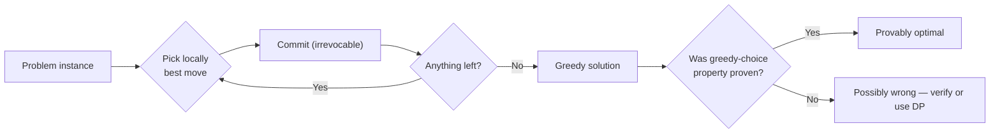
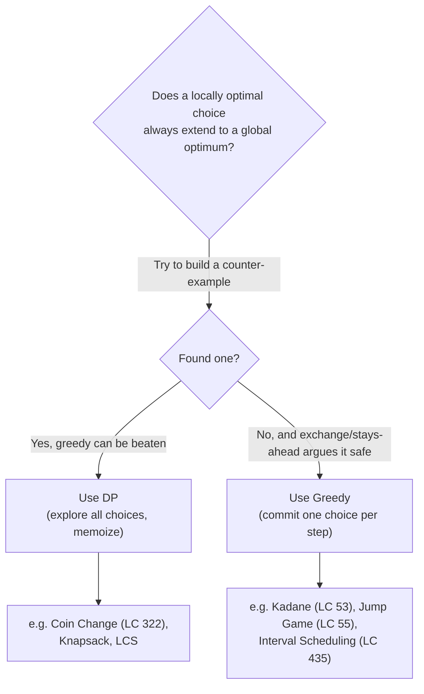
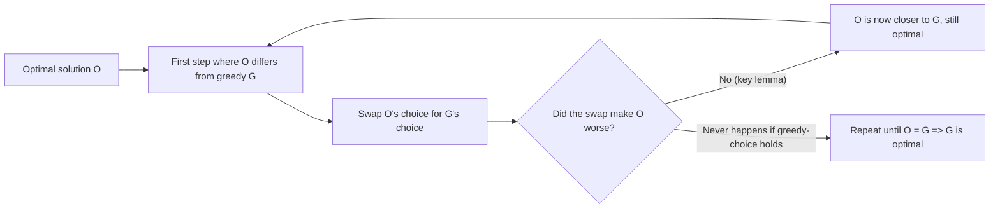
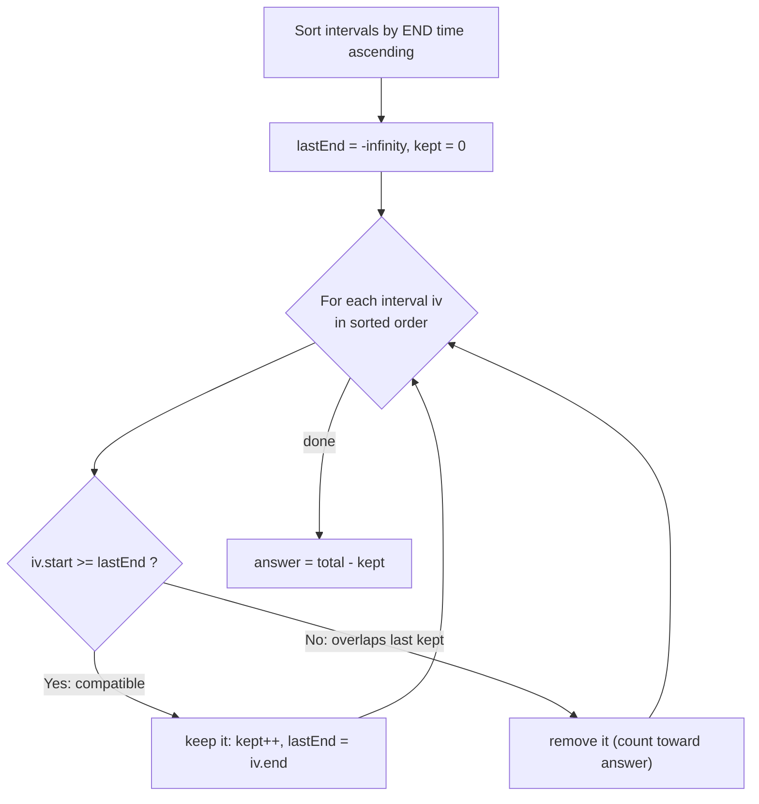
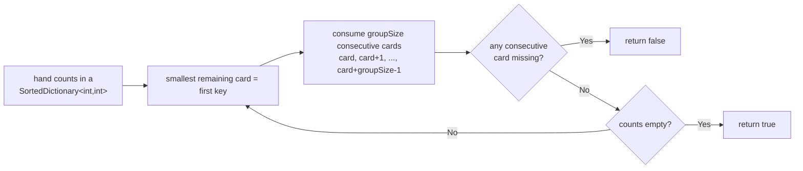

# Greedy Algorithms (Reviewer)

A **[greedy algorithm](algorithms-glossary-reviewer.md#greedy "Always take the choice that looks best right now, never reconsidering.")** builds a solution one step at a time, and at every step it makes the choice
that looks best **right now** — the locally optimal, *irrevocable* move — without ever reconsidering.
The whole bet is that a sequence of locally optimal choices lands on a globally optimal answer. When
that bet pays off the result is a strikingly simple, often single-pass, [linear-time](algorithms-glossary-reviewer.md#linear-time "Work grows in direct proportion to input size, about one unit per element.") [algorithm](algorithms-glossary-reviewer.md#algorithm "A precise, finite sequence of steps that turns an input into a desired output."). When
it doesn't, greedy quietly returns a wrong answer that *looks* plausible, which is exactly why
interviewers love it: the hard part isn't coding the loop, it's **knowing whether greedy is even
valid** for the problem in front of you.

Greedy lives next door to **[dynamic programming](algorithms-glossary-reviewer.md#dynamic-programming "Solving problems with overlapping subproblems by computing each once and reusing it.")**. Both exploit *[optimal substructure](algorithms-glossary-reviewer.md#optimal-substructure "An optimal solution can be built from optimal solutions to its subproblems.")* (an optimal
solution contains optimal solutions to subproblems). The difference is that DP explores *all* relevant
subproblem choices and combines them, whereas greedy commits to *one* choice per step and never looks
back. So greedy is correct only when an extra property holds — the **[greedy-choice property](algorithms-glossary-reviewer.md#greedy-choice-property "When the locally optimal choice each step leads to a global optimum.")** — and a
huge part of interview/exam skill is recognizing that property (or its absence) fast. This reviewer
covers the canonical greedy problems ([Kadane](algorithms-glossary-reviewer.md#kadanes-algorithm "Finds the maximum-sum contiguous subarray in O(n) via one-pass DP."), jump games, interval scheduling, gas station,
heap-driven greedy) and, just as importantly, the classic place greedy *fails* (coin change with
arbitrary denominations) so you can tell the two regimes apart on sight.

Related: [Algorithm Patterns Index](algorithm-patterns-index-reviewer.md) · [Dynamic Programming](dynamic-programming-reviewer.md) · [Intervals](intervals-reviewer.md) · [Heaps & Priority Queues](heaps-and-priority-queues-reviewer.md) · [Sorting Algorithms](sorting-algorithms-reviewer.md) · [Glossary](algorithms-glossary-reviewer.md)

## Contents
- [What greedy is](#what-greedy-is)
- [Greedy vs DP: how to tell them apart](#greedy-vs-dp-how-to-tell-them-apart)
- [When greedy fails: coin change](#when-greedy-fails-coin-change)
- [Proof techniques: exchange argument and staying ahead](#proof-techniques-exchange-argument-and-staying-ahead)
- [Sorting as the greedy setup step](#sorting-as-the-greedy-setup-step)
- [Kadane: maximum subarray](#kadane-maximum-subarray)
- [Jump Game (reachability)](#jump-game-reachability)
- [Jump Game II (min jumps, BFS-like levels)](#jump-game-ii-min-jumps-bfs-like-levels)
- [Interval scheduling (sort by end time)](#interval-scheduling-sort-by-end-time)
- [Gas station (single pass)](#gas-station-single-pass)
- [Greedy with a heap](#greedy-with-a-heap)
- [Complexity cheat-sheet](#complexity-cheat-sheet)
- [Interview Q&A](#interview-qa)
- [Rapid-fire round](#rapid-fire-round)
- [Exam-style questions](#exam-style-questions)
- [30-second takeaway](#30-second-takeaway)
- [Quick recall checklist](#quick-recall-checklist)
- [References](#references)

---

## What greedy is

A greedy algorithm constructs an answer through a sequence of **irrevocable, locally optimal choices**.
At each step it picks the option that maximizes (or minimizes) some immediate criterion and moves on —
it never backtracks, never reconsiders, never keeps alternatives around.

Key points:

- Two properties must both hold for greedy to be *correct*:
  - **Greedy-choice property** — a globally optimal solution can be reached by making the locally
    optimal choice at each step. There exists an optimal solution that *agrees* with the greedy first
    move.
  - **Optimal substructure** — after you commit to the greedy choice, what remains is a smaller
    instance of the *same* problem, and an optimal solution to the whole contains an optimal solution
    to that remainder.
- Greedy differs from **[brute force](algorithms-glossary-reviewer.md#brute-force "Trying every possibility directly; correct but often too slow.") / [backtracking](algorithms-glossary-reviewer.md#backtracking "Explore all candidates by building one choice at a time and undoing dead ends.")** (which tries all choices) and from **DP** (which
  tries all *relevant* choices but memoizes overlap): greedy tries exactly **one** choice per step.
- The payoff is usually a **single linear or `O(n log n)` pass** with `O(1)` extra state — dramatically
  cheaper than the DP table the same problem might otherwise need.
- The danger is silent wrongness. A greedy that lacks the greedy-choice property still runs and still
  returns *an* answer — just not the optimal one. You must **justify** greedy, not just feel it.
- Common greedy criteria: earliest finish time, smallest/largest element, highest ratio
  (value/weight), nearest deadline, current furthest reach.



*Greedy is one tight loop of commit-and-advance; the real work is proving the loop's choice is safe.*

## Greedy vs DP: how to tell them apart

This is the single most testable idea in the topic. Both patterns rely on optimal substructure; the
fork is whether you can prove the **greedy-choice property**.

Key points:

- **DP** is needed when the best choice at a step **depends on the results of future subproblems** you
  can't yet evaluate, so you must consider *multiple* choices and combine them (e.g. coin change,
  longest common [subsequence](algorithms-glossary-reviewer.md#subarray-subsequence-and-substring "Subarray/substring is a contiguous slice; subsequence keeps order but may skip."), knapsack with capacity limits).
- **Greedy** suffices when a *single* choice — justified by an [exchange](algorithms-glossary-reviewer.md#exchange-argument "Proving greedy is optimal by swapping any optimum into the greedy choice safely.") or stays-ahead argument — is
  always safe, so you never need to compare alternatives across the whole table.
- A fast litmus test: **try to construct a small counter-example** where the greedy choice is forced
  but a different early choice would have won. If you find one, greedy is invalid and you reach for DP.
  If you genuinely can't (and you can sketch an exchange argument), greedy is likely sound.
- Greedy is usually **`O(n)` or `O(n log n)`** with `O(1)`–`O(n)` space. DP is typically
  **`O(n·states)`** time with a table of comparable size. If greedy works, it is the cheaper tool.
- Many problems are greedy *because* of a clever sort; the sort encodes the safe ordering of choices.



*If you can beat the greedy choice with a hand-built example, the problem is DP; if you can't and an exchange argument holds, it's greedy.*

## When greedy fails: coin change

The textbook cautionary tale. "Always take the largest coin that fits" is correct for *canonical*
currency systems (like US coins) but **wrong for arbitrary denominations** — and LC 322 uses arbitrary
denominations on purpose.

Key points:

- For denominations `[1, 3, 4]` making amount `6`, the greedy "take biggest first" yields
  `4 + 1 + 1 = 3` coins. The optimal is `3 + 3 = 2` coins. Greedy overshoots and can't recover because
  its choice is irrevocable.
- Greedy coin change *is* optimal only for **canonical coin systems** (a property that itself must be
  proven for the specific denomination set) — you cannot assume it in general, and LC 322 never
  guarantees it.
- The fix is **DP**: `dp[a]` = fewest coins to make amount `a`, with
  `dp[a] = 1 + min over coins c of dp[a - c]`. This explores *every* coin at each amount instead of
  committing to one.
- Recognizing this failure pattern — "the locally biggest choice strands me from the global optimum" —
  is precisely the greedy-vs-DP skill. This problem pairs directly with the DP reviewer; the practice
  repo keeps both sides under `dynamic-programming/coin-change`.

```text
Make amount = 6 using coins {1, 3, 4}

number line:   0   1   2   3   4   5   6
                                       ^ target

GREEDY (take largest coin <= remaining):
  remaining 6 -> take 4  ->  [####..]    remaining 2
  remaining 2 -> take 1  ->                remaining 1
  remaining 1 -> take 1  ->                remaining 0
  coins used: 4 + 1 + 1   = 3 coins   (NOT optimal)

OPTIMAL (DP explores both 3 and 4 at amount 6):
  remaining 6 -> take 3  ->                remaining 3
  remaining 3 -> take 3  ->                remaining 0
  coins used: 3 + 3       = 2 coins   <- minimum

Greedy's first move (4) was locally best but globally strands it.
```

*Greedy commits to the 4 and can never undo it; DP keeps the option of two 3s open and wins.*

```csharp
// DP — correct for ANY denomination set. O(amount * coins) time, O(amount) space.
static int CoinChange(int[] coins, int amount)
{
    int[] dp = new int[amount + 1];
    Array.Fill(dp, amount + 1);          // "infinity" sentinel
    dp[0] = 0;
    for (int a = 1; a <= amount; a++)
        foreach (int c in coins)
            if (c <= a)
                dp[a] = Math.Min(dp[a], dp[a - c] + 1);
    return dp[amount] > amount ? -1 : dp[amount];   // -1 if unreachable
}
```

## Proof techniques: exchange argument and staying ahead

You will rarely write a formal proof in an interview, but being able to *sketch* why greedy is safe is
what separates a guess from an answer. Two standard arguments cover almost every greedy problem.

Key points:

- **Exchange argument.** Take any optimal solution `O` that differs from the greedy solution `G`. Find
  the first place they diverge and show you can **swap** `O`'s choice for `G`'s choice **without making
  `O` worse**. Repeating the swaps morphs `O` into `G`, so `G` is at least as good as optimal — hence
  optimal. This is the workhorse for interval scheduling and most sorting-based greedies.
- **Greedy stays ahead.** Define a measure of partial progress and prove by induction that after each
  step greedy's measure is **at least as good** as any other algorithm's after the same number of
  steps. If greedy is never behind, it can't lose at the end. This fits Jump Game II (greedy reaches at
  least as far after `k` jumps as any strategy).
- Both arguments hinge on the **greedy-choice property**: the locally optimal move is part of *some*
  global optimum. If you can't argue that, suspect DP.
- A practical interview move: state which argument you'd use ("sort by end time, then an exchange
  argument shows swapping in the earliest-finishing job never reduces how many fit") even if you don't
  write every line.



*An exchange argument repeatedly rewrites any optimal solution into the greedy one, proving greedy matches the optimum.*

## Sorting as the greedy setup step

A large fraction of greedy algorithms are "sort, then sweep." The sort encodes the order in which the
locally optimal choice becomes *safe* to take.

Key points:

- Choosing the **right sort key** is the entire algorithm: by end time (interval scheduling), by start
  time (merge intervals), by ratio value/weight (fractional knapsack), by deadline (job sequencing).
- The dominant cost becomes the sort: **`O(n log n)`** time. The greedy sweep itself is `O(n)`.
- Sorting needs **`O(log n)` to `O(n)`** [auxiliary space](algorithms-glossary-reviewer.md#auxiliary-space "Extra memory beyond the input, including temporaries and the call stack.") depending on the algorithm; .NET's
  `Array.Sort` is an **[introsort](algorithms-glossary-reviewer.md#introsort "Hybrid sort: quicksort that falls back to heap sort to guarantee O(n log n).")** (quicksort → heapsort fallback), [in-place](algorithms-glossary-reviewer.md#in-place "Transforms its input using only O(1) extra memory, rearranging in place.") and unstable, `O(n log n)`
  average and [worst case](algorithms-glossary-reviewer.md#best-average-and-worst-case "How an algorithm's cost varies across the luckiest, typical, and hardest inputs."). `OrderBy` (LINQ) is a **[stable](algorithms-glossary-reviewer.md#stable-sort "A sort that preserves the relative order of elements comparing equal.")** sort but allocates a new sequence.
- After sorting, the greedy [invariant](algorithms-glossary-reviewer.md#invariant "A condition that stays true at every step, used to prove correctness.") ("the next compatible item is always safe to take") is what an
  exchange argument certifies. See [Intervals](intervals-reviewer.md) for the interval family, and the
  [Sorting Algorithms](sorting-algorithms-reviewer.md) reviewer for the sort internals, stability, and
  the `O(n log n)` [comparison-sort](algorithms-glossary-reviewer.md#comparison-sort "A sort that orders elements only by comparing pairs; floor is O(n log n).") lower bound.

```csharp
// Two common greedy sort keys. Both run in O(n log n).
intervals.Sort((a, b) => a.End.CompareTo(b.End));     // earliest finish first (scheduling)
items.Sort((a, b) => (b.Value / (double)b.Weight)     // best value-per-weight first
                     .CompareTo(a.Value / (double)a.Weight));
```

## Kadane: maximum subarray

LC 53 — Maximum Subarray. Find the contiguous subarray with the largest sum. Kadane's algorithm is the
classic **greedy/DP hybrid**: a one-line DP [recurrence](algorithms-glossary-reviewer.md#recurrence-relation "An algorithm's running time expressed in terms of its cost on smaller inputs.") that *looks* greedy because it carries only a
single running value.

Key points:

- Maintain `cur` = the best subarray sum **ending at the current index**, and `best` = the best seen
  anywhere. The recurrence is `cur = max(nums[i], cur + nums[i])`.
- The greedy insight: if the running sum `cur` ever goes **negative**, drop it — `max(nums[i], cur +
  nums[i])` picks `nums[i]` alone, which is the same as *resetting* the running sum to start fresh at
  `i`. A negative prefix can never help a future subarray.
- Initialize `best = cur = nums[0]` (handles all-negative [arrays](algorithms-glossary-reviewer.md#array "A fixed-size contiguous block of same-type elements accessed by position in O(1).") correctly; the answer is the largest
  single element). Do **not** initialize `best = 0` — that breaks on `[-3, -1, -2]` (would wrongly
  return `0`).
- **Time `O(n)`, space `O(1)`** — a single pass, no extra structure.
- It's a DP in disguise: `dp[i] = max(nums[i], dp[i-1] + nums[i])` with the table collapsed to one
  variable. Calling it "greedy" is fine because each step makes one local keep-or-reset decision.

```text
nums = [-2, 1, -3, 4, -1, 2, 1, -5, 4]
index    0   1   2   3   4   5   6   7   8

step  nums[i]   cur = max(nums[i], cur+nums[i])      best
 i=0    -2      cur = -2                  (init)       -2
 i=1     1      max( 1,  -2+1=-1) =  1   <- reset       1
 i=2    -3      max(-3,   1-3=-2) = -2                  1
 i=3     4      max( 4,  -2+4= 2) =  4   <- reset       4
 i=4    -1      max(-1,   4-1= 3) =  3                  4
 i=5     2      max( 2,   3+2= 5) =  5                  5
 i=6     1      max( 1,   5+1= 6) =  6                  6   <- max so far
 i=7    -5      max(-5,   6-5= 1) =  1                  6
 i=8     4      max( 4,   1+4= 5) =  5                  6

answer = best = 6   (subarray [4, -1, 2, 1])
```

*Whenever the running prefix would drag `nums[i]` down (cur goes non-positive), Kadane resets and starts a fresh subarray at i; `best` records the high-water mark.*

```csharp
// LC 53 — Maximum Subarray. O(n) time, O(1) space.
static int MaxSubArray(int[] nums)
{
    int best = nums[0], cur = nums[0];
    for (int i = 1; i < nums.Length; i++)
    {
        cur = Math.Max(nums[i], cur + nums[i]);   // extend, or restart at nums[i]
        best = Math.Max(best, cur);
    }
    return best;
}
```

## Jump Game (reachability)

LC 55 — Jump Game. Each `nums[i]` is the **maximum** jump length from [index](algorithms-glossary-reviewer.md#index "The integer position of an element; 0-indexed starts at 0, 1-indexed at 1.") `i`. Return whether you can
reach the last index. The greedy choice tracks the **furthest reachable index** in one left-to-right
pass.

Key points:

- Maintain `farthest` = the rightmost index reachable so far. At index `i`, if `i > farthest` you are
  stranded — return `false`. Otherwise update `farthest = max(farthest, i + nums[i])`.
- The greedy-choice property: you never need to know *which* jumps got you to `i`, only that `i` is
  reachable; the furthest reach is a sufficient summary of all past choices (stays-ahead).
- **Time `O(n)`, space `O(1)`.** No DP table needed — the naive DP `reach[i]` is `O(n^2)` and
  unnecessary.
- A common variant tracks reachability backwards (from the goal), but the forward furthest-reach sweep
  is the cleanest. A zero at `nums[i]` only blocks you if it sits *at* the current furthest reach.

```text
nums = [2, 3, 1, 1, 4]      goal index = 4
index   0  1  2  3  4

 i=0  farthest=0  0<=0 ok   farthest=max(0, 0+2)=2     [reach 0..2]
 i=1  farthest=2  1<=2 ok   farthest=max(2, 1+3)=4     [reach 0..4]
 i=2  farthest=4  2<=4 ok   farthest=max(4, 2+1)=4
 i=3  farthest=4  3<=4 ok   farthest=max(4, 3+1)=4
 i=4  farthest=4  4<=4 ok   reached goal (4)            -> TRUE

Contrast nums = [3, 2, 1, 0, 4]:
 i=0 farthest=3 ; i=1 farthest=3 ; i=2 farthest=3 ; i=3 farthest=3
 i=4  4 > farthest(3)  -> stranded at the 0  -> FALSE
```

*The furthest-reachable index only grows; you fail the moment the current index outruns it (the `0` at index 3 caps reach at 3 in the second array).*

```csharp
// LC 55 — Jump Game. O(n) time, O(1) space.
static bool CanJump(int[] nums)
{
    int farthest = 0;
    for (int i = 0; i < nums.Length; i++)
    {
        if (i > farthest) return false;          // can't even reach i
        farthest = Math.Max(farthest, i + nums[i]);
    }
    return true;                                  // last index reachable
}
```

## Jump Game II (min jumps, BFS-like levels)

LC 45 — Jump Game II. Same array semantics, but now return the **minimum number of jumps** to reach the
last index (the input guarantees the last index is reachable). The greedy treats each jump as one
**[BFS](algorithms-glossary-reviewer.md#breadth-first-search "Explores a structure level by level, visiting nearer nodes before farther ones.") level**: from everything reachable in `k` jumps, how far can you get in `k+1`?

Key points:

- Keep `curEnd` = the boundary of the current jump's reach, and `farthest` = the furthest any index in
  the current level can reach. When `i` hits `curEnd`, you must spend a jump: `jumps++` and advance
  `curEnd = farthest`.
- This is **implicit BFS**: each "level" is the set of indices reachable with the same jump count.
  Greedy stays ahead because the furthest reach after `k` jumps dominates any other strategy's reach
  after `k` jumps.
- Loop to `i < n - 1` (not `i < n`): standing on the last index requires no further jump, and the guard
  avoids an extra phantom increment.
- **Time `O(n)`, space `O(1)`** — far better than the `O(n^2)` DP that fills `minJumps[i]` for every
  index.

```text
nums = [2, 3, 1, 1, 4]      jumps = 0, curEnd = 0, farthest = 0
index   0  1  2  3  4        loop i = 0 .. n-2 = 0 .. 3

 i=0  farthest=max(0,0+2)=2   i==curEnd(0) -> jumps=1, curEnd=2   [level 1 covers 1..2]
 i=1  farthest=max(2,1+3)=4   i<curEnd
 i=2  farthest=max(4,2+1)=4   i==curEnd(2) -> jumps=2, curEnd=4   [level 2 reaches 4]
 i=3  farthest=max(4,3+1)=4   i<curEnd
 (loop ends at i=3; index 4 is the goal, already within curEnd)

answer = jumps = 2     path 0 ->(jump) 1 ->(jump) 4
```

*Each time `i` reaches the current level boundary `curEnd`, greedy spends one jump and extends the boundary to the furthest the whole level could reach — the same expansion BFS would do.*

```csharp
// LC 45 — Jump Game II. O(n) time, O(1) space.
static int Jump(int[] nums)
{
    int jumps = 0, curEnd = 0, farthest = 0;
    for (int i = 0; i < nums.Length - 1; i++)     // last index needs no jump from it
    {
        farthest = Math.Max(farthest, i + nums[i]);
        if (i == curEnd)                          // exhausted current jump's range
        {
            jumps++;
            curEnd = farthest;                    // next BFS level boundary
        }
    }
    return jumps;
}
```

## Interval scheduling (sort by end time)

LC 435 — Non-overlapping Intervals. Given intervals, remove the fewest so the rest don't overlap.
Equivalently, **keep the maximum number of mutually compatible (non-overlapping) intervals** — the
classic *activity selection* problem. The safe greedy is **sort by end time, then keep each interval
whose start is at or after the last kept end**.

Key points:

- **Sort by end time ascending.** Greedily keep the first interval; then keep the next interval whose
  `start >= lastEnd`, updating `lastEnd`. Every interval you skip is one you must remove.
- Why end time, not start time? The interval that *finishes earliest* leaves the most room for the
  rest — an exchange argument shows swapping any optimal first choice for the earliest-finishing one
  never reduces how many fit. Sorting by start time can be defeated by one long early interval.
- Answer for LC 435 = `total - kept`. The "treat touching as non-overlapping" convention here uses
  `start >= lastEnd` (intervals like `[1,2]` and `[2,3]` are compatible).
- **Time `O(n log n)`** (the sort dominates), **space `O(1)`** beyond the sort. This is the same engine
  behind meeting-room and activity-selection questions — see [Intervals](intervals-reviewer.md).



*Sorting by earliest finish makes the greedy "take the next interval that starts after the last one ended" provably keep the maximum count.*

```text
intervals = [ [1,2], [2,3], [3,4], [1,3] ]
sort by end:  [1,2] [1,3] [2,3] [3,4]      (ends: 2, 3, 3, 4)

lastEnd = -inf, kept = 0
 [1,2]: start 1 >= -inf  -> keep   kept=1  lastEnd=2
 [1,3]: start 1 >=  2 ?  no        -> remove
 [2,3]: start 2 >=  2 ?  yes -> keep kept=2 lastEnd=3
 [3,4]: start 3 >=  3 ?  yes -> keep kept=3 lastEnd=4

kept = 3, total = 4  ->  remove = 4 - 3 = 1
```

*Only `[1,3]` overlaps an already-kept interval, so exactly one removal is needed.*

```csharp
// LC 435 — Non-overlapping Intervals. O(n log n) time, O(1) extra space.
static int EraseOverlapIntervals(int[][] intervals)
{
    Array.Sort(intervals, (a, b) => a[1].CompareTo(b[1]));   // by end time
    int kept = 0, end = int.MinValue;
    foreach (int[] iv in intervals)
    {
        if (iv[0] >= end)            // compatible with the last kept interval
        {
            kept++;
            end = iv[1];
        }
    }
    return intervals.Length - kept;  // intervals we had to remove
}
```

## Gas station (single pass)

LC 134 — Gas Station. There are `n` stations in a circle; `gas[i]` is fuel gained and `cost[i]` is fuel
to drive to the next station. Find the starting index that lets you complete the loop (unique if it
exists), else `-1`. A single pass with a **running total** and a **tank reset** solves it greedily.

Key points:

- **Feasibility test:** the trip is possible **iff** `sum(gas) >= sum(cost)`. If total fuel is less
  than total cost, no start works — return `-1`.
- **Finding the start:** track a `tank` of the running surplus `gas[i] - cost[i]`. Whenever `tank`
  drops below `0` at station `i`, **no station in `[start..i]` can be the answer** — reset
  `start = i + 1` and `tank = 0`.
- Why the reset is safe (greedy-choice / exchange): if you ran dry going from `start` to `i`, then any
  intermediate station `j` in that range had even less accumulated surplus on arrival, so it can't do
  better — skip the whole range at once.
- **Time `O(n)`, space `O(1)`** — one pass. The naive "try every start, simulate the loop" is
  `O(n^2)`.

```text
gas  = [1, 2, 3, 4, 5]
cost = [3, 4, 5, 1, 2]
diff = [-2,-2,-2, 3, 3]      sum(diff) = 0 >= 0  -> a solution exists

start = 0, tank = 0
 i=0  tank += -2 = -2  < 0 -> reset start=1, tank=0
 i=1  tank += -2 = -2  < 0 -> reset start=2, tank=0
 i=2  tank += -2 = -2  < 0 -> reset start=3, tank=0
 i=3  tank +=  3 =  3
 i=4  tank +=  3 =  6

total surplus 0 >= 0  ->  answer = start = 3
```

*Each time the tank goes negative the greedy abandons every start up to here and jumps the start to the next station; the total-surplus check guarantees the final start completes the loop.*

```csharp
// LC 134 — Gas Station. O(n) time, O(1) space.
static int CanCompleteCircuit(int[] gas, int[] cost)
{
    int total = 0, tank = 0, start = 0;
    for (int i = 0; i < gas.Length; i++)
    {
        int diff = gas[i] - cost[i];
        total += diff;                  // global feasibility accumulator
        tank += diff;                   // surplus since current candidate start
        if (tank < 0)                   // stranded -> none of [start..i] works
        {
            start = i + 1;
            tank = 0;
        }
    }
    return total >= 0 ? start : -1;     // start valid only if total fuel suffices
}
```

## Greedy with a heap

Some greedy problems need the locally optimal element repeatedly, with the set of candidates changing
as you go — a **[priority queue](algorithms-glossary-reviewer.md#priority-queue "Serves elements by priority rather than arrival; usually a heap.")** (`PriorityQueue<TElement,TPriority>`) or a sorted multiset delivers it
in `O(log n)`. See [Heaps & Priority Queues](heaps-and-priority-queues-reviewer.md) for the structure.

Key points:

- **LC 846 — Hand of Straights.** Can the cards be partitioned into consecutive runs of length
  `groupSize`? Greedy: repeatedly start a run at the **smallest remaining card** and consume
  `groupSize` consecutive cards; if any is missing, it's impossible. A `SortedDictionary<int,int>`
  (counts keyed in sorted order) makes "smallest remaining" cheap. Quick reject: if
  `hand.Length % groupSize != 0`, return `false`.
- The greedy-choice property: the smallest card *must* be the start of some run (nothing smaller can
  precede it), so committing it to a run is always safe.
- **Complexity (LC 846):** with `k` distinct cards, **`O(n log k)`** time, **`O(k)`** space — each card
  is inserted once and removed once from the ordered map, each operation `O(log k)`.
- The same heap-driven greedy shape powers **Task Scheduler** (always run the most frequent remaining
  task, a [max-heap](algorithms-glossary-reviewer.md#min-heap-and-max-heap "A min-heap keeps the smallest at its root; a max-heap keeps the largest.") by count) and similar "repeatedly take the extreme element" problems — those live in
  the heaps reviewer.



*Anchoring each run at the smallest remaining card is the safe greedy choice; an ordered count map serves "smallest remaining" in `O(log k)`.*

```csharp
// LC 846 — Hand of Straights. O(n log k) time, O(k) space (k = distinct cards).
static bool IsNStraightHand(int[] hand, int groupSize)
{
    if (hand.Length % groupSize != 0) return false;        // quick reject

    var count = new SortedDictionary<int, int>();
    foreach (int c in hand)
        count[c] = count.GetValueOrDefault(c) + 1;

    while (count.Count > 0)
    {
        int smallest = count.Keys.First();                 // smallest remaining card
        for (int card = smallest; card < smallest + groupSize; card++)
        {
            if (!count.TryGetValue(card, out int n)) return false;  // run broken
            if (n == 1) count.Remove(card);
            else count[card] = n - 1;
        }
    }
    return true;
}
```

The `PriorityQueue<TElement,TPriority>` BCL type (a binary min-heap) is the go-to when the greedy needs
the *minimum* priority repeatedly rather than ordered-by-key:

```csharp
// Sketch: greedily pull the smallest-priority item, push successors. O(log n) per op.
var pq = new PriorityQueue<string, int>();
pq.Enqueue("task-a", priority: 3);
pq.Enqueue("task-b", priority: 1);              // lower priority value dequeued first
string next = pq.Dequeue();                     // "task-b"
bool any = pq.TryPeek(out string? top, out int p);  // inspect without removing
```

## Complexity cheat-sheet

| Problem | [LeetCode](algorithms-glossary-reviewer.md#leetcode "An online platform of coding-interview problems with an automated judge.") | Greedy idea | Time | Space |
| --- | --- | --- | --- | --- |
| Maximum subarray | LC 53 | Kadane: keep or reset running sum | `O(n)` | `O(1)` |
| Jump Game | LC 55 | Track furthest reachable index | `O(n)` | `O(1)` |
| Jump Game II | LC 45 | BFS-like jump levels (`curEnd`/`farthest`) | `O(n)` | `O(1)` |
| Gas Station | LC 134 | Running surplus + reset start | `O(n)` | `O(1)` |
| Non-overlapping Intervals | LC 435 | Sort by end, keep compatible | `O(n log n)` | `O(1)` |
| Hand of Straights | LC 846 | Anchor runs at smallest card (ordered map) | `O(n log k)` | `O(k)` |
| Coin Change (greedy **fails**) | LC 322 | Use **DP**, not greedy | `O(amount·coins)` | `O(amount)` |

*The sort- and heap-based greedies cost `O(n log n)`/`O(n log k)`; the pointer-sweep greedies (Kadane, jump, gas) are linear with `O(1)` space. Coin Change is here as the boundary case where greedy is wrong and DP is required.*

## Interview Q&A

### Fundamentals

Q: What two properties must hold for a greedy algorithm to be correct?
A: The **greedy-choice property** (a globally optimal solution can be built by taking the locally optimal choice at each step) and **optimal substructure** (after the greedy choice, the remainder is the same problem and an optimal whole contains an optimal remainder). Without the greedy-choice property, greedy may return a suboptimal answer.

Q: How is greedy different from dynamic programming if both use optimal substructure?
A: DP considers *multiple* choices at each subproblem and combines/memoizes them; greedy commits to *one* choice per step and never reconsiders. Greedy is valid only when that single choice is provably safe (greedy-choice property). When the best choice depends on subproblem results you can't yet evaluate, you need DP.

Q: A greedy solution compiles and returns an answer that looks reasonable. Why is that dangerous?
A: Because greedy *always* returns some answer; correctness is a separate question. If the greedy-choice property doesn't hold, the answer is silently suboptimal. You must justify greedy with an exchange or stays-ahead argument, or test it against a counter-example.

### Why greedy fails / succeeds

Q: Why does greedy coin change fail for denominations `[1, 3, 4]` and amount `6`?
A: Greedy takes the largest coin first: `4`, then `1 + 1`, for `3` coins. The optimum is `3 + 3 = 2` coins, but greedy already committed to the `4` and can't undo it. Greedy coin change is optimal only for canonical coin systems; LC 322 uses arbitrary denominations, so it requires DP.

Q: Why sort by **end** time (not start time) for interval scheduling?
A: The earliest-finishing interval leaves the most room for the rest. An exchange argument shows that replacing any optimal first pick with the earliest-finishing interval never reduces how many intervals fit. Sorting by start time can be defeated by a single long interval that starts early and blocks many others.

Q: Why is the tank reset in Gas Station safe?
A: If you run out of fuel traveling from `start` to `i`, every intermediate station `j` arrived with even less accumulated surplus, so none of `[start..i]` can complete the loop either. So you skip the whole range and restart at `i + 1`. The separate `sum(gas) >= sum(cost)` check guarantees the final start actually works.

### Kadane & jumps

Q: Is Kadane greedy or DP?
A: Both — it's a DP recurrence `dp[i] = max(nums[i], dp[i-1] + nums[i])` collapsed to a single running variable. The greedy framing is "reset the running sum whenever it goes non-positive, because a negative prefix can't help a later subarray." Time `O(n)`, space `O(1)`.

Q: Why must Kadane initialize `best` to `nums[0]`, not `0`?
A: An all-negative array like `[-3, -1, -2]` has its maximum subarray equal to the largest single element (`-1`). Initializing `best = 0` would wrongly return `0`, claiming an empty subarray. Seeding `best = cur = nums[0]` handles negatives correctly.

Q: How is Jump Game II like BFS?
A: Each jump count is a BFS "level": the set of indices reachable with the same number of jumps. `curEnd` is the level boundary; `farthest` is how far the whole level can reach. When `i` hits `curEnd`, you spend a jump and advance the boundary — exactly BFS frontier expansion, in `O(n)` time and `O(1)` space.

## Rapid-fire round

- Greedy correctness needs → **greedy-choice property + optimal substructure.**
- Greedy vs DP in one line → **greedy commits one choice; DP explores all relevant choices.**
- Fast way to disprove greedy → **construct a small counter-example where greedy is beaten.**
- Coin change `[1,3,4]` for `6`: greedy vs optimal → **3 coins (4+1+1) vs 2 coins (3+3); use DP.**
- Two greedy proof techniques → **exchange argument and "greedy stays ahead."**
- Kadane recurrence → **`cur = max(nums[i], cur + nums[i])`, track `best`.**
- Kadane reset trigger → **drop the running sum once it goes non-positive.**
- Kadane init → **`best = cur = nums[0]` (never `0`).**
- Jump Game state → **furthest reachable index; fail if `i > farthest`.**
- Jump Game II state → **`curEnd` (level boundary) and `farthest`; jump when `i == curEnd`.**
- Interval scheduling sort key → **end time ascending.**
- LC 435 answer → **total intervals minus kept compatible ones.**
- Gas Station feasibility → **`sum(gas) >= sum(cost)`, else `-1`.**
- Gas Station reset → **when `tank < 0`, set `start = i + 1`, `tank = 0`.**
- Hand of Straights anchor → **start each run at the smallest remaining card.**
- Common greedy setup step → **sort (`O(n log n)`), then a linear sweep.**
- Greedy + repeated extreme element → **use a heap / `PriorityQueue<TElement,TPriority>` (`O(log n)`).**

## Exam-style questions

1. What does this print, and is the result optimal?

```csharp
int[] coins = { 1, 3, 4 };
int amount = 6, remaining = amount, count = 0;
foreach (int c in new[] { 4, 3, 1 })           // largest first
    while (remaining >= c) { remaining -= c; count++; }
Console.WriteLine(count);
```

**Answer:** Prints `3` (takes `4`, then `1`, then `1`). It is **not** optimal — the minimum is `2`
coins (`3 + 3`). This is the canonical demonstration that greedy coin change fails for arbitrary
denominations; LC 322 must be solved with DP (`O(amount·coins)`).

2. Trace this and give the output.

```csharp
int[] nums = { -2, 1, -3, 4, -1, 2, 1, -5, 4 };
int best = nums[0], cur = nums[0];
for (int i = 1; i < nums.Length; i++)
{
    cur = Math.Max(nums[i], cur + nums[i]);
    best = Math.Max(best, cur);
}
Console.WriteLine(best);
```

**Answer:** `6`. This is Kadane on the standard example; the running sum resets at indices 1 and 3,
peaks at index 6 with the subarray `[4, -1, 2, 1]` summing to `6`. Time `O(n)`, space `O(1)`.

3. For LC 55 — Jump Game, what does each call return and why?

```csharp
Console.WriteLine(CanJump(new[] { 2, 3, 1, 1, 4 }));   // (a)
Console.WriteLine(CanJump(new[] { 3, 2, 1, 0, 4 }));   // (b)
```

**Answer:** (a) `True` — furthest reach grows `2 → 4` by index 1, covering the goal. (b) `False` — the
`0` at index 3 caps the furthest reach at `3`, so index `4` is never reachable (`4 > 3` strands you).
Both run in `O(n)` time, `O(1)` space.

4. Order these intervals by the correct greedy key and give the answer for LC 435 — Non-overlapping
   Intervals.

```text
intervals = [ [1,2], [2,3], [3,4], [1,3] ]
```

**Answer:** Sort by **end** time: `[1,2] [1,3] [2,3] [3,4]`. Keep `[1,2]` (`lastEnd=2`); skip `[1,3]`
(start `1 < 2`); keep `[2,3]` (`lastEnd=3`); keep `[3,4]`. Kept = 3 of 4, so **1 removal**. The trap is
sorting by start time, which can be defeated by the long `[1,3]`.

5. Why is Gas Station solvable in one pass, and what's the start for this input?

```csharp
int[] gas  = { 1, 2, 3, 4, 5 };
int[] cost = { 3, 4, 5, 1, 2 };
```

**Answer:** Start index **3**. `sum(gas) = 15 = sum(cost)`, so a solution exists. The running tank goes
negative through indices 0–2 (each `diff = -2`), resetting `start` to `1`, then `2`, then `3`; from
index 3 the surpluses `+3, +3` keep the tank non-negative. Single pass, `O(n)` time, `O(1)` space; the
naive try-every-start simulation is `O(n^2)`.

## 30-second takeaway

> Greedy makes one **irrevocable, locally optimal** choice per step and never looks back. It's correct
> only when the **greedy-choice property** holds (the local choice is part of some global optimum) on
> top of optimal substructure — prove it with an **exchange argument** or a **stays-ahead** induction,
> or disprove it with a small counter-example. Kadane (keep-or-reset running sum), Jump Game (furthest
> reach), Jump Game II (BFS-like jump levels), Gas Station (running surplus + reset), and interval
> scheduling (sort by end time) are all `O(n)`/`O(n log n)` greedies. **Coin Change with arbitrary
> denominations is the classic place greedy fails** — there you need DP.

## Quick recall checklist

- Greedy = **one irrevocable locally optimal choice per step**, no backtracking; correct only with the
  **greedy-choice property** + optimal substructure.
- **Greedy vs DP:** if a hand-built counter-example beats the greedy choice, it's DP; if an exchange /
  stays-ahead argument holds, it's greedy.
- **LC 322 — Coin Change** is the canonical greedy failure (`[1,3,4]` for `6`: greedy `3`, optimal
  `2`); solve with DP `O(amount·coins)`.
- **Kadane (LC 53):** `cur = max(nums[i], cur + nums[i])`, reset on non-positive prefix, init
  `best = nums[0]`; `O(n)`/`O(1)`.
- **Jump Game (LC 55):** track furthest reach, fail when `i > farthest`; `O(n)`/`O(1)`.
- **Jump Game II (LC 45):** BFS levels with `curEnd`/`farthest`, jump when `i == curEnd`, loop to
  `n - 1`; `O(n)`/`O(1)`.
- **Gas Station (LC 134):** feasible iff `sum(gas) >= sum(cost)`; reset `start = i + 1` when tank goes
  negative; `O(n)`/`O(1)`.
- **Interval scheduling (LC 435):** sort by **end time**, keep `start >= lastEnd`, answer =
  `total - kept`; `O(n log n)`.
- **Hand of Straights (LC 846):** anchor each run at the **smallest remaining card** via an ordered
  count map; `O(n log k)`/`O(k)`.
- **Sorting** (`O(n log n)`) is the common greedy setup; **heaps** (`PriorityQueue<TElement,TPriority>`)
  serve "repeatedly take the extreme element" in `O(log n)`.

## References

- Wikipedia — [Greedy algorithm](https://en.wikipedia.org/wiki/Greedy_algorithm).
- Wikipedia — [Maximum subarray problem (Kadane's algorithm)](https://en.wikipedia.org/wiki/Maximum_subarray_problem).
- Wikipedia — [Activity selection problem](https://en.wikipedia.org/wiki/Activity_selection_problem).
- Wikipedia — [Matroid (theory behind when greedy is optimal)](https://en.wikipedia.org/wiki/Matroid).
- cp-algorithms — [Scheduling jobs / greedy techniques](https://cp-algorithms.com/schedules/schedule_one_machine.html).
- Microsoft Learn — [`PriorityQueue<TElement,TPriority>` Class](https://learn.microsoft.com/en-us/dotnet/api/system.collections.generic.priorityqueue-2).
- Microsoft Learn — [`SortedDictionary<TKey,TValue>` Class](https://learn.microsoft.com/en-us/dotnet/api/system.collections.generic.sorteddictionary-2).
- Microsoft Learn — [`Array.Sort` Method](https://learn.microsoft.com/en-us/dotnet/api/system.array.sort).
- NeetCode — [Roadmap (Greedy section)](https://neetcode.io/roadmap).
- LeetCode — [Study Plans hub](https://leetcode.com/studyplan/).
- .NET collection Big-O — [Collections & Big-O reviewer](../dotnet/csharp/collections-and-big-o-reviewer.md).
