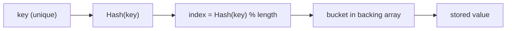
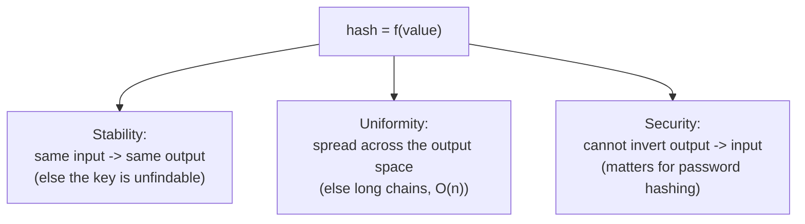
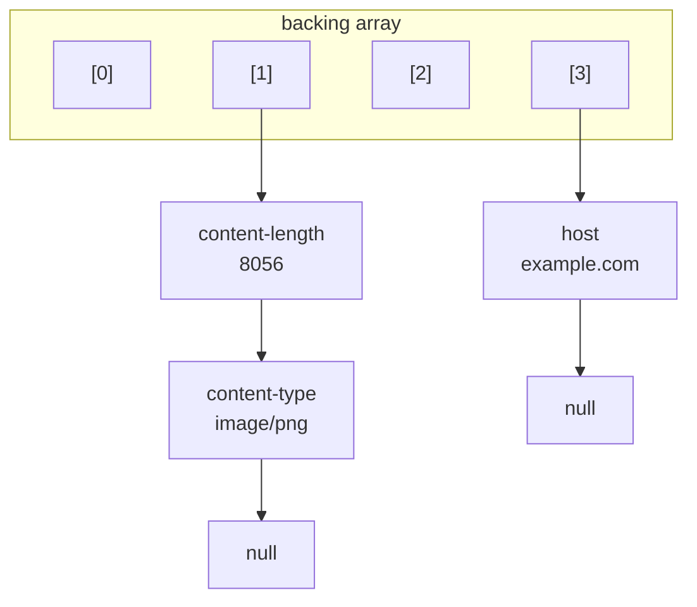
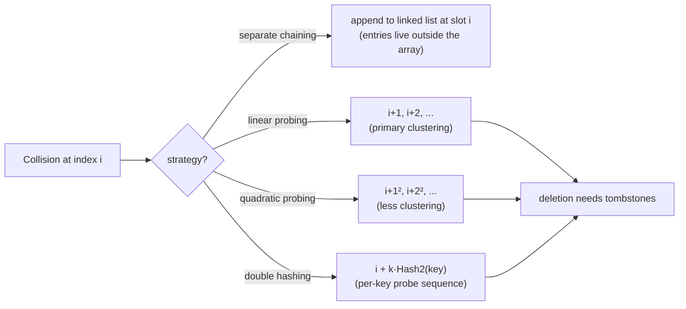
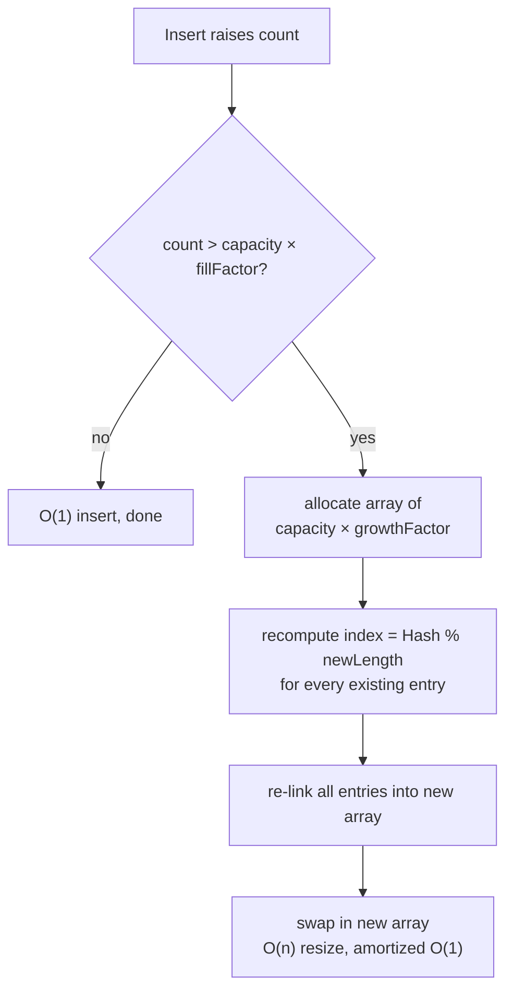

# Hash Table Internals (Reviewer)

A [hash table](algorithms-glossary-reviewer.md#hash-map "Stores key-value pairs and retrieves a value by key in O(1) average time.") is the machine behind `Dictionary<K,V>` and `HashSet<T>`: it implements the **associative-array** [abstract data type](algorithms-glossary-reviewer.md#abstract-data-type "A data type defined by its operations and behavior, not by its implementation.") — a [collection](algorithms-glossary-reviewer.md#collection "An object that groups multiple elements into a single unit.") of key/value pairs where each key appears at most once — and promises [O(1)](algorithms-glossary-reviewer.md#constant-time "Cost does not depend on input size; the same fixed work every time.") *average-case* insert, search, and remove. The trick is to convert a key into an integer with a [hash function](algorithms-glossary-reviewer.md#hashing "Turning a key into a fixed-size integer used to place or find it in a table."), reduce that integer to an array [index](algorithms-glossary-reviewer.md#index "An integer position into an array, starting at 0.") with a [modulo](algorithms-glossary-reviewer.md#modulo-and-modular-arithmetic "The remainder after division; wraps values into a fixed range like [0, length)."), and store the value at that slot. When two distinct keys land on the same slot — a [collision](algorithms-glossary-reviewer.md#hash-collision "When two different keys produce the same hash code and land in one bucket.") — the table needs a resolution strategy so neither entry is lost.

Where the [Arrays & Hashing](arrays-and-hashing-reviewer.md) reviewer uses a hash map as an O(1) black box for interview patterns, this reviewer opens the box: it builds a hash table from scratch. We cover the three properties a hash function must have (**stability**, **uniformity**, **security**), the index = `Hash(key) % length` step, the two big collision-resolution families (**separate chaining** with a [linked list](linked-lists-reviewer.md) per bucket, and **open addressing** with probing), the **fill factor** / **growth factor** machinery that keeps [buckets](algorithms-glossary-reviewer.md#bucket "A slot in a hash table's backing array that holds entries hashing to that index.") short by resizing and rehashing, iteration order, and the `GetHashCode`/`Equals` contract that makes the whole thing correct. The promise is O(1) average; the adversarial worst case is [O(n)](algorithms-glossary-reviewer.md#linear-time "Work grows in direct proportion to input size, about one unit per element."), and knowing exactly when and why it degrades is the point.

Related: [Algorithm Patterns Index](algorithm-patterns-index-reviewer.md) · [Arrays & Hashing](arrays-and-hashing-reviewer.md) · [Linked Lists](linked-lists-reviewer.md) · [Sets & Set Algorithms](sets-and-set-algorithms-reviewer.md) · [Glossary](algorithms-glossary-reviewer.md)

## Contents

- [The associative array ADT](#the-associative-array-adt)
- [The hash table and its O(1) promise](#the-hash-table-and-its-o1-promise)
- [The hash function: stability, uniformity, security](#the-hash-function-stability-uniformity-security)
- [Sample hash algorithms (additive, folding, djb2)](#sample-hash-algorithms-additive-folding-djb2)
- [From hash to bucket index: the modulo step](#from-hash-to-bucket-index-the-modulo-step)
- [Collisions and separate chaining](#collisions-and-separate-chaining)
- [Open addressing for contrast](#open-addressing-for-contrast)
- [Fill factor, growth factor, and resizing](#fill-factor-growth-factor-and-resizing)
- [Iteration order](#iteration-order)
- [The GetHashCode/Equals contract and mutable keys](#the-gethashcodeequals-contract-and-mutable-keys)
- [Complexity summary](#complexity-summary)
- [Interview Q&A](#interview-qa)
- [Rapid-fire round](#rapid-fire-round)
- [Exam-style questions](#exam-style-questions)
- [30-second takeaway](#30-second-takeaway)
- [Quick recall checklist](#quick-recall-checklist)
- [References](#references)

---

## The associative array ADT

Key points:

- An **associative array** (a.k.a. map, dictionary) is a collection of **[key/value pairs](algorithms-glossary-reviewer.md#key-value-pair "An entry pairing a unique key with an associated value, the unit a map stores.") where each key can exist only once**. Setting an existing key overwrites its value; the key set is effectively a [set](sets-and-set-algorithms-reviewer.md).
- The contract is three operations: **Add/Set** `(key, value)`, **Find/Get** `(key) -> value`, and **Remove** `(key)`. It says nothing about *how* those are implemented — a sorted array, a [balanced tree](algorithms-glossary-reviewer.md#balanced-tree "A tree kept shallow so height stays about log n, keeping operations fast."), and a hash table all satisfy the ADT with different complexities.
- It is everywhere in real systems: **HTTP headers** (`"content-length" -> "8056"`), **environment variables** (`"PATH" -> "/usr/local/..."`), application configuration, and key/value databases are all associative arrays.
- Keys and values need **not** share a type. `HashTable<string, HttpHeaderValue>` is perfectly normal; the key is a `string`, the value an arbitrary object.

```csharp
// The associative-array idea, expressed against the ADT (indexer = Add/Set + Get).
HashTable<string, string> headers = new();

headers["content-length"] = "8056";       // Add
headers["content-type"]   = "image/png";  // Add
string len = headers["content-length"];   // Find -> "8056"
headers["content-length"] = "9000";       // Set: key is unique, value overwritten
```



*The associative-array promise — value by key — realized by hashing the key to a bucket.*

## The hash table and its O(1) promise

A **hash table** is an associative-array container that provides **O(1) average** insert, delete, and search by storing values in a backing array indexed by a hash of the key.

Key points:

- The structure is just **a fixed-size array plus a hash function**. The hash function turns the key into an integer; the modulo turns that integer into a valid index; the value lives at (or chained from) that slot.
- **O(1) is an average, not a guarantee.** It holds when the hash spreads keys evenly and buckets stay short. If every key collides into one bucket — a pathological or *adversarial* hash — every operation walks one long chain and degrades to **[O(n)](algorithms-glossary-reviewer.md#best-average-and-worst-case "How an algorithm's cost varies across the luckiest, typical, and hardest inputs.")**. Always state both in an interview.
- The backing array starts small (e.g. capacity 4) and **grows** as it fills, so [amortized](algorithms-glossary-reviewer.md#amortized-analysis "Averaging the cost of an operation over a sequence, so rare expensive steps spread out.") cost stays O(1) even though individual inserts occasionally trigger an expensive resize.
- Skeleton of a from-scratch table: type parameters `<TKey, TValue>`, a private `Hash`, a private `Index`, and an indexer for get/set.

```csharp
public class HashTable<TKey, TValue>
{
    // Backing array. Real tables store entries (see chaining below); shown flat here.
    private Entry[] _table = new Entry[4];

    private uint Hash(TKey key) { /* turn key into a fixed-size integer */ return 0; }

    private uint Index(TKey key) => Hash(key) % (uint)_table.Length; // hash -> valid index

    public TValue this[TKey key]
    {
        get => Find(key);                  // O(1) average
        set => AddOrUpdate(key, value);    // O(1) average (amortized over resizes)
    }

    private TValue Find(TKey key) => default!;            // placeholder
    private void AddOrUpdate(TKey key, TValue value) { }  // placeholder
    private struct Entry { public TKey Key; public TValue Value; }
}
```

## The hash function: stability, uniformity, security

A **hash function** maps data of arbitrary size to data of a fixed size: `hash = f(value)`. For a hash *table* specifically, a good function needs three properties. (Security matters most for cryptographic uses; for an in-memory table, stability and uniformity are the load-bearing ones, but security is worth understanding.)

Key points:

- **Stability** — *the same input always produces the same output.* This is non-negotiable: if a key hashes to a different slot on each call, you store it in one place and search for it in another, and it is lost forever. The classic counterexample seeds the hash with `DateTime.Now`, so `Hash("foo")` returns a different number every second.
- **Uniformity** — *outputs are spread evenly across the output space.* A function that clumps keys into a few slots causes constant collisions and long chains, dragging operations toward O(n). Uniformity is what keeps buckets short and the O(1) average real.
- **Security** — *the function cannot be inverted*: you cannot derive the input from the output. This matters when the hash protects data (e.g. password storage), not for a plain lookup table. An insecure hash is vulnerable to a **rainbow-table attack**: precompute `hash -> input` for every candidate string, then reverse any stored hash by table lookup. With an insecure hash like `sdbm`, an attacker who steals `username -> hash` rows recovers the real passwords (`password`, `football`, `jedi`) by matching against a precomputed table.

```csharp
// STABLE: output depends only on the input bytes.
public int StableHash(string input)
{
    int result = 0;
    foreach (byte ascii in System.Text.Encoding.ASCII.GetBytes(input))
        result += ascii;
    return result;
}

// UNSTABLE: seeded with the clock -> same input, different output each second. NEVER do this.
public int UnstableHash(string input)
{
    int result = DateTime.Now.Second;     // <-- breaks stability
    foreach (byte ascii in System.Text.Encoding.ASCII.GetBytes(input))
        result += ascii;
    return result;
}
```

```text
StableHash("foo")   -> 324    StableHash("foo")   -> 324    StableHash("foo")   -> 324
UnstableHash("foo") -> 341   -> 342   -> 343   (= 324 + DateTime.Now.Second; changes every second, wraps at 60!)
```



*The three properties a hash function is judged on; a table needs stability and uniformity, security for protected data.*

## Sample hash algorithms (additive, folding, djb2)

Key points:

- **Additive (sum-of-bytes)** — add up the byte values. **Stable and fast**, but **poor uniformity** ([anagrams](algorithms-glossary-reviewer.md#anagram "A word formed by rearranging the letters of another; same letters, different order.") collide: `"foo"`, `"oof"`, `"ofo"` all sum to the same number) and **no security**. Fine for a toy, bad for production.
- **Folding** — split the input into chunks (e.g. 4-byte words), combine them. **Better uniformity** than additive because position matters and bits mix, still stable and fast, still **not secure**.
- **djb2 (a.k.a. Dbj2 / sdbm-family)** — the classic string hash: start at **5381**, then for each byte `hash = hash * 33 + c`. The odd multiplier 33 mixes bits well, giving **good uniformity** with very little work. Widely used as the default string hash in many systems; **stable, fast, uniform — but not secure**.
- **Cryptographic hashes** (MD5, SHA-1, SHA-2) are stable and uniform with large output sizes. Only **SHA-2 (256–512)** is still considered secure today; MD5 and SHA-1 are broken for security use.

```csharp
// Additive: stable + fast, but poor uniformity (anagrams collide) and no security.
public uint AdditiveHash(string input)
{
    uint hash = 0;
    foreach (byte c in System.Text.Encoding.ASCII.GetBytes(input))
        hash += c;            // "foo" -> 102+111+111 = 324; "oof" also 324
    return hash;
}

// djb2 / Dbj2: hash * 33 + c starting from 5381. Stable, fast, good uniformity, not secure.
public ulong Dbj2Hash(string input)
{
    ulong hash = 5381;
    foreach (byte c in System.Text.Encoding.ASCII.GetBytes(input))
        hash = hash * 33 + c;
    return hash;
}
```

| Name | Output size | Stable | Uniform | Secure |
| --- | --- | --- | --- | --- |
| Additive | 32 | yes | **no** | no |
| Folding | 32 | yes | yes | no |
| Dbj2 (djb2) | 64 | yes | yes | no |
| MD5 | 128 | yes | yes | **no*** |
| SHA-1 | 160 | yes | yes | **no*** |
| SHA-2 (224/384) | 224/384 | yes | yes | no* |
| SHA-2 (256–512) | 256–512 | yes | yes | **yes** |

*\*Once considered secure; MD5 and SHA-1 should no longer be used for security. Larger output sizes resist brute force: a 32-bit space (≈4.3 billion) is exhaustively checkable in seconds at a billion checks/sec, while a 512-bit space is astronomically beyond reach.*

## From hash to bucket index: the modulo step

Key points:

- The hash is an arbitrary integer; the backing array has a fixed length. **`index = Hash(key) % table.Length`** folds the hash into a valid `[0, length)` index.
- This step is where most collisions are *born*: even a perfectly uniform hash collides after the modulo whenever two keys' hashes are congruent mod `length`. Shrinking a huge integer space into a few slots guarantees pigeonhole collisions once entries exceed slots.
- Use **unsigned** arithmetic (or mask the sign bit) so a negative hash does not produce a negative index. `.NET`'s `GetHashCode` returns a signed `int`; the BCL applies `& 0x7FFFFFFF` (or works with `uint`) before reducing.
- Real `.NET` tables size the bucket array to a **[prime](algorithms-glossary-reviewer.md#prime-number "A whole number greater than 1 divisible only by 1 and itself.")** number and reduce modulo that prime; primes scatter patterned hashes better than powers of two. A from-scratch table can start simpler with a power-of-two length and a plain `%`.

```csharp
private uint Index(TKey key)
{
    // Hash(key) may be any uint; fold it into a valid array index.
    return Hash(key) % (uint)_table.Length;
}
```

```text
table.Length = 4
Hash("content-length") = 0xA13F...  % 4 = 1   -> bucket 1
Hash("content-type")   = 0x5B72...  % 4 = 1   -> bucket 1  (collision!)
```

## Collisions and separate chaining

A **hash collision** is when multiple distinct keys map to the same table index. Because the modulo forces a small index space, collisions are inevitable — the table must resolve them, not prevent them. The primary strategy is **separate chaining**.

Key points:

- **Separate chaining** stores, at each array slot, the **head of a linked list** of entries that hashed there. Add prepends (or appends) a node; Find walks the short chain comparing keys with `Equals`; Remove unlinks the matching node.
- Each node is a `HashTableEntry` holding the **Key**, the **Value**, and a **Next** pointer — exactly a singly [linked list](linked-lists-reviewer.md) node. The array holds list heads; the lists hold the collided entries.
- With good uniformity and a bounded **fill factor**, chains stay length ~1, so all three operations are **O(1) average**. If the hash is terrible and every key chains into one slot, the chain is length `n` and operations are **O(n)** — the worst case.
- Chaining never "runs out of room" the way open addressing can: a slot holds arbitrarily many entries, and the table can hold more entries than it has slots (though performance says it should not, hence resizing).

```csharp
internal class HashTableEntry<TKey, TValue>
{
    public TKey Key;
    public TValue Value;
    public HashTableEntry<TKey, TValue> Next;   // linked-list pointer for the chain
}

// The backing array now holds chain heads.
private HashTableEntry<TKey, TValue>[] _table = new HashTableEntry<TKey, TValue>[4];

public void Add(TKey key, TValue value)
{
    uint i = Index(key);
    // Walk the chain: overwrite if the key already exists (keys are unique).
    for (var e = _table[i]; e != null; e = e.Next)
        if (EqualityComparer<TKey>.Default.Equals(e.Key, key)) { e.Value = value; return; }
    // Not found: prepend a new entry as the new chain head.
    _table[i] = new HashTableEntry<TKey, TValue> { Key = key, Value = value, Next = _table[i] };
}

public bool TryFind(TKey key, out TValue value)
{
    for (var e = _table[Index(key)]; e != null; e = e.Next)
        if (EqualityComparer<TKey>.Default.Equals(e.Key, key)) { value = e.Value; return true; }
    value = default!;
    return false;
}
```



*Separate chaining: slot 1 holds a two-node chain of collided entries; each node is a Key/Value/Next linked-list node.*

## Open addressing for contrast

Separate chaining stores collisions *outside* the array in lists. **Open addressing** does the opposite: every entry lives **in the array itself**, and a collision is resolved by **probing** for the next free slot. No per-bucket lists, better cache locality, but it demands careful deletion.

Key points:

- **Linear probing** — on collision, try `index + 1, index + 2, ...` (mod length) until a free slot appears. Simple and cache-friendly, but suffers **primary clustering**: runs of occupied slots merge and grow, lengthening probes.
- **Quadratic probing** — probe `index + 1², index + 2², index + 3², ...`. Spreads probes out, reducing primary clustering, at the cost of possibly not visiting every slot unless the table size and probe sequence are chosen carefully.
- **Double hashing** — the probe step itself comes from a *second* hash: `index + k·Hash2(key)`. This gives each key its own probe sequence, minimizing clustering — the highest-quality open-addressing scheme.
- **[Tombstones](algorithms-glossary-reviewer.md#tombstone "A slot marked as deleted-but-keep-probing so open-addressing lookups don't stop early.")** are the catch: you cannot simply null out a deleted slot, because a later Find probing past it would stop early and miss entries that were inserted *after* the deleted one. Instead mark the slot as a **deleted tombstone** — Find treats it as "keep probing," Insert may reuse it. Tombstones accumulate and must be cleared by an occasional rehash.
- Open addressing **must** keep its [load factor](algorithms-glossary-reviewer.md#load-factor "Ratio of entries to buckets; high values cause more collisions and trigger a resize.") well below 1 (commonly < 0.7); as it approaches full, probe lengths explode and the table can have *no* free slot at all.

```csharp
// Linear-probing insert sketch. Free = empty, Tombstone = deleted-but-keep-probing.
public void AddOpen(TKey key, TValue value)
{
    uint i = Index(key);
    int firstTombstone = -1;
    for (int step = 0; step < _slots.Length; step++)
    {
        int p = (int)((i + (uint)step) % (uint)_slots.Length); // linear: +1 each probe
        ref var slot = ref _slots[p];
        if (slot.State == Free)
        {
            int dest = firstTombstone >= 0 ? firstTombstone : p; // reuse a tombstone if seen
            _slots[dest] = new Slot { Key = key, Value = value, State = Occupied };
            return;
        }
        if (slot.State == Tombstone && firstTombstone < 0) firstTombstone = p;
        else if (slot.State == Occupied &&
                 EqualityComparer<TKey>.Default.Equals(slot.Key, key)) { slot.Value = value; return; }
    }
    throw new InvalidOperationException("table full — resize first");
}
```



*Chaining stores collisions in lists; open addressing stores them in the array via probing and needs tombstones on delete.*

## Fill factor, growth factor, and resizing

Short chains are what keep operations O(1). As entries accumulate, chains lengthen, so the table watches its **fill factor** and **grows** before performance rots.

Key points:

- **Fill factor (load factor)** — the fraction of capacity that may be used before the table grows, e.g. **0.80**. When `count / capacity` exceeds it, the table resizes. Lower fill factor → shorter chains, fewer collisions, more wasted space; it is a speed/memory dial.
- **Growth factor** — the multiple by which capacity grows on resize, e.g. **1.50** (some tables double). New capacity = `oldCapacity × growthFactor` (then often rounded up to a prime).
- **Resize / rehash** is not a memcpy. Because the index is `Hash(key) % length` and `length` changed, **every existing entry must be re-indexed into the new array** — you walk all entries, recompute each index against the new length, and re-link them. This is an **O(n)** operation.
- Even though one resize is O(n), it happens rarely enough (capacity grows geometrically) that the cost **amortizes to O(1)** per insert. This is the same amortized-doubling argument as a [dynamic array](algorithms-glossary-reviewer.md#dynamic-array "An array that grows automatically by reallocating to a larger backing buffer.") (`List<T>`).

```csharp
private int _count;
private const double FillFactor   = 0.80;
private const double GrowthFactor = 1.50;

private void AddWithGrowth(TKey key, TValue value)
{
    if (_count + 1 > _table.Length * FillFactor)        // 1) fill factor exceeded?
        Resize((int)(_table.Length * GrowthFactor));    // 2) grow by the growth factor
    Add(key, value);                                    // chaining insert from earlier
    _count++;
}

private void Resize(int newCapacity)
{
    var old = _table;
    _table = new HashTableEntry<TKey, TValue>[newCapacity];
    foreach (var head in old)                           // 3) re-index EVERY entry:
        for (var e = head; e != null; )                 //    Hash % newLength changed
        {
            var next = e.Next;
            uint i = Index(e.Key);                       //    recompute against new length
            e.Next = _table[i];                          //    re-link into the new array
            _table[i] = e;
            e = next;
        }
}
```



*Growth is triggered by the fill factor, sized by the growth factor, and requires a full O(n) rehash — amortized to O(1).*

## Iteration order

Key points:

- A hash table has **no meaningful order**. Iterating it visits **slot 0, then slot 1, ...**, and within each slot walks that bucket's chain — i.e. iteration order is **storage order**, an artifact of hash values and insertion history.
- That order is **not** insertion order and **not** sorted order, and it can **change on resize** because entries get re-indexed into different slots. Never rely on it. In `.NET`, `Dictionary<K,V>` enumeration order is explicitly undefined.
- If you need ordering, that is a different data structure: a sorted/tree map for key order, or an insertion-ordered map (like Java's `LinkedHashMap`, or maintaining a parallel list) for insertion order.

```csharp
// Iterate the table: outer loop over slots, inner loop over each chain.
public IEnumerable<KeyValuePair<TKey, TValue>> Enumerate()
{
    foreach (var head in _table)                 // slot 0, 1, 2, ... (storage order)
        for (var e = head; e != null; e = e.Next) // walk this slot's chain
            yield return new(e.Key, e.Value);
}
```

## The GetHashCode/Equals contract and mutable keys

For a from-scratch table the hash and comparison are yours; for `.NET`'s built-in collections, keys plug in through `GetHashCode` and `Equals`, and the table is only correct if they obey a contract.

Key points:

- **The contract:** if `a.Equals(b)` then `a.GetHashCode() == b.GetHashCode()`. Equal keys **must** hash equal — otherwise they route to different buckets and the table cannot find an equal key. The converse is *not* required: unequal keys may share a hash (that is just a collision, which chaining handles).
- A good `GetHashCode` is **stable** (same fields → same code for the object's lifetime as a key), **uniform** (spreads values), and **cheap**. Combine fields with something like `HashCode.Combine(f1, f2)` in `.NET` rather than XOR-ing by hand.
- **Mutable keys are dangerous.** If you store a key, then mutate a field that `GetHashCode`/`Equals` depend on, the entry still sits in the *old* bucket but now hashes to a *new* one. It becomes **unreachable** — Find computes the new index and never looks at the old slot. The entry is leaked: present but invisible.
- The fix is **effectively immutable keys**: use `string`, value types, or `record`/readonly types as keys, and never mutate a key while it lives in the table. This is the runtime echo of the **stability** property — a key whose hash drifts is exactly the unstable-hash bug.

```csharp
// Custom key done right: immutable, with a matching Equals/GetHashCode.
public sealed class Point : IEquatable<Point>
{
    public int X { get; }                     // readonly -> hash cannot drift
    public int Y { get; }
    public Point(int x, int y) { X = x; Y = y; }

    public bool Equals(Point other) => other is not null && X == other.X && Y == other.Y;
    public override bool Equals(object obj) => Equals(obj as Point);
    public override int GetHashCode() => HashCode.Combine(X, Y); // equal points -> equal hash
}
```

```text
// The mutable-key trap (do NOT do this):
var key = new MutablePoint(1, 2);
dict[key] = "A";          // stored in bucket for hash(1,2)
key.X = 99;               // hash now (99,2) -> different bucket
dict.ContainsKey(key);    // FALSE — searches the (99,2) bucket; entry sits in the (1,2) bucket
```

## Complexity summary

| Operation | Average | Worst case | Notes |
| --- | --- | --- | --- |
| Add / Set | **O(1)** | O(n) | worst = all keys collide into one chain |
| Find / Get | **O(1)** | O(n) | walks one chain; O(n) if chain holds all entries |
| Remove | **O(1)** | O(n) | find + unlink |
| Resize / rehash | O(n) | O(n) | re-index every entry; happens rarely |
| Add (amortized) | **O(1)** | O(1) amortized | geometric growth spreads resize cost |
| Iterate all | O(n + capacity) | O(n + capacity) | visits every slot and every entry |
| Space | O(n + capacity) | O(n + capacity) | entries plus the backing array |

Key points:

- The **average O(1)** rests on two conditions: a **uniform** hash (keys spread out) and a **bounded fill factor** (chains stay short). Lose either and you slide toward O(n).
- The **worst case O(n)** is real, not theoretical: a degenerate or adversarial hash (or a hash-flood attack) funnels every key into one bucket. Randomized/seeded hashes (`.NET` does this for `string`) defend against deliberate flooding.
- **Resize is O(n)** but **amortizes to O(1)** per insert because capacity grows by a constant factor, so the total resize work over `n` inserts is O(n).

## Interview Q&A

### Fundamentals

Q: What is the difference between an associative array and a hash table?
A: The **associative array** is the abstract data type — key/value pairs with unique keys and Add/Find/Remove. The **hash table** is one *implementation* of that ADT that uses a hash function and a backing array to deliver **O(1) average** operations. A sorted array or balanced tree could implement the same ADT with different complexities.

Q: Why is a hash table O(1) on average but O(n) in the worst case?
A: Average O(1) holds when a **uniform** hash spreads keys across buckets and the **fill factor** keeps chains short, so each operation touches ~1 entry. The worst case is when many or all keys **collide** into one bucket (bad or adversarial hash); the chain becomes length `n` and every operation walks it, degrading to O(n).

Q: What three properties should a hash function have, and which matter for a hash table?
A: **Stability** (same input → same output), **uniformity** (even spread across the output space), and **security** (cannot be inverted). A hash *table* critically needs **stability** (or keys become unfindable) and **uniformity** (or chains grow). **Security** matters for protecting data (password hashing), not for a plain in-memory lookup.

Q: Why can't a hash function use something like `DateTime.Now`?
A: It would break **stability**. `Hash("foo")` would return a different value on each call, so the entry gets stored under one index and searched for under another — it becomes permanently unreachable. A hash must depend only on the key's contents.

### Collisions and resolution

Q: What is a collision, and how does separate chaining resolve it?
A: A **collision** is two distinct keys mapping to the same index (inevitable, since `Hash % length` shrinks a huge space into few slots). **Separate chaining** stores a **linked list** at each slot: each `HashTableEntry` holds Key, Value, and a Next pointer. Add prepends/overwrites, Find walks the chain comparing keys, Remove unlinks the node. Short chains keep operations O(1) average.

Q: How does open addressing differ, and why does it need tombstones?
A: Open addressing keeps **all entries in the array** and resolves collisions by **probing** for another slot (linear, quadratic, or double hashing). Deletion needs **tombstones**: nulling a slot would let a later Find stop probing too early and miss entries inserted after the deleted one, so the slot is marked "deleted — keep probing" instead. Open addressing also must keep its load factor well below 1.

Q: What is the role of the fill factor and growth factor in resizing?
A: The **fill factor** (e.g. 0.80) is the occupancy threshold that triggers growth; the **growth factor** (e.g. 1.50) is the multiple the capacity grows by. On resize, because the index is `Hash % length` and `length` changed, **every entry is rehashed** into the new array — an O(n) operation that **amortizes to O(1)** per insert thanks to geometric growth.

Q: Why are mutable keys dangerous in a hash table?
A: If you mutate a field that `GetHashCode`/`Equals` use after inserting the key, the entry stays in its **old** bucket but now hashes to a **new** one, so Find never looks at the old slot and the entry becomes **unreachable**. Use effectively immutable keys (strings, value types, records). This is the runtime version of the stability requirement.

## Rapid-fire round

- Associative array = → **key/value pairs, keys unique; the ADT.**
- Hash table = → **an O(1)-average implementation of that ADT via a hash + array.**
- Three hash-function properties → **stability, uniformity, security.**
- Stability means → **same input always yields the same output.**
- Stability counterexample → **seeding with `DateTime.Now`.**
- Uniformity means → **outputs spread evenly across the output space.**
- Security means → **the hash cannot be inverted (input from output).**
- Attack an insecure password hash with → **a rainbow table (precomputed hash → input).**
- Index from hash → **`index = Hash(key) % table.Length`.**
- Additive hash → **sum of bytes: stable, fast, poor uniformity, insecure.**
- djb2 hash → **`hash = hash * 33 + c`, starting at `5381`.**
- Collision = → **two distinct keys map to the same index.**
- Primary collision strategy → **separate chaining (linked list per bucket).**
- Chain node fields → **Key, Value, Next.**
- Open-addressing strategies → **linear, quadratic, double hashing.**
- Open-addressing deletion needs → **tombstones.**
- Fill factor → **occupancy threshold that triggers growth (e.g. 0.80).**
- Growth factor → **capacity multiplier on resize (e.g. 1.50).**
- Resize cost → **O(n) to rehash all entries; amortized O(1) per insert.**
- Iteration order → **storage order (slot then chain); never rely on it.**
- GetHashCode/Equals contract → **equal objects must have equal hash codes.**
- Average / worst case → **O(1) / O(n).**

## Exam-style questions

1. A `HashTable` with capacity 8 holds 6 entries. Its fill factor is 0.80 and growth factor 1.50. You add a 7th entry. Does it resize, and to what capacity? What is the cost of this insert?

**Answer:** Threshold = `8 × 0.80 = 6.4`. Adding the 7th makes count 7 > 6.4, so it **resizes**. New capacity = `8 × 1.50 = 12`. Resizing **rehashes all entries** (`Hash % 12` for each), so this particular insert costs **O(n)** — but because growth is geometric, inserts **amortize to O(1)**.

2. What is wrong with this hash function for use in a hash table, and what fails as a result?

```csharp
public int Hash(string input) => Guid.NewGuid().GetHashCode();
```

**Answer:** It violates **stability** — it ignores the input entirely and returns a fresh random value every call. An entry would be stored under one index and searched for under a different one, so **every Find fails** and stored entries are unreachable. A hash must be a deterministic function of the key's contents.

3. Two distinct keys `"foo"` and `"oof"` both produce hash `324` with an additive hash, and `324 % 4 = 0`. Walk through what separate chaining does on `Add("foo", 1)` then `Add("oof", 2)`, and what `Find("oof")` does.

**Answer:** Both hash to index `0` — a **collision**. `Add("foo", 1)` puts an entry `{Key="foo", Value=1, Next=null}` at slot 0. `Add("oof", 2)` prepends `{Key="oof", Value=2, Next=<foo entry>}`, so slot 0's chain is `oof -> foo`. `Find("oof")` computes index 0, walks the chain, compares `"oof".Equals("oof")` at the head — match on the first node, returns `2`. The additive hash's poor uniformity caused the collision; chaining made it correct, just slightly slower.

4. After many inserts and deletes, an open-addressing table's `Find` starts missing keys that are definitely present. The deletes set removed slots to `null`. What is the bug?

**Answer:** Deleting by setting a slot to `null` (empty) breaks probing. A `Find` probing through that now-empty slot **stops early**, concluding the key is absent — but a colliding key inserted *after* the deletion sits further along the probe sequence and is now skipped. The fix is **tombstones**: mark deleted slots as "deleted, keep probing" so Find continues past them, while Insert may reuse them. Accumulated tombstones are cleared by an occasional rehash.

## 30-second takeaway

> A hash table implements the **associative-array** ADT (unique keys → values) with **O(1) average** Add/Find/Remove by hashing each key to an array index: `index = Hash(key) % length`. The hash function must be **stable** (same input → same output, never `DateTime.Now`) and **uniform** (spread keys out); **security** matters only when the hash protects data. Distinct keys colliding on one index is inevitable; the primary fix is **separate chaining** (a `HashTableEntry{Key,Value,Next}` linked list per slot), and the contrast is **open addressing** (linear/quadratic/double-hash probing, which needs **tombstones** on delete). A **fill factor** (e.g. 0.80) triggers growth by a **growth factor** (e.g. 1.50), which **rehashes every entry** — an O(n) resize that **amortizes to O(1)**. Iteration is storage order (never rely on it), keys must be **effectively immutable** (mutating a key strands its entry in the wrong bucket), and the worst case — all keys in one chain — is **O(n)**.

## Quick recall checklist

- **ADT:** associative array = key/value pairs, keys unique; ops are Add/Set, Find/Get, Remove.
- **Hash table:** an implementation giving **O(1) average**, **O(n) worst case**, via hash + backing array.
- **Hash function properties:** stability (deterministic — never seed with the clock), uniformity (even spread → short chains), security (non-invertible — for password hashing, defends rainbow tables).
- **Sample hashes:** additive (sum bytes — poor uniformity), folding (better), **djb2** (`hash*33 + c`, seed `5381` — good uniformity, fast, insecure); only SHA-2 256+ is secure.
- **Index:** `Hash(key) % table.Length`, with unsigned/masked arithmetic; primes scatter patterned hashes.
- **Collisions:** inevitable (modulo shrinks the space). Primary fix = **separate chaining**: linked list of `{Key, Value, Next}` per slot.
- **Open addressing:** all entries in-array; **linear** (clustering), **quadratic**, **double hashing** (best); deletes need **tombstones**; keep load factor < ~0.7.
- **Resizing:** fill factor (e.g. 0.80) triggers it, growth factor (e.g. 1.50) sizes it; **rehash every entry** = O(n), **amortized O(1)**.
- **Iteration:** storage order (slot, then chain); not insertion or sorted order; can change on resize.
- **Keys:** honor the `GetHashCode`/`Equals` contract (equal → equal hash); keys must be effectively **immutable** or entries get stranded.
- **Complexity:** Add/Find/Remove O(1) average / O(n) worst; resize O(n)/amortized O(1); space O(n + capacity).

## References

- Wikipedia — [Hash table](https://en.wikipedia.org/wiki/Hash_table).
- Wikipedia — [Hash function](https://en.wikipedia.org/wiki/Hash_function) and [Open addressing](https://en.wikipedia.org/wiki/Open_addressing).
- cp-algorithms — [Hashing](https://cp-algorithms.com/string/string-hashing.html).
- Microsoft Learn — [`Dictionary<TKey,TValue>` Class](https://learn.microsoft.com/en-us/dotnet/api/system.collections.generic.dictionary-2).
- Microsoft Learn — [`Object.GetHashCode` Method](https://learn.microsoft.com/en-us/dotnet/api/system.object.gethashcode) and [`HashCode` struct](https://learn.microsoft.com/en-us/dotnet/api/system.hashcode).
- Robert Horvick — *Data Structures and Algorithms* (Hash Tables module).
