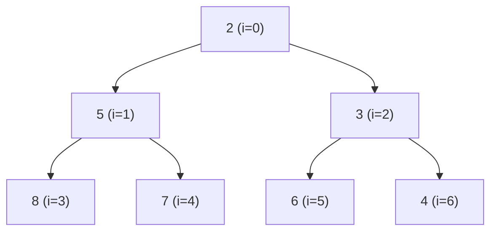
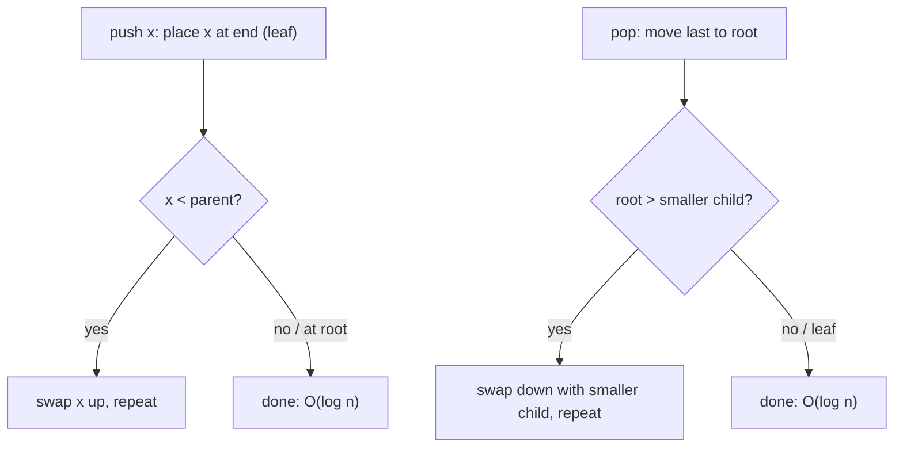
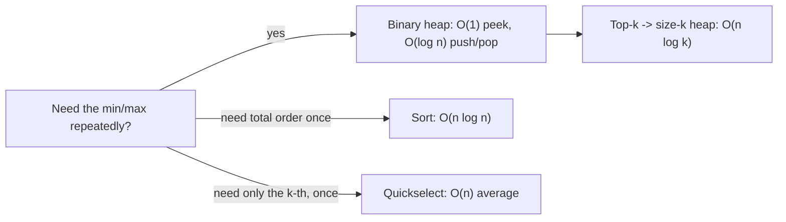
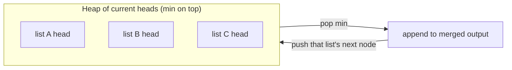
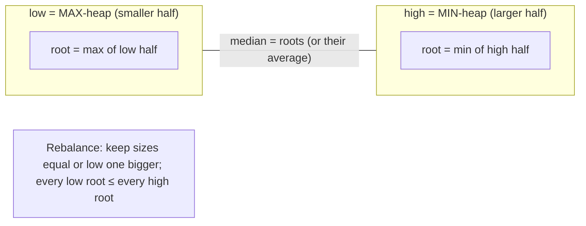

# Heaps & Priority Queues (Reviewer)

A **[binary heap](algorithms-glossary-reviewer.md#binary-heap "A heap as a complete binary tree packed in an array; children at 2i+1, 2i+2.")** is a [complete binary tree](algorithms-glossary-reviewer.md#complete-binary-tree "Every level filled except the last, which fills left to right with no gaps.") stored in a flat array that keeps one [invariant](algorithms-glossary-reviewer.md#invariant "A condition that stays true at every step, used to prove correctness."): every
parent is ordered before its children (smaller for a **[min-heap](algorithms-glossary-reviewer.md#min-heap-and-max-heap "A min-heap keeps the smallest at its root; a max-heap keeps the largest.")**, larger for a **max-heap**). That
single rule buys you **[O(1)](algorithms-glossary-reviewer.md#constant-time "Cost does not depend on input size; the same fixed work every time.")** access to the extreme element and **[O(log n)](algorithms-glossary-reviewer.md#logarithmic-time "Each step discards a constant fraction, so steps equal the log of n.")** insert and extract — the
exact trade an interview problem wants when it says "the largest/smallest so far," "the k closest,"
"merge k sorted things," or "the running median." You almost never implement the [heap](algorithms-glossary-reviewer.md#heap "A tree structure keeping the smallest or largest element instantly accessible.") by hand in C#:
you reach for `PriorityQueue<TElement,TPriority>` from `System.Collections.Generic`, a binary min-heap
keyed by an explicit priority.

The reason heaps dominate a whole family of problems is that they give you *partial* order cheaply.
A full sort is [O(n log n)](algorithms-glossary-reviewer.md#linearithmic-time "A linear pass repeated a logarithmic number of times; good-sort speed.") and gives total order you usually don't need; a heap maintains just enough
order to answer "what's the next extreme?" repeatedly, and a **size-k** heap answers top-k in
**O(n log k)** while touching only k elements of memory. Knowing when a heap beats a sort — and when
[quickselect](algorithms-glossary-reviewer.md#quickselect "Finds the k-th smallest element in O(n) average by partitioning around a pivot.") beats the heap — is the senior-level distinction this reviewer drills.

Related: [Algorithm Patterns Index](algorithm-patterns-index-reviewer.md) · [Sorting Algorithms](sorting-algorithms-reviewer.md) · [Linked Lists](linked-lists-reviewer.md) · [Greedy](greedy-reviewer.md) · [Trees & BSTs](trees-and-binary-search-trees-reviewer.md) · [Collections & Big-O](../dotnet/csharp/collections-and-big-o-reviewer.md) · [Glossary](algorithms-glossary-reviewer.md)

## Contents
- [What a binary heap is](#what-a-binary-heap-is)
- [Index arithmetic and the array layout](#index-arithmetic-and-the-array-layout)
- [Sift-up and sift-down](#sift-up-and-sift-down)
- [Operations and complexity](#operations-and-complexity)
- [Build-heap is O(n), not O(n log n)](#build-heap-is-on-not-on-log-n)
- [Min-heap vs max-heap in C#](#min-heap-vs-max-heap-in-c)
- [Top-K pattern](#top-k-pattern)
- [K closest points and Kth largest in a stream](#k-closest-points-and-kth-largest-in-a-stream)
- [K-way merge](#k-way-merge)
- [Two heaps for a running median](#two-heaps-for-a-running-median)
- [Scheduling and greedy with heaps](#scheduling-and-greedy-with-heaps)
- [Heapsort (pointer to Sorting)](#heapsort-pointer-to-sorting)
- [Pitfalls](#pitfalls)
- [Interview Q&A](#interview-qa)
- [Rapid-fire round](#rapid-fire-round)
- [Exam-style questions](#exam-style-questions)
- [30-second takeaway](#30-second-takeaway)
- [Quick recall checklist](#quick-recall-checklist)
- [References](#references)

---

## What a binary heap is

A binary heap is a **complete** [binary tree](algorithms-glossary-reviewer.md#binary-tree "A tree where every node has at most two children, left and right.") (every level full except possibly the last, which fills
left to right) that satisfies the **heap property**:

- **Min-heap:** `parent <= both children`, so the minimum sits at the root.
- **Max-heap:** `parent >= both children`, so the maximum sits at the root.

Key points:

- It is **not** a [binary search tree](algorithms-glossary-reviewer.md#binary-search-tree "A binary tree where left subtree values are smaller and right are larger."). [Siblings](algorithms-glossary-reviewer.md#parent-child-and-sibling "Parent is directly above a node; child is below it; siblings share a parent.") have no order relative to each other, and an in-order
  walk is meaningless. The only guarantee is along each root-to-[leaf](algorithms-glossary-reviewer.md#leaf "A node with no children; the endpoint of a branch.") path.
- "Complete" is what lets you store it in an [array](algorithms-glossary-reviewer.md#array "A fixed-size contiguous block of same-type elements accessed by position in O(1).") with **no gaps and no [pointers](algorithms-glossary-reviewer.md#pointer "A value that refers to the location of data rather than holding it directly.")** — the [tree](algorithms-glossary-reviewer.md#tree "A hierarchy of nodes with one root, no cycles, and one parent per node.") shape
  is implied by the [indices](algorithms-glossary-reviewer.md#index "The integer position of an element; 0-indexed starts at 0, 1-indexed at 1.").
- The [root](algorithms-glossary-reviewer.md#root "The single topmost node of a tree, the one with no parent.") is always the answer to "give me the extreme element," available in **O(1)**.
- Duplicates are allowed; a heap is not a [set](algorithms-glossary-reviewer.md#hash-set "Stores unique keys with O(1) average membership testing and no values."). You dedup yourself if you need to.



*A min-heap as a tree: each parent &le; its children, so the root 2 is the minimum; left/right siblings (5 vs 3) are unordered.*

The same heap stored as an array, with the index ruler that drives all the math:

```text
 value   2   5   3   8   7   6   4
 index   0   1   2   3   4   5   6
         ^root
         children of i=0 -> indices 1,2  (values 5,3)
         children of i=1 -> indices 3,4  (values 8,7)
         children of i=2 -> indices 5,6  (values 6,4)
```

*The tree above flattened into an array; position in the array encodes parent/child links — no pointers stored.*

## Index arithmetic and the array layout

For a **0-indexed** array (what C# uses), the relationships are fixed formulas:

| From node at index `i` | Formula |
| --- | --- |
| Left child | `2*i + 1` |
| Right child | `2*i + 2` |
| Parent | `(i - 1) / 2` (integer division) |
| Is a leaf? | `i >= n / 2` (no left child exists) |
| Last non-leaf (heapify start) | `n / 2 - 1` |

Key points:

- A node at index `i` has a left child only if `2*i + 1 < n`. Always bounds-check before descending.
- `(i - 1) / 2` works for every non-root index because integer division floors; for `i = 0` it yields
  `0`, so guard the root explicitly when sifting up.
- These are the formulas you would re-derive in an interview if asked to implement a heap from scratch.
  `PriorityQueue<TElement,TPriority>` does exactly this internally on a 4-ary heap, but the
  **complexity** is the same and the binary form is what you explain on a whiteboard.

```csharp
static int Left(int i)   => 2 * i + 1;
static int Right(int i)  => 2 * i + 2;
static int Parent(int i) => (i - 1) / 2;
```

## Sift-up and sift-down

Two restore operations maintain the invariant. They are the entire algorithmic content of a heap.

Key points:

- **Sift-up (bubble-up):** used by **push**. Place the new element at the end (next free leaf), then
  swap it upward while it is smaller than its parent (min-heap). Stops at the root or when ordered.
  Cost is the tree height, **O(log n)**.
- **Sift-down (bubble-down / [heapify](algorithms-glossary-reviewer.md#heapify "Restoring heap order by moving an element up or down until parents and children fit.")):** used by **pop**. Move the last element to the root, then swap
  it downward with its **smaller** child until both children are larger or it becomes a leaf. Also
  **O(log n)**.
- The classic bug is picking the *wrong* child in sift-down. You must compare both children and swap
  with the **smaller** one (min-heap), or you break the invariant.



*Decision flow for the two restore operations: push sifts up, pop sifts down toward the smaller child.*

Hand-rolled min-heap sift operations (matches what `PriorityQueue` does conceptually):

```csharp
sealed class MinHeap
{
    private readonly List<int> _h = new();

    public int Count => _h.Count;
    public int Peek() => _h[0];                    // O(1)

    public void Push(int x)                        // O(log n)
    {
        _h.Add(x);
        int i = _h.Count - 1;
        while (i > 0)
        {
            int p = (i - 1) / 2;
            if (_h[i] >= _h[p]) break;
            (_h[i], _h[p]) = (_h[p], _h[i]);
            i = p;
        }
    }

    public int Pop()                               // O(log n)
    {
        int root = _h[0];
        int last = _h.Count - 1;
        _h[0] = _h[last];
        _h.RemoveAt(last);
        SiftDown(0);
        return root;
    }

    private void SiftDown(int i)
    {
        int n = _h.Count;
        while (true)
        {
            int l = 2 * i + 1, r = 2 * i + 2, smallest = i;
            if (l < n && _h[l] < _h[smallest]) smallest = l;
            if (r < n && _h[r] < _h[smallest]) smallest = r;
            if (smallest == i) break;
            (_h[i], _h[smallest]) = (_h[smallest], _h[i]);
            i = smallest;
        }
    }
}
```

ASCII trace of one **pop** (extract-min) on the heap `[2,5,3,8,7,6,4]`. Pop returns `2`, moves the
last element `4` to the root, then sifts it down:

```text
start:   2   5   3   8   7   6   4        return root = 2
         0   1   2   3   4   5   6

step 0:  move last (4) to root, drop slot 6
         4   5   3   8   7   6   .
         i=0  children = idx1(5), idx2(3) -> smaller child is 3 (idx2)
              4 > 3  -> swap

step 1:  3   5   4   8   7   6
         i=2  children = idx5(6), idx6(none) -> only 6
              4 < 6  -> stop, heap restored

result:  3   5   4   8   7   6            new min (root) = 3
         0   1   2   3   4   5
```

*Extract-min: return 2, promote the last leaf to the root, sift it down along the smaller-child path until ordered.*

## Operations and complexity

| Operation | Time | Space | Notes |
| --- | --- | --- | --- |
| `Peek` (read root) | **O(1)** | O(1) | The whole point of a heap |
| `Push` / `Enqueue` | **O(log n)** | O(1) | Sift-up; tree height |
| `Pop` / `Dequeue` | **O(log n)** | O(1) | Sift-down; tree height |
| Build-heap from `n` items | **O(n)** | O(1) extra | Heapify bottom-up (see next section) |
| `EnqueueDequeue` | **O(log n)** | O(1) | One sift, not two; skips a grow |
| Search for arbitrary value | **O(n)** | O(1) | Heap is **not** searchable like a BST |
| Delete arbitrary element | **O(n)** then O(log n) | O(1) | Must find it first |

Key points:

- Heap height is `floor(log2 n)`, so push/pop are logarithmic — never confuse this with O(1).
- There is **no O(log n) search** and **no O(log n) decrease-key** in `PriorityQueue`. If a problem
  needs decrease-key (e.g. textbook [Dijkstra](algorithms-glossary-reviewer.md#dijkstra "Finds shortest paths from a source on non-negative weights via a min-heap.")), the idiomatic C# workaround is **lazy deletion**: push
  a new (node, betterDist) pair and skip stale pops where the popped priority is worse than the best
  recorded distance.
- `n` heap operations cost **O(n log n)** total — which is exactly heapsort's bound.



*Choosing among heap, sort, and quickselect by how much order you actually need.*

## Build-heap is O(n), not O(n log n)

A common misconception: "building a heap from n items is O(n log n) because each insert is O(log n)."
**That's the cost of n separate pushes.** Building in one shot — **Floyd's heapify**, sifting down
from the last non-leaf up to the root — is **O(n)**.

Key points:

- The sum that proves it: nodes at [height](algorithms-glossary-reviewer.md#height-depth-and-level "Depth measures down from the root; height measures up from leaves; level groups by depth.") `h` number about `n / 2^(h+1)`, and each costs O(h) to sift
  down. `sum over h of (n / 2^(h+1)) * h` converges to **2n = O(n)**.
- Intuition: half the nodes are leaves (height 0, zero work); only the rare nodes near the root do the
  expensive deep sifts. The work is dominated by the cheap many, not the costly few.
- C#: the **constructor that seeds elements**, `new PriorityQueue<T,T>(items)`, and `EnqueueRange`
  build in O(n) rather than n× O(log n).

```csharp
// O(n) bulk build via the seeding constructor — NOT n separate Enqueue calls.
var pq = new PriorityQueue<int, int>(
    new[] { (5, 5), (1, 1), (3, 3), (8, 8) });   // (element, priority)
int min = pq.Dequeue();                           // 1
```

```text
heapify [8,5,3,1] bottom-up (min-heap), n=4, last non-leaf = n/2 - 1 = 1
 value   8   5   3   1
 index   0   1   2   3

i=1: child idx3(1) < 5 -> swap     ->  8   1   3   5
i=0: children idx1(1), idx2(3); smaller=1 < 8 -> swap
                                   ->  1   8   3   5
     now at idx1: child idx3(5) < 8 -> swap
                                   ->  1   5   3   8     root=1 (min), O(n) total
```

*Floyd build-heap: only the upper, fewer nodes do deep sifts, so the total is linear, not n log n.*

## Min-heap vs max-heap in C#

`PriorityQueue<TElement,TPriority>` is a **min-heap by default**: the element with the *smallest*
priority dequeues first. Element and priority are separate, so you can prioritize by a computed key.

Key points:

- **Min-heap (default):** `new PriorityQueue<TElement, TPriority>()`.
- **Max-heap:** invert the comparer — `Comparer<int>.Create((a, b) => b.CompareTo(a))` — or negate
  numeric priorities (`Enqueue(x, -value)`). The comparer is cleaner and avoids [overflow](algorithms-glossary-reviewer.md#integer-overflow "A value exceeds its integer type's max and silently wraps to a wrong value.") with
  `int.MinValue`.
- The **priority** is what orders the queue; the **element** is the payload. They are often the same
  value, but for "k closest points" the element is the point and the priority is the distance.
- `PriorityQueue` is **not [stable](algorithms-glossary-reviewer.md#stable-sort "A sort that preserves the relative order of elements comparing equal.")**: equal priorities dequeue in an unspecified order, *not*
  insertion order.

```csharp
// Min-heap (default): smallest priority first.
var min = new PriorityQueue<string, int>();
min.Enqueue("low", 1);
min.Enqueue("high", 9);
string first = min.Dequeue();                      // "low"

// Max-heap: invert the comparer so largest priority first.
var max = new PriorityQueue<string, int>(
    Comparer<int>.Create((a, b) => b.CompareTo(a)));
max.Enqueue("low", 1);
max.Enqueue("high", 9);
string top = max.Dequeue();                         // "high"
```

Core API you must know cold (all in `System.Collections.Generic`):

| Member | Effect | Time |
| --- | --- | --- |
| `Enqueue(elem, prio)` | Insert | O(log n) |
| `Dequeue()` | Remove & return min element | O(log n) |
| `Peek()` | Return min element, no removal | O(1) |
| `TryDequeue(out e, out p)` | Safe remove (false if empty) | O(log n) |
| `TryPeek(out e, out p)` | Safe peek | O(1) |
| `EnqueueDequeue(elem, prio)` | Push then pop, **one** sift; key top-k trick | O(log n) |
| `DequeueEnqueue(elem, prio)` | Pop then push (.NET 9) | O(log n) |
| `EnqueueRange(items)` | Bulk insert | O(n) for a fresh build |
| `Count` | Number of elements | O(1) |
| `UnorderedItems` | Enumerate (element, priority) in **heap order**, not sorted | O(n) |

## Top-K pattern

To find the **k largest** elements, keep a **min-heap of size k**. The smallest of your current top-k
sits at the root; when a new element beats it, evict the root. After scanning all `n`, the heap holds
the k largest, and its root is the **k-th largest**.

Key points:

- **Complexity: O(n log k) time, O(k) space.** Each of n elements does at most one O(log k) heap op.
- This beats a full sort (**O(n log n)** time, O(n) or O(log n) space) **when k is much smaller than
  n** — and it streams: you never need all n in memory at once.
- For k *largest*, use a **min-heap** (evict the smallest). For k *smallest*, use a **max-heap**.
  Mixing these up is the #1 top-k mistake — the heap type is the *opposite* of what you keep.
- `EnqueueDequeue` does the "push the newcomer, drop the current min" in a single sift once the heap is
  full — slightly faster than `Enqueue` then `Dequeue`.

```csharp
// LC 215 — Kth Largest Element in an Array (heap solution).
// Keep a size-k MIN-heap; its root is the k-th largest. O(n log k), O(k).
static int FindKthLargest(int[] nums, int k)
{
    var heap = new PriorityQueue<int, int>();      // min-heap by priority
    foreach (int x in nums)
    {
        if (heap.Count < k)
            heap.Enqueue(x, x);
        else if (x > heap.Peek())                  // x beats current smallest of top-k
            heap.EnqueueDequeue(x, x);             // push x, pop the old min — one sift
    }
    return heap.Peek();                            // root = k-th largest
}
```

ASCII trace for `nums = [3, 2, 1, 5, 6, 4]`, `k = 2` (keep the 2 largest, root = 2nd largest):

```text
stream ->  3    2    1    5    6    4          k = 2, size-2 MIN-heap

see 3:  heap not full -> push 3        heap = [3]          root=3
see 2:  heap not full -> push 2        heap = [2, 3]       root=2 (min)
see 1:  1 > root(2)? no -> skip        heap = [2, 3]       root=2
see 5:  5 > root(2)? yes -> evict 2    heap = [3, 5]       root=3
see 6:  6 > root(3)? yes -> evict 3    heap = [5, 6]       root=5
see 4:  4 > root(5)? no -> skip        heap = [5, 6]       root=5

answer = root = 5  (the 2nd largest of [3,2,1,5,6,4])
```

*Size-k min-heap for Kth Largest: the root is always the weakest of the current top-k, so we evict it whenever a stronger value arrives.*

**Contrast the three approaches** to "k-th largest":

| Approach | Time | Space | When to use |
| --- | --- | --- | --- |
| Full sort, index `n-k` | O(n log n) | O(1)–O(n) | Simplest; fine when you also need order |
| Size-k heap | **O(n log k)** | O(k) | k « n, or streaming / unbounded input |
| Quickselect (Hoare) | **O(n) average**, O(n²) worst | O(1) [in place](algorithms-glossary-reviewer.md#in-place "Transforms its input using only O(1) extra memory, rearranging in place.") | Single static array, no stream, average speed matters |

For [LC 347](algorithms-glossary-reviewer.md#lc-number "The unique identifier LeetCode assigns each problem, like LC 704.") — Top K Frequent Elements, count frequencies in a `Dictionary<int,int>` (O(n)), then keep
a size-k min-heap keyed by frequency (O(m log k) for m distinct values). This maps to the practice
folder `priority-queue` and the `k-largest-elements` set in leet-practice.

## K closest points and Kth largest in a stream

These reuse the size-k heap with a *computed* priority and a persistent heap.

For **LC 973 — K Closest Points to Origin**, the priority is squared distance (no `Math.Sqrt`
needed — it's [monotonic](algorithms-glossary-reviewer.md#monotonic "Consistently moving one direction; never decreasing or never increasing.") and avoids floating-point error). Keep a size-k **max-heap** so the *farthest*
of the current k sits at the root and gets evicted when a closer point arrives.

```csharp
// LC 973 — K Closest Points to Origin. Size-k MAX-heap on squared distance. O(n log k), O(k).
static int[][] KClosest(int[][] points, int k)
{
    var heap = new PriorityQueue<int[], long>(     // max-heap: invert comparer
        Comparer<long>.Create((a, b) => b.CompareTo(a)));
    foreach (var p in points)
    {
        long d = (long)p[0] * p[0] + (long)p[1] * p[1];   // squared distance
        if (heap.Count < k)
            heap.Enqueue(p, d);
        else if (d < (long)heap.Peek()[0] * heap.Peek()[0] + (long)heap.Peek()[1] * heap.Peek()[1])
            heap.EnqueueDequeue(p, d);             // closer than current farthest -> swap in
    }
    return heap.UnorderedItems.Select(x => x.Element).ToArray();
}
```

For **LC 703 — Kth Largest Element in a Stream**, the heap *persists* across queries. Hold a size-k
min-heap; each `Add` inserts and trims back to k, then returns the root — the running k-th largest.

```csharp
// LC 703 — Kth Largest Element in a Stream. Persistent size-k MIN-heap. Add is O(log k).
public class KthLargest
{
    private readonly int _k;
    private readonly PriorityQueue<int, int> _heap = new();

    public KthLargest(int k, int[] nums)
    {
        _k = k;
        foreach (int x in nums) Add(x);
    }

    public int Add(int val)
    {
        _heap.Enqueue(val, val);
        if (_heap.Count > _k) _heap.Dequeue();     // keep only the k largest
        return _heap.Peek();                       // current k-th largest
    }
}
```

## K-way merge

To merge **k sorted lists** into one sorted output, keep a heap of the **current heads** (one
candidate per list). Pop the global minimum, emit it, and push that list's next [node](algorithms-glossary-reviewer.md#node "A container in a linked structure holding a value plus references to neighbors."). The heap never
holds more than k items, so each of the N total elements costs O(log k).

Key points:

- **Complexity: O(N log k) time** where N is the total element count across all lists; **O(k) space**
  for the heap (plus the output).
- Naively concatenating and sorting is O(N log N) — worse, since `log k <= log N`, and it ignores the
  fact that the inputs are already sorted.
- This is the engine behind external merge sort and **LC 23 — Merge k Sorted Lists**. Practice it in
  the `merge-k-lists` folder of leet-practice.



*K-way merge: the heap holds one head per list; repeatedly pop the smallest head and refill from the list it came from.*

```csharp
// LC 23 — Merge k Sorted Lists. Heap of heads, keyed by node value. O(N log k), O(k).
public class ListNode { public int val; public ListNode? next; public ListNode(int v) => val = v; }

static ListNode? MergeKLists(ListNode?[] lists)
{
    var heap = new PriorityQueue<ListNode, int>();          // min by node value
    foreach (var node in lists)
        if (node is not null) heap.Enqueue(node, node.val);

    var dummy = new ListNode(0);
    var tail = dummy;
    while (heap.Count > 0)
    {
        var node = heap.Dequeue();                          // smallest head
        tail.next = node;
        tail = node;
        if (node.next is not null)
            heap.Enqueue(node.next, node.next.val);         // refill from same list
    }
    return dummy.next;
}
```

ASCII trace merging `A=[1,4]`, `B=[2,6]`, `C=[3,5]` (heap shows values; k=3):

```text
init heads:  heap = {1(A), 2(B), 3(C)}                           output: []
pop 1(A):    emit 1, push A.next=4              heap = {2,3,4}   output: [1]
pop 2(B):    emit 2, push B.next=6              heap = {3,4,6}   output: [1,2]
pop 3(C):    emit 3, push C.next=5              heap = {4,5,6}   output: [1,2,3]
pop 4(A):    emit 4, A exhausted                heap = {5,6}     output: [1,2,3,4]
pop 5(C):    emit 5, C exhausted                heap = {6}       output: [1,2,3,4,5]
pop 6(B):    emit 6, B exhausted                heap = {}        output: [1,2,3,4,5,6]
```

*Each pop emits the global minimum and pulls the next node from that same list; the heap stays at size &le; k.*

## Two heaps for a running median

The **median of a stream** needs the middle element(s) as numbers arrive. Split the data into two
halves and keep each in a heap so both middles are at a root:

- **`low`** — a **max-heap** holding the smaller half; its root is the largest of the low half.
- **`high`** — a **min-heap** holding the larger half; its root is the smallest of the high half.

Maintain the invariant `low.Count == high.Count` or `low.Count == high.Count + 1`. Then:

- Odd total → median is `low.Peek()`.
- Even total → median is the average of `low.Peek()` and `high.Peek()`.



*Two-heaps median: a max-heap of the low half and a min-heap of the high half meet in the middle; the roots are the median candidates.*

Key points:

- **`AddNum` is O(log n); `FindMedian` is O(1).** Total space O(n).
- The **rebalance** rule: after inserting, if sizes differ by more than one, move a root from the
  bigger heap to the smaller. A clean trick is to always push into `low`, then push `low`'s root into
  `high`, then if `high` got bigger, push `high`'s root back into `low`. This also guarantees every
  `low` element ≤ every `high` element.

```csharp
// LC 295 — Find Median from Data Stream. Two heaps. AddNum O(log n), FindMedian O(1).
public class MedianFinder
{
    private readonly PriorityQueue<int, int> _low =          // max-heap (smaller half)
        new(Comparer<int>.Create((a, b) => b.CompareTo(a)));
    private readonly PriorityQueue<int, int> _high = new();  // min-heap (larger half)

    public void AddNum(int num)
    {
        _low.Enqueue(num, num);                              // 1) into low
        int x = _low.Dequeue();                              // 2) move low's max to high
        _high.Enqueue(x, x);
        if (_high.Count > _low.Count)                        // 3) keep low >= high in size
        {
            int y = _high.Dequeue();
            _low.Enqueue(y, y);
        }
    }

    public double FindMedian() =>
        _low.Count > _high.Count
            ? _low.Peek()                                    // odd count
            : (_low.Peek() + _high.Peek()) / 2.0;            // even count
}
```

ASCII trace of the stream `5, 2, 8, 1` (low is max-heap, high is min-heap):

```text
add 5:  low={5}            high={}           sizes 1,0  median = low.peek = 5
add 2:  low={2}            high={5}          sizes 1,1  median = (2+5)/2 = 3.5
add 8:  low={2,5}          high={8}          sizes 2,1  median = low.peek = 5
add 1:  low={1,2}          high={5,8}        sizes 2,2  median = (2+5)/2 = 3.5
        (low max-root=2, high min-root=5; every low <= every high)
```

*Running median: after each insert the heaps rebalance so the two roots straddle the middle of the sorted data.*

## Scheduling and greedy with heaps

Heaps are the [data structure](algorithms-glossary-reviewer.md#data-structure "A way of organizing data in memory so the operations you need run fast.") behind many [greedy](algorithms-glossary-reviewer.md#greedy "Always take the choice that looks best right now, never reconsidering.") strategies: "always take the current best" is exactly
"pop the heap root."

**LC 1046 — Last Stone Weight.** Repeatedly smash the two heaviest stones; the heavier minus the
lighter goes back (if nonzero). A **max-heap** gives the two heaviest in O(log n) each.

```csharp
// LC 1046 — Last Stone Weight. Max-heap; pop two heaviest each round. O(n log n), O(n).
static int LastStoneWeight(int[] stones)
{
    var heap = new PriorityQueue<int, int>(
        Comparer<int>.Create((a, b) => b.CompareTo(a)));     // max-heap
    foreach (int s in stones) heap.Enqueue(s, s);

    while (heap.Count > 1)
    {
        int a = heap.Dequeue();                              // heaviest
        int b = heap.Dequeue();                              // next heaviest
        if (a != b) heap.Enqueue(a - b, a - b);              // remainder back in
    }
    return heap.Count == 1 ? heap.Peek() : 0;
}
```

**LC 621 — Task Scheduler.** With cooldown `n`, a max-heap by remaining count drives one greedy
approach: each cycle of `n+1` slots, pop the most-frequent available tasks, run them, and re-enqueue
those still remaining. (A closed-form O(N) formula also exists — `(maxCount - 1) * (n + 1) + maxOfMax`
clamped to the task count — but the heap version is the one that generalizes when you must emit an
actual schedule.)

```text
tasks = A,A,A,B,B,B   n = 2     (cooldown 2 between same task)
counts: A:3, B:3      cycle length = n + 1 = 3

cycle 1: pop A(3),B(3) -> run A,B, idle      time +3   reMq A:2,B:2
cycle 2: pop A(2),B(2) -> run A,B, idle      time +3   reMq A:1,B:1
cycle 3: pop A(1),B(1) -> run A,B            last cycle, no trailing idle: +2
total = 3 + 3 + 2 = 8   ->  A B _ A B _ A B
```

*Task Scheduler greedy: each cycle drains the highest-frequency tasks first; only the final cycle skips trailing idle slots.*

The same max-heap-driven greedy underlies the `priority-queue` practice folder in leet-practice.

## Heapsort (pointer to Sorting)

Heapsort turns the heap into an [in-place sort](algorithms-glossary-reviewer.md#in-place-sort "A sort that rearranges within the original array using O(1) extra memory."): **build-heap** in O(n), then repeatedly swap the root
to the end and sift down the reduced heap.

Key points:

- **Time O(n log n) in all cases** (best, average, worst) — no [quadratic](algorithms-glossary-reviewer.md#quadratic-time "Work grows like the square of n, typically a nested loop over the same data.") blowup like naive quicksort.
- **Space O(1)** — sorts in place, unlike merge sort's O(n).
- **Not stable** — equal keys can be reordered.
- In practice it loses to quicksort on cache locality, which is why .NET's `Array.Sort` uses
  **[introsort](algorithms-glossary-reviewer.md#introsort "Hybrid sort: quicksort that falls back to heap sort to guarantee O(n log n).")** (quicksort that *falls back to heapsort* when recursion gets too deep, guaranteeing
  O(n log n) worst case). See [Sorting Algorithms](sorting-algorithms-reviewer.md) for the full
  treatment.

| Sort | Best | Average | Worst | Space | Stable |
| --- | --- | --- | --- | --- | --- |
| Heapsort | O(n log n) | O(n log n) | O(n log n) | O(1) | No |
| Quicksort | O(n log n) | O(n log n) | O(n²) | O(log n) | No |
| Merge sort | O(n log n) | O(n log n) | O(n log n) | O(n) | Yes |

## Pitfalls

Key points:

- **`PriorityQueue` is not stable.** Equal priorities dequeue in arbitrary order. If you need [FIFO](algorithms-glossary-reviewer.md#queue "A first-in-first-out collection: add at the back, remove from the front.")
  among ties, fold a monotonically increasing sequence number into the priority (e.g. a
  `(priority, seq)` tuple compared lexicographically).
- **No decrease-key.** You cannot cheaply update an element's priority in place. Use **lazy deletion**:
  push the updated copy and discard stale pops whose priority is worse than the best recorded value.
- **No dedup.** A heap can hold duplicates; the same node can be enqueued twice. For [graph](algorithms-glossary-reviewer.md#graph "Vertices connected by edges, modeling arbitrary relationships, possibly cyclic.") algorithms,
  track a visited/settled set and skip already-finalized pops.
- **No random access / search.** Finding an arbitrary value is O(n); `PriorityQueue` doesn't even
  expose indexing. `UnorderedItems` enumerates in heap (not sorted) order.
- **Top-k uses the *opposite* heap.** k *largest* → **min**-heap (evict the smallest); k *smallest* →
  **max**-heap. Getting this backwards keeps the wrong elements.
- **Max-heap via negation overflows.** Negating `int.MinValue` is still `int.MinValue`. Prefer an
  inverted `IComparer<T>` over `Enqueue(x, -x)`.
- **Squared distance, not `Sqrt`.** For "k closest," compare squared distances — monotonic, integer,
  no floating-point error. Use `long` to avoid overflow on large coordinates.
- **Build-heap is O(n).** Don't claim O(n log n) for bulk construction; only n *separate* pushes cost
  that.

## Interview Q&A

### Fundamentals

Q: Why is a binary heap stored in an array instead of with node pointers?
A: Because a heap is a *complete* tree, the shape is fully determined by the count, so parent/child
links can be computed by index arithmetic (`2i+1`, `2i+2`, `(i-1)/2`). That saves pointer memory,
gives perfect cache locality, and makes push/pop simple swaps in a contiguous array.

Q: What is the heap property, and how does it differ from a BST?
A: The heap property orders each parent relative to its children only (≤ for min-heap, ≥ for
max-heap). A BST orders left < node < right across the whole tree, so an in-order walk is sorted. A
heap gives O(1) access to one extreme but **no** O(log n) search; a BST gives O(log n) search but no
O(1) min/max-on-top guarantee (only O(log n) to the extreme via the leftmost/rightmost path).

Q: Push and pop are both O(log n) — why?
A: Both restore the invariant by walking one root-to-leaf path, and the height of a complete tree of n
nodes is `floor(log2 n)`. Push sifts a leaf up; pop moves the last leaf to the root and sifts it down.

Q: Is building a heap from n elements O(n) or O(n log n)?
A: **O(n)** if you heapify bottom-up (Floyd's method). It's O(n log n) only if you do n *separate*
inserts. The linear bound holds because most nodes are near the leaves and do little sift-down work;
the series `sum n/2^(h+1) * h` converges to 2n.

### C# specifics

Q: Is `PriorityQueue<TElement,TPriority>` a min-heap or max-heap?
A: A **min-heap** by default — the smallest priority dequeues first. For a max-heap, pass an inverted
`IComparer<TPriority>`, e.g. `Comparer<int>.Create((a, b) => b.CompareTo(a))`.

Q: Why are element and priority separate type parameters?
A: So you can prioritize a payload by a computed key without packing them together. For "k closest
points," the element is the point and the priority is its squared distance.

Q: What does `EnqueueDequeue` do and why is it useful?
A: It enqueues then dequeues in a single operation, returning the smallest of (old heap + new
element). For a full size-k heap it's the efficient "push the newcomer and drop the current min in one
sift," avoiding a separate grow-then-shrink.

Q: Is `PriorityQueue` stable? Can you update a priority in place?
A: No to both. Equal priorities come out in arbitrary order, and there is no decrease-key. For
stability, encode a sequence number into the priority; for updates, use lazy deletion (push the new
value, skip stale pops).

### Patterns

Q: For "k largest," which heap and what complexity?
A: A **min-heap of size k**. Its root is the smallest of the current top-k; evict the root when a
larger value arrives. O(n log k) time, O(k) space, and it streams.

Q: When does quickselect beat a heap for k-th largest?
A: When you have a single in-memory array, don't need a stream, and want average-case speed:
quickselect is **O(n) average** (O(n²) worst) and O(1) extra space, versus the heap's O(n log k). The
heap wins when input streams or k « n with bounded memory.

Q: How do two heaps give a running median in O(log n) per add?
A: Keep a max-heap of the lower half and a min-heap of the upper half, balanced so their sizes differ
by at most one. Each insert does O(log n) heap ops plus a rebalance; the median is then the larger
heap's root (odd total) or the average of both roots (even total) in O(1).

Q: Why use squared distance in "k closest points"?
A: `sqrt` is monotonic, so comparing squared distances gives the same ordering while staying in
integer arithmetic — faster and free of floating-point rounding error. Use `long` to avoid overflow.

## Rapid-fire round

- Heap peek cost → **O(1).**
- Heap push / pop cost → **O(log n).**
- Build-heap from n items → **O(n) (Floyd, bottom-up).**
- n separate inserts → **O(n log n).**
- Left child of index i → **`2*i + 1`.**
- Parent of index i → **`(i - 1) / 2`.**
- C# default heap direction → **min-heap (smallest priority first).**
- Make a max-heap in C# → **invert the `IComparer<TPriority>`.**
- k largest → **size-k MIN-heap, O(n log k).**
- k smallest → **size-k MAX-heap.**
- k-th largest, single array, fastest average → **quickselect, O(n) avg.**
- Merge k sorted lists → **heap of heads, O(N log k).**
- Running median → **two heaps (max-heap low, min-heap high).**
- Last Stone Weight → **max-heap, pop two heaviest.**
- K closest points priority → **squared distance (no sqrt).**
- `EnqueueDequeue` → **push + pop in one sift; top-k trick.**
- Is `PriorityQueue` stable? → **no.**
- Decrease-key in `PriorityQueue`? → **none; use lazy deletion.**
- Heapsort complexity → **O(n log n) all cases, O(1) space, not stable.**
- Search a heap for a value → **O(n) (not searchable like a BST).**

## Exam-style questions

1. What does this print, and what is the [time complexity](algorithms-glossary-reviewer.md#time-complexity "How the number of steps an algorithm performs grows with input size.") of the loop?

```csharp
var pq = new PriorityQueue<int, int>();
foreach (int x in new[] { 4, 1, 7, 3, 9, 2 })
{
    pq.Enqueue(x, x);
    if (pq.Count > 3) pq.Dequeue();
}
Console.WriteLine(pq.Peek());
```

**Answer:** `4`. A size-3 **min**-heap keeps the three largest seen; its root is the *smallest* of
those three — the 3rd largest. Trace: after `4,1,7` heap is `{1,4,7}`; add `3` → size 4 → dequeue
min `1` → `{3,4,7}`; add `9` → dequeue `3` → `{4,7,9}`; add `2` → dequeue `2` → `{4,7,9}`. Root (min)
is `4`, so it prints **`4`**. The loop is **O(n log k)** with k = 3. (The trap: a size-k min-heap's
root is the *k-th largest*, not the largest.)

2. Min-heap or max-heap, and why?

```text
You stream millions of integers and must always be able to report the 100 SMALLEST seen so far.
```

**Answer:** A **max-heap of size 100**. The largest of your current 100 smallest sits at the root; when
a smaller value arrives you evict that root. (k *smallest* uses a *max*-heap — the opposite of what you
keep.) O(n log k) time, O(k) space, and it streams without holding all n.

3. What is wrong with this attempt at a max-heap, and what does it print?

```csharp
var heap = new PriorityQueue<int, int>();
foreach (int x in new[] { 3, 1, 2 }) heap.Enqueue(x, -x);
Console.WriteLine(heap.Dequeue());
```

**Answer:** It prints **`3`**, and for these values it *works* — negating the priority makes the
largest element have the smallest (most negative) priority, so it dequeues first. The bug is *latent*:
if any value were `int.MinValue`, `-int.MinValue` overflows back to `int.MinValue`, silently
corrupting the order. Prefer an inverted `IComparer<int>` over negation.

4. Give the time and [space complexity](algorithms-glossary-reviewer.md#space-complexity "How the extra memory an algorithm needs grows with input size.") of each, with k « n:

```text
(a) Sort n items, return item at index n-k.
(b) Maintain a size-k heap over n items, return its root.
(c) Build a heap from n items, then pop k times.
```

**Answer:** (a) **O(n log n)** time, O(1)–O(n) space (depends on the sort). (b) **O(n log k)** time,
O(k) space — best for k « n or streaming. (c) Build is **O(n)**, then k pops at O(log n) each →
**O(n + k log n)** time, O(n) space (the heap holds all n). For small k, (c) is excellent for a static
array; (b) wins when input streams or memory is tight.

## 30-second takeaway

> A binary heap is a complete tree packed into an array (`left=2i+1`, `right=2i+2`,
> `parent=(i-1)/2`) that keeps the extreme element at the root: **peek O(1), push/pop O(log n), build
> O(n)**. In C#, `PriorityQueue<TElement,TPriority>` is a **min-heap by default**; invert the comparer
> for a max-heap. The patterns it unlocks: **top-k with a size-k heap (O(n log k), and the heap type is
> the opposite of what you keep)**, **k-way merge of heads (O(N log k))**, **two heaps for a running
> median (O(log n) add, O(1) read)**, and greedy "always take the best" scheduling. Remember the
> sharp edges: not stable, no decrease-key (use lazy deletion), no dedup, no search — and prefer
> quickselect (O(n) average) when you only need the k-th element of one static array.

## Quick recall checklist

- Complete tree in an array; **`left = 2i+1`, `right = 2i+2`, `parent = (i-1)/2`**; root is the
  extreme.
- **Peek O(1)**, **push/pop O(log n)** (one root-to-leaf path), **build-heap O(n)** (Floyd, bottom-up).
- **Not a BST**: no O(log n) search, no ordering between siblings; search is O(n).
- C# `PriorityQueue<TElement,TPriority>` is **min by default**; **max = inverted `IComparer`**;
  element and priority are separate.
- **`EnqueueDequeue`** = push + pop in one sift; **`DequeueEnqueue`** = pop then push (.NET 9);
  seeding constructor / `EnqueueRange` build in **O(n)**.
- **Top-k: size-k heap, O(n log k)** — k largest → **min-heap**, k smallest → **max-heap** (opposite!).
- **Quickselect** beats the heap for k-th element of a static array: **O(n) average**, O(1) space.
- **K-way merge**: heap of current heads, pop min and refill → **O(N log k)** (LC 23).
- **Running median**: max-heap (low) + min-heap (high), rebalance to size diff ≤ 1 → add O(log n),
  read O(1) (LC 295).
- Greedy with a heap: **Last Stone Weight** (max-heap), **K Closest** (size-k max-heap on squared
  distance), **Task Scheduler** (max-heap by remaining count).
- **Heapsort**: O(n log n) all cases, O(1) space, **not stable**; .NET `Array.Sort` is introsort
  (quicksort + heapsort fallback).
- Pitfalls: **not stable, no decrease-key (lazy deletion), no dedup, no random access**; max-heap via
  negation overflows on `int.MinValue`.

## References

- Wikipedia — [Binary heap](https://en.wikipedia.org/wiki/Binary_heap).
- Wikipedia — [Heap (data structure)](https://en.wikipedia.org/wiki/Heap_(data_structure)).
- Wikipedia — [Heapsort](https://en.wikipedia.org/wiki/Heapsort).
- Wikipedia — [Quickselect](https://en.wikipedia.org/wiki/Quickselect).
- cp-algorithms — [Building a heap / heap operations](https://cp-algorithms.com/data_structures/).
- Microsoft Learn — [`PriorityQueue<TElement,TPriority>` Class](https://learn.microsoft.com/en-us/dotnet/api/system.collections.generic.priorityqueue-2).
- Microsoft Learn — [`Comparer<T>.Create` Method](https://learn.microsoft.com/en-us/dotnet/api/system.collections.generic.comparer-1.create).
- Microsoft Learn — [`Array.Sort` Method](https://learn.microsoft.com/en-us/dotnet/api/system.array.sort).
- NeetCode — [Roadmap (Heap / Priority Queue)](https://neetcode.io/roadmap).
- LeetCode — [Study Plans](https://leetcode.com/studyplan/).
