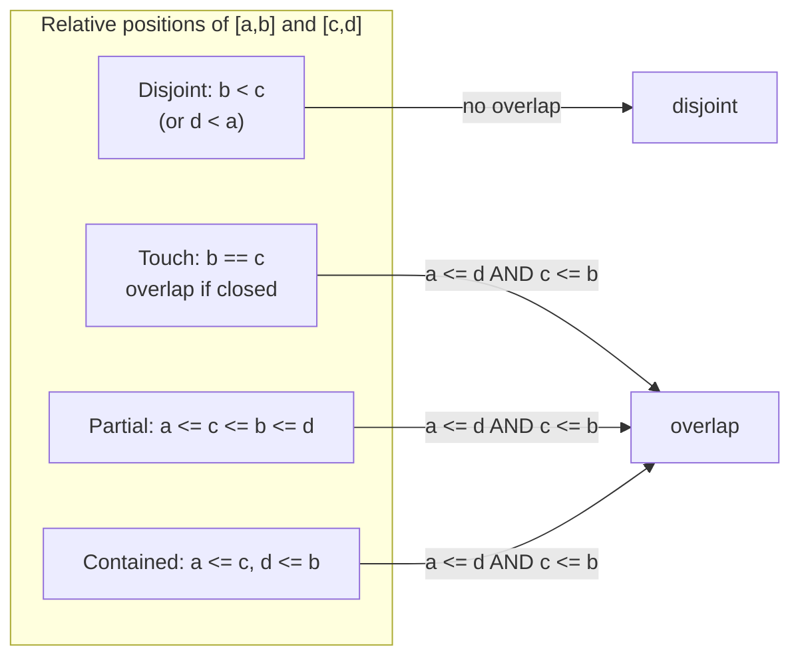
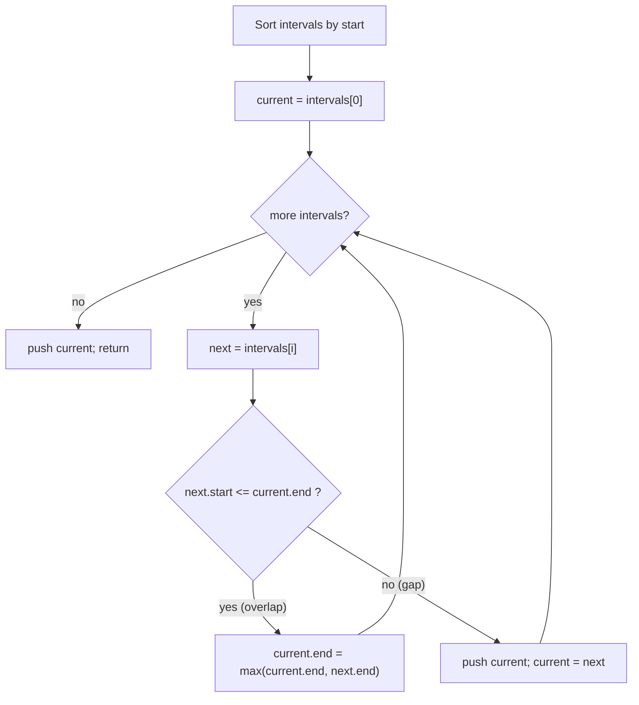
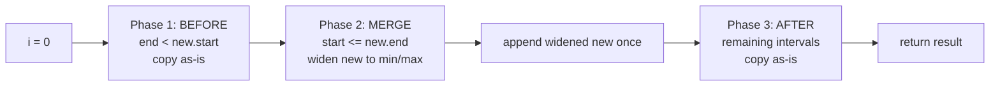
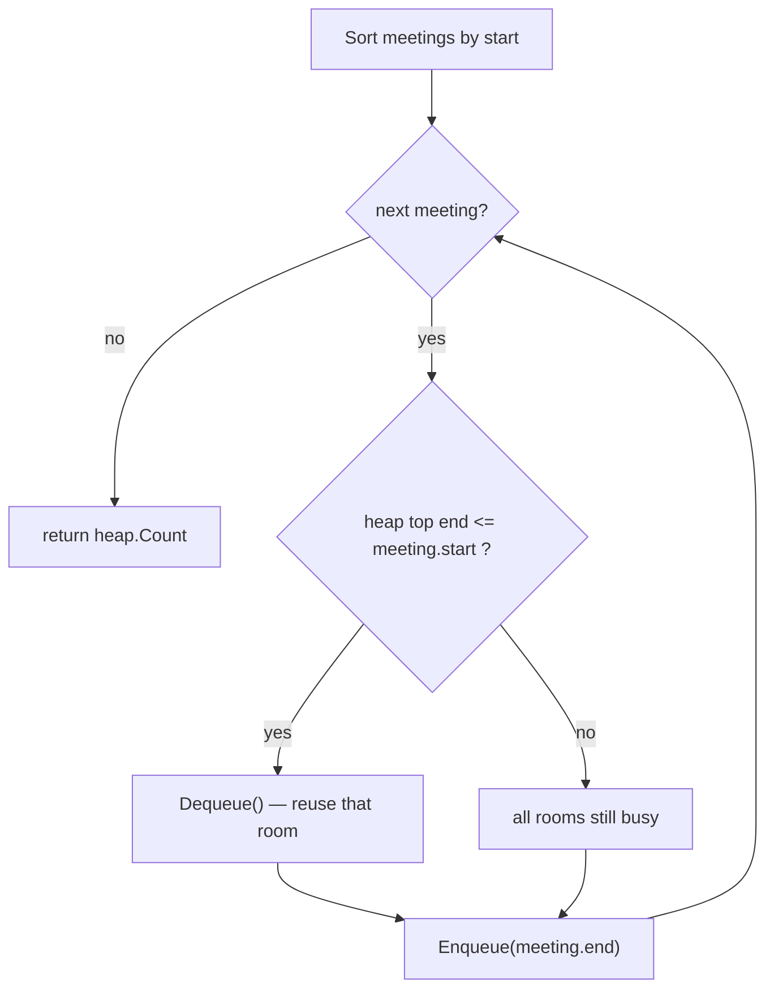
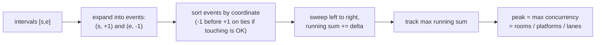
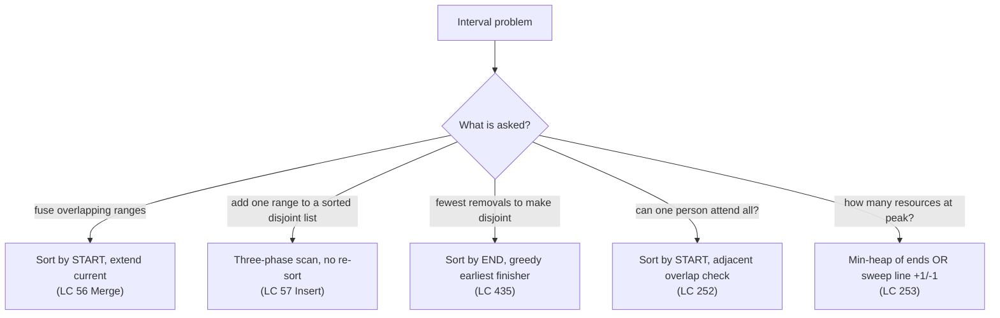

# Intervals (Reviewer)

The **interval pattern** covers problems where the input is a set of ranges `[start, end]` on a one-dimensional axis (time, positions, numbers) and the question is about how they relate: do they overlap, can they be fused into fewer ranges, how many must you drop to make them disjoint, or how many "resources" (rooms, CPUs, lanes) you need to service them all at once. The unifying trick is almost always the same — **sort once, then sweep left to right** maintaining a tiny amount of state (the current merged interval, a running concurrency count, or a [heap](algorithms-glossary-reviewer.md#heap "A tree structure keeping the smallest or largest element instantly accessible.") of active end times).

Interval problems are an interview staple because they look fiddly but collapse to a clean [greedy](algorithms-glossary-reviewer.md#greedy "Always take the choice that looks best right now, never reconsidering.") once you pick the right sort key. The two recurring keys are **sort by start** (for merging and inserting, where you walk the timeline forward) and **sort by end** (for the greedy "keep the earliest finisher" used in scheduling and minimum-removal problems). Almost every [algorithm](algorithms-glossary-reviewer.md#algorithm "A precise, finite sequence of steps that turns an input into a desired output.") here is `O(n log n)` — dominated by the sort — with `O(n)` or `O(1)` extra space. The classic traps are sorting by the wrong endpoint and mishandling inclusive-vs-exclusive boundaries (does touching at a point count as overlap?). This reviewer pins down the overlap test, the four core templates, and the [sweep-line](algorithms-glossary-reviewer.md#sweep-line "Processing sorted events as a line sweeps across, updating a running state.") counting technique, and traces each against a concrete example.

Related: [Algorithm Patterns Index](algorithm-patterns-index-reviewer.md) · [Greedy](greedy-reviewer.md) · [Sorting Algorithms](sorting-algorithms-reviewer.md) · [Heaps & Priority Queues](heaps-and-priority-queues-reviewer.md) · [Two Pointers](two-pointers-reviewer.md) · [Glossary](algorithms-glossary-reviewer.md)

## Contents

- [Defining overlap](#defining-overlap)
- [Merge intervals](#merge-intervals)
- [Insert interval](#insert-interval)
- [Non-overlapping intervals (minimum removals)](#non-overlapping-intervals-minimum-removals)
- [Meeting rooms (can attend all?)](#meeting-rooms-can-attend-all)
- [Meeting rooms II (minimum rooms)](#meeting-rooms-ii-minimum-rooms)
- [Sweep-line and the +1/-1 delta trick](#sweep-line-and-the-1-1-delta-trick)
- [Complexity summary](#complexity-summary)
- [Pitfalls and edge cases](#pitfalls-and-edge-cases)
- [Pattern picker](#pattern-picker)
- [Interview Q&A](#interview-qa)
- [Rapid-fire round](#rapid-fire-round)
- [Exam-style questions](#exam-style-questions)
- [30-second takeaway](#30-second-takeaway)
- [Quick recall checklist](#quick-recall-checklist)
- [References](#references)

---

## Defining overlap

Two closed intervals `[a, b]` and `[c, d]` (each with `start <= end`) **overlap** if and only if:

```text
a <= d  AND  c <= b
```

That is, each one starts at or before the other ends. The negation is the cleaner way to remember it: they are **disjoint** exactly when one finishes strictly before the other starts — `b < c` or `d < a`.

Key points:

- The test `a <= d && c <= b` is symmetric, so it does not matter which interval you call "first."
- With **closed** (inclusive) intervals, touching at a single point counts as overlapping: `[1, 3]` and `[3, 5]` share the point `3`, and `3 <= 5 && 3 <= 3` is true. If the problem treats touching endpoints as non-overlapping (half-open `[start, end)` intervals), switch the comparisons to strict: overlap becomes `a < d && c < b`.
- After sorting by start, the test simplifies. If interval *i* comes before interval *j* in start order (`start[i] <= start[j]`), then `start[i] <= end[j]` is automatic, so the only thing left to check is `start[j] <= end[i]`. Sorting collapses a two-condition test into one.
- This is why merging and inserting both sort by start: you only ever need to compare the next interval's start against the current end.

```csharp
static bool Overlap(int a, int b, int c, int d) => a <= d && c <= b;

// Closed/inclusive: touching counts as overlap.
Overlap(1, 3, 3, 5);  // true  -> share the point 3
Overlap(1, 2, 3, 5);  // false -> 2 < 3, a gap exists
```



*The only non-overlapping case is a strict gap; touch, partial, and containment all satisfy `a <= d && c <= b`.*

## Merge intervals

**Problem (LC 56 — Merge Intervals):** given a list of intervals, fuse every set of overlapping intervals into a single interval and return the result.

The algorithm: **sort by start**, then walk through. Keep a `current` interval. For each next interval, if it overlaps `current` (its start is `<=` `current`'s end), extend `current`'s end to `max(current.end, next.end)`; otherwise `current` is finished — push it to the output and start a fresh `current` from `next`.

Key points:

- Sort by **start** ascending. After sorting, any interval that overlaps the running `current` must start within or at `current.end`, so a single comparison `next.start <= current.end` decides it.
- Extend with `Math.Max(current.end, next.end)` — never blindly take `next.end`. A short interval fully contained in a long one (`[1, 9]` then `[2, 3]`) must keep the `9`.
- Complexity: **`O(n log n)` time** (the sort dominates the linear sweep), **`O(n)` space** for the output (or `O(log n)` to `O(n)` [auxiliary](algorithms-glossary-reviewer.md#auxiliary-space "Extra memory beyond the input, including temporaries and the call stack.") for the sort itself, ignoring the output).
- Practice lives under `intervals/merge` and builds directly on the sorting and greedy patterns practiced across leet-practice.

```csharp
using System;
using System.Collections.Generic;

static int[][] Merge(int[][] intervals)
{
    // Sort by start ascending.
    Array.Sort(intervals, (x, y) => x[0].CompareTo(y[0]));

    var merged = new List<int[]>();
    int[] current = intervals[0];

    for (int i = 1; i < intervals.Length; i++)
    {
        int[] next = intervals[i];
        if (next[0] <= current[1])           // overlap: next starts before/at current end
            current[1] = Math.Max(current[1], next[1]);  // extend end
        else
        {
            merged.Add(current);             // gap: current is final
            current = next;                  // start a new run
        }
    }
    merged.Add(current);                     // flush the last interval
    return merged.ToArray();
}
```



*The merge loop: extend on overlap, push-and-reset on a gap, flush the survivor at the end.*

Number-line view of merging `[[1,3],[2,6],[8,10],[15,18]]` (already start-sorted):

```text
input intervals on the number line
 axis  1   2   3   4   5   6   7   8   9  10  ...  15  16  17  18
       [-------]                                                     [1,3]
           [---------------]                                         [2,6]   overlaps [1,3]
                                   [-------]                         [8,10]  gap before it
                                                   [-----------]     [15,18] gap before it

after merging overlaps
 axis  1   2   3   4   5   6   7   8   9  10  ...  15  16  17  18
       [-------------------]                                         [1,6]   (1,3) + (2,6)
                                   [-------]                         [8,10]
                                                   [-----------]     [15,18]

result = [[1,6],[8,10],[15,18]]
```

*`[1,3]` and `[2,6]` fuse into `[1,6]` because `2 <= 3`; the `8` and `15` starts each clear the prior end, so they stand alone.*

## Insert interval

**Problem (LC 57 — Insert Interval):** given a list of **non-overlapping** intervals already sorted by start, insert a new interval and merge if necessary. Because the list is pre-sorted and disjoint, you do not need to re-sort — a single linear pass in three phases gives `O(n)` time.

The three phases:

1. **Before** — copy every interval that ends strictly before the new interval starts (`interval.end < newInterval.start`). These sit entirely to the left and cannot overlap.
2. **Merge** — while an interval overlaps the new one (`interval.start <= newInterval.end`), fold it into `newInterval` by widening both bounds: `start = min(...)`, `end = max(...)`. Then push the widened `newInterval` once.
3. **After** — copy every remaining interval (all start strictly after the new interval ends).

Key points:

- The input being **already sorted and non-overlapping** is what makes this `O(n)` instead of `O(n log n)` — no sort needed.
- Phase 2 may absorb zero, one, or many intervals; the new interval grows to cover all of them and is appended exactly once.
- Complexity: **`O(n)` time, `O(n)` space** for the output list.
- This pattern maps to the practice folder `intervals/insert`.

```csharp
using System;
using System.Collections.Generic;

static int[][] Insert(int[][] intervals, int[] newInterval)
{
    var result = new List<int[]>();
    int i = 0, n = intervals.Length;

    // Phase 1: intervals strictly before newInterval.
    while (i < n && intervals[i][1] < newInterval[0])
        result.Add(intervals[i++]);

    // Phase 2: overlapping intervals are merged into newInterval.
    while (i < n && intervals[i][0] <= newInterval[1])
    {
        newInterval[0] = Math.Min(newInterval[0], intervals[i][0]);
        newInterval[1] = Math.Max(newInterval[1], intervals[i][1]);
        i++;
    }
    result.Add(newInterval);

    // Phase 3: intervals strictly after newInterval.
    while (i < n)
        result.Add(intervals[i++]);

    return result.ToArray();
}
```



*Insert sweeps once through three contiguous regions: untouched-left, absorbed-middle, untouched-right.*

Trace of inserting `[4,8]` into `[[1,2],[3,5],[6,7],[8,10],[12,16]]`:

```text
new = [4,8]
 intervals:   [1,2]  [3,5]  [6,7]  [8,10]  [12,16]
 i=0  [1,2]   end 2 < 4          -> Phase 1, copy  -> result [1,2]
 i=1  [3,5]   start 3 <= 8       -> Phase 2, merge -> new = [min(4,3), max(8,5)] = [3,8]
 i=2  [6,7]   start 6 <= 8       -> Phase 2, merge -> new = [min(3,6), max(8,7)] = [3,8]
 i=3  [8,10]  start 8 <= 8       -> Phase 2, merge -> new = [min(3,8), max(8,10)]= [3,10]
 i=4  [12,16] start 12 > 10      -> stop Phase 2; push new [3,10]
 i=4  [12,16]                    -> Phase 3, copy  -> result [1,2] [3,10] [12,16]

result = [[1,2],[3,10],[12,16]]
```

*The new interval starts at `[4,8]`, swallows `[3,5]`, `[6,7]`, and `[8,10]` (note `8 <= 8` touches), and emerges as `[3,10]`.*

## Non-overlapping intervals (minimum removals)

**Problem (LC 435 — Non-overlapping Intervals):** find the minimum number of intervals to remove so the rest are pairwise non-overlapping. This is the classic **activity-selection / interval-scheduling** greedy in disguise — maximizing the count you keep is equivalent to minimizing what you remove.

The greedy: **sort by end** ascending. Sweep through, always keeping the interval that ends earliest, because finishing sooner leaves the most room for future intervals. Track the end of the last kept interval. For each interval, if it starts **before** that end, it overlaps — remove it (increment the counter, keep the previous, earlier end). Otherwise keep it and advance the end.

Key points:

- **Sort by end**, not start. This is the load-bearing difference from merge/insert. Keeping the earliest finisher is provably [optimal](algorithms-glossary-reviewer.md#optimal-solution "A solution whose complexity cannot be meaningfully improved for the problem.") ([exchange argument](algorithms-glossary-reviewer.md#exchange-argument "Proving greedy is optimal by swapping any optimum into the greedy choice safely.")): any optimal solution can swap in the earliest-ending interval without making things worse.
- Use **strict** `start < lastEnd` for the overlap test when intervals are half-open at the touch point (LC 435 treats `[1,2]` and `[2,3]` as **non-overlapping**). If endpoints are inclusive, use `<=`.
- The answer is the count of removed intervals; the count of *kept* intervals is `n - removed` (the maximum non-overlapping subset).
- Complexity: **`O(n log n)` time** (sort), **`O(1)` extra space** beyond the sort.
- Practice folder: `intervals/non-overlapping`.

```csharp
using System;

static int EraseOverlapIntervals(int[][] intervals)
{
    if (intervals.Length == 0) return 0;

    // Sort by END ascending — keep earliest finishers.
    Array.Sort(intervals, (x, y) => x[1].CompareTo(y[1]));

    int removed = 0;
    int lastEnd = intervals[0][1];

    for (int i = 1; i < intervals.Length; i++)
    {
        if (intervals[i][0] < lastEnd)   // overlaps the kept interval -> remove this one
            removed++;
        else
            lastEnd = intervals[i][1];   // no overlap -> keep, advance the boundary
    }
    return removed;
}
```



```mermaid
flowchart TD
    Sort["Sort by END ascending"] --> Keep["lastEnd = intervals[0].end"]
    Keep --> Loop{"more intervals?"}
    Loop -->|"no"| Ret["return removed"]
    Loop -->|"yes"| Cmp{"start &lt; lastEnd ?"}
    Cmp -->|"yes (overlap)"| Rem["removed++ (drop this one,<br/>keep earlier end)"]
    Cmp -->|"no"| Adv["lastEnd = this.end (keep)"]
    Rem --> Loop
    Adv --> Loop
```

*Sort by end, then greedily keep earliest finishers; every interval that starts before the kept end is a removal.*

Trace on `[[1,2],[2,3],[3,4],[1,3]]`:

```text
sorted by end:  [1,2]  [2,3]  [1,3]  [3,4]
                 keep    ?      ?      ?

 lastEnd = 2 (kept [1,2])
 [2,3]  start 2 < 2 ? no  -> keep, lastEnd = 3
 [1,3]  start 1 < 3 ? yes -> remove (removed = 1)
 [3,4]  start 3 < 3 ? no  -> keep, lastEnd = 4

removed = 1   (drop [1,3]; keep [1,2],[2,3],[3,4])
```

*Sorting by end puts `[1,3]` after `[2,3]`; it starts before the kept end `3`, so it is the single removal. Note `2 < 2` and `3 < 3` are false — touching endpoints do not count as overlap here.*

## Meeting rooms (can attend all?)

**Problem (LC 252 — Meeting Rooms):** given meeting time intervals, determine whether a single person could attend all of them — i.e. whether **any two overlap**. Return `true` if none overlap.

The cheapest check: **sort by start**, then verify each meeting starts at or after the previous one's end. The first violation means an overlap exists.

Key points:

- After sorting by start, you only need to compare **adjacent** pairs. If consecutive meetings never overlap, no pair overlaps, because starts are [monotonically](algorithms-glossary-reviewer.md#monotonic "Consistently moving one direction; never decreasing or never increasing.") nondecreasing.
- Touching is typically allowed here (you can attend `[0,30]` then `[30,40]` back-to-back), so use **strict** `start < prevEnd` to flag a true conflict.
- Complexity: **`O(n log n)` time** (sort), **`O(1)` extra space**.
- Practice folder: `intervals/meeting-rooms`.

```csharp
using System;

static bool CanAttendMeetings(int[][] intervals)
{
    Array.Sort(intervals, (x, y) => x[0].CompareTo(y[0]));  // sort by start

    for (int i = 1; i < intervals.Length; i++)
        if (intervals[i][0] < intervals[i - 1][1])           // starts before previous ends
            return false;                                    // overlap -> cannot attend all
    return true;
}
```

```text
intervals = [[0,30],[5,10],[15,20]]
sorted by start: [0,30] [5,10] [15,20]

 [5,10]   start 5  < prevEnd 30 ?  yes -> overlap -> return false
```

*A single sort plus an adjacent-pair scan: `[5,10]` starts at `5` while `[0,30]` runs to `30`, so the person cannot attend both.*

## Meeting rooms II (minimum rooms)

**Problem (LC 253 — Meeting Rooms II):** find the **minimum number of rooms** required so that no two simultaneous meetings share a room. This equals the **maximum number of meetings that are ever concurrent** at any instant.

Two standard solutions, both `O(n log n)`:

**(a) [Min-heap](algorithms-glossary-reviewer.md#min-heap-and-max-heap "A min-heap keeps the smallest at its root; a max-heap keeps the largest.") of end times.** Sort meetings by start. Maintain a min-heap holding the **end times** of meetings currently using a room. For each meeting in start order: if the earliest-ending active meeting (heap top) has already finished by the time this one starts, pop it (that room frees up and is reused). Then push the current meeting's end. The heap size is the number of rooms in use; the maximum size reached is the answer.

**(b) Sweep line.** Separate all starts and ends, sort each, and sweep a pointer: every start needs a room (`count++`), every end frees one (`count--`). The peak `count` is the answer. (Covered in the next section.)

Key points:

- Sort by **start** for the heap approach; the heap is keyed on **end** so the soonest-freeing room is always on top.
- Use `PriorityQueue<TElement, TPriority>` from `System.Collections.Generic` (.NET 6+). It is a **min-heap** by default — `Dequeue()` removes the smallest priority. Here the element and the priority are both the end time.
- The reuse condition is `heap.Peek() <= meeting.start` — if the earliest active meeting ends at or before this one starts, the room is reusable (back-to-back meetings can share a room).
- Complexity: **`O(n log n)` time** (sort plus `n` heap pushes/pops, each `O(log n)`), **`O(n)` space** for the heap.
- Practice folder: `intervals/meeting-rooms-ii`.

```csharp
using System;
using System.Collections.Generic;

static int MinMeetingRooms(int[][] intervals)
{
    if (intervals.Length == 0) return 0;

    Array.Sort(intervals, (x, y) => x[0].CompareTo(y[0]));  // by start

    // Min-heap of end times of meetings currently holding a room.
    var endTimes = new PriorityQueue<int, int>();

    foreach (var meeting in intervals)
    {
        // Earliest-ending room is free by the time this meeting starts -> reuse it.
        if (endTimes.Count > 0 && endTimes.Peek() <= meeting[0])
            endTimes.Dequeue();

        endTimes.Enqueue(meeting[1], meeting[1]);  // occupy a room until this meeting's end
    }

    return endTimes.Count;  // rooms still occupied = peak concurrency
}
```

ASCII trace of the min-heap on `[[0,30],[5,10],[15,20]]` (start-sorted):

```text
meetings in start order: [0,30]  [5,10]  [15,20]
heap holds END times; top = soonest-freeing room

 process [0,30]  start 0
   heap empty -> no reuse
   push 30           heap = {30}            rooms = 1
 process [5,10]  start 5
   peek 30 <= 5 ? no  -> no room frees
   push 10           heap = {10, 30}        rooms = 2   <- peak
 process [15,20] start 15
   peek 10 <= 15 ? yes -> pop 10 (that room is now free)
   push 20           heap = {20, 30}        rooms = 2

final heap size = 2  -> minimum rooms = 2
```

*The heap grows to `{10, 30}` (two concurrent meetings), then `[15,20]` reuses the room freed by `[5,10]` ending at `10`, so the answer is `2`.*



*Each meeting either reuses the soonest-freeing room (heap pop) or claims a new one; final heap size is the room count.*

## Sweep-line and the +1/-1 delta trick

The **sweep line** is the most general tool for concurrency questions: "how many intervals cover this point?", "what is the maximum overlap?", "how many rooms/CPUs/lanes are needed?". The idea: turn each interval `[s, e]` into two **events** — a `+1` at `s` (something begins) and a `-1` at `e` (something ends). Sort all events by position, then sweep left to right accumulating a running sum. The running sum at any point is the number of intervals currently covering it; its **maximum** is the peak concurrency.

Key points:

- Build `2n` events, sort them by coordinate, sweep once: **`O(n log n)` time, `O(n)` space**.
- **Tie-breaking at equal coordinates matters.** If a meeting ends exactly when another begins and back-to-back is allowed (touching is *not* a conflict), process the **end (`-1`) before the start (`+1`)** at the same coordinate so the room is freed first and you do not overcount. If touching *does* count as overlap (closed intervals), process the `+1` first.
- The two-sorted-arrays form (sort starts, sort ends, walk [two pointers](algorithms-glossary-reviewer.md#two-pointers "Two index variables moving through a sequence to solve it in one linear pass.")) is the same algorithm and avoids materializing event objects.
- This generalizes far beyond rooms: train-platform problems, maximum people in a building, CPU/bandwidth peak, and "minimum rooms" (LC 253) are all the peak of this running sum.

```csharp
using System;

// Minimum rooms via two sorted endpoint arrays (sweep line without event objects).
static int MinRoomsSweep(int[][] intervals)
{
    int n = intervals.Length;
    if (n == 0) return 0;

    var starts = new int[n];
    var ends = new int[n];
    for (int i = 0; i < n; i++) { starts[i] = intervals[i][0]; ends[i] = intervals[i][1]; }

    Array.Sort(starts);
    Array.Sort(ends);

    int rooms = 0, maxRooms = 0;
    int s = 0, e = 0;
    while (s < n)
    {
        if (starts[s] < ends[e])   // a meeting starts before the soonest end -> need a room
        {
            rooms++;
            maxRooms = Math.Max(maxRooms, rooms);
            s++;
        }
        else                       // a meeting has ended -> free a room
        {
            rooms--;
            e++;
        }
    }
    return maxRooms;
}
```

Sweep-line trace on `[[0,30],[5,10],[15,20]]`, ends processed before equal starts:

```text
events (coordinate, delta):  end before start on ties
   (0, +1)  (5, +1)  (10, -1)  (15, +1)  (20, -1)  (30, -1)

 sweep, running 'concurrent' count:
   pos  0:  +1  -> concurrent = 1
   pos  5:  +1  -> concurrent = 2     <- peak (two meetings 0..30 and 5..10)
   pos 10:  -1  -> concurrent = 1     ([5,10] ends)
   pos 15:  +1  -> concurrent = 2     <- peak again ([0,30] and [15,20])
   pos 20:  -1  -> concurrent = 1     ([15,20] ends)
   pos 30:  -1  -> concurrent = 0     ([0,30] ends)

max concurrent = 2  -> minimum rooms = 2
```

*Each `+1`/`-1` nudges the running count; its peak (`2`) is the minimum rooms — the same answer the heap produced.*



*The sweep-line pipeline: explode to deltas, sort, accumulate, and read off the peak as the answer.*

## Complexity summary

| Problem | Sort key | Core structure | Time | Space |
| --- | --- | --- | --- | --- |
| LC 56 — Merge Intervals | start | running `current` | `O(n log n)` | `O(n)` output |
| LC 57 — Insert Interval | none (pre-sorted) | three-phase scan | `O(n)` | `O(n)` output |
| LC 435 — Non-overlapping Intervals | end | greedy `lastEnd` | `O(n log n)` | `O(1)` |
| LC 252 — Meeting Rooms | start | adjacent compare | `O(n log n)` | `O(1)` |
| LC 253 — Meeting Rooms II (heap) | start | min-heap of ends | `O(n log n)` | `O(n)` |
| LC 253 — Meeting Rooms II (sweep) | both arrays | two-pointer sweep | `O(n log n)` | `O(n)` |

*Every interval algorithm here is bounded by its sort (`O(n log n)`); only Insert, with a pre-sorted input, is linear.*

Key points:

- The linear sweep after sorting is always `O(n)`; the sort is the dominant term in every case except Insert.
- The heap solution to LC 253 does `n` enqueues and up to `n` dequeues at `O(log n)` each — `O(n log n)` overall, matching the sort cost, so the heap does not change the asymptotic class.
- Space for Merge/Insert is the output list; the greedy and adjacent-compare solutions are `O(1)` auxiliary. The heap and sweep use `O(n)`.

## Pitfalls and edge cases

Key points:

- **Wrong sort key.** Merge and Insert sort by **start**; Non-overlapping (LC 435) sorts by **end**. Sorting LC 435 by start and greedily keeping is *not* optimal — a long early-starting interval can block several short ones. Always sort by end for the "keep the most / remove the fewest" scheduling greedy.
- **Inclusive vs exclusive endpoints.** Decide whether touching counts. For LC 435 and LC 252, `[1,2]` and `[2,3]` are treated as **non-overlapping** (use strict `<`). For LC 56 merging, `[1,3]` and `[3,5]` typically **do** merge into `[1,5]` (use `<=`). Read the problem's definition; it flips a comparison operator.
- **Forgetting `Math.Max` when extending.** In Merge, a contained interval (`[1,9]` then `[2,3]`) must not shrink the end to `3`. Always `end = Math.Max(end, next.end)`.
- **Flushing the last interval.** The merge loop pushes `current` only when a gap appears; you must push the final `current` after the loop or you drop the last group.
- **Empty input.** Guard `intervals.Length == 0` before touching `intervals[0]` in Merge, LC 435, and LC 253.
- **Tie-breaking in the sweep line.** At equal coordinates, process `-1` (end) before `+1` (start) when back-to-back is allowed, or you will count a phantom extra room. This single ordering rule is the most common sweep-line bug.
- **Mutating shared interval arrays.** `Merge` above mutates `current[1]` [in place](algorithms-glossary-reviewer.md#in-place "Transforms its input using only O(1) extra memory, rearranging in place."); if the caller still needs the original intervals, clone first. The shown code is fine for typical [LeetCode](algorithms-glossary-reviewer.md#leetcode "An online platform of coding-interview problems with an automated judge.") signatures that hand you a throwaway [array](algorithms-glossary-reviewer.md#array "A fixed-size contiguous block of same-type elements accessed by position in O(1).").

## Pattern picker



*Decision tree: the question's verb (fuse, insert, remove, check, count-peak) selects the template and the sort key.*

## Interview Q&A

### Overlap and sorting

Q: State the overlap condition for `[a,b]` and `[c,d]` and its negation.
A: They overlap iff `a <= d && c <= b`. Equivalently they are disjoint iff one ends strictly before the other starts: `b < c || d < a`. For half-open intervals where touching does not count, use strict `<` in the overlap test.

Q: Why does sorting by start simplify the overlap test?
A: If interval *i* precedes *j* in start order, then `start[i] <= start[j] <= end[j]`, so `start[i] <= end[j]` holds automatically. The two-condition test collapses to checking `start[j] <= end[i]` — one comparison against the running end.

Q: Merge and Non-overlapping both sweep after sorting — why different keys?
A: Merge walks the timeline forward to fuse runs, so **start** order is natural. Non-overlapping is an activity-selection greedy: keeping the **earliest-ending** interval leaves maximum room for the rest, which requires **end** order. Sorting LC 435 by start is a classic wrong answer.

### Templates

Q: Walk through the merge-intervals loop.
A: Sort by start. Hold a `current` interval. For each next interval: if `next.start <= current.end` they overlap, so set `current.end = max(current.end, next.end)`; otherwise push `current` and reset it to `next`. After the loop, push the final `current`. `O(n log n)` time, `O(n)` output.

Q: Why is Insert Interval `O(n)` and not `O(n log n)`?
A: The input is already sorted and non-overlapping, so no sort is needed. A single three-phase linear pass — copy intervals before, merge overlapping ones into the new interval, copy intervals after — does it in `O(n)`.

Q: In Insert's merge phase, which bounds do you update and how?
A: While `intervals[i].start <= newInterval.end`, widen both ends of the new interval: `newInterval.start = min(newInterval.start, intervals[i].start)` and `newInterval.end = max(newInterval.end, intervals[i].end)`. Then append the widened interval once and continue copying the rest.

### Scheduling

Q: How do you prove the earliest-finisher greedy for LC 435 is optimal?
A: Exchange argument. Take any optimal set of kept intervals; the one that finishes earliest among all candidates can replace the optimal's first-kept interval without causing new conflicts (it ends no later), so an optimal solution that includes the earliest finisher exists. Inducting on the remaining intervals gives global optimality.

Q: Meeting Rooms II — explain the min-heap solution.
A: Sort meetings by start. Keep a min-heap of end times for meetings currently holding a room. For each meeting, if the soonest-ending active meeting (heap top) ends at or before this meeting's start, pop it (reuse that room); then push this meeting's end. The peak heap size — equivalently the final size for the canonical loop — is the minimum room count. `O(n log n)` time, `O(n)` space.

Q: What does the sweep line compute, and how does it relate to LC 253?
A: It converts each interval to a `+1` at start and `-1` at end, sorts the events, and accumulates a running sum; the maximum running sum is the peak concurrency. For LC 253 that peak is exactly the minimum number of rooms. It is the same answer as the heap, computed by counting overlaps directly.

Q: Why does tie-breaking matter in the sweep line?
A: When a meeting ends exactly when another begins and back-to-back sharing is allowed, you must apply the end's `-1` before the start's `+1` at that coordinate; otherwise the count briefly spikes and you over-report rooms. If touching counts as overlap, you do the opposite (start first).

## Rapid-fire round

- overlap test for `[a,b]`,`[c,d]` -> **`a <= d && c <= b`**
- disjoint test -> **`b < c || d < a` (one ends before the other starts)**
- merge intervals sort key -> **by start ascending**
- merge: overlap action -> **`current.end = max(current.end, next.end)`**
- merge: gap action -> **push `current`, start a new run**
- forgot at end of merge loop -> **flush the final `current`**
- insert interval time -> **`O(n)` — input is pre-sorted and disjoint**
- insert three phases -> **before (copy), merge (widen new), after (copy)**
- non-overlapping sort key -> **by end ascending**
- non-overlapping greedy -> **keep earliest finisher; count starts before `lastEnd` as removals**
- max non-overlapping subset -> **`n - removed`**
- meeting rooms (LC 252) check -> **sort by start, fail if any `start < prevEnd`**
- meeting rooms II answer equals -> **maximum number of concurrent meetings**
- meeting rooms II heap holds -> **end times; min-heap top is soonest-freeing room**
- heap reuse condition -> **`heap.Peek() <= meeting.start` -> pop (reuse)**
- sweep-line events -> **`+1` at start, `-1` at end**
- sweep-line answer -> **peak of the running sum**
- sweep tie-break (touching allowed) -> **process `-1` before `+1` at equal coordinate**
- dominant cost everywhere -> **the sort, `O(n log n)`**
- .NET min-heap type -> **`PriorityQueue<TElement,TPriority>` (Dequeue removes smallest)**
- inclusive vs half-open -> **`<=` merges touching; `<` treats touching as disjoint**

## Exam-style questions

**1. Merge with a contained interval.** What does `Merge` return for the input below, and why is `Math.Max` essential?

```csharp
int[][] intervals = { new[]{1, 9}, new[]{2, 5}, new[]{11, 13} };
int[][] result = Merge(intervals);
```

**Answer:** `[[1,9],[11,13]]`. Sorted by start the order is `[1,9],[2,5],[11,13]`. `[2,5]` overlaps `[1,9]` (`2 <= 9`), and `Math.Max(9, 5) = 9` keeps the wider end — without `Math.Max` you would wrongly shrink it to `5`. `[11,13]` starts after `9`, a gap, so it stands alone.

**2. Wrong sort key for removals.** A candidate solves LC 435 by sorting by **start** and removing the later interval on each overlap. Give an input where this overcounts.

```text
intervals = [[1,100],[2,3],[3,4],[4,5]]
```

**Answer:** Sorting by start keeps `[1,100]` first; it overlaps `[2,3]`, `[3,4]`, and `[4,5]`, so the naive rule removes **3**. The correct answer is **1**: sort by end (`[2,3],[3,4],[4,5],[1,100]`), keep the three short disjoint intervals, and remove only `[1,100]`. The end-sort greedy is what guarantees minimum removals.

**3. Meeting Rooms II by hand.** Using the min-heap method, how many rooms for `[[1,5],[2,6],[3,7],[8,9]]`?

```text
sorted by start: [1,5] [2,6] [3,7] [8,9]
```

**Answer:** **3**. Push `5` (rooms 1). `[2,6]`: peek `5 <= 2`? no -> push `6` (rooms 2). `[3,7]`: peek `5 <= 3`? no -> push `7` (rooms 3, peak). `[8,9]`: peek `5 <= 8`? yes -> pop `5`; push `9` -> heap `{6,7,9}` (rooms 3). Three meetings overlap around time `3..5`, so three rooms are required.

**4. Insert that merges nothing.** What does `Insert([[1,3],[6,9]], [4,5])` return?

```csharp
int[][] result = Insert(new[]{ new[]{1,3}, new[]{6,9} }, new[]{4, 5});
```

**Answer:** `[[1,3],[4,5],[6,9]]`. Phase 1 copies `[1,3]` (`3 < 4`). Phase 2 finds no overlap — `[6,9].start = 6 > 5` — so it merges nothing and pushes `[4,5]` unchanged. Phase 3 copies `[6,9]`. The new interval slots cleanly into the gap.

**5. Sweep-line tie-break.** Two meetings are `[[0,10],[10,20]]`. Using the sweep line, why does processing ends before starts at coordinate `10` give the right room count, and what goes wrong otherwise?

```text
events at 10:  end of [0,10] (-1) and start of [10,20] (+1)
```

**Answer:** Back-to-back meetings share one room. Processing `-1` first: count goes `1` (at 0), `0` (end at 10), `1` (start at 10) — peak `1`, so **1 room**. Processing `+1` first: count goes `1`, `2` (phantom), `1` — peak `2`, falsely reporting **2 rooms**. End-before-start on ties is mandatory when touching is allowed.

**6. Can attend all?** Does `CanAttendMeetings([[7,10],[2,4]])` return `true` or `false`?

```text
sorted by start: [2,4] [7,10]
```

**Answer:** `true`. After sorting, `[7,10].start = 7` is not `< 4` (the previous end), so no overlap is found and the person can attend both. The unsorted input order is irrelevant once you sort by start.

## 30-second takeaway

> Interval problems reduce to **sort once, then sweep**. Two intervals overlap iff `a <= d && c <= b`; sorting by start makes that a single comparison against the running end. **Merge** (LC 56) and **Insert** (LC 57) sort by **start** and extend the current interval on overlap — Insert is `O(n)` because the input is pre-sorted. **Non-overlapping / minimum removals** (LC 435) sorts by **end** and greedily keeps the earliest finisher. **Meeting rooms** answers "can attend all?" (LC 252) with an adjacent-overlap check, and "minimum rooms" (LC 253) with a **min-heap of end times** or a **sweep line** of `+1`/`-1` deltas whose running-sum peak is the maximum concurrency. Everything is `O(n log n)`, dominated by the sort. The recurring traps: sorting by the wrong endpoint, forgetting `Math.Max` when extending, dropping the last interval, and mishandling inclusive-vs-exclusive touch points.

## Quick recall checklist

- **Overlap** — `a <= d && c <= b`; disjoint iff `b < c || d < a`.
- **Sort by start** — Merge (LC 56), Insert (LC 57), Meeting Rooms (LC 252), Meeting Rooms II heap (LC 253).
- **Sort by end** — Non-overlapping / minimum removals (LC 435); keep the earliest finisher.
- **Merge** — extend `current.end = max(current.end, next.end)` on overlap; push on gap; flush the last.
- **Insert** — three phases (before / merge-widen / after); `O(n)`, no re-sort.
- **Minimum removals** — count intervals whose `start < lastEnd`; kept = `n - removed`.
- **Can attend all** — sort by start, fail on the first `start < prevEnd`.
- **Minimum rooms** — peak concurrency; min-heap of end times or sweep-line `+1`/`-1`.
- **Heap reuse** — pop when `heap.Peek() <= meeting.start`; `PriorityQueue<int,int>` is a min-heap.
- **Sweep tie-break** — end before start at equal coordinate when back-to-back is allowed.
- **Complexity** — `O(n log n)` everywhere (the sort); Insert is `O(n)`.
- **Touch points** — `<=` merges touching intervals; `<` treats them as disjoint — read the spec.

## References

- [Interval scheduling — Wikipedia](https://en.wikipedia.org/wiki/Interval_scheduling)
- [Sweep line algorithm — Wikipedia](https://en.wikipedia.org/wiki/Sweep_line_algorithm)
- [Greedy algorithm — Wikipedia](https://en.wikipedia.org/wiki/Greedy_algorithm)
- [PriorityQueue&lt;TElement,TPriority&gt; — Microsoft Learn](https://learn.microsoft.com/en-us/dotnet/api/system.collections.generic.priorityqueue-2)
- [Array.Sort with a Comparison&lt;T&gt; — Microsoft Learn](https://learn.microsoft.com/en-us/dotnet/api/system.array.sort)
- [List&lt;T&gt; — Microsoft Learn](https://learn.microsoft.com/en-us/dotnet/api/system.collections.generic.list-1)
- [NeetCode roadmap](https://neetcode.io/roadmap)
- [LeetCode study plans](https://leetcode.com/studyplan/)
