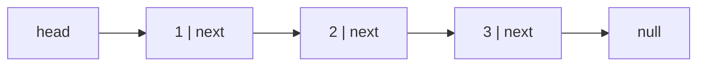
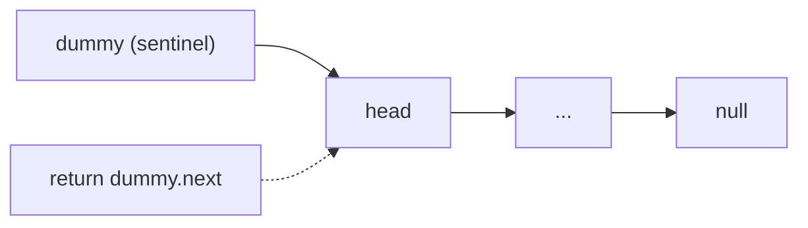
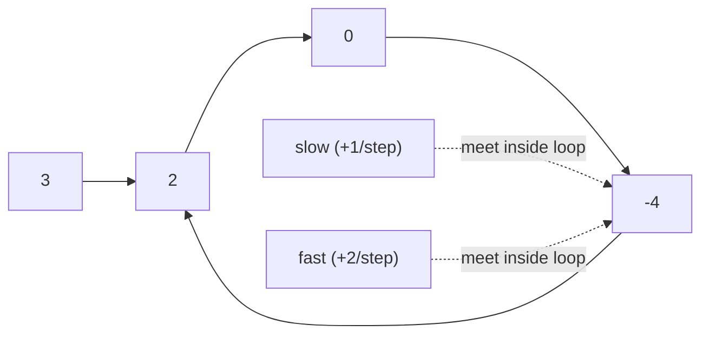
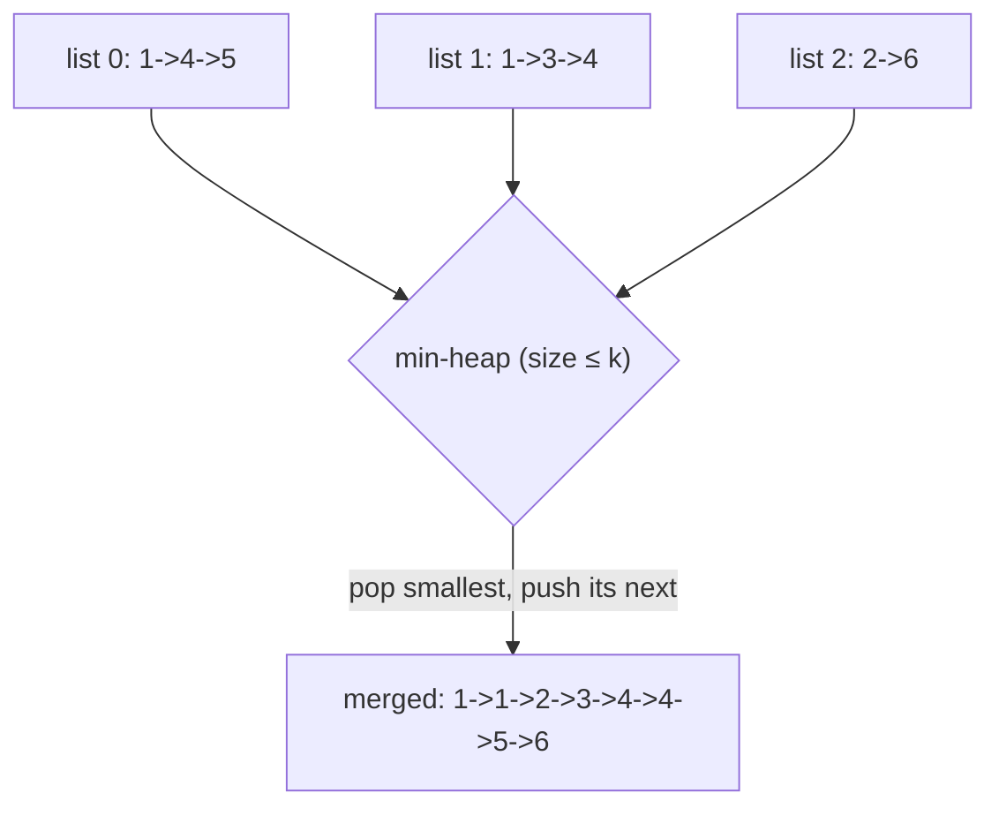
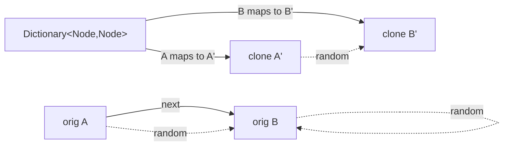
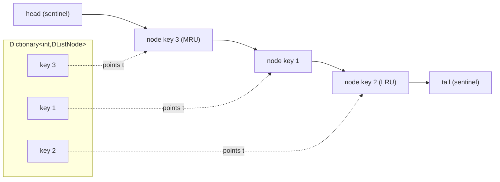

# Linked Lists (Reviewer)

A [linked list](algorithms-glossary-reviewer.md#linked-list "A chain of nodes each holding a value and a reference to the next node.") is a chain of [nodes](algorithms-glossary-reviewer.md#node "A container in a linked structure holding a value plus references to neighbors.") where each node holds a value and a [reference](algorithms-glossary-reviewer.md#pointer "A value that refers to the location of data rather than holding it directly.") (pointer) to the next
node — there is no contiguous backing [array](algorithms-glossary-reviewer.md#array "A fixed-size contiguous block of same-type elements accessed by position in O(1).") and no [index](algorithms-glossary-reviewer.md#index "The integer position of an element; 0-indexed starts at 0, 1-indexed at 1."). The trade is deliberate: you give up O(1)
random access to gain O(1) splice/insert/remove **once you hold the relevant node**. Interviewers love
linked lists precisely because they expose whether you can manipulate pointers correctly under
pressure: reverse a list in place, detect a [cycle](algorithms-glossary-reviewer.md#cycle "A path that starts and ends at the same vertex without reusing an edge.") with [two pointers](algorithms-glossary-reviewer.md#two-pointers "Two index variables moving through a sequence to solve it in one linear pass."), find the middle without a length
count, and stitch lists together — all with constant extra memory and no off-by-one slips.

The recurring tricks are few and reusable: a **[dummy/sentinel](algorithms-glossary-reviewer.md#dummy-node "A placeholder before a list's head that removes first-element special cases.") head** to erase head-of-list [edge cases](algorithms-glossary-reviewer.md#edge-case "An input at the boundary of valid or typical, where buggy code tends to break."),
**[in-place](algorithms-glossary-reviewer.md#in-place "Transforms its input using only O(1) extra memory, rearranging in place.") reversal** with a three-pointer `prev`/`curr`/`next` dance, and **[fast/slow (Floyd)](algorithms-glossary-reviewer.md#fast-and-slow-pointers "One pointer moves twice as fast as another, meeting only if a cycle exists.")
pointers** for cycles and midpoints. Master those four moves and the entire [LeetCode](algorithms-glossary-reviewer.md#leetcode "An online platform of coding-interview problems with an automated judge.") linked-list set
collapses into variations on a theme. This reviewer keeps complexity claims exact (most operations are
O(1) extra space) and every traced example shows real output.

Related: [Algorithm Patterns Index](algorithm-patterns-index-reviewer.md) · [Two Pointers](two-pointers-reviewer.md) · [Heaps & Priority Queues](heaps-and-priority-queues-reviewer.md) · [Stacks & Monotonic Stacks](stacks-and-monotonic-stacks-reviewer.md) · [Collections & Big-O](../dotnet/csharp/collections-and-big-o-reviewer.md) · [Glossary](algorithms-glossary-reviewer.md)

## Contents
- [Node model and arrays vs linked lists](#node-model-and-arrays-vs-linked-lists)
- [The dummy/sentinel head trick](#the-dummysentinel-head-trick)
- [In-place reversal](#in-place-reversal)
- [Fast/slow pointers (Floyd)](#fastslow-pointers-floyd)
- [Find the middle node](#find-the-middle-node)
- [Merge two sorted lists](#merge-two-sorted-lists)
- [Merge k sorted lists](#merge-k-sorted-lists)
- [Remove Nth node from end](#remove-nth-node-from-end)
- [Reorder list](#reorder-list)
- [Add two numbers](#add-two-numbers)
- [Copy list with random pointer](#copy-list-with-random-pointer)
- [LRU Cache](#lru-cache)
- [Pitfalls](#pitfalls)
- [Pattern cheat-sheet](#pattern-cheat-sheet)
- [Interview Q&A](#interview-qa)
- [Rapid-fire round](#rapid-fire-round)
- [Exam-style questions](#exam-style-questions)
- [30-second takeaway](#30-second-takeaway)
- [Quick recall checklist](#quick-recall-checklist)
- [References](#references)

---

## Node model and arrays vs linked lists

A [singly linked](algorithms-glossary-reviewer.md#singly-and-doubly-linked-list "Singly lists point only forward; doubly lists also point backward.") node stores a value and one forward pointer; a doubly linked node also stores a
backward pointer. LeetCode uses the singly linked `ListNode` below — memorize it, you will type it
constantly.

Key points:

- A **singly** linked list lets you traverse forward only; a **doubly** linked list (each node has
  `Prev` and `Next`) lets you traverse and splice in both directions, which is what makes O(1) removal
  given a node possible without a scan to find the predecessor.
- `head` is the entry point. The list ends where `Next` is `null`. An empty list is `head == null`.
- Unlike `List<T>` (array-backed, O(1) index), a linked list has **no index**: reaching position *k* is
  O(k). You pay for the splice flexibility with lost random access and poor cache locality.
- The .NET BCL ships `LinkedList<T>` / `LinkedListNode<T>` (doubly linked) — see
  [Collections & Big-O](../dotnet/csharp/collections-and-big-o-reviewer.md) for why it is rarely the
  right production choice. Interview problems hand-roll the node instead.

```csharp
// LeetCode-style singly linked node (this is the canonical definition).
public class ListNode
{
    public int val;
    public ListNode next;
    public ListNode(int val = 0, ListNode next = null)
    {
        this.val = val;
        this.next = next;
    }
}

// Doubly linked node (used for LRU Cache and any O(1) two-way splice).
public class DListNode
{
    public int key, val;
    public DListNode prev, next;
    public DListNode(int key = 0, int val = 0) { this.key = key; this.val = val; }
}
```

| Operation | Array / `List<T>` | Singly linked list | Doubly linked list |
| --- | --- | --- | --- |
| Access by index *k* | O(1) | O(k) | O(k) |
| Search by value | O(n) | O(n) | O(n) |
| Insert/remove at head | O(n) (shift) | **O(1)** | **O(1)** |
| Insert/remove at tail | O(1) amortized (no tail ptr: O(n)) | O(n) without tail ptr; O(1) with one | O(1) with tail ptr |
| Insert/remove given a node | O(n) (shift) | O(1) if you hold predecessor | **O(1)** |
| Memory locality | Contiguous (cache-friendly) | Pointer-chasing | Pointer-chasing + extra ptr |

*Note the trap in row "insert/remove given a node": a singly linked list still needs the **predecessor**
to relink, so it is only truly O(1) when you already hold it (or you splice the next node's value
forward).*



*A singly linked list: each node points only forward, and the chain terminates at `null`.*

## The dummy/sentinel head trick

A dummy (sentinel) node is a throwaway node placed **before** the real head. You build/relink off
`dummy.next`, then return `dummy.next` at the end. It removes the special case where the operation
touches the first node, because the dummy is always a valid, non-null predecessor.

Key points:

- Use a dummy whenever the head itself might be inserted, deleted, or reassigned — merge, remove-Nth,
  partition, remove-duplicates, add-two-numbers. It turns "is this the head?" branches into ordinary
  cases.
- Keep a `tail`/`curr` pointer starting at `dummy`; advance it as you append. The final list is
  `dummy.next` (never `dummy` itself).
- Cost is one extra node — O(1) space — for a large drop in edge-case bugs.

```csharp
// Without a dummy you must special-case deleting the head; with one you don't.
public ListNode RemoveAllValue(ListNode head, int target)
{
    var dummy = new ListNode(0, head);   // dummy.next == head
    ListNode prev = dummy;
    while (prev.next != null)
    {
        if (prev.next.val == target)
            prev.next = prev.next.next;  // splice out; works even for the head
        else
            prev = prev.next;
    }
    return dummy.next;                    // new head (head may itself have been removed)
}
```



*The sentinel is a stable predecessor of the real head, so head deletion/insertion needs no special branch.*

## In-place reversal

Reversing flips every `next` pointer to point backward, using three pointers and **O(1)** extra space.
The single most common linked-list interview move (LC 206 — Reverse Linked List). The recurring hazard:
you must save `curr.next` **before** you overwrite it, or you lose the rest of the list.

Key points:

- Iterative: walk with `prev`, `curr`; each step save `next = curr.next`, point `curr.next = prev`,
  then advance `prev = curr`, `curr = next`. When `curr` is `null`, `prev` is the new head.
- Time **O(n)**, space **O(1)** iterative. Recursive is also O(n) time but **O(n) space** for the
  [call stack](algorithms-glossary-reviewer.md#call-stack "Memory tracking active function calls; each call pushes a frame, popped on return.") — call that out; [recursion](algorithms-glossary-reviewer.md#recursion "A function solving a problem by calling itself on smaller versions of it.") is *not* constant space here.
- Practice lives under `two-pointers/same-direction` in spirit (two cursors moving in lockstep), though
  reversal is its own staple.

```csharp
// Iterative reverse — O(n) time, O(1) space.
public ListNode ReverseList(ListNode head)
{
    ListNode prev = null, curr = head;
    while (curr != null)
    {
        ListNode next = curr.next; // SAVE before overwriting — the #1 pitfall
        curr.next = prev;          // flip the link
        prev = curr;               // advance prev
        curr = next;               // advance curr
    }
    return prev;                   // prev is the new head
}

// Recursive reverse — O(n) time, O(n) stack space.
public ListNode ReverseListRecursive(ListNode head)
{
    if (head == null || head.next == null) return head; // base case
    ListNode newHead = ReverseListRecursive(head.next);
    head.next.next = head; // make the next node point back to me
    head.next = null;      // sever my old forward link
    return newHead;        // the deepest node is the new head, passed up unchanged
}
```

```text
reverse 1 -> 2 -> 3 -> 4 -> null      (prev starts null, curr at 1)

start:   prev=null   curr=1 -> 2 -> 3 -> 4 -> null
step 1:  next=2 ; 1.next=null
         null <- 1   prev=1   curr=2 -> 3 -> 4 -> null
step 2:  next=3 ; 2.next=1
         null <- 1 <- 2   prev=2   curr=3 -> 4 -> null
step 3:  next=4 ; 3.next=2
         null <- 1 <- 2 <- 3   prev=3   curr=4 -> null
step 4:  next=null ; 4.next=3
         null <- 1 <- 2 <- 3 <- 4   prev=4   curr=null  (loop ends)

return prev = 4 -> 3 -> 2 -> 1 -> null
```

*Each step rewires one arrow backward; `prev` trails the reversed prefix and is returned as the new head.*

## Fast/slow pointers (Floyd)

Two pointers advancing at different speeds — `slow` one node per step, `fast` two — solve cycle
detection and midpoint finding in **O(n)** time and **O(1)** space. This is Floyd's tortoise-and-hare
algorithm.

Key points:

- **Cycle detection (LC 141 — Linked List Cycle):** if there is a cycle, `fast` laps `slow` and they
  meet inside the loop. If `fast` reaches `null` (or `fast.next` is `null`), the list is acyclic.
- **Why they must meet:** once both are inside the cycle, each step closes the gap between them by
  exactly one node, so the gap eventually hits zero — they cannot jump past each other.
- **Finding the cycle start:** after they meet, reset one pointer to `head` and advance both **one**
  step at a time; they meet again exactly at the cycle's entry node (a consequence of the distance
  identity: head-to-entry equals meeting-point-to-entry, modulo the loop length).
- Guard the loop condition as `while (fast != null && fast.next != null)` so `fast.next.next` never
  dereferences `null`.

```csharp
public bool HasCycle(ListNode head)
{
    ListNode slow = head, fast = head;
    while (fast != null && fast.next != null)
    {
        slow = slow.next;        // +1
        fast = fast.next.next;   // +2
        if (slow == fast) return true; // reference equality — they meet
    }
    return false; // fast fell off the end -> no cycle
}

// Return the node where the cycle begins, or null if acyclic.
public ListNode DetectCycle(ListNode head)
{
    ListNode slow = head, fast = head;
    while (fast != null && fast.next != null)
    {
        slow = slow.next;
        fast = fast.next.next;
        if (slow == fast)                 // meeting point inside the loop
        {
            ListNode p = head;
            while (p != slow) { p = p.next; slow = slow.next; } // both +1
            return p;                     // cycle entry
        }
    }
    return null;
}
```



*Tortoise and hare both circulate the cycle; the hare gains one node per step and is guaranteed to collide with the tortoise.*

## Find the middle node

Run `fast` two steps for every one of `slow`; when `fast` runs off the end, `slow` sits at the middle
(LC 876 — Middle of the Linked List). For an **even** length the BCL/LeetCode convention returns the
**second** of the two middles, which this loop produces.

Key points:

- Init both at `head`; loop `while (fast != null && fast.next != null)`. This returns the **upper**
  middle for even lengths (e.g. for 1→2→3→4 it returns node 3).
- To get the **first** middle instead (needed by Reorder List so the first half is the longer or equal
  half), start `fast = head.next`, or stop when `fast.next` / `fast.next.next` is null. Pick the variant
  the problem needs and trace it.
- O(n) time, O(1) space; one pass, no length precount.

```csharp
// Returns the SECOND middle for even length (LC 876 convention).
public ListNode MiddleNode(ListNode head)
{
    ListNode slow = head, fast = head;
    while (fast != null && fast.next != null)
    {
        slow = slow.next;
        fast = fast.next.next;
    }
    return slow;
}
```

```text
ODD length: 1 -> 2 -> 3 -> 4 -> 5 -> null
 step 0:  slow=1            fast=1
 step 1:  slow=2            fast=3
 step 2:  slow=3            fast=5       (fast.next == null -> stop)
 middle = slow = 3                       (true center)

EVEN length: 1 -> 2 -> 3 -> 4 -> null
 step 0:  slow=1            fast=1
 step 1:  slow=2            fast=3
 step 2:  slow=3            fast=null    (fast == null -> stop)
 middle = slow = 3                       (SECOND of the two middles, per LC 876)
```

*Fast moves twice as fast, so it reaches the end when slow reaches the middle; even length lands slow on the upper-middle node.*

## Merge two sorted lists

Splice two sorted lists into one sorted list by repeatedly attaching the smaller head (LC 21 — Merge Two
Sorted Lists). A dummy head makes the append loop uniform. This is the building block for merge-k.

Key points:

- Keep a `tail` at the dummy; at each step append the smaller of `l1.val` / `l2.val`, advance that list.
- When one list empties, **attach the remaining list wholesale** — it is already sorted, no need to walk
  it node by node.
- Time **O(n + m)**, space **O(1)** (you relink existing nodes; no new nodes). This complements the
  practice under `heap/merge-k-lists` where merge-two is the inner step.

```csharp
public ListNode MergeTwoLists(ListNode l1, ListNode l2)
{
    var dummy = new ListNode();
    ListNode tail = dummy;
    while (l1 != null && l2 != null)
    {
        if (l1.val <= l2.val) { tail.next = l1; l1 = l1.next; }
        else                  { tail.next = l2; l2 = l2.next; }
        tail = tail.next;
    }
    tail.next = (l1 != null) ? l1 : l2; // attach the non-empty remainder
    return dummy.next;
}
```

```text
l1 = 1 -> 2 -> 4        l2 = 1 -> 3 -> 4        dummy -> (tail here)

compare 1 vs 1  -> take l1(1)   result: 1
compare 2 vs 1  -> take l2(1)   result: 1 -> 1
compare 2 vs 3  -> take l1(2)   result: 1 -> 1 -> 2
compare 4 vs 3  -> take l2(3)   result: 1 -> 1 -> 2 -> 3
compare 4 vs 4  -> take l1(4)   result: 1 -> 1 -> 2 -> 3 -> 4   (l1 empty)
attach remainder l2 = 4         result: 1 -> 1 -> 2 -> 3 -> 4 -> 4

return dummy.next = 1 -> 1 -> 2 -> 3 -> 4 -> 4
```

*Always extend the merged tail with the smaller head; the `<=` keeps the merge [stable](algorithms-glossary-reviewer.md#stable-sort "A sort that preserves the relative order of elements comparing equal."), and the leftover list is appended in one move.*

## Merge k sorted lists

Given *k* sorted lists with *N* total nodes, merge them all (LC 23 — Merge k Sorted Lists). Two standard
approaches: a [min-heap](algorithms-glossary-reviewer.md#min-heap-and-max-heap "A min-heap keeps the smallest at its root; a max-heap keeps the largest."), or pairwise [divide-and-conquer](algorithms-glossary-reviewer.md#divide-and-conquer "Split a problem into independent subproblems, solve each, then combine."). Both are **O(N log k)**.

Key points:

- **Min-heap ([PriorityQueue](algorithms-glossary-reviewer.md#priority-queue "Serves elements by priority rather than arrival; usually a heap.")):** push the head of each list keyed by its value; pop the smallest, append
  it, push its `next`. [Heap](algorithms-glossary-reviewer.md#heap "A tree structure keeping the smallest or largest element instantly accessible.") holds at most *k* nodes, so each of *N* pops/pushes is O(log k) → **O(N log
  k)** time, **O(k)** space.
- **Divide-and-conquer:** pair up lists and merge-two them, halving the count each round (log k rounds),
  each round touching all *N* nodes → **O(N log k)** time, **O(1)** extra (or O(log k) recursion stack).
- Naive "merge them one at a time into an accumulator" is **O(N·k)** — call this out as the trap.
- See [Heaps & Priority Queues](heaps-and-priority-queues-reviewer.md) for the heap mechanics; practice
  this in `heap/merge-k-lists`.

```csharp
using System.Collections.Generic;

public ListNode MergeKLists(ListNode[] lists)
{
    // Min-heap keyed by node value; PriorityQueue<TElement,TPriority> is a min-heap by default.
    var pq = new PriorityQueue<ListNode, int>();
    foreach (ListNode node in lists)
        if (node != null) pq.Enqueue(node, node.val);

    var dummy = new ListNode();
    ListNode tail = dummy;
    while (pq.Count > 0)
    {
        ListNode smallest = pq.Dequeue();   // O(log k)
        tail.next = smallest;
        tail = tail.next;
        if (smallest.next != null)
            pq.Enqueue(smallest.next, smallest.next.val); // O(log k)
    }
    return dummy.next;
}
```



*The heap always holds one frontier node per list, so popping the global minimum k·... times yields the fully sorted merge in O(N log k).*

## Remove Nth node from end

Remove the *n*-th node counting from the tail in one pass using a fixed **gap of n** between two
pointers (LC 19 — Remove Nth Node From End of List). A dummy head handles the case where the head itself
is removed.

Key points:

- Put both pointers at a dummy before the head. Advance `fast` *n* steps first, opening an *n*-node gap.
- Then move `fast` and `slow` together until `fast` reaches the **last** node (`fast.next == null`). Now
  `slow` sits just before the target, so `slow.next = slow.next.next` splices it out.
- Time **O(n)** (single pass), space **O(1)**. The dummy is what makes removing the original head a
  non-special case.

```csharp
public ListNode RemoveNthFromEnd(ListNode head, int n)
{
    var dummy = new ListNode(0, head);
    ListNode fast = dummy, slow = dummy;
    for (int i = 0; i < n; i++) fast = fast.next; // open an n-node gap
    while (fast.next != null) { fast = fast.next; slow = slow.next; }
    slow.next = slow.next.next;                    // splice out the n-th-from-end
    return dummy.next;
}
```

```text
remove n = 2 from   1 -> 2 -> 3 -> 4 -> 5      (dummy in front)

dummy -> 1 -> 2 -> 3 -> 4 -> 5 -> null
  S/F at dummy

advance fast n=2 steps:
dummy -> 1 -> 2 -> 3 -> 4 -> 5
S             F                      gap of 2 nodes between S and F

move both until fast.next == null:
dummy -> 1 -> 2 -> 3 -> 4 -> 5
         S         F
dummy -> 1 -> 2 -> 3 -> 4 -> 5
                   S         F       (fast.next == null -> stop)
S is at node 3 (predecessor of target 4)
splice: 3.next = 3.next.next  -> drops node 4

result: 1 -> 2 -> 3 -> 5
```

*The constant n-gap means when fast hits the last node, slow is exactly the predecessor of the node to delete — one pass, no length count.*

## Reorder list

Reorder `L0→L1→…→Ln-1→Ln` into `L0→Ln→L1→Ln-1→…` in place (LC 143 — Reorder List). Three reusable
sub-moves: find the middle, reverse the second half, then weave the two halves together.

Key points:

- **Find middle** (use the variant that leaves the first half the same length or one longer), **split**
  there, **reverse** the second half, then **merge alternately**.
- All three sub-steps are O(n) time and O(1) space, so the whole thing is **O(n)** time, **O(1)** space.
- Use the first-middle midpoint here: for even length you want the first half to not be shorter, so the
  weave consumes both halves cleanly.

```csharp
public void ReorderList(ListNode head)
{
    if (head == null || head.next == null) return;

    // 1) Find the end of the first half (slow stops at first-middle for even length).
    ListNode slow = head, fast = head;
    while (fast.next != null && fast.next.next != null)
    {
        slow = slow.next;
        fast = fast.next.next;
    }

    // 2) Reverse the second half (starts at slow.next), then cut the first half.
    ListNode second = slow.next;
    slow.next = null;
    ListNode prev = null;
    while (second != null)
    {
        ListNode next = second.next;
        second.next = prev;
        prev = second;
        second = next;
    }
    second = prev; // head of the reversed second half

    // 3) Weave: first, second, first, second, ...
    ListNode first = head;
    while (second != null)
    {
        ListNode t1 = first.next, t2 = second.next;
        first.next = second;
        second.next = t1;
        first = t1;
        second = t2;
    }
}
```

```text
input: 1 -> 2 -> 3 -> 4 -> 5

find middle (first-middle):  first half 1 -> 2 -> 3 ,  second half 4 -> 5
reverse second half:         5 -> 4
weave:
   take 1, then 5   -> 1 -> 5
   take 2, then 4   -> 1 -> 5 -> 2 -> 4
   take 3 (second empty) -> 1 -> 5 -> 2 -> 4 -> 3

result: 1 -> 5 -> 2 -> 4 -> 3
```

*Reorder is just three primitives chained — midpoint, reverse, alternate-merge — each O(n)/O(1).*

## Add two numbers

Two non-empty lists hold a number's digits in **reverse** order (least-significant first); add them and
return the sum as a list (LC 2 — Add Two Numbers). The reversed storage is exactly what makes column
addition with a carry trivial — you walk both lists head-first.

Key points:

- Walk both lists in lockstep with a running `carry`. At each step `sum = a + b + carry`; the new digit
  is `sum % 10`, the new carry is `sum / 10`.
- Continue while **either** list has nodes **or** there is a leftover carry (so 5 + 5 → 0 → 1 produces a
  final `1` node).
- Time **O(max(n, m))**, space **O(max(n, m))** for the result list. A dummy head keeps the append loop
  clean.

```csharp
public ListNode AddTwoNumbers(ListNode l1, ListNode l2)
{
    var dummy = new ListNode();
    ListNode tail = dummy;
    int carry = 0;
    while (l1 != null || l2 != null || carry != 0)
    {
        int a = l1?.val ?? 0;
        int b = l2?.val ?? 0;
        int sum = a + b + carry;
        carry = sum / 10;
        tail.next = new ListNode(sum % 10);
        tail = tail.next;
        l1 = l1?.next;
        l2 = l2?.next;
    }
    return dummy.next;
}
```

```text
342 + 465  stored reversed:   l1 = 2 -> 4 -> 3 ,  l2 = 5 -> 6 -> 4

pos 0:  2 + 5 + carry0 = 7   digit 7  carry 0   -> 7
pos 1:  4 + 6 + carry0 = 10  digit 0  carry 1   -> 7 -> 0
pos 2:  3 + 4 + carry1 = 8   digit 8  carry 0   -> 7 -> 0 -> 8
done (both null, carry 0)

result = 7 -> 0 -> 8   reads as 807 = 342 + 465
```

*Reverse-digit storage turns big-integer addition into a single forward pass with a carry; the loop also runs once more if a final carry remains.*

## Copy list with random pointer

Deep-copy a list where each node has a `next` and a `random` pointer (to any node or `null`) — LC 138 —
Copy List with Random Pointer. The challenge is that `random` can point anywhere, so you need a way to
map each original node to its clone before wiring `random`.

Key points:

- **[Hash-map](algorithms-glossary-reviewer.md#hash-map "Stores key-value pairs and retrieves a value by key in O(1) average time.") approach (clearest):** pass 1 builds a `Dictionary<Node, Node>` mapping each original to a
  fresh clone; pass 2 wires `clone.next = map[orig.next]` and `clone.random = map[orig.random]`. Time
  **O(n)**, space **O(n)** for the map.
- An O(1)-space alternative interleaves clones between originals, but the hash-map version is the one to
  reach for first and explain.
- Guard `null` lookups: map `null` to `null` (using `TryGetValue` or seeding the dictionary) so a
  `random` of `null` copies correctly.

```csharp
using System.Collections.Generic;

public class Node
{
    public int val;
    public Node next;
    public Node random;
    public Node(int val) { this.val = val; }
}

public Node CopyRandomList(Node head)
{
    if (head == null) return null;
    var map = new Dictionary<Node, Node>();

    // Pass 1: clone every node, value only.
    for (Node cur = head; cur != null; cur = cur.next)
        map[cur] = new Node(cur.val);

    // Pass 2: wire next and random via the map (null maps to null).
    for (Node cur = head; cur != null; cur = cur.next)
    {
        map[cur].next   = cur.next   != null ? map[cur.next]   : null;
        map[cur].random = cur.random != null ? map[cur.random] : null;
    }
    return map[head];
}
```



*The map lets pass 2 translate any original pointer — including the arbitrary `random` — into the corresponding clone in O(1).*

## LRU Cache

A Least-Recently-Used cache supports `get` and `put` in **O(1)** by combining a hash map (key → node)
with a **doubly linked list** ordered by recency: most-recent at the head, least-recent at the tail (LC
146 — LRU Cache). On capacity overflow you evict the tail.

Key points:

- The **hash map** gives O(1) lookup to the node; the **doubly linked list** gives O(1) move-to-front
  and O(1) tail eviction (you need `prev` to unlink in O(1), which is why it must be doubly linked).
- On `get`: if present, unlink the node and move it to the head (most recent), return its value; else
  return -1.
- On `put`: if the key exists, update and move to head; else insert at head and, if over capacity, evict
  the tail node and remove its key from the map.
- Use **sentinel `head` and `tail`** dummy nodes so insert/remove never hit `null` neighbors — no
  edge-case branches. The real most-recent node is `head.next`; the real LRU is `tail.prev`.

```csharp
using System.Collections.Generic;

public class LRUCache
{
    private readonly int _capacity;
    private readonly Dictionary<int, DListNode> _map = new();
    private readonly DListNode _head = new(); // sentinel: most-recent side
    private readonly DListNode _tail = new(); // sentinel: least-recent side

    public LRUCache(int capacity)
    {
        _capacity = capacity;
        _head.next = _tail;
        _tail.prev = _head;
    }

    public int Get(int key)
    {
        if (!_map.TryGetValue(key, out DListNode node)) return -1;
        Remove(node);
        InsertFront(node);
        return node.val;
    }

    public void Put(int key, int value)
    {
        if (_map.TryGetValue(key, out DListNode existing))
        {
            existing.val = value;
            Remove(existing);
            InsertFront(existing);
            return;
        }
        if (_map.Count == _capacity)
        {
            DListNode lru = _tail.prev; // least-recently used
            Remove(lru);
            _map.Remove(lru.key);
        }
        var node = new DListNode(key, value);
        _map[key] = node;
        InsertFront(node);
    }

    private void Remove(DListNode n)
    {
        n.prev.next = n.next;
        n.next.prev = n.prev;
    }

    private void InsertFront(DListNode n)
    {
        n.next = _head.next;
        n.prev = _head;
        _head.next.prev = n;
        _head.next = n;
    }
}
```



*The map jumps straight to any node in O(1); the doubly linked list keeps recency order so move-to-front and tail-eviction are both O(1).*

## Pitfalls

Key points:

- **Losing the rest of the list:** when reversing or relinking, save `curr.next` into a temp **before**
  you overwrite `curr.next`. Overwrite first and the tail is gone forever.
- **Null dereference in fast/slow:** the loop guard must be `fast != null && fast.next != null`;
  evaluating `fast.next.next` after `fast` or `fast.next` is `null` throws.
- **Even/odd midpoint confusion:** the standard `slow/fast` loop returns the **second** middle for even
  length. Reorder List wants the **first** middle — use the `fast.next && fast.next.next` guard there.
  Always trace both an odd and an even example.
- **Forgetting the dummy on head changes:** any operation that may delete or replace the head (remove-Nth,
  merge, remove-value) is far simpler with a sentinel; without one you hand-write a head special case and
  usually get it wrong.
- **Carry / leftover not handled:** Add Two Numbers must keep looping while a final carry exists, or
  `5 + 5` loses its leading `1`.
- **Creating a cycle by accident:** when you splice (`a.next = b`) without nulling a now-dangling link
  you can form a loop; in Reorder List you must set `slow.next = null` to cut the first half.
- **Singly vs doubly for O(1) removal:** removing a known node in O(1) needs the predecessor — only a
  doubly linked list (or holding the predecessor) gives true O(1). This is why LRU uses a doubly linked
  list.

## Pattern cheat-sheet

| Problem (LC) | Technique | Time | Extra space |
| --- | --- | --- | --- |
| LC 206 — Reverse Linked List | `prev`/`curr`/`next` reversal | O(n) | O(1) iter / O(n) rec |
| LC 21 — Merge Two Sorted Lists | dummy head + splice smaller | O(n + m) | O(1) |
| LC 141 — Linked List Cycle | Floyd fast/slow | O(n) | O(1) |
| LC 876 — Middle of the Linked List | fast/slow midpoint | O(n) | O(1) |
| LC 19 — Remove Nth Node From End | two pointers, n-gap + dummy | O(n) | O(1) |
| LC 143 — Reorder List | midpoint + reverse + weave | O(n) | O(1) |
| LC 2 — Add Two Numbers | lockstep walk + carry | O(max(n, m)) | O(max(n, m)) |
| LC 138 — Copy List with Random Pointer | hash map of clones | O(n) | O(n) |
| LC 146 — LRU Cache | hash map + doubly linked list | O(1) per op | O(capacity) |
| LC 23 — Merge k Sorted Lists | min-heap or D&C of merge-two | O(N log k) | O(k) heap / O(1) D&C |

*N is the total node count across all lists; k is the number of lists.*

## Interview Q&A

### Fundamentals

Q: When does a linked list beat an array, and when does it lose?
A: It beats an array for O(1) insert/remove at the head or at a node you already hold (no element
shifting), and when you never need random access. It loses for index access (O(k) vs O(1)) and cache
locality — pointer-chasing across the heap is slow, so for most realistic workloads a `List<T>` wins.

Q: Why does in-place reversal need three pointers?
A: You need `prev` (where the flipped link should point), `curr` (the node being rewired), and a saved
`next` (the rest of the list) — because rewriting `curr.next = prev` destroys the only reference to the
remainder, so you must capture it first.

Q: Iterative vs recursive reversal — any complexity difference?
A: Both are O(n) time. Iterative is O(1) space; recursive is O(n) space because of the call stack. So
recursion is *not* the constant-space solution despite looking elegant.

### Fast/slow pointers

Q: Why are two pointers guaranteed to meet if there's a cycle?
A: Once both are inside the loop, the hare gains exactly one node on the tortoise each step, so the gap
between them shrinks by one per step and eventually reaches zero. They cannot leap over each other
because movement is one node at a time relative to each other.

Q: After the fast/slow pointers meet, how do you find the cycle's start?
A: Reset one pointer to `head`, keep the other at the meeting point, then advance both one step at a
time. They meet at the cycle entry, because the distance from the head to the entry equals the distance
from the meeting point to the entry (mod the loop length).

Q: For even length, which middle does the standard `slow/fast` loop return?
A: The second of the two middle nodes (for 1→2→3→4 it returns node 3). To get the first middle, start
`fast` at `head.next` or stop on `fast.next.next == null`.

### Merging and structures

Q: Why is merge-k-lists O(N log k) and not O(N log N)?
A: A min-heap holds at most k frontier nodes (one per list), so each of the N enqueue/dequeue operations
is O(log k). Summed over all N nodes that's O(N log k). It is not O(N log N) because the heap size is
bounded by k, not N.

Q: Why must an LRU cache use a doubly linked list rather than a singly linked one?
A: Eviction and move-to-front require unlinking a node in O(1), which needs the node's predecessor.
Only a doubly linked node carries a `prev` pointer, so the splice is O(1); a singly linked list would
need an O(n) scan to find the predecessor.

Q: In Copy List with Random Pointer, why can't you wire `random` in a single pass?
A: A `random` pointer can target a node that hasn't been cloned yet (it appears later in the list). You
first clone every node so each original has a known clone, then translate the pointers in a second pass.

## Rapid-fire round

- Reverse a list space cost (iterative) -> **O(1)**
- Reverse a list space cost (recursive) -> **O(n) call stack**
- Save before overwriting in reversal -> **`next = curr.next` first**
- Fast/slow loop guard -> **`fast != null && fast.next != null`**
- Cycle detection algorithm -> **Floyd's tortoise and hare**
- Find cycle start after meeting -> **reset one pointer to head, advance both by 1**
- Even-length midpoint (LC 876) -> **the second middle**
- Merge two sorted lists time -> **O(n + m)**
- Leftover after one list empties in merge -> **attach the whole remaining list**
- Merge k lists with a heap -> **O(N log k), O(k) space**
- Remove Nth from end technique -> **two pointers with an n-node gap + dummy**
- Add Two Numbers digit order -> **reversed (least-significant first)**
- Keep looping in Add Two Numbers while -> **either list nonempty OR carry != 0**
- Copy random pointers -> **`Dictionary<Node,Node>` original to clone**
- LRU get/put complexity -> **O(1) each**
- LRU data structures -> **hash map + doubly linked list**
- Why doubly linked for LRU -> **O(1) unlink needs `prev`**
- Sentinel head benefit -> **removes head-of-list edge cases**
- Reorder List sub-steps -> **find middle, reverse second half, weave**

## Exam-style questions

1. What does this print?

```csharp
ListNode head = new(1, new(2, new(3, new(4))));
ListNode r = new Solution().ReverseList(head); // standard iterative reverse
for (ListNode n = r; n != null; n = n.next) Console.Write(n.val + " ");
```

**Answer:** `4 3 2 1`. Iterative reversal flips every `next`; `prev` ends on the old tail (node 4),
which becomes the new head. Space is O(1).

2. Does this correctly detect the middle of an even-length list, and what does it return for
   `1 -> 2 -> 3 -> 4`?

```csharp
ListNode slow = head, fast = head;
while (fast != null && fast.next != null) { slow = slow.next; fast = fast.next.next; }
return slow;
```

**Answer:** Yes, it is correct, and it returns node **3** — the *second* of the two middles. After two
iterations `fast` becomes `null` and `slow` has advanced to node 3. If the problem wanted the first
middle (node 2), you would start `fast = head.next` or stop on `fast.next.next == null`.

3. Why might this "remove Nth from end" crash or misbehave for `head = [1], n = 1`?

```csharp
ListNode fast = head, slow = head;          // no dummy
for (int i = 0; i < n; i++) fast = fast.next;
while (fast.next != null) { fast = fast.next; slow = slow.next; }
slow.next = slow.next.next;
return head;
```

**Answer:** It removes the wrong node / returns a stale head. With no dummy and `n` equal to the length,
`fast` becomes `null` after the first loop, so `fast.next` throws a `NullReferenceException`. Even when
it doesn't throw, deleting the head can't be expressed as `slow.next = slow.next.next`. The fix is to
start both pointers at a **dummy** node and return `dummy.next`.

4. What is the time and space complexity of merging k sorted lists with a min-heap, where N is the total
   number of nodes and k is the number of lists?

**Answer:** **O(N log k)** time and **O(k)** space. The heap holds at most one frontier node per list
(k nodes), so each of the N enqueue/dequeue operations costs O(log k). The naive accumulate-one-at-a-time
approach is O(N·k) — strictly worse.

5. What does this LRU sequence return on the final `Get`?

```csharp
var c = new LRUCache(2);
c.Put(1, 1);
c.Put(2, 2);
c.Get(1);     // touches key 1 -> 1 becomes most recent
c.Put(3, 3);  // capacity 2 exceeded -> evict LRU
int x = c.Get(2);
```

**Answer:** `-1`. After `Get(1)`, the recency order is `1` (MRU), `2` (LRU). `Put(3,3)` overflows
capacity 2 and evicts the tail — key `2`. So `Get(2)` misses and returns `-1`, while `Get(1)` and
`Get(3)` would still hit.

## 30-second takeaway

> Linked lists trade O(1) random access for O(1) splicing once you hold a node. Four moves cover the
> whole topic: a **dummy/sentinel head** to kill head edge-cases, **`prev`/`curr`/`next` reversal**
> (O(1) space — recursion is O(n) stack), **fast/slow Floyd pointers** for cycle detection, cycle start,
> and midpoint, and **dummy-head merge** as the building block for merge-k (O(N log k) with a heap).
> Always save `next` before relinking, guard `fast != null && fast.next != null`, and reach for a hash
> map + doubly linked list when you need O(1) get/put (LRU).

## Quick recall checklist

- **Node:** value + `next` (singly) or `next`/`prev` (doubly); no index, reaching position k is O(k).
- **Dummy head:** stable predecessor of the real head; return `dummy.next`. Use for any head-changing op.
- **Reverse:** save `next` → flip `curr.next = prev` → advance; O(n) time, **O(1)** iter / **O(n)** rec.
- **Floyd:** slow +1, fast +2; meet ⇒ cycle. Reset to head + advance by 1 ⇒ cycle start. O(n)/O(1).
- **Midpoint:** standard loop returns the **second** middle for even length (LC 876).
- **Merge two:** dummy + append smaller head; attach remainder wholesale; O(n + m)/O(1).
- **Merge k:** min-heap of k frontier nodes ⇒ **O(N log k)**, O(k); or D&C of merge-two.
- **Remove Nth from end:** open an n-gap with `fast`, then move both; dummy handles head removal; O(n)/O(1).
- **Reorder:** middle → reverse second half → weave; O(n)/O(1).
- **Add Two Numbers:** reversed digits, walk with carry, loop while list-or-carry; O(max(n,m)) space.
- **Copy random:** `Dictionary<Node,Node>` original→clone, two passes; O(n)/O(n).
- **LRU:** hash map + **doubly** linked list, MRU at head, evict tail; O(1) get/put.

## References

- Wikipedia — [Linked list](https://en.wikipedia.org/wiki/Linked_list).
- Wikipedia — [Doubly linked list](https://en.wikipedia.org/wiki/Doubly_linked_list).
- Wikipedia — [Cycle detection (Floyd's tortoise and hare)](https://en.wikipedia.org/wiki/Cycle_detection).
- Wikipedia — [Cache replacement policies (LRU)](https://en.wikipedia.org/wiki/Cache_replacement_policies).
- Microsoft Learn — [`LinkedList<T>` Class](https://learn.microsoft.com/en-us/dotnet/api/system.collections.generic.linkedlist-1).
- Microsoft Learn — [`PriorityQueue<TElement,TPriority>` Class](https://learn.microsoft.com/en-us/dotnet/api/system.collections.generic.priorityqueue-2).
- NeetCode — [Roadmap](https://neetcode.io/roadmap).
- LeetCode — [Study Plans](https://leetcode.com/studyplan/).
