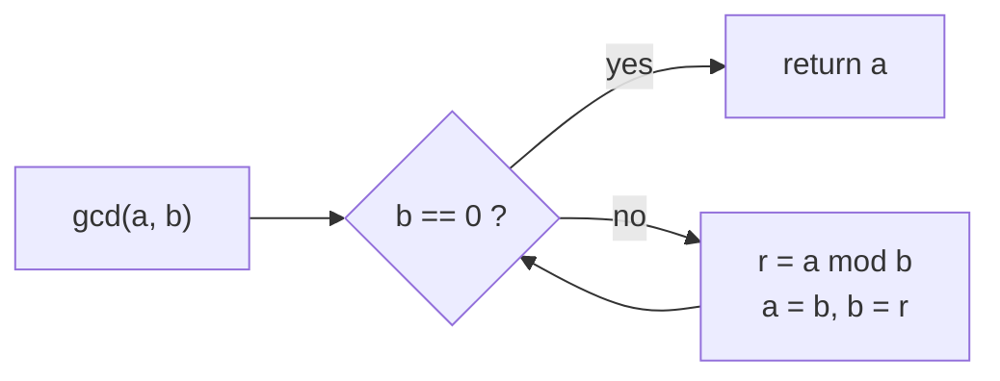
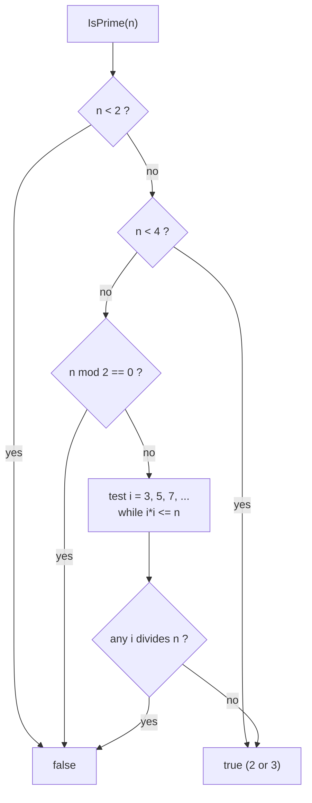
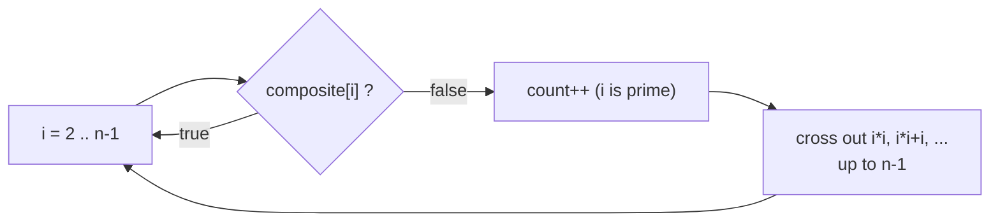
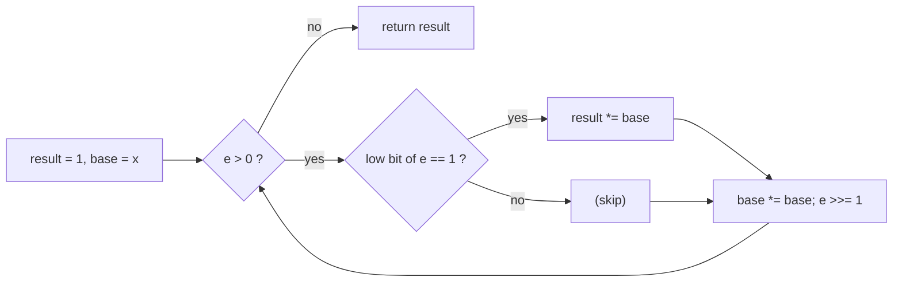
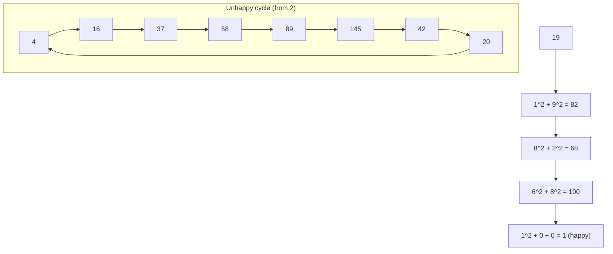
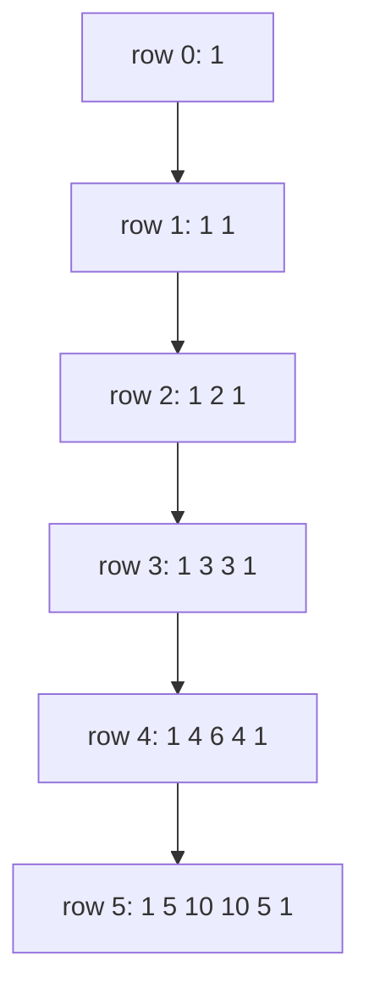
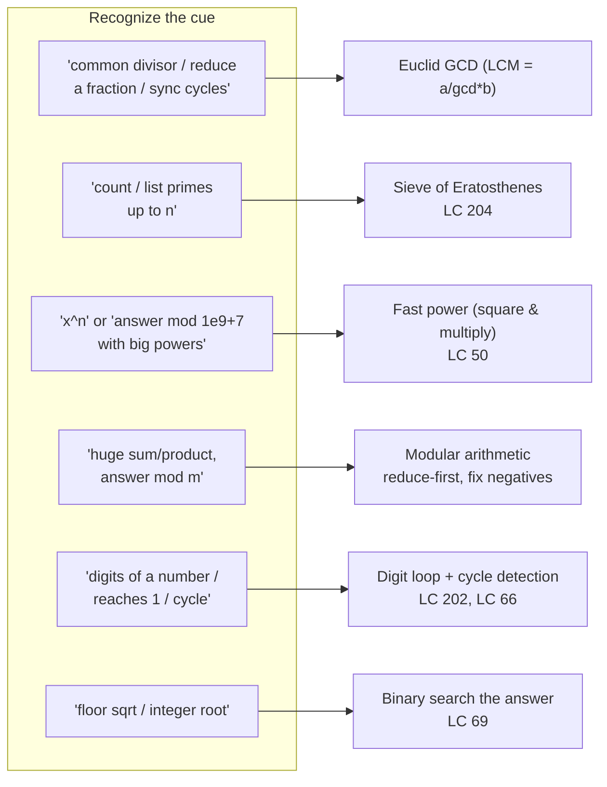

# Math & Number Theory (Reviewer)

Most "math" interview problems are not about clever identities — they are about three things: knowing
the right O(log n) trick (Euclid's [GCD](algorithms-glossary-reviewer.md#gcd "The largest integer that divides two numbers with no remainder."), fast exponentiation), knowing the right O(n log log n) sieve
for [primes](algorithms-glossary-reviewer.md#prime-number "An integer above 1 whose only positive divisors are 1 and itself."), and **not overflowing a 32-bit integer**. A surprising share of "wrong answer" submissions
in this category are correct [algorithms](algorithms-glossary-reviewer.md#algorithm "A precise, finite sequence of steps that turns an input into a desired output.") wrecked by an `int` multiply that silently wraps past
`int.MaxValue`, or a `%` that returns a negative remainder in C#. This reviewer treats [overflow](algorithms-glossary-reviewer.md#integer-overflow "A value exceeds its integer type's max and silently wraps to a wrong value.") and
[modular arithmetic](algorithms-glossary-reviewer.md#modulo-and-modular-arithmetic "The remainder after division, and doing math while always taking that remainder.") as first-class topics, not footnotes.

The toolkit is small and high-leverage. GCD via repeated remainder, primes via trial division up to
`sqrt(n)` and the [Sieve of Eratosthenes](algorithms-glossary-reviewer.md#sieve-of-eratosthenes "Finds all primes up to n by marking each prime's multiples as composite."), modular arithmetic with the `1_000_000_007` convention, and
[binary exponentiation](algorithms-glossary-reviewer.md#exponentiation-by-squaring "Computes base^exp in O(log exp) by squaring the base and halving the exponent.") (square-and-multiply) for both plain and modular powers. Layered on top are the
bread-and-butter digit tricks: extracting and reversing digits, digit sums, cycle detection on a digit
function (happy numbers), base conversion, and integer `sqrt` by binary search. Learn these cold and
the "easy/medium math" tier becomes free points.

Related: [Algorithm Patterns Index](algorithm-patterns-index-reviewer.md) · [Bit Manipulation](bit-manipulation-reviewer.md) · [Binary Search](binary-search-reviewer.md) · [Recursion & Divide and Conquer](recursion-and-divide-and-conquer-reviewer.md) · [Glossary](algorithms-glossary-reviewer.md)

## Contents
- [GCD via the Euclidean algorithm](#gcd-via-the-euclidean-algorithm)
- [LCM from GCD](#lcm-from-gcd)
- [Primes: trial division and primality](#primes-trial-division-and-primality)
- [Sieve of Eratosthenes](#sieve-of-eratosthenes)
- [Modular arithmetic and the 1e9+7 convention](#modular-arithmetic-and-the-1e97-convention)
- [Fast exponentiation by squaring](#fast-exponentiation-by-squaring)
- [Integer overflow in C#](#integer-overflow-in-c)
- [Digit manipulation and cycle detection](#digit-manipulation-and-cycle-detection)
- [Base conversion and place value](#base-conversion-and-place-value)
- [Integer sqrt by binary search](#integer-sqrt-by-binary-search)
- [Combinatorics basics](#combinatorics-basics)
- [Problem cue to tool map](#problem-cue-to-tool-map)
- [Interview Q&A](#interview-qa)
- [Rapid-fire round](#rapid-fire-round)
- [Exam-style questions](#exam-style-questions)
- [30-second takeaway](#30-second-takeaway)
- [Quick recall checklist](#quick-recall-checklist)
- [References](#references)

---

## GCD via the Euclidean algorithm

The greatest common divisor of `a` and `b` is the largest integer dividing both. Euclid's insight:
`gcd(a, b) == gcd(b, a mod b)`, because any common divisor of `a` and `b` also divides `a mod b` (and
vice versa). Repeatedly replacing `(a, b)` with `(b, a mod b)` shrinks the pair until the remainder is
0; the last non-zero value is the answer.

Key points:

- **[Recurrence](algorithms-glossary-reviewer.md#recurrence-relation "An algorithm's running time expressed in terms of its cost on smaller inputs."):** `gcd(a, 0) = a` and `gcd(a, b) = gcd(b, a mod b)` for `b != 0`. The remainder strictly
  decreases each step, so the process terminates.
- **Complexity is O(log min(a, b))** arithmetic operations. The classic bound: two successive remainders
  satisfy `a mod b < a / 2` whenever `b <= a`, so the larger value at least halves every two steps. The
  true [worst case](algorithms-glossary-reviewer.md#best-average-and-worst-case "How an algorithm's cost varies across the luckiest, typical, and hardest inputs.") is **consecutive Fibonacci numbers** (Lamé's theorem), still O(log) in the input size.
- **Space:** O(1) iterative, O(log) on the [call stack](algorithms-glossary-reviewer.md#call-stack "Memory tracking active function calls; each call pushes a frame, popped on return.") if written recursively.
- Use **`long`** when inputs can be large; the remainder operation itself never overflows for non-negative
  inputs, but callers often pass products that already overflowed.
- `gcd(0, x) = x` and `gcd(x, 0) = x` — both directions return the non-zero operand, which is the right
  identity for empty/edge inputs.

```csharp
// Iterative Euclidean GCD. Non-negative inputs. O(log min(a,b)) time, O(1) space.
public static long Gcd(long a, long b)
{
    while (b != 0)
    {
        long r = a % b;   // remainder strictly shrinks toward 0
        a = b;
        b = r;
    }
    return a;             // gcd(a, 0) == a
}
```

```text
gcd(48, 18)  — replace (a, b) with (b, a mod b) until b == 0

 step    a    b    a mod b
   1    48   18      48 % 18 = 12
   2    18   12      18 % 12 =  6
   3    12    6      12 %  6 =  0
   4     6    0      <- b == 0, stop

 answer = a = 6        (6 divides both 48 and 18, and no larger value does)
```

*Each row feeds the previous remainder back as the new `b`; the loop ends in 3 remainders — O(log) steps.*



*The Euclidean loop is a tiny state machine: while `b` is non-zero, slide `(a, b)` to `(b, a mod b)`.*

A recursive one-liner is equally valid and is the form most often written on a whiteboard:

```csharp
public static long GcdRec(long a, long b) => b == 0 ? a : GcdRec(b, a % b);
```

This is a standalone exam category, but the divide-and-shrink structure mirrors the [recursion](algorithms-glossary-reviewer.md#recursion "A function solving a problem by calling itself on smaller versions of it.") practiced
in `recursion/` — each call is a strictly smaller subproblem with an O(1) combine step.

## LCM from GCD

The [least common multiple](algorithms-glossary-reviewer.md#lcm "The smallest positive number that two integers both divide evenly into.") drops out of GCD: `lcm(a, b) = a * b / gcd(a, b)`. There is no separate
algorithm to learn.

Key points:

- **Divide before you multiply** to avoid overflow: write `a / gcd(a, b) * b`, not `a * b / gcd(a, b)`.
  The product `a * b` can overflow even when the LCM itself fits; `a / gcd` is exact (gcd divides `a`)
  and keeps the intermediate small.
- `lcm(0, x)` is defined as `0` by convention; guard it if your inputs allow zero, since `a / gcd * b`
  with `gcd = x` already yields `0` correctly here, but a zero `gcd` (only when both are 0) would divide
  by zero.

```csharp
// LCM via GCD. Divide first to keep the intermediate from overflowing.
public static long Lcm(long a, long b)
{
    if (a == 0 || b == 0) return 0;
    return a / Gcd(a, b) * b;   // a/gcd is exact, then scale by b
}
```

`Lcm(4, 6)` returns `12`: `gcd(4, 6) = 2`, so `4 / 2 * 6 = 2 * 6 = 12`.

## Primes: trial division and primality

A prime has exactly two divisors, 1 and itself. To test a single number, trial-divide only up to
`sqrt(n)`.

Key points:

- **Why `sqrt(n)`:** if `n = p * q` with `p <= q`, then `p <= sqrt(n)`. So if no divisor exists at or
  below `sqrt(n)`, none exists above it either. Testing past `sqrt(n)` is wasted work.
- **Trial division is O(sqrt(n))** time, O(1) space. Skip even numbers after checking 2 to halve the
  work: test 2, then only odd candidates `3, 5, 7, …`.
- Compare with `i * i <= n` rather than `i <= sqrt(n)` to dodge floating-point error — but watch
  overflow: for `n` near `int.MaxValue`, `i * i` can wrap; use `(long)i * i <= n`.
- 0 and 1 are **not** prime; 2 is the only even prime. These three edge cases trip up more solutions
  than the loop itself.

```csharp
// Primality test by trial division up to sqrt(n). O(sqrt(n)) time, O(1) space.
public static bool IsPrime(long n)
{
    if (n < 2) return false;            // 0 and 1 are not prime
    if (n < 4) return true;             // 2 and 3 are prime
    if (n % 2 == 0) return false;       // even > 2 -> composite
    for (long i = 3; i * i <= n; i += 2) // odd divisors only
        if (n % i == 0) return false;
    return true;
}
```



*Single-number primality: knock out small cases, then trial-divide by odd `i` while `i*i <= n`.*

## Sieve of Eratosthenes

To list **all** primes up to `n` (or count them), the sieve beats repeated trial division. Mark every
multiple of each prime as composite; what remains unmarked is prime.

Key points:

- **Complexity is O(n log log n)** time and **O(n)** space — far better than O(n sqrt(n)) from testing
  each number separately. The `log log n` comes from summing `n/p` over primes `p` (the sum of
  reciprocals of primes).
- **Start crossing out at `p * p`**, not `2 * p`: every smaller multiple of `p` (like `2p`, `3p`) was
  already crossed out by a smaller prime. Use `(long)p * p` to form the start index safely.
- Only sieve `p` while `p * p <= n`; beyond that, all remaining unmarked numbers are already prime.
- **LC 204 — Count Primes** asks for the count of primes **strictly less than `n`**. Size the boolean
  array to `n` and count unmarked entries from 2 to `n - 1`. The off-by-one ("less than `n`" vs "up to
  `n`") is the whole trick of the problem.

```csharp
// LC 204 — Count Primes. Count primes strictly less than n. O(n log log n) time, O(n) space.
public static int CountPrimes(int n)
{
    if (n < 3) return 0;                 // no primes < 2; primes < 3 is just {2}? -> handled below
    bool[] composite = new bool[n];      // composite[i] == true means i is NOT prime
    int count = 0;
    for (int i = 2; i < n; i++)
    {
        if (composite[i]) continue;      // already crossed out
        count++;                          // i is prime
        for (long j = (long)i * i; j < n; j += i)
            composite[(int)j] = true;     // cross out multiples starting at i*i
    }
    return count;
}
```

`CountPrimes(10)` returns `4` — the primes below 10 are 2, 3, 5, 7. `CountPrimes(30)` returns `10`.

```text
Sieve up to 30 — cross out multiples; survivors are prime.
Legend: number shown if still prime, 'x' once crossed out.

 start:  2  3  4  5  6  7  8  9 10 11 12 13 14 15 16 17 18 19 20 21 22 23 24 25 26 27 28 29 30

 p=2 (cross 4,6,8,...,30, starting at 2*2=4):
         2  3  x  5  x  7  x  9  x 11  x 13  x 15  x 17  x 19  x 21  x 23  x 25  x 27  x 29  x

 p=3 (cross 9,12,15,...,30, starting at 3*3=9):
         2  3  x  5  x  7  x  x  x 11  x 13  x  x  x 17  x 19  x  x  x 23  x 25  x  x  x 29  x

 p=5 (cross 25,30, starting at 5*5=25):
         2  3  x  5  x  7  x  x  x 11  x 13  x  x  x 17  x 19  x  x  x 23  x  x  x  x  x 29  x

 p=7: 7*7 = 49 > 30  -> stop sieving

 survivors: 2 3 5 7 11 13 17 19 23 29     (10 primes)
```

*Each prime crosses out from its square upward; after `p=5` the rest are settled since `7*7 > 30`.*



*The sieve sweep: skip crossed-out `i`, otherwise count it prime and strike its multiples from `i*i`.*

## Modular arithmetic and the 1e9+7 convention

When answers grow astronomically (counting paths, combinatorics), problems ask for the result **modulo**
a large prime, almost always `1_000_000_007` (sometimes `998_244_353`). You apply the modulus at every
step so values never blow past `long`.

Key points:

- **Distributive rules:** `(a + b) mod m = ((a mod m) + (b mod m)) mod m`, and the same for
  multiplication: `(a * b) mod m = ((a mod m) * (b mod m)) mod m`. Subtraction needs a fix-up (below).
- **Why `1_000_000_007`:** it is prime (enabling modular inverses via Fermat's little theorem) and small
  enough that the product of two reduced values, each `< 1e9`, fits in a `long` (`< 1e18 < 9.2e18 =
  long.MaxValue`). Reduce **before** multiplying to stay in range.
- **Negative remainder fix:** C# `%` follows the sign of the dividend, so `(a - b) mod m` can come out
  negative. Normalize with `((x % m) + m) % m` to land in `[0, m)`.
- Never reduce with a too-small type: `int` overflows after a single `1e9 * 1e9` multiply. Accumulate in
  `long`.

```csharp
private const long MOD = 1_000_000_007;

public static long AddMod(long a, long b) => ((a % MOD) + (b % MOD)) % MOD;
public static long MulMod(long a, long b) => (a % MOD) * (b % MOD) % MOD;   // each < 1e9, product < 1e18

// (a - b) mod m, always non-negative in [0, MOD).
public static long SubMod(long a, long b) => (((a - b) % MOD) + MOD) % MOD;
```

```text
Why reduce before multiplying (m = 1_000_000_007):
   a = 999_999_999     b = 999_999_999
   a * b   = 999_999_998_000_000_001   (~1.0e18, fits in long: long.MaxValue ~ 9.22e18)
   but if a, b were full 64-bit values, a*b would overflow ->
   so: reduce a, b mod m first (both < 1e9), product < 1e18, safe, then one more mod.
```

*The reduce-first discipline keeps every product under 1e18, comfortably inside `long`.*

## Fast exponentiation by squaring

Computing `base^exp` by multiplying `exp` times is O(exp) — far too slow when `exp` is large.
Exponentiation by squaring is **O(log exp)**: square the base and halve the exponent, multiplying the
running result in only when the current low bit of `exp` is 1.

Key points:

- **Identity:** `x^exp = (x^2)^(exp/2)` when `exp` is even, and `x * (x^2)^((exp-1)/2)` when odd. Reading
  `exp` in binary, each 1-bit contributes the corresponding squared power.
- **Complexity:** O(log exp) multiplications, O(1) extra space iteratively.
- For **modular** power, reduce after every multiply: `result = result * base % m` and
  `base = base * base % m`. This is the standard `(a^b) mod m` used everywhere modular arithmetic shows
  up.
- **LC 50 — Pow(x, n)** is plain (double) fast power. Handle **negative `n`**: compute `x^|n|` then take
  the reciprocal. Guard `n == int.MinValue` — negating it overflows `int`, so widen to `long` before
  taking the absolute value.

```csharp
// LC 50 — Pow(x, n). Iterative exponentiation by squaring. O(log |n|) time, O(1) space.
public static double MyPow(double x, int n)
{
    long e = n;                  // widen first: -int.MinValue overflows int
    bool negative = e < 0;
    if (negative) e = -e;        // safe now that e is long
    double result = 1.0, baseV = x;
    while (e > 0)
    {
        if ((e & 1) == 1) result *= baseV; // low bit set -> fold in this power
        baseV *= baseV;                    // square the base
        e >>= 1;                           // drop the consumed bit
    }
    return negative ? 1.0 / result : result;
}

// Modular fast power: (b^e) mod m. O(log e). Used for modular inverse via Fermat (e = m - 2).
public static long PowMod(long b, long e, long m)
{
    long result = 1 % m;
    b %= m;
    while (e > 0)
    {
        if ((e & 1) == 1) result = result * b % m; // reduce after each multiply
        b = b * b % m;
        e >>= 1;
    }
    return result;
}
```

```text
3^13 via binary exponentiation.   13 = 1101 (binary)  -> bits, LSB first: 1, 0, 1, 1

 bit  e (rem)  base before   take?      result after        base after (squared)
  b0    13       3           yes (1)    1 * 3      = 3       3^2  = 9
  b1     6       9           no  (0)    3                    9^2  = 81
  b2     3      81           yes (1)    3 * 81     = 243     81^2 = 6561
  b3     1    6561           yes (1)    243 * 6561 = 1594323 (base squared but e -> 0, loop ends)

 result = 1594323   ( = 3^13, since 13 = 8 + 4 + 1 -> 3^8 * 3^4 * 3^1 )
```

*Only the 1-bits of 13 (positions 0, 2, 3 -> powers 1, 4, 8) fold a squared base into the product.*



*Square the base every iteration; multiply it into `result` only when the consumed bit of `e` is set.*

The fast-power and `sqrt` items map directly to recursion and binary-search practice in
`leet-practice` — fast power is the textbook "halve the problem" recursion, and integer `sqrt` is
binary search on a [monotone](algorithms-glossary-reviewer.md#monotonic "Consistently moving one direction; never decreasing or never increasing.") predicate.

## Integer overflow in C#

The single most common reason a correct math algorithm fails: a 32-bit `int` silently wraps. C# integer
arithmetic is **unchecked by default**, so `int.MaxValue + 1` becomes `int.MinValue` with no exception.

Key points:

- **`int` is 32-bit** (range about ±2.15e9, `int.MaxValue = 2_147_483_647`); **`long` is 64-bit** (range
  about ±9.22e18). When a sum or product can exceed ~2.1 billion, use `long` — or cast one operand to
  `long` so the multiply happens in 64-bit: `(long)a * b`.
- **The cast must come before the multiply.** `(long)(a * b)` overflows in `int` first, then widens the
  already-wrong result. `(long)a * b` promotes `b` and multiplies in 64-bit — correct.
- **`checked { }`** turns overflow into an `OverflowException` (great for catching bugs); **`unchecked`**
  forces wraparound. The default in most build configs is unchecked arithmetic.
- Classic bite spots: `(left + right) / 2` in binary search (use `left + (right - left) / 2`),
  `mid * mid` in integer `sqrt` (cast to `long`), and area/sum accumulators that need a `long` total.

```csharp
int a = 100_000, b = 100_000;
int wrong = a * b;             // 10_000_000_000 doesn't fit int -> wraps to 1_410_065_408
long right = (long)a * b;      // cast BEFORE multiply -> 10_000_000_000 (correct)
long stillWrong = (long)(a * b); // multiply happens in int first -> 1_410_065_408 widened

checked
{
    // int over = a * b;       // would throw OverflowException instead of silently wrapping
}
```

```text
int wrap: a = 100000, b = 100000
   true value:   10_000_000_000
   int range:   [-2_147_483_648, 2_147_483_647]
   10e9 mod 2^32, mapped to signed -> 1_410_065_408   (silent, no error)

 fix: (long)a * b   keeps the product in 64-bit, result 10_000_000_000
```

*The product overflows `int` and wraps to a meaningless positive number; the `long` cast before the multiply fixes it.*

## Digit manipulation and cycle detection

Pulling digits off an integer is `% 10` (last digit) and `/ 10` (drop last digit), repeated. Several
classic problems are just disciplined digit loops.

Key points:

- **Extract digits** right to left: `d = n % 10; n /= 10;` until `n == 0`. **Digit sum** accumulates
  `d`; **reverse** builds `rev = rev * 10 + d` (watch overflow — a reversed `int` can exceed
  `int.MaxValue`, so accumulate in `long` and check bounds).
- **LC 66 — Plus One:** add 1 to a digit array. Sweep right to left; if a digit is `< 9`, increment and
  return; if it is `9`, set to `0` and carry. If the carry survives the leftmost digit (all 9s), prepend
  a `1` — the result is one longer (e.g. `[9,9] -> [1,0,0]`).
- **LC 202 — Happy Number:** repeatedly replace `n` with the sum of squares of its digits. A number is
  happy if this reaches `1`; otherwise it falls into a [cycle](algorithms-glossary-reviewer.md#cycle "A path that starts and ends at the same vertex without reusing an edge."). Detect the cycle with [Floyd's](algorithms-glossary-reviewer.md#fast-and-slow-pointers "One pointer moves twice as fast as another, meeting only if a cycle exists.")
  fast/slow pointers (or a `HashSet`). `4` is the well-known unhappy attractor.
- **Cycle detection** is the reusable idea: the digit-square-sum is a deterministic function `f`, so the
  sequence `n, f(n), f(f(n)), …` must eventually repeat. Either `1` (happy) or a non-1 cycle (unhappy).

```csharp
// LC 66 — Plus One. Increment the big integer represented by a digit array. O(n) time.
public static int[] PlusOne(int[] digits)
{
    for (int i = digits.Length - 1; i >= 0; i--)
    {
        if (digits[i] < 9) { digits[i]++; return digits; } // no carry past here
        digits[i] = 0;                                      // 9 -> 0, carry continues left
    }
    int[] result = new int[digits.Length + 1];              // all 9s: grew by one digit
    result[0] = 1;                                          // e.g. [9,9] -> [1,0,0]
    return result;
}

// LC 202 — Happy Number. Floyd's cycle detection on the digit-square-sum function.
public static bool IsHappy(int n)
{
    int slow = n, fast = n;
    do
    {
        slow = SquareDigitSum(slow);                 // one step
        fast = SquareDigitSum(SquareDigitSum(fast)); // two steps
    } while (slow != fast);                          // meet inside the cycle (or at 1)
    return slow == 1;                                // reached 1 -> happy
}

private static int SquareDigitSum(int n)
{
    int sum = 0;
    while (n > 0)
    {
        int d = n % 10;   // last digit
        sum += d * d;     // d is 0..9, so d*d <= 81; sum stays small, no overflow
        n /= 10;          // drop last digit
    }
    return sum;
}
```

`IsHappy(19)` returns `true`: `19 -> 1+81 = 82 -> 64+4 = 68 -> 36+64 = 100 -> 1`. `IsHappy(2)` returns
`false`: `2 -> 4 -> 16 -> 37 -> 58 -> 89 -> 145 -> 42 -> 20 -> 4`, looping back to 4.



*Happy numbers funnel into 1; every unhappy number falls into the fixed 4 -> 16 -> 37 -> … -> 4 loop.*

```text
Floyd fast/slow on f(n) = sum of squares of digits, starting n = 2 (unhappy):

 step   slow = f(slow)        fast = f(f(fast))
   0    2                     2
   1    f(2)=4                f(f(2)) = f(4)  = 16
   2    f(4)=16               f(f(16))= f(37) = 58
   3    f(16)=37              f(f(58))= f(89) = 145
   4    f(37)=58              f(f(145))=f(42) = 20
   5    f(58)=89              f(f(20))= f(4)  = 16
   6    f(89)=145             f(f(16))= f(37) = 58
   ...  slow and fast eventually meet at the same value inside the 4..20 cycle, != 1 -> unhappy
```

*[Two pointers](algorithms-glossary-reviewer.md#two-pointers "Two index variables moving through a sequence to solve it in one linear pass.") walking f at 1x and 2x speed must collide inside the cycle; collision at a value other than 1 means unhappy.*

## Base conversion and place value

Every positional numeral is `sum(digit_i * base^i)`. Converting between bases is two loops: peel digits
with `% base` and `/ base`, or fold digits in with `value = value * base + digit`.

Key points:

- **To base `b` from decimal:** repeatedly take `n % b` (a digit) and `n /= b`, collecting digits from
  least significant to most — then reverse. For bases above 10 map 10→'A', 11→'B', …
- **From base `b` to decimal:** scan most-significant first, `value = value * b + digitValue`. This is
  Horner's method for evaluating the place-value polynomial.
- Binary specifically is `% 2` / `/ 2`; the BCL helper `Convert.ToString(n, 2)` gives the binary string,
  and `Convert.ToInt32(s, 2)` parses it back. (See the [Bit Manipulation](bit-manipulation-reviewer.md)
  reviewer for working directly in base 2.)

```csharp
// Decimal -> base b (2..16). Returns the digit string.
public static string ToBase(int n, int b)
{
    if (n == 0) return "0";
    const string digits = "0123456789ABCDEF";
    var sb = new System.Text.StringBuilder();
    while (n > 0)
    {
        sb.Insert(0, digits[n % b]); // prepend least-significant digit
        n /= b;
    }
    return sb.ToString();
}
```

`ToBase(156, 16)` returns `"9C"` because `156 = 9 * 16 + 12`, and `12` maps to `'C'`. `ToBase(13, 2)`
returns `"1101"` (`8 + 4 + 1`).

## Integer sqrt by binary search

`floor(sqrt(x))` is the largest `r` with `r * r <= x`. The predicate `r * r <= x` is monotone in `r`, so
binary-search the answer — this is the canonical "binary search on the answer" from the
[Binary Search](binary-search-reviewer.md) reviewer.

Key points:

- **LC 69 — Sqrt(x):** binary-search `r` over `[1, x/2]` (for `x >= 2`), keeping the largest `r` with
  `r * r <= x`. Handle `x < 2` directly (`sqrt(0) = 0`, `sqrt(1) = 1`).
- **Overflow trap:** `r * r` overflows `int` even for valid answers. For `x = int.MaxValue` the answer is
  `46340`, and `46340 * 46340 = 2_147_395_600` fits, but `46341 * 46341` does not — and the search will
  probe values whose square exceeds `int.MaxValue`. Cast: `(long)r * r <= x`.
- **Complexity:** O(log x) time, O(1) space.

```csharp
// LC 69 — Sqrt(x). floor(sqrt(x)) via binary search on a monotone predicate.
public static int MySqrt(int x)
{
    if (x < 2) return x;                  // 0 -> 0, 1 -> 1
    int lo = 1, hi = x / 2, ans = 1;      // sqrt(x) <= x/2 for x >= 2
    while (lo <= hi)
    {
        int mid = lo + (hi - lo) / 2;     // overflow-safe midpoint
        if ((long)mid * mid <= x)         // cast prevents int overflow in mid*mid
        {
            ans = mid;                    // feasible -> remember, try larger
            lo = mid + 1;
        }
        else hi = mid - 1;                // too big -> shrink
    }
    return ans;
}
```

`MySqrt(8)` returns `2` (`2*2 = 4 <= 8 < 9 = 3*3`), `MySqrt(16)` returns `4`, and
`MySqrt(int.MaxValue)` returns `46340` — correct only because the `long` cast stops `46340 * 46340` from
wrapping.

## Combinatorics basics

Counting problems lean on factorials, binomial coefficients, and Pascal's triangle. These connect
directly to the [Dynamic Programming](dynamic-programming-reviewer.md) reviewer, where path-counting and
DP-on-grids reduce to `nCr`.

Key points:

- **Factorial** `n! = 1 * 2 * … * n` grows explosively — `13!` already overflows `int`, `21!` overflows
  `long`. Under a modulus, accumulate `fact = fact * i % MOD`.
- **`nCr = n! / (r! * (n - r)!)`** is the number of `r`-[subsets](algorithms-glossary-reviewer.md#subset "Any selection from a set; n elements have 2^n subsets including empty and full.") of `n`. Computing it as three factorials
  overflows fast; the stable multiplicative form is `res = res * (n - i) / (i + 1)` for `i` in
  `[0, r)`, which stays integral at each step. Use the symmetry `nCr = nC(n-r)` and pick the smaller `r`.
- **Pascal's triangle:** `C(n, r) = C(n-1, r-1) + C(n-1, r)`. Each entry is the sum of the two above it;
  row `n` holds `C(n, 0)…C(n, n)`. This recurrence is the DP table for binomial coefficients and avoids
  division entirely.

```csharp
// nCr by the multiplicative formula. Stays integral; picks the smaller r for fewer steps.
public static long NChooseR(int n, int r)
{
    if (r < 0 || r > n) return 0;
    r = Math.Min(r, n - r);                 // symmetry: nCr == nC(n-r)
    long result = 1;
    for (int i = 0; i < r; i++)
        result = result * (n - i) / (i + 1); // exact integer division at each step
    return result;
}
```

`NChooseR(5, 2)` returns `10`, and `5! = 120`.



*Pascal's triangle: each entry is the sum of the two above it; `C(5,2) = 10` sits in row 5.*

## Problem cue to tool map



*From the problem's wording to the right numeric tool: divisor, primes, power, modulus, digits, or root.*

## Interview Q&A

### GCD, LCM, primes

Q: Why is the Euclidean algorithm O(log min(a, b))?
A: Each step replaces `(a, b)` with `(b, a mod b)`, and `a mod b < a / 2` whenever `b <= a`, so the larger value at least halves every two steps. The number of steps is therefore [logarithmic](algorithms-glossary-reviewer.md#logarithmic-time "Each step discards a constant fraction, so steps equal the log of n.") in the input. The provable worst case is consecutive Fibonacci numbers (Lamé's theorem), which is still O(log).

Q: How do you compute LCM, and what's the overflow concern?
A: `lcm(a, b) = a / gcd(a, b) * b`. Divide by the GCD **before** multiplying by `b`, because `a * b` can overflow even when the LCM fits. `a / gcd` is exact since the GCD divides `a`.

Q: Why only trial-divide up to `sqrt(n)` for primality?
A: If `n` has a factor `q > sqrt(n)`, the cofactor `n / q` is `< sqrt(n)` and would have been found already. So a divisor at or below `sqrt(n)` is guaranteed to exist if `n` is composite — no need to check above it. That makes primality O(sqrt(n)).

Q: What is the Sieve of Eratosthenes complexity and why start at `p * p`?
A: O(n log log n) time, O(n) space. You start crossing out at `p * p` because every smaller multiple of `p` (`2p, 3p, …, (p-1)p`) already has a smaller prime factor and was struck out earlier. Starting at `p * p` avoids redundant work.

### Modular arithmetic and fast power

Q: State the modular rules for addition and multiplication.
A: `(a + b) mod m = ((a mod m) + (b mod m)) mod m` and `(a * b) mod m = ((a mod m) * (b mod m)) mod m`. Reduce each operand first, then combine, then reduce once more. For subtraction, normalize with `((x % m) + m) % m` to avoid a negative result.

Q: Why is `1_000_000_007` the conventional modulus?
A: It is prime (so modular inverses exist via Fermat's little theorem) and small enough that the product of two reduced values — each below 1e9 — stays under 1e18, which fits comfortably in a 64-bit `long`. That lets you multiply safely if you reduce before multiplying.

Q: How does exponentiation by squaring achieve O(log n)?
A: It reads the exponent in binary. Squaring the base each iteration produces `x, x^2, x^4, x^8, …`; you multiply a power into the result only when the corresponding exponent bit is 1. Since the exponent has O(log n) bits, there are O(log n) multiplications.

Q: How do you handle a negative exponent in LC 50 — Pow(x, n)?
A: Compute `x^|n|`, then return its reciprocal `1 / result`. Widen `n` to `long` before negating, because `-int.MinValue` overflows `int`. Internally the loop is the same square-and-multiply.

### Overflow and digits

Q: Why does `(long)(a * b)` not fix an `int` overflow?
A: The multiply `a * b` happens in `int` first and wraps before the cast widens the already-wrong value. You must cast an operand before the multiply: `(long)a * b` promotes the whole expression to 64-bit arithmetic.

Q: In C#, what does `-7 % 3` return, and why does it matter for modular code?
A: It returns `-1` — C#'s `%` takes the sign of the dividend. For modular arithmetic that expects a result in `[0, m)`, normalize with `((x % m) + m) % m`; here `((-7 % 3) + 3) % 3 = 2`.

Q: How does Happy Number (LC 202) detect a non-happy number?
A: The digit-square-sum is a deterministic function, so the sequence must eventually repeat. Using Floyd's fast/slow pointers (or a `HashSet`), if the pointers meet at `1` the number is happy; if they meet at any other value, it's a cycle (the classic `4 -> 16 -> 37 -> … -> 4`) and the number is unhappy.

## Rapid-fire round

- GCD recurrence → **`gcd(a, b) = gcd(b, a mod b)`, base `gcd(a, 0) = a`.**
- GCD complexity → **O(log min(a, b)), O(1) space.**
- LCM formula (overflow-safe) → **`a / gcd(a, b) * b` (divide before multiply).**
- Primality trial-division bound → **up to `sqrt(n)`; compare `i*i <= n`.**
- Sieve complexity → **O(n log log n) time, O(n) space.**
- Sieve crossing-out start → **`p * p`, not `2 * p`.**
- LC 204 — Count Primes counts → **primes strictly less than `n`.**
- Modular add → **`((a % m) + (b % m)) % m`.**
- Modular mul → **`(a % m) * (b % m) % m` (reduce before multiply).**
- Negative mod fix → **`((x % m) + m) % m`.**
- Standard competitive modulus → **`1_000_000_007` (prime).**
- Fast power complexity → **O(log exp), O(1) space.**
- LC 50 — Pow negative `n` → **`x^|n|` then reciprocal; widen `n` to `long`.**
- `int` vs `long` ranges → **~±2.15e9 vs ~±9.22e18.**
- Overflow-safe product → **`(long)a * b` (cast before multiply).**
- LC 66 — Plus One all-9s case → **result grows by one: `[9,9] -> [1,0,0]`.**
- LC 202 — Happy Number unhappy attractor → **falls into the cycle starting at 4.**
- LC 69 — Sqrt overflow fix → **`(long)mid * mid <= x`.**
- `nCr` stable form → **`res = res * (n - i) / (i + 1)`, use `nCr = nC(n-r)`.**
- Pascal recurrence → **`C(n, r) = C(n-1, r-1) + C(n-1, r)`.**

## Exam-style questions

1. What does this print, and how many remainder steps does the GCD take?

```csharp
Console.WriteLine(Mathx.Gcd(48, 18));
Console.WriteLine(Mathx.Lcm(4, 6));
```

**Answer:** `6` then `12`. `gcd(48, 18)`: `48 % 18 = 12`, `18 % 12 = 6`, `12 % 6 = 0` — three remainder
steps, last non-zero value 6. `lcm(4, 6) = 4 / gcd(4,6) * 6 = 4 / 2 * 6 = 12`.

2. What does `CountPrimes` return for these inputs, and what is its complexity?

```csharp
Console.WriteLine(Mathx.CountPrimes(10));
Console.WriteLine(Mathx.CountPrimes(30));
```

**Answer:** `4` and `10`. Primes below 10 are 2, 3, 5, 7 (four). Primes below 30 are 2, 3, 5, 7, 11, 13,
17, 19, 23, 29 (ten). The count is over primes **strictly less than `n`**. Complexity is O(n log log n)
time and O(n) space.

3. Find the bug.

```csharp
int Area(int width, int height) => width * height; // width, height up to 100000
long total = Area(100000, 100000);
```

**Answer:** `width * height` is computed in `int` and overflows: `100000 * 100000 = 10_000_000_000`
exceeds `int.MaxValue` (2_147_483_647) and wraps to `1_410_065_408`, which is then widened to `long`.
The widening happens too late. Fix: make the multiply 64-bit — `(long)width * height`, or change the
return type and cast inside: `(long)width * height`.

4. What does `MyPow` return here, and trace the exponent bits.

```csharp
Console.WriteLine(Mathx.MyPow(2.0, -2));
Console.WriteLine(Mathx.MyPow(3.0, 13));
```

**Answer:** `0.25` and `1594323`. For `2^-2`, the loop computes `2^2 = 4`, then the negative flag takes
the reciprocal `1 / 4 = 0.25`. For `3^13`, `13 = 1101` binary, so bits 0, 2, 3 are set: the result folds
in `3^1`, `3^4`, `3^8`, giving `3 * 81 * 6561 = 1594323`. Complexity O(log n).

5. What does this print, and is the modular reduction correct?

```csharp
long m = 1_000_000_007;
long a = -7 % 3;                 // (a)
long b = ((-7 % 3) + 3) % 3;     // (b)
Console.WriteLine($"{a} {b}");
Console.WriteLine(Mathx.PowMod(3, 13, m)); // (c)
```

**Answer:** `(a)` is `-1` because C#'s `%` follows the dividend's sign. `(b)` is `2` — the
`((x % m) + m) % m` idiom normalizes the negative remainder into `[0, m)`. `(c)` is `1594323`: `3^13 =
1594323`, which is less than `1_000_000_007`, so the modulus leaves it unchanged. Printed: `-1 2` then
`1594323`.

6. Is `MySqrt` correct for the maximum input, and what value does it return?

```csharp
Console.WriteLine(Mathx.MySqrt(int.MaxValue));
```

**Answer:** `46340`. `46340 * 46340 = 2_147_395_600 <= 2_147_483_647 = int.MaxValue`, while
`46341 * 46341 = 2_147_488_281 > int.MaxValue`, so `floor(sqrt(int.MaxValue)) = 46340`. It is correct
**only** because the predicate uses `(long)mid * mid <= x`; without the `long` cast, `mid * mid` would
overflow `int` and the comparison would break.

## 30-second takeaway

> The interview math toolkit is four ideas plus discipline. **Euclid** gives GCD in O(log min(a, b))
> (`gcd(a,b) = gcd(b, a mod b)`), and LCM is `a / gcd * b` — divide first. **The sieve** lists primes up
> to `n` in O(n log log n), crossing out from `p*p`; single-number primality is trial division to
> `sqrt(n)`. **Fast power** does `x^n` in O(log n) by squaring and reading the exponent's bits; the
> modular version reduces after every multiply. **Modular arithmetic** uses `1_000_000_007`, reduces
> before multiplying so products stay under 1e18, and normalizes negatives with `((x % m) + m) % m`.
> Above all, respect overflow: `int` wraps silently past ~2.15e9, so cast to `long` **before** the
> multiply (`(long)a * b`, `(long)mid * mid`). Digit problems are `% 10` / `/ 10` loops, and happy
> numbers are cycle detection on a digit function.

## Quick recall checklist

- **GCD:** `gcd(a, b) = gcd(b, a mod b)`, base case `gcd(a, 0) = a`; O(log min(a, b)) time, O(1) space.
- **LCM:** `a / gcd(a, b) * b` — divide before multiply to avoid overflow.
- **Primality:** trial-divide by 2 then odd `i` while `i * i <= n`; O(sqrt(n)). 0 and 1 are not prime.
- **Sieve (LC 204):** boolean array, cross out multiples from `p * p`, O(n log log n) time / O(n) space;
  Count Primes counts primes **strictly less than `n`**.
- **Modular rules:** reduce each operand, combine, reduce again; products of reduced values fit `long`;
  normalize negatives with `((x % m) + m) % m`. Standard modulus `1_000_000_007` (prime).
- **Fast power (LC 50):** square-and-multiply, O(log exp); negative `n` -> reciprocal, widen to `long`
  before negating. Modular version reduces after each multiply.
- **Overflow:** `int` ~±2.15e9, `long` ~±9.22e18; cast **before** the multiply (`(long)a * b`).
  `checked` throws on overflow; default arithmetic wraps silently.
- **Digits:** `% 10` / `/ 10`; Plus One (LC 66) carries right-to-left, all-9s grows by one digit; Happy
  Number (LC 202) is cycle detection (Floyd or `HashSet`), unhappy attractor cycles through 4.
- **Integer sqrt (LC 69):** binary-search `mid * mid <= x`, cast to `long`; O(log x).
- **Combinatorics:** `nCr = res * (n - i) / (i + 1)`, use symmetry `nCr = nC(n-r)`; Pascal
  `C(n, r) = C(n-1, r-1) + C(n-1, r)`; `13!` overflows `int`, `21!` overflows `long`.

## References

- Wikipedia — [Euclidean algorithm](https://en.wikipedia.org/wiki/Euclidean_algorithm).
- Wikipedia — [Sieve of Eratosthenes](https://en.wikipedia.org/wiki/Sieve_of_Eratosthenes).
- Wikipedia — [Exponentiation by squaring](https://en.wikipedia.org/wiki/Exponentiation_by_squaring).
- Wikipedia — [Modular arithmetic](https://en.wikipedia.org/wiki/Modular_arithmetic).
- cp-algorithms — [Binary exponentiation](https://cp-algorithms.com/algebra/binary-exp.html).
- cp-algorithms — [Sieve of Eratosthenes](https://cp-algorithms.com/algebra/sieve-of-eratosthenes.html).
- cp-algorithms — [Euclidean algorithm for GCD](https://cp-algorithms.com/algebra/euclid-algorithm.html).
- Microsoft Learn — [Integral numeric types (C#)](https://learn.microsoft.com/en-us/dotnet/csharp/language-reference/builtin-types/integral-numeric-types).
- Microsoft Learn — [`checked` and `unchecked` statements](https://learn.microsoft.com/en-us/dotnet/csharp/language-reference/statements/checked-and-unchecked).
- NeetCode — [Roadmap](https://neetcode.io/roadmap) (Math &amp; Geometry section).
- LeetCode — [Study Plans](https://leetcode.com/studyplan/).
