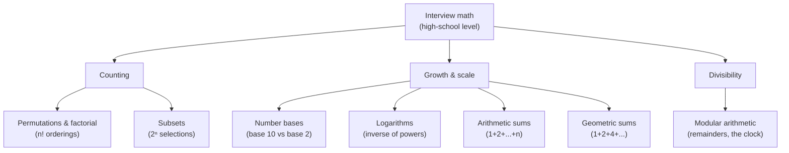
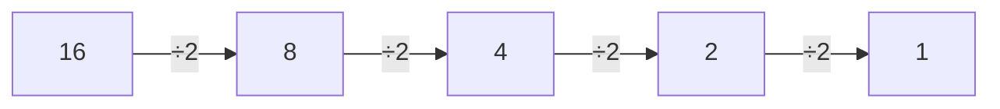
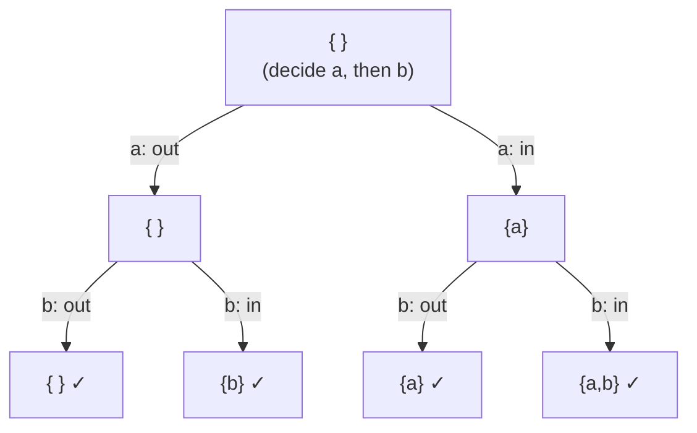
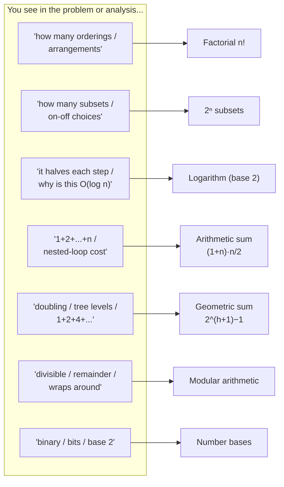

# Math Basics for Interviews (Reviewer)

The "computer science is math" reputation scares people off, but the truth is reassuring: coding
interviews need only about **high-school-level math**. The questions companies actually ask test
problem-solving and coding, not obscure number theory — and on the rare interview that leans on a math
trick, that round is usually given less weight when the panel reviews your performance. You do not need
a competition background; you need a handful of small ideas you can recall instantly.

This reviewer is the **math companion to the [Quick DSA Review](quick-dsa-review-reviewer.md)**: the few
foundational concepts the pattern reviewers quietly assume you already know — why binary search is
[O(log n)](algorithms-glossary-reviewer.md#logarithmic-time "Each step discards a constant fraction, so steps equal the log of n."), why enumerating [subsets](algorithms-glossary-reviewer.md#subset "Any selection from a set; n elements have 2^n subsets including empty and full.") is [O(2ⁿ)](algorithms-glossary-reviewer.md#exponential-time "Adding one element roughly doubles the work; cost of two choices per item."), why a nested loop summing `1 + 2 + … + n` is
[O(n²)](algorithms-glossary-reviewer.md#quadratic-time "Work grows like the square of n, typically a nested loop over the same data."). It mirrors AlgoMonster's "Math for Technical Interviews" page: seven ideas — number bases,
[logarithms](algorithms-glossary-reviewer.md#logarithm "A logarithm answers to what power you raise the base to get a number; log2 of 8 is 3."), [permutations](algorithms-glossary-reviewer.md#permutation "An ordered arrangement of elements; n distinct items have n! permutations.") and factorial, subsets, arithmetic sequences, geometric sequences, and
[modular arithmetic](algorithms-glossary-reviewer.md#modulo-and-modular-arithmetic "The remainder after division, and doing math while always taking that remainder."). Each ends with a **Go deeper →** link into the reviewer that uses it. For the
algorithmic side of number theory — [GCD](algorithms-glossary-reviewer.md#gcd "The largest integer that divides two numbers with no remainder."), the [sieve](algorithms-glossary-reviewer.md#sieve-of-eratosthenes "Finds all primes up to n by marking each prime's multiples as composite."), [fast exponentiation](algorithms-glossary-reviewer.md#exponentiation-by-squaring "Computes base^exp in O(log exp) by squaring the base and halving the exponent."), overflow — see the
deeper [Math & Number Theory](math-and-number-theory-reviewer.md) reviewer.

Related: [Algorithm Patterns Index](algorithm-patterns-index-reviewer.md) · [Quick DSA Review](quick-dsa-review-reviewer.md) · [Complexity & Big-O](complexity-and-big-o-reviewer.md) · [Math & Number Theory](math-and-number-theory-reviewer.md) · [Glossary](algorithms-glossary-reviewer.md)

## Contents
- [How much math do you actually need?](#how-much-math-do-you-actually-need)
- [Number bases and place value](#number-bases-and-place-value)
- [Logarithms: the inverse of exponentials](#logarithms-the-inverse-of-exponentials)
- [Permutations and factorial](#permutations-and-factorial)
- [Subsets and the power set](#subsets-and-the-power-set)
- [Arithmetic sequences](#arithmetic-sequences)
- [Geometric sequences](#geometric-sequences)
- [Modular arithmetic](#modular-arithmetic)
- [Where each idea shows up](#where-each-idea-shows-up)
- [Interview Q&A](#interview-qa)
- [Rapid-fire round](#rapid-fire-round)
- [Exam-style questions](#exam-style-questions)
- [30-second takeaway](#30-second-takeaway)
- [Quick recall checklist](#quick-recall-checklist)
- [References](#references)

---

## How much math do you actually need?

The short answer is **high-school math**. Universities sometimes file computer science under the math
department, but day-to-day engineering — and the interview that gates it — leans on counting, growth,
and divisibility, not calculus or proofs.

Key points:

- **Advanced tricks are rarely the point.** LeetCode has thousands of user-submitted problems; a few
  need an exotic identity, but the questions companies actually ask test coding and reasoning. A
  question that hinges on knowing one specific math fact is a *knowledge* test, which good interviews
  try to avoid.
- **An off-topic round carries less weight.** At most companies your performance is calibrated by
  engineers other than the interviewer, and a round judged too tricky or unfair is discounted in the
  final decision. So a single unlucky math question rarely sinks a loop.
- **The essentials fit in one sitting.** The seven ideas below are the whole toolkit. Each is small,
  and each maps to a place it shows up in algorithm analysis — that mapping is what makes them worth
  memorizing.
- **Math here is mostly about *estimating cost*.** Logarithms explain `O(log n)`; factorials and powers
  of two explain why some searches are only feasible for tiny `n`; arithmetic and geometric sums are how
  you read the running time of a loop.



*The seven ideas grouped by what they do for you: counting how many arrangements/selections exist, gauging how fast something grows, and reasoning about remainders.*

## Number bases and place value

A **[number base](algorithms-glossary-reviewer.md#number-base-radix "The count of distinct digits a numeral system uses; each position is the next power of the base.")** (or *radix*) is just how many distinct digits a numeral system uses, and what each
position is worth. We count in **base 10** because we have ten digits, `0`–`9`; computers compute in
**base 2** because a circuit is naturally on/off, giving two digits, `0` and `1`.

Key points:

- **Each position is the next power of the base.** Reading right to left, the places are `base⁰`,
  `base¹`, `base²`, … A digit's contribution is `digit × base^position`.
- **Base 10 example — 352:** the `2` is in the ones place (`10⁰`), the `5` in the tens place (`10¹`),
  the `3` in the hundreds place (`10²`): `300 + 50 + 2`.
- **Base 2 example — 1011:** the places from the right are `2⁰ = 1`, `2¹ = 2`, `2² = 4`, `2³ = 8`. So
  binary `1011` is `8 + 0 + 2 + 1 = 11` in decimal.
- **Why it matters here:** binary is the language of [bitmasks](algorithms-glossary-reviewer.md#bitmask "Using an integer's bits to represent a set of flags or a subset of items."), and "powers of 2" intuition is what makes
  logarithms, subsets, and tree-height arithmetic click. You convert decimal→binary by repeatedly taking
  `% 2` (digit) and `/ 2` (shift right).

```text
base 10 — each place is a power of 10:

    3      5      2
  10^2   10^1   10^0
   300  +  50  +   2     =  352

base 2 — each place is a power of 2:

    1      0      1      1
   2^3    2^2    2^1    2^0
    8   +   0  +   2  +   1   =  11        (binary 1011 == decimal 11)
```

*Place value is the same idea in both bases: multiply each digit by its position's power and add — only the base of the power changes.*

```csharp
// Evaluate a binary string by place value (Horner's method): value = value*2 + bit.
public static int FromBinary(string bits)
{
    int value = 0;
    foreach (char c in bits)
        value = value * 2 + (c - '0');   // shift left one place, add the new bit
    return value;                         // "1011" -> 11
}
```

**Go deeper →** [Math & Number Theory](math-and-number-theory-reviewer.md#base-conversion-and-place-value) for
general base conversion, and [Bit Manipulation](bit-manipulation-reviewer.md) for working directly in base 2.

## Logarithms: the inverse of exponentials

A **[logarithm](algorithms-glossary-reviewer.md#logarithm "A logarithm answers to what power you raise the base to get a number; log2 of 8 is 3.")** answers one question: *to what power must I raise the base to get this number?* It is
the inverse of exponentiation. In interviews the base is almost always **2**, because so many algorithms
repeatedly cut the problem in half.

Key points:

- **Exponent then log, two directions of one fact.** `2³ = 8` (multiply three 2's), so `log₂(8) = 3`.
  Likewise `2⁴ = 16`, so `log₂(16) = 4`.
- **A logarithm counts halvings.** `log₂(n)` is how many times you can divide `n` by 2 before reaching
  1: `16 / 2 / 2 / 2 / 2 = 1` is four halvings, so `log₂(16) = 4`. That is exactly what
  [binary search](algorithms-glossary-reviewer.md#binary-search "Repeatedly halve a sorted range to locate a target in O(log n).") does to a sorted range.
- **Logs grow painfully slowly**, which is the whole appeal of `O(log n)`: doubling the input adds just
  **one** step. `log₂(1,000,000) ≈ 20`.
- **The base does not matter in [Big-O](algorithms-glossary-reviewer.md#big-o-notation "Upper bound on how an algorithm's cost grows as input size increases.").** `log₂ n` and `log₁₀ n` differ only by a constant factor, so all
  logarithms are the same complexity class — write `O(log n)` and never specify the base.

```text
two ways to read  log2(16) = 4

  as repeated multiplication (exponent):   2 · 2 · 2 · 2  = 16     (four 2's)
  as repeated halving       (logarithm):   16 / 2 / 2 / 2 / 2 = 1  (four halvings)

  n   :   1    2    4    8   16   32   64  ...
  log2:   0    1    2    3    4    5    6   <- each doubling of n adds ONE
```

*Exponentiation builds a number up by repeated multiplication; the logarithm is the count of steps to tear it back down to 1 — which is why halving algorithms cost O(log n).*



*Four halvings carry 16 down to 1, so log₂(16) = 4 — the same four steps binary search takes on a 16-element range.*

```csharp
// floor(log2(n)) by counting halvings until n reaches 1. Requires n >= 1.
public static int Log2Floor(long n)
{
    int count = 0;
    while (n > 1) { n /= 2; count++; }   // each halving is one "log step"
    return count;                         // Log2Floor(16) == 4, Log2Floor(8) == 3
}
```

**Go deeper →** [Complexity & Big-O](complexity-and-big-o-reviewer.md) for the full complexity ladder, and
[Binary Search](binary-search-reviewer.md) for the canonical halving algorithm.

## Permutations and factorial

A **set** is a collection of distinct items where order does *not* matter — `{a, b}` is the same set as
`{b, a}`. A **[permutation](algorithms-glossary-reviewer.md#permutation "An ordered arrangement of elements; n distinct items have n! permutations.")** is a specific *ordering* of those items, where order is everything: `[a, b]`
and `[b, a]` are two different permutations.

Key points:

- **Count by the multiplication principle.** Arranging `a, b, c`: the first position has 3 choices, then
  2 remain for the second, then 1 for the last — `3 × 2 × 1 = 6` orderings.
- **For `n` items that is `n!`** ("n [factorial](algorithms-glossary-reviewer.md#factorial "The product n · (n-1) · … · 1; the number of ways to order n distinct items.")"): `n × (n-1) × (n-2) × … × 1`. For example
  `5! = 5 × 4 × 3 × 2 × 1 = 120`, so there are 120 ways to line up 5 letters.
- **Factorials explode**, which is itself a planning cue. Because `n!` grows faster than any exponential,
  "list every ordering" is only feasible for tiny `n` (roughly `n ≤ 10`). A small bound plus "all
  arrangements" is the tell for [backtracking](algorithms-glossary-reviewer.md#backtracking "Explore all candidates by building one choice at a time and undoing dead ends.").
- **Permutation vs [combination](algorithms-glossary-reviewer.md#combination "A selection of elements where order does not matter."):** if reordering the same elements counts as a new answer it is a
  permutation (more of them); if not, it is a combination (fewer).

```text
all permutations of {a, b, c}  ->  3! = 3 · 2 · 1 = 6

  pos1     pos2     pos3      sequence
   a ────── b ────── c         a b c
     └───── c ────── b         a c b
   b ────── a ────── c         b a c
     └───── c ────── a         b c a
   c ────── a ────── b         c a b
     └───── b ────── a         c b a

  3 choices  ×  2 choices  ×  1 choice  =  6 leaves
```

*Each level fixes one more position, and the branching shrinks 3 → 2 → 1; the leaf count is the product 3·2·1 = 6 = 3!.*

```csharp
// n! = 1·2·…·n. 0! and 1! are 1. Overflows long past 20! — accumulate carefully.
public static long Factorial(int n)
{
    long result = 1;
    for (int i = 2; i <= n; i++) result *= i;   // 5! -> 120
    return result;
}
```

**Go deeper →** [Backtracking](backtracking-reviewer.md) for generating permutations, and
[Math & Number Theory](math-and-number-theory-reviewer.md#combinatorics-basics) for `nCr` and Pascal's triangle.

## Subsets and the power set

A **[subset](algorithms-glossary-reviewer.md#subset "Any selection from a set; n elements have 2^n subsets including empty and full.")** of a set `A` is any set whose elements all come from `A`. The collection of *all* subsets is
the **power set**. The key fact: a set of `n` elements has exactly **2ⁿ** subsets.

Key points:

- **Each element is an independent yes/no.** Building a subset, every element is either *included* or
  *excluded* — two choices. With `n` independent two-way choices the total is `2 × 2 × … × 2 = 2ⁿ`.
- **Think of switches.** One element → `2¹ = 2` states; two → `2² = 4`; three → `2³ = 8`. Each new
  element doubles the count.
- **The 2ⁿ count includes the extremes:** the empty subset `{}` (everything off) and the full set itself
  (everything on) both count.
- **Subsets map onto bits.** An `n`-bit integer is exactly one subset — bit `i` on means "element `i`
  included" — which is why subset enumeration and [bitmasks](algorithms-glossary-reviewer.md#bitmask "Using an integer's bits to represent a set of flags or a subset of items.") are the same idea, and why
  `2ⁿ` caps feasible `n` near 20.

```text
each element is a switch: ON (in the subset) or OFF (out)

  elements     states (2^n)     the subsets
  --------------------------------------------------------------------
  {a}            2^1 = 2         {}, {a}
  {a,b}          2^2 = 4         {}, {a}, {b}, {a,b}
  {a,b,c}        2^3 = 8         {}, {a}, {b}, {c}, {a,b}, {a,c}, {b,c}, {a,b,c}

  n elements  ->  2^n subsets    (counting the empty set and the full set)
```

*Adding one element doubles the number of subsets, because that element can be flipped on or off independently of all the others — the source of the 2ⁿ.*



*Two yes/no decisions for the set {a, b} produce 2² = 4 leaf subsets — one branch per independent include/exclude choice.*

```csharp
// number of subsets of an n-element set = 2^n. 1L << n is 2^n via a bit shift.
public static long CountSubsets(int n) => 1L << n;   // CountSubsets(3) == 8
```

**Go deeper →** [Backtracking](backtracking-reviewer.md) for generating the power set, and
[Bit Manipulation](bit-manipulation-reviewer.md) for iterating subsets as bitmasks.

## Arithmetic sequences

An **[arithmetic sequence](algorithms-glossary-reviewer.md#arithmetic-sequence "A sequence with a constant difference between consecutive terms; its sum is (first+last)·count/2.")** has a constant *difference* between consecutive terms. `1, 2, 3, 4, 5`
(difference 1) and `1, 3, 5, 7, 9` (difference 2) are arithmetic; `1, 2, 4` is not, because the gaps
(1, then 2) differ.

Key points:

- **The sum has a closed form:** `(first + last) × count / 2`. Pair the smallest with the largest,
  the second-smallest with the second-largest — each pair has the same total `first + last`, and there
  are `count / 2` pairs.
- **Worked sums:** `1 + 2 + 3 + 4 + 5 = (1 + 5) × 5 / 2 = 15`, and
  `1 + 3 + 5 + 7 + 9 = (1 + 9) × 5 / 2 = 25`.
- **This is *the* tool for nested-loop complexity.** When an inner loop runs `1, 2, 3, …, n` times, the
  total work is `1 + 2 + … + n = (1 + n) × n / 2 = (n² + n) / 2`. Drop the lower-order term and the
  constant and it is **[O(n²)](algorithms-glossary-reviewer.md#quadratic-time "Work grows like the square of n, typically a nested loop over the same data.")** — that triangular sum is why so many double loops are quadratic.

```text
nested loop whose inner body runs 1, 2, 3, ..., n times:

  for (i = 0; i < n; i++)
      for (j = 0; j <= i; j++)      <- runs i+1 times
          doSomething();

   i = 0    *                          1
   i = 1    * *                        2
   i = 2    * * *                      3
    ...                               ...
   i = n-1  * * * ........ *           n
                                  ------------
   total = 1 + 2 + ... + n = (1 + n)·n / 2 = (n² + n)/2  ->  O(n²)
```

*The work forms a triangle of height n; its area — the arithmetic sum (1+n)·n/2 — is dominated by the n² term, so the loop is O(n²).*

```csharp
// Sum of an arithmetic sequence from its first term, last term, and term count.
public static long SumArithmetic(long first, long last, long count)
    => (first + last) * count / 2;     // SumArithmetic(1, 5, 5) == 15
```

**Go deeper →** [Complexity & Big-O](complexity-and-big-o-reviewer.md) for reading running time off code,
where this triangular sum appears constantly.

## Geometric sequences

A **[geometric sequence](algorithms-glossary-reviewer.md#geometric-sequence "A sequence with a constant ratio between consecutive terms; its sum is first·(rⁿ−1)/(r−1).")** has a constant *ratio* between consecutive terms. `1, 2, 4, 8, 16`
(ratio 2) and `1, 3, 9, 27, 81` (ratio 3) are geometric; `1, 2, 6` is not, because `2 / 1 = 2` but
`6 / 2 = 3`.

Key points:

- **The sum has a closed form:** `first × (1 − ratioⁿ) / (1 − ratio)` for `ratio ≠ 1`. The same formula
  rearranges to `first × (ratioⁿ − 1) / (ratio − 1)`, which stays a clean positive integer division when
  `ratio > 1`.
- **Doubling sums to "one less than the next power."** `1 + 2 + 4 + 8 = 15 = 2⁴ − 1`. In general
  `1 + 2 + 4 + … + 2^h = 2^(h+1) − 1`.
- **It counts nodes in a [perfect binary tree](algorithms-glossary-reviewer.md#complete-binary-tree "Every level full except possibly the last, which fills left to right; lets a heap live in an array.").** Each level holds twice as many nodes as the one above
  (`1, 2, 4, 8, …`), so a perfect tree of height `h` has `2^(h+1) − 1` nodes — which also means **about
  half of all nodes are leaves**, a fact heaps and tree problems lean on.

```text
nodes per level in a perfect binary tree double each level (ratio 2):

  level 0:            ( )                    1   = 2^0
  level 1:        ( )     ( )                2   = 2^1
  level 2:      ( ) ( )  ( ) ( )             4   = 2^2
  level 3:    ( )( )( )( )( )( )( )( )        8   = 2^3
                                          --------
  total = 1 + 2 + 4 + 8 = 15 = 2^4 - 1   (height-3 tree has 2^(h+1) - 1 nodes)

  geometric sum:  first·(ratio^n - 1)/(ratio - 1) = 1·(2^4 - 1)/(2 - 1) = 15
```

*Levels grow geometrically with ratio 2, so the node total is the geometric sum 2^(h+1) − 1 — and the bottom level alone holds more nodes than all the levels above it combined.*

```csharp
// Sum of a geometric sequence: first, first·r, first·r², ... (n terms).
// Closed form first·(rⁿ - 1)/(r - 1) for r != 1; if r == 1 every term equals first.
public static long SumGeometric(long first, long ratio, int n)
{
    if (ratio == 1) return first * n;
    long rPowN = 1;
    for (int i = 0; i < n; i++) rPowN *= ratio;     // ratioⁿ
    return first * (rPowN - 1) / (ratio - 1);        // SumGeometric(1, 2, 5) == 31
}
```

**Go deeper →** [Trees & Binary Search Trees](trees-and-binary-search-trees-reviewer.md) and
[Heaps & Priority Queues](heaps-and-priority-queues-reviewer.md), where this node-counting recurs.

## Modular arithmetic

**[Modular arithmetic](algorithms-glossary-reviewer.md#modulo-and-modular-arithmetic "The remainder after division, and doing math while always taking that remainder.")** is integer math that *wraps around* at a fixed value called the **modulus**. The
clock is the everyday example: 15:00 on a 24-hour clock is 3 o'clock on a 12-hour clock because
`15 − 12 = 3`. In math jargon, 15 and 3 are *congruent modulo 12*; in code, `15 % 12 == 3`.

Key points:

- **`%` is the remainder operator.** `x % y` is what is left of `x` after taking out as many whole `y`s
  as possible. Conceptually: if `x < y` the answer is `x`; otherwise subtract `y` until `x < y`.
- **Distributivity is the property interviews exploit:**
  `(a + b) % c = ((a % c) + (b % c)) % c`. You may reduce each piece *before* combining, which is what
  keeps running totals from overflowing on "answer modulo 1e9+7" problems.
- **Use it for divisibility.** `x` divides `n` exactly when `n % x == 0`. The classic primality check
  tests `n % x` for `x` in `[2, √n]` — a [composite](algorithms-glossary-reviewer.md#prime-number "An integer above 1 whose only positive divisors are 1 and itself.") number always has a divisor at or below its
  square root.
- **Beware negative remainders.** In C# `%` follows the sign of the dividend, so `-1 % 5 == -1`. To force
  a result into `[0, m)`, use `((x % m) + m) % m`.

```text
x % y by repeated subtraction (the definition):  32 % 12

  32 >= 12 ?  yes -> 32 - 12 = 20
  20 >= 12 ?  yes -> 20 - 12 =  8
   8 >= 12 ?  no  -> stop, answer = 8        (32 % 12 == 8)

distributivity:  (13 + 2) % 12 = 15 % 12 = 3
              = ((13 % 12) + (2 % 12)) % 12 = (1 + 2) % 12 = 3
```

*Modulo is "subtract the modulus until you can't," and distributivity lets you take the remainder of each part first — the trick that stops big sums and products from overflowing.*

```csharp
// Conceptual definition of x % y by repeated subtraction (x >= 0, y > 0).
// Real code uses the % operator, which computes this in O(1).
public static int Mod(int x, int y)
{
    while (x >= y) x -= y;
    return x;                               // Mod(32, 12) == 8
}

// Primality the math-basics way: any composite n has a divisor in [2, sqrt(n)].
public static bool IsPrime(int n)
{
    if (n < 2) return false;                // 1 is not prime
    for (int x = 2; (long)x * x <= n; x++)  // (long) cast keeps x*x from overflowing
        if (n % x == 0) return false;       // divisible -> composite
    return true;                            // IsPrime(17) == true, IsPrime(15) == false
}
```

**Go deeper →** [Math & Number Theory](math-and-number-theory-reviewer.md#modular-arithmetic-and-the-1e97-convention)
for the `1e9+7` convention and modular inverses, and the [sieve](math-and-number-theory-reviewer.md#sieve-of-eratosthenes)
for finding many primes at once.

## Where each idea shows up

Most of the value of these seven ideas is recognizing the cue in a problem (or in your own running-time
analysis) and reaching for the right formula.



*From a phrase in the prompt — or a shape in your loop — to the formula that quantifies it: orderings, selections, halvings, triangular sums, doubling sums, remainders, or bases.*

## Interview Q&A

### Counting

Q: How many ways can you arrange `n` distinct items in a row, and what is that called?
A: `n!` ("n factorial") = `n × (n-1) × … × 1`. The first slot has `n` choices, the next `n-1`, and so on, so the orderings multiply. For example `5! = 120`. Because `n!` grows faster than any exponential, "list all arrangements" is only feasible for tiny `n` (≈ 10), which is itself a hint that backtracking is intended.

Q: A set has `n` elements — how many subsets does it have, and why?
A: `2ⁿ`. Each element is an independent in-or-out choice, so the choices multiply: `2 × 2 × … × 2`. This counts the empty set and the full set. The same fact is why an `n`-bit bitmask represents one subset, and why subset/bitmask problems cap out near `n = 20`.

Q: What is the difference between a permutation and a combination?
A: A permutation cares about order — `[a, b]` and `[b, a]` are different — so there are more of them (`n!` for a full arrangement). A combination ignores order — `{a, b}` and `{b, a}` are the same — so there are fewer. The test: does reordering the same elements count as a new answer? If yes, permutation.

### Growth and bases

Q: Explain `log₂(n)` in one sentence, two ways.
A: It is the power you raise 2 to in order to get `n` (since `2³ = 8`, `log₂ 8 = 3`), and equivalently the number of times you can halve `n` before reaching 1. The halving reading is why binary search, balanced trees, and heaps are all `O(log n)`.

Q: Why does Big-O never specify the base of a logarithm?
A: Changing the base only multiplies the value by a constant (`logₐ n = log_b n / log_b a`), and Big-O ignores constant factors. So `log₂ n`, `log₁₀ n`, and `ln n` are all the same complexity class — just write `O(log n)`.

Q: Convert binary `1011` to decimal and explain the method.
A: 11. Each position from the right is a power of 2: `2⁰ = 1`, `2¹ = 2`, `2² = 4`, `2³ = 8`. The bits `1011` switch on the 8, 2, and 1 places: `8 + 0 + 2 + 1 = 11`. It is the same place-value rule as base 10, with 2 in place of 10.

### Sums and divisibility

Q: A loop's inner body runs `1, 2, 3, …, n` times across the outer iterations. What is the total, and the Big-O?
A: `1 + 2 + … + n = (1 + n) × n / 2 = (n² + n)/2`. That is an arithmetic-sequence sum; dropping the lower-order term and the constant gives **O(n²)**. This triangular sum is the reason so many nested loops are quadratic.

Q: How many nodes are in a perfect binary tree of height `h`, and how do you get it?
A: `2^(h+1) − 1`. The levels hold `1, 2, 4, …, 2^h` nodes — a geometric sequence with ratio 2 — and that sum is `2^(h+1) − 1`. A useful corollary: the last level alone has more nodes than all the levels above it combined, so roughly half of all nodes are leaves.

Q: State the distributive property of modular arithmetic and say why it is useful.
A: `(a + b) % c = ((a % c) + (b % c)) % c` (and the same for multiplication). It lets you take the remainder of each operand *before* combining, so a running total or product never grows large enough to overflow — exactly what "give the answer modulo 1e9+7" problems require.

Q: How do you test whether `x` divides `n`, and how does that give a primality check?
A: `x` divides `n` exactly when `n % x == 0`. A number `n` is prime if no `x` in `[2, √n]` divides it — you only need to go up to `√n` because any factor larger than the square root pairs with a smaller one already tested.

## Rapid-fire round

- Number of orderings of `n` items → **`n!` (factorial).**
- `5!` → **120.**
- Number of subsets of an `n`-set → **`2ⁿ` (includes empty and full).**
- Subsets of `{a, b, c}` → **8.**
- `log₂(n)` in words → **power of 2 that gives `n` / number of halvings to reach 1.**
- `log₂(16)` → **4.**
- Binary `1011` in decimal → **11 (`8 + 2 + 1`).**
- Why base 2 for computers → **circuits are on/off — two states.**
- Arithmetic sum formula → **`(first + last) × count / 2`.**
- `1 + 2 + … + n` → **`n(n+1)/2`, i.e. **O(n²)** as a loop bound.**
- Geometric sum formula → **`first × (ratioⁿ − 1) / (ratio − 1)`.**
- `1 + 2 + 4 + … + 2^h` → **`2^(h+1) − 1`.**
- Nodes in a perfect binary tree of height `h` → **`2^(h+1) − 1`.**
- `%` meaning → **remainder after division.**
- Modular distributivity → **`(a + b) % c = ((a % c) + (b % c)) % c`.**
- Test "does `x` divide `n`" → **`n % x == 0`.**
- Primality trial-division range → **`[2, √n]`.**
- C# negative remainder fix → **`((x % m) + m) % m`.**
- Does Big-O care about log base? → **No — constant factor, write `O(log n)`.**

## Exam-style questions

1. What do these print, and what real-world quantity does each count?

```csharp
Console.WriteLine(MathBasics.Factorial(5));
Console.WriteLine(MathBasics.CountSubsets(3));
```

**Answer:** `120` then `8`. `Factorial(5) = 5 × 4 × 3 × 2 × 1 = 120` is the number of ways to **order** 5
distinct items. `CountSubsets(3) = 2³ = 8` is the number of **subsets** of a 3-element set (each element
in or out), counting the empty set and the full set.

2. A function runs the inner statement `1, 2, 3, …, n` times. What is the total number of executions for
   `n = 10`, and the asymptotic complexity?

```csharp
Console.WriteLine(MathBasics.SumArithmetic(1, 10, 10));
```

**Answer:** `55`. The total is the arithmetic sum `1 + 2 + … + 10 = (1 + 10) × 10 / 2 = 55`. As a
function of `n` it is `(n² + n)/2`, which is **O(n²)** after dropping the lower-order term and the
constant — the standard reason a triangular nested loop is quadratic.

3. What does this return, and what does it tell you about a perfect binary tree?

```csharp
Console.WriteLine(MathBasics.SumGeometric(1, 2, 4));
```

**Answer:** `15`. It is the geometric sum `1 + 2 + 4 + 8 = 2⁴ − 1 = 15`. Read as tree levels
(`1, 2, 4, 8` nodes), it says a perfect binary tree of height 3 has 15 nodes — matching the general
formula `2^(h+1) − 1`.

4. Trace these and explain the modular results.

```csharp
Console.WriteLine(MathBasics.Mod(32, 12));
Console.WriteLine(MathBasics.IsPrime(17));
Console.WriteLine(MathBasics.IsPrime(15));
```

**Answer:** `8`, `True`, `False`. `Mod(32, 12)` subtracts 12 twice (`32 → 20 → 8`) and stops once `8 < 12`,
so `32 % 12 = 8`. `IsPrime(17)` finds no divisor in `[2, 4]` (`4 × 4 = 16 ≤ 17`, but `5 × 5 > 17` stops
the loop), so 17 is prime. `IsPrime(15)` hits `15 % 3 == 0`, so 15 is composite.

5. Without running it, what does `MathBasics.Log2Floor(1024)` return, and what does the value mean?

**Answer:** `10`. `1024 = 2¹⁰`, so it takes ten halvings to bring 1024 down to 1
(`1024 → 512 → … → 1`). That is `floor(log₂ 1024) = 10`, the number of steps binary search would take on a
1024-element sorted range.

6. In C#, what is `-7 % 3`, and how do you get a non-negative remainder in `[0, 3)`?

**Answer:** `-1`, because C#'s `%` takes the sign of the dividend. Normalize with `((x % m) + m) % m`:
`((-7 % 3) + 3) % 3 = ((-1) + 3) % 3 = 2`. This matters whenever you index circularly or accumulate under
a modulus and a subtraction can go negative.

## 30-second takeaway

> Interview math is **high-school level** — seven small ideas, mostly used to *estimate cost*.
> **Number bases:** each place is a power of the base; binary `1011` = `8 + 2 + 1` = 11. **Logarithms:**
> `log₂ n` is the power of 2 that gives `n`, equivalently the number of halvings to reach 1 — the source
> of every `O(log n)`. **Permutations:** `n!` orderings, exploding past `n ≈ 10` (backtracking territory).
> **Subsets:** `2ⁿ` of them (each element in or out), the bitmask cap near `n = 20`. **Arithmetic sum:**
> `(first + last) × count / 2`; `1 + 2 + … + n` is `n(n+1)/2`, which makes triangular nested loops
> **O(n²)**. **Geometric sum:** `first × (ratioⁿ − 1)/(ratio − 1)`; `1 + 2 + 4 + … + 2^h = 2^(h+1) − 1`,
> the node count of a perfect binary tree. **Modular arithmetic:** `%` is the remainder, it wraps like a
> clock, and `(a + b) % c = ((a % c) + (b % c)) % c` keeps big totals from overflowing; `n % x == 0`
> tests divisibility, the basis of the `[2, √n]` primality check.

## Quick recall checklist

- **Number base / place value:** each position is `base^k`; binary `1011` = `8 + 0 + 2 + 1` = 11; base 2
  because circuits are on/off.
- **Logarithm:** `log₂ n` = power of 2 giving `n` = halvings to reach 1; `log₂ 16 = 4`; base is
  irrelevant in Big-O (`O(log n)`).
- **Permutations / factorial:** `n!` orderings; `5! = 120`; grows past exponential, so "all orderings"
  means small `n` and backtracking.
- **Subsets:** `2ⁿ` subsets (each element in/out, includes `{}` and full set); maps to an `n`-bit mask;
  caps `n ≈ 20`.
- **Arithmetic sequence:** constant difference; sum `(first + last) × count / 2`; `1 + 2 + … + n =
  n(n+1)/2` → **O(n²)** loop bound.
- **Geometric sequence:** constant ratio; sum `first × (ratioⁿ − 1)/(ratio − 1)`; `1 + 2 + 4 + … + 2^h =
  2^(h+1) − 1` = perfect-binary-tree node count.
- **Modular arithmetic:** `%` = remainder, wraps at the modulus; distributive `(a + b) % c =
  ((a % c) + (b % c)) % c`; divisibility `n % x == 0`; primality tests `[2, √n]`; fix negatives with
  `((x % m) + m) % m`.

## References

- AlgoMonster — [Math for Technical Interviews](https://algo.monster/problems/math-basics) (the page this reviewer mirrors).
- Wikipedia — [Logarithm](https://en.wikipedia.org/wiki/Logarithm), [Factorial](https://en.wikipedia.org/wiki/Factorial), [Power set](https://en.wikipedia.org/wiki/Power_set).
- Wikipedia — [Arithmetic progression](https://en.wikipedia.org/wiki/Arithmetic_progression), [Geometric progression](https://en.wikipedia.org/wiki/Geometric_progression).
- Wikipedia — [Modular arithmetic](https://en.wikipedia.org/wiki/Modular_arithmetic), [Binary number](https://en.wikipedia.org/wiki/Binary_number).
- NeetCode — [Roadmap](https://neetcode.io/roadmap) (Math &amp; Geometry section).
- See also the deeper [Math & Number Theory](math-and-number-theory-reviewer.md) reviewer in this suite.
