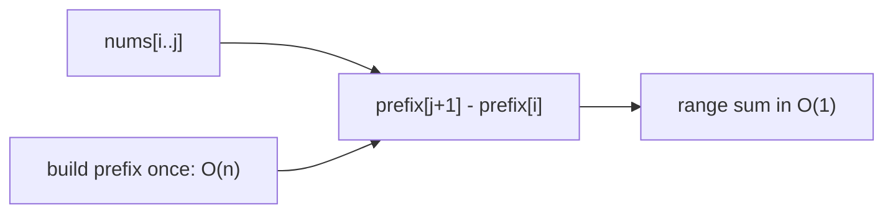
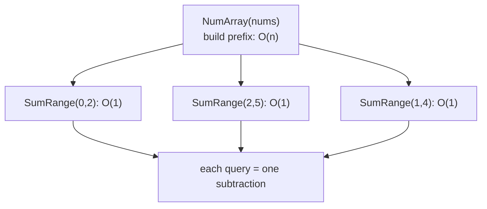
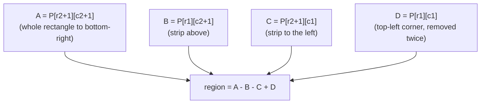
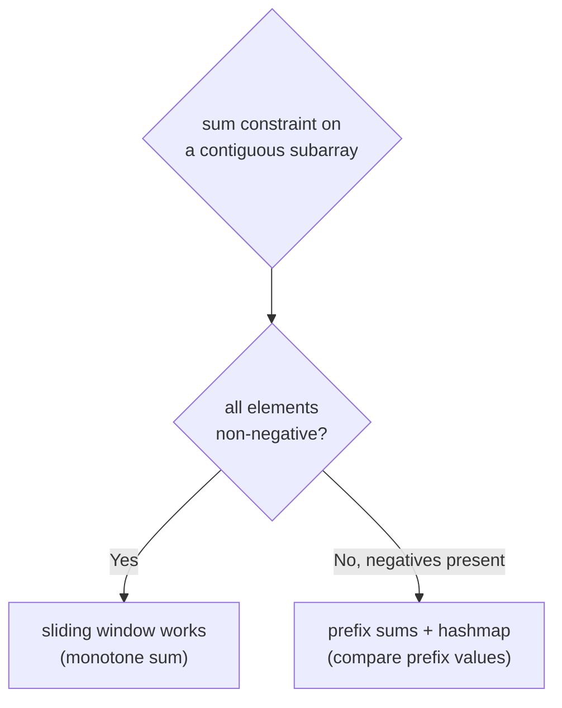
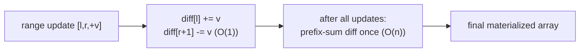
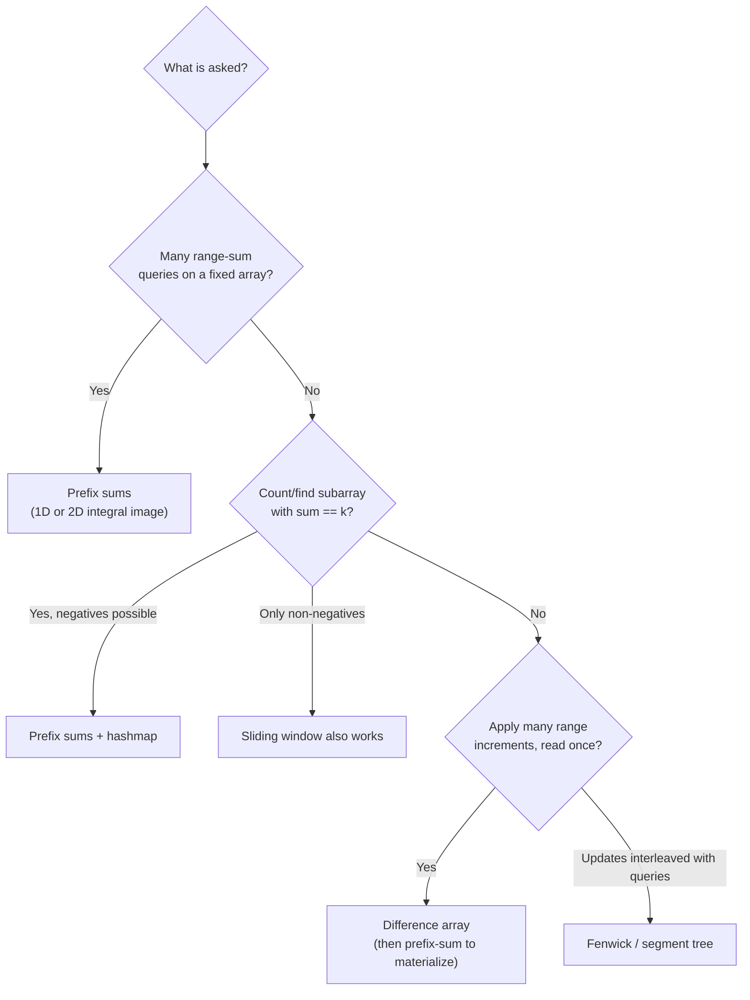

# Prefix Sums & Difference Arrays (Reviewer)

A **[prefix sum](algorithms-glossary-reviewer.md#prefix-sum "Running totals up to each position, making any range sum an O(1) subtraction.")** (also called a cumulative sum or, in 2D, an integral image) is a precomputed [array](algorithms-glossary-reviewer.md#array "A fixed-size contiguous block of same-type elements accessed by position in O(1).") where each entry holds the running total of everything before it. Once you spend `O(n)` building it, any range-sum question — "what is the sum of `nums[i..j]`?" — collapses to a single subtraction answered in `O(1)`. The whole pattern is an instance of *precompute once, query many*: you pay a [linear](algorithms-glossary-reviewer.md#linear-time "Work grows in direct proportion to input size, about one unit per element.") setup cost so that an arbitrary number of range queries become [constant-time](algorithms-glossary-reviewer.md#constant-time "Cost does not depend on input size; the same fixed work every time."). The same idea lifts cleanly to two dimensions via inclusion–exclusion, pairs with a [hash map](algorithms-glossary-reviewer.md#hash-map "Stores key-value pairs and retrieves a value by key in O(1) average time.") to count [subarrays](algorithms-glossary-reviewer.md#subarray-subsequence-and-substring "Subarray/substring is a contiguous slice; subsequence keeps order but may skip.") with a target sum even when negatives are present, and inverts into the **[difference array](algorithms-glossary-reviewer.md#difference-array "Stores changes so a range increment is two O(1) updates, rebuilt by prefix sum.")** for applying many range updates cheaply.

This pattern matters in interviews and exams because it is the right answer the moment you see repeated range queries, "sum of subarray equals `k`," or "apply these range increments." It is also the canonical example where a naive [sliding window](algorithms-glossary-reviewer.md#sliding-window "A contiguous range you expand and shrink to track a property in one pass.") *fails* — the moment a sum constraint involves negative numbers, the window loses [monotonicity](algorithms-glossary-reviewer.md#monotonic "Consistently moving one direction; never decreasing or never increasing.") and you must reach for prefix sums plus a hash map instead. This reviewer builds the 1D convention carefully (the off-by-one is where most bugs live), extends to 2D, walks the prefix-plus-hashmap counting trick, and closes with difference arrays and the [overflow](algorithms-glossary-reviewer.md#integer-overflow "A value exceeds its integer type's max and silently wraps to a wrong value.")/index pitfalls to watch.

Related: [Algorithm Patterns Index](algorithm-patterns-index-reviewer.md) · [Arrays & Hashing](arrays-and-hashing-reviewer.md) · [Sliding Window](sliding-window-reviewer.md) · [Two Pointers](two-pointers-reviewer.md) · [Segment Trees & Fenwick Trees](segment-tree-and-fenwick-reviewer.md) · [Glossary](algorithms-glossary-reviewer.md)

## Contents

- [What a prefix sum is](#what-a-prefix-sum-is)
- [Building a 1D prefix sum and the index convention](#building-a-1d-prefix-sum-and-the-index-convention)
- [Range Sum Query - Immutable (LC 303)](#range-sum-query---immutable-lc-303)
- [2D prefix sums and inclusion-exclusion (LC 304)](#2d-prefix-sums-and-inclusion-exclusion-lc-304)
- [Prefix sum + hash map: subarrays summing to k (LC 560)](#prefix-sum--hash-map-subarrays-summing-to-k-lc-560)
- [Why this beats sliding window with negatives](#why-this-beats-sliding-window-with-negatives)
- [Difference arrays: range updates in O(1)](#difference-arrays-range-updates-in-o1)
- [Product prefix/suffix: a sibling idea (LC 238)](#product-prefixsuffix-a-sibling-idea-lc-238)
- [Pitfalls: off-by-one and overflow](#pitfalls-off-by-one-and-overflow)
- [Decision cue: which tool when](#decision-cue-which-tool-when)
- [Complexity cheat sheet](#complexity-cheat-sheet)
- [Interview Q&A](#interview-qa)
- [Rapid-fire round](#rapid-fire-round)
- [Exam-style questions](#exam-style-questions)
- [30-second takeaway](#30-second-takeaway)
- [Quick recall checklist](#quick-recall-checklist)
- [References](#references)

---

## What a prefix sum is

A prefix sum array turns a *range* question into a *difference of two points*. If `prefix[k]` holds the sum of the first `k` elements of `nums` (everything strictly before [index](algorithms-glossary-reviewer.md#index "The integer position of an element; 0-indexed starts at 0, 1-indexed at 1.") `k`), then the sum of any slice `nums[i..j]` inclusive is just `prefix[j+1] - prefix[i]`. No loop, no re-summing — one subtraction.

Key points:
- **Precompute once, query many.** Building the prefix array is `O(n)`. After that, each range-sum query is `O(1)`. The payoff grows with the number of queries: `q` naive queries cost `O(n·q)`; with prefix sums they cost `O(n + q)`.
- **It is a running total.** `prefix[k] = nums[0] + nums[1] + ... + nums[k-1]`. Each entry is the previous entry plus one more element.
- **Range = difference of prefixes.** The sum over `[i, j]` is `prefix[j+1] - prefix[i]`: the total up to and including `j`, minus the total of everything before `i`.
- **Works with negatives.** Unlike a sliding window, prefix sums make no assumption about element signs — the subtraction is exact regardless.
- **Inverse of the difference array.** Prefix-summing a difference array reconstructs the original updated array; the two operations are inverses.



*A range sum becomes a single subtraction of two prefix values once the prefix array is built in linear time.*

## Building a 1D prefix sum and the index convention

The cleanest convention uses a prefix array of length `n + 1` with `prefix[0] = 0`. This "sentinel zero" removes every special case: the sum of `nums[i..j]` is `prefix[j+1] - prefix[i]` for *all* valid `i, j`, including `i == 0`, with no separate branch.

Key points:
- **Length `n + 1`, `prefix[0] = 0`.** Entry `prefix[k]` is the sum of the first `k` elements (indices `0..k-1`).
- **Recurrence.** `prefix[k] = prefix[k-1] + nums[k-1]`. Each entry extends the previous total by one element.
- **Query formula.** Sum of `nums[i..j]` (both inclusive) `= prefix[j+1] - prefix[i]`. The `+1` on `j` is because `prefix` is shifted by one relative to `nums`.
- **Why the sentinel.** With `prefix[0] = 0`, the prefix "before index 0" is defined, so `i == 0` needs no special handling — `prefix[0]` correctly subtracts nothing.

```csharp
using System;

public sealed class PrefixSum
{
    private readonly long[] prefix;   // length n + 1, prefix[0] = 0

    public PrefixSum(int[] nums)
    {
        prefix = new long[nums.Length + 1];
        for (int k = 1; k <= nums.Length; k++)
            prefix[k] = prefix[k - 1] + nums[k - 1];
    }

    // Inclusive sum of nums[i..j].
    public long RangeSum(int i, int j) => prefix[j + 1] - prefix[i];
}
```

```text
nums   = [ 3,  1,  4,  1,  5,  9 ]
 index     0   1   2   3   4   5

prefix (length 7, prefix[0]=0):
 k        0   1   2   3   4    5    6
 prefix   0   3   4   8   9   14   23
                 ^ prefix[k] = sum of nums[0..k-1]

query sum of nums[1..3]  (the slice 1, 4, 1):
   prefix[3+1] - prefix[1] = prefix[4] - prefix[1] = 9 - 3 = 6
check: 1 + 4 + 1 = 6   match

query sum of nums[0..5]  (whole array):
   prefix[6] - prefix[0] = 23 - 0 = 23
check: 3+1+4+1+5+9 = 23  match
```

*The length-(n+1) prefix array with a leading zero makes every range sum a clean `prefix[j+1] - prefix[i]` subtraction, with no special case at index 0.*

## Range Sum Query - Immutable (LC 303)

**[LC](algorithms-glossary-reviewer.md#leetcode "An online platform of coding-interview problems with an automated judge.") 303 — Range Sum Query - Immutable** is the canonical "precompute once, query many" problem. You are given a fixed array and asked to answer many `sumRange(i, j)` calls. The intended solution precomputes the prefix sum in the constructor so each query is `O(1)`.

Key points:
- **Constructor does the `O(n)` work** building the prefix array; queries are `O(1)`.
- **Immutable input** is what makes precomputation safe — the array never changes between queries, so the prefix array stays valid. (If updates were allowed, you would reach for a Fenwick/BIT or segment tree instead.)
- **Inclusive bounds.** `sumRange(i, j)` includes both ends, hence `prefix[j+1] - prefix[i]`.
- **Total cost** for `q` queries: `O(n + q)` versus the naive `O(n·q)`.

```csharp
using System;

public class NumArray
{
    private readonly int[] prefix;   // prefix[k] = sum of nums[0..k-1]

    public NumArray(int[] nums)
    {
        prefix = new int[nums.Length + 1];
        for (int k = 1; k <= nums.Length; k++)
            prefix[k] = prefix[k - 1] + nums[k - 1];
    }

    public int SumRange(int left, int right) => prefix[right + 1] - prefix[left];
}
```



*LC 303 pays a one-time linear build cost in the constructor so every subsequent range query is a constant-time subtraction.*

## 2D prefix sums and inclusion-exclusion (LC 304)

**LC 304 — Range Sum Query 2D - Immutable** lifts the idea to a matrix. Define `P[r][c]` as the sum of the entire submatrix from the top-left corner `(0,0)` to `(r-1, c-1)` — again a `(rows+1) × (cols+1)` array with a zero border so there are no [edge cases](algorithms-glossary-reviewer.md#edge-case "An input at the boundary of valid or typical, where buggy code tends to break."). This is exactly the **integral image** used in computer vision.

The sum of any axis-aligned rectangle is then four lookups combined by **inclusion–exclusion**: take the big rectangle to the bottom-right corner, subtract the strip above, subtract the strip to the left, then **add back** the top-left corner that you subtracted twice.

Key points:
- **Build recurrence.** `P[r][c] = matrix[r-1][c-1] + P[r-1][c] + P[r][c-1] - P[r-1][c-1]`. The last term corrects the double-counted overlap.
- **Query formula** for rectangle with corners `(r1,c1)` (top-left) to `(r2,c2)` (bottom-right), inclusive:
  `P[r2+1][c2+1] - P[r1][c2+1] - P[r2+1][c1] + P[r1][c1]`.
- **Inclusion–exclusion intuition:** whole − top-strip − left-strip + top-left-corner (added back because it was removed by both strips).
- **Complexity.** Build `O(rows·cols)`; each query `O(1)`; space `O(rows·cols)`.

```csharp
using System;

public class NumMatrix
{
    private readonly int[,] p;   // (R+1) x (C+1), zero border

    public NumMatrix(int[][] matrix)
    {
        int R = matrix.Length, C = R == 0 ? 0 : matrix[0].Length;
        p = new int[R + 1, C + 1];
        for (int r = 1; r <= R; r++)
            for (int c = 1; c <= C; c++)
                p[r, c] = matrix[r - 1][c - 1]
                        + p[r - 1, c]
                        + p[r, c - 1]
                        - p[r - 1, c - 1];
    }

    public int SumRegion(int row1, int col1, int row2, int col2) =>
          p[row2 + 1, col2 + 1]
        - p[row1,     col2 + 1]
        - p[row2 + 1, col1]
        + p[row1,     col1];
}
```



*Inclusion–exclusion: start with the whole corner-rectangle, subtract the top and left strips, then add back the overlapping top-left corner that both strips removed.*

```text
matrix (3x3):                cumulative P (4x4, zero border):
        c=0 c=1 c=2                 0   0   0   0
 r=0 [  1   2   3 ]                 0   1   3   6
 r=1 [  4   5   6 ]                 0   5  12  21
 r=2 [  7   8   9 ]                 0  12  27  45

query SumRegion(1,1,2,2)  -> rectangle rows 1..2, cols 1..2 = {5,6,8,9}
   A = P[3][3] = 45     (whole to bottom-right)
   B = P[1][3] = 6      (strip above row 1)
   C = P[3][1] = 12     (strip left of col 1)
   D = P[1][1] = 1      (top-left corner added back)
   region = 45 - 6 - 12 + 1 = 28
check: 5 + 6 + 8 + 9 = 28   match
```

*Four constant-time lookups into the integral image reconstruct any submatrix sum exactly, with the corner term repairing the double subtraction.*

## Prefix sum + hash map: subarrays summing to k (LC 560)

**LC 560 — Subarray Sum Equals K** asks for the *count* of contiguous subarrays whose sum equals `k`. The array may contain negatives, so a sliding window is unsound. The prefix-sum insight: a subarray `nums[i..j]` sums to `k` exactly when `prefix[j+1] - prefix[i] == k`, i.e. `prefix[i] == prefix[j+1] - k`. So as you sweep a running prefix `sum`, the number of earlier prefixes equal to `sum - k` is the number of subarrays ending here that hit `k`.

Key points:
- **Hash map of prefix counts.** `count[s]` = how many times prefix value `s` has occurred so far. Seed it with `count[0] = 1` to represent the empty prefix (handles subarrays starting at index 0).
- **At each step:** update `sum += nums[i]`, then add `count[sum - k]` to the answer, then increment `count[sum]`. Order matters — look up *before* recording the current prefix so you never pair an index with itself.
- **Counts, not lengths.** This finds *how many* subarrays, including overlapping ones; it is not a window length.
- **Complexity.** Time `O(n)`; space `O(n)` for the map. Works with negatives, zeros, and positives alike.

```csharp
using System;
using System.Collections.Generic;

public static int SubarraySum(int[] nums, int k)
{
    var count = new Dictionary<long, int> { [0] = 1 };  // empty prefix
    long sum = 0;
    int result = 0;

    foreach (int x in nums)
    {
        sum += x;
        if (count.TryGetValue(sum - k, out int seen))
            result += seen;                              // subarrays ending here that sum to k
        count[sum] = count.GetValueOrDefault(sum) + 1;
    }
    return result;
}
```

```text
nums = [1, 2, 1, 2, 1]   k = 3        (running prefix `sum`, map of prefix->count)

start: count = {0:1}  sum=0  result=0

i=0 x=1  sum=1   need sum-k = 1-3 = -2  -> count[-2]=0    result=0
                 record count[1]=1      -> {0:1, 1:1}
i=1 x=2  sum=3   need 3-3 = 0           -> count[0]=1     result=1   (subarray [1,2])
                 record count[3]=1      -> {0:1, 1:1, 3:1}
i=2 x=1  sum=4   need 4-3 = 1           -> count[1]=1     result=2   (subarray [2,1])
                 record count[4]=1      -> {0:1,1:1,3:1,4:1}
i=3 x=2  sum=6   need 6-3 = 3           -> count[3]=1     result=3   (subarray [1,2])
                 record count[6]=1
i=4 x=1  sum=7   need 7-3 = 4           -> count[4]=1     result=4   (subarray [2,1])
                 record count[7]=1
answer = 4   subarrays summing to 3: [1,2], [2,1], [1,2], [2,1]
```

*Each step asks "how many earlier prefixes equal `sum - k`?" — the map answers in O(1), counting every subarray ending at the current index that totals k.*

## Why this beats sliding window with negatives

A sliding window for "subarray sum equals/at-least `k`" relies on **monotonicity**: extending the window to the right increases the running sum, so once you overshoot you can shrink from the left to recover. That reasoning is only valid when every element is non-negative. Introduce a single negative number and extending the window can *lower* the sum while shrinking can *raise* it — the window no longer has a direction to move, and the shrink [invariant](algorithms-glossary-reviewer.md#invariant "A condition that stays true at every step, used to prove correctness.") collapses.

Key points:
- **Window needs a monotone sum.** Non-negative elements make the prefix sum non-decreasing, which is what licenses "grow then shrink." Negatives destroy that.
- **Prefix + hashmap makes no sign assumption.** It compares prefix *values* by equality (`prefix[i] == prefix[j+1] - k`), which is exact regardless of sign.
- **This is the canonical "not a window" trap.** Recognizing it is a frequent interview discriminator — see [Sliding Window](sliding-window-reviewer.md) for the same boundary from the window side.
- **Cost trade.** The window is `O(1)` space; the prefix+hashmap is `O(n)` space. You pay space to handle negatives.

```text
nums = [3, -1, 1, 2]   target = 3   (try to find a subarray summing to 3)

running sum as the window's right edge advances:
 right ->   3     2     3     5
            ^     ^     ^     ^
            sum non-monotone: 3 then DOWN to 2 then UP to 3 then 5

window logic "once sum >= 3, shrink left" misfires:
  at right=0 sum=3 (>=3) -> shrink? removing 3 drops sum to 0, skips [3]
  meanwhile [3,-1,1] also sums to 3 but the window already moved past it
prefix+hashmap finds BOTH [3] and [3,-1,1] correctly by prefix equality.
```

*With a negative present the running sum dips and rises non-monotonically, so the window has no valid shrink direction — prefix equality via a hash map is the sound tool.*



*Sign of the elements is the deciding factor: non-negative permits a window; any negative forces prefix sums plus a hash map.*

## Difference arrays: range updates in O(1)

The difference array is the prefix sum's inverse, tuned for the opposite workload: many **range updates**, then one final read. To add `val` to every element in `nums[l..r]`, you record only two edits in a `diff` array — `diff[l] += val` and `diff[r+1] -= val` — each `O(1)`. After all updates, a single prefix-sum pass over `diff` materializes the final array.

Key points:
- **Two edits per range update.** `diff[l] += val` starts the increment; `diff[r+1] -= val` stops it just past the range. The `r+1` guard means `diff` has length `n + 1` to hold the off-the-end decrement safely.
- **Materialize with a prefix sum.** `result[k] = result[k-1] + diff[k]` reconstructs the array; the running sum "turns on" `val` at `l` and "turns off" at `r+1`.
- **Cost.** `m` range updates cost `O(m)` total (not `O(m·n)`); the final pass is `O(n)`. Total `O(n + m)` versus the naive `O(n·m)`.
- **Use when** updates come in a batch and you only need to read after all of them are applied. (For interleaved updates and queries, use a Fenwick/BIT or segment tree.)
- **2D analogue exists** (a 2D difference array with four corner edits), mirroring the 2D prefix sum.

```csharp
using System;

public static int[] ApplyRangeUpdates(int n, int[][] updates)
{
    // each update is [l, r, val]: add val to nums[l..r] inclusive.
    var diff = new long[n + 1];                 // +1 for the r+1 decrement

    foreach (var u in updates)
    {
        int l = u[0], r = u[1], val = u[2];
        diff[l] += val;
        diff[r + 1] -= val;                     // safe: index r+1 <= n
    }

    var result = new int[n];
    long running = 0;
    for (int k = 0; k < n; k++)
    {
        running += diff[k];
        result[k] = (int)running;               // prefix-sum the diff
    }
    return result;
}
```

```text
n = 6, start all zeros.
updates: [1,3,+2]  then  [2,5,+3]

diff array (length 7, index 0..6):
 apply [1,3,+2]:  diff[1]+=2, diff[4]-=2
 apply [2,5,+3]:  diff[2]+=3, diff[6]-=3

 index   0   1   2   3   4   5   6
 diff    0  +2  +3   0  -2   0  -3

prefix-sum the diff (running total), read indices 0..5:
 k=0 running 0+0   = 0   -> result[0]=0
 k=1 running 0+2   = 2   -> result[1]=2
 k=2 running 2+3   = 5   -> result[2]=5
 k=3 running 5+0   = 5   -> result[3]=5
 k=4 running 5-2   = 3   -> result[4]=3
 k=5 running 3+0   = 3   -> result[5]=3

final array = [0, 2, 5, 5, 3, 3]
check: index1..3 got +2 (=> 2,2,2 before the 2nd update),
       index2..5 got +3; overlap 2..3 has both: 2+3=5  match
```

*Two `O(1)` edits per range update plus one prefix-sum pass turns a batch of range increments into linear total work instead of re-touching every element of every range.*



*The difference array defers all the work: record cheap start/stop markers per update, then a single prefix pass replays them into the result.*

## Product prefix/suffix: a sibling idea (LC 238)

**LC 238 — Product of Array Except Self** is the same "prefix from the left, suffix from the right" structure applied to *products* instead of sums, with the twist that you must exclude the current element and may not use division. The answer at index `i` is `(product of everything left of i) × (product of everything right of i)`. You build a left-prefix product and a right-suffix product and multiply them per index.

Key points:
- **Prefix and suffix products.** `left[i]` = product of `nums[0..i-1]`; `right[i]` = product of `nums[i+1..n-1]`. Then `answer[i] = left[i] * right[i]`.
- **O(1) extra space variant.** Write the left products into the output array in a forward pass, then fold in a running suffix product in a backward pass — no second array beyond the output.
- **No division.** Division would fail on zeros and is explicitly disallowed; the prefix/suffix product sidesteps it.
- **Complexity.** Time `O(n)`; space `O(1)` extra (output array excluded), or `O(n)` if you keep separate left/right arrays.
- **Practice.** This is the product-flavored cousin of prefix sums — see `arrays-hashing/product-of-array-except-self` in `leet-practice`, and the full treatment in [Arrays & Hashing](arrays-and-hashing-reviewer.md).

```csharp
using System;

public static int[] ProductExceptSelf(int[] nums)
{
    int n = nums.Length;
    var answer = new int[n];

    // forward pass: answer[i] = product of everything LEFT of i
    answer[0] = 1;
    for (int i = 1; i < n; i++)
        answer[i] = answer[i - 1] * nums[i - 1];

    // backward pass: fold in product of everything RIGHT of i
    int suffix = 1;
    for (int i = n - 1; i >= 0; i--)
    {
        answer[i] *= suffix;
        suffix *= nums[i];
    }
    return answer;
}
```

```text
nums = [2, 3, 4, 5]

forward (left products into answer):
 i=0 answer[0]=1
 i=1 answer[1]=answer[0]*nums[0]=1*2=2
 i=2 answer[2]=answer[1]*nums[1]=2*3=6
 i=3 answer[3]=answer[2]*nums[2]=6*4=24
 answer = [1, 2, 6, 24]   (= products to the left of each index)

backward (multiply by running suffix product):
 suffix=1
 i=3 answer[3]=24*1=24 ; suffix=1*nums[3]=5
 i=2 answer[2]=6 *5=30 ; suffix=5*nums[2]=20
 i=1 answer[1]=2 *20=40; suffix=20*nums[1]=60
 i=0 answer[0]=1 *60=60; suffix=60*nums[0]=120

answer = [60, 40, 30, 24]
check i=2: (2*3)*(5) = 6*5 = 30   match
```

*Left products laid down in a forward pass, then a backward pass folds in the running right product — the multiplicative twin of the additive prefix sum, in O(1) extra space.*

## Pitfalls: off-by-one and overflow

Two bug classes dominate prefix-sum code: index confusion between the `n` and `n+1` conventions, and silent integer overflow when sums exceed `int` range.

Key points:
- **Off-by-one in the query.** With the length-`(n+1)` convention, the inclusive sum of `[i, j]` is `prefix[j+1] - prefix[i]` — note the `j+1`, not `j`. Forgetting the `+1` drops the last element. A common alternative uses a length-`n` prefix where `prefix[i]` is inclusive of `i`; then the formula becomes `prefix[j] - prefix[i-1]` and you must special-case `i == 0`. Pick one convention and stay consistent; the sentinel-zero version avoids the special case.
- **Difference-array bound.** The decrement at `diff[r+1]` requires `diff` to have length `n + 1`, or `r == n-1` writes out of bounds. The decrement at index `n` is intentionally never read back when materializing indices `0..n-1`.
- **Integer overflow.** A prefix sum accumulates the whole array; with up to `10^5` elements near `int.MaxValue`, the total overflows `int`. Use `long` for the accumulator (as in the templates above), or `checked` arithmetic if you want a thrown exception rather than wraparound. The 2D integral image overflows even faster — `rows × cols` terms.
- **Empty / single-element ranges.** The sentinel convention handles `i == j` (one element: `prefix[i+1] - prefix[i] == nums[i]`) and the empty array (`prefix` is just `[0]`) with no extra code.
- **Mutating the source.** LC 303/304 assume an immutable array; if updates are required between queries the prefix approach is invalidated — switch to a Fenwick tree or segment tree.

```text
off-by-one demo, nums = [10, 20, 30], want sum of [0..1] = 30

prefix (n+1) = [0, 10, 30, 60]
  CORRECT: prefix[1+1] - prefix[0] = prefix[2] - prefix[0] = 30 - 0 = 30
  WRONG:   prefix[1]   - prefix[0] = 10 - 0 = 10   (dropped nums[1] = 20)
                  ^ forgot the +1 on j
```

*The single most common prefix-sum bug: using `prefix[j]` instead of `prefix[j+1]`, which silently omits the last element of the requested range.*

## Decision cue: which tool when



*Route by the workload: range queries to prefix sums, subarray-equals-k with negatives to prefix+hashmap, batched range updates to a difference array, interleaved update/query to a Fenwick or segment tree.*

## Complexity cheat sheet

`n` is the array length, `q` the number of queries, `m` the number of range updates, `R×C` the matrix dimensions.

| Task | Technique | Build | Per query / update | Space |
| --- | --- | --- | --- | --- |
| LC 303 — Range Sum Query - Immutable | 1D prefix sum | `O(n)` | `O(1)` query | `O(n)` |
| LC 304 — Range Sum Query 2D - Immutable | 2D integral image | `O(R·C)` | `O(1)` query | `O(R·C)` |
| LC 560 — Subarray Sum Equals K | prefix + hash map | — | `O(n)` total | `O(n)` |
| LC 238 — Product of Array Except Self | prefix/suffix product | `O(n)` | — | `O(1)` extra |
| Batch range increments | difference array | `O(m)` updates | `O(1)` per update | `O(n)` |
| Materialize difference array | prefix-sum pass | `O(n)` | — | `O(1)` extra |
| `q` naive range sums | re-loop each query | — | `O(n)` per query | `O(1)` |

*Prefix and difference techniques all share the same shape: a linear setup or teardown pass flanks constant-time per-operation work.*

## Interview Q&A

### Core mechanics

Q: What is a prefix sum and what does it buy you?
A: An array where `prefix[k]` is the running total of the first `k` elements. After an `O(n)` build, any range sum `nums[i..j]` is answered in `O(1)` as `prefix[j+1] - prefix[i]`. It converts `O(n·q)` repeated range queries into `O(n + q)`.

Q: Why use a length-`(n+1)` prefix array with a leading zero?
A: The sentinel `prefix[0] = 0` defines "the sum before index 0," which removes the `i == 0` special case. The query formula `prefix[j+1] - prefix[i]` then works uniformly for every valid range, including ones starting at index 0.

Q: Give the 2D range-sum formula and explain the four terms.
A: For a rectangle with inclusive corners `(r1,c1)`–`(r2,c2)`: `P[r2+1][c2+1] - P[r1][c2+1] - P[r2+1][c1] + P[r1][c1]`. That is whole rectangle minus the top strip minus the left strip plus the top-left corner — the corner is added back because both strips removed it (inclusion–exclusion).

### The hashmap counting trick

Q: How does prefix sum + hash map count subarrays summing to `k`?
A: A subarray `nums[i..j]` sums to `k` iff `prefix[j+1] - prefix[i] == k`, i.e. `prefix[i] == prefix[j+1] - k`. Sweeping a running `sum`, at each index you add `count[sum - k]` (how many earlier prefixes would complete a `k`-sum ending here) to the answer, then record the current prefix in the map.

Q: Why seed the map with `count[0] = 1`?
A: It represents the empty prefix before the array starts, so subarrays that begin at index 0 (whose full prefix equals `k`) are counted. Without it, any subarray starting at index 0 and summing to `k` would be missed.

Q: Why look up `sum - k` *before* recording `sum` in the map?
A: To avoid pairing the current prefix with itself, which would falsely count a zero-length subarray when `k == 0`. Recording after the lookup keeps the map holding only *strictly earlier* prefixes.

### Sliding window boundary

Q: Why can't a sliding window solve "subarray sum equals `k`" when negatives are present?
A: The window relies on the running sum being monotone as it grows so that shrinking from the left can recover after overshooting. A negative element breaks monotonicity — growing can lower the sum and shrinking can raise it — so there is no correct shrink direction. Prefix sum + hash map compares prefix values by equality and is sign-agnostic.

Q: When *is* a window the better choice over prefix + hashmap?
A: When all elements are non-negative and you want the *length* of a qualifying window (e.g. shortest subarray with sum ≥ target), the window is `O(1)` space versus the hashmap's `O(n)`. Use the window when monotonicity holds and you want the cheaper space.

### Difference arrays

Q: How does a difference array apply a range increment in `O(1)`?
A: To add `val` to `nums[l..r]`, do `diff[l] += val` and `diff[r+1] -= val`. The start marker turns the increment on at `l`; the stop marker turns it off just past `r`. After all updates, one prefix-sum pass over `diff` materializes the final array.

Q: What is the relationship between a prefix sum and a difference array?
A: They are inverses. Taking the difference array of an array, then prefix-summing it, returns the original. The difference array is the right tool for *batched range updates then a single read*; the prefix sum is the right tool for *fixed array, many range queries*.

Q: Why must the `diff` array have length `n + 1`?
A: Because a range ending at the last index `r = n-1` writes its stop marker at `diff[r+1] = diff[n]`. Without the extra slot that write is out of bounds. The slot at index `n` is never read when materializing indices `0..n-1`.

## Rapid-fire round

- prefix sum in one line -> **`prefix[k]` = sum of the first `k` elements; range `[i,j]` = `prefix[j+1] - prefix[i]`**
- build cost vs query cost -> **`O(n)` build, then `O(1)` per range query**
- why the leading zero -> **`prefix[0] = 0` removes the `i == 0` special case**
- 2D rectangle formula -> **`P[r2+1][c2+1] - P[r1][c2+1] - P[r2+1][c1] + P[r1][c1]`**
- 2D add-back term -> **the top-left corner, removed by both strips (inclusion–exclusion)**
- LC 560 key identity -> **`prefix[i] == sum - k`; count earlier prefixes equal to `sum - k`**
- LC 560 map seed -> **`count[0] = 1` for the empty prefix**
- LC 560 lookup order -> **look up `sum - k` BEFORE recording `sum`**
- window fails when -> **the subarray-sum constraint has negative elements (no monotonicity)**
- difference array update -> **`diff[l] += v`, `diff[r+1] -= v`, each `O(1)`**
- materialize a diff array -> **one prefix-sum pass: `result[k] = result[k-1] + diff[k]`**
- prefix vs difference array -> **inverses: prefix-summing a diff array reconstructs the updated array**
- LC 238 trick -> **left-prefix product × right-suffix product, no division**
- LC 238 space -> **`O(1)` extra: forward pass writes left products, backward pass folds the suffix**
- the classic off-by-one -> **using `prefix[j]` instead of `prefix[j+1]` drops the last element**
- overflow guard -> **accumulate range sums in `long`, not `int`**
- updates between queries? -> **prefix sums are invalidated; use a Fenwick/BIT or segment tree**

## Exam-style questions

**1. Range sum by subtraction.** Given `nums = [4, -1, 2, 7, 3]`, build the length-`(n+1)` prefix array and compute the sum of `nums[1..3]`.

**Answer:** `prefix = [0, 4, 3, 5, 12, 15]`. Sum of `[1..3]` = `prefix[4] - prefix[1] = 12 - 4 = 8`. Check: `-1 + 2 + 7 = 8`.

**2. Spot the off-by-one.**
```csharp
// prefix has length n+1 with prefix[0] = 0
int RangeSum(int i, int j) => prefix[j] - prefix[i];
```
What is wrong and how does it fail on `nums = [5, 6, 7]`, query `[0, 2]`?

**Answer:** The query should be `prefix[j + 1] - prefix[i]`. With `prefix = [0, 5, 11, 18]`, the buggy code returns `prefix[2] - prefix[0] = 11`, dropping `nums[2] = 7`. The correct answer is `prefix[3] - prefix[0] = 18`. Fix: add `+1` to the `j` index.

**3. Subarray Sum Equals K with negatives.** Trace LC 560 on `nums = [1, -1, 1, -1]`, `k = 0`. How many subarrays sum to 0, and why is a sliding window the wrong tool?

**Answer:** Prefixes (running sum, with seed `count[0]=1`): after `1`→sum 1, after `-1`→sum 0 (matches earlier `0`, +1), after `1`→sum 1 (matches earlier `1`, +1), after `-1`→sum 0 (matches `0` seen twice, +2). Total = `1 + 1 + 2 = 4` subarrays: `[1,-1]`, `[-1,1]`, `[1,-1]`, `[1,-1,1,-1]`. A sliding window fails because the negatives make the running sum non-monotone, so there is no valid shrink direction.

**4. 2D inclusion–exclusion.** Using the matrix `[[1,2],[3,4]]`, build the integral image and compute the sum of the bottom-right `1×1` cell `(1,1)`–`(1,1)` via the formula.

**Answer:** `P = [[0,0,0],[0,1,3],[0,4,10]]`. Region `(1,1)`–`(1,1)`: `P[2][2] - P[1][2] - P[2][1] + P[1][1] = 10 - 3 - 4 + 1 = 4`. Check: the cell value is `4`.

**5. Difference array.** Start with `n = 5` zeros. Apply `[0,2,+5]` and `[1,4,+2]`. Give the `diff` array and the materialized result.

**Answer:** `diff` (length 6): `diff[0]+=5, diff[3]-=5, diff[1]+=2, diff[5]-=2` → `[5, 2, 0, -5, 0, -2]`. Prefix-sum indices 0..4: running `5, 7, 7, 2, 2` → result `[5, 7, 7, 2, 2]`. Check: indices 0–2 got +5 (5,5,5), indices 1–4 got +2; overlap 1–2 has both (7,7), index 0 only +5 (5), indices 3–4 only +2 (2,2).

**6. Product Except Self.** For `nums = [1, 2, 3, 0]`, give the output without using division.

**Answer:** Left products: `[1, 1, 2, 6]`. Suffix fold (suffix starts 1): index 3 → `6*1=6`, suffix `0`; index 2 → `2*0=0`, suffix `0`; index 1 → `1*0=0`, suffix `0`; index 0 → `1*0=0`, suffix `0`. Output `[0, 0, 0, 6]`. The single zero zeroes every position except its own, where the product of the others (`1·2·3 = 6`) survives — which is exactly why division would fail here.

## 30-second takeaway

> A **prefix sum** precomputes running totals so any range sum `nums[i..j]` is one subtraction, `prefix[j+1] - prefix[i]`, after an `O(n)` build — pay once, query many. Use a length-`(n+1)` array with `prefix[0] = 0` to kill the index-0 special case, and watch the `+1` on `j` (the top off-by-one bug) and `long` accumulators (overflow). It lifts to 2D as an **integral image** where any rectangle is four lookups combined by inclusion–exclusion (whole − top − left + corner). Pairing the running prefix with a **hash map** counts subarrays summing to `k` in `O(n)` — and it is the *right* tool, not a window, the moment negatives appear, because the running sum stops being monotone. The **difference array** is the inverse: record `diff[l] += v`, `diff[r+1] -= v` per range update in `O(1)`, then one prefix-sum pass materializes the result. **Product of Array Except Self** is the multiplicative sibling — left-prefix × right-suffix products, no division.

## Quick recall checklist

- **Prefix sum** — `prefix[k]` = sum of first `k` elements; range `[i,j]` = `prefix[j+1] - prefix[i]`; build `O(n)`, query `O(1)`.
- **Sentinel zero** — length `n+1`, `prefix[0] = 0`, removes the `i == 0` special case.
- **The off-by-one** — it is `prefix[j+1]`, not `prefix[j]`; the `+1` is because prefix is shifted one past `nums`.
- **2D integral image** — `(R+1)×(C+1)` with zero border; rectangle = `P[r2+1][c2+1] - P[r1][c2+1] - P[r2+1][c1] + P[r1][c1]`.
- **Inclusion–exclusion** — whole − top strip − left strip + top-left corner (added back).
- **LC 560** — `prefix[i] == sum - k`; map of prefix counts, seed `count[0] = 1`, look up before recording.
- **Negatives ⇒ not a window** — running sum loses monotonicity; prefix + hashmap is sign-agnostic.
- **Difference array** — `diff[l] += v`, `diff[r+1] -= v` per update (`O(1)`); prefix-sum once to materialize.
- **Diff length** — `n + 1` so the `r+1` stop marker for the last index fits.
- **Prefix ↔ diff** — exact inverses.
- **LC 238** — left-prefix × right-suffix product, no division, `O(1)` extra space.
- **Overflow** — accumulate in `long`; the 2D image overflows fastest.
- **Updates between queries** — prefix sums break; use a Fenwick/BIT or segment tree.

## References

- [Prefix sum — Wikipedia](https://en.wikipedia.org/wiki/Prefix_sum)
- [Summed-area table (integral image) — Wikipedia](https://en.wikipedia.org/wiki/Summed-area_table)
- [Prefix sums and difference arrays — cp-algorithms.com](https://cp-algorithms.com/)
- [Dictionary&lt;TKey,TValue&gt; — Microsoft Learn](https://learn.microsoft.com/en-us/dotnet/api/system.collections.generic.dictionary-2)
- [Array class — Microsoft Learn](https://learn.microsoft.com/en-us/dotnet/api/system.array)
- [checked and unchecked (C# reference) — Microsoft Learn](https://learn.microsoft.com/en-us/dotnet/csharp/language-reference/statements/checked-and-unchecked)
- [Collections & Big-O (C#) reviewer](../dotnet/csharp/collections-and-big-o-reviewer.md)
- [NeetCode roadmap](https://neetcode.io/roadmap)
- [LeetCode study plans](https://leetcode.com/studyplan/)
