# Quick DSA Review (Reviewer)

This is the **beginner on-ramp** for the algorithms suite. The other reviewers teach *patterns* for
solving interview problems; this one steps back and reviews the **raw building blocks** those patterns
are made of — arrays, linked lists, stacks, queues, hash maps, trees, graphs, and heaps — from first
principles, with a picture for every one. If a pattern reviewer ever assumes you already know "what a
heap is" or "why a hash map is O(1)", this is where that knowledge lives.

> **Brand new to data structures?** Read this top to bottom first. Every jargon term is a clickable
> link — **hover** for a one-line definition or **click** to open the full
> [Glossary](algorithms-glossary-reviewer.md) entry. Each section ends with a **Go deeper →** link to the
> full reviewer for that structure, so you can read the quick version here and dive in when ready.

It mirrors the "Quick DSA Review" idea from [AlgoMonster](https://algo.monster/problems/basic_dsa): a
fast, visual tour of the fundamentals before you tackle the patterns. The topic order follows a
foundations course — storage in memory, then the linear structures, then the associative and
hierarchical ones.

Its math counterpart is the [Math Basics](math-basics-reviewer.md) reviewer — the high-school-level math
(logarithms, factorials, 2^n subsets, arithmetic/geometric sums, modular arithmetic) the patterns assume.
Read both as the prerequisites before the pattern track.

Related: [Algorithm Patterns Index](algorithm-patterns-index-reviewer.md) · [Math Basics](math-basics-reviewer.md) · [Glossary](algorithms-glossary-reviewer.md) · [Complexity & Big-O](complexity-and-big-o-reviewer.md) · [Collections & Big-O (.NET)](../dotnet/csharp/collections-and-big-o-reviewer.md)

## Contents
- [How to use this review](#how-to-use-this-review)
- [Data structures at a glance](#data-structures-at-a-glance)
- [Arrays](#arrays)
- [Linked lists](#linked-lists)
- [Arrays vs linked lists](#arrays-vs-linked-lists)
- [Dynamic arrays (array lists)](#dynamic-arrays-array-lists)
- [Stacks (LIFO)](#stacks-lifo)
- [Queues (FIFO)](#queues-fifo)
- [Hash tables (hash maps)](#hash-tables-hash-maps)
- [Trees](#trees)
- [Binary search trees](#binary-search-trees)
- [Keeping trees balanced, and B-trees](#keeping-trees-balanced-and-b-trees)
- [Graphs](#graphs)
- [Heaps and priority queues](#heaps-and-priority-queues)
- [Data structures by language (C# / .NET)](#data-structures-by-language-c--net)
- [Choosing a structure](#choosing-a-structure)
- [Interview Q&A](#interview-qa)
- [Rapid-fire round](#rapid-fire-round)
- [Exam-style questions](#exam-style-questions)
- [30-second takeaway](#30-second-takeaway)
- [Quick recall checklist](#quick-recall-checklist)
- [References](#references)

---

## How to use this review

A **[data structure](algorithms-glossary-reviewer.md#data-structure "A way of organizing data in memory so the operations you need run fast.")** is just a way of organizing data in memory so the operations you care about are
cheap. There is no single "best" one — each makes *some* operations fast by making *others* slow. The
whole skill is matching the structure to the operation you repeat most.

Key points:

- **Every structure is a trade-off.** An [array](algorithms-glossary-reviewer.md#array "A fixed-size contiguous block of same-type elements accessed by position in O(1).") gives instant access by position but is painful to grow; a
  [linked list](algorithms-glossary-reviewer.md#linked-list "A chain of nodes each holding a value and a reference to the next node.") grows effortlessly but is slow to index. Learn what each is *good* and *bad* at.
- **Cost is measured in [Big-O](algorithms-glossary-reviewer.md#big-o-notation "Upper bound on how an algorithm's cost grows as input size increases.").** When this review says an operation is `O(1)` it means "constant time,
  independent of how much data you have"; `O(n)` means "grows with the data"; `O(log n)` means "grows
  very slowly — doubling the data adds one step". See [Complexity & Big-O](complexity-and-big-o-reviewer.md).
- **Most structures are built from two primitives:** a contiguous block (the array) and a node with a
  [pointer](algorithms-glossary-reviewer.md#pointer "A value that holds the memory address of another value, letting structures link to each other.") to another node. Stacks, queues, hash tables, trees, graphs, and heaps are all one of those
  two ideas with rules added on top.
- **This is the "what" and "why"; the deep reviewers are the "how".** Read the quick version here, then
  follow the **Go deeper →** link when you need the full treatment, the C# implementations, and the
  interview problems.

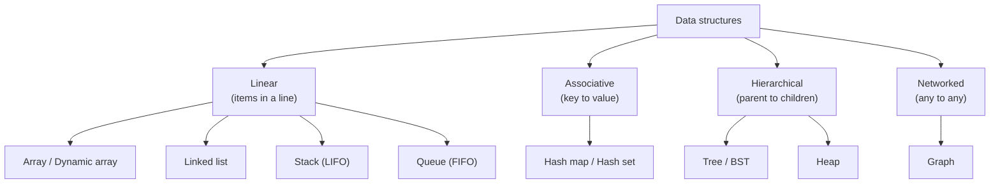

*The whole zoo on one page: linear structures keep items in a line, associative ones map keys to values, hierarchical ones nest parents over children, and a graph connects anything to anything.*

## Data structures at a glance

One table to compare them all. "Fast" is `O(1)` or `O(log n)`; "slow" is `O(n)`. Use it as a cheat sheet;
each row is explained in its own section below.

| Structure | Organizes data as... | Fast at | Slow at | .NET type |
| --- | --- | --- | --- |
| [Array](#arrays) | one fixed contiguous block | index access `O(1)` | insert/delete, resizing `O(n)` | `T[]` |
| [Dynamic array](#dynamic-arrays-array-lists) | a growable block | index `O(1)`, append `O(1)`* | insert/delete in the middle `O(n)` | `List<T>` |
| [Linked list](#linked-lists) | nodes joined by pointers | insert/delete **at a node** `O(1)` | random access `O(n)` | `LinkedList<T>` |
| [Stack](#stacks-lifo) | last-in, first-out | push / pop / peek `O(1)` | searching `O(n)` | `Stack<T>` |
| [Queue](#queues-fifo) | first-in, first-out | enqueue / dequeue `O(1)` | searching `O(n)` | `Queue<T>` |
| [Hash map](#hash-tables-hash-maps) | key to value via a hash | lookup / insert / delete `O(1)` avg | ordering; worst case `O(n)` | `Dictionary<K,V>` |
| [Binary search tree](#binary-search-trees) | values sorted by key | search / insert / delete `O(log n)`** | degrades to `O(n)` if unbalanced | `SortedDictionary<K,V>` |
| [Heap](#heaps-and-priority-queues) | partially ordered, min/max on top | peek `O(1)`, push / pop `O(log n)` | searching for a middle value `O(n)` | `PriorityQueue<T,P>` |
| [Graph](#graphs) | vertices joined by edges | modeling relationships | depends on the algorithm | adjacency list |

*\* amortized — see [dynamic arrays](#dynamic-arrays-array-lists). \*\* when balanced — see [balancing](#keeping-trees-balanced-and-b-trees).*

## Arrays

An **array** is the most basic structure: a single block of memory big enough to hold `n` elements of
the same type, laid out back-to-back. Because every element is the same size and they are contiguous,
the computer finds element `i` with one multiplication — `base_address + i * element_size` — so reading
or writing any position is **`O(1)`**, no matter how big the array is.

Key points:

- **Instant random access.** `books[14]` jumps straight to the 15th slot in one step. This is the
  array's superpower and the reason almost every other structure is built on top of one.
- **Fixed size.** An array of 15 `Book`s, each 250 bytes, reserves exactly `15 * 250 = 3750` contiguous
  bytes up front. To hold a 16th you must allocate a *bigger* block and copy everything over.
- **Costly inserts/deletes in the middle.** Removing element 0 means shifting the other `n - 1` elements
  left by one — `O(n)`. Arrays love appends-at-a-known-size and reads; they dislike reshaping.
- **[Zero-indexed](algorithms-glossary-reviewer.md#index "The integer position of an element; 0-indexed starts at 0, 1-indexed at 1.").** The first element is `books[0]`, the last is `books[n - 1]`. Off-by-one bugs almost
  always come from forgetting this.

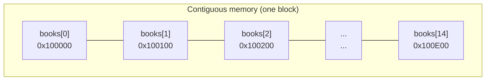

*An array is one unbroken block; element `i` sits a fixed stride from the start, so the address — and therefore the value — is found with a single calculation.*

```text
arr = [ 10, 20, 30, 40, 50 ]
index   0   1   2   3   4

arr[3]  ->  read slot 3 directly                -> 40        (O(1), no scanning)

delete arr[0]  ->  shift everything left by one:
        [ 20, 30, 40, 50, _ ]                                (O(n), n-1 moves)
```

*Indexing is one jump; deleting from the front forces every later element to slide down — the array's core trade-off.*

```csharp
int[] books = new int[15];   // reserves 15 contiguous slots
books[0] = 10;               // O(1) write
int third = books[2];        // O(1) read
```

**Go deeper →** [Arrays & Hashing](arrays-and-hashing-reviewer.md) for array techniques and the
hashing patterns built on them.

## Linked lists

A **linked list** stores each element in its own little box called a **[node](algorithms-glossary-reviewer.md#node "A single element of a linked structure: a value plus one or more links to other nodes.")**. Each node holds a value
and a [pointer](algorithms-glossary-reviewer.md#pointer "A value that holds the memory address of another value, letting structures link to each other.") (`next`) to the following node. The nodes can live *anywhere* in memory; the chain of
`next` pointers is what keeps them in order. The list itself is just a reference to the first node, the
**head**.

Key points:

- **Grows without copying.** To add an element you allocate one node and point at it. There is no "the
  block is full, reallocate and copy everything" step — that is the linked list's main advantage over an
  array.
- **No random access.** To reach the 5th element you must start at the head and follow `next` four times.
  Indexing is therefore **`O(n)`**, the linked list's main weakness.
- **Cheap insert/delete *at a known node*.** Splicing a node in or out is just a couple of pointer
  rewrites — `O(1)` — *if* you already hold the node. No shifting, unlike an array.
- **[Singly vs doubly](algorithms-glossary-reviewer.md#singly-and-doubly-linked-list "Singly-linked nodes point only to next; doubly-linked also point to previous.").** A singly-linked node points only forward (`next`); a doubly-linked node also
  points back (`prev`), which lets you walk both directions and delete a node without finding its
  predecessor first.

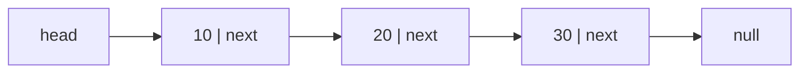

*Each node knows only the next one; the list is the head reference plus the chain of `next` pointers, and `null` marks the end.*

```text
insert 99 after the node holding 10  (singly linked):

  before:   head -> [10|*] -> [20|*] -> [30|*] -> null
  step 1:   new node [99|*] points to [20]      (10's old next)
  step 2:   [10]'s next now points to [99]
  after:    head -> [10|*] -> [99|*] -> [20|*] -> [30|*] -> null
```

*Insertion is two pointer rewrites — no elements move — but you had to be standing on the `10` node first.*

```csharp
class Node { public int Val; public Node? Next; }

// Walk the chain (O(n)) — there is no books[i] shortcut.
int CountNodes(Node? head)
{
    int count = 0;
    for (Node? cur = head; cur != null; cur = cur.Next)
        count++;
    return count;
}
```

**Go deeper →** [Linked Lists](linked-lists-reviewer.md) for reversal, [Floyd cycle
detection](algorithms-glossary-reviewer.md#fast-and-slow-pointers "One pointer moves twice as fast as another, meeting only if a cycle exists."), and merging.

## Arrays vs linked lists

These two are the foundational pair, and most other structures pick one of them as a backing store. The
contrast is worth memorizing.

| | Array | Linked list |
| --- | --- | --- |
| Size | fixed (resize = allocate + copy) | variable (just add a node) |
| Storage | compact, one contiguous block | sparse, nodes scattered in memory |
| Access element `i` | **`O(1)`** (direct) | `O(n)` (walk from head) |
| Insert/delete at a known spot | `O(n)` (shift others) | **`O(1)`** (rewire pointers) |
| Memory overhead | none per element | one+ pointer per node |
| Cache friendliness | excellent (neighbors adjacent) | poor (nodes scattered) |

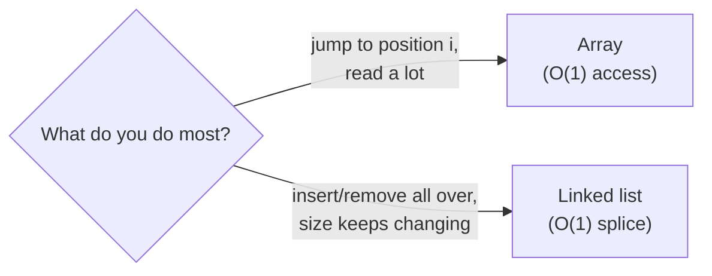

*Pick by your hot operation: random access and tight memory favor the array; constant reshaping favors the linked list.*

The headline: **arrays win on access, linked lists win on reshaping.** In practice a [dynamic
array](#dynamic-arrays-array-lists) (next section) blends the two well enough that it is the default
choice for most code.

## Dynamic arrays (array lists)

A plain array's fixed size is a hassle, so almost every language ships a **[dynamic
array](algorithms-glossary-reviewer.md#dynamic-array "A resizable array that grows automatically by copying into a larger backing array.")** — an array that grows itself. It keeps a normal array inside, plus a `count`. When you append
past the capacity, it allocates a **bigger** array (typically double the size), copies the old elements
over, and continues. In .NET this is `List<T>`.

Key points:

- **Append is `O(1)` amortized.** Any single append that triggers a resize is `O(n)` (it copies
  everything), but because the capacity *doubles*, those expensive copies are rare enough that the
  **average** cost per append is constant. This averaging is called
  [amortized analysis](algorithms-glossary-reviewer.md#amortized-analysis "Average cost per operation across a worst-case sequence, not a probability.").
- **Keeps the array's `O(1)` indexing.** You still get `list[i]` in one step — you get growth *and* fast
  access.
- **Middle inserts/deletes are still `O(n).`** Growth is cheap; reshaping the interior still shifts
  elements, just like a plain array.
- **Doubling matters.** Growing by a *fixed* amount (say +10) each time would make appends `O(n)`
  overall; growing by a *factor* is what buys the amortized `O(1)`.

```text
append into a dynamic array that doubles when full (start capacity 2):

  add 1   [1, _]              cap 2,  fits
  add 2   [1, 2]              cap 2,  now full
  add 3   [1, 2] -> copy ->   [1, 2, 3, _]      cap 4   (resize: O(n) this once)
  add 4   [1, 2, 3, 4]        cap 4,  now full
  add 5   copy -> [1,2,3,4,5,_,_,_]             cap 8   (resize again, rarer)
```

*Most appends just drop into a free slot; only the occasional doubling copies the whole array, so the average append stays `O(1)`.*

```csharp
var list = new List<int>();   // dynamic array
list.Add(1);                  // amortized O(1)
list.Add(2);
int first = list[0];          // O(1) indexing, like a plain array
```

**Go deeper →** [Collections & Big-O (.NET)](../dotnet/csharp/collections-and-big-o-reviewer.md) for
`List<T>` capacity behavior and the full cost table.

## Stacks (LIFO)

A **[stack](algorithms-glossary-reviewer.md#stack "A last-in-first-out collection: you add and remove only at the top.")** is a collection where you only ever add or remove at **one end**, the *top*. The last item you
put in is the first one you take out — **LIFO** (Last-In, First-Out), like a stack of plates. It has just
three operations, all **`O(1)`**: **push** (add to top), **pop** (remove from top), **peek** (look at the
top without removing).

Key points:

- **Only the top is reachable.** You cannot pull from the middle. That restriction is the point — it
  makes the structure simple and every operation constant-time.
- **The classic use is "undo".** Each action is pushed; "undo" pops the most recent one. Anything
  phrased as "most recent first" or "reverse the order" is a stack.
- **It powers [DFS](algorithms-glossary-reviewer.md#depth-first-search "Explores as far down one branch as possible before backtracking.") and the [call stack](algorithms-glossary-reviewer.md#call-stack "Memory tracking active function calls; each call pushes a frame, popped on return.").** Recursive calls are pushed and popped on a stack; replacing
  recursion with an explicit stack is a standard interview move.
- **Backed by either primitive.** A stack can sit on a dynamic array (push/pop at the end) or a linked
  list (push/pop at the head) — both give `O(1)` ends.

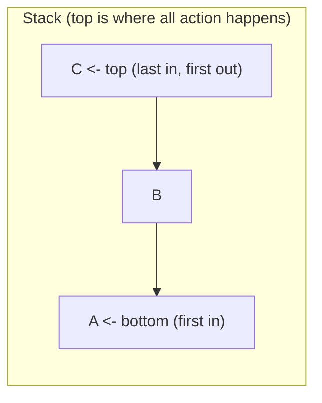

*You add and remove only at the top, so the most recently pushed item (`C`) is always the first to pop.*

```text
push A, push B, push C, then pop twice:

  []              start (empty)
  [A]             push A
  [A, B]          push B            top -> B
  [A, B, C]       push C            top -> C
  [A, B]          pop  -> C         (newest leaves first)
  [A]             pop  -> B
```

*Top is the rightmost slot; pop always returns the most recent push — the defining LIFO behavior.*

```csharp
var stack = new Stack<int>();
stack.Push(1);
stack.Push(2);
int top = stack.Peek();   // 2, not removed
int out1 = stack.Pop();   // 2  (last in, first out)
int out2 = stack.Pop();   // 1
```

**Go deeper →** [Stacks & Monotonic Stacks](stacks-and-monotonic-stacks-reviewer.md) for bracket
matching, [next-greater-element](algorithms-glossary-reviewer.md#monotonic-stack "A stack kept in sorted order to find next/previous greater or smaller in O(n)."), and converting recursion to iteration.

## Queues (FIFO)

A **[queue](algorithms-glossary-reviewer.md#queue "A first-in-first-out collection: add at the back, remove from the front.")** is the mirror image of a stack: you add at one end (the *back*) and remove from the *other*
end (the *front*). The first item in is the first out — **FIFO** (First-In, First-Out), exactly like a
line at a checkout. Its operations are **enqueue** (add to back), **dequeue** (remove from front), and
**peek** (look at the front), all **`O(1)`**.

Key points:

- **Fairness / arrival order.** A queue processes things in the order they arrived — the natural fit for
  a job queue, a print spooler, or a video-encoding backlog where requests are handled first-come,
  first-served.
- **It powers [BFS](algorithms-glossary-reviewer.md#breadth-first-search "Explores a structure level by level, visiting nearer nodes before farther ones.").** Breadth-first search visits a graph level by level using a queue; swapping a
  stack for a queue is exactly what turns DFS into BFS.
- **Implemented as a circular buffer or linked list.** To keep both ends `O(1)` on an array, a queue
  tracks a head and tail index that *wrap around* (a circular buffer), so dequeue never shifts elements.
- **A [deque](algorithms-glossary-reviewer.md#deque "A double-ended queue: add and remove at both the front and the back in O(1).") generalizes both.** A double-ended queue allows add/remove at *both* ends in `O(1)`, so
  it can act as a stack, a queue, or the sliding-window monotonic deque.

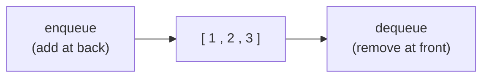

*Items join at the back and leave from the front, so they are served in the exact order they arrived.*

```text
enqueue 1, 2, 3, then dequeue twice:

  front [          ] back
        [1]                 enqueue 1
        [1, 2]              enqueue 2
        [1, 2, 3]           enqueue 3
        [2, 3]              dequeue -> 1     (oldest leaves first)
        [3]                 dequeue -> 2
```

*Front is the left end; dequeue always returns the oldest item — the defining FIFO behavior, opposite to a stack.*

```csharp
var queue = new Queue<int>();
queue.Enqueue(1);
queue.Enqueue(2);
int front = queue.Peek();    // 1, not removed
int out1 = queue.Dequeue();  // 1  (first in, first out)
int out2 = queue.Dequeue();  // 2
```

**Go deeper →** [Stacks & Monotonic Stacks](stacks-and-monotonic-stacks-reviewer.md) (covers queues and
deques) and [Graphs](graphs-reviewer.md) (BFS is a queue in action).

## Hash tables (hash maps)

A **[hash table](algorithms-glossary-reviewer.md#hash-table "An array of buckets plus a hash function, giving average O(1) insert, lookup, and delete.")** (called a **[hash map](algorithms-glossary-reviewer.md#hash-map "Stores key-value pairs and retrieves a value by key in O(1) average time.")** when it stores key→value pairs) gives you the holy grail: look up a
value **by key in `O(1)` average time**. It is an array of slots called *buckets*, plus a **[hash
function](algorithms-glossary-reviewer.md#hashing "Turning a key into a fixed-size integer used to place or find it in a table.")** that turns a key into a bucket index. To store `key→value`, compute `index = hash(key) % size`
and drop the pair in that bucket; to look it up, hash again and go straight there.

Key points:

- **The hash function does the magic.** It maps a key (a string, an object) to a fixed-size integer. A
  toy example is `hash(s) = s.Length`, but a real one mixes all the bits so different keys spread evenly.
- **Good hash functions are [Deterministic, Fixed-size, Uniform, Efficient](algorithms-glossary-reviewer.md#hashing "Turning a key into a fixed-size integer used to place or find it in a table.")** (and, for security uses,
  hard to reverse). *Deterministic* = same key always hashes the same; *uniform* = keys spread evenly to
  avoid pileups. **Do not write your own** — use the language's built-in hashing.
- **[Collisions](algorithms-glossary-reviewer.md#hash-collision "When two different keys hash to the same bucket; resolved by chaining or probing.") are unavoidable** — two keys can land in the same bucket (the toy length-hash sends
  every 3-letter word to the same place). They are resolved by *chaining* (each bucket holds a small
  list) or *open addressing* (probe for the next free slot). Too many collisions degrade lookups toward
  `O(n)` — the worst case.
- **It [resizes](algorithms-glossary-reviewer.md#load-factor "Ratio of stored entries to buckets; crossing a threshold triggers a resize/rehash.") to stay fast.** When it gets too full (the *load factor* crosses a threshold), it
  grows the bucket array and re-hashes everything, keeping collisions — and therefore lookups — near
  `O(1)`.
- **No order.** A hash map gives you fast lookup but *no* sorted iteration. If you need keys in order,
  use a sorted/tree-based map instead.

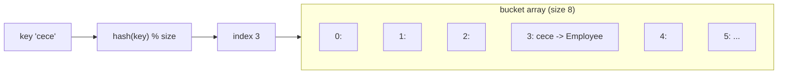

*The hash function turns a key into a bucket index in one step, so storing and finding `cece` skips straight to bucket 3 instead of scanning.*

```text
toy hash:  hash(s) = s.Length ;  index = hash % 8 ;  table size 8

  key      len   index   lands in
  ----------------------------------------
  "ox"      2      2      bucket 2
  "cat"     3      3      bucket 3
  "dog"     3      3      bucket 3   <- collision with "cat" (same length!)
  "bird"    4      4      bucket 4
  "fish"    4      4      bucket 4   <- collision with "bird"
```

*Why `length` is a terrible hash: every word of the same length collides. A real hash mixes all the characters so keys scatter across all buckets.*

```csharp
var ages = new Dictionary<string, int>();
ages["alice"] = 30;                 // O(1) average insert
ages["bob"] = 25;
int a = ages["alice"];              // O(1) average lookup -> 30
bool has = ages.ContainsKey("eve"); // O(1) average -> false
```

**Go deeper →** [Hash Table Internals](hash-tables-reviewer.md) for hash-function properties, chaining vs
open addressing, and resizing; [Arrays & Hashing](arrays-and-hashing-reviewer.md) for the problem
patterns that use them.

## Trees

A **[tree](algorithms-glossary-reviewer.md#tree "A hierarchy of nodes with one root and no cycles; every node has one parent except the root.")** organizes data as a hierarchy: nodes connected in **parent→child** relationships, with one
special node at the top (the **root**) and no cycles. It is really a linked list with *multiple* `next`
pointers per node — each node can point to several children. A file system is a tree (folders contain
folders contain files); so is an HTML page and an org chart.

Key points:

- **Terminology you must know:** the **root** is the top node; a node's **children** hang below it and
  share its **parent**; a node with no children is a **[leaf](algorithms-glossary-reviewer.md#leaf "A node with no children; the bottom of a tree.")**; the **[height](algorithms-glossary-reviewer.md#height-depth-and-level "Depth measures down from the root; height measures up from leaves; level groups by depth.")** is the longest
  root-to-leaf path.
- **Trees are recursive.** Every node together with its descendants is itself a complete (smaller) tree
  — a *subtree*. That is why almost every tree algorithm is naturally written with recursion: solve the
  children, combine.
- **A [binary tree](algorithms-glossary-reviewer.md#binary-tree "A tree where every node has at most two children, called left and right.")** restricts each node to **at most two** children (`left` and `right`). It is the
  most common kind and the basis for BSTs and heaps below.
- **Traversal = visiting every node** in some order. The orders have names (pre-order, in-order,
  post-order, level-order) covered in the [next section](#binary-search-trees) and the deep reviewer.

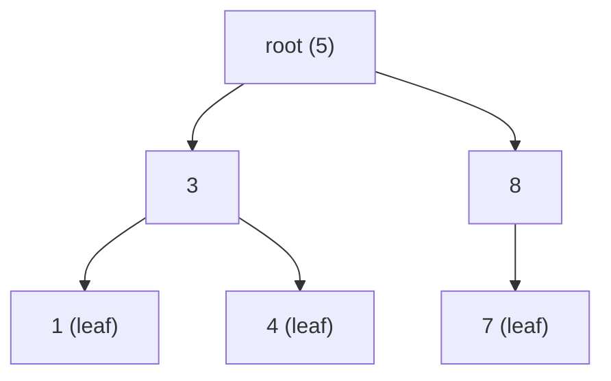

*One root at the top, parent→child edges downward, leaves at the bottom; any node plus its descendants is itself a smaller tree.*

```text
a tree is recursive — each subtree is a full tree:

        (5)                whole tree, rooted at 5
       /   \
     (3)    (8)            (3) roots a subtree: { 3, 1, 4 }
     / \      \            (8) roots a subtree: { 8, 7 }
   (1) (4)    (7)          (1),(4),(7) are leaves (subtrees of size 1)
```

*Because every subtree is itself a tree, tree algorithms recurse: handle the root, then recurse into each child's subtree.*

```csharp
class TreeNode
{
    public int Val;
    public TreeNode? Left;
    public TreeNode? Right;
}
```

**Go deeper →** [Trees & Binary Search Trees](trees-and-binary-search-trees-reviewer.md) for traversals,
depth/height, and lowest common ancestor.

## Binary search trees

A **[binary search tree](algorithms-glossary-reviewer.md#binary-search-tree "A binary tree where left subtree values are smaller and right are larger.")** (BST) is a binary tree with one extra rule that makes it powerful: for every
node, **everything in its left subtree is smaller, and everything in its right subtree is larger**. That
ordering means searching works like [binary search](algorithms-glossary-reviewer.md#binary-search "Repeatedly halve a sorted range to locate a target in O(log n).") — at each node you go left or right, halving the
remaining nodes — so search, insert, and delete are **`O(log n)`** when the tree is balanced.

Key points:

- **The invariant is "left &lt; node &lt; right", everywhere.** It must hold for *every* node, not just the
  root. This is what lets you discard half the tree at each step.
- **Search/insert follow the same path.** Compare the target to the current node; go left if smaller,
  right if larger; stop at a match or an empty spot. Insertion just drops the new value at the empty spot
  the search lands on.
- **In-order [traversal](algorithms-glossary-reviewer.md#tree-traversal "Visiting every node of a tree in a systematic order.") gives sorted output.** Visit left subtree, then the node, then the right subtree,
  and the values come out in ascending order — a handy property unique to BSTs.
- **Balance is everything.** Insert already-sorted data and the BST degenerates into a linked list
  (every node has only a right child), and operations slump to `O(n)`. The [next
  section](#keeping-trees-balanced-and-b-trees) fixes that.

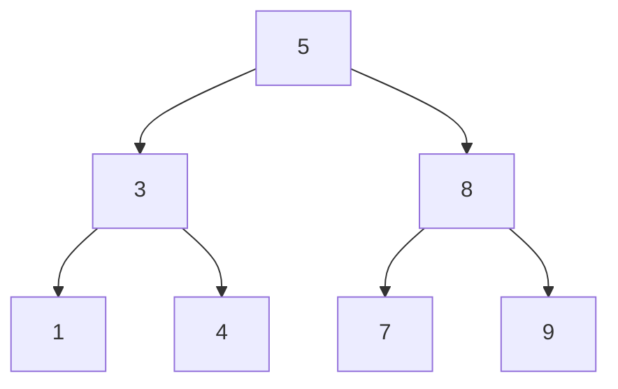

*BST rule in action: everything left of `5` is below 5, everything right is above; the same holds at `3` and `8`, all the way down.*

```text
insert 5, 3, 8, 1, 4 into an empty BST (smaller=left, larger=right):

  add 5      5                      first value becomes the root

  add 3      5                      3 < 5  -> go left, empty -> place
            /
           3

  add 8      5                      8 > 5  -> go right, empty -> place
            / \
           3   8

  add 1      5                      1 < 5 -> left; 1 < 3 -> left, place
            / \
           3   8
          /
         1

  add 4      5                      4 < 5 -> left; 4 > 3 -> right, place
            / \
           3   8
          / \
         1   4
```

*Each insert walks down comparing — left if smaller, right if larger — and drops the value into the first empty spot it finds.*

```csharp
// Search a BST: O(log n) when balanced, O(n) if it degenerated into a chain.
bool Contains(TreeNode? node, int target)
{
    while (node != null)
    {
        if (target == node.Val) return true;
        node = target < node.Val ? node.Left : node.Right;
    }
    return false;
}
```

**Go deeper →** [Trees & Binary Search Trees](trees-and-binary-search-trees-reviewer.md) for the four
traversals, deletion, and BST interview problems.

## Keeping trees balanced, and B-trees

A BST only delivers `O(log n)` if it stays **[balanced](algorithms-glossary-reviewer.md#balanced-tree "A tree kept near minimum height (about log n) so operations stay O(log n).")** — short and bushy rather than tall and stringy.
Self-balancing trees enforce this automatically; **B-trees** apply the same idea to data stored on disk.

Key points:

- **An unbalanced BST is just a linked list.** Insert `1, 2, 3, 4, 5` in order and every node hangs off
  the right — height `n`, search `O(n)`. Balancing keeps height near `log n`.
- **[AVL](algorithms-glossary-reviewer.md#avl-tree "A self-balancing BST that rotates whenever a node's subtree heights differ by more than one.") / red-black trees self-balance with [rotations](algorithms-glossary-reviewer.md#tree-rotation "A local O(1) re-link of a node and a child that rebalances a BST while preserving order.").** After an insert or delete unbalances a node, a
  small local re-link (a *rotation*) restores balance in `O(1)`, keeping every operation `O(log n)`.
- **A [B-tree](algorithms-glossary-reviewer.md#multiway-tree "A tree whose nodes hold many keys and have many children, keeping it shallow.") is a "fat", shallow tree for disk.** Each node holds *many* keys and has *many* children
  (high fan-out), so the tree is only a few levels deep even for billions of keys — which means only a
  few slow disk reads per lookup. This is why databases and filesystems index with B-trees.
- **In memory, reach for the balanced BST; on disk, the B-tree.** `.NET`'s `SortedDictionary`/`SortedSet`
  are balanced trees; a database index is a B-tree.

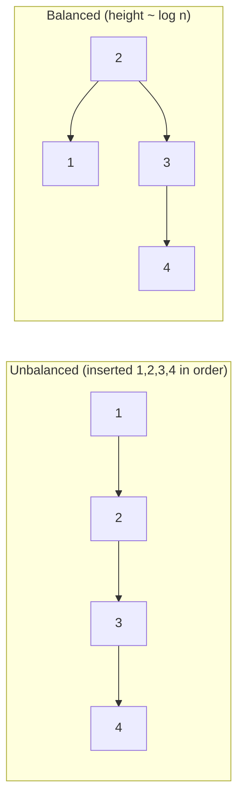

*Same four values: inserted in sorted order a BST degenerates to an `O(n)` chain (left); a balanced tree keeps height near `log n` so operations stay `O(log n)` (right).*

**Go deeper →** [Balanced Trees & AVL](balanced-trees-and-avl-reviewer.md) for the four rotations, and
[B-Trees](b-trees-reviewer.md) for the disk-friendly multiway tree behind database indexes.

## Graphs

A **[graph](algorithms-glossary-reviewer.md#graph "Vertices connected by edges, modeling arbitrary relationships, possibly cyclic.")** is the most general structure: a set of **vertices** (nodes) connected by **edges**
(links), with *no* restriction on the shape — any vertex may connect to any other, and cycles are
allowed. A tree is just a special graph (connected, no cycles). Graphs model anything relational:
flight routes between cities, friendships in a social network, web pages and links, task dependencies.

Key points:

- **Edges can be directed or undirected, weighted or not.** A one-way street is a *directed* edge;
  a flight with a price is a *[weighted](algorithms-glossary-reviewer.md#weighted-graph "A graph whose edges carry numeric costs, used for shortest-path problems.")* edge. These choices decide which algorithm you need.
- **Two ways to store it.** An **adjacency list** (each vertex keeps a list of its neighbors) is compact
  for sparse graphs and the usual choice; an **adjacency matrix** (an `n × n` grid of "is there an edge?")
  is simple but uses `O(n²)` space.
- **The two core traversals are [BFS](algorithms-glossary-reviewer.md#breadth-first-search "Explores a structure level by level, visiting nearer nodes before farther ones.") and [DFS](algorithms-glossary-reviewer.md#depth-first-search "Explores as far down one branch as possible before backtracking.").** BFS (a queue) explores level by level and finds
  shortest paths in unweighted graphs; DFS (a stack or recursion) plunges deep first. Both are `O(V + E)`.
- **Watch for cycles.** Unlike trees, graphs can loop, so traversals must track *visited* vertices or
  they will spin forever.

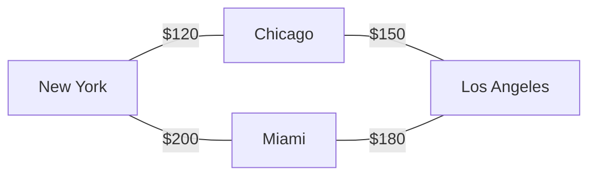

*A weighted, undirected graph of flights: vertices are cities, edges are routes, and the weights are costs — shortest-path algorithms work over exactly this.*

```text
adjacency list for the graph above:

  New York    -> [ Chicago(120), Miami(200) ]
  Chicago     -> [ New York(120), Los Angeles(150) ]
  Miami       -> [ New York(200), Los Angeles(180) ]
  Los Angeles -> [ Chicago(150), Miami(180) ]
```

*Each vertex stores only its own neighbors (and edge weights) — compact for real-world graphs, which are usually sparse.*

**Go deeper →** [Graphs](graphs-reviewer.md) for BFS/DFS, [Dijkstra's shortest
path](algorithms-glossary-reviewer.md#dijkstra "Finds shortest paths from a source on non-negative weights via a min-heap."), topological sort, and union-find.

## Heaps and priority queues

A **[priority queue](algorithms-glossary-reviewer.md#priority-queue "Serves elements by priority rather than arrival; usually a heap.")** is a queue that serves the **highest-priority** item next instead of the oldest. The
structure that implements it efficiently is the **[heap](algorithms-glossary-reviewer.md#heap "A tree structure keeping the smallest or largest element instantly accessible.")** — a binary tree with one rule: every parent is
`≤` its children (a **[min-heap](algorithms-glossary-reviewer.md#min-heap-and-max-heap "A min-heap keeps the smallest at its root; a max-heap keeps the largest.")**, smallest on top) or every parent is `≥` its children (a **max-heap**,
largest on top). So the min/max is always sitting at the root — peek is `O(1)` — while push and pop are
`O(log n)`.

Key points:

- **It is the right tool for "repeatedly get the smallest/largest".** Top-K, streaming median,
  scheduling by priority, Dijkstra's algorithm — all lean on a heap. A naive sorted list would make
  insert `O(n)`; the heap makes it `O(log n)`.
- **A heap is a [complete binary tree](algorithms-glossary-reviewer.md#complete-binary-tree "Every level full except possibly the last, which fills left to right; lets a heap live in an array."),** meaning every level is full except the last, which fills
  left to right. That regular shape lets a heap live in a plain **array** with no pointers.
- **Array math replaces child pointers.** For the node at index `i`: `left = 2i + 1`, `right = 2i + 2`,
  `parent = (i - 1) / 2`. Walking the tree is just arithmetic on indices.
- **Push/pop restore the heap with sift-up/sift-down.** A new value is added at the end and bubbles
  *up* past bigger parents; removing the root moves the last element to the top and sinks it *down* —
  each touches at most `log n` levels.

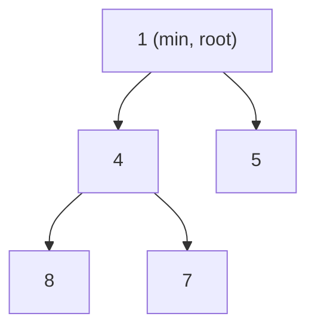

*A min-heap: every parent is ≤ its children, so the smallest value (`1`) is always at the root and readable in `O(1)`.*

```text
the same min-heap lives in an array (no pointers needed):

           (1)
          /   \
        (4)    (5)
        / \
      (8) (7)

  index:  0   1   2   3   4
  value:  1   4   5   8   7

  for index i:   left = 2i+1    right = 2i+2    parent = (i-1)/2
  node 4 at i=1: left = i3 = 8,  right = i4 = 7,  parent = i0 = 1
```

*A complete tree packs perfectly into an array: a node's children and parent are found by index arithmetic, so the heap needs no `left`/`right` pointers at all.*

```csharp
// .NET's PriorityQueue is a min-heap by default: lowest priority value comes out first.
var pq = new PriorityQueue<string, int>();
pq.Enqueue("backup", 5);
pq.Enqueue("alert", 1);
pq.Enqueue("report", 3);
string next = pq.Dequeue();   // "alert"  (priority 1, the smallest)
```

**Go deeper →** [Heaps & Priority Queues](heaps-and-priority-queues-reviewer.md) for heapify, top-K,
streaming median, and merge-K-sorted.

## Data structures by language (C# / .NET)

You rarely implement these from scratch in real code — you reach for the standard library. Here is each
abstract structure mapped to its .NET (C#) type. This is the "Data Structures by Language" view: same
ideas, concrete names.

| Abstract structure | .NET type | Notes |
| --- | --- | --- |
| Array | `T[]` | fixed size; `O(1)` index |
| [Dynamic array](#dynamic-arrays-array-lists) | `List<T>` | the default list; amortized `O(1)` append |
| [Linked list](#linked-lists) | `LinkedList<T>` | doubly linked; `O(1)` add/remove at a known node |
| [Stack](#stacks-lifo) | `Stack<T>` | LIFO; `Push` / `Pop` / `Peek` |
| [Queue](#queues-fifo) | `Queue<T>` | FIFO; `Enqueue` / `Dequeue` / `Peek` |
| [Hash map](#hash-tables-hash-maps) | `Dictionary<TKey,TValue>` | `O(1)` avg by key; unordered |
| [Hash set](algorithms-glossary-reviewer.md#hash-set "Stores unique keys with O(1) average membership testing and no values.") | `HashSet<T>` | unique items; `O(1)` avg membership |
| Sorted map / set ([balanced BST](#keeping-trees-balanced-and-b-trees)) | `SortedDictionary<K,V>` / `SortedSet<T>` | keys kept sorted; `O(log n)` |
| [Heap](#heaps-and-priority-queues) / priority queue | `PriorityQueue<TElement,TPriority>` | min-heap by default; `O(log n)` enqueue/dequeue |
| Deque (double-ended) | `LinkedList<T>` | no dedicated `Deque<T>`; `LinkedList<T>` gives `O(1)` both ends |
| Immutable / concurrent | `ImmutableArray<T>`, `ConcurrentDictionary<K,V>` | thread-safe and immutable variants |

Key points:

- **Default to `List<T>` and `Dictionary<K,V>`.** They cover the vast majority of code: a growable
  sequence and a fast key→value lookup.
- **Reach for `SortedDictionary`/`SortedSet` only when you need order.** They cost `O(log n)` instead of
  `O(1)` — pay that only when you actually need keys sorted or range queries.
- **There is no `Deque<T>` in the BCL.** Use `LinkedList<T>` (O(1) both ends) when you need one.

**Go deeper →** [Collections & Big-O (.NET)](../dotnet/csharp/collections-and-big-o-reviewer.md) for the
complete cost table of every BCL collection.

## Choosing a structure

When you do not know which to grab, ask one question: *what operation do I repeat most?* Pick the
structure that makes that operation cheapest.

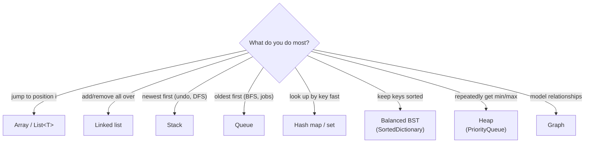

*The structure follows from the hot operation: name what you do most, and the cheapest structure for it is your answer.*

## Interview Q&A

Q: Why is reading `arr[1000]` just as fast as reading `arr[0]`?
A: An array is a contiguous block of equal-size elements, so the address of element `i` is `base + i * size` — one multiply and add, regardless of `i`. That is what `O(1)` random access means. A linked list has no such formula; you must walk `i` nodes, which is `O(n)`.

Q: When would you choose a linked list over a (dynamic) array?
A: When you insert and delete frequently at positions you already hold a reference to, and rarely need random access — splicing a node is `O(1)` with no shifting. In practice this is uncommon; a `List<T>` wins most of the time thanks to cache-friendly contiguous memory, so reach for a linked list deliberately, not by default.

Q: What makes a hash map `O(1)` on average, and when does it become `O(n)`?
A: A hash function sends each key to a bucket in constant time, so lookups skip straight there. It degrades toward `O(n)` when many keys collide into the same bucket (a poor hash, or an adversarial input), turning a bucket into a long list to scan. Good hash functions and resizing when the load factor climbs keep collisions rare.

Q: What is the difference between a stack and a queue, in one sentence each?
A: A stack is LIFO — you add and remove at the same end (the top), so the newest item leaves first (think undo). A queue is FIFO — you add at the back and remove from the front, so the oldest item leaves first (think a checkout line).

Q: Why does a binary search tree need to stay balanced?
A: Its `O(log n)` operations depend on the tree being short — each step discards half the remaining nodes. If you insert sorted data into a plain BST it grows into a one-sided chain (height `n`), and search slumps to `O(n)`. Self-balancing trees (AVL, red-black) rotate after inserts/deletes to keep the height near `log n`.

Q: Why can a heap live in an array while a general tree cannot?
A: A heap is a *complete* binary tree — every level is full except the last, which fills left to right — so there are no gaps. That regularity lets you map node `i` to children `2i+1` / `2i+2` by arithmetic alone, with no pointers. A general tree has arbitrary shape, so it needs explicit child references.

Q: A graph and a tree look similar — what is the actual difference?
A: A tree is a restricted graph: connected, with exactly one path between any two nodes and therefore no cycles, and a single root. A general graph can have cycles, disconnected pieces, multiple edges into a node, and no notion of a root — so graph traversals must track visited nodes to avoid looping forever.

## Rapid-fire round

- Read element at position `i` instantly → **Array (`O(1)` index).**
- Size keeps changing, mostly appends → **Dynamic array (`List<T>`, amortized `O(1)`).**
- Insert/remove all over a sequence you walk → **Linked list (`O(1)` splice).**
- "Most recent first" / undo / DFS → **Stack (LIFO).**
- "Oldest first" / job queue / BFS → **Queue (FIFO).**
- Look something up by key, fast → **Hash map (`O(1)` average).**
- "Have I seen this?" / dedupe → **Hash set.**
- Keep keys sorted, range queries → **Balanced BST (`SortedDictionary`/`SortedSet`).**
- Repeatedly pull the smallest/largest → **Heap / priority queue (`O(log n)`).**
- Relationships, routes, dependencies → **Graph (BFS/DFS).**
- Heap node `i` → **children `2i+1`, `2i+2`; parent `(i-1)/2`.**
- BST in-order traversal → **yields sorted order.**
- Unbalanced BST → **degenerates to `O(n)`; balance to fix.**

## Exam-style questions

1. You need a collection that you mostly append to and read by index, and whose size is not known up
   front. Which structure, and what is the cost of an append?

**Answer:** A [dynamic array](#dynamic-arrays-array-lists) (`List<T>`). Append is **amortized `O(1)`**:
most appends drop into a free slot in `O(1)`, and the occasional capacity-doubling copy is `O(n)` but
rare enough that the average stays constant. Indexing remains `O(1)`. A linked list would lose the `O(1)`
indexing; a plain array would need manual resizing.

2. You implement a hash map with `hash(s) = s.Length` and insert many words. What goes wrong, and why?

**Answer:** Massive [collisions](algorithms-glossary-reviewer.md#hash-collision "When two different keys hash to the same bucket; resolved by chaining or probing."). Every word of the same length maps to the same bucket, so a few buckets
hold long chains while most stay empty — lookups degrade toward `O(n)`. The hash is *deterministic* but
not *uniform*. A real hash function mixes all characters so keys spread evenly across buckets. (Rule of
thumb: never write your own hash; use the language's.)

3. You insert the keys `1, 2, 3, 4, 5` in that order into a plain (non-balancing) binary search tree.
   Draw the shape and give the search cost.

**Answer:** Each key is larger than all before it, so every node becomes the right child of the previous
one — the tree degenerates into a right-leaning **chain** of height 5 (effectively a linked list). Search
is therefore **`O(n)`**, not `O(log n)`. This is exactly why self-balancing trees exist; an AVL or
red-black tree would rotate during these inserts to keep the height near `log n`.

4. A min-heap is stored in the array `[1, 4, 5, 8, 7]`. What are the children of the value `4`, and is
   the heap valid?

**Answer:** `4` is at index 1, so its children are at indices `2*1+1 = 3` (value `8`) and `2*1+2 = 4`
(value `7`). The heap is **valid**: every parent is `≤` its children — `1 ≤ 4` and `1 ≤ 5` at the root,
and `4 ≤ 8` and `4 ≤ 7` below — so the minimum (`1`) sits at the root, readable in `O(1)`.

5. You must process tasks in the order they arrive, but a graph search must go *level by level* from a
   start node. Which single data structure serves both, and why?

**Answer:** A [queue](#queues-fifo) (FIFO). Arrival-order processing is the queue's definition, and
breadth-first search uses a queue to visit all nodes at distance 1, then distance 2, and so on — popping
the front always yields the next-closest unvisited node. (Swap the queue for a stack and BFS becomes
DFS.)

## 30-second takeaway

> Every **data structure** is a trade-off that makes some operations cheap and others expensive; pick by
> the operation you repeat most. **Arrays** give `O(1)` access but cost `O(n)` to reshape; **linked
> lists** are the reverse. A **dynamic array** (`List<T>`) blends them and is the default. **Stacks** are
> LIFO (newest first; undo, DFS); **queues** are FIFO (oldest first; jobs, BFS). A **hash map** gives
> `O(1)`-average lookup by key via a hash function, degrading to `O(n)` only under heavy collisions.
> **Trees** are hierarchies; a **BST** keeps `left < node < right` for `O(log n)` search *when balanced*
> (else `O(n)` — which is why **AVL/red-black** trees rotate, and **B-trees** stay shallow for disk).
> **Heaps** keep the min/max at the root (`O(1)` peek, `O(log n)` push/pop) and pack into an array via
> `2i+1`/`2i+2`. **Graphs** model anything relational and are explored with BFS (queue) or DFS (stack).
> Read the quick version here, then follow the **Go deeper →** links for the full treatment.

## Quick recall checklist

- **Two primitives:** contiguous block (array) and linked node (pointer); everything else builds on one.
- **Array:** `O(1)` index, `O(n)` insert/delete/resize, fixed size.
- **Dynamic array (`List<T>`):** `O(1)` index, **amortized `O(1)`** append (capacity doubles), `O(n)` middle insert.
- **Linked list:** `O(n)` access, `O(1)` splice at a known node; grows without copying.
- **Stack (LIFO):** push/pop/peek `O(1)`; undo, DFS, call stack.
- **Queue (FIFO):** enqueue/dequeue/peek `O(1)`; jobs, BFS.
- **Hash map:** `O(1)` average lookup/insert/delete via a hash; `O(n)` worst case; no order. Good hashes are deterministic + uniform.
- **BST:** `left < node < right`; `O(log n)` balanced, `O(n)` if degenerate; in-order = sorted.
- **Balanced (AVL/red-black):** rotations keep height `~log n`. **B-tree:** wide + shallow for disk indexes.
- **Heap:** complete binary tree in an array; peek `O(1)`, push/pop `O(log n)`; children `2i+1`/`2i+2`, parent `(i-1)/2`.
- **Graph:** vertices + edges, cycles allowed; adjacency list; BFS (queue) / DFS (stack), both `O(V + E)`.

## References

- AlgoMonster — [DSA Review / Basic Data Structures and Algorithms](https://algo.monster/problems/basic_dsa) (the quick-review framing this reviewer mirrors).
- Robert Horvick — *Foundations of Computing: Data Structures* (Pluralsight), the slide course this review distills.
- Microsoft Learn — [Collections and Data Structures (.NET)](https://learn.microsoft.com/en-us/dotnet/standard/collections/).
- Microsoft Learn — [`List<T>`](https://learn.microsoft.com/en-us/dotnet/api/system.collections.generic.list-1), [`Dictionary<TKey,TValue>`](https://learn.microsoft.com/en-us/dotnet/api/system.collections.generic.dictionary-2), [`PriorityQueue<TElement,TPriority>`](https://learn.microsoft.com/en-us/dotnet/api/system.collections.generic.priorityqueue-2).
- Wikipedia — [Data structure](https://en.wikipedia.org/wiki/Data_structure), [Hash table](https://en.wikipedia.org/wiki/Hash_table), [Binary search tree](https://en.wikipedia.org/wiki/Binary_search_tree), [Heap (data structure)](https://en.wikipedia.org/wiki/Heap_(data_structure)).
