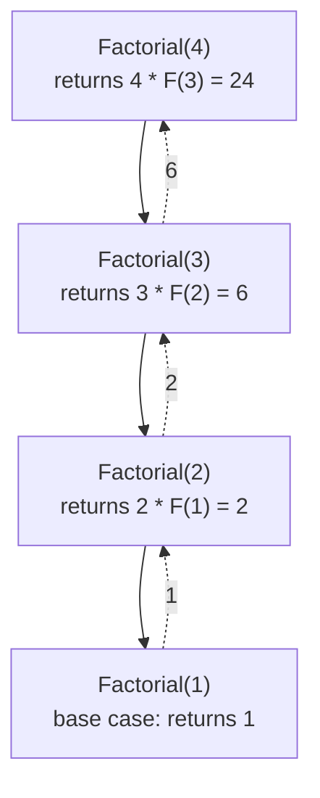
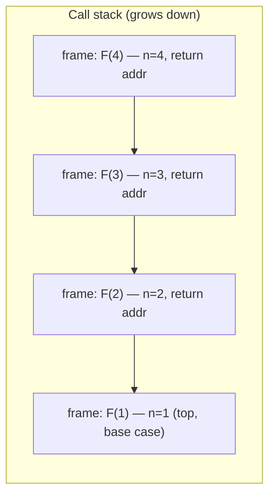
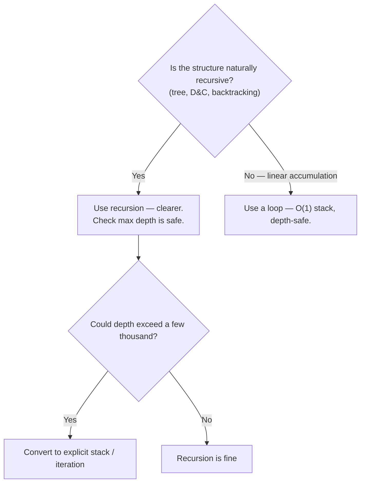
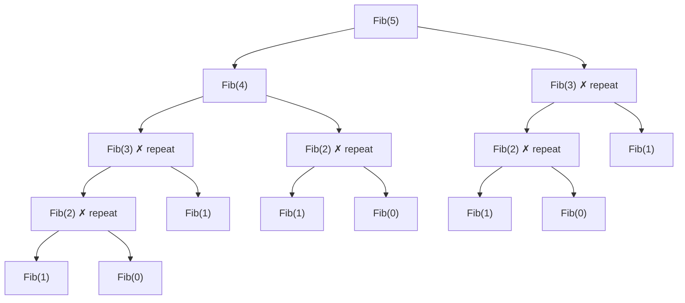
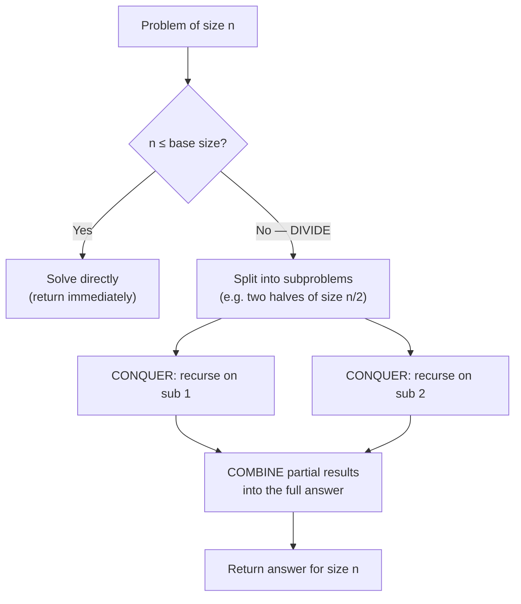
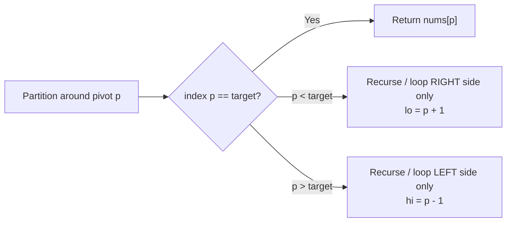
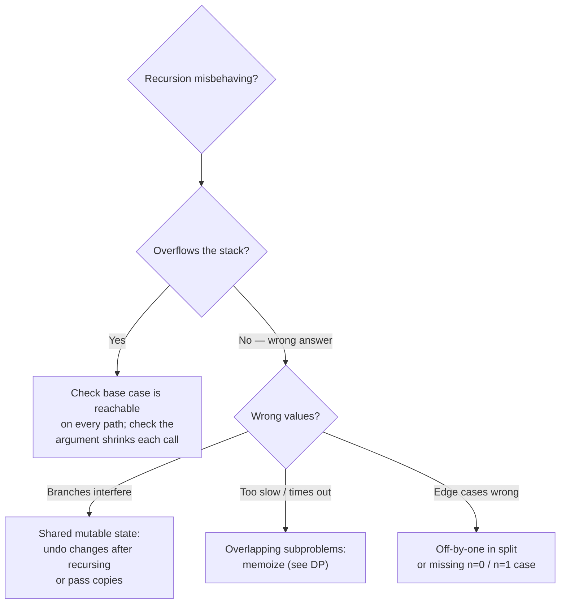

# Recursion & Divide and Conquer (Reviewer)

[Recursion](algorithms-glossary-reviewer.md#recursion "A function solving a problem by calling itself on smaller versions of it.") is the technique of solving a problem by having a function call itself on a smaller version
of the same problem, bottoming out at a **[base case](algorithms-glossary-reviewer.md#base-case "The condition where a recursive function stops and returns a direct answer.")** that is solvable directly. It is less an
"algorithm" and more a *way of thinking*: trust that the function already works for smaller inputs
(the **recursive leap of faith**), describe how to combine those smaller answers into the answer for
the current input, and make sure every call moves strictly closer to a base case so the recursion
terminates. Almost every [tree](algorithms-glossary-reviewer.md#tree "A hierarchy of nodes with one root, no cycles, and one parent per node."), [graph](algorithms-glossary-reviewer.md#graph "Vertices connected by edges, modeling arbitrary relationships, possibly cyclic."), and [dynamic-programming](algorithms-glossary-reviewer.md#dynamic-programming "Solving problems with overlapping subproblems by computing each once and reusing it.") solution is recursion underneath.

**[Divide and conquer](algorithms-glossary-reviewer.md#divide-and-conquer "Split a problem into independent subproblems, solve each, then combine.") (D&C)** is the most important structured use of recursion: split the input into
independent subproblems (**divide**), solve each by recursing (**conquer**), then stitch the partial
answers together (**combine**). Merge sort, [quickselect](algorithms-glossary-reviewer.md#quickselect "Finds the k-th smallest element in O(n) average by partitioning around a pivot."), binary search, [fast exponentiation](algorithms-glossary-reviewer.md#exponentiation-by-squaring "Computes base^exp in O(log exp) by squaring the base and halving the exponent."), and the
divide-and-conquer maximum-subarray algorithm are all this one template with different split/combine
steps. Interviewers love recursion because it exposes whether you can reason about base cases, the
[call stack](algorithms-glossary-reviewer.md#call-stack "Memory tracking active function calls; each call pushes a frame, popped on return."), and [recurrences](algorithms-glossary-reviewer.md#recurrence-relation "An algorithm's running time expressed in terms of its cost on smaller inputs.") — and whether you know when recursion is the wrong tool (e.g. naive
Fibonacci's [exponential](algorithms-glossary-reviewer.md#exponential-time "Adding one element roughly doubles the work; cost of two choices per item.") blow-up, or deep recursion that overflows the stack).

Related: [Algorithm Patterns Index](algorithm-patterns-index-reviewer.md) · [Complexity & Big-O](complexity-and-big-o-reviewer.md) · [Sorting Algorithms](sorting-algorithms-reviewer.md) · [Dynamic Programming](dynamic-programming-reviewer.md) · [Backtracking](backtracking-reviewer.md) · [Trees & BSTs](trees-and-binary-search-trees-reviewer.md) · [Glossary](algorithms-glossary-reviewer.md)

## Contents
- [Anatomy of a recursive function](#anatomy-of-a-recursive-function)
- [The call stack and stack depth](#the-call-stack-and-stack-depth)
- [Recursion vs iteration and tail recursion](#recursion-vs-iteration-and-tail-recursion)
- [Linear vs tree recursion (Fibonacci)](#linear-vs-tree-recursion-fibonacci)
- [The divide-and-conquer paradigm](#the-divide-and-conquer-paradigm)
- [The master theorem (recurrences)](#the-master-theorem-recurrences)
- [Worked D&C: merge sort](#worked-dc-merge-sort)
- [Worked D&C: maximum subarray](#worked-dc-maximum-subarray)
- [Worked D&C: quickselect](#worked-dc-quickselect)
- [Fast exponentiation (Pow)](#fast-exponentiation-pow)
- [Converting recursion to an explicit stack](#converting-recursion-to-an-explicit-stack)
- [Common recursion bugs](#common-recursion-bugs)
- [Problem catalog](#problem-catalog)
- [Interview Q&A](#interview-qa)
- [Rapid-fire round](#rapid-fire-round)
- [Exam-style questions](#exam-style-questions)
- [30-second takeaway](#30-second-takeaway)
- [Quick recall checklist](#quick-recall-checklist)
- [References](#references)

---

## Anatomy of a recursive function

Every correct recursive function has three parts. Miss any one and it either loops forever, blows the
stack, or returns garbage.

Key points:

- **Base case(s)** — the smallest input(s) you can answer without recursing. There must be at least
  one, and *every* recursive path must reach one. This is the recursion's stopping condition.
- **Recursive case** — express the answer for input `n` in terms of the answer for a strictly smaller
  input (`n-1`, `n/2`, a sublist, a subtree). Assume the recursive call already returns the correct
  smaller answer.
- **Progress toward the base case** — each call must reduce the problem size. If `factorial(n)` called
  `factorial(n)` (no decrement) or `factorial(n+1)`, it would never terminate.

```csharp
// factorial(n) = n * factorial(n-1), with factorial(0) = 1.
public static long Factorial(int n)
{
    if (n < 0) throw new ArgumentOutOfRangeException(nameof(n)); // validate at the boundary
    if (n <= 1) return 1;          // base case
    return n * Factorial(n - 1);   // recursive case: strictly smaller argument
}
```

`Factorial(4)` is [O(n)](algorithms-glossary-reviewer.md#linear-time "Work grows in direct proportion to input size, about one unit per element.") time (one multiply per level) and O(n) stack space (n frames live at the
deepest point). The italic captions below trace exactly how those frames stack and unwind.



*Solid arrows are calls pushing frames downward; dotted arrows are returns unwinding upward, each multiplying by its own `n`.*

```text
CALL PHASE (push frames)            RETURN PHASE (pop frames, multiply)
  push F(4)  n=4                      F(1) returns 1
  push F(3)  n=3                      F(2) returns 2 * 1   = 2
  push F(2)  n=2                      F(3) returns 3 * 2   = 6
  push F(1)  n=1  <- base case hit    F(4) returns 4 * 6   = 24
  stack depth peaks at 4 frames       stack empty, answer = 24
```

*The stack grows to its full depth of n frames before any work returns; the multiplications only happen on the way back up.*

## The call stack and stack depth

Recursion is implemented by the runtime's **call stack**. Each call pushes a **stack frame** holding
the parameters, locals, and the return address; when the call returns, its frame is popped.

Key points:

- **Stack depth equals the length of the longest active call chain**, and that depth *is* the recursion's
  [auxiliary space](algorithms-glossary-reviewer.md#auxiliary-space "Extra memory beyond the input, including temporaries and the call stack.") cost. `Factorial(n)` uses O(n) stack space; a balanced binary-tree traversal uses
  [O(log n)](algorithms-glossary-reviewer.md#logarithmic-time "Each step discards a constant fraction, so steps equal the log of n.") (the [height](algorithms-glossary-reviewer.md#height-depth-and-level "Depth measures down from the root; height measures up from leaves; level groups by depth.")); a degenerate/linked-list-shaped recursion uses O(n).
- A frame is **not** popped when you make a recursive call inside it — the caller's frame stays live on
  the stack until the callee returns. That is why deep recursion accumulates memory.
- **`StackOverflowException`** is thrown when frames exceed the thread's stack (≈1 MB by default on
  .NET). Critically, it **cannot be caught** — it terminates the process. So unbounded recursion depth
  is a real correctness risk, not just a performance one.
- [Recursion depth](algorithms-glossary-reviewer.md#recursion-depth-and-stack-overflow "How deep nested calls go; too deep exhausts the call stack and crashes.") is what matters for the stack, not the *total number of calls*. Naive Fibonacci makes
  O(2^n) calls but its stack depth is only O(n), because calls complete and pop before siblings run.



*The top frame is the deepest active call; depth = space cost. Exceeding the thread stack throws an uncatchable `StackOverflowException`.*

## Recursion vs iteration and tail recursion

Any recursion can be rewritten as a loop (often with an explicit stack), and any loop can be written
recursively. The choice is about clarity, depth safety, and language guarantees.

Key points:

- **Iteration** uses [O(1)](algorithms-glossary-reviewer.md#constant-time "Cost does not depend on input size; the same fixed work every time.") call-stack space; **recursion** uses O(depth). For naturally recursive
  structures (trees, D&C), recursion is far clearer; for linear accumulation (sum, factorial), a loop
  is usually simpler and depth-safe.
- A call is **tail-recursive** when the recursive call is the *last* operation — nothing happens to its
  result before returning. `return Helper(n - 1, acc * n);` is tail recursion; `return n * Factorial(n - 1);`
  is **not** (the multiply happens after the call returns).
- **Tail-call optimization (TCO)** reuses the current frame instead of pushing a new one, turning tail
  recursion into a loop with O(1) stack. **C# does not guarantee TCO.** The CLR has a `.tail` IL
  prefix and the JIT *may* apply it, but the C# compiler does not reliably emit it, so you must not
  rely on it — deep tail recursion can still overflow. (F# does guarantee tail calls.)
- Practical rule: if recursion depth could exceed a few thousand, convert to iteration or an explicit
  stack rather than hoping for TCO.

```csharp
// NOT tail-recursive: the multiply by n happens *after* the recursive call returns.
public static long FactorialRec(int n) => n <= 1 ? 1 : n * FactorialRec(n - 1);

// Tail-recursive shape (accumulator carries the running product) — but C# still may NOT
// optimize this into a loop, so it can overflow for huge n. Prefer the iterative form.
public static long FactorialTail(int n, long acc = 1) =>
    n <= 1 ? acc : FactorialTail(n - 1, acc * n);

// Iterative: guaranteed O(1) stack, depth-safe for any n.
public static long FactorialIter(int n)
{
    long acc = 1;
    for (int i = 2; i <= n; i++) acc *= i;
    return acc;
}
```



*Decision tree: recursion wins on clarity for recursive structures; iteration or an explicit stack wins when depth could overflow, because C# does not guarantee TCO.*

## Linear vs tree recursion (Fibonacci)

The number of recursive calls a function spawns per level decides its complexity class.

Key points:

- **Linear recursion** makes **one** recursive call per invocation (factorial, list traversal). Total
  calls = O(n), and with O(1) work per call that's O(n) time, O(n) stack.
- **Tree recursion** makes **two or more** recursive calls per invocation, so the call count grows
  exponentially in the depth. Naive Fibonacci is the canonical example.
- `Fib(n) = Fib(n-1) + Fib(n-2)` makes **two** calls per node. The recursion tree has roughly
  `Fib(n+1)` leaves, giving **O(φ^n) ≈ O(1.618^n)** calls — usually quoted loosely as **O(2^n)** —
  with **O(n) stack depth** (the leftmost path is length n).
- The blow-up comes from **recomputing the same subproblems** over and over. `Fib(3)` is computed
  twice for `Fib(5)`, `Fib(2)` three times, etc. **[Memoization](algorithms-glossary-reviewer.md#memoization "Speeding up recursion by caching each subproblem's result the first time.")** (cache each result) collapses this to
  **O(n) time, O(n) space**; bottom-up iteration gives **O(n) time, O(1) space**. This is the bridge to
  [Dynamic Programming](dynamic-programming-reviewer.md). See `dynamic-programming/fibonacci` in the
  practice repo for the memoized and tabulated versions.

```csharp
// Naive tree recursion: O(phi^n) ~ O(2^n) time, O(n) stack. Exponential because subproblems repeat.
public static long FibNaive(int n) => n < 2 ? n : FibNaive(n - 1) + FibNaive(n - 2);

// Memoized: each Fib(k) computed once. O(n) time, O(n) space.
public static long FibMemo(int n, Dictionary<int, long>? memo = null)
{
    if (n < 2) return n;
    memo ??= new Dictionary<int, long>();
    if (memo.TryGetValue(n, out long cached)) return cached;
    long result = FibMemo(n - 1, memo) + FibMemo(n - 2, memo);
    memo[n] = result;
    return result;
}

// Bottom-up: O(n) time, O(1) space — no recursion at all.
public static long FibIter(int n)
{
    if (n < 2) return n;
    long prev = 0, curr = 1;
    for (int i = 2; i <= n; i++) (prev, curr) = (curr, prev + curr);
    return curr;
}
```



*Recursion tree for `Fib(5)`: the nodes marked "repeat" recompute identical subproblems — `Fib(3)` appears twice, `Fib(2)` three times. Memoization computes each only once.*

```text
Fib(5) call count, naive (15 total calls):
  Fib(5)=5
  +-- Fib(4)=3          +-- Fib(3)=2
      +-- Fib(3)=2          +-- Fib(2)=1
      |   +-- Fib(2)=1      |   +-- Fib(1)=1
      |   |   +-- Fib(1)=1  |   +-- Fib(0)=0
      |   |   +-- Fib(0)=0  +-- Fib(1)=1
      |   +-- Fib(1)=1
      +-- Fib(2)=1
          +-- Fib(1)=1
          +-- Fib(0)=0
  result = 5    (Fib(3) computed 2x, Fib(2) computed 3x, Fib(1) computed 5x)
```

*Counting the leaves shows why naive Fibonacci is exponential: 15 calls to compute `Fib(5)`, most of them recomputing the same values.*

## The divide-and-conquer paradigm

Divide and conquer is recursion with a specific three-step shape, used when a problem splits into
**independent** subproblems of the same kind.

Key points:

- **Divide** — break the input into smaller subproblems (usually halves). Cheap if it's just index
  arithmetic; sometimes the real work is here (quicksort partitions before recursing).
- **Conquer** — solve each subproblem by recursing. The base case handles inputs small enough to solve
  directly (size 0 or 1).
- **Combine** — merge the subproblem answers into the answer for the whole. Sometimes the real work is
  here (merge sort merges; binary search does nothing because only one side matters).
- The **balance of work** between divide and combine determines the recurrence and thus the complexity.
  Merge sort: trivial divide, O(n) combine → [O(n log n)](algorithms-glossary-reviewer.md#linearithmic-time "A linear pass repeated a logarithmic number of times; good-sort speed."). Quicksort: O(n) divide ([partition](algorithms-glossary-reviewer.md#partition "Rearranging an array around a pivot so smaller items precede larger ones.")), trivial
  combine → O(n log n) average. Binary search: O(1) divide, no combine, one recursive call → O(log n).



*The divide / conquer / combine template. Where the heavy lifting sits — in the split or in the combine — sets the recurrence and the overall [Big-O](algorithms-glossary-reviewer.md#big-o-notation "Upper bound on how an algorithm's cost grows as input size increases.").*

## The master theorem (recurrences)

D&C running times are captured by recurrences of the form `T(n) = a·T(n/b) + f(n)`, where `a` is the
number of subproblems, `n/b` is each subproblem's size, and `f(n)` is the divide+combine cost.

Key points:

- Compare `f(n)` against `n^(log_b a)` (the cost dominated by the leaves of the recursion tree):
  - If `f(n)` is **smaller** (polynomially), the leaves dominate: `T(n) = Θ(n^(log_b a))`.
  - If `f(n)` **matches** `n^(log_b a)`, every level costs the same: `T(n) = Θ(n^(log_b a) · log n)`.
  - If `f(n)` is **larger** (and regular), the root dominates: `T(n) = Θ(f(n))`.
- You do not need to memorize the formal statement for interviews — recognize the common cases below.

| Algorithm | Recurrence | Solved | Why |
| --- | --- | --- | --- |
| Binary search | `T(n) = T(n/2) + O(1)` | **O(log n)** | One subproblem, constant combine |
| Merge sort | `T(n) = 2·T(n/2) + O(n)` | **O(n log n)** | Two halves, linear merge — every level costs O(n) |
| Quickselect (avg) | `T(n) = T(n/2) + O(n)` | **O(n)** | One side recursed, partition is O(n); geometric sum |
| Quicksort (avg) | `T(n) = 2·T(n/2) + O(n)` | **O(n log n)** | Like merge sort when pivots balance |
| Quicksort (worst) | `T(n) = T(n-1) + O(n)` | **[O(n²)](algorithms-glossary-reviewer.md#quadratic-time "Work grows like the square of n, typically a nested loop over the same data.")** | Unbalanced split (already-sorted, bad pivot) |
| Fast power | `T(n) = T(n/2) + O(1)` | **O(log n)** | Halve the exponent each step |
| Max subarray (D&C) | `T(n) = 2·T(n/2) + O(n)` | **O(n log n)** | Two halves + O(n) cross-boundary scan |

*Note the contrast between quickselect (O(n)) and quicksort (O(n log n)): quickselect recurses into only **one** side, so the cross-boundary work forms a geometric series `n + n/2 + n/4 + … = 2n`.*

## Worked D&C: merge sort

Merge sort is the textbook D&C sort: **divide** the [array](algorithms-glossary-reviewer.md#array "A fixed-size contiguous block of same-type elements accessed by position in O(1).") in half, **conquer** by sorting each half
recursively, **combine** by merging two sorted halves into one.

Key points:

- **Time: O(n log n) in all cases** ([best, average, worst](algorithms-glossary-reviewer.md#best-average-and-worst-case "How an algorithm's cost varies across the luckiest, typical, and hardest inputs.")) — there are `log n` levels of splitting and
  each level does O(n) total merge work. This stability of worst case is merge sort's headline feature
  over quicksort.
- **Space: O(n)** auxiliary for the merge buffers, plus O(log n) recursion stack. It is **not [in-place](algorithms-glossary-reviewer.md#in-place "Transforms its input using only O(1) extra memory, rearranging in place.")**
  (array version). It **is [stable](algorithms-glossary-reviewer.md#stable-sort "A sort that preserves the relative order of elements comparing equal.")** (equal elements keep their relative order) if the merge breaks ties
  toward the left half (`L[i] <= R[j]`).
- The **[merge step](algorithms-glossary-reviewer.md#merge-step "Combining two sorted sequences into one by repeatedly taking the smaller front.")** is the heart: walk two sorted runs with [two pointers](algorithms-glossary-reviewer.md#two-pointers "Two index variables moving through a sequence to solve it in one linear pass."), always taking the smaller
  front element. This is the same two-pointer merge used in LC 21 — Merge Two Sorted Lists.
- Cited as LC 912 — Sort an Array (merge sort is a clean accepted solution there).

```csharp
public static int[] MergeSort(int[] nums)
{
    if (nums.Length <= 1) return nums;            // base case: 0 or 1 element is sorted
    int mid = nums.Length / 2;                    // DIVIDE
    int[] left  = MergeSort(nums[..mid]);         // CONQUER (left half)
    int[] right = MergeSort(nums[mid..]);         // CONQUER (right half)
    return Merge(left, right);                    // COMBINE
}

private static int[] Merge(int[] left, int[] right)
{
    var merged = new int[left.Length + right.Length];
    int i = 0, j = 0, k = 0;
    while (i < left.Length && j < right.Length)
        merged[k++] = left[i] <= right[j] ? left[i++] : right[j++]; // <= keeps it stable
    while (i < left.Length)  merged[k++] = left[i++];   // drain remaining left
    while (j < right.Length) merged[k++] = right[j++];  // drain remaining right
    return merged;
}
```

```text
SPLIT phase (top-down), nums = [38, 27, 43, 3, 9, 82, 10], mid = len/2
  [38, 27, 43, 3, 9, 82, 10]
        /                  \
  [38, 27, 43]          [3, 9, 82, 10]
     /     \              /        \
  [38]   [27, 43]     [3, 9]     [82, 10]
          /   \        /   \      /    \
       [27]  [43]   [3]   [9]  [82]   [10]

MERGE phase (bottom-up), always take the smaller front element
  [27] + [43]        -> [27, 43]
  [38] + [27, 43]    -> [27, 38, 43]
  [3]  + [9]         -> [3, 9]
  [82] + [10]        -> [10, 82]
  [3, 9] + [10, 82]  -> [3, 9, 10, 82]
  [27, 38, 43] + [3, 9, 10, 82] -> [3, 9, 10, 27, 38, 43, 82]
  result = [3, 9, 10, 27, 38, 43, 82]
```

*Merge sort splits down to singletons (each trivially sorted), then merges sorted runs upward. The final merge interleaves two 3- and 4-element sorted halves into the full sorted array.*

```text
Detailed final merge: L = [27, 38, 43]   R = [3, 9, 10, 82]
  i        j          compare          take       merged
  ^27      ^3         27 vs 3  -> 3     R          [3]
  ^27         ^9      27 vs 9  -> 9     R          [3, 9]
  ^27           ^10   27 vs 10 -> 10    R          [3, 9, 10]
  ^27             ^82 27 vs 82 -> 27    L          [3, 9, 10, 27]
     ^38          ^82 38 vs 82 -> 38    L          [3, 9, 10, 27, 38]
        ^43       ^82 43 vs 82 -> 43    L          [3, 9, 10, 27, 38, 43]
  (L drained) -> drain R                R          [3, 9, 10, 27, 38, 43, 82]
```

*Two-pointer merge: `i` walks L, `j` walks R; each step appends the smaller front value and advances that pointer. When one run drains, the rest of the other is copied verbatim.*

## Worked D&C: maximum subarray

LC 53 — Maximum Subarray asks for the contiguous [subarray](algorithms-glossary-reviewer.md#subarray-subsequence-and-substring "Subarray/substring is a contiguous slice; subsequence keeps order but may skip.") with the largest sum. [Kadane's algorithm](algorithms-glossary-reviewer.md#kadanes-algorithm "Finds the maximum-sum contiguous subarray in O(n) via one-pass DP.")
solves it in O(n), but the **divide-and-conquer** variant is the classic recursion teaching example.

Key points:

- **Divide** at the midpoint. The maximum subarray is in exactly one of three places: entirely in the
  **left** half, entirely in the **right** half, or **crossing** the midpoint.
- **Conquer**: recurse for the best left-only and best right-only sums.
- **Combine**: compute the best **crossing** sum directly — expand left from `mid` and right from
  `mid+1`, taking the best prefix on each side — then return the max of the three.
- **Time: O(n log n)** — recurrence `T(n) = 2·T(n/2) + O(n)`; the O(n) is the cross scan. **Space:
  O(log n)** recursion stack. (Kadane's O(n)/O(1) is strictly better — mention D&C here to show you can
  reason recurrences, then note Kadane wins.)

```csharp
public static int MaxSubArray(int[] nums) => MaxSub(nums, 0, nums.Length - 1);

private static int MaxSub(int[] a, int lo, int hi)
{
    if (lo == hi) return a[lo];                  // base case: single element
    int mid = lo + (hi - lo) / 2;                // DIVIDE (overflow-safe midpoint)
    int leftBest  = MaxSub(a, lo, mid);          // CONQUER left
    int rightBest = MaxSub(a, mid + 1, hi);      // CONQUER right
    int crossBest = MaxCrossing(a, lo, mid, hi); // COMBINE: best subarray crossing mid
    return Math.Max(Math.Max(leftBest, rightBest), crossBest);
}

private static int MaxCrossing(int[] a, int lo, int mid, int hi)
{
    int sum = 0, leftSum = int.MinValue;
    for (int i = mid; i >= lo; i--) { sum += a[i]; leftSum = Math.Max(leftSum, sum); }
    sum = 0; int rightSum = int.MinValue;
    for (int j = mid + 1; j <= hi; j++) { sum += a[j]; rightSum = Math.Max(rightSum, sum); }
    return leftSum + rightSum;                    // best left-of-mid prefix + best right-of-mid prefix
}
```

## Worked D&C: quickselect

LC 215 — Kth Largest Element in an Array. Quickselect finds the k-th smallest/largest in **expected
O(n)** by partitioning like quicksort but recursing into **only one side**.

Key points:

- Choose a [pivot](algorithms-glossary-reviewer.md#pivot "The element partitioning compares against and arranges the array around."), **partition** so smaller elements go left and larger go right; the pivot lands at its
  final sorted [index](algorithms-glossary-reviewer.md#index "The integer position of an element; 0-indexed starts at 0, 1-indexed at 1.") `p`. If `p` is the target index, return it. Otherwise recurse into **just** the
  side that contains the target — never both.
- **Time: expected O(n)**, **worst case O(n²)** (consistently bad pivots, e.g. already-sorted input with
  the first/last element as pivot). **Random pivot** (or median-of-medians) makes the bad case
  astronomically unlikely; median-of-medians guarantees worst-case O(n) but with a large constant.
- **Space: O(1)** extra if you partition in place and write it iteratively / with tail-style recursion;
  O(log n) expected stack if written recursively. It mutates (reorders) the input array.
- For "k-th largest", target the index `n - k` in ascending order (or partition descending).

```csharp
public static int FindKthLargest(int[] nums, int k)
{
    int target = nums.Length - k;                // k-th largest = index (n-k) when ascending
    int lo = 0, hi = nums.Length - 1;
    var rng = new Random();
    while (true)
    {
        int pivotIndex = lo + rng.Next(hi - lo + 1);  // random pivot avoids the O(n^2) worst case
        int p = Partition(nums, lo, hi, pivotIndex);
        if (p == target) return nums[p];
        if (p < target) lo = p + 1;              // target is to the right
        else            hi = p - 1;              // target is to the left
    }
}

private static int Partition(int[] a, int lo, int hi, int pivotIndex)
{
    int pivot = a[pivotIndex];
    (a[pivotIndex], a[hi]) = (a[hi], a[pivotIndex]); // park pivot at the end
    int store = lo;
    for (int i = lo; i < hi; i++)
        if (a[i] < pivot) { (a[store], a[i]) = (a[i], a[store]); store++; }
    (a[store], a[hi]) = (a[hi], a[store]);            // put pivot in its final place
    return store;
}
```



*Quickselect discards half the search space each round by recursing into only the side holding the target — that one-sided recursion is what drops the expected cost from O(n log n) (full sort) to O(n).*

## Fast exponentiation (Pow)

LC 50 — Pow(x, n) computes `x^n` in **O(log n)** using **exponentiation by squaring**, a D&C on the
exponent.

Key points:

- Insight: `x^n = (x^(n/2))² ` when `n` is even, and `x · (x^((n-1)/2))²` when `n` is odd. Each step
  **halves the exponent**, so there are O(log n) multiplications instead of n.
- **Time: O(log n)**, **space: O(1)** iterative (O(log n) stack if recursive). Reading the exponent's
  bits low-to-high: square the running base every step, and multiply it into the result wherever the
  [bit](algorithms-glossary-reviewer.md#bit-and-bitwise-operators "A bit is a single 0 or 1; bitwise operators manipulate numbers bit by bit.") is 1.
- **[Edge cases](algorithms-glossary-reviewer.md#edge-case "An input at the boundary of valid or typical, where buggy code tends to break."):** `n = 0` returns 1; **negative `n`** uses `x^n = 1 / x^(-n)`. Guard the [overflow](algorithms-glossary-reviewer.md#integer-overflow "A value exceeds its integer type's max and silently wraps to a wrong value.") of
  `-int.MinValue` by widening the exponent to `long` before negating.

```csharp
public static double MyPow(double x, int n)
{
    long e = n;                       // widen first: negating int.MinValue would overflow
    if (e < 0) { x = 1 / x; e = -e; } // x^-n = (1/x)^n
    double result = 1.0, baseVal = x;
    while (e > 0)
    {
        if ((e & 1) == 1) result *= baseVal; // bit set -> fold current power into result
        baseVal *= baseVal;                  // square the base for the next bit
        e >>= 1;                             // move to the next exponent bit
    }
    return result;
}
```

```text
Compute 3^13. 13 in binary = 1101 (bits, low->high: 1,0,1,1)
  step | exp | bit | base (3^(2^step)) | action            | result
   0   | 13  |  1  |        3          | result *= 3       |       3
   1   |  6  |  0  |        9          | (bit 0, skip)     |       3
   2   |  3  |  1  |       81          | result *= 81      |     243
   3   |  1  |  1  |     6561          | result *= 6561    | 1594323
  exp now 0 -> stop.   3^13 = 3 * 81 * 6561 = 1594323  (set bits at positions 0,2,3)
```

*Exponentiation by squaring: the base is squared each step (3, 9, 81, 6561 = 3^1, 3^2, 3^4, 3^8); the result accumulates a factor only where the exponent bit is 1. Four steps instead of thirteen multiplications.*

## Converting recursion to an explicit stack

When recursion depth risks overflowing, convert it to a loop driven by an **explicit `Stack<T>`** that
mimics the call stack. This is the depth-safe escape hatch.

Key points:

- A `Stack<T>` ([LIFO](algorithms-glossary-reviewer.md#stack "A last-in-first-out collection: you add and remove only at the top.")) reproduces the call stack's order. Push the work you would have recursed into;
  pop and process in a loop. This trades O(depth) *call-stack* space for O(depth) *heap* space — but
  heap space won't throw `StackOverflowException` and is usually far larger.
- For a **[pre-order](algorithms-glossary-reviewer.md#preorder-inorder-and-postorder "Three depth-first orders differing in when the current node is visited.")** tree/[DFS](algorithms-glossary-reviewer.md#depth-first-search "Explores as far down one branch as possible before backtracking.") [traversal](algorithms-glossary-reviewer.md#tree-traversal "Visiting every node of a tree in a systematic order."), push children **right-then-left** so the left [child](algorithms-glossary-reviewer.md#parent-child-and-sibling "Parent is directly above a node; child is below it; siblings share a parent.") is popped
  first (matching recursive left-to-right order). This is the classic iterative DFS used throughout
  `depth-first-search/tree-traversal` in the practice repo.
- Some recursions (post-order, or any that do work *after* both recursive calls) need extra state per
  frame — a visited flag or an explicit frame object — which is exactly the bookkeeping the runtime
  does for you implicitly.

```csharp
// Iterative pre-order DFS: visits nodes in the same order as recursive pre-order, with O(1) call stack.
public static IList<int> PreorderIterative(TreeNode? root)
{
    var result = new List<int>();
    if (root is null) return result;
    var stack = new Stack<TreeNode>();
    stack.Push(root);
    while (stack.Count > 0)
    {
        TreeNode node = stack.Pop();
        result.Add(node.Val);
        if (node.Right is not null) stack.Push(node.Right); // push right first...
        if (node.Left  is not null) stack.Push(node.Left);  // ...so left pops first
    }
    return result;
}

public sealed class TreeNode
{
    public int Val;
    public TreeNode? Left, Right;
    public TreeNode(int val) => Val = val;
}
```

```text
Iterative pre-order of tree    1        push order shown; stack top is rightmost
                              / \       visit | stack after pop+push      output
                             2   3      ----- | ------------------------  ------
                            / \         init  | [1]
                           4   5        1     | [3, 2]   (push 3, then 2) 1
                                        2     | [3, 5, 4] (push 5, then 4)1 2
                                        4     | [3, 5]                    1 2 4
                                        5     | [3]                       1 2 4 5
                                        3     | []                        1 2 4 5 3
```

*Hand-rolling the stack reproduces recursive pre-order (1,2,4,5,3) without using the call stack — push right before left so the left subtree is explored first.*

## Common recursion bugs

Most recursion defects fall into a handful of recognizable categories.

Key points:

- **Missing or wrong base case** → infinite recursion → `StackOverflowException`. Every recursive path
  must hit a base case. A common slip: handling `n == 0` but recursing with `n - 2` so odd `n` skips
  past it. Cover *all* terminating conditions.
- **Not reducing the problem** → the recursive call must use a strictly *smaller* argument. Passing the
  same input (forgetting to decrement an index, recursing on the same sublist) never terminates.
- **Shared mutable state across branches** → in [backtracking](algorithms-glossary-reviewer.md#backtracking "Explore all candidates by building one choice at a time and undoing dead ends.") and tree recursion, a list/array mutated
  before recursing must be **restored after** (undo the choice), or sibling branches see each other's
  changes. Either undo explicitly or pass copies. (See [Backtracking](backtracking-reviewer.md).)
- **Off-by-one in the split** → in D&C, recursing on `[lo, mid]` and `[mid, hi]` (overlapping at `mid`)
  causes infinite recursion when the range has size 2. Use `[lo, mid]` and `[mid+1, hi]`.
- **Integer overflow in the midpoint** → `(lo + hi) / 2` can overflow for large indices; use
  `lo + (hi - lo) / 2`.
- **Re-deriving instead of memoizing** → exponential tree recursion (naive Fibonacci) when subproblems
  overlap. The fix is memoization / DP, not a faster recursion.



*Triage tree for recursion bugs: stack overflow points to base-case/progress errors; wrong values point to shared state, missing memoization, or split off-by-ones.*

## Problem catalog

| LC # | Title | Recursion / D&C role | Key complexity |
| --- | --- | --- | --- |
| LC 50 | Pow(x, n) | Exponentiation by squaring (halve the exponent) | O(log n) time, O(1) space |
| LC 912 | Sort an Array | Merge sort (divide / merge) | O(n log n) time, O(n) space |
| LC 215 | Kth Largest Element in an Array | Quickselect (recurse one side) | Expected O(n), worst O(n²) |
| LC 53 | Maximum Subarray | D&C max subarray (left / right / crossing) | O(n log n) D&C; O(n) Kadane |
| LC 21 | Merge Two Sorted Lists | Recursive two-list merge | O(n+m) time, O(n+m) stack |

LC 21 — Merge Two Sorted Lists is the cleanest small recursion to internalize: it *is* merge sort's
combine step expressed on [linked lists](algorithms-glossary-reviewer.md#linked-list "A chain of nodes each holding a value and a reference to the next node."), and its recursion depth equals the total [node](algorithms-glossary-reviewer.md#node "A container in a linked structure holding a value plus references to neighbors.") count.

```csharp
// Recursive merge of two sorted linked lists. O(n+m) time, O(n+m) recursion depth.
public static ListNode? MergeTwoLists(ListNode? a, ListNode? b)
{
    if (a is null) return b;                 // base case: one list exhausted
    if (b is null) return a;                 // base case
    if (a.Val <= b.Val)                      // <= keeps the merge stable
    {
        a.Next = MergeTwoLists(a.Next, b);   // recurse on the rest, then splice
        return a;
    }
    b.Next = MergeTwoLists(a, b.Next);
    return b;
}

public sealed class ListNode
{
    public int Val;
    public ListNode? Next;
    public ListNode(int val) => Val = val;
}
```

## Interview Q&A

### Fundamentals

Q: What are the three required parts of a correct recursive function?
A: A base case (a smallest input solved without recursing), a recursive case (the answer expressed in terms of a smaller subproblem), and guaranteed progress toward the base case (every call shrinks the input). Missing the base case or failing to shrink the input causes infinite recursion and a stack overflow.

Q: How does recursion use memory, and what determines the space cost?
A: Each call pushes a stack frame (parameters, locals, return address) that stays live until the call returns. The space cost is O(maximum recursion depth), not O(total calls). Factorial is O(n) depth; a [balanced tree](algorithms-glossary-reviewer.md#balanced-tree "A tree kept near minimum height (about log n) so operations stay O(log n).") traversal is O(log n) depth (the height).

Q: Why is recursion depth, not call count, the thing that overflows the stack?
A: Sibling recursive calls complete and pop their frames before the next sibling runs, so only one root-to-leaf chain of frames is live at a time. Naive Fibonacci makes O(2^n) calls but its stack depth is only O(n).

Q: Can you catch a `StackOverflowException` in C#?
A: No. Since .NET 2.0 it cannot be caught and terminates the process. That makes unbounded recursion depth a correctness/availability risk, so deep recursion must be bounded or converted to iteration.

### Recursion vs iteration

Q: What is tail recursion, and does C# guarantee tail-call optimization?
A: A call is tail-recursive when the recursive call is the last action, with no pending work on its result. C# does not guarantee TCO — the CLR has a `.tail` IL prefix and the JIT may apply it, but the C# compiler does not reliably emit it, so deep tail recursion can still overflow. Convert to a loop if depth could be large.

Q: When would you convert recursion to an explicit stack?
A: When the recursion is correct but the depth could overflow the call stack, or when you need to pause/resume traversal. An explicit `Stack<T>` moves the frames to the heap (much larger, won't throw `StackOverflowException`) and you control the order — e.g. iterative DFS pushing right-then-left.

### Divide and conquer

Q: Describe the divide-and-conquer template and name where the work usually lives.
A: Divide the input into independent subproblems, conquer by recursing, combine the results. The heavy work sits in either the divide step (quicksort's partition) or the combine step (merge sort's merge) — that balance sets the recurrence and the Big-O.

Q: Both merge sort and quickselect partition/split an array of size n — why is one O(n log n) and the other expected O(n)?
A: Merge sort recurses into both halves (`2·T(n/2) + O(n)` → O(n log n)). Quickselect recurses into only the one side containing the target (`T(n/2) + O(n)` → O(n)), because the per-level work forms a geometric series `n + n/2 + n/4 + … = 2n`.

Q: Why is merge sort O(n log n) in the worst case while quicksort is O(n²) in the worst case?
A: Merge sort always splits exactly in half, so it always has log n balanced levels of O(n) work. Quicksort's split depends on pivot quality; a consistently bad pivot (e.g. already-sorted input, first-element pivot) yields `T(n-1) + O(n)` = O(n²). Random or median pivots make that case improbable.

Q: How does exponentiation by squaring achieve O(log n)?
A: It uses `x^n = (x^(n/2))²` (even) or `x·(x^((n-1)/2))²` (odd), halving the exponent every step. That's log n squarings/multiplications instead of n. Equivalently, read the exponent's bits and fold in the current squared base wherever a bit is 1.

### Pitfalls

Q: Naive Fibonacci is O(2^n). What makes it exponential and how do you fix it?
A: It's tree recursion (two calls per node) over [overlapping subproblems](algorithms-glossary-reviewer.md#overlapping-subproblems "The recursive breakdown keeps hitting the same smaller subproblems repeatedly."), so the same `Fib(k)` is recomputed many times. Memoization caches each result for O(n) time/space; bottom-up iteration gives O(n) time and O(1) space.

Q: In recursive backtracking, why do sibling branches sometimes corrupt each other?
A: Because they share mutable state (a partial-solution list/array). If a branch mutates that state before recursing and doesn't undo it afterward, the next sibling starts from the polluted state. Fix by undoing the change after the recursive call returns, or by passing copies.

## Rapid-fire round

- Three parts of recursion → **base case, recursive case, progress toward base case.**
- Recursion space cost → **O(maximum depth), not O(total calls).**
- What throws on too-deep recursion → **`StackOverflowException` (uncatchable in .NET).**
- Tail recursion in C# → **not guaranteed to be optimized; can still overflow.**
- Naive Fibonacci time → **O(φ^n) ≈ O(2^n); O(n) depth.**
- Memoized Fibonacci → **O(n) time, O(n) space.**
- D&C three steps → **divide, conquer (recurse), combine.**
- Merge sort time / space → **O(n log n) all cases / O(n) auxiliary.**
- Is merge sort stable / in-place → **stable; not in-place (array version).**
- Quickselect expected / worst → **O(n) / O(n²).**
- Why quickselect beats quicksort asymptotically → **recurses one side; n + n/2 + … = 2n.**
- Quicksort worst case trigger → **bad pivot on sorted input → O(n²).**
- Fast power `x^n` → **O(log n) by squaring; halve the exponent.**
- `Pow` negative exponent → **x^n = 1 / x^(-n); widen to long before negating.**
- Overflow-safe midpoint → **`lo + (hi - lo) / 2`.**
- Convert recursion to iteration → **explicit `Stack<T>` (heap, not call stack).**
- Iterative pre-order DFS push order → **right child then left child.**
- D&C max subarray recurrence → **`2·T(n/2) + O(n)` = O(n log n).**
- Better max-subarray than D&C → **Kadane's, O(n) time, O(1) space.**
- LC 21 recursion depth → **O(n+m), the total node count.**

## Exam-style questions

1. What does this print, and what is the recursion's time and space complexity?

```csharp
static int Mystery(int n) => n <= 0 ? 0 : n + Mystery(n - 1);
Console.WriteLine(Mystery(4));
```

**Answer:** `10`. It computes 4 + 3 + 2 + 1 + 0 = 10. It is linear recursion: one call per level, n+1
frames deep, so **O(n) time and O(n) stack space**. Because the addition happens after the recursive
call returns, it is *not* tail-recursive in effect, and C# wouldn't reliably optimize it anyway.

2. Why might this overflow the stack for large `n`, and how would you fix it without changing the result?

```csharp
static long SumTo(long n) => n == 0 ? 0 : n + SumTo(n - 1);
```

**Answer:** Each call adds a frame and the addition is pending until the recursive call returns, so
depth is O(n) — for `n` in the millions it exceeds the ≈1 MB thread stack and throws an uncatchable
`StackOverflowException`. C# does not guarantee tail-call optimization, so rewriting it in
tail-recursive form is not a reliable fix. Convert to a loop: `long s = 0; for (long i = 1; i <= n; i++) s += i; return s;` — O(1) stack.

3. Trace the divide-and-conquer max-subarray on `nums = [-2, 1, -3, 4, -1]`. What is the answer and the complexity?

**Answer:** The maximum subarray is `[4]` with sum **4** (any subarray including the `-1` or earlier
negatives is smaller). The D&C algorithm splits, takes the best left-only, best right-only, and best
crossing sum, returning their max. Time **O(n log n)** (`2·T(n/2) + O(n)`), space **O(log n)** stack.
Kadane's algorithm gets the same answer in O(n)/O(1).

4. What is wrong here, and what happens at runtime?

```csharp
static int BadSearch(int[] a, int lo, int hi, int target)
{
    int mid = (lo + hi) / 2;
    if (a[mid] == target) return mid;
    if (a[mid] < target) return BadSearch(a, mid, hi, target);   // bug
    return BadSearch(a, lo, mid, target);
}
```

**Answer:** Two bugs. There is **no base case** for "not found" (no `lo > hi` guard), and the right-half
recursion `BadSearch(a, mid, hi, …)` does not shrink the range — when `hi - lo == 1`, `mid == lo`, so
it recurses on the identical `[lo, hi]` forever. Both cause infinite recursion and a stack overflow.
Fix: add `if (lo > hi) return -1;` and recurse on `mid + 1`/`mid - 1`, with an overflow-safe midpoint
`lo + (hi - lo) / 2`.

5. What does `MyPow(2.0, -3)` return and how many multiplications does the squaring method use?

```csharp
double r = MyPow(2.0, -3);
```

**Answer:** `0.125`. Negative exponent: `x` becomes `1/2 = 0.5`, exponent becomes 3 (binary `11`).
Squaring walks bits: bit 0 set → result = 0.5; square base to 0.25; bit 1 set → result = 0.5 × 0.25 =
0.125; exponent exhausted. That's **O(log n)** steps — here 2 bits, far fewer than 3 naive
multiplications, and dramatically fewer for large exponents.

## 30-second takeaway

> Recursion = **base case + smaller-subproblem recursive case + guaranteed progress**, implemented by
> the call stack, so its space cost is **O(max depth)** and too-deep recursion throws an uncatchable
> `StackOverflowException` (C# does **not** guarantee tail-call optimization). **Divide and conquer** is
> recursion with shape **divide → conquer → combine**; where the work lives sets the recurrence. Know
> the canonical results cold: merge sort **O(n log n)/O(n), stable**; quickselect **expected O(n)** by
> recursing one side; binary search and fast power **O(log n)** by halving. Tree recursion over
> overlapping subproblems (naive Fibonacci, **O(2^n)**) is the signal to **memoize** — the doorway to
> dynamic programming.

## Quick recall checklist

- **Base case + recursive case + progress** are all mandatory; every path must reach a base case that
  shrinks the input.
- Space cost = **O(recursion depth)**; `StackOverflowException` is **uncatchable** and kills the process.
- **C# does not guarantee TCO** — convert deep tail recursion to a loop or explicit `Stack<T>`.
- **Linear recursion** = one call/level = O(n); **tree recursion** = ≥2 calls/level = exponential
  unless memoized.
- Naive Fibonacci **O(2^n)** → memoize for **O(n)** → tabulate for **O(n) time, O(1) space**.
- D&C = **divide / conquer / combine**; recurrence `a·T(n/b) + f(n)` → [master theorem](algorithms-glossary-reviewer.md#master-theorem "Formula that solves divide-and-conquer recurrences T(n)=aT(n/b)+f(n).").
- Merge sort **O(n log n) all cases**, **O(n)** aux, **stable**, **not in-place**.
- Quickselect **expected O(n)**, **worst O(n²)**; random pivot avoids the bad case; recurses **one side**.
- Quicksort worst case **O(n²)** on bad pivots; merge sort never degrades.
- Fast power & binary search **O(log n)** by halving; use overflow-safe midpoint `lo + (hi - lo) / 2`.
- Iterative DFS: explicit `Stack<T>`, push **right then left** for pre-order.

## References

- Wikipedia — [Recursion (computer science)](https://en.wikipedia.org/wiki/Recursion_(computer_science)).
- Wikipedia — [Divide-and-conquer algorithm](https://en.wikipedia.org/wiki/Divide-and-conquer_algorithm).
- Wikipedia — [Master theorem (analysis of algorithms)](https://en.wikipedia.org/wiki/Master_theorem_(analysis_of_algorithms)).
- Wikipedia — [Merge sort](https://en.wikipedia.org/wiki/Merge_sort).
- Wikipedia — [Quickselect](https://en.wikipedia.org/wiki/Quickselect).
- Wikipedia — [Exponentiation by squaring](https://en.wikipedia.org/wiki/Exponentiation_by_squaring).
- Wikipedia — [Tail call](https://en.wikipedia.org/wiki/Tail_call).
- cp-algorithms — [Binary exponentiation](https://cp-algorithms.com/algebra/binary-exp.html).
- Microsoft Learn — [`Stack<T>` Class](https://learn.microsoft.com/en-us/dotnet/api/system.collections.generic.stack-1).
- Microsoft Learn — [`StackOverflowException` Class](https://learn.microsoft.com/en-us/dotnet/api/system.stackoverflowexception).
- .NET collection Big-O reference: [Collections & Big-O reviewer](../dotnet/csharp/collections-and-big-o-reviewer.md).
- NeetCode roadmap — [neetcode.io/roadmap](https://neetcode.io/roadmap).
- LeetCode study plans — [leetcode.com/studyplan](https://leetcode.com/studyplan/).
