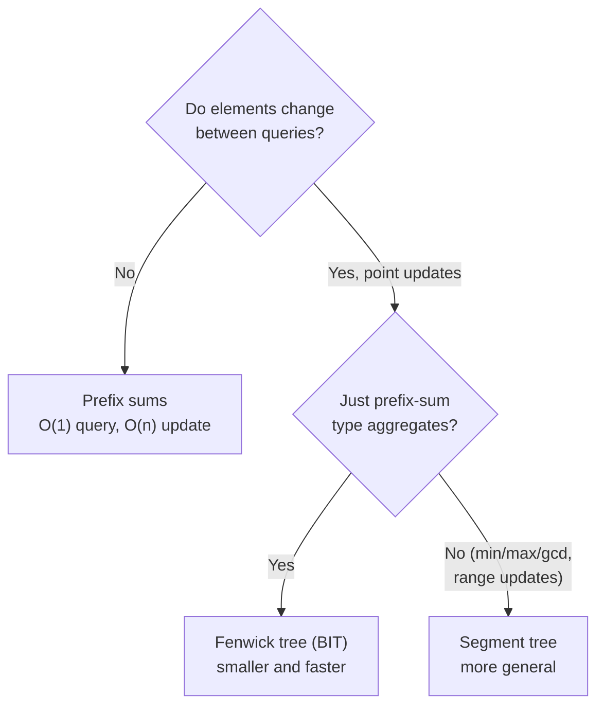
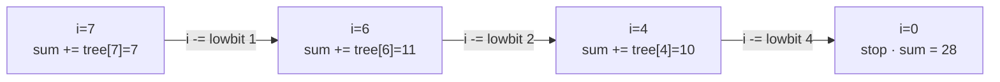
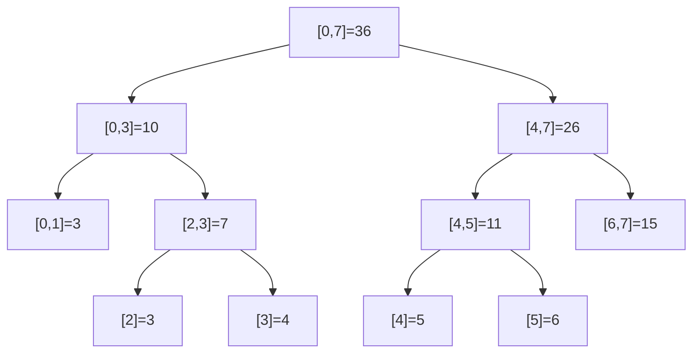
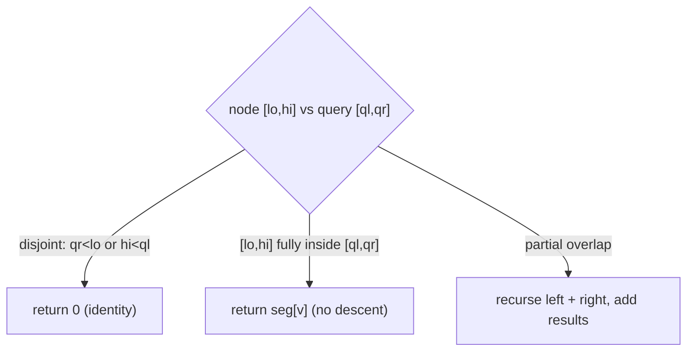
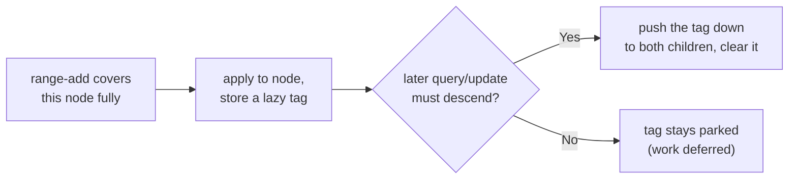
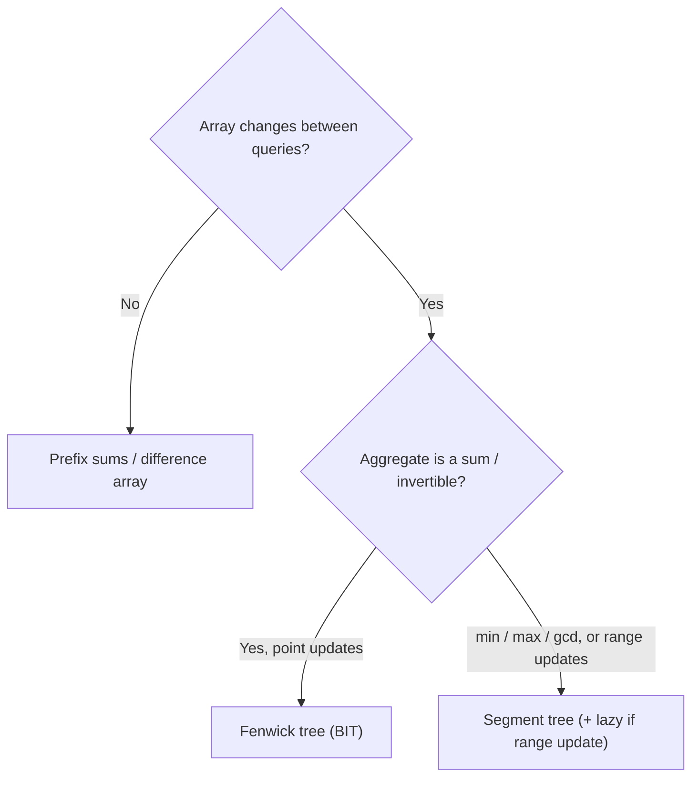

# Segment Trees & Fenwick Trees (Reviewer)

[Prefix sums](algorithms-glossary-reviewer.md#prefix-sum "Running totals up to each position, making any range sum an O(1) subtraction.") answer "sum of a range" in O(1) — but only on a **static** array. The moment the
data can change between queries, the precomputed prefix array is invalidated, and rebuilding it is
O(n) per update. **Segment trees** and **Fenwick trees (binary indexed trees)** are the two structures
that solve the *dynamic* version: both a range query **and** a point update in **O(log n)** each. They
are the answer to the [AlgoMonster](https://algo.monster/flowchart) flowchart leaf "Dynamic range or order queries?" — when
you need range aggregates that keep changing.

This reviewer covers both. The **Fenwick tree** is the smaller, faster, easier-to-code option for the
common case of **prefix-sum + point-update**; learn it first. The **segment tree** is the more general
hammer — it handles any associative aggregate (sum, min, max, gcd), arbitrary range updates with lazy
propagation, and queries the Fenwick tree cannot express — at the cost of more code and ~2× the memory.
Every code sample is real, compilable .NET 9, and `n` is the array length throughout.

Related: [Algorithm Patterns Index](algorithm-patterns-index-reviewer.md) · [Prefix Sums & Difference Arrays](prefix-sums-and-difference-arrays-reviewer.md) · [Trees & Binary Search Trees](trees-and-binary-search-trees-reviewer.md) · [Bit Manipulation](bit-manipulation-reviewer.md) · [Glossary](algorithms-glossary-reviewer.md)

## Contents
- [Why prefix sums fall short](#why-prefix-sums-fall-short)
- [The Fenwick tree (Binary Indexed Tree)](#the-fenwick-tree-binary-indexed-tree)
- [The segment tree](#the-segment-tree)
- [Range updates and lazy propagation](#range-updates-and-lazy-propagation)
- [Fenwick vs segment tree](#fenwick-vs-segment-tree)
- [Complexity summary](#complexity-summary)
- [When to use which](#when-to-use-which)
- [Interview Q&A](#interview-qa)
- [Rapid-fire round](#rapid-fire-round)
- [Exam-style questions](#exam-style-questions)
- [30-second takeaway](#30-second-takeaway)
- [Quick recall checklist](#quick-recall-checklist)
- [References](#references)

---

## Why prefix sums fall short

A prefix-sum array `P` where `P[i]` is the sum of the first `i` elements answers any range sum
`a[l..r]` as `P[r+1] - P[l]` in O(1). That is unbeatable — **until an element changes**. Updating
`a[k]` forces you to fix `P[k+1], P[k+2], ..., P[n]`, an **O(n)** repair. A workload that interleaves
updates and queries therefore costs O(n) per update with prefix sums, which is too slow when both are
frequent.

| Structure | Range query | Point update | Build | Space |
| --- | --- | --- | --- | --- |
| [Prefix sum](algorithms-glossary-reviewer.md#prefix-sum "Running totals up to each position, making any range sum an O(1) subtraction.") array | **O(1)** | O(n) | O(n) | O(n) |
| Fenwick tree (BIT) | O(log n) | **O(log n)** | O(n) | O(n) |
| Segment tree | O(log n) | **O(log n)** | O(n) | O(2n)–O(4n) |

*The trade is explicit: prefix sums win when the array never changes; the tree structures accept a log factor on queries to make updates cheap too.*



*Reading the workload picks the structure: static → prefix sums; dynamic prefix-sums → Fenwick; anything more general (min/max, range updates) → segment tree.*

## The Fenwick tree (Binary Indexed Tree)

A **[Fenwick tree](algorithms-glossary-reviewer.md#fenwick-tree-and-segment-tree "Compact structures giving O(log n) range queries with point or range updates on a changing array.")** (also called a *binary indexed tree*, BIT) is a 1-indexed array where `tree[i]`
stores the sum of a contiguous block of the original array ending at index `i`. The block's length is
`lowbit(i)` — the value of `i`'s lowest set bit, `i & -i`. That single bit trick is the entire idea:
the blocks nest like the binary representation of indices, so both walking *up* (update) and *down*
(query) take O(log n) steps.

Key points:

- **`lowbit(i) = i & -i`** isolates the lowest set bit (two's-complement negation flips all bits and
  adds 1, leaving only that bit shared). `tree[i]` covers the range `a[i - lowbit(i) + 1 .. i]`.
- **Prefix query** `sum(a[1..i])`: start at `i`, add `tree[i]`, then jump to `i - lowbit(i)`, repeat
  until `i` hits 0. Each step strips the lowest set bit, so there are at most `log n` steps.
- **Point update** `a[i] += delta`: start at `i`, add `delta` to `tree[i]`, then jump to
  `i + lowbit(i)`, repeat until past `n`. These are exactly the ranges that *include* index `i`.
- **Range sum** `a[l..r]` = `prefix(r) - prefix(l - 1)` — two prefix queries, still O(log n).
- **Strictly 1-indexed.** Index 0 is unused; `i & -i` is 0 at `i = 0`, which is the loop's stop signal.
- **Tiny and cache-friendly.** One array, two short loops, no recursion — the BIT is the structure to
  reach for when the operation is prefix-sum + point-update and nothing fancier.

```text
Fenwick coverage for a[1..8] = [1, 2, 3, 4, 5, 6, 7, 8]   (lowbit = i & -i)

  i   binary  lowbit  tree[i] covers     tree[i] value
  --  ------  ------  -----------------  -------------
  1    001      1     a[1..1]                  1
  2    010      2     a[1..2]                  3
  3    011      1     a[3..3]                  3
  4    100      4     a[1..4]                 10
  5    101      1     a[5..5]                  5
  6    110      2     a[5..6]                 11
  7    111      1     a[7..7]                  7
  8   1000      8     a[1..8]                 36

  tree = [_, 1, 3, 3, 10, 5, 11, 7, 36]   (index 0 unused)
```

*Each `tree[i]` owns a block whose length is `i`'s lowest set bit; the powers of two (4, 8) own long blocks, the odd indices own single elements.*



*Prefix query `prefix(7)`: peel off the lowest set bit each hop (7 → 6 → 4 → 0), accumulating three blocks that exactly tile `a[1..7]` = 7 + 11 + 10 = 28.*

```text
prefix(7) — sum of a[1..7].  Walk down, subtracting lowbit each step:

  i = 7   sum += tree[7]=7    -> sum = 7    i -= lowbit(7)=1  -> i = 6
  i = 6   sum += tree[6]=11   -> sum = 18   i -= lowbit(6)=2  -> i = 4
  i = 4   sum += tree[4]=10   -> sum = 28   i -= lowbit(4)=4  -> i = 0
  i = 0   stop.   prefix(7) = 28           (check: 1+2+3+4+5+6+7 = 28)

range(3, 6) = prefix(6) - prefix(2)
  prefix(6) = tree[6]+tree[4] = 11 + 10 = 21
  prefix(2) = tree[2]         = 3
  range(3,6) = 21 - 3 = 18                  (check: 3+4+5+6 = 18)
```

*A prefix query is at most `log n` jumps because each step clears one set bit; a range sum is just two prefix queries subtracted.*

```text
update(3, +2)  -- a[3] goes 3 -> 5.  Walk up, adding lowbit each step:

  i = 3   tree[3] += 2  (3 -> 5)    i += lowbit(3)=1  -> i = 4
  i = 4   tree[4] += 2  (10 -> 12)  i += lowbit(4)=4  -> i = 8
  i = 8   tree[8] += 2  (36 -> 38)  i += lowbit(8)=8  -> i = 16 > n, stop

  after: prefix(6) = tree[6]+tree[4] = 11 + 12 = 23   (check: 1+2+5+4+5+6 = 23)
```

*A point update touches exactly the blocks that contain index `i` — found by repeatedly adding the lowest set bit, the mirror image of the query's subtraction.*

```csharp
// Fenwick tree (Binary Indexed Tree) for prefix sums with point updates. 1-indexed.
sealed class Fenwick
{
    private readonly long[] _tree;          // _tree[i] sums a[i - lowbit(i) + 1 .. i]
    public Fenwick(int n) => _tree = new long[n + 1];

    // a[i] += delta  (i is 1-based). Walk upward to every block that covers i.
    public void Update(int i, long delta)
    {
        for (; i < _tree.Length; i += i & -i)
            _tree[i] += delta;
    }

    // sum of a[1..i]. Walk downward, peeling off the lowest set bit each step.
    public long PrefixSum(int i)
    {
        long sum = 0;
        for (; i > 0; i -= i & -i)
            sum += _tree[i];
        return sum;
    }

    // sum of a[l..r] inclusive (1-based) = prefix(r) - prefix(l-1).
    public long RangeSum(int l, int r) => PrefixSum(r) - PrefixSum(l - 1);
}

// Build from a 1-based array (a1[0] unused; values live in a1[1..n]).
static Fenwick BuildFenwick(long[] a1)
{
    int n = a1.Length - 1;
    var bit = new Fenwick(n);
    for (int i = 1; i <= n; i++) bit.Update(i, a1[i]);   // O(n log n); an O(n) variant exists
    return bit;
}
```

The build above is O(n log n) (one update per element). An **O(n) build** exists: set
`tree[i] = a[i]` for all `i`, then for each `i` push its value into its parent `i + lowbit(i)` if that
is `≤ n`. Worth knowing, rarely worth the extra code in an interview.

## The segment tree

A **segment tree** is a binary tree built over the array's index range. The root covers `[0, n-1]`,
each internal node splits its range in half between two children, and each **leaf** covers a single
element. Every node stores the aggregate (here, the sum) of its range. With `n` leaves the tree has
height `⌈log₂ n⌉`, so a query or update touches O(log n) nodes. It is stored flat in an array of size
`4n`: node `1` is the root, and node `v`'s children are `2v` and `2v + 1` — the same implicit
array-as-tree layout a [binary heap](algorithms-glossary-reviewer.md#binary-heap "A heap as a complete binary tree packed in an array; children at 2i+1, 2i+2.") uses.

Key points:

- **Build** is a post-order recursion: a leaf takes its element; an internal node is the sum of its
  two children. O(n) total, since the tree has `2n - 1` nodes.
- **Range query** `[ql, qr]` recurses from the root with three cases per node range `[lo, hi]`:
  **disjoint** (`qr < lo` or `hi < ql`) returns the identity (0 for sum); **fully inside**
  (`ql ≤ lo` and `hi ≤ qr`) returns the node's stored value; **partial overlap** recurses into both
  children and adds. Any query decomposes into O(log n) "canonical" fully-inside nodes.
- **Point update** `a[i] = value` walks the single root-to-leaf path to leaf `i`, sets it, then
  re-sums each ancestor on the way back up — O(log n) nodes touched.
- **Any associative aggregate works.** Swap `+` for `Math.Min`, `Math.Max`, or `gcd` and the identity
  accordingly (0 for sum, `+∞` for min, `-∞` for max) — the structure is unchanged. This generality is
  what the Fenwick tree gives up.
- **`4n` size is the safe bound.** A perfectly balanced tree needs `2n`, but for non-power-of-two `n`
  the recursion can reach indices up to `~4n`; allocate `4n` and never think about it again.

```text
Segment tree (sums) over a[0..7] = [1, 2, 3, 4, 5, 6, 7, 8]

                          [0,7]=36
                 ┌────────────┴────────────┐
              [0,3]=10                   [4,7]=26
            ┌────┴────┐                ┌────┴────┐
        [0,1]=3    [2,3]=7         [4,5]=11   [6,7]=15
         ┌─┴─┐      ┌─┴─┐           ┌─┴─┐      ┌─┴─┐
       [0]1 [1]2  [2]3 [3]4       [4]5 [5]6  [6]7 [7]8
```

*Each internal node holds the sum of its range; the root holds the total 36. The tree has height 3 = log₂ 8, so any path from root to leaf is 3 hops.*



*Query `[2,5]` lands on exactly two fully-inside nodes — `[2,3]=7` and `[4,5]=11` — instead of visiting four leaves; their sum 18 is the answer. That collapse from O(range) leaves to O(log n) nodes is the whole point.*

```text
Query sum of a[2..5].  Recurse from the root; classify each node range vs [2,5]:

  [0,7] partial          -> recurse both children
    [0,3] partial        -> recurse both children
      [0,1] disjoint      -> return 0
      [2,3] inside [2,5]  -> return 7          (canonical node)
    [4,7] partial        -> recurse both children
      [4,5] inside [2,5]  -> return 11         (canonical node)
      [6,7] disjoint      -> return 0
  total = 7 + 11 = 18                          (check: 3+4+5+6 = 18)
```

*The recursion prunes a disjoint subtree in O(1) and stops at a fully-inside node without descending, so it visits at most O(log n) nodes — two of them here carry the answer.*



*The three-way test at every node is what bounds a query to O(log n): disjoint and fully-inside both terminate immediately; only partial overlaps recurse.*

```csharp
// Segment tree for range-sum query and point update over a fixed-length array.
// Stored flat in `seg` of size 4n; node 1 is the root, children of v are 2v and 2v+1.
sealed class SegmentTree
{
    private readonly int _n;
    private readonly long[] _seg;
    private readonly int[] _a;

    public SegmentTree(int[] a)
    {
        _n = a.Length;
        _a = a;
        _seg = new long[4 * _n];
        Build(1, 0, _n - 1);
    }

    private void Build(int v, int lo, int hi)
    {
        if (lo == hi) { _seg[v] = _a[lo]; return; }     // leaf holds one element
        int mid = (lo + hi) / 2;
        Build(2 * v, lo, mid);
        Build(2 * v + 1, mid + 1, hi);
        _seg[v] = _seg[2 * v] + _seg[2 * v + 1];        // internal node = sum of children
    }

    // sum of a[ql..qr], inclusive.
    public long Query(int ql, int qr) => Query(1, 0, _n - 1, ql, qr);

    private long Query(int v, int lo, int hi, int ql, int qr)
    {
        if (qr < lo || hi < ql) return 0;               // disjoint -> identity for sum
        if (ql <= lo && hi <= qr) return _seg[v];       // fully inside -> use the node, stop
        int mid = (lo + hi) / 2;                        // partial -> recurse both children
        return Query(2 * v, lo, mid, ql, qr)
             + Query(2 * v + 1, mid + 1, hi, ql, qr);
    }

    // a[i] = value; refresh the leaf and every ancestor on its path.
    public void Update(int i, int value) => Update(1, 0, _n - 1, i, value);

    private void Update(int v, int lo, int hi, int i, int value)
    {
        if (lo == hi) { _seg[v] = value; return; }
        int mid = (lo + hi) / 2;
        if (i <= mid) Update(2 * v, lo, mid, i, value);
        else Update(2 * v + 1, mid + 1, hi, i, value);
        _seg[v] = _seg[2 * v] + _seg[2 * v + 1];        // re-sum on the way back up
    }
}
```

## Range updates and lazy propagation

A plain segment tree updates **one** element in O(log n). What about updating a **whole range** — "add
5 to every element in `a[l..r]`"? Doing it element by element is O(range · log n), far too slow. The
fix is **lazy propagation**: when an update fully covers a node's range, apply it to that node and park
a "pending" tag there instead of recursing into the (possibly huge) subtree. The tag is **pushed down**
to children only when a later query or update actually needs to descend through the node.

Key points:

- Each node carries a **lazy tag** holding an update not yet applied to its children. A node's stored
  aggregate already reflects its own tag; the tag is what the *children* still owe.
- **Push down** before recursing: apply the parent's tag to both children (update their aggregates and
  add to their tags), then clear the parent's tag.
- This restores **O(log n)** for range updates, matching range queries. It is the standard tool for
  "range add + range sum/min/max" problems.
- A Fenwick tree can also do **range-update / point-query** (via a difference-array trick) and even
  **range-update / range-query** (with two BITs), but anything involving min/max over ranges, or
  combining several update kinds, is squarely segment-tree-with-lazy territory.



*Lazy propagation defers a range update at the highest node that fully contains it and only pays to push it down when a later operation genuinely needs the finer detail — keeping range updates at O(log n).*

## Fenwick vs segment tree

| | Fenwick tree (BIT) | Segment tree |
| --- | --- | --- |
| Lines of code | ~10 | ~40 (more with lazy) |
| Memory | `n + 1` | `2n` to `4n` |
| Constant factor | very small | larger (recursion) |
| Prefix sum / point update | **yes, natural** | yes |
| Range sum / point update | yes (two prefixes) | yes |
| Min / max / gcd over ranges | **no** (not invertible) | **yes** |
| Range update (lazy) | limited (tricks / two BITs) | **yes, general** |
| Find k-th / first ≥ x (descend) | possible (bit walk) | **yes, natural** |

The dividing line is **invertibility**. A prefix sum works because subtraction undoes addition, so a
Fenwick tree can express `range = prefix(r) − prefix(l−1)`. **Min and max have no inverse** — you
cannot recover `min(a[l..r])` from two prefix-mins — so those *require* a segment tree, which combines
children directly rather than subtracting prefixes.

## Complexity summary

`n` = array length. Both structures are built once, then serve a stream of operations.

| Operation | Fenwick tree | Segment tree |
| --- | --- | --- |
| Build | O(n) (or O(n log n) naive) | O(n) |
| Point update | O(log n) | O(log n) |
| Prefix / range query | O(log n) | O(log n) |
| Range update | O(log n) (sum only, with tricks) | O(log n) (lazy, general) |
| Space | O(n) | O(2n)–O(4n) |

*Every operation on either structure is O(log n) after an O(n) build — the log factor over prefix sums is the price of cheap updates.*

## When to use which



*Default to the cheapest tool the workload allows: static → prefix sums; dynamic sums → Fenwick; non-invertible aggregates or range updates → segment tree.*

- **Reach for prefix sums** when the array is read-only — never pay the log factor you do not need.
- **Reach for a Fenwick tree** for the bread-and-butter "point update + prefix/range sum" (counting
  inversions, dynamic frequency tables, "sum of elements seen so far"). Smallest code, smallest memory.
- **Reach for a segment tree** when the aggregate is **min/max/gcd**, when you need **range updates**
  (lazy propagation), or when you must **descend the tree** to answer "k-th element" / "first index with
  prefix ≥ x". It is the general-purpose range structure; the BIT is the specialized fast path.

## Interview Q&A

### Choosing the structure

Q: Prefix sums already answer range sums in O(1). Why would you ever use a Fenwick or segment tree?
A: Prefix sums are O(1) query but **O(n) per update**, because changing one element invalidates every later prefix. When updates and queries interleave, that is too slow. Fenwick and segment trees make **both** the query and the point update O(log n), which wins as soon as updates are frequent.

Q: Fenwick tree or segment tree — how do you choose?
A: If the operation is prefix-sum / range-sum with point updates, use a **Fenwick tree**: ~10 lines, `n+1` memory, tiny constant. If you need **min/max/gcd** over ranges, **range updates** (lazy propagation), or tree-descent queries like "k-th element", use a **segment tree** — it is more general but larger. The deciding factor is invertibility: sums subtract, min/max do not.

Q: Why can't a Fenwick tree do range-minimum queries?
A: A BIT answers `range = prefix(r) − prefix(l−1)`, which needs an **inverse** of the aggregate. Subtraction inverts addition, so sums work. Minimum has no inverse — you cannot recover `min(a[l..r])` from `min(a[1..r])` and `min(a[1..l−1])` — so range-min needs a segment tree, which merges child values directly instead of subtracting prefixes.

### Mechanics

Q: What does `i & -i` compute, and why does it appear in every BIT loop?
A: It isolates the **lowest set bit** of `i` (two's-complement `-i` flips all bits and adds 1, so only the lowest set bit is shared with `i`). That bit is the length of the block `tree[i]` covers, so adding it walks to the next block that contains `i` (update) and subtracting it walks to the next disjoint block below (query). Each step changes one bit, giving the O(log n) bound.

Q: A segment tree over `n` leaves — why allocate `4n`?
A: A perfectly balanced tree needs `2n − 1` nodes, but when `n` is not a power of two the recursive `2v / 2v+1` indexing can reach roughly `4n`. Allocating `4n` is the safe, standard bound that avoids any out-of-range node index regardless of `n`.

Q: How does a range query stay O(log n) instead of O(range)?
A: At each node the query is disjoint (prune in O(1)), fully inside (return the stored aggregate without descending), or partially overlapping (recurse). Any range decomposes into O(log n) "canonical" fully-inside nodes — at most two per level — so the recursion visits O(log n) nodes, not one per element.

Q: What problem does lazy propagation solve?
A: **Range updates.** Applying "add x to a[l..r]" element-by-element is O(range · log n). Lazy propagation applies the update at the highest nodes that fully cover the range and parks a pending **tag**, pushing it down to children only when a later operation must descend. That restores O(log n) per range update.

## Rapid-fire round

- Static array, range sums → **prefix sums, O(1) query.**
- Point updates + range sums → **Fenwick tree, O(log n) each.**
- `lowbit(i)` → **`i & -i` (lowest set bit).**
- Fenwick prefix query walk → **subtract lowbit until i = 0.**
- Fenwick point update walk → **add lowbit until i > n.**
- Fenwick range sum → **prefix(r) − prefix(l − 1).**
- Fenwick indexing → **1-based (index 0 is the stop sentinel).**
- Range min / max / gcd → **segment tree (not Fenwick — no inverse).**
- Segment tree array size → **4n (safe bound).**
- Segment tree node v's children → **2v and 2v + 1.**
- Range update in O(log n) → **segment tree with lazy propagation.**
- Why a BIT can't do range-min → **min has no inverse to subtract.**
- Both structures' query/update cost → **O(log n) after an O(n) build.**

## Exam-style questions

1. You have `n ≤ 1e5` integers and must process `q ≤ 1e5` operations, each either "add `v` to index
   `k`" or "sum of `a[l..r]`". Which structure, and what is the total complexity?

**Answer:** A **Fenwick tree**. Each update and each range query is O(log n), so the whole workload is
O((n + q) log n) ≈ 1e5 · 17, trivially within budget. Prefix sums would make each update O(n), giving
O(q · n) = 1e10 — too slow. Range sum is `prefix(r) − prefix(l − 1)`.

2. Build the Fenwick tree for `a[1..4] = [1, 2, 3, 4]` and compute `prefix(3)`.

```text
tree[i] covers a[i - lowbit(i) + 1 .. i]
```

**Answer:** `tree[1]=a[1]=1`, `tree[2]=a[1]+a[2]=3`, `tree[3]=a[3]=3`, `tree[4]=a[1..4]=10`, so
`tree = [_,1,3,3,10]`. `prefix(3)`: start `i=3`, add `tree[3]=3` → `i=3−1=2`, add `tree[2]=3` →
`i=2−2=0`, stop. `prefix(3) = 3 + 3 = 6` (check: `1+2+3 = 6`).

3. On a segment tree over `a[0..7] = [1..8]`, the query `sum(a[2..5])` returns 18 after visiting only a
   handful of nodes. Which nodes carry the answer, and why is the cost O(log n)?

**Answer:** The two **fully-inside canonical nodes** `[2,3]=7` and `[4,5]=11` carry it; `7 + 11 = 18`.
The recursion prunes the disjoint nodes `[0,1]` and `[6,7]` in O(1) and never descends below a
fully-inside node, so it touches at most ~2 nodes per level over `log₂ 8 = 3` levels — O(log n), not the
4 leaves a naive scan would read.

4. You need "add 10 to every element in `a[l..r]`" **and** "sum of `a[l..r]`", both frequent. What
   structure and technique?

**Answer:** A **segment tree with lazy propagation**. The range add is applied at the highest nodes
fully covering `[l, r]` with a parked lazy tag, pushed down only when a later operation descends, keeping
**both** the range update and the range query at O(log n). A plain Fenwick tree cannot do general range
updates with range-sum queries without the two-BIT trick.

5. Why is `i & -i` exactly the lowest set bit of `i`? Show it for `i = 12`.

**Answer:** In two's complement, `-i = ~i + 1`, which flips every bit of `i` and adds 1; the carry
propagates up to (and including) the lowest set bit, so `i` and `-i` share **only** that bit, and
`i & -i` isolates it. For `i = 12 = 1100₂`, `-12 = ...0100₂` in the low bits, so `12 & -12 = 0100₂ = 4`
— the lowest set bit of 12 is the `4`s bit.

## 30-second takeaway

> When an array is **static**, prefix sums answer range queries in O(1). When elements **change between
> queries**, prefix sums cost O(n) per update — so reach for a **Fenwick tree** or a **segment tree**,
> which make both the query and the point update **O(log n)**. The **Fenwick tree** (BIT) is the small,
> fast specialist for prefix-sum + point-update: 1-indexed, `tree[i]` covers `lowbit(i)` elements,
> query subtracts `i & -i` down to 0, update adds it up past `n`. The **segment tree** is the general
> tool — any associative aggregate (sum, min, max, gcd), **range updates** via lazy propagation, and
> tree-descent queries — stored flat in `4n` with children at `2v`, `2v+1`. Choose by **invertibility**:
> sums subtract (Fenwick is enough); min/max do not (segment tree required).

## Quick recall checklist

- **Static array → prefix sums** (O(1) query); the tree structures are for **dynamic** data.
- **Fenwick tree (BIT):** 1-indexed, `tree[i]` sums `a[i − lowbit(i) + 1 .. i]`, `lowbit = i & -i`.
  Query subtracts lowbit to 0; update adds lowbit past `n`; range = `prefix(r) − prefix(l − 1)`. O(log n).
- **Segment tree:** binary tree over index ranges, flat array of size **4n**, children `2v`/`2v+1`.
  Query is disjoint / fully-inside / partial; update walks one root-to-leaf path and re-sums ancestors.
  O(n) build, O(log n) query/update.
- **Lazy propagation** restores **O(log n) range updates** by parking pending tags and pushing them
  down only when needed.
- **Pick by invertibility:** sum/xor invert → **Fenwick** suffices; **min/max/gcd** or range updates →
  **segment tree**.
- LeetCode cues: LC 307 — Range Sum Query Mutable (Fenwick or segment tree), LC 315 — Count of Smaller
  Numbers After Self (BIT over compressed values), LC 327 — Count of Range Sum.

## References

- cp-algorithms — [Fenwick Tree](https://cp-algorithms.com/data_structures/fenwick.html).
- cp-algorithms — [Segment Tree](https://cp-algorithms.com/data_structures/segment_tree.html).
- Wikipedia — [Fenwick tree](https://en.wikipedia.org/wiki/Fenwick_tree).
- Wikipedia — [Segment tree](https://en.wikipedia.org/wiki/Segment_tree).
- Prefix-sum foundation — [Prefix Sums & Difference Arrays reviewer](prefix-sums-and-difference-arrays-reviewer.md).
- .NET collection Big-O — [Collections & Big-O reviewer](../dotnet/csharp/collections-and-big-o-reviewer.md).
- NeetCode roadmap — [neetcode.io/roadmap](https://neetcode.io/roadmap).
