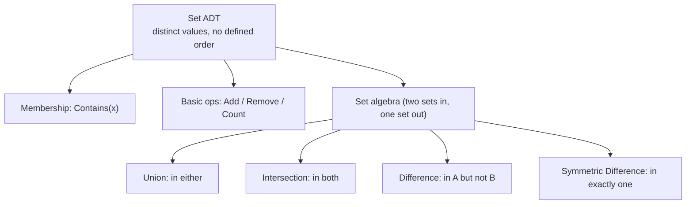
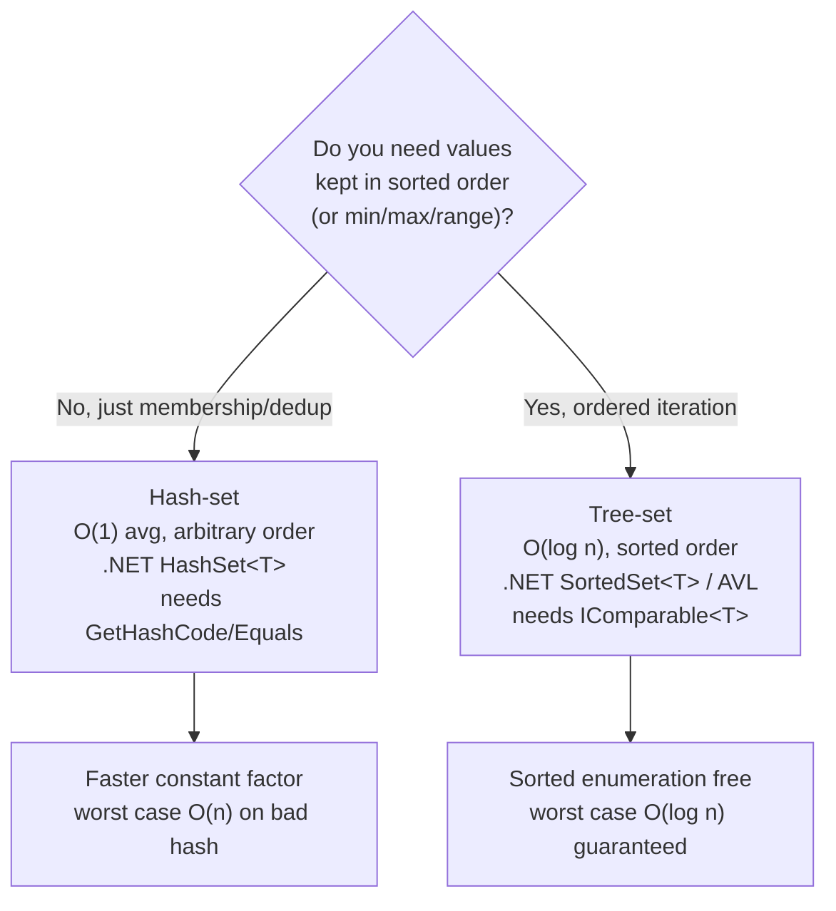
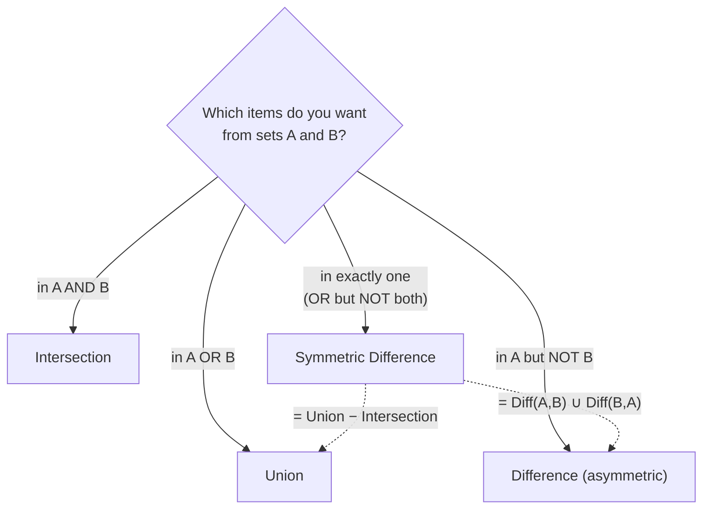

# Sets and Set Algorithms (Reviewer)

A **set** is the [data structure](algorithms-glossary-reviewer.md#data-structure "A way of organizing data so specific operations can be done efficiently.") that stores only **distinct** values and iterates them in an **implementation-defined order**: it answers one question supremely well — *"is this value present?"* — and supports the four operations of **set algebra** (union, intersection, difference, symmetric difference) that combine two sets into a third. The defining contract is *uniqueness with no positional meaning*: a set has no index, no "first" element, no duplicates. Adding a value that is already present is a no-op; the only questions you can ask are membership, count, and how this set relates to another.

The cost of those questions depends entirely on what backs the set. A **hash-set** (like .NET's `HashSet<T>`) hashes each value into a [bucket](algorithms-glossary-reviewer.md#bucket "A slot in a hash table where keys hashing to the same location are stored.") and gives **[O(1)](algorithms-glossary-reviewer.md#constant-time "Cost does not depend on input size; the same fixed work every time.") average** membership but no usable order. A **tree-set** (like .NET's `SortedSet<T>`, and the `Set<T>` the course builds on an [AVL tree](algorithms-glossary-reviewer.md#avl-tree "A self-balancing binary search tree keeping height O(log n) via rotations.")) keeps values in sorted order and gives **[O(log n)](algorithms-glossary-reviewer.md#logarithmic-time "Each step discards a constant fraction, so steps equal the log of n.")** membership. The course models `Set<T>` over an AVL tree, so every operation — `Add`, `Remove`, `Contains` — is O(log n) and enumeration is sorted in-order. This reviewer pins down the set ADT, both backing choices and their trade-offs, the four algebra operations with definitions, Venn pictures, C# code and complexity, the subset/superset/disjoint predicates, and the real .NET `HashSet<T>` / `SortedSet<T>` mutating API.

Related: [Algorithm Patterns Index](algorithm-patterns-index-reviewer.md) · [Arrays & Hashing](arrays-and-hashing-reviewer.md) · [Hash Tables](hash-tables-reviewer.md) · [Balanced Trees & AVL](balanced-trees-and-avl-reviewer.md) · [Glossary](algorithms-glossary-reviewer.md)

## Contents

- [The set ADT and its defining properties](#the-set-adt-and-its-defining-properties)
- [Backing implementations: hash-set vs tree-set](#backing-implementations-hash-set-vs-tree-set)
- [A tree-backed Set in C# (the course model)](#a-tree-backed-set-in-c-the-course-model)
- [Union: items in either set](#union-items-in-either-set)
- [Intersection: items in both sets](#intersection-items-in-both-sets)
- [Difference: items in A but not B](#difference-items-in-a-but-not-b)
- [Symmetric difference: items in exactly one set](#symmetric-difference-items-in-exactly-one-set)
- [A worked example: soccer set algebra](#a-worked-example-soccer-set-algebra)
- [Subset, superset, and disjoint predicates](#subset-superset-and-disjoint-predicates)
- [Real .NET usage: HashSet and SortedSet](#real-net-usage-hashset-and-sortedset)
- [Complexity summary](#complexity-summary)
- [Pitfalls and misconceptions](#pitfalls-and-misconceptions)
- [Interview Q&A](#interview-qa)
- [Rapid-fire round](#rapid-fire-round)
- [Exam-style questions](#exam-style-questions)
- [30-second takeaway](#30-second-takeaway)
- [Quick recall checklist](#quick-recall-checklist)
- [References](#references)

---

## The set ADT and its defining properties

A set is an [abstract data type](algorithms-glossary-reviewer.md#abstract-data-type "A model defined by its operations and behavior, independent of implementation.") — a contract of behavior, not a specific layout — modeling the mathematical notion of a set. It is the collection of **unique values, in no particular order**.

Key points:

- **Distinct items only.** A set never holds duplicates. Adding a value already present changes nothing; the structure silently absorbs it. This is the property that distinguishes a set from a list or array, which happily store repeats.
- **No defined order.** Items are iterated in an **implementation-defined order**. A hash-set yields them in hash/bucket order (effectively arbitrary, and *not* insertion order); a tree-set yields them sorted. You must never rely on iteration order being insertion order or anything stable across runs unless the backing structure guarantees it.
- **Membership is the headline operation.** The core question a set answers is `Contains(x)` — *"is x in the set?"* — in O(1) average (hash) or O(log n) (tree). Insert (`Add`) and remove (`Remove`) carry the same cost as membership because both must first locate the value.
- **Count, not position.** A set exposes `Count` but no positional access: there is no `set[3]`, no "first" or "last" in the array sense (a tree-set has a min/max because it is *ordered*, but the plain set ADT does not promise one).
- **Set algebra.** Beyond membership, the set ADT supports combining two sets: **union**, **intersection**, **difference**, and **symmetric difference**. These return a new set and are the reason sets are so expressive for "which items satisfy this OR/AND/BUT-NOT relationship" questions.



*The set ADT splits into single-set operations (membership, add/remove) and two-set algebra operations.*

Examples of sets are everywhere: the integers, the positive numbers, the even numbers, the odd numbers — each a collection of distinct values with no inherent "third element". The course's running example uses MLS soccer data: a set of `Team` objects, a set of `Player` objects, and questions like *"which players played for the Galaxy or the Sounders?"* answered with set algebra.

## Backing implementations: hash-set vs tree-set

The ADT says *what* a set does; the backing structure decides *how fast*. There are two standard choices, and the entire trade-off comes down to **order vs raw speed**.

Key points:

- **Hash-set (hash-table backed).** Stores each value in a bucket chosen by its hash code. Membership, add, and remove are **O(1) average**, degrading to O(n) only under pathological [hash collisions](algorithms-glossary-reviewer.md#hash-collision "When two different keys produce the same hash code and land in one bucket."). The price: **no usable order** — iteration is in bucket order, which is arbitrary. The values must supply a correct `GetHashCode`/`Equals` pair. This is .NET's `HashSet<T>`.
- **Tree-set (balanced-BST backed).** Stores values in a self-balancing binary search tree (AVL or red-black). Membership, add, and remove are **O(log n)** worst case — slower than hashing, but the structure keeps values **sorted**, so in-order enumeration is sorted for free, and you get min, max, and range queries. The values must be **comparable** (`IComparable<T>` or an `IComparer<T>`). This is .NET's `SortedSet<T>`, and the course's `Set<T>` built on an AVL tree.
- **The trade-off.** Reach for a **hash-set** when you only need membership/dedup and order is irrelevant — it is faster and simpler. Reach for a **tree-set** when you need sorted iteration, ordered range queries, or a min/max, and can accept the log-factor and a comparable element type. The course backs `Set<T>` with an AVL tree, so all its set operations are **O(log n)**, not O(1).
- **Both forbid duplicates** and both lose insertion order. The difference is only in *which* non-insertion order you get (arbitrary hash order vs sorted order) and the per-operation cost.



*Pick the backing by whether you need order: hash-set for speed, tree-set for sorted iteration.*

## A tree-backed Set in C# (the course model)

The course defines an `ISet<T>` interface and a `Set<T>` class whose backing store is an **AVL tree**. Because every read or write defers to the tree, every operation is **O(log n)**, and enumeration is the tree's in-order (sorted) traversal. Note the constraint `where T : IComparable<T>` — a tree-set demands comparable values, exactly the difference from a hash-set.

```csharp
// Course interface: enumerable and comparable, with basic container ops + set algebra.
public interface ISet<T> : IEnumerable<T> where T : IComparable<T>
{
    bool Add(T value);          // true if newly added, false if already present
    bool Remove(T value);       // true if it was present and removed
    bool Contains(T value);     // membership test
    int Count { get; }

    ISet<T> Union(ISet<T> other);
    ISet<T> Intersection(ISet<T> other);
    ISet<T> Difference(ISet<T> other);
    ISet<T> SymmetricDifference(ISet<T> other);
}

public class Set<T> : ISet<T> where T : IComparable<T>
{
    private readonly AVLTree<T> _store;     // balanced tree => O(log n) ops, sorted iteration

    public Set() => _store = new AVLTree<T>();

    public Set(IEnumerable<T> values) : this() => AddRange(values);

    // Add only if absent; the uniqueness guarantee lives here.
    public bool Add(T value)
    {
        if (!_store.Contains(value)) { _store.Add(value); return true; }
        return false;                       // already present -> no-op, return false
    }

    private void AddRange(IEnumerable<T> values)
    {
        foreach (T value in values) Add(value);
    }

    public bool Contains(T value) => _store.Contains(value);   // O(log n)
    public bool Remove(T value)   => _store.Remove(value);     // O(log n)
    public int  Count             => _store.Count;

    // Enumeration defers to the AVL tree's in-order traversal => sorted output.
    public IEnumerator<T> GetEnumerator() => _store.GetEnumerator();
    IEnumerator IEnumerable.GetEnumerator() => _store.GetEnumerator();

    // Union / Intersection / Difference / SymmetricDifference shown in their sections below.
}
```

The `Add` method is where the set's defining property is enforced: it checks `Contains` first and inserts only on a miss, returning `true` when the value is new and `false` when it was already present. That boolean return is how callers learn whether anything changed.

## Union: items in either set

**Definition.** The union of A and B is the set of all distinct items that exist in **A or B** (or both). It answers **"OR"** questions: *which players have played for the Sounders or the Galaxy? which students are in Algebra or Biology?*

Venn picture: shade **everything** — the left-only crescent, the right-only crescent, **and** the overlapping middle. Nothing in either circle is excluded.

```
        Union(A, B)
   +-----------+-----------+
   |   A only  |   A and B |   B only
   |  [shaded] |  [shaded] |  [shaded]
   +-----------+-----------+
   every region is included
```

Key points:

- **Result size** is `|A| + |B| - |A ∩ B|` — the overlap is counted once, not twice, because duplicates collapse.
- The course algorithm builds a result set seeded with one input's items, then `AddRange`s the other; the `Add` no-op on duplicates does the de-duplication automatically.
- **Complexity** with a tree-backed set: inserting `|A| + |B|` items, each an O(log n) operation, gives **O((|A| + |B|) log n)**. With a hash-set it is **O(|A| + |B|)** average.

```csharp
// Union: a result set containing the distinct items from both inputs.
public ISet<T> Union(ISet<T> other)
{
    Set<T> result = new Set<T>(other);   // start with the other set's items
    result.AddRange(_store);             // add this set's items; dups are absorbed
    return result;
}
```

## Intersection: items in both sets

**Definition.** The intersection of A and B is the set of items that exist in **both** A and B. It answers **"AND"** questions: *which players played for the Sounders and the Galaxy? which students are in Algebra and Biology?*

Venn picture: shade **only the overlapping middle**. The left-only and right-only crescents are excluded.

```
     Intersection(A, B)
   +-----------+-----------+
   |   A only  |  A and B  |   B only
   |  (empty)  | [shaded]  |  (empty)
   +-----------+-----------+
   only the overlap survives
```

Key points:

- **Result size** is `|A ∩ B|`, always `<= min(|A|, |B|)`.
- The algorithm iterates the *other* set and keeps each item that this set also `Contains`. For efficiency, iterate the **smaller** set and test membership against the larger one.
- **Complexity**: iterate `|other|` items, each with an O(log n) membership test, giving **O(|other| · log n)** for a tree-set, or **O(|other|)** average for a hash-set.

```csharp
// Intersection: keep items present in BOTH this set and the other.
public ISet<T> Intersection(ISet<T> other)
{
    ISet<T> result = new Set<T>();       // start empty
    foreach (T item in other)
        if (Contains(item))              // in other AND in this set?
            result.Add(item);
    return result;
}
```

## Difference: items in A but not B

**Definition.** The difference A − B (also written A \ B) is the set of items that exist in **A but not in B**. It answers **"BUT NOT"** questions for a single input set: *which players played for the Sounders but not the Galaxy?* Note that difference is **asymmetric** — `A − B` is generally not `B − A`.

Venn picture: shade **only A's exclusive crescent** — A minus everything it shares with B.

```
     Difference(A, B) = A - B
   +-----------+-----------+
   |   A only  |  A and B  |   B only
   | [shaded]  |  (removed)|  (empty)
   +-----------+-----------+
   keep A, then subtract the overlap
```

Key points:

- **Asymmetry is the headline.** `Difference(A, B)` removes B's contribution from A; swapping the arguments gives a different set. Always be clear which set is the "base".
- The algorithm starts with a copy of A's items, then removes each item that appears in B.
- **Complexity**: copy A (`O(|A| log n)`) then remove `|B|` items (`O(|B| log n)`), so **O((|A| + |B|) log n)** for a tree-set, **O(|A| + |B|)** average for a hash-set.

```csharp
// Difference: this set's items, minus anything also in the other set.
public ISet<T> Difference(ISet<T> other)
{
    ISet<T> result = new Set<T>(_store); // start with a copy of THIS set
    foreach (T item in other)
        result.Remove(item);             // drop anything that is also in other
    return result;
}
```

## Symmetric difference: items in exactly one set

**Definition.** The symmetric difference of A and B is the set of items that exist in **either A or B but not in both** — equivalently, items in **exactly one** of the two sets. It answers **"OR ... BUT NOT BOTH"** questions: *which players played for the Sounders or the Galaxy but not both?*

Venn picture: shade **both exclusive crescents** but **not** the overlap — it is the union with the middle punched out.

```
   SymmetricDifference(A, B)
   +-----------+-----------+
   |   A only  |  A and B  |   B only
   | [shaded]  | (removed) | [shaded]
   +-----------+-----------+
   the union minus the intersection
```

Key points:

- **Two equivalent formulas**, both worth knowing:
  - `SymmetricDifference(A, B) = Union(A, B) − Intersection(A, B)` — take everything in either, then remove what is in both. This is exactly how the course implements it.
  - `SymmetricDifference(A, B) = Difference(A, B) ∪ Difference(B, A)` — A-only items together with B-only items.
- Unlike plain difference, symmetric difference **is symmetric**: `SymDiff(A, B) == SymDiff(B, A)`.
- **Complexity**: it is built from a union, an intersection, and a difference, so it is the same order as those — **O((|A| + |B|) log n)** for a tree-set, **O(|A| + |B|)** average for a hash-set.

```csharp
// Symmetric difference: items in exactly one set = Union minus Intersection.
public ISet<T> SymmetricDifference(ISet<T> other)
{
    ISet<T> intersection = Intersection(other);   // items in both
    ISet<T> union        = Union(other);          // items in either
    return union.Difference(intersection);        // either, but not both
}
```



*Map the English question to the operation: OR, AND, BUT-NOT, and OR-but-not-BOTH.*

## A worked example: soccer set algebra

Take the course's domain. Let `galaxy` be the set of players who have played for the LA Galaxy and `sounders` the players for the Seattle Sounders. Suppose:

```
galaxy   = { Robbie, Landon, Ashley, Sebastian }
sounders = { Ashley, Sebastian, Clint, Stefan }
```

The shared players (overlap) are `Ashley` and `Sebastian`. Now read each operation off:

| Question (English) | Operation | Result |
| --- | --- | --- |
| Played for Galaxy **or** Sounders? | `galaxy.Union(sounders)` | `{ Robbie, Landon, Ashley, Sebastian, Clint, Stefan }` |
| Played for Galaxy **and** Sounders? | `galaxy.Intersection(sounders)` | `{ Ashley, Sebastian }` |
| Played for Galaxy **but not** Sounders? | `galaxy.Difference(sounders)` | `{ Robbie, Landon }` |
| Played for Sounders **but not** Galaxy? | `sounders.Difference(galaxy)` | `{ Clint, Stefan }` |
| Played for exactly **one** of the two? | `galaxy.SymmetricDifference(sounders)` | `{ Robbie, Landon, Clint, Stefan }` |

Notice the cross-checks: the union has 6 players = `4 + 4 − 2` (overlap counted once). The two differences are **disjoint** and **not equal** (asymmetry). The symmetric difference equals the union (6) minus the intersection (2) = 4 players, and also equals `Difference(galaxy, sounders) ∪ Difference(sounders, galaxy)` = `{Robbie, Landon} ∪ {Clint, Stefan}`. Every formula agrees.

```csharp
// LINQ-style construction mirroring the course's player examples.
Set<Player> galaxy   = new Set<Player>(players.Where(p => p.Team == "Galaxy"));
Set<Player> sounders = new Set<Player>(players.Where(p => p.Team == "Sounders"));

ISet<Player> either      = galaxy.Union(sounders);                // OR
ISet<Player> both        = galaxy.Intersection(sounders);         // AND
ISet<Player> galaxyOnly  = galaxy.Difference(sounders);           // Galaxy but not Sounders
ISet<Player> exactlyOne  = galaxy.SymmetricDifference(sounders);  // OR but not BOTH
```

## Subset, superset, and disjoint predicates

Beyond the four algebra operations, sets answer **relationship** questions that return a boolean, not a new set.

Key points:

- **Subset:** A ⊆ B means every item of A is in B. Test it by checking that `B.Contains(x)` holds for every `x` in A — **O(|A| · cost-of-membership)**. A **proper** (strict) subset additionally requires `|A| < |B|`.
- **Superset:** A ⊇ B is just "B is a subset of A" — the same test with the arguments swapped.
- **Disjoint:** A and B are disjoint if their **intersection is empty** — no shared item. Test by scanning the smaller set and returning `false` the moment any element is found in the other.
- **Set equality:** A == B iff A ⊆ B and B ⊆ A, i.e. same count and mutual containment.

```csharp
public static bool IsSubsetOf<T>(ISet<T> a, ISet<T> b) where T : IComparable<T>
{
    foreach (T x in a)
        if (!b.Contains(x)) return false;   // found an A-item missing from B
    return true;                            // every A-item is in B
}

public static bool AreDisjoint<T>(ISet<T> a, ISet<T> b) where T : IComparable<T>
{
    foreach (T x in a)
        if (b.Contains(x)) return false;    // a shared item => not disjoint
    return true;                            // no overlap
}
```

These map directly onto .NET's built-in `IsSubsetOf`, `IsSupersetOf`, `IsProperSubsetOf`, `IsProperSupersetOf`, `Overlaps`, and `SetEquals` on `HashSet<T>` and `SortedSet<T>`.

## Real .NET usage: HashSet and SortedSet

In production C# you rarely hand-roll a set. The BCL gives you two, sharing the `ISet<T>` interface but differing exactly along the hash-vs-tree axis above.

Key points:

- **`HashSet<T>`** is the hash-set: **O(1) average** `Add`/`Remove`/`Contains`, **no order**, needs `GetHashCode`/`Equals`. The everyday choice for membership and de-duplication.
- **`SortedSet<T>`** is the tree-set (red-black tree internally): **O(log n)** operations, **sorted** enumeration, plus `Min`, `Max`, and `GetViewBetween` for range queries; needs `IComparable<T>` or an `IComparer<T>`.
- **The .NET algebra methods mutate in place** — they modify the calling set rather than returning a new one, which is the opposite of the course's pure `ISet<T>` methods:
  - `UnionWith(other)` — becomes A ∪ B.
  - `IntersectWith(other)` — becomes A ∩ B.
  - `ExceptWith(other)` — becomes A − B (difference).
  - `SymmetricExceptWith(other)` — becomes the symmetric difference.
- If you need a **non-destructive** result, copy first: `new HashSet<T>(a).UnionWith(b)` leaves `a` intact.

```csharp
using System.Collections.Generic;
using System.Linq;

var galaxy   = new HashSet<string> { "Robbie", "Landon", "Ashley", "Sebastian" };
var sounders = new HashSet<string> { "Ashley", "Sebastian", "Clint", "Stefan" };

// Non-destructive: copy, then mutate the copy.
var either = new HashSet<string>(galaxy);
either.UnionWith(sounders);                 // { Robbie, Landon, Ashley, Sebastian, Clint, Stefan }

var both = new HashSet<string>(galaxy);
both.IntersectWith(sounders);               // { Ashley, Sebastian }

var galaxyOnly = new HashSet<string>(galaxy);
galaxyOnly.ExceptWith(sounders);            // { Robbie, Landon }

var exactlyOne = new HashSet<string>(galaxy);
exactlyOne.SymmetricExceptWith(sounders);   // { Robbie, Landon, Clint, Stefan }

// Predicates return bool, do not mutate.
bool disjoint = !galaxy.Overlaps(sounders);             // false (they share two)
bool subset   = both.IsSubsetOf(galaxy);                // true

// SortedSet gives sorted iteration + min/max + ranges.
var sorted = new SortedSet<int> { 5, 1, 9, 1, 3 };       // dup 1 absorbed
// enumerates 1, 3, 5, 9 ; sorted.Min == 1 ; sorted.Max == 9
var mid = sorted.GetViewBetween(2, 6);                   // { 3, 5 }
```

## Complexity summary

For a set of `n` elements. Tree-set costs are the AVL/red-black guarantees; hash-set costs are average with a good hash (worst case O(n) under adversarial collisions). Set-algebra costs assume input sizes `|A|` and `|B|`.

| Operation | Hash-set (`HashSet<T>`) | Tree-set (`SortedSet<T>` / AVL) |
| --- | --- | --- |
| `Contains` (membership) | O(1) average | O(log n) |
| `Add` | O(1) average | O(log n) |
| `Remove` | O(1) average | O(log n) |
| `Count` | O(1) | O(1) |
| Enumerate all | O(n), arbitrary order | O(n), sorted order |
| `Min` / `Max` | O(n) (scan) | O(log n) |
| Union | O(\|A\| + \|B\|) avg | O((\|A\| + \|B\|) log n) |
| Intersection | O(min(\|A\|,\|B\|)) avg | O(min(\|A\|,\|B\|) · log n) |
| Difference (A − B) | O(\|A\| + \|B\|) avg | O((\|A\| + \|B\|) log n) |
| Symmetric difference | O(\|A\| + \|B\|) avg | O((\|A\| + \|B\|) log n) |
| Subset / disjoint test | O(\|A\|) avg | O(\|A\| · log n) |
| Memory | O(n) | O(n) |

Key points:

- The slogan "set operations are **O(log n)**" is the **tree-backed** statement — true for the course's AVL-backed `Set<T>` and for `SortedSet<T>`. A hash-set drops the log factor to O(1) average but forfeits order.
- The algebra operations are all **linear in the combined input size** (times the per-op log factor for a tree), because each visits each element a constant number of times.
- For intersection, **always iterate the smaller set** and test against the larger; that makes the bound `O(min(|A|, |B|) · cost)` instead of `O(max · cost)`.

## Pitfalls and misconceptions

Key points:

- **"A set remembers insertion order."** It does not. A hash-set iterates in arbitrary bucket order; a tree-set iterates sorted. If you need insertion order, use a list alongside, or `LinkedHashSet`-style structures (not built into .NET — combine a `List<T>` with a `HashSet<T>`).
- **"Difference is symmetric."** It is not — `A − B ≠ B − A` in general. *Symmetric* difference is the symmetric one. Mixing them up is the classic bug.
- **"Adding a duplicate throws or grows the set."** No: `Add` is a silent no-op on a present value and returns `false`. `Count` does not change.
- **".NET's `UnionWith` returns a new set."** No — it **mutates** the receiver. The course's `Union` returns a new set; the BCL `*With` methods do not. Copy first if you need to preserve the original.
- **Hash-set with a broken `GetHashCode`.** If equal objects return different hash codes, duplicates slip in and membership fails silently. The `GetHashCode`/`Equals` contract is mandatory for `HashSet<T>` keys; a tree-set instead needs a correct `IComparable<T>`/`IComparer<T>`.
- **Mutating an element after insertion.** Changing a field used by `GetHashCode` (hash-set) or `CompareTo` (tree-set) while the item sits in the set strands it in the wrong bucket/position and it becomes unreachable. Keep set elements effectively immutable.

## Interview Q&A

### Fundamentals

Q: What is a set, and what are its two defining properties?
A: A set is an abstract data type storing a collection of values. Its defining properties are **(1) distinct elements** — no duplicates; adding a present value is a no-op — and **(2) no defined order** — iteration is in an implementation-defined order (arbitrary for a hash-set, sorted for a tree-set), never guaranteed to be insertion order. Its headline operation is membership testing.

Q: What backing structures implement a set, and how do they differ?
A: Two standard ones. A **hash-set** (hash table) gives **O(1) average** membership/add/remove but arbitrary iteration order and needs `GetHashCode`/`Equals`. A **tree-set** (balanced BST — AVL or red-black) gives **O(log n)** operations but keeps values **sorted**, supports min/max/range queries, and needs comparable values. Hash-set for speed; tree-set for order.

Q: Why does the course say set operations are O(log n)?
A: Because the course backs its `Set<T>` with an **AVL tree**. Every `Add`, `Remove`, and `Contains` defers to the tree, whose balanced height is O(log n), so each operation is O(log n). A hash-backed set would instead be O(1) average — the O(log n) figure is specifically the tree-backed guarantee.

### Set algebra

Q: Define the four set-algebra operations.
A: **Union** = items in either set (A OR B). **Intersection** = items in both (A AND B). **Difference (A − B)** = items in A but not B (A BUT NOT B), and it is asymmetric. **Symmetric difference** = items in exactly one set (A OR B but NOT both) = union minus intersection.

Q: How is symmetric difference built from the others?
A: Two equivalent ways: `Union(A, B) − Intersection(A, B)` (everything in either, with the overlap removed — the course's implementation), or `Difference(A, B) ∪ Difference(B, A)` (A-only items plus B-only items). Both yield the items in exactly one set, and unlike plain difference it is symmetric.

Q: Difference is asymmetric — what does that mean and why does it matter?
A: `A − B` removes B's items from A; `B − A` removes A's items from B. These are generally different sets (in the soccer example, `{Robbie, Landon}` vs `{Clint, Stefan}`). You must be explicit about which set is the base. Symmetric difference, by contrast, is order-independent.

### .NET specifics

Q: What's the difference between `HashSet<T>` and `SortedSet<T>`?
A: `HashSet<T>` is hash-backed: O(1) average ops, no order. `SortedSet<T>` is tree-backed (red-black): O(log n) ops, sorted enumeration, with `Min`/`Max`/`GetViewBetween`. Choose by whether you need ordered iteration or range queries.

Q: How do the .NET algebra methods differ from a pure `Union`/`Intersection` API?
A: The BCL methods — `UnionWith`, `IntersectWith`, `ExceptWith`, `SymmetricExceptWith` — **mutate the calling set in place** rather than returning a new set. A pure functional API (like the course's `ISet<T>.Union`) returns a fresh set and leaves both inputs unchanged. To get non-destructive behavior in .NET, copy the set first.

## Rapid-fire round

- Two defining properties of a set → **distinct elements; no defined iteration order.**
- Headline operation → **membership test (`Contains`).**
- Adding a duplicate does → **nothing; no-op, returns false, `Count` unchanged.**
- Hash-set membership cost → **O(1) average (O(n) worst case on bad hashes).**
- Tree-set membership cost → **O(log n).**
- Hash-set iteration order → **arbitrary (bucket order), not insertion order.**
- Tree-set iteration order → **sorted (in-order traversal).**
- Course's `Set<T>` backing store → **an AVL tree (so ops are O(log n)).**
- Union → **items in either set (OR).**
- Intersection → **items in both sets (AND).**
- Difference (A − B) → **items in A but not B (BUT NOT); asymmetric.**
- Symmetric difference → **items in exactly one set (OR but not BOTH).**
- Symmetric difference formula → **Union − Intersection, or Diff(A,B) ∪ Diff(B,A).**
- .NET hash-set type → **`HashSet<T>`.**
- .NET tree-set type → **`SortedSet<T>`.**
- .NET algebra methods → **`UnionWith` / `IntersectWith` / `ExceptWith` / `SymmetricExceptWith` (all mutate in place).**
- Subset / disjoint tests in .NET → **`IsSubsetOf` / `Overlaps`.**
- Hash-set element requirement → **correct `GetHashCode`/`Equals`.**
- Tree-set element requirement → **`IComparable<T>` (or an `IComparer<T>`).**
- Intersection efficiency tip → **iterate the smaller set, test against the larger.**

## Exam-style questions

1. Given `A = {1, 2, 3, 4}` and `B = {3, 4, 5, 6}`, compute all four set-algebra results, and verify the symmetric-difference identity.

**Answer:** `Union(A,B) = {1,2,3,4,5,6}` (6 items = 4 + 4 − 2 overlap). `Intersection(A,B) = {3,4}`. `Difference(A,B) = {1,2}`; `Difference(B,A) = {5,6}` (asymmetric, and disjoint). `SymmetricDifference(A,B) = {1,2,5,6}`. Verify: `Union − Intersection = {1,2,3,4,5,6} − {3,4} = {1,2,5,6}`, which equals `Difference(A,B) ∪ Difference(B,A) = {1,2} ∪ {5,6} = {1,2,5,6}`. Both formulas agree.

2. What does this print, and why?

```csharp
var s = new SortedSet<int> { 4, 2, 4, 7, 2, 1 };
Console.WriteLine(string.Join(",", s));
Console.WriteLine(s.Count);
Console.WriteLine(s.Min + " " + s.Max);
```

**Answer:** `1,2,4,7` then `4` then `1 7`. The duplicate `4` and duplicate `2` are absorbed (distinct values only), leaving four elements. A `SortedSet<T>` is tree-backed, so enumeration is **sorted** — `1,2,4,7`, not insertion order. `Min` and `Max` are O(log n) tree look-ups returning `1` and `7`.

3. Find the bug.

```csharp
var a = new HashSet<int> { 1, 2, 3, 4 };
var b = new HashSet<int> { 3, 4, 5 };
var diff = a;
diff.ExceptWith(b);                 // intended: a non-destructive A - B
Console.WriteLine(string.Join(",", a));  // expected 1,2,3,4 still?
```

**Answer:** `diff = a` does **not** copy — both names point to the same `HashSet<int>`, and `ExceptWith` **mutates in place**. So `a` is also modified, printing `1,2` instead of the original `1,2,3,4`. To compute the difference without destroying `a`, copy first: `var diff = new HashSet<int>(a); diff.ExceptWith(b);`.

4. You need a set of timestamps and must frequently ask "what is the earliest timestamp after time T?" Which backing structure do you choose and why?

**Answer:** A **tree-set** (`SortedSet<DateTime>`). The query is a *range/successor* question — "smallest element greater than T" — which a sorted, balanced BST answers in O(log n) via `GetViewBetween` or a tree walk. A hash-set has no order, so the same query would force an O(n) scan. You accept the O(log n) per-operation cost in exchange for ordered queries.

## 30-second takeaway

> A **set** stores **distinct values in no defined order**; its star operation is **membership**. Back it with a **hash-set** (`HashSet<T>`) for **O(1) average** ops and no order, or a **tree-set** (`SortedSet<T>` / the course's AVL-backed `Set<T>`) for **O(log n)** ops and **sorted** iteration — the trade is speed vs order. The four algebra operations: **union** (in either / OR), **intersection** (in both / AND), **difference** (in A but not B / BUT-NOT, **asymmetric**), and **symmetric difference** (in exactly one / OR-but-not-BOTH = **union minus intersection**). In .NET the algebra methods `UnionWith`/`IntersectWith`/`ExceptWith`/`SymmetricExceptWith` **mutate in place** — copy first if you need the original.

## Quick recall checklist

- **Set ADT:** distinct values, implementation-defined order, membership-centric; `Add` of a present value is a no-op returning `false`.
- **Hash-set:** O(1) average membership/add/remove, arbitrary order, needs `GetHashCode`/`Equals` — `HashSet<T>`.
- **Tree-set:** O(log n) ops, sorted iteration, min/max/range, needs `IComparable<T>` — `SortedSet<T>` / AVL-backed `Set<T>`.
- **Course model:** `Set<T>` over an AVL tree, so all operations are O(log n) and enumeration is sorted in-order.
- **Union** = OR = items in either; size `|A|+|B|-|A∩B|`.
- **Intersection** = AND = items in both; iterate the smaller set.
- **Difference (A − B)** = BUT-NOT = items in A not B; **asymmetric**.
- **Symmetric difference** = OR-but-not-BOTH = exactly one = `Union − Intersection` = `Diff(A,B) ∪ Diff(B,A)`; symmetric.
- **Predicates:** subset (every A-item in B), superset (swap), disjoint (empty intersection), equality (mutual subset).
- **.NET algebra mutates in place:** `UnionWith` / `IntersectWith` / `ExceptWith` / `SymmetricExceptWith`; copy to preserve the original.
- **Complexity:** algebra is linear in combined input size (× log n for a tree-set).
- **Pitfalls:** sets are not insertion-ordered; difference is not symmetric; keep elements immutable in their hash/compare fields.

## References

- Wikipedia — [Set (abstract data type)](https://en.wikipedia.org/wiki/Set_(abstract_data_type)).
- Wikipedia — [Set (mathematics)](https://en.wikipedia.org/wiki/Set_(mathematics)) and [Algebra of sets](https://en.wikipedia.org/wiki/Algebra_of_sets).
- Microsoft Learn — [`HashSet<T>` Class](https://learn.microsoft.com/en-us/dotnet/api/system.collections.generic.hashset-1).
- Microsoft Learn — [`SortedSet<T>` Class](https://learn.microsoft.com/en-us/dotnet/api/system.collections.generic.sortedset-1).
- Microsoft Learn — [`ISet<T>` Interface](https://learn.microsoft.com/en-us/dotnet/api/system.collections.generic.iset-1).
- Pluralsight — Robert Horvick, *Algorithms and Data Structures* (Sets and Set Algorithms module).
