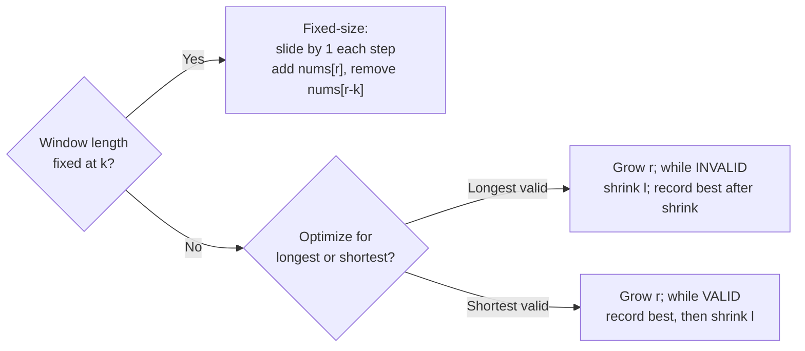
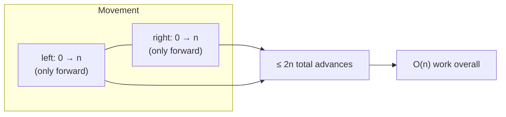
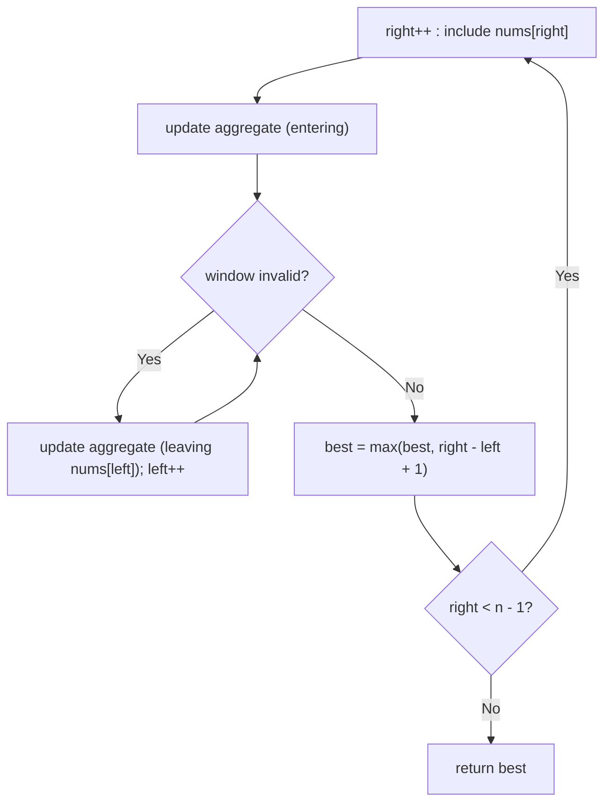
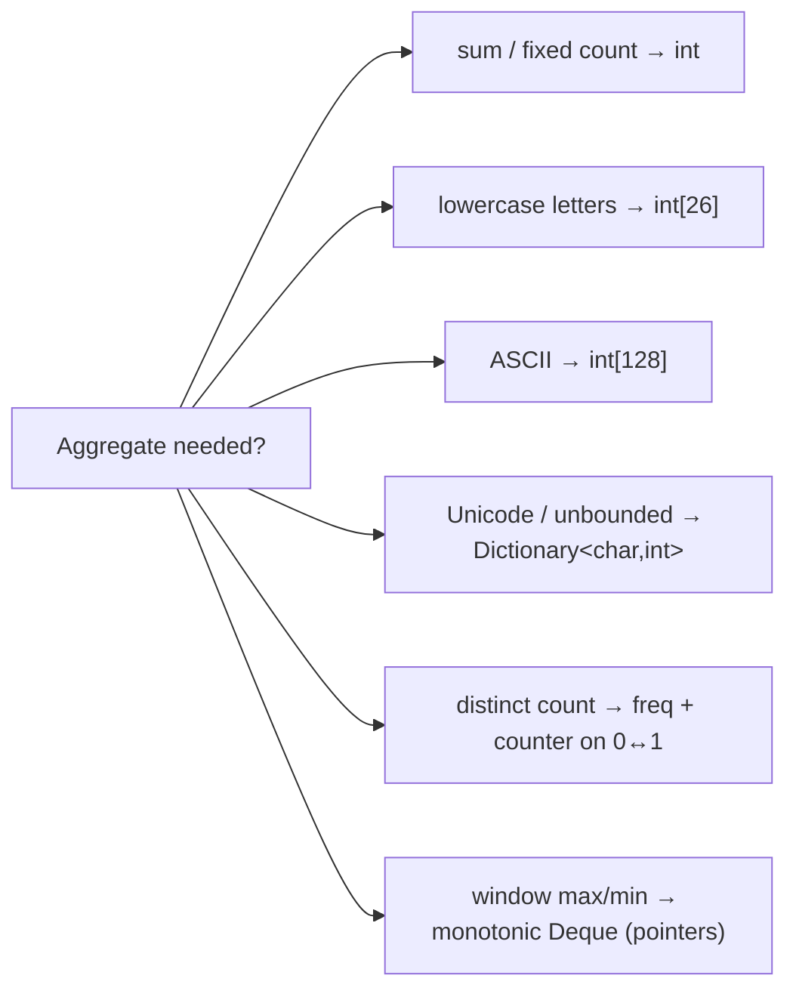
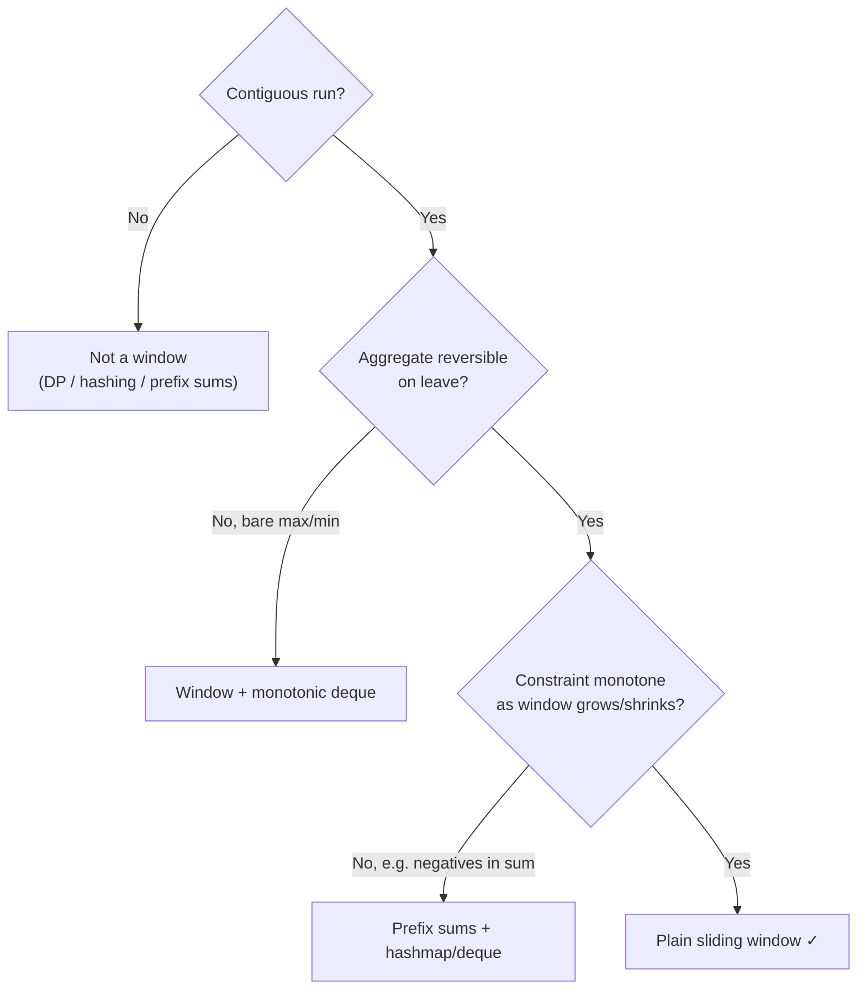

# Sliding Window (Reviewer)

The **sliding window** is a specialization of [two pointers](algorithms-glossary-reviewer.md#two-pointers "Two index variables moving through a sequence to solve it in one linear pass.") for problems over a **contiguous** [subarray](algorithms-glossary-reviewer.md#subarray-subsequence-and-substring "Subarray/substring is a contiguous slice; subsequence keeps order but may skip.") or substring. You keep a window `[left, right]` and walk `right` across the [array](algorithms-glossary-reviewer.md#array "A fixed-size contiguous block of same-type elements accessed by position in O(1).") once; as new elements enter on the right you update a cheap running aggregate (a sum, a [frequency map](algorithms-glossary-reviewer.md#frequency-map "A hash map from each distinct item to how many times it appears."), a distinct count), and when a constraint is violated or an optimum is reachable you advance `left` to shrink the window. Because every [index](algorithms-glossary-reviewer.md#index "The integer position of an element; 0-indexed starts at 0, 1-indexed at 1.") enters the window at most once and leaves at most once, the whole scan is `O(n)` even though it looks like a nested loop.

It applies whenever the answer is "the best (longest / shortest / count of) contiguous run satisfying a property," and the property can be maintained **incrementally** as the window grows and shrinks — the entering element's effect and the leaving element's effect must both be cheap to apply. If the structure you need is not contiguous (a subsequence), or the running aggregate cannot be reversed when an element leaves (e.g. a plain `max` over arbitrary values), the basic window breaks and you reach for a different tool. This reviewer gives you the fixed-size and variable-size templates, the [invariant](algorithms-glossary-reviewer.md#invariant "A condition that stays true at every step, used to prove correctness.") that makes them linear, and traced walkthroughs of the canonical problems.

Related: [Algorithm Patterns Index](algorithm-patterns-index-reviewer.md) · [Two Pointers](two-pointers-reviewer.md) · [Arrays & Hashing](arrays-and-hashing-reviewer.md) · [Stacks & Monotonic Stacks](stacks-and-monotonic-stacks-reviewer.md) · [Complexity & Big-O](complexity-and-big-o-reviewer.md) · [Glossary](algorithms-glossary-reviewer.md)

## Contents

- [What a sliding window is](#what-a-sliding-window-is)
- [Why it is O(n): the amortized invariant](#why-it-is-on-the-amortized-invariant)
- [Fixed-size window](#fixed-size-window)
- [Variable-size window: longest template](#variable-size-window-longest-template)
- [Variable-size window: shortest template](#variable-size-window-shortest-template)
- [Tracking window state cheaply](#tracking-window-state-cheaply)
- [The monotonic-deque window for max/min](#the-monotonic-deque-window-for-maxmin)
- [When NOT to use a window](#when-not-to-use-a-window)
- [Worked problem: Longest Substring Without Repeating](#worked-problem-longest-substring-without-repeating)
- [Worked problem: Maximum Vowels in length k](#worked-problem-maximum-vowels-in-length-k)
- [Worked problem: Minimum Window Substring](#worked-problem-minimum-window-substring)
- [Worked problem: Permutation in String](#worked-problem-permutation-in-string)
- [Worked problem: Longest Repeating Character Replacement](#worked-problem-longest-repeating-character-replacement)
- [Best Time to Buy and Sell Stock as a window](#best-time-to-buy-and-sell-stock-as-a-window)
- [Complexity cheat sheet](#complexity-cheat-sheet)
- [Interview Q&A](#interview-qa)
- [Rapid-fire round](#rapid-fire-round)
- [Exam-style questions](#exam-style-questions)
- [30-second takeaway](#30-second-takeaway)
- [Quick recall checklist](#quick-recall-checklist)
- [References](#references)

---

## What a sliding window is

A window is the contiguous slice `nums[left..right]` (both inclusive in this reviewer). Instead of recomputing a property over every candidate slice from scratch — which is `O(n^2)` or worse — you maintain the property as a running value and update it in `O(1)` [amortized](algorithms-glossary-reviewer.md#amortized-analysis "Average cost per operation across a worst-case sequence, not a probability.") as the window's edges move.

Key points:
- **Contiguous only.** The window is always a single run of adjacent indices. Subsequence problems (pick non-adjacent elements) are not window problems.
- **Two pointers, same direction.** Both `left` and `right` only ever move forward ([monotonically](algorithms-glossary-reviewer.md#monotonic "Consistently moving one direction; never decreasing or never increasing.")). This is what makes it a window rather than the convergent two-pointer pattern where the ends move toward each other.
- **Right grows, left shrinks.** `right` extends the window to include new data; `left` contracts it to restore a constraint or to search for a smaller optimum.
- **Incremental aggregate.** Entering element: apply its effect (`sum += x`, `count[x]++`). Leaving element: undo its effect (`sum -= x`, `count[x]--`). Both must be cheap and reversible.
- **Two shapes.** *Fixed-size* (window length is a constant `k`) and *variable-size* (length flexes to satisfy a goal). They share the entering/leaving bookkeeping but differ in how `left` moves.



*Decision tree: fixed windows slide one slot at a time; variable windows differ only in whether you shrink while invalid (longest) or while valid (shortest).*

## Why it is O(n): the amortized invariant

The window looks like two nested loops (`right` advances in the outer pass, `left` advances in an inner `while`), which naively reads as `O(n^2)`. It is actually `O(n)` because of an **amortized** argument: `left` and `right` each start at `0`, each only ever increases, and each is bounded by `n`. The total number of pointer advances across the whole run is therefore at most `2n`, no matter how the inner `while` and outer `for` interleave.

Key points:
- **Each index enters once.** `right` visits every index exactly once over the entire scan.
- **Each index leaves at most once.** `left` can pass any index at most once because it never moves backward.
- **Bounded work per move.** If entering/leaving an element is `O(1)` (or `O(alphabet)` for a fixed `int[26]`/`int[128]`), total work is `O(n)` (or `O(n + alphabet)`).
- **The trap.** A misread sees the inner `while` and multiplies; the correct read sums pointer movement globally — classic amortized analysis, same as the convergent two-pointer scan.



*The linear bound comes from totalling pointer advances globally, not from nesting the loops — left and right together move at most 2n times.*

## Fixed-size window

When the window length is a fixed `k`, the window slides one slot at a time: at each step you add the entering element `nums[right]` and, once the window has grown past size `k`, remove the leaving element `nums[right - k]`. The aggregate (here a running sum) is never recomputed from scratch.

Key points:
- **No inner loop.** The window size is constant, so there is no `while`-shrink — just add one, remove one.
- **Seed then slide.** Either build the first `k`-element window, then slide; or use the unified form below that handles the first `k` elements and the slide in one loop.
- **The leaving index is `right - k`.** When `right >= k`, the element that falls out of the back is at `right - k`.
- **Answer is read after each full window.** Once `right >= k - 1`, the window `[right - k + 1, right]` has exactly `k` elements; record the aggregate then.

```csharp
using System;

public static double MaxAverageSubarray(int[] nums, int k)
{
    int sum = 0;
    for (int i = 0; i < k; i++) sum += nums[i];   // seed first window

    int best = sum;
    for (int right = k; right < nums.Length; right++)
    {
        sum += nums[right];        // entering element
        sum -= nums[right - k];    // leaving element
        if (sum > best) best = sum;
    }
    return (double)best / k;
}
```

```text
nums = [1, 12, -5, -6, 50, 3]   k = 4
 index   0    1    2    3    4   5

seed window [0..3]:  1 + 12 + -5 + -6 = 2          best = 2
right=4: + nums[4]=50, - nums[0]=1   -> 2+50-1 = 51   best = 51
right=5: + nums[5]=3,  - nums[1]=12  -> 51+3-12 = 42  best = 51
window sums seen: 2, 51, 42   max sum = 51 -> max avg = 51/4 = 12.75
```

*Fixed window of size 4 sliding right: each step adds the entering value and subtracts the one that fell off the back — no slice is ever re-summed.*

## Variable-size window: longest template

For "longest contiguous run that stays valid," grow `right` unconditionally; whenever adding `nums[right]` makes the window **invalid**, shrink `left` until it is valid again. After the shrink the window `[left, right]` is the longest valid window ending at `right`, so record its size.

Key points:
- **Shrink while invalid.** The inner `while` runs only as long as the constraint is broken.
- **Record after restoring validity.** The best length is taken once the window is valid again, every iteration.
- **Validity is monotone in this template.** Adding an element can only *break* validity; removing from the left can only *restore* it. That monotonicity is what licenses the single shrink direction.

```csharp
using System;
using System.Collections.Generic;

// Longest subarray with at most k zeros flipped, as a generic illustration.
public static int LongestOnesWithKFlips(int[] nums, int k)
{
    int left = 0, zeros = 0, best = 0;
    for (int right = 0; right < nums.Length; right++)
    {
        if (nums[right] == 0) zeros++;          // entering element

        while (zeros > k)                        // window invalid -> shrink
        {
            if (nums[left] == 0) zeros--;        // leaving element
            left++;
        }

        best = Math.Max(best, right - left + 1); // window now valid
    }
    return best;
}
```



*Grow-right / shrink-left structure for the LONGEST template: shrink while invalid, then record the window size once validity is restored.*

## Variable-size window: shortest template

For "shortest contiguous run that reaches a goal," grow `right` until the window becomes **valid** (the goal is met), then shrink `left` as far as you can while it *stays* valid, recording the length each time before it breaks. The shrink condition is the mirror image of the longest template.

Key points:
- **Shrink while valid.** Here the inner `while` runs as long as the window still satisfies the goal, squeezing out slack from the left.
- **Record inside the shrink.** Capture the best (smallest) length each iteration before removing the element that would invalidate it.
- **Goal is monotone the other way.** Adding can only *achieve* the goal; removing can only *lose* it — so once valid, you peel from the left until it is about to fail.

```csharp
using System;

// Shortest subarray with sum >= target, for non-negative nums.
public static int MinSubarrayLen(int target, int[] nums)
{
    int left = 0, sum = 0, best = int.MaxValue;
    for (int right = 0; right < nums.Length; right++)
    {
        sum += nums[right];               // entering element
        while (sum >= target)             // window valid -> try to shrink
        {
            best = Math.Min(best, right - left + 1);
            sum -= nums[left];            // leaving element
            left++;
        }
    }
    return best == int.MaxValue ? 0 : best;
}
```

| | Longest template | Shortest template |
| --- | --- | --- |
| Inner `while` shrinks while | window is **invalid** | window is **valid** |
| Best recorded | **after** the `while`, when valid | **inside** the `while`, while valid |
| Optimizing for | maximum length | minimum length |
| Example | LC 3, LC 424 | LC 76, min-sum-subarray |

## Tracking window state cheaply

The window only stays `O(1)`-per-step if the aggregate is incremental. Pick the lightest structure that supports both "add entering" and "remove leaving."

Key points:
- **Running sum / count** — a single `int`. Reversible: `+= x` on enter, `-= x` on leave. Used for sum and fixed-count problems.
- **`int[26]` / `int[128]` frequency** — for lowercase letters or ASCII. `freq[c]++` on enter, `freq[c]--` on leave. Constant alphabet means `O(1)` per step and `O(1)` extra space.
- **`Dictionary<char,int>`** — for unbounded/Unicode alphabets. Same enter/leave bookkeeping; `O(1)` average per op.
- **Distinct count** — maintain a counter alongside the map: increment it when a frequency goes `0 -> 1`, decrement when it goes `1 -> 0`. Gives "number of distinct chars in window" in `O(1)`.
- **`have` / `need` matching** — for "window contains all of T": `need` = required distinct chars with target counts; `have` = how many of those are currently satisfied. The window is valid when `have == need`.

```csharp
using System;

// Distinct-count maintained incrementally over a lowercase window.
public sealed class DistinctWindow
{
    private readonly int[] freq = new int[26];
    public int Distinct { get; private set; }

    public void Add(char c)
    {
        if (freq[c - 'a']++ == 0) Distinct++;   // 0 -> 1 adds a new distinct char
    }

    public void Remove(char c)
    {
        if (--freq[c - 'a'] == 0) Distinct--;   // 1 -> 0 drops a distinct char
    }
}
```



*Choosing the window's state structure: the cheapest reversible aggregate that the constraint needs — escalate from a single int up to a frequency map or a monotonic deque.*

## The monotonic-deque window for max/min

A plain `max` over the window is the one common aggregate that is **not** cheaply reversible: when the current maximum leaves on the left, you cannot recover the next-largest without rescanning. The fix is a **[monotonic deque](algorithms-glossary-reviewer.md#monotonic-stack "A stack kept in sorted order to find next/previous greater or smaller in O(n).")** that stores candidate indices in decreasing value order, so the front is always the window maximum.

Key points:
- **Store indices, not values.** Indices let you detect when the front has slid out of the window (`front < left`).
- **Maintain monotonicity on insert.** Before pushing `right`, pop from the back every index whose value is `<= nums[right]` (they can never be the max while `right` is in the window).
- **Front is the answer.** After inserting, `nums[deque.Front]` is the window maximum.
- **Evict the stale front.** When the front index falls outside `[right - k + 1, right]`, pop it from the front.
- **Amortized O(1).** Each index is pushed once and popped once, so a length-`n` scan with `Deque` operations is `O(n)` total; space is `O(k)`.

```csharp
using System;
using System.Collections.Generic;

// Sliding window maximum of every length-k window.
public static int[] MaxSlidingWindow(int[] nums, int k)
{
    var dq = new LinkedList<int>();          // holds indices, values decreasing front->back
    var result = new int[nums.Length - k + 1];

    for (int right = 0; right < nums.Length; right++)
    {
        // evict front if it slid out of the window
        if (dq.Count > 0 && dq.First!.Value <= right - k)
            dq.RemoveFirst();

        // keep deque decreasing: drop smaller-or-equal tails
        while (dq.Count > 0 && nums[dq.Last!.Value] <= nums[right])
            dq.RemoveLast();

        dq.AddLast(right);

        if (right >= k - 1)
            result[right - k + 1] = nums[dq.First!.Value];  // front = window max
    }
    return result;
}
```

```text
nums = [1, 3, -1, -3, 5, 3, 6, 7]   k = 3   (deque holds indices; values shown)
right=0 val=1   dq=[1]                          (no output yet)
right=1 val=3   pop 1(<=3) -> dq=[3]            (no output yet)
right=2 val=-1  dq=[3,-1]            window[0..2] max = 3
right=3 val=-3  dq=[3,-1,-3]         window[1..3] max = 3
right=4 val=5   pop -3,-1,3(all<=5) -> dq=[5]   window[2..4] max = 5
right=5 val=3   dq=[5,3]             window[3..5] max = 5
right=6 val=6   pop 3,5(<=6) -> dq=[6]          window[4..6] max = 6
right=7 val=7   pop 6(<=7) -> dq=[7]            window[5..7] max = 7
output = [3, 3, 5, 5, 6, 7]
```

*Monotonic deque of indices stays value-decreasing so the front is always the window max; each index is pushed and popped once, keeping the whole scan O(n).*

## When NOT to use a window

The window is powerful but narrow. Recognizing where it fails is as important as knowing where it fits.

Key points:
- **Non-contiguous subsequences.** "Longest increasing subsequence," "subsequence summing to k" — the chosen elements are not adjacent, so a contiguous window cannot represent the candidate. Use [DP](algorithms-glossary-reviewer.md#dynamic-programming "Solving problems with overlapping subproblems by computing each once and reusing it.") or [hashing](algorithms-glossary-reviewer.md#hashing "Turning a key into a fixed-size integer used to place or find it in a table.") instead.
- **Negatives break sum-window monotonicity.** "Shortest subarray with sum >= target" works for the variable window only because all values are non-negative, which makes the running sum monotone as the window grows. With negative numbers, extending `right` can *decrease* the sum, so shrinking `left` no longer reliably restores or preserves validity. Use [prefix sums](algorithms-glossary-reviewer.md#prefix-sum "Running totals up to each position, making any range sum an O(1) subtraction.") + a monotonic deque instead — see [Prefix Sums & Difference Arrays](prefix-sums-and-difference-arrays-reviewer.md).
- **Non-reversible aggregates.** Anything you cannot undo on leave (a bare `max`/`min`) needs a helper structure (the monotonic deque above) rather than the plain window.
- **Counting subarrays "exactly k".** Often solved as `atMost(k) - atMost(k-1)`, where each `atMost` is a window — but the raw "exactly" version is not a single window.
- **Subarray sum equals k (with negatives).** This is a **prefix-sum + [hashmap](algorithms-glossary-reviewer.md#hash-map "Stores key-value pairs and retrieves a value by key in O(1) average time.")** problem, not a window — extending or shrinking does not move the sum monotonically.



*Gatekeeper checklist: a plain window needs a contiguous run, a reversible aggregate, and a constraint that moves monotonically with the window edges.*

## Worked problem: Longest Substring Without Repeating

**LC 3 — Longest Substring Without Repeating Characters.** Longest template: grow `right`; if `s[right]` already sits in the window, jump `left` to one past its previous occurrence. Maps to `sliding-window/dynamic-size-window/longest-substring` in `leet-practice`.

Key points:
- **State.** `last[c]` = most recent index of char `c` (or `-1`). The window is `[left, right]`.
- **Jump, don't crawl.** When `s[right]` was last seen at `j >= left`, set `left = j + 1` in one step. Crawling left one char at a time also works and is still `O(n)`, but the jump is cleaner.
- **Complexity.** Time `O(n)`; space `O(min(n, alphabet))` for the last-seen map.

```csharp
using System;
using System.Collections.Generic;

public static int LengthOfLongestSubstring(string s)
{
    var last = new Dictionary<char, int>();
    int left = 0, best = 0;

    for (int right = 0; right < s.Length; right++)
    {
        char c = s[right];
        if (last.TryGetValue(c, out int j) && j >= left)
            left = j + 1;            // jump past the previous occurrence

        last[c] = right;
        best = Math.Max(best, right - left + 1);
    }
    return best;
}
```

```text
s = "abcabcbb"
 index  0  1  2  3  4  5  6  7
        a  b  c  a  b  c  b  b

r=0 'a' new           L=0 .......... window "a"     len 1  best 1
r=1 'b' new           L=0 .......... window "ab"    len 2  best 2
r=2 'c' new           L=0 .......... window "abc"   len 3  best 3
r=3 'a' seen@0 (>=L)  L=1 jump       window "bca"   len 3  best 3
r=4 'b' seen@1 (>=L)  L=2 jump       window "cab"   len 3  best 3
r=5 'c' seen@2 (>=L)  L=3 jump       window "abc"   len 3  best 3
r=6 'b' seen@4 (>=L)  L=5 jump       window "cb"    len 2  best 3
r=7 'b' seen@6 (>=L)  L=7 jump       window "b"     len 1  best 3
answer = 3   ("abc")
```

*Left jumps directly past each repeated character's last position, so the window always holds distinct chars and never moves left backward.*

## Worked problem: Maximum Vowels in length k

**LC 1456 — Maximum Number of Vowels in a Substring of Given Length.** A textbook fixed window: count vowels in the first `k`, then slide, adjusting the count by the entering and leaving characters only. Maps to `sliding-window/fixed-size-window/max-vowels` in `leet-practice`.

Key points:
- **Incremental count.** `+1` when the entering char is a vowel, `-1` when the leaving char is a vowel.
- **Early exit.** The best possible answer is `k`; you may return as soon as `count == k`.
- **Complexity.** Time `O(n)`; space `O(1)`.

```csharp
using System;

public static int MaxVowels(string s, int k)
{
    static bool IsVowel(char c) =>
        c is 'a' or 'e' or 'i' or 'o' or 'u';

    int count = 0;
    for (int i = 0; i < k; i++)            // seed first window
        if (IsVowel(s[i])) count++;

    int best = count;
    for (int right = k; right < s.Length; right++)
    {
        if (IsVowel(s[right])) count++;          // entering
        if (IsVowel(s[right - k])) count--;      // leaving
        if (count > best) best = count;
        if (best == k) return k;                 // can't beat k
    }
    return best;
}
```

```text
s = "abciido"   k = 3        vowels = a e i o u
 index  0  1  2  3  4  5  6
        a  b  c  i  i  d  o

seed [0..2] "abc": vowels {a}              count = 1   best = 1
r=3 enter 'i'(+1) leave 'a'(-1) "bci"      count = 1   best = 1
r=4 enter 'i'(+1) leave 'b'( 0) "cii"      count = 2   best = 2
r=5 enter 'd'( 0) leave 'c'( 0) "iid"      count = 2   best = 2
r=6 enter 'o'(+1) leave 'i'(-1) "ido"      count = 2   best = 2
answer = 2   (window "cii" or "iid")
```

*Each slide adjusts the vowel count by at most the entering and leaving characters — the body of the window is never re-scanned.*

## Worked problem: Minimum Window Substring

**LC 76 — Minimum Window Substring.** Shortest template with `have`/`need` matching: grow `right` until the window covers every character of `t` (with multiplicity), then shrink `left` to the minimal such window, recording the best.

Key points:
- **`need`** = number of *distinct* chars in `t` whose required count is not yet met. **`have`** = how many of those are currently satisfied. The window covers `t` exactly when `have == need`.
- **Update `have` on the boundary.** Increment `have` only when a char's window count rises to *exactly* its target; decrement only when it falls *below* target while shrinking.
- **Shrink while valid.** Once `have == need`, peel from the left, recording the smallest window each step.
- **Complexity.** Time `O(s.Length + t.Length)`; space `O(alphabet)` (at most the distinct chars of `t`).

```csharp
using System;
using System.Collections.Generic;

public static string MinWindow(string s, string t)
{
    if (s.Length < t.Length || t.Length == 0) return "";

    var need = new Dictionary<char, int>();
    foreach (char c in t)
        need[c] = need.GetValueOrDefault(c) + 1;

    int required = need.Count;                 // distinct chars to satisfy
    int have = 0;
    var window = new Dictionary<char, int>();

    int bestLen = int.MaxValue, bestLeft = 0;
    int left = 0;

    for (int right = 0; right < s.Length; right++)
    {
        char c = s[right];
        window[c] = window.GetValueOrDefault(c) + 1;
        if (need.ContainsKey(c) && window[c] == need[c])
            have++;                            // this char just became satisfied

        while (have == required)               // window valid -> shrink
        {
            if (right - left + 1 < bestLen)
            {
                bestLen = right - left + 1;
                bestLeft = left;
            }
            char d = s[left];
            window[d]--;
            if (need.ContainsKey(d) && window[d] < need[d])
                have--;                        // dropped below target -> no longer satisfied
            left++;
        }
    }
    return bestLen == int.MaxValue ? "" : s.Substring(bestLeft, bestLen);
}
```

```text
s = "ADOBECODEBANC"   t = "ABC"        need = {A:1, B:1, C:1}  required = 3
 index   0 1 2 3 4 5 6 7 8 9 10 11 12
         A D O B E C O D E B A  N  C

grow right; have rises as each needed char first hits its target:
  r=0 A have=1   r=3 B have=2   r=5 C have=3 -> VALID [0..5]  "ADOBEC"  len 6  best=6
  shrink: drop A -> A:1->0 < need, have=2, STOP        left=1
grow right (have stays 2 through r=9):
  r=10 A have=3 -> VALID [1..10] "DOBECODEBA" len 10 (>6, no update)
  shrink, recording each valid width before it breaks:
    drop D -> [2..10]  len 9            drop O -> [3..10]  len 8
    drop B -> [4..10]  len 7            drop E -> [5..10]  len 6  (ties 6, keep first)
    drop C -> C:1->0 < need, have=2, STOP                left=6
grow right:
  r=12 C have=3 -> VALID [6..12] "ODEBANC" len 7 (>6, no update)
  shrink:
    drop O -> [7..12] len 6   drop D -> [8..12] len 5   drop E -> [9..12] len 4  best=4
    drop B -> B:1->0 < need, have=2, STOP                left=10
answer = "BANC"   (length 4, window [9..12])
```

*The have/need counters turn "does the window contain all of t" into an O(1) check; the shrink phase squeezes each valid window down to its minimal length before growing again.*

## Worked problem: Permutation in String

**LC 567 — Permutation in String.** Asks whether any [permutation](algorithms-glossary-reviewer.md#permutation "An ordered arrangement of elements; n distinct items have n! permutations.") of `s1` is a substring of `s2`. Since a permutation is just an [anagram](algorithms-glossary-reviewer.md#anagram "A string that is a rearrangement of another: same characters, same counts."), this is a **fixed window** of length `s1.Length` whose character frequencies must equal those of `s1`.

Key points:
- **Window length is fixed** at `s1.Length` — a permutation has exactly those characters.
- **Compare frequency vectors.** Track how many of the 26 counts currently match `s1`'s counts; the window is an anagram when all 26 match.
- **Incremental match count.** Maintain `matches` (0..26); when adjusting a count, fix `matches` only for the one char whose count changed, in `O(1)`.
- **Complexity.** Time `O(s2.Length)` with the `matches` trick (or `O(26 * n)` if you recompare all 26 each slide); space `O(1)`.

```csharp
using System;

public static bool CheckInclusion(string s1, string s2)
{
    if (s1.Length > s2.Length) return false;

    int[] need = new int[26], win = new int[26];
    foreach (char c in s1) need[c - 'a']++;

    int matches = 0;
    for (int i = 0; i < 26; i++)
        if (need[i] == win[i]) matches++;       // all zeros initially match -> 26

    int k = s1.Length;
    for (int right = 0; right < s2.Length; right++)
    {
        int enter = s2[right] - 'a';
        win[enter]++;
        if (win[enter] == need[enter]) matches++;
        else if (win[enter] == need[enter] + 1) matches--;

        if (right >= k)
        {
            int leave = s2[right - k] - 'a';
            win[leave]--;
            if (win[leave] == need[leave]) matches++;
            else if (win[leave] == need[leave] - 1) matches--;
        }

        if (matches == 26) return true;          // window is an anagram of s1
    }
    return false;
}
```

```text
s1 = "ab"  (need a:1 b:1)   s2 = "eidbaooo"   k = 2
 index 0 1 2 3 4 5 6 7
       e i d b a o o o

r=0 enter e  win e:1  matches!=26
r=1 enter i  win i:1                          window "ei"  matches!=26
r=2 enter d  leave e  win d:1,e:0             window "id"  matches!=26
r=3 enter b  leave i  win b:1,i:0             window "db"  matches!=26
r=4 enter a  leave d  win a:1,d:0             window "ba"  -> a:1 b:1 == need  matches=26  TRUE
answer = true   ("ba" is a permutation of "ab")
```

*A permutation is an anagram, so the window length is pinned to s1's length and you only watch whether the 26 frequency counts all match.*

## Worked problem: Longest Repeating Character Replacement

**LC 424 — Longest Repeating Character Replacement.** Longest window such that, after replacing at most `k` characters, all chars in the window are equal. A window is valid when `(windowLength - countOfMostFrequentChar) <= k` — the non-dominant chars are exactly the ones you would replace.

Key points:
- **Validity test.** `windowLen - maxFreq <= k`, where `maxFreq` is the highest single-char frequency in the window.
- **`maxFreq` need not decrease on shrink.** A well-known subtlety: you may let `maxFreq` be a high-water mark and never decrement it. The window then never shrinks below its best length, which still yields the correct maximum — it is monotone, so the answer is `right - left + 1` at the end's widest valid reach.
- **Single-char shrink.** When invalid, move `left` by exactly one per `right`; the window size never decreases, it only slides, so it ends at the maximum valid width seen.
- **Complexity.** Time `O(n)`; space `O(1)` (`int[26]`).

```csharp
using System;

public static int CharacterReplacement(string s, int k)
{
    int[] freq = new int[26];
    int left = 0, maxFreq = 0, best = 0;

    for (int right = 0; right < s.Length; right++)
    {
        freq[s[right] - 'A']++;                 // LC 424 strings are uppercase A..Z
        maxFreq = Math.Max(maxFreq, freq[s[right] - 'A']);

        // (windowLen - maxFreq) is the count of chars we'd have to replace
        while (right - left + 1 - maxFreq > k)
        {
            freq[s[left] - 'A']--;
            left++;
        }

        best = Math.Max(best, right - left + 1);
    }
    return best;
}
```

```text
s = "AABABBA"   k = 1     (need_replace = windowLen - maxFreq)
 index 0 1 2 3 4 5 6       A A B A B B A

r=0 'A' [0..0] "A"    len 1  maxF 1  need_replace 0  ok      best 1
r=1 'A' [0..1] "AA"   len 2  maxF 2  need_replace 0  ok      best 2
r=2 'B' [0..2] "AAB"  len 3  maxF 2  need_replace 1  ok      best 3
r=3 'A' [0..3] "AABA" len 4  maxF 3  need_replace 1  ok      best 4
r=4 'B' need_replace 5-3=2 >1 -> shrink left=1; [1..4] "ABAB" len 4  best 4
r=5 'B' need_replace 5-3=2 >1 -> shrink left=2; [2..5] "BABB" len 4  best 4
r=6 'A' need_replace 5-3=2 >1 -> shrink left=3; [3..6] "ABBA" len 4  best 4
answer = 4   (replace one char in a length-4 window, e.g. "AABA" -> "AAAA")
```

*The window grows while at most k chars differ from the most frequent one; keeping maxFreq as a high-water mark means the window only ever slides, settling at the widest valid width.*

## Best Time to Buy and Sell Stock as a window

**LC 121 — Best Time to Buy and Sell Stock.** Maximize `prices[sell] - prices[buy]` with `buy < sell`. This is a degenerate window: `left` marks the cheapest buy seen so far, `right` is today's sell. It is really "min-so-far + running best," which is the convergent cousin of the variable window.

Key points:
- **`left` tracks the minimum.** Whenever today's price is below the recorded minimum, move the buy point to today.
- **Profit at `right`.** Best profit selling today is `prices[right] - minSoFar`; keep the running maximum.
- **One pass, no replay.** Each price is read once; this is `O(n)` time, `O(1)` space.
- **Window framing.** The "window" `[buy, sell]` only ever grows on the right and resets its left to a new minimum — a one-directional scan, not a shrink loop.

```csharp
using System;

public static int MaxProfit(int[] prices)
{
    int minPrice = int.MaxValue, best = 0;
    for (int right = 0; right < prices.Length; right++)
    {
        if (prices[right] < minPrice)
            minPrice = prices[right];                 // new cheapest buy
        else
            best = Math.Max(best, prices[right] - minPrice);
    }
    return best;
}
```

```text
prices = [7, 1, 5, 3, 6, 4]
 index    0  1  2  3  4  5

r=0 p=7  min=7              best=0
r=1 p=1  p<min -> min=1     best=0
r=2 p=5  5-1=4              best=4
r=3 p=3  3-1=2              best=4
r=4 p=6  6-1=5              best=5
r=5 p=4  4-1=3              best=5
answer = 5   (buy at 1, sell at 6)
```

*Buy-low/sell-high is a one-directional window: left snaps to each new minimum, right sweeps forward, and the best gap is recorded as it goes.*

## Complexity cheat sheet

All windows below scan the input once; the difference is the per-step bookkeeping. `n` is the input length, `Σ` the alphabet size (26 for lowercase, 128 for ASCII).

| Problem | Window type | Time | Space |
| --- | --- | --- | --- |
| LC 1456 — Maximum Vowels in length k | fixed | `O(n)` | `O(1)` |
| LC 567 — Permutation in String | fixed | `O(n)` | `O(1)` (`int[26]`) |
| LC 3 — Longest Substring Without Repeating | variable, longest | `O(n)` | `O(min(n, Σ))` |
| LC 424 — Longest Repeating Char Replacement | variable, longest | `O(n)` | `O(1)` (`int[26]`) |
| LC 76 — Minimum Window Substring | variable, shortest | `O(s + t)` | `O(Σ)` |
| LC 121 — Best Time to Buy/Sell Stock | one-directional | `O(n)` | `O(1)` |
| Sliding window maximum (deque) | fixed + deque | `O(n)` | `O(k)` |

*Every classic window is linear in the input; only the extra-space column distinguishes them, driven by the aggregate's state.*

## Interview Q&A

### Recognizing the pattern

Q: How do you spot a sliding-window problem?
A: The answer is the best (longest, shortest, or a count of) **contiguous** subarray/substring satisfying some property, and that property can be maintained incrementally as elements enter and leave. Keywords: "substring," "subarray," "contiguous," "window of size k," "at most / at least k distinct."

Q: What is the difference between sliding window and two pointers?
A: Sliding window *is* a two-pointer technique, but both pointers move in the **same** direction (left and right both only advance), bounding a contiguous region. The convergent two-pointer pattern moves the ends **toward each other**. The window also maintains a running aggregate that two-pointer scans often don't.

Q: Fixed vs variable window — how do you decide?
A: If the problem pins the window length (a literal `k`, or an implicit fixed length like "permutation of `s1`"), it is fixed: slide one slot, add one, remove one. If the length flexes to satisfy a goal, it is variable: grow `right`, then shrink `left` while invalid (longest) or while valid (shortest).

### The invariant and correctness

Q: Why is a window O(n) when it has a nested loop?
A: Amortized analysis. `left` and `right` each move only forward and are each bounded by `n`, so the total number of pointer advances across the entire run is at most `2n` regardless of how the inner `while` interleaves with the outer `for`. Per-step work is `O(1)` (or `O(Σ)` for a fixed array), giving `O(n)`.

Q: In the longest template, why do you record the best *after* the shrink loop, but in the shortest template *inside* it?
A: Longest wants the widest **valid** window; after shrinking until valid, `[left, right]` is the longest valid window ending at `right`. Shortest wants the narrowest valid window; you must measure each valid window *before* removing the element that would invalidate it, so the recording sits inside the shrink.

Q: What property must the constraint have for the single shrink direction to be correct?
A: Monotonicity with respect to the window edges. In the longest template, adding can only break validity and removing can only restore it; in the shortest template, adding can only reach the goal and removing can only lose it. If adding could both help and hurt (e.g. negative numbers in a sum constraint), the plain window is unsound.

### State and edge cases

Q: Why store indices rather than values in the monotonic-deque window-max?
A: Indices let you detect when the deque's front has slid out of the current window (`frontIndex <= right - k`) so you can evict it. Values alone can't tell you whether the maximum is still inside the window.

Q: In Minimum Window Substring, why track `have`/`need` counts instead of comparing maps each step?
A: Comparing full frequency maps per step is `O(Σ)` per move. The `have`/`need` integers turn "does the window cover `t`?" into an `O(1)` comparison, and each is adjusted in `O(1)` exactly when a character crosses its target count.

Q: In Longest Repeating Character Replacement, why is it fine that `maxFreq` never decreases?
A: Because the window only ever needs to *grow* to beat the current best. If `maxFreq` is stale (too high) after a shrink, the window simply can't expand further until a real char count catches up — it slides instead of shrinking, and never reports a window wider than a genuinely valid one. The final answer is the widest validly-reached width.

## Rapid-fire round

- sliding window in one line -> **maintain a running aggregate over a contiguous window whose edges only move forward**
- two pointers vs window -> **window's pointers move the same direction; convergent two-pointer moves the ends toward each other**
- why O(n) -> **left and right each advance at most n times — 2n total moves, amortized**
- fixed-window slide step -> **add `nums[right]`, remove `nums[right - k]`**
- longest template shrink -> **shrink while the window is INVALID, record best after**
- shortest template shrink -> **shrink while the window is VALID, record best inside**
- entering element op -> **apply effect: `sum += x` / `freq[x]++`**
- leaving element op -> **undo effect: `sum -= x` / `freq[x]--`**
- distinct count trick -> **increment on `0 -> 1`, decrement on `1 -> 0`**
- have/need (LC 76) -> **`have == need` means the window covers `t`**
- window max aggregate -> **not reversible — use a monotonic deque of indices**
- LC 3 left move -> **jump `left` to one past the duplicate's last index**
- LC 567 is really -> **a fixed window testing for an anagram of `s1`**
- LC 424 validity -> **`windowLen - maxFreq <= k`**
- LC 121 as window -> **left = cheapest price so far, right = sell day**
- when window fails -> **non-contiguous subsequence, negatives in a sum constraint, or a non-reversible aggregate**
- negatives + sum -> **use prefix sums + monotonic deque, not a plain window**
- "exactly k distinct" -> **`atMost(k) - atMost(k-1)`, each an `atMost` window**

## Exam-style questions

**1. Classify the window.** For each, state fixed vs variable and (if variable) longest vs shortest:
(a) longest substring with at most 2 distinct chars; (b) max sum of any 5 consecutive elements; (c) smallest subarray with sum ≥ S (non-negative); (d) whether `s2` contains a permutation of `s1`.

**Answer:** (a) variable, **longest** (grow, shrink while >2 distinct). (b) **fixed**, `k = 5` (add/remove one). (c) variable, **shortest** (grow until sum ≥ S, shrink while still ≥ S). (d) **fixed**, length `s1.Length` (compare frequency vectors).

**2. Trace LC 1456.** `s = "tryhard"`, `k = 4`. Vowels are `aeiou`. What is the maximum number of vowels in any length-4 window?

**Answer:** Windows: `"tryh"`→0, `"ryha"`→1 (`a`), `"yhar"`→1 (`a`), `"hard"`→1 (`a`). Maximum is **1**. (Only one vowel `a` ever appears, so no window can exceed 1.)

**3. Why does this break?** A candidate solves "shortest subarray with sum ≥ target" with a variable window on `nums = [2, -1, 2]`, `target = 3`. Their window-shrink assumes that once `sum ≥ target` they can peel from the left while it stays ≥ target.

**Answer:** The array has a **negative** value, so the running sum is not monotone as the window grows: extending `right` can lower the sum, and shrinking from the left can *raise* it. The shrink invariant fails. The correct tool is **prefix sums + a monotonic deque**, not a plain window.

**4. Off-by-one in a fixed window.** A fixed-window solution reads the answer when `right == k` instead of `right == k - 1`. What goes wrong?

**Answer:** The first complete window `[0, k-1]` is **skipped**, because at `right == k - 1` the window already has exactly `k` elements. Reading at `right == k` first records the *second* window. Fix: record once `right >= k - 1` (or seed the first window before the slide loop, as in the templates here).

**5. LC 3 with crawl vs jump.** Two correct solutions to Longest Substring Without Repeating: one moves `left` forward one char at a time while `s[right]` is a duplicate; the other jumps `left` to `lastSeen[c] + 1`. Are both `O(n)`?

**Answer:** **Yes.** Both are `O(n)`: in the crawl version, `left` still only ever advances and is bounded by `n`, so total left-moves are ≤ `n`. The jump version does the same total displacement in fewer steps but the same asymptotic bound. The jump just avoids the inner loop.

**6. LC 76 returns the wrong window.** A solution records the best window only at the moment `have == need` becomes true (the first valid window for each `right`), not during the shrink. On `s = "ADOBECODEBANC"`, `t = "ABC"`, what does it return and why is it wrong?

**Answer:** It returns `"ADOBEC"` (length 6) instead of the optimal `"BANC"` (length 4). Recording only on first validity misses the smaller windows found by shrinking from the left. The best must be captured **inside** the shrink loop, every iteration the window stays valid.

## 30-second takeaway

> A sliding window solves "best contiguous run with property P" by walking a window `[left, right]` whose edges **only move forward**, maintaining a cheap **reversible** aggregate — add the entering element, undo the leaving one. It is `O(n)` because `left` and `right` together advance at most `2n` times (amortized). **Fixed** windows slide one slot (add `nums[right]`, drop `nums[right-k]`); **variable** windows grow `right`, then shrink `left` while **invalid** (longest, record after) or while **valid** (shortest, record inside). Track state with a running `int`, an `int[26]`/`Dictionary<char,int>` frequency map, a distinct-count, or a `have`/`need` match — and a **monotonic deque** when you need a window max/min, the one aggregate you can't reverse. It does **not** apply to non-contiguous subsequences, to sum constraints with negatives, or to any non-reversible aggregate.

## Quick recall checklist

- **Contiguous + incremental** — window = a single run; aggregate updates `O(1)` on enter/leave.
- **Same-direction pointers** — `left` and `right` only move forward; that is the `2n` bound.
- **Fixed window** — add `nums[right]`, remove `nums[right - k]`; read answer from `right >= k - 1`.
- **Longest template** — grow `right`; shrink while **invalid**; record best **after** the shrink.
- **Shortest template** — grow `right`; shrink while **valid**; record best **inside** the shrink.
- **Entering/leaving** — `sum += x` / `sum -= x`, `freq[x]++` / `freq[x]--` — must be reversible.
- **Distinct count** — bump on `0→1`, drop on `1→0`.
- **have/need (LC 76)** — window covers `t` when `have == need`; shrink while valid.
- **Anagram window (LC 567)** — fixed length `s1.Length`, all 26 frequencies match.
- **Char replacement (LC 424)** — valid when `len - maxFreq <= k`; `maxFreq` may stay a high-water mark.
- **Window max/min** — use a **monotonic deque of indices**; front is the extreme; `O(n)` amortized.
- **Buy/sell (LC 121)** — `left` tracks min-so-far, `right` sells today; `O(n)`/`O(1)`.
- **Not a window** — non-contiguous subsequence, negatives in a sum constraint, non-reversible aggregate; use DP / prefix sums + deque / hashmap instead.

## References

- [Sliding window — Wikipedia](https://en.wikipedia.org/wiki/Sliding_window_protocol) *(general windowing concept)*
- [Two-pointer / window techniques — cp-algorithms.com](https://cp-algorithms.com/)
- [PriorityQueue&lt;TElement,TPriority&gt; — Microsoft Learn](https://learn.microsoft.com/en-us/dotnet/api/system.collections.generic.priorityqueue-2)
- [LinkedList&lt;T&gt; — Microsoft Learn](https://learn.microsoft.com/en-us/dotnet/api/system.collections.generic.linkedlist-1)
- [Dictionary&lt;TKey,TValue&gt; — Microsoft Learn](https://learn.microsoft.com/en-us/dotnet/api/system.collections.generic.dictionary-2)
- [Collections & Big-O (C#) reviewer](../dotnet/csharp/collections-and-big-o-reviewer.md)
- [NeetCode roadmap](https://neetcode.io/roadmap)
- [LeetCode study plans](https://leetcode.com/studyplan/)
