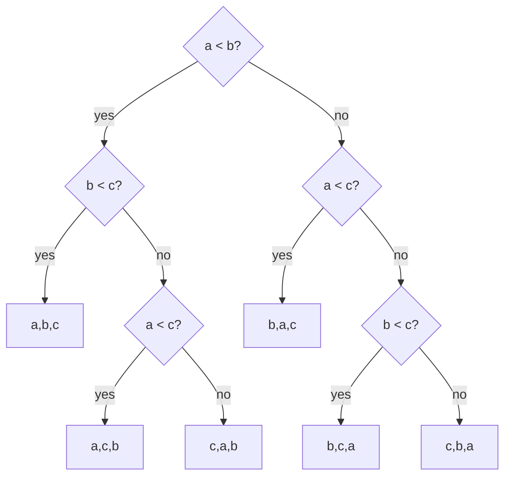
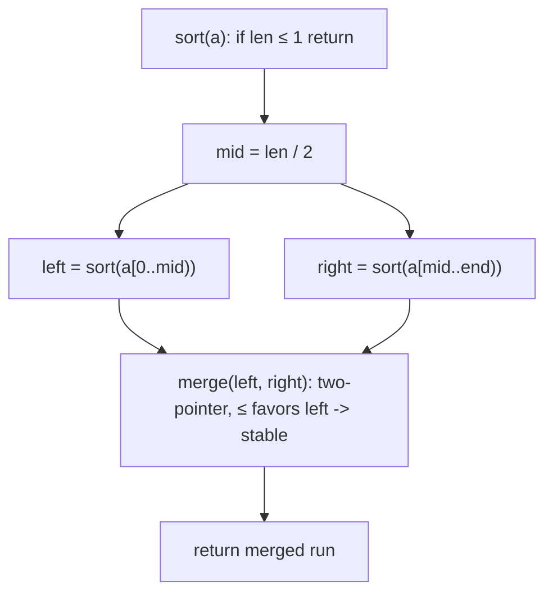
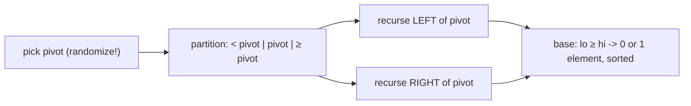
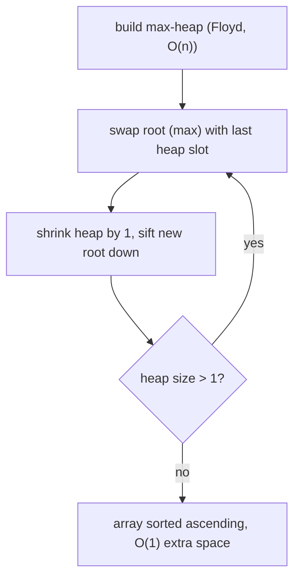
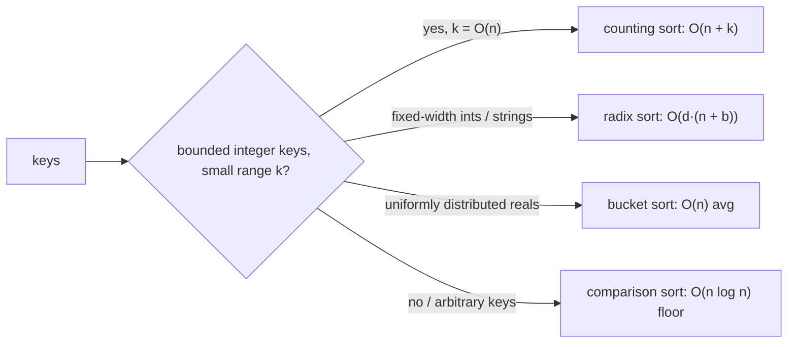
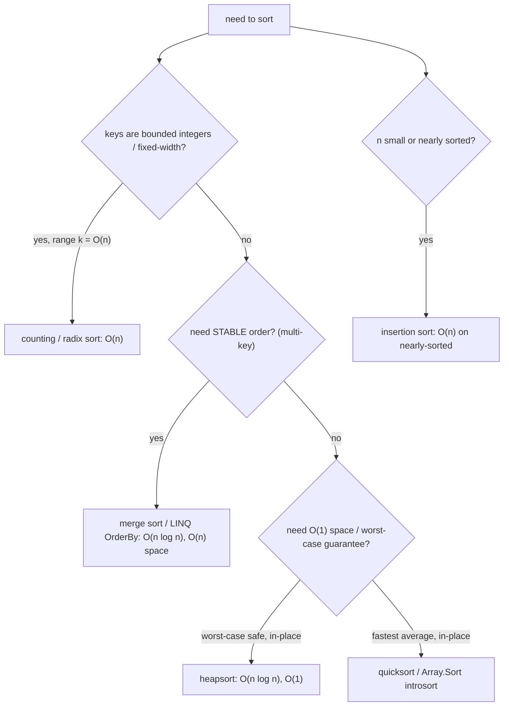

# Sorting Algorithms (Reviewer)

Sorting is the most over-studied yet under-understood interview topic: everyone can name "quicksort"
and "merge sort," but the senior signal is knowing *exactly* which one is stable, which is in-place,
which degrades to O(n²), and why the language runtime picked the one it did. A sort is a [permutation](algorithms-glossary-reviewer.md#permutation "An ordered arrangement of elements; n distinct items have n! permutations.")
of the input into non-decreasing order under some comparison or key, and the whole field splits into
two camps — **[comparison sorts](algorithms-glossary-reviewer.md#comparison-sort "A sort that orders elements only by comparing pairs; floor is O(n log n).")**, which only ever ask "is a before b?" and are bounded below by
**[O(n log n)](algorithms-glossary-reviewer.md#linearithmic-time "A linear pass repeated a logarithmic number of times; good-sort speed.")**, and **non-comparison sorts** ([counting](algorithms-glossary-reviewer.md#counting-sort "Sorts integers in a small range by counting occurrences, O(n + k)."), [radix](algorithms-glossary-reviewer.md#radix-sort "Sorts numbers digit by digit using a stable counting sort each pass."), [bucket](algorithms-glossary-reviewer.md#bucket-sort "Distributes elements into range buckets, sorts each, then concatenates.")), which exploit structure in the
keys to reach **[O(n)](algorithms-glossary-reviewer.md#linear-time "Work grows in direct proportion to input size, about one unit per element.")** when the keys are bounded.

This reviewer drills the [algorithms](algorithms-glossary-reviewer.md#algorithm "A precise, finite sequence of steps that turns an input into a desired output.") an interview expects you to derive on a whiteboard: the three
[quadratic](algorithms-glossary-reviewer.md#quadratic-time "Work grows like the square of n, typically a nested loop over the same data.") sorts (and the one place insertion sort genuinely wins), the two O(n log n) workhorses
(merge sort and quicksort) with their [partition](algorithms-glossary-reviewer.md#partition "Rearranging an array around a pivot so smaller items precede larger ones.") mechanics, heapsort, the linear non-comparison sorts,
and the C# realities — `Array.Sort`/`List.Sort` are an **unstable** [introsort](algorithms-glossary-reviewer.md#introsort "Hybrid sort: quicksort that falls back to heap sort to guarantee O(n log n)."), while LINQ `OrderBy`
is a **[stable](algorithms-glossary-reviewer.md#stable-sort "A sort that preserves the relative order of elements comparing equal.")** merge sort. Get the stability and complexity table burned into memory; it answers half
of all sorting questions outright.

Related: [Algorithm Patterns Index](algorithm-patterns-index-reviewer.md) · [Recursion & Divide and Conquer](recursion-and-divide-and-conquer-reviewer.md) · [Heaps & Priority Queues](heaps-and-priority-queues-reviewer.md) · [Binary Search](binary-search-reviewer.md) · [Complexity & Big-O](complexity-and-big-o-reviewer.md) · [Glossary](algorithms-glossary-reviewer.md)

## Contents
- [The comparison-sort lower bound](#the-comparison-sort-lower-bound)
- [Stability and in-place — definitions](#stability-and-in-place--definitions)
- [Quadratic sorts: bubble, selection, insertion](#quadratic-sorts-bubble-selection-insertion)
- [Merge sort](#merge-sort)
- [Quicksort and partitioning](#quicksort-and-partitioning)
- [Heapsort](#heapsort)
- [Quickselect (selection in O(n) average)](#quickselect-selection-in-on-average)
- [Non-comparison sorts: counting, radix, bucket](#non-comparison-sorts-counting-radix-bucket)
- [C# in practice: Array.Sort vs OrderBy](#c-in-practice-arraysort-vs-orderby)
- [The master comparison table](#the-master-comparison-table)
- [Choosing a sort (decision flow)](#choosing-a-sort-decision-flow)
- [Problem catalog](#problem-catalog)
- [Interview Q&A](#interview-qa)
- [Rapid-fire round](#rapid-fire-round)
- [Exam-style questions](#exam-style-questions)
- [30-second takeaway](#30-second-takeaway)
- [Quick recall checklist](#quick-recall-checklist)
- [References](#references)

---

## The comparison-sort lower bound

Any sort that learns order *only* by comparing pairs of elements cannot beat **O(n log n)** in the
[worst case](algorithms-glossary-reviewer.md#best-average-and-worst-case "How an algorithm's cost varies across the luckiest, typical, and hardest inputs."). This is a hard information-theoretic floor, not an "we haven't found a better algorithm
yet" statement.

Key points:

- A comparison sort is modeled as a **[decision tree](algorithms-glossary-reviewer.md#decision-tree "The conceptual tree of all choices a backtracking algorithm could make.")**: each internal node is a comparison `a < b?`
  with two outcomes, and each [leaf](algorithms-glossary-reviewer.md#leaf "A node with no children; the endpoint of a branch.") is one of the possible orderings.
- There are `n!` possible permutations of `n` distinct elements, so the tree needs at least `n!`
  leaves. A [binary tree](algorithms-glossary-reviewer.md#binary-tree "A tree where every node has at most two children, left and right.") of height `h` has at most `2^h` leaves, so `2^h >= n!`, giving
  `h >= log2(n!)`.
- By Stirling's approximation `log2(n!) = Theta(n log n)`. The height is the worst-case number of
  comparisons, so **every comparison sort makes [Omega(n log n)](algorithms-glossary-reviewer.md#big-omega "Lower bound: an algorithm grows at least as fast as a given function.") comparisons in the worst case**.
- Merge sort and heapsort *achieve* this bound (O(n log n) worst case), so they are
  **asymptotically optimal** comparison sorts.
- Non-comparison sorts (counting, radix, bucket) escape the bound because they **do not compare** —
  they index by the key's value, which is extra information the decision-tree model forbids.



*Decision tree for sorting 3 elements: 3! = 6 leaves force height &ge; log2(6) &approx; 2.58, so at least 3 comparisons in the worst case — the n log n bound made concrete.*

## Stability and in-place — definitions

Two orthogonal properties decide which sort you reach for. They are independent: a sort can be either,
both, or neither.

Key points:

- **Stable:** equal keys keep their *original relative order*. Required for **multi-key sorts** — sort
  by secondary key, then stably by primary key, and ties from the first pass survive.
- **[In-place](algorithms-glossary-reviewer.md#in-place "Transforms its input using only O(1) extra memory, rearranging in place."):** uses **[O(1)](algorithms-glossary-reviewer.md#constant-time "Cost does not depend on input size; the same fixed work every time.")** (or O(log n) for recursion stack) [auxiliary space](algorithms-glossary-reviewer.md#auxiliary-space "Extra memory beyond the input, including temporaries and the call stack.") beyond the input
  array — it permutes the array itself rather than allocating an O(n) buffer.
- Insertion, bubble, merge sort, and counting sort (the standard formulation) are **stable**.
  Selection sort, quicksort, and heapsort are **not** stable.
- Bubble, selection, insertion, quicksort, and heapsort are **in-place**. Merge sort and counting sort
  are **not** (they need O(n) extra).
- "In-place quicksort" still uses **O(log n)** stack for recursion on average — "in-place" refers to
  data movement, not the [call stack](algorithms-glossary-reviewer.md#call-stack "Memory tracking active function calls; each call pushes a frame, popped on return.").

```text
multi-key sort: people, sort by lastName, ties broken by firstName already in order
input (already sorted by firstName within equal lastName):
   (Smith, Ann)  (Lee, Bob)  (Smith, Cal)  (Lee, Ada)
              ^pre-sorted by firstName ascending

STABLE sort by lastName  -> equal lastNames keep firstName order:
   (Lee, Ada)  (Lee, Bob)  (Smith, Ann)  (Smith, Cal)     correct

UNSTABLE sort by lastName -> equal lastNames may scramble:
   (Lee, Bob)  (Lee, Ada)  (Smith, Cal)  (Smith, Ann)     firstName order LOST
```

*Why stability matters: only a stable primary-key sort preserves the secondary-key order established by an earlier pass.*

## Quadratic sorts: bubble, selection, insertion

All three are **O(n²)** and rarely the right production choice, but they are interview staples and
**insertion sort genuinely wins** in two regimes: very small `n` and **nearly-sorted** data.

Key points:

- **Bubble sort:** repeatedly swap adjacent out-of-order pairs; the largest "bubbles" to the end each
  pass. Best case **O(n)** *only* with an early-exit flag on an already-sorted array; average/worst
  **O(n²)**. Stable, in-place. Almost never used in practice — it does the most swaps.
- **Selection sort:** each pass selects the minimum of the unsorted suffix and swaps it into place.
  **O(n²)** in *all* cases (it scans the whole suffix even if sorted), but does only **O(n) swaps** —
  useful when writes are far costlier than reads (e.g. flash memory). **Not stable** (the long-distance
  swap can leapfrog an equal key).
- **Insertion sort:** grow a sorted prefix; take the next element and shift it left into position.
  **Best O(n)** (already sorted — each element checked once), average/worst **O(n²)**. Stable,
  in-place, **adaptive**: cost is `O(n + d)` where `d` is the number of inversions, so nearly-sorted
  input is nearly linear.
- This adaptivity is exactly why production introsort/Timsort **switch to insertion sort for small
  subarrays** (typically n ≤ 16): low overhead and cache-friendly on tiny ranges.

```csharp
// Insertion sort: O(n^2) worst, O(n) on nearly-sorted; stable, in-place.
static void InsertionSort(int[] a)
{
    for (int i = 1; i < a.Length; i++)
    {
        int key = a[i];
        int j = i - 1;
        while (j >= 0 && a[j] > key)   // strict > keeps it STABLE (equal keys don't shift)
        {
            a[j + 1] = a[j];           // shift right
            j--;
        }
        a[j + 1] = key;                // drop key into the gap
    }
}
```

ASCII trace of insertion sort on `[5, 2, 4, 6, 1, 3]` — the `|` marks the boundary of the sorted
prefix, which grows by one each outer step:

```text
start:   5 | 2  4  6  1  3        sorted prefix = [5]
 index   0   1  2  3  4  5

i=1 key=2: shift 5 right, insert 2
         2  5 | 4  6  1  3        sorted prefix = [2,5]
i=2 key=4: shift 5 right, 2<4 stop, insert 4
         2  4  5 | 6  1  3        sorted prefix = [2,4,5]
i=3 key=6: 5<6 stop immediately, insert 6
         2  4  5  6 | 1  3        sorted prefix = [2,4,5,6]
i=4 key=1: shift 6,5,4,2 right, insert 1 at front
         1  2  4  5  6 | 3        sorted prefix = [1,2,4,5,6]
i=5 key=3: shift 6,5,4 right, 2<3 stop, insert 3
         1  2  3  4  5  6 |       sorted, done
```

*Insertion sort grows a sorted prefix left-to-right; each new key slides left past larger elements until it meets a smaller-or-equal one.*

## Merge sort

Merge sort is the **always-O(n log n)**, **stable** [divide-and-conquer](algorithms-glossary-reviewer.md#divide-and-conquer "Split a problem into independent subproblems, solve each, then combine.") sort. It splits the array in
half, recursively sorts each half, and **merges** the two sorted halves with a linear [two-pointer](algorithms-glossary-reviewer.md#two-pointers "Two index variables moving through a sequence to solve it in one linear pass.")
scan. The cost is its **O(n) extra space** for the merge buffer.

Key points:

- **Time O(n log n) in best, average, AND worst** — there is no degenerate input, unlike quicksort.
  The [recurrence](algorithms-glossary-reviewer.md#recurrence-relation "An algorithm's running time expressed in terms of its cost on smaller inputs.") is `T(n) = 2T(n/2) + O(n)`, which by the [master theorem](algorithms-glossary-reviewer.md#master-theorem "Formula that solves divide-and-conquer recurrences T(n)=aT(n/b)+f(n).") is `Theta(n log n)`.
- **Space O(n)** for the auxiliary buffer (plus O(log n) recursion stack). This is the price of
  guaranteed performance and stability.
- **Stable** *if* the merge breaks ties toward the left half (use `<=` when copying from left). A `<`
  there makes it unstable — a classic subtle bug.
- The **[merge step](algorithms-glossary-reviewer.md#merge-step "Combining two sorted sequences into one by repeatedly taking the smaller front.")** is the reusable primitive: it merges two sorted runs in O(n). It also powers
  external sorting (data that doesn't fit in RAM) and the k-way merge in
  [Heaps & Priority Queues](heaps-and-priority-queues-reviewer.md).

```csharp
// Merge sort: O(n log n) all cases, O(n) extra space, STABLE.
static int[] MergeSort(int[] a)
{
    if (a.Length <= 1) return a;
    int mid = a.Length / 2;
    int[] left = MergeSort(a[..mid]);      // a[0..mid)
    int[] right = MergeSort(a[mid..]);     // a[mid..end)
    return Merge(left, right);
}

static int[] Merge(int[] left, int[] right)
{
    var merged = new int[left.Length + right.Length];
    int i = 0, j = 0, k = 0;
    while (i < left.Length && j < right.Length)
        merged[k++] = left[i] <= right[j]  // <= keeps it STABLE (left wins ties)
            ? left[i++]
            : right[j++];
    while (i < left.Length)  merged[k++] = left[i++];   // drain leftovers
    while (j < right.Length) merged[k++] = right[j++];
    return merged;
}
```

ASCII trace of merge sort on `[38, 27, 43, 3]` — first split all the way down, then merge back up:

```text
SPLIT phase (top-down):
                 [38, 27, 43, 3]
                 /              \
          [38, 27]              [43, 3]
          /     \               /     \
       [38]    [27]          [43]     [3]

MERGE phase (bottom-up), each merge is a 2-pointer scan:
   merge [38] + [27]:  27 <= 38 -> take 27, then 38   => [27, 38]
   merge [43] + [3]:    3 <= 43 -> take 3,  then 43   => [3, 43]
   merge [27,38] + [3,43]:
        3 < 27  -> 3        ->  [3]
        27 <= 43 -> 27      ->  [3, 27]
        38 <= 43 -> 38      ->  [3, 27, 38]
        43 (drain)          ->  [3, 27, 38, 43]
result: [3, 27, 38, 43]
```

*Merge sort recursion: halve until singletons (always sorted), then merge sorted runs pairwise with a linear two-pointer scan.*



*Merge sort control flow: divide at the midpoint, conquer both halves recursively, combine with the stable linear merge.*

## Quicksort and partitioning

Quicksort is the **in-place** divide-and-conquer sort that is fastest in practice on average due to
cache locality, but degrades to **O(n²)** on bad pivots. It picks a **[pivot](algorithms-glossary-reviewer.md#pivot "The element partitioning compares against and arranges the array around.")**, **partitions** the
array so smaller elements go left and larger go right, then recurses on each side.

Key points:

- **Time: O(n log n) average, O(n²) worst** (already-sorted input with a fixed end pivot, or all-equal
  keys with naive Lomuto). **Best O(n log n)** (balanced splits).
- **Space: [O(log n)](algorithms-glossary-reviewer.md#logarithmic-time "Each step discards a constant fraction, so steps equal the log of n.") average** stack (balanced recursion), **O(n) worst** (degenerate [recursion depth](algorithms-glossary-reviewer.md#recursion-depth-and-stack-overflow "How deep nested calls go; too deep exhausts the call stack and crashes."))
  — mitigated by recursing on the smaller side first / tail-call elimination.
- **Not stable** — partitioning swaps across long distances.
- **Pivot choice is everything.** Fixed first/last pivot is O(n²) on sorted data. **Randomized pivot**
  or **median-of-three** makes the worst case astronomically unlikely. Production introsort caps
  recursion depth and **falls back to heapsort** to guarantee O(n log n) worst case.
- **Lomuto partition** (pivot = last element): one pointer `i` for the "less-than" boundary, scan `j`;
  simpler, more swaps. **Hoare partition** (two pointers converging): fewer swaps, faster, but the
  pivot does not land in its final spot, so the recursion bounds differ.

```csharp
// Quicksort with Lomuto partition + randomized pivot. O(n log n) avg, O(n^2) worst; in-place, NOT stable.
static void QuickSort(int[] a, int lo, int hi)
{
    if (lo >= hi) return;
    int p = Partition(a, lo, hi);
    QuickSort(a, lo, p - 1);
    QuickSort(a, p + 1, hi);
}

static int Partition(int[] a, int lo, int hi)
{
    int r = Random.Shared.Next(lo, hi + 1);     // randomize to avoid O(n^2) on sorted input
    (a[r], a[hi]) = (a[hi], a[r]);              // move chosen pivot to the end
    int pivot = a[hi];
    int i = lo - 1;                              // i = boundary of the "< pivot" region
    for (int j = lo; j < hi; j++)
        if (a[j] < pivot)
        {
            i++;                                 // grow the small region by one
            (a[i], a[j]) = (a[j], a[i]);         // swap a[j] into the small region
        }
    (a[i + 1], a[hi]) = (a[hi], a[i + 1]);       // put pivot just after the small region
    return i + 1;                                // pivot's final index
}
```

ASCII trace of one Lomuto partition on `[7, 2, 1, 6, 8, 5, 3, 4]` with pivot `= 4` (last element).
`i` tracks the end of the `< 4` region; `j` scans; we swap into `i+1` whenever `a[j] < pivot`. (We
trace the partition mechanics with the pivot already sitting at the end; the randomized swap in the
code only changes *which* element becomes the pivot, not the steps shown here.)

```text
pivot = 4 (a[hi])     i starts at lo-1 = -1
 index   0  1  2  3  4  5  6  7
 value   7  2  1  6  8  5  3  4
         j ->                      i=-1

j=0 a=7: 7<4? no                              i=-1   (no swap)
j=1 a=2: 2<4? yes -> i=0, swap a[0]<->a[1]    -> 2  7  1  6  8  5  3  4
j=2 a=1: 1<4? yes -> i=1, swap a[1]<->a[2]    -> 2  1  7  6  8  5  3  4
j=3 a=6: 6<4? no                              i=1
j=4 a=8: 8<4? no                              i=1
j=5 a=5: 5<4? no                              i=1
j=6 a=3: 3<4? yes -> i=2, swap a[2]<->a[6]    -> 2  1  3  6  8  5  7  4
end: swap pivot a[hi] into a[i+1]=a[3]        -> 2  1  3  4  8  5  7  6
                                                          ^pivot landed at index 3
left of pivot: [2,1,3] all < 4    right: [8,5,7,6] all >= 4    return 3
```

*Lomuto partition: `i` is the high-water mark of the small region; every element `< pivot` is swapped just past `i`, and the pivot finally swaps into `i+1` — its true sorted position.*



*Quicksort: partition splits around a pivot that lands in its final place, then each side is sorted independently — no combine step needed.*

## Heapsort

Heapsort uses a binary **[max-heap](algorithms-glossary-reviewer.md#min-heap-and-max-heap "A min-heap keeps the smallest at its root; a max-heap keeps the largest.")** to sort in place in **O(n log n)** all cases. It builds a max-heap,
then repeatedly swaps the [root](algorithms-glossary-reviewer.md#root "The single topmost node of a tree, the one with no parent.") (the maximum) to the end of the array and sifts down the shrunken [heap](algorithms-glossary-reviewer.md#heap "A tree structure keeping the smallest or largest element instantly accessible.").
Full heap mechanics live in [Heaps & Priority Queues](heaps-and-priority-queues-reviewer.md); here is
the sort.

Key points:

- **Time O(n log n) best/average/worst.** Build-heap is **O(n)** (Floyd's bottom-up [heapify](algorithms-glossary-reviewer.md#heapify "Restoring heap order by moving an element up or down until parents and children fit.")), then `n`
  sift-downs at O(log n) each give O(n log n) total.
- **Space O(1)** — fully in-place, the heap lives in the same array. This is heapsort's edge over merge
  sort.
- **Not stable** — sifting moves equal keys arbitrarily.
- Loses to quicksort in practice on **cache locality** (sift-down jumps across the array), which is
  why introsort uses quicksort first and only *falls back* to heapsort when recursion gets too deep —
  buying quicksort's speed with heapsort's worst-case guarantee.
- Use a **max-heap** to sort ascending: the largest goes to the back first.

```csharp
// Heapsort: O(n log n) all cases, O(1) space, NOT stable. Max-heap -> ascending order.
static void HeapSort(int[] a)
{
    int n = a.Length;
    for (int i = n / 2 - 1; i >= 0; i--)   // Floyd build-heap, O(n), from last non-leaf up
        SiftDown(a, i, n);
    for (int end = n - 1; end > 0; end--)
    {
        (a[0], a[end]) = (a[end], a[0]);    // max to the back
        SiftDown(a, 0, end);                // restore heap on a[0..end)
    }
}

static void SiftDown(int[] a, int i, int n)
{
    while (true)
    {
        int l = 2 * i + 1, r = 2 * i + 2, largest = i;
        if (l < n && a[l] > a[largest]) largest = l;
        if (r < n && a[r] > a[largest]) largest = r;
        if (largest == i) break;
        (a[i], a[largest]) = (a[largest], a[i]);
        i = largest;
    }
}
```



*Heapsort loop: build a max-heap once, then each round parks the current max at the end and re-heapifies the smaller front — sorting in place.*

ASCII trace of the **extraction phase** on the max-heap `[8, 6, 7, 2, 5, 1]` (already heapified):

```text
heap (max at root):  8  6  7  2  5  1        sorted region = (empty)
 index               0  1  2  3  4  5

swap root<->end(5):  1  6  7  2  5 | 8       park 8, sift 1 in heap[0..5)
  sift 1: children 6,7 -> 7 bigger -> swap -> 7  6  1  2  5 | 8
          1 at idx2, child idx5=1? out -> stop
swap root<->end(4):  5  6  1  2 | 7  8       park 7, sift 5 in heap[0..4)
  sift 5: children 6,1 -> 6 -> swap        -> 6  5  1  2 | 7  8
swap root<->end(3):  2  5  1 | 6  7  8       park 6, sift 2 in heap[0..3)
  sift 2: children 5,1 -> 5 -> swap        -> 5  2  1 | 6  7  8
swap root<->end(2):  1  2 | 5  6  7  8       park 5, sift 1 in heap[0..2)
  sift 1: child 2 -> swap                  -> 2  1 | 5  6  7  8
swap root<->end(1):  1 | 2  5  6  7  8       park 2, heap size 1 -> done
result:              1  2  5  6  7  8
```

*Heapsort extraction: the sorted region grows from the right as each max is swapped out and the heap re-sifts; no extra array needed.*

## Quickselect (selection in O(n) average)

[Quickselect](algorithms-glossary-reviewer.md#quickselect "Finds the k-th smallest element in O(n) average by partitioning around a pivot.") finds the **k-th smallest** (or largest) element **without fully sorting** — it reuses
quicksort's partition but recurses into **only one side**. This is the fastest average-case answer to
"find the k-th element of a static array."

Key points:

- **Time O(n) average, O(n²) worst** (same bad-pivot risk as quicksort; randomize to avoid it).
  **Space O(1)** in place. The average is linear because the work shrinks geometrically:
  `n + n/2 + n/4 + ... = 2n`.
- After partitioning, the pivot is at its final sorted index `p`. If `p == target`, you're done; if
  `target < p` recurse left, else recurse right — **never both**.
- For **k-th largest** in an array of length `n`, the target index is `n - k` (k-th largest = (n-k)-th
  smallest, [0-indexed](algorithms-glossary-reviewer.md#index "The integer position of an element; 0-indexed starts at 0, 1-indexed at 1.")).
- Versus the heap approach (size-k heap, O(n log k)): quickselect wins on a **single in-memory array**
  when you want raw average speed; the **heap wins when the input streams** or `k << n` with bounded
  memory. See [Heaps & Priority Queues](heaps-and-priority-queues-reviewer.md). This comparison —
  sort vs heap vs quickselect — is exactly the `heap/k-largest-elements` set in leet-practice.

```csharp
// LC 215 — Kth Largest Element in an Array (quickselect). O(n) average, O(n^2) worst, O(1) space.
static int FindKthLargest(int[] nums, int k)
{
    int target = nums.Length - k;       // k-th largest == (n-k)-th smallest, 0-indexed
    int lo = 0, hi = nums.Length - 1;
    while (true)
    {
        int p = Partition(nums, lo, hi);   // same Lomuto+random partition as quicksort
        if (p == target) return nums[p];
        if (p < target) lo = p + 1;        // target is to the RIGHT
        else            hi = p - 1;        // target is to the LEFT
    }
}
```

ASCII trace finding the **2nd largest** (`k=2`, target index `n-k = 5-2 = 3`) of
`[3, 2, 1, 5, 4]`. Each partition discards one side:

```text
nums = [3, 2, 1, 5, 4]   n=5   target index = 3   (2nd largest)
 index   0  1  2  3  4

round 1: partition lo=0..hi=4 (say pivot lands p=2)
         -> [2, 1, 3, 5, 4]   pivot 3 at index 2
         p=2 < target=3  -> search RIGHT, lo = 3

round 2: partition lo=3..hi=4 on [.. 5, 4], pivot lands p=3
         -> [2, 1, 3, 4, 5]   pivot 4 at index 3
         p=3 == target=3  -> return nums[3] = 4
answer = 4   (the 2nd largest of [3,2,1,5,4]; largest is 5)
```

*Quickselect: after each partition the pivot sits at its final index; compare to the target and recurse into the single side that contains it — halving the work on average.*

## Non-comparison sorts: counting, radix, bucket

These beat the O(n log n) comparison floor by **not comparing** — they use key *values* as indices.
The catch: they only work when keys are **bounded** or **uniformly distributed**, and they cost extra
space.

Key points:

- **Counting sort.** For integer keys in a known range `[0, k]`: count occurrences of each value, then
  write them out in order. **Time O(n + k)**, **space O(n + k)**. **Stable** if you build a [prefix-sum](algorithms-glossary-reviewer.md#prefix-sum "Running totals up to each position, making any range sum an O(1) subtraction.")
  of counts and place from the *right*. Only practical when `k = O(n)` — if `k` is huge (e.g. 32-bit
  ints), the count array blows up.
- **Radix sort.** Sort integers (or fixed-length strings) digit by digit using a **stable** counting
  sort per digit. **LSD radix** goes least-significant digit first. **Time O(d·(n + b))** for `d`
  digits in base `b`; **space O(n + b)**. Stable. Beats comparison sorts when `d` is small (e.g.
  32-bit ints in base 256 → `d = 4` passes).
- **Bucket sort.** Scatter `n` elements into `~n` buckets by range (assumes roughly **uniform
  distribution**), sort each bucket (often insertion sort), then concatenate. **Average O(n)**,
  **worst O(n²)** if everything lands in one bucket. Space O(n). Stable if the per-bucket sort is.
- The common misconception: "radix sort is O(n), so it always beats quicksort." It's O(d·n) — for
  arbitrary 64-bit keys `d` is large, and the hidden constants plus poor cache behavior often make a
  good quicksort faster in practice.

```csharp
// Counting sort for keys in [0, k]. O(n + k) time and space, STABLE (place from the right).
static int[] CountingSort(int[] a, int k)
{
    var count = new int[k + 1];
    foreach (int x in a) count[x]++;             // tally
    for (int i = 1; i <= k; i++) count[i] += count[i - 1];  // prefix sums = end positions
    var output = new int[a.Length];
    for (int i = a.Length - 1; i >= 0; i--)      // right-to-left keeps it STABLE
        output[--count[a[i]]] = a[i];
    return output;
}
```

ASCII trace of counting sort on `[2, 5, 3, 0, 2, 3]` with `k = 5`:

```text
a = [2, 5, 3, 0, 2, 3]   k=5

1) tally counts (count[v] = how many v's):
   value v   0  1  2  3  4  5
   count     1  0  2  2  0  1

2) prefix sums (count[v] = index just PAST the last v in output):
   value v   0  1  2  3  4  5
   count     1  1  3  5  5  6

3) place each a[i] from the RIGHT into output[--count[v]] (stable):
   a[5]=3 -> count[3]=5 -> --=4 -> out[4]=3
   a[4]=2 -> count[2]=3 -> --=2 -> out[2]=2
   a[3]=0 -> count[0]=1 -> --=0 -> out[0]=0
   a[2]=3 -> count[3]=4 -> --=3 -> out[3]=3
   a[1]=5 -> count[5]=6 -> --=5 -> out[5]=5
   a[0]=2 -> count[2]=2 -> --=1 -> out[1]=2

output = [0, 2, 2, 3, 3, 5]
```

*Counting sort: tally values, prefix-sum the counts into end positions, then place from the right so equal keys preserve input order (stable).*



*Choosing a non-comparison sort: each requires a structural assumption about the keys; without one you fall back to the O(n log n) comparison floor.*

## C# in practice: Array.Sort vs OrderBy

In real .NET code you almost never hand-roll a sort. The two everyday tools have **opposite stability**
— the single most important practical fact in this reviewer.

Key points:

- **`Array.Sort` and `List<T>.Sort`** use **introsort** (quicksort + heapsort fallback + insertion
  sort for small ranges). **O(n log n)** worst case, **in-place**, but **NOT stable**. They sort the
  collection **in place** and return `void`.
- **LINQ `OrderBy` / `OrderByDescending`** perform a **stable** sort (a stable merge sort
  internally). **O(n log n)** time, **O(n)** extra space, **deferred** execution, and they return a new
  `IOrderedEnumerable<T>` without mutating the source. Chain `ThenBy` for multi-key sorts.
- For custom order, pass an **`IComparer<T>`** (or a `Comparison<T>` delegate) to `Sort`, or implement
  **`IComparable<T>.CompareTo`** for a natural order on your type. `CompareTo` returns negative / zero
  / positive for less / equal / greater.
- **Never** subtract for comparisons (`a - b`) on ints that can be large/negative — it overflows. Use
  `a.CompareTo(b)` or `Comparer<int>.Default.Compare(a, b)`.

```csharp
// Array.Sort / List.Sort: introsort, in-place, O(n log n) worst, NOT stable.
int[] xs = { 5, 3, 8, 1 };
Array.Sort(xs);                                   // xs is now {1, 3, 5, 8}

var people = new List<(string Name, int Age)> { ("Ann", 30), ("Bob", 25) };
people.Sort((a, b) => a.Age.CompareTo(b.Age));    // CompareTo, never a - b

// LINQ OrderBy: STABLE merge sort, returns a NEW sequence, source unchanged, O(n) extra.
var byAgeThenName = people
    .OrderBy(p => p.Age)                           // primary key (stable)
    .ThenBy(p => p.Name)                           // secondary key
    .ToList();

// Custom total order via IComparer<T>.
var byLengthDesc = new[] { "bb", "a", "ccc" }
    .OrderBy(s => s, Comparer<string>.Create((x, y) => y.Length.CompareTo(x.Length)))
    .ToArray();                                    // {"ccc", "bb", "a"}
```

| Tool | Algorithm | Stable? | In-place? | Mutates source? | Returns |
| --- | --- | --- | --- | --- | --- |
| `Array.Sort`, `List<T>.Sort` | Introsort | **No** | Yes | Yes | `void` |
| `OrderBy` / `ThenBy` (LINQ) | Stable merge sort | **Yes** | No (O(n)) | No | `IOrderedEnumerable<T>` |
| `SortedSet<T>` / `SortedDictionary` | Red-black tree | n/a (no dups) | n/a | n/a | maintained sorted |

For the BCL collection complexities, see [Collections & Big-O](../dotnet/csharp/collections-and-big-o-reviewer.md).

## The master comparison table

Memorize this. It answers the majority of sorting interview questions on sight.

| Sort | Best | Average | Worst | Space | Stable | In-place | Note |
| --- | --- | --- | --- | --- | --- | --- | --- |
| Bubble | O(n)¹ | O(n²) | O(n²) | O(1) | Yes | Yes | ¹only with early-exit flag |
| Selection | O(n²) | O(n²) | O(n²) | O(1) | No | Yes | Minimal swaps (O(n)) |
| Insertion | O(n) | O(n²) | O(n²) | O(1) | Yes | Yes | Adaptive; great for nearly-sorted / small n |
| Merge | O(n log n) | O(n log n) | O(n log n) | O(n) | Yes | No | Guaranteed; powers external sort |
| Quicksort | O(n log n) | O(n log n) | O(n²) | O(log n)² | No | Yes | ²avg stack; worst O(n) stack |
| Heapsort | O(n log n) | O(n log n) | O(n log n) | O(1) | No | Yes | Worst-case safe; poor cache locality |
| Counting | O(n + k) | O(n + k) | O(n + k) | O(n + k) | Yes | No | Integer keys in [0, k] |
| Radix (LSD) | O(d·(n + b)) | O(d·(n + b)) | O(d·(n + b)) | O(n + b) | Yes | No | d digits, base b |
| Bucket | O(n + k) | O(n)³ | O(n²) | O(n) | Yes³ | No | ³uniform distribution; stable if bucket sort is |

Key points:

- Only **merge** and **heap** are O(n log n) in the *worst* case among comparison sorts; quicksort's
  worst is **O(n²)**.
- Only **insertion** and **bubble** reach O(n) best case (already-sorted, adaptive). Selection is
  O(n²) even when sorted.
- **Stable comparison sorts:** insertion, bubble, merge. **Unstable:** selection, quicksort, heapsort.
- **In-place:** all the quadratics, quicksort, heapsort. **Not in-place:** merge, and all
  non-comparison sorts.

## Choosing a sort (decision flow)



*Pick-a-sort cue: bounded keys -> non-comparison; need stability -> merge/OrderBy; in-place + worst-case safe -> heapsort; fastest average in-place -> quicksort; tiny/nearly-sorted -> insertion.*

Key points:

- **Default in C#:** `Array.Sort`/`List.Sort` (introsort) for raw speed in place; `OrderBy` when you
  need stability or a non-mutating, chainable multi-key sort.
- **Nearly-sorted or tiny `n`:** insertion sort — its adaptivity makes it the fastest there, which is
  why introsort delegates small subarrays to it.
- **Bounded integer keys:** counting or radix sort to break the O(n log n) floor.
- **Only need the k-th element, not full order:** quickselect (O(n) average) — don't sort at all.

## Problem catalog

| Problem | Pattern | Approach | Complexity |
| --- | --- | --- | --- |
| **LC 912 — Sort an Array** | General sort | Merge sort or heapsort (guaranteed O(n log n); avoid naive quicksort's O(n²) on adversarial tests) | O(n log n) time |
| **LC 215 — Kth Largest Element in an Array** | Selection | Quickselect (O(n) avg) or size-k heap (O(n log k)) | O(n) avg / O(n log k) |
| **LC 75 — Sort Colors** | Three-way partition | Dutch national flag: one pass, three pointers | O(n) time, O(1) space |

**[LC](algorithms-glossary-reviewer.md#leetcode "An online platform of coding-interview problems with an automated judge.") 75 — Sort Colors** is the **Dutch national flag** partition: sort an array of `0/1/2` in a single
pass with three pointers — `low` (boundary of 0s), `mid` (scanner), `high` (boundary of 2s).

```csharp
// LC 75 — Sort Colors (Dutch national flag). One pass, O(n) time, O(1) space, in-place.
static void SortColors(int[] nums)
{
    int low = 0, mid = 0, high = nums.Length - 1;
    while (mid <= high)
    {
        switch (nums[mid])
        {
            case 0: (nums[low], nums[mid]) = (nums[mid], nums[low]); low++; mid++; break;
            case 1: mid++; break;                                   // 1 is already in place
            case 2: (nums[mid], nums[high]) = (nums[high], nums[mid]); high--; break;
            // note: do NOT advance mid on a 2-swap — the swapped-in value is unexamined
        }
    }
}
```

ASCII trace of Dutch national flag on `[2, 0, 2, 1, 1, 0]`:

```text
nums = [2, 0, 2, 1, 1, 0]      low=0  mid=0  high=5
 index   0  1  2  3  4  5

mid=0 val=2: swap mid<->high(5), high=4   -> [0, 0, 2, 1, 1, 2]  (mid stays!)
mid=0 val=0: swap mid<->low(0)=self, low=1, mid=1 -> [0, 0, 2, 1, 1, 2]
mid=1 val=0: swap mid<->low(1)=self, low=2, mid=2 -> [0, 0, 2, 1, 1, 2]
mid=2 val=2: swap mid<->high(4), high=3   -> [0, 0, 1, 1, 2, 2]  (mid stays!)
mid=2 val=1: mid=3                          -> [0, 0, 1, 1, 2, 2]
mid=3 val=1: mid=4                          -> [0, 0, 1, 1, 2, 2]
mid=4 > high=3 -> stop
result: [0, 0, 1, 1, 2, 2]
```

*Dutch national flag: `mid` scans; a 0 swaps down to the `low` region and both advance, a 2 swaps up to the `high` region while `mid` holds (the swapped-in value is still unchecked), a 1 just advances.*

## Interview Q&A

### Fundamentals

Q: Why can't a comparison sort beat O(n log n) in the worst case?
A: Model it as a binary decision tree where each node is one comparison. Sorting `n` distinct elements
has `n!` possible answers, so the tree needs `n!` leaves; a binary tree of height `h` has at most `2^h`
leaves, so `h >= log2(n!) = Theta(n log n)`. The height is the worst-case comparison count, so
`Omega(n log n)` is unavoidable.

Q: How do counting/radix/bucket sorts get below that bound?
A: They never compare elements to each other — they use the key's *value* as an array index (or digit
bucket). The decision-tree lower bound only constrains comparison-based algorithms; using the key as
data is extra information the model doesn't allow.

Q: What does "stable" mean, and when does it matter?
A: A stable sort preserves the original relative order of equal keys. It matters for **multi-key
sorting**: sort by the secondary key first, then stably by the primary key, and the secondary order
survives within each primary group.

Q: What does "in-place" mean? Is quicksort in-place?
A: In-place means O(1) (or O(log n) recursion) auxiliary space — you permute the input array rather
than allocating an O(n) buffer. Quicksort is in-place for *data movement*, but still uses O(log n)
average stack for recursion, so it's "in-place" in the data sense, not zero-extra-memory.

### The O(n log n) sorts

Q: Merge sort vs quicksort — when do you pick each?
A: Merge sort for a **guaranteed** O(n log n) and **stability**, at the cost of O(n) space — and it's
the basis of external sorting. Quicksort for **in-place** sorting and the best **average** speed (cache
locality), accepting O(n²) worst case unless you randomize the pivot or cap depth (introsort).

Q: What makes quicksort degrade to O(n²), and how do you prevent it?
A: A consistently bad pivot — e.g. always the last element on already-sorted input, giving size
`n-1` / 0 splits. Fix with a **randomized pivot** or **median-of-three**, and cap recursion depth with
a **heapsort fallback** (introsort) to guarantee O(n log n) worst case.

Q: Lomuto vs Hoare partition?
A: Lomuto uses the last element as pivot and one boundary pointer `i`; it's simpler but does more
swaps and lands the pivot at its final index. Hoare uses two pointers converging from both ends; it
does fewer swaps (faster) but the pivot does **not** end at its final position, so the recursion
boundaries differ.

Q: Why is build-heap O(n) but heapsort O(n log n)?
A: Build-heap is O(n) because most nodes are near the leaves and sift down only a little (the series
`sum n/2^(h+1) · h` converges to 2n). Heapsort then does `n` extractions, each an O(log n) sift-down of
the root, so the extraction phase dominates at O(n log n).

### C# specifics

Q: Is `Array.Sort` stable?
A: No. `Array.Sort` and `List<T>.Sort` use **introsort** (quicksort + heapsort + insertion sort),
which is in-place and O(n log n) worst case but **not stable**. For a stable sort use LINQ
`OrderBy`/`ThenBy`, which is a stable merge sort.

Q: How do you sort by two keys in C#?
A: With LINQ: `.OrderBy(primary).ThenBy(secondary)` — `OrderBy` is stable so ties from the primary
keep the secondary order; `ThenBy` resolves them explicitly. With `List.Sort`, write a comparator that
compares the primary then the secondary.

Q: Why avoid `(a, b) => a - b` as a comparator?
A: Integer subtraction overflows for large or negative values, producing the wrong sign and corrupt
ordering. Use `a.CompareTo(b)` or `Comparer<int>.Default.Compare(a, b)`, which can't overflow.

### Non-comparison and selection

Q: When is radix sort actually faster than quicksort?
A: When keys are fixed-width integers (or short strings) and `d` (digit count) is small relative to
`log n` — e.g. 32-bit ints in base 256 are 4 passes. For arbitrary wide keys, `d` grows and radix's
constants plus poor cache behavior often lose to a tuned quicksort.

Q: How does quickselect find the k-th element without sorting?
A: It runs quicksort's partition but recurses into **only the side containing the target index**. After
a partition the pivot is at its final sorted index `p`; if `p == target` return it, else recurse into
the one side that holds the target. Average work halves each step → O(n) average.

Q: Quickselect vs a heap for k-th largest?
A: Quickselect is O(n) average, O(1) space — best for a single static array. A size-k heap is
O(n log k), O(k) space — best when the input **streams** or `k << n` and you want bounded memory and
worst-case-safe behavior.

## Rapid-fire round

- Comparison-sort lower bound → **Omega(n log n) worst case.**
- Why counting/radix beat it → **they index by key value, they don't compare.**
- Stable sorts (of the comparison set) → **insertion, bubble, merge.**
- Unstable sorts → **selection, quicksort, heapsort.**
- In-place sorts → **all quadratics, quicksort, heapsort.**
- Insertion sort best case → **O(n) on nearly-sorted (adaptive).**
- Selection sort best case → **O(n²) always (still scans the suffix).**
- Selection sort's one virtue → **only O(n) swaps.**
- Merge sort complexity → **O(n log n) all cases, O(n) space, stable.**
- Quicksort average / worst → **O(n log n) / O(n²); in-place, not stable.**
- Quicksort space → **O(log n) avg stack, O(n) worst.**
- Avoid quicksort's O(n²) → **randomize pivot / median-of-three / introsort.**
- Heapsort complexity → **O(n log n) all cases, O(1) space, not stable.**
- Build-heap cost → **O(n) (Floyd, bottom-up).**
- Counting sort → **O(n + k), stable, integer keys in [0, k].**
- Radix sort → **O(d·(n + b)), stable, fixed-width keys.**
- Bucket sort → **O(n) avg, O(n²) worst, needs uniform distribution.**
- `Array.Sort` / `List.Sort` → **introsort, in-place, O(n log n) worst, NOT stable.**
- LINQ `OrderBy` → **stable merge sort, O(n) space, returns new sequence.**
- Comparator pitfall → **never `a - b` (overflow); use `CompareTo`.**
- Quickselect → **O(n) average, O(1) space, recurse one side.**
- Dutch national flag → **3 pointers, one pass, O(n)/O(1) (LC 75).**

## Exam-style questions

1. What does this print, and is the sort stable?

```csharp
var data = new[] { (3, "a"), (1, "b"), (3, "c"), (1, "d") };
var sorted = data.OrderBy(t => t.Item1).Select(t => t.Item2);
Console.WriteLine(string.Join("", sorted));
```

**Answer:** `bdac`. `OrderBy` is a **stable** sort, so within each equal key the original order is
preserved: the two `1`s come out as `b` then `d` (their input order), the two `3`s as `a` then `c`.
Result `b, d, a, c` → `"bdac"`. If `Array.Sort` (unstable introsort) had been used, the tie order would
be unspecified.

2. Which sort, and what's the complexity?

```text
You must sort 10 million 32-bit unsigned integers, and you have plenty of RAM. You want the
best practical wall-clock time and don't need the result in place.
```

**Answer:** **Radix sort (LSD, base 256)**. 32-bit keys → `d = 4` passes of stable counting sort,
**O(d·(n + b)) = O(4·(n + 256)) = O(n)** with `b = 256`. It beats the O(n log n) comparison sorts here
because the keys are fixed-width integers and `d` is tiny. Counting sort directly would need a
4-billion-entry count array, so radix (digit-by-digit) is the right non-comparison choice.

3. Trace one Lomuto partition. Given `a = [4, 1, 3, 2]` and pivot `= a[hi] = 2`, what is the array
after partitioning and where does the pivot land?

```text
a = [4, 1, 3, 2]   pivot = 2 (last)   i = -1
```

**Answer:** Scan `j = 0..2`. `j=0 a=4`: `4<2?` no. `j=1 a=1`: `1<2?` yes → `i=0`, swap `a[0]↔a[1]` →
`[1, 4, 3, 2]`. `j=2 a=3`: `3<2?` no. End: swap pivot `a[hi]` into `a[i+1] = a[1]` → `[1, 2, 3, 4]`.
The pivot `2` lands at **index 1**; left `[1]` is `< 2`, right `[3, 4]` is `>= 2`. Partition returns
`1`.

4. Give time, space, and stability for each:

```text
(a) Array.Sort(arr)
(b) arr.OrderBy(x => x).ToArray()
(c) finding the median of arr without fully sorting
```

**Answer:** (a) **O(n log n)** worst case, **O(log n)** space, **not stable** (introsort, in place).
(b) **O(n log n)** time, **O(n)** extra space, **stable** (LINQ merge sort, new array, source
unchanged). (c) **Quickselect** for the middle index — **O(n) average** (O(n²) worst), **O(1)** space,
no stability concept (it returns one element, not a full order).

5. Why does this comparator have a latent bug, and when does it bite?

```csharp
var arr = new[] { int.MinValue, 1, -1 };
Array.Sort(arr, (a, b) => a - b);
```

**Answer:** `a - b` **overflows**. For `a = int.MinValue, b = 1`, `a - b = int.MinValue - 1` wraps to a
**positive** value, so the comparator reports `MinValue > 1` — wrong sign — and the sort produces a
corrupted order (or in stricter runtimes throws on an inconsistent comparer). Fix: `(a, b) =>
a.CompareTo(b)`. The bug bites precisely when the difference exceeds `int` range, i.e. with large or
extreme-negative values.

## 30-second takeaway

> Comparison sorts are bounded below by **Omega(n log n)**; only merge and heap *achieve* it in the
> worst case, while quicksort averages O(n log n) but degrades to **O(n²)** on bad pivots (randomize or
> use introsort). **Merge** = stable, O(n) space, always O(n log n); **heap** = in-place, O(1) space,
> always O(n log n), not stable; **quicksort** = in-place, fastest average, not stable. **Insertion**
> sort is the small-n / nearly-sorted champion (adaptive O(n)). Break the n log n floor only with
> **counting / radix / bucket** when keys are bounded. In C#, **`Array.Sort`/`List.Sort` is an unstable
> introsort**, **`OrderBy` is a stable merge sort** — that stability split decides most real choices.
> Need just the k-th element? **Quickselect, O(n) average** — don't sort at all.

## Quick recall checklist

- **Lower bound:** comparison sorts are **Omega(n log n)** worst case (decision-tree / `log2(n!)`
  argument). Non-comparison sorts escape it by indexing on key value.
- **Stable:** insertion, bubble, merge, counting, radix, (bucket if its inner sort is). **Unstable:**
  selection, quicksort, heapsort.
- **In-place:** quadratics, quicksort, heapsort. **Not in-place:** merge, counting, radix, bucket.
- **Insertion sort** is adaptive — **O(n) on nearly-sorted**, the reason introsort uses it for small
  subarrays.
- **Merge sort:** O(n log n) all cases, O(n) space, stable; merge step uses `<=` to favor the left
  (stability), and powers external / k-way merge.
- **Quicksort:** O(n log n) avg, **O(n²) worst**, O(log n) avg stack, in-place, not stable; pivot
  choice is everything — randomize or median-of-three.
- **Lomuto** (last pivot, one pointer, pivot lands) vs **Hoare** (two pointers, fewer swaps, pivot
  doesn't land).
- **Heapsort:** O(n log n) all cases, **O(1) space**, not stable; build-heap is O(n).
- **Counting** O(n+k), **radix** O(d·(n+b)), **bucket** O(n) avg / O(n²) worst — all need bounded /
  uniform keys.
- **C#:** `Array.Sort`/`List.Sort` = unstable introsort, in-place; `OrderBy`/`ThenBy` = stable merge
  sort, O(n) space, non-mutating. Never compare with `a - b` (overflow) — use `CompareTo`.
- **Quickselect:** k-th element in **O(n) average**, O(1) space, recurse one side (LC 215). For k-th
  largest, target index `n - k`.
- **Dutch national flag:** three pointers, one pass, O(n)/O(1) for 0/1/2 (LC 75).

## References

- Wikipedia — [Sorting algorithm](https://en.wikipedia.org/wiki/Sorting_algorithm).
- Wikipedia — [Comparison sort (lower bound)](https://en.wikipedia.org/wiki/Comparison_sort).
- Wikipedia — [Merge sort](https://en.wikipedia.org/wiki/Merge_sort).
- Wikipedia — [Quicksort](https://en.wikipedia.org/wiki/Quicksort).
- Wikipedia — [Heapsort](https://en.wikipedia.org/wiki/Heapsort).
- Wikipedia — [Insertion sort](https://en.wikipedia.org/wiki/Insertion_sort).
- Wikipedia — [Introsort](https://en.wikipedia.org/wiki/Introsort).
- Wikipedia — [Counting sort](https://en.wikipedia.org/wiki/Counting_sort).
- Wikipedia — [Radix sort](https://en.wikipedia.org/wiki/Radix_sort).
- Wikipedia — [Quickselect](https://en.wikipedia.org/wiki/Quickselect).
- Wikipedia — [Dutch national flag problem](https://en.wikipedia.org/wiki/Dutch_national_flag_problem).
- cp-algorithms — [Sorting and algorithms](https://cp-algorithms.com/).
- Microsoft Learn — [`Array.Sort` Method](https://learn.microsoft.com/en-us/dotnet/api/system.array.sort).
- Microsoft Learn — [`Enumerable.OrderBy` Method](https://learn.microsoft.com/en-us/dotnet/api/system.linq.enumerable.orderby).
- Microsoft Learn — [`IComparer<T>` Interface](https://learn.microsoft.com/en-us/dotnet/api/system.collections.generic.icomparer-1).
- NeetCode — [Roadmap](https://neetcode.io/roadmap).
- LeetCode — [Study Plans](https://leetcode.com/studyplan/).
