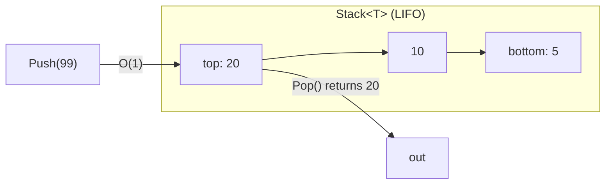
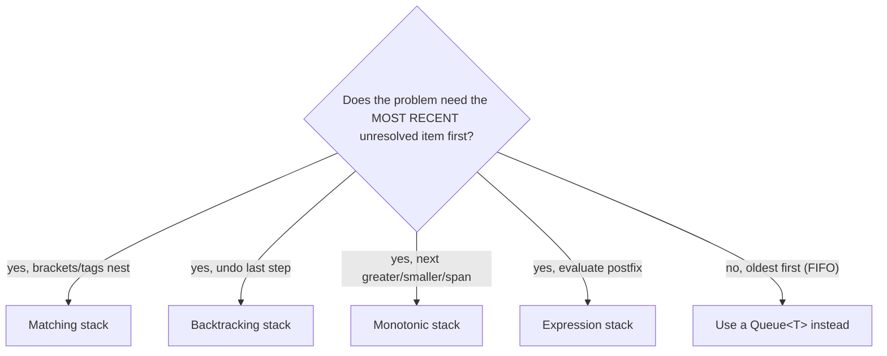
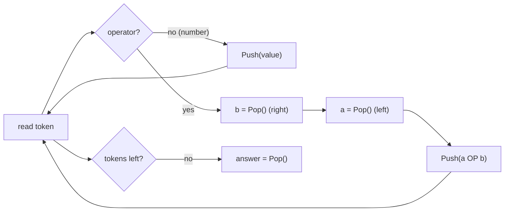
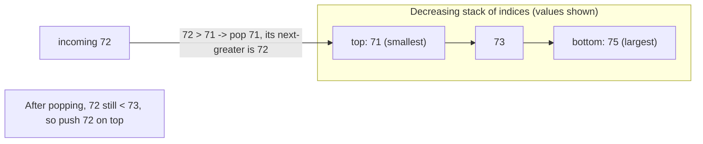
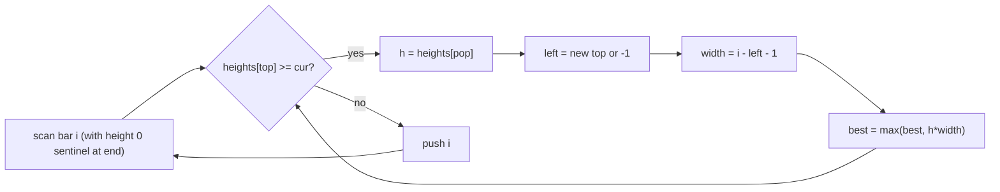
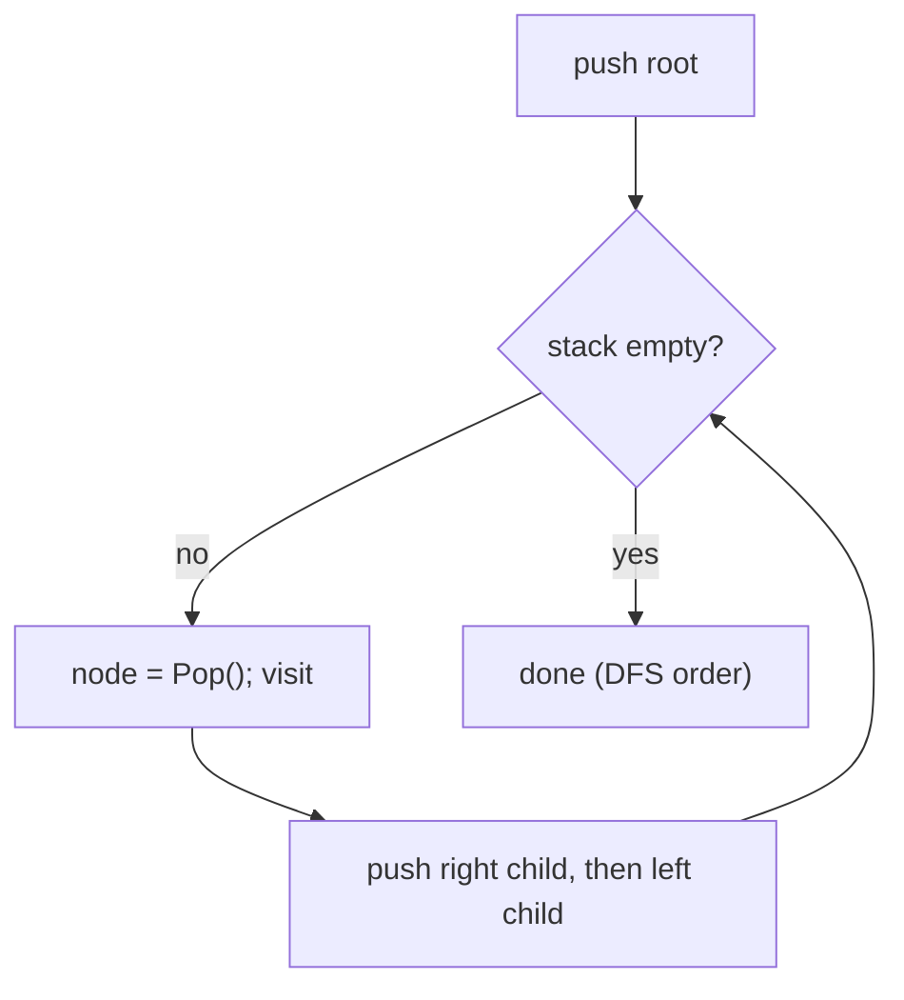

# Stacks & Monotonic Stacks (Reviewer)

A **[stack](algorithms-glossary-reviewer.md#stack "A last-in-first-out collection: you add and remove only at the top.")** is the last-in-first-out (LIFO) container: you push onto the top and pop from the top, both in O(1). It is the right model whenever the *most recently seen* item is the one you must resolve first — matching brackets, undo histories, call frames, parsing expressions, and depth-first traversal all share that "innermost / latest first" shape. If a problem talks about *nesting*, *balancing*, or *backtracking to the last open thing*, a stack is almost always lurking.

The **[monotonic stack](algorithms-glossary-reviewer.md#monotonic-stack "A stack kept in sorted order to find next/previous greater or smaller in O(n).")** is a sharpened version of the same tool: you keep the stack's contents sorted (strictly increasing or decreasing) by maintaining the [invariant](algorithms-glossary-reviewer.md#invariant "A condition that stays true at every step, used to prove correctness.") on every push — before pushing, you pop everything that would violate the order. The act of popping is where the answers fall out: the element being popped has just met the neighbor that resolves its "next greater", "next smaller", or "span" question. Because each element is pushed once and popped at most once, the whole scan is [amortized O(n)](algorithms-glossary-reviewer.md#amortized-analysis "Average cost per operation across a worst-case sequence, not a probability.") even though there is a nested `while` loop. This pattern turns a family of O(n²) [brute-force](algorithms-glossary-reviewer.md#brute-force "Trying every possibility directly; correct but often too slow.") "look right/left until you find a bigger one" problems into a single [linear pass](algorithms-glossary-reviewer.md#linear-time "Work grows in direct proportion to input size, about one unit per element."), and it is one of the highest-leverage tricks to recognize in interviews.

Related: [Algorithm Patterns Index](algorithm-patterns-index-reviewer.md) · [Sliding Window](sliding-window-reviewer.md) · [Linked Lists](linked-lists-reviewer.md) · [Trees & BSTs](trees-and-binary-search-trees-reviewer.md) · [Collections & Big-O](../dotnet/csharp/collections-and-big-o-reviewer.md) · [Glossary](algorithms-glossary-reviewer.md)

## Contents
- [Stack basics and C# usage](#stack-basics-and-c-usage)
- [When a stack models the problem](#when-a-stack-models-the-problem)
- [Matching and nesting: Valid Parentheses](#matching-and-nesting-valid-parentheses)
- [Designing with auxiliary state: Min Stack](#designing-with-auxiliary-state-min-stack)
- [Expression evaluation: Reverse Polish Notation](#expression-evaluation-reverse-polish-notation)
- [Monotonic stack: the core idea](#monotonic-stack-the-core-idea)
- [Next Greater Element and Daily Temperatures](#next-greater-element-and-daily-temperatures)
- [Largest Rectangle in Histogram](#largest-rectangle-in-histogram)
- [Why monotonic stack is amortized O(n)](#why-monotonic-stack-is-amortized-on)
- [Stacks for recursion-to-iteration and DFS](#stacks-for-recursion-to-iteration-and-dfs)
- [Pattern recognition cheat-sheet](#pattern-recognition-cheat-sheet)
- [Interview Q&A](#interview-qa)
- [Rapid-fire round](#rapid-fire-round)
- [Exam-style questions](#exam-style-questions)
- [30-second takeaway](#30-second-takeaway)
- [Quick recall checklist](#quick-recall-checklist)
- [References](#references)

---

## Stack basics and C# usage

The BCL ships `System.Collections.Generic.Stack<T>`, an array-backed LIFO stack. All the core operations are O(1) amortized (`Push` is amortized O(1) because the backing array doubles on growth).

Key points:

- `Push(item)` adds to the top; `Pop()` removes and returns the top; `Peek()` returns the top without removing.
- `Pop()` and `Peek()` **throw `InvalidOperationException` on an empty stack** — always guard with `Count > 0`, or use the `Try*` variants.
- `TryPop(out T item)` and `TryPeek(out T item)` return `false` instead of throwing when empty — cleaner in loops.
- `Count` is the number of elements; `Contains(x)` is O(n) (it scans), so do not use a stack as a membership set.
- A `Stack<T>` is backed by an array, so it has good cache locality — better than a linked-list-based stack for most workloads.
- Enumerating a `Stack<T>` with `foreach` yields elements **top-to-bottom** (LIFO order), which is occasionally surprising.

```csharp
var st = new Stack<int>();
st.Push(10);                 // top -> [10]
st.Push(20);                 // top -> [20, 10]
int top = st.Peek();         // 20, stack unchanged
int popped = st.Pop();       // 20, stack now [10]
if (st.TryPop(out int x))    // x = 10, stack now empty
    Console.WriteLine(x);
bool empty = st.Count == 0;  // true
```

You rarely need a custom stack: a `Stack<T>` covers nearly every interview need, and where you want index access (e.g. monotonic-stack problems that peek the element *below* the top), a `List<T>` used as a stack (`Add`/`RemoveAt(Count-1)` and `list[^1]`) is the idiomatic substitute because it gives O(1) indexing into the interior.



*A `Stack<T>` only ever touches the top: `Push` and `Pop` act on one end, both O(1).*

## When a stack models the problem

A stack is the natural fit when the problem has a **LIFO dependency**: the thing you must deal with next is always the most recently added unresolved item.

Key points:

- **Matching / nesting** — brackets, tags, nested structures. The most recent opener must close first.
- **Backtracking the last action** — undo/redo, browser history, path simplification (`..` pops the last directory).
- **Deferred evaluation** — expression parsing, calculators, the shunting-yard [algorithm](algorithms-glossary-reviewer.md#algorithm "A precise, finite sequence of steps that turns an input into a desired output.").
- **Resolve-on-pop** — monotonic stacks, where popping an element is exactly when its answer becomes known.
- **Explicit [recursion](algorithms-glossary-reviewer.md#recursion "A function solving a problem by calling itself on smaller versions of it.")** — converting a recursive [DFS](algorithms-glossary-reviewer.md#depth-first-search "Explores as far down one branch as possible before backtracking.") into an iterative loop with your own stack to avoid call-stack overflow.



*If the answer to "most recent first?" is no and it is "oldest first," you want a [queue](algorithms-glossary-reviewer.md#queue "A first-in-first-out collection: add at the back, remove from the front."), not a stack.*

## Matching and nesting: Valid Parentheses

[LC](algorithms-glossary-reviewer.md#leetcode "An online platform of coding-interview problems with an automated judge.") 20 — Valid Parentheses: given a string of `()[]{}`, decide if every opener has a correctly-ordered matching closer. This is the canonical "stack models nesting" problem.

Key points:

- Push every **opening** bracket. On a **closing** bracket, the top of the stack must be its matching opener; otherwise the string is invalid.
- Use a `close -> open` [map](algorithms-glossary-reviewer.md#hash-map "Stores key-value pairs and retrieves a value by key in O(1) average time.") so the closer tells you exactly which opener you require.
- Three failure modes: (1) a closer with an empty stack (nothing to match), (2) a closer whose top is the wrong opener, (3) leftover openers at the end (stack not empty).
- **Time O(n), space O(n)** — worst case all openers (`"((((("`), the stack holds them all.

```csharp
public bool IsValid(string s)
{
    var close = new Dictionary<char, char> { [')'] = '(', [']'] = '[', ['}'] = '{' };
    var st = new Stack<char>();
    foreach (char c in s)
    {
        if (close.TryGetValue(c, out char open))
        {
            // c is a closer: top must be its matching opener
            if (st.Count == 0 || st.Pop() != open) return false;
        }
        else
        {
            st.Push(c); // c is an opener
        }
    }
    return st.Count == 0; // any leftover opener => invalid
}
```

```text
s = "([{}])"
 index    0   1   2   3   4   5
          (   [   {   }   ]   )

step  char  action                 stack (bottom..top)
 0     (    push opener            [ (
 1     [    push opener            [ ( [
 2     {    push opener            [ ( [ {
 3     }    closer; pop '{' == '{' [ ( [          match
 4     ]    closer; pop '[' == '[' [ (            match
 5     )    closer; pop '(' == '(' [              match
end          stack empty  ->  VALID (true)
```

*Each opener is pushed; each closer pops and checks the top. Ending empty means every bracket was matched.*

A wrong-match example makes the failure concrete: on `"(]"`, the `(` is pushed, then `]` pops `(` and compares `( != [`, returning `false` immediately.

## Designing with auxiliary state: Min Stack

LC 155 — Min Stack: design a stack supporting `Push`, `Pop`, `Top`, and `GetMin`, **all in O(1)**. The trick is to store the running minimum *alongside* each value so popping cannot lose track of the min.

Key points:

- Naively scanning for the min on each `GetMin` is O(n). To get O(1), store the min-so-far with every element.
- Keep **one stack of pairs** `(value, minSoFar)`. When you push `v`, the new min is `Min(v, currentMin)`. The top pair's `min` is always the current minimum.
- A common alternative is **two stacks** (one of values, one of mins); the paired-stack version uses a single structure and is easy to reason about.
- Every operation is O(1) time; space is O(n) for the n stored pairs.
- `GetMin` is *not* the same as sorting — it only tracks the minimum of the elements currently present, and it correctly recovers the previous min when you pop.

```csharp
public class MinStack
{
    // each entry remembers the minimum of the stack at and below it
    private readonly Stack<(int Value, int Min)> _stack = new();

    public void Push(int val)
    {
        int min = _stack.Count == 0 ? val : Math.Min(val, _stack.Peek().Min);
        _stack.Push((val, min));
    }

    public void Pop() => _stack.Pop();

    public int Top() => _stack.Peek().Value;

    public int GetMin() => _stack.Peek().Min;
}
```

```text
ops: Push(5) Push(3) Push(7) Push(2) Pop() GetMin()

stack of (value, minSoFar), bottom..top:

Push(5)   (5,5)
Push(3)   (5,5) (3,3)
Push(7)   (5,5) (3,3) (7,3)
Push(2)   (5,5) (3,3) (7,3) (2,2)     GetMin -> 2
Pop()     (5,5) (3,3) (7,3)           top (7,3) gone
GetMin()  -> 3                        min correctly restored to 3
```

*Carrying `minSoFar` in each cell means popping the global min (2) instantly restores the prior min (3) — no rescan.*

## Expression evaluation: Reverse Polish Notation

LC 150 — Evaluate Reverse Polish Notation: evaluate a postfix expression like `["2","1","+","3","*"]`. Postfix (RPN) needs no parentheses and no precedence rules, which is exactly why a stack evaluates it in one clean pass.

Key points:

- Scan left to right. Push numbers. On an operator, **pop the two most recent operands**, apply, and push the result.
- **Operand order matters for `-` and `/`**: the first popped is the *right* operand, the second popped is the *left*. Compute `left OP right`.
- At the end exactly one value remains — the answer.
- **Time O(n), space O(n)** for the operand stack.
- LeetCode's RPN division truncates toward zero, which is exactly what C# integer division does, so `a / b` needs no special handling.

```csharp
public int EvalRPN(string[] tokens)
{
    var st = new Stack<int>();
    foreach (string tok in tokens)
    {
        switch (tok)
        {
            case "+": case "-": case "*": case "/":
                int b = st.Pop();           // right operand (popped first)
                int a = st.Pop();           // left operand
                st.Push(tok switch
                {
                    "+" => a + b,
                    "-" => a - b,
                    "*" => a * b,
                    _   => a / b,           // C# truncates toward zero
                });
                break;
            default:
                st.Push(int.Parse(tok));
                break;
        }
    }
    return st.Pop();
}
```

For `["2","1","+","3","*"]`: push 2, push 1, `+` pops 1 and 2 → push 3, push 3, `*` pops 3 and 3 → push 9. Result **9**. For `["4","13","5","/","+"]`: push 4, push 13, push 5, `/` pops 5 (right) and 13 (left) → `13 / 5 = 2`, push 2, `+` pops 2 and 4 → push 6. Result **6**.



*Numbers are pushed; an operator consumes the top two operands as left OP right and pushes the result.*

## Monotonic stack: the core idea

A **monotonic stack** keeps its contents in sorted order — either strictly increasing or strictly decreasing from bottom to top. You enforce the order on every push: before pushing the new element, pop every element that breaks the invariant. The popped elements are not discarded uselessly; popping is the moment their answer is determined.

Key points:

- **Decreasing stack** (top is the smallest) answers **"next greater"** questions: when an incoming value is larger than the top, that incoming value *is* the next greater element for the top, so you pop and record.
- **Increasing stack** (top is the largest) answers **"next smaller"** questions symmetrically.
- Store **indices**, not values, when you also need distances (e.g. "how many days until warmer"). The [index](algorithms-glossary-reviewer.md#index "The integer position of an element; 0-indexed starts at 0, 1-indexed at 1.") lets you compute `i - poppedIndex`.
- Scan direction picks left-vs-right: a left-to-right scan resolves *next* (to the right); a right-to-left scan resolves *previous* (to the left).
- The element left on top after processing position `i` is the nearest unresolved boundary — that is why the structure also answers "previous greater/smaller" for free.



*A decreasing stack: any incoming value bigger than the top resolves that top's "next greater" and pops it.*

## Next Greater Element and Daily Temperatures

These two problems are the same monotonic-stack engine with a different read-out.

LC 496 — Next Greater Element I: for each value in `nums1` (a subset of `nums2`), find the first greater value to its right in `nums2`, or `-1`. Build a `value -> nextGreater` map by running a **decreasing stack over `nums2`**, then answer each query in O(1).

Key points:

- Scan `nums2` left to right with a decreasing stack of **values** (all distinct here, so values are safe as keys).
- When the current value `x` exceeds the stack top, the top's next-greater is `x`: pop and record `nge[top] = x`.
- Anything still on the stack at the end has no greater element to its right → defaults to `-1`.
- **Time O(n2 + n1), space O(n2)** for the stack and map.

```csharp
public int[] NextGreaterElement(int[] nums1, int[] nums2)
{
    var nge = new Dictionary<int, int>();
    var st = new Stack<int>();                 // decreasing stack of values
    foreach (int x in nums2)
    {
        while (st.Count > 0 && x > st.Peek())
            nge[st.Pop()] = x;                 // x is the next greater for the popped value
        st.Push(x);
    }
    var res = new int[nums1.Length];
    for (int i = 0; i < nums1.Length; i++)
        res[i] = nge.GetValueOrDefault(nums1[i], -1);
    return res;
}
```

For `nums1 = [4,1,2]`, `nums2 = [1,3,4,2]`: scanning `nums2`, `3` resolves `1`'s next-greater (3), `4` resolves `3`'s (4); `4` and `2` never get a greater element. So `nge = {1:3, 3:4}`, and the answer for `[4,1,2]` is `[-1, 3, -1]`.

LC 739 — Daily Temperatures: given daily temps, for each day output how many days until a warmer one (0 if none). Same decreasing stack, but store **indices** so you can compute the distance `i - j`.

Key points:

- Keep a decreasing stack of **indices**. The current temp `t[i]` warmer than `t[stack.top]` resolves that day: `ans[j] = i - j`.
- Days still on the stack at the end never see a warmer day → stay `0` (the default array value).
- **Time O(n), space O(n)** — each index is pushed and popped at most once.

```csharp
public int[] DailyTemperatures(int[] temperatures)
{
    int n = temperatures.Length;
    var ans = new int[n];                      // defaults to 0
    var st = new Stack<int>();                 // decreasing stack of indices
    for (int i = 0; i < n; i++)
    {
        while (st.Count > 0 && temperatures[i] > temperatures[st.Peek()])
        {
            int j = st.Pop();
            ans[j] = i - j;                    // days waited for a warmer temp
        }
        st.Push(i);
    }
    return ans;
}
```

```text
temperatures = [73, 74, 75, 71, 69, 72, 76, 73]
index           0   1   2   3   4   5   6   7

i  temp  pops (index:waited)            stack(idx, bottom..top)   ans so far
0  73    -                              [0]                       [0,0,0,0,0,0,0,0]
1  74    pop 0 -> ans[0]=1-0=1          [1]                       [1,0,0,0,0,0,0,0]
2  75    pop 1 -> ans[1]=2-1=1          [2]                       [1,1,0,0,0,0,0,0]
3  71    -                              [2,3]                     [1,1,0,0,0,0,0,0]
4  69    -                              [2,3,4]                   [1,1,0,0,0,0,0,0]
5  72    pop 4 -> ans[4]=5-4=1          [2,3,5]                   [1,1,0,0,1,0,0,0]
         pop 3 -> ans[3]=5-3=2          [2,5]                     [1,1,0,2,1,0,0,0]
6  76    pop 5 -> ans[5]=6-5=1          [2,6]                     [1,1,0,2,1,1,0,0]
         pop 2 -> ans[2]=6-2=4          [6]                       [1,1,4,2,1,1,0,0]
7  73    -                              [6,7]                     [1,1,4,2,1,1,0,0]
end  indices 6,7 never warmed -> stay 0  ans = [1,1,4,2,1,1,0,0]
```

*Each day's answer is filled the moment a warmer day pops it; days 6 and 7 (76, 73) never warm and remain 0.*

## Largest Rectangle in Histogram

LC 84 — Largest Rectangle in Histogram: bars of given heights, all width 1; find the area of the largest axis-aligned rectangle. The [monotonic](algorithms-glossary-reviewer.md#monotonic "Consistently moving one direction; never decreasing or never increasing.") (increasing) stack finds, for each bar, the nearest shorter bar on each side — the bar's rectangle extends between those two boundaries.

Key points:

- Keep an **increasing** stack of **indices**. When the current bar is shorter than the stack top, the top bar cannot extend further right — pop it and compute its rectangle.
- On popping height `h` at the top: the right boundary is the current index `i`; the left boundary is the new top after popping (or `-1` if empty). **Width = `i - left - 1`**, area = `h * width`.
- Append a **sentinel bar of height 0** at the end (loop to `i == n`) so every remaining bar is forced to pop and be measured.
- **Time O(n), space O(n)** — each index pushed and popped once.
- The subtle part is the width: it is *not* `i - poppedIndex`; it is the full span strictly between the left boundary and `i`, which is why the formula uses the element *below* the popped one.

```csharp
public int LargestRectangleArea(int[] heights)
{
    int n = heights.Length, best = 0;
    var st = new Stack<int>();                 // increasing stack of indices
    for (int i = 0; i <= n; i++)
    {
        int cur = (i == n) ? 0 : heights[i];   // sentinel 0 flushes the stack
        while (st.Count > 0 && heights[st.Peek()] >= cur)
        {
            int h = heights[st.Pop()];
            int left = st.Count == 0 ? -1 : st.Peek();
            int width = i - left - 1;          // span strictly between boundaries
            best = Math.Max(best, h * width);
        }
        st.Push(i);
    }
    return best;
}
```

```text
heights = [2, 1, 5, 6, 2, 3]   (sentinel 0 appended at index 6)
index      0  1  2  3  4  5   (6)

i  cur  pops (h, left, width=i-left-1, area)         stack(idx) best
0   2   -                                            [0]        0
1   1   pop h=2 left=-1 width=1-(-1)-1=1 area=2      [1]        2
2   5   -                                            [1,2]      2
3   6   -                                            [1,2,3]    2
4   2   pop h=6 left=2 width=4-2-1=1 area=6          [1,2]      6
        pop h=5 left=1 width=4-1-1=2 area=10         [1,4]      10
5   3   -                                            [1,4,5]    10
6   0   pop h=3 left=4 width=6-4-1=1 area=3          [1,4]      10
        pop h=2 left=1 width=6-1-1=4 area=8          [1]        10
        pop h=1 left=-1 width=6-(-1)-1=6 area=6      []         10
end  largest area = 10  (bars 5 and 6 -> height 5 x width 2)
```

*Each bar's rectangle is measured when a shorter bar pops it; the winner is height 5 over width 2 (the `5,6` pair) for area 10.*



*Popping a taller bar when a shorter one arrives is exactly when that bar's maximal rectangle is known.*

## Why monotonic stack is amortized O(n)

The nested `while` loop inside a `for` loop looks like O(n²), but it is not.

Key points:

- Each index is **pushed exactly once** and **popped at most once** across the entire run.
- Total push operations ≤ n and total pop operations ≤ n, so the inner `while` does at most n pops *summed over all iterations* — not per iteration.
- The work is therefore **O(n) total**, plus O(n) extra space for the stack. This is **amortized analysis**: a single iteration may pop many elements, but those pops are "charged" to the pushes that put them there.
- The same accounting explains why [two-pointer](algorithms-glossary-reviewer.md#two-pointers "Two index variables moving through a sequence to solve it in one linear pass.") and [sliding-window](algorithms-glossary-reviewer.md#sliding-window "A contiguous range you expand and shrink to track a property in one pass.") scans are linear — bounded total pointer movement, not bounded movement per step.

```text
accounting for Daily Temperatures (n = 8):
  pushes: index 0..7  -> 8 total
  pops:   each index popped at most once -> <= 8 total
  inner while-loop iterations summed over the whole run <= 8
  => O(n) work even though one i (i=5, i=6) popped two elements
```

*A heavy iteration that pops many items is balanced by earlier light iterations — the sum stays linear.*

## Stacks for recursion-to-iteration and DFS

Every recursive algorithm runs on the language's **[call stack](algorithms-glossary-reviewer.md#call-stack "Memory tracking active function calls; each call pushes a frame, popped on return.")**; making that stack explicit converts recursion to iteration. This is the standard way to do depth-first search without risking a `StackOverflowException` on deep inputs.

Key points:

- Iterative DFS uses an explicit `Stack<T>` of nodes (or frames): pop a [node](algorithms-glossary-reviewer.md#node "A container in a linked structure holding a value plus references to neighbors."), process it, push its children. This mirrors the recursive call order while keeping the depth on the heap, not the call stack.
- A stack gives **DFS**; swapping it for a `Queue<T>` gives **[BFS](algorithms-glossary-reviewer.md#breadth-first-search "Explores a structure level by level, visiting nearer nodes before farther ones.")**. The container choice *is* the [traversal](algorithms-glossary-reviewer.md#tree-traversal "Visiting every node of a tree in a systematic order.") order.
- For [trees](algorithms-glossary-reviewer.md#tree "A hierarchy of nodes with one root, no cycles, and one parent per node.") and [graphs](algorithms-glossary-reviewer.md#graph "Vertices connected by edges, modeling arbitrary relationships, possibly cyclic."), this is the bridge between the recursive solutions in [Trees & BSTs](trees-and-binary-search-trees-reviewer.md) and the iterative ones in [Graphs](graphs-reviewer.md).
- Watch push order: to visit children left-to-right with a stack, push them **right-to-left** (the last pushed is popped first).

```csharp
// Iterative pre-order DFS over a binary tree using an explicit stack.
public IList<int> PreorderDFS(TreeNode root)
{
    var result = new List<int>();
    if (root is null) return result;
    var st = new Stack<TreeNode>();
    st.Push(root);
    while (st.Count > 0)
    {
        TreeNode node = st.Pop();
        result.Add(node.val);
        // push right first so left is processed first (LIFO)
        if (node.right is not null) st.Push(node.right);
        if (node.left  is not null) st.Push(node.left);
    }
    return result;
}
```

This iterative-DFS pattern underlies `depth-first-search` in the `leet-practice` repo — the explicit-stack version of tree and graph traversal lives there as the iterative counterpart to the recursive solutions.



*An explicit stack reproduces recursive DFS iteratively; using a queue here would instead produce BFS.*

## Pattern recognition cheat-sheet

| Problem signal | Structure | Stack direction | What pop resolves |
| --- | --- | --- | --- |
| Balanced brackets / nesting | plain stack | n/a | matching opener for a closer |
| Track running min/max in O(1) | augmented stack | n/a | min/max carried per element |
| Evaluate postfix (RPN) | operand stack | n/a | apply operator to top two |
| Next **greater** to the right | monotonic | **decreasing** | popped element's next-greater |
| Next **smaller** to the right | monotonic | **increasing** | popped element's next-smaller |
| Previous greater/smaller | monotonic (same) | scan right-to-left | element left below the top |
| Span / distance to boundary | monotonic of **indices** | per question | `i - poppedIndex` (or `i - left - 1`) |
| Largest rectangle / max area | monotonic of indices | **increasing** | bar's rectangle on pop |
| Iterative DFS | plain stack of nodes | n/a | next node to expand |

*Decreasing stack ⇒ next greater; increasing stack ⇒ next smaller. Store indices when you need distances.*

## Interview Q&A

### Stack fundamentals

Q: What is the time complexity of `Push`, `Pop`, and `Peek` on `Stack<T>`?
A: `Pop` and `Peek` are O(1). `Push` is O(1) amortized — the backing array doubles when full, so an occasional copy is O(n) but spread across all pushes the average is O(1).

Q: What happens if you call `Pop()` on an empty `Stack<T>`?
A: It throws `InvalidOperationException`. Guard with `Count > 0`, or use `TryPop(out var x)` which returns `false` instead of throwing.

Q: In what order does `foreach` enumerate a `Stack<T>`?
A: Top to bottom — LIFO order — not insertion order. That trips people up when printing a stack for debugging.

Q: When would you use a `List<T>` as a stack instead of `Stack<T>`?
A: When the monotonic-stack logic needs to peek the element *below* the top, you want O(1) index access into the interior. `List<T>` with `Add` / `RemoveAt(Count-1)` / `list[^1]` gives that; `Stack<T>` only exposes the top.

### Matching and design

Q: In Valid Parentheses, what are the three ways the string can be invalid?
A: (1) a closer arrives with an empty stack (nothing to match), (2) a closer's matching opener is not on top (wrong nesting), (3) the stack is non-empty at the end (unclosed openers).

Q: How does Min Stack get `GetMin` down to O(1)?
A: Store the running minimum alongside each value (a stack of `(value, minSoFar)` pairs). The top pair's `min` is always the current minimum, and popping naturally restores the previous min — no rescan.

Q: In RPN, why does operand order matter for `-` and `/`?
A: The first value popped is the right operand and the second is the left, so you must compute `left OP right`. Subtraction and division are not commutative, so swapping them gives the wrong answer (e.g. `13 / 5`, not `5 / 13`).

### Monotonic stack

Q: Decreasing vs increasing monotonic stack — which answers "next greater"?
A: A **decreasing** stack (top is smallest). When an incoming value exceeds the top, that incoming value is the top's next-greater, so you pop and record. An increasing stack answers "next smaller."

Q: Why store indices instead of values in Daily Temperatures?
A: The answer is a *distance* (days waited), so you need `i - poppedIndex`. Indices let you both look up the temperature (`temperatures[idx]`) and compute the gap.

Q: Why is the monotonic-stack scan O(n) despite the nested `while`?
A: Each element is pushed once and popped at most once, so total pops across the whole run are ≤ n. The inner loop's work is bounded by the number of pushes, not repeated per outer iteration — amortized O(n).

Q: In Largest Rectangle, why is the width `i - left - 1` and not `i - poppedIndex`?
A: The popped bar's rectangle spans every bar strictly between its nearest shorter bar on the left (`left`, the element now on top, or `-1`) and the current shorter bar at `i`. That open interval has width `i - left - 1`.

Q: Why append a sentinel height of 0 in Largest Rectangle?
A: To force every bar still on the stack at the end to pop and be measured. Without it, bars that never meet a shorter bar to their right are never evaluated.

## Rapid-fire round

- Stack discipline → **LIFO (last in, first out).**
- `Pop`/`Peek` on empty `Stack<T>` → **throws `InvalidOperationException`; use `TryPop`/`TryPeek`.**
- `Push` complexity → **O(1) amortized (array doubles).**
- `foreach` over `Stack<T>` yields → **top-to-bottom order.**
- Valid Parentheses time/space → **O(n) / O(n).**
- Min Stack `GetMin` → **O(1) by storing `minSoFar` per element.**
- RPN first pop is the → **right operand.**
- C# integer division truncates → **toward zero (matches LC RPN).**
- "Next greater to the right" → **decreasing monotonic stack.**
- "Next smaller to the right" → **increasing monotonic stack.**
- Need distances in a monotonic stack → **store indices, not values.**
- Daily Temperatures default answer → **0 (no warmer day).**
- Monotonic-stack total work → **amortized O(n) — each index pushed/popped once.**
- Largest Rectangle width on pop → **`i - left - 1`.**
- Largest Rectangle flush trick → **append a sentinel bar of height 0.**
- Explicit stack vs queue for traversal → **stack = DFS, queue = BFS.**
- Push children for left-first DFS → **right child first, then left.**

## Exam-style questions

1. What does this print, and what is the time complexity?

```csharp
var st = new Stack<int>();
foreach (int x in new[] { 3, 1, 4, 1, 5 }) st.Push(x);
int sum = 0;
while (st.TryPop(out int v)) sum += v;
Console.WriteLine(sum);
```

**Answer:** `14`. It pushes all five values then pops them all, summing `3+1+4+1+5 = 14` (order does not affect a sum). Each push and pop is O(1), so the whole thing is **O(n)** with O(n) stack space.

2. Trace this on `temperatures = [30, 40, 50, 60]`. What is the output array?

```csharp
public int[] DailyTemperatures(int[] t)
{
    var ans = new int[t.Length];
    var st = new Stack<int>();
    for (int i = 0; i < t.Length; i++)
    {
        while (st.Count > 0 && t[i] > t[st.Peek()])
            { int j = st.Pop(); ans[j] = i - j; }
        st.Push(i);
    }
    return ans;
}
```

**Answer:** `[1, 1, 1, 0]`. Each day is strictly warmer than the previous, so every index is popped by the very next day (`ans[j] = i - j = 1`), and the last day (60) has no warmer day, so it stays `0`. Time **O(n)**.

3. What value does this RPN evaluation return?

```csharp
string[] tokens = { "10", "6", "9", "3", "+", "-11", "*", "/", "*", "17", "+", "5", "+" };
```

**Answer:** `22`. This is the standard LC 150 example. Step through: `9 3 +` → 12; `12 -11 *` → -132; `6 / (-132)` → 0 (C# truncation toward zero of `6 / -132`); `10 * 0` → 0; `0 + 17` → 17; `17 + 5` → **22**.

4. Identify the bug: this Largest Rectangle attempt computes the wrong width.

```csharp
while (st.Count > 0 && heights[st.Peek()] >= cur)
{
    int idx = st.Pop();
    int width = i - idx;           // BUG
    best = Math.Max(best, heights[idx] * width);
}
```

**Answer:** The width must be `i - left - 1` where `left` is the index now on top of the stack after the pop (or `-1` if the stack is empty), because the rectangle spans the open interval between the two nearest shorter bars — not just from the popped index to `i`. Using `i - idx` ignores the bars to the left of `idx` that are at least as tall and undercounts the width. The fix is `int left = st.Count == 0 ? -1 : st.Peek(); int width = i - left - 1;`.

5. Why is a decreasing (not increasing) monotonic stack used for Next Greater Element?

```csharp
while (st.Count > 0 && x > st.Peek())
    nge[st.Pop()] = x;
st.Push(x);
```

**Answer:** The stack holds elements still waiting for a greater value to their right, kept in decreasing order from bottom to top. When `x` is larger than the top, `x` is precisely the next-greater for that top, so it pops and records. If the stack were increasing, the top would already be the largest and the incoming larger value could not resolve anything below it correctly. Each element is pushed once and popped once → **O(n)**.

## 30-second takeaway

> A **stack** is LIFO: reach for it whenever the most recently seen unresolved item must be handled
> first — bracket matching, undo, expression evaluation, and iterative DFS. In C#, `Stack<T>` gives
> O(1) `Push`/`Pop`/`Peek` (use `TryPop` to avoid the empty-stack throw). The **monotonic stack** keeps
> contents strictly increasing or decreasing; the *pop* is where answers fall out. A **decreasing**
> stack answers "next greater," an **increasing** stack answers "next smaller," and storing **indices**
> lets you compute spans and distances. Despite a nested `while`, each index is pushed and popped at
> most once, so the scan is **amortized O(n)** — turning a whole family of O(n²) "scan right for a bigger
> one" problems into a single linear pass.

## Quick recall checklist

- `Stack<T>` → **O(1)** `Push` (amortized) / `Pop` / `Peek`; `Pop`/`Peek` **throw when empty** — prefer `TryPop`/`TryPeek`.
- `foreach` over a stack enumerates **top-to-bottom**, not insertion order.
- Valid Parentheses (LC 20) → push openers, pop-and-check on closers via a `close -> open` map, end **empty** → **O(n)/O(n)**.
- Min Stack (LC 155) → store `(value, minSoFar)` per element → **O(1) `GetMin`**.
- RPN (LC 150) → push numbers, operator pops two as **left OP right**; C# `/` truncates toward zero.
- Monotonic stack: **decreasing ⇒ next greater**, **increasing ⇒ next smaller**.
- Daily Temperatures (LC 739) and Next Greater Element I (LC 496) → decreasing stack; store **indices** when the answer is a distance.
- Largest Rectangle (LC 84) → increasing stack of indices, **width = `i - left - 1`**, append a **height-0 sentinel** to flush.
- Monotonic scan is **amortized O(n)** — each index pushed once, popped at most once.
- Explicit stack converts recursion to iteration: **stack ⇒ DFS**, **queue ⇒ BFS**; push children right-then-left for left-first order.

## References

- Wikipedia — [Stack (abstract data type)](https://en.wikipedia.org/wiki/Stack_(abstract_data_type)).
- Wikipedia — [Reverse Polish notation](https://en.wikipedia.org/wiki/Reverse_Polish_notation).
- Wikipedia — [Amortized analysis](https://en.wikipedia.org/wiki/Amortized_analysis).
- Wikipedia — [Depth-first search](https://en.wikipedia.org/wiki/Depth-first_search).
- Microsoft Learn — [`Stack<T>` Class](https://learn.microsoft.com/en-us/dotnet/api/system.collections.generic.stack-1).
- Microsoft Learn — [`Stack<T>.TryPop` Method](https://learn.microsoft.com/en-us/dotnet/api/system.collections.generic.stack-1.trypop).
- Microsoft Learn — [Integer numeric types (division truncation)](https://learn.microsoft.com/en-us/dotnet/csharp/language-reference/builtin-types/integral-numeric-types).
- NeetCode — [Roadmap](https://neetcode.io/roadmap) (Stack section).
- LeetCode — [Study Plans](https://leetcode.com/studyplan/).
