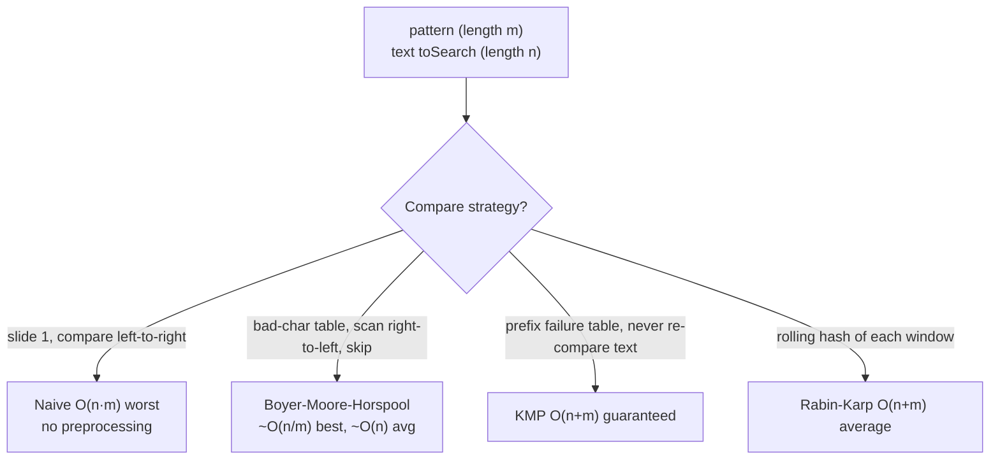
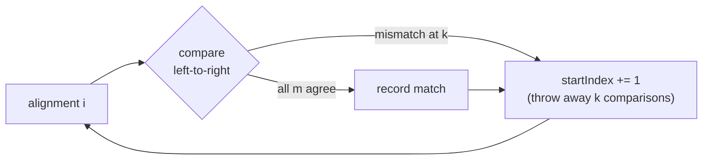
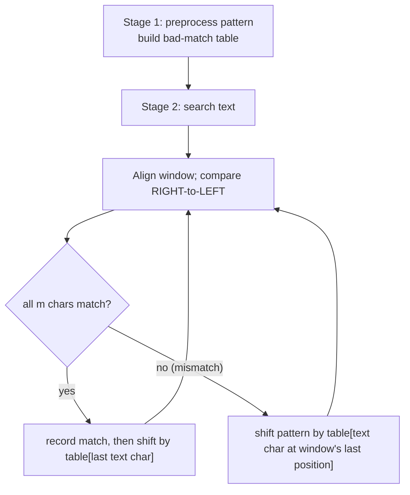
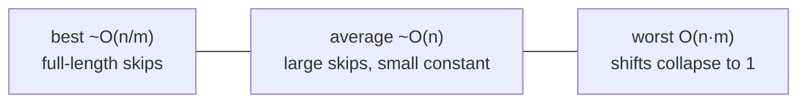
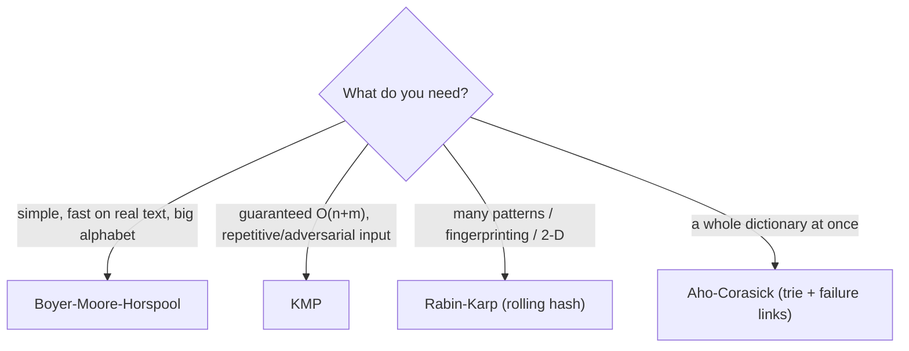

# String Searching Algorithms (Reviewer)

String searching — also called **[substring](algorithms-glossary-reviewer.md#subarray-subsequence-and-substring "A contiguous slice of a string; a subsequence keeps order but may skip characters.") search** or **pattern matching** — asks the most literal
question in text processing: where, if anywhere, does a short [pattern](algorithms-glossary-reviewer.md#pattern "The short string you are looking for inside a larger text.") string of length `m` occur inside a
longer `toSearch` text of length `n`? Every text editor's Ctrl-F, every `grep`, every DNA-motif scan,
and every `String.IndexOf` call is solving exactly this problem. The naive answer — slide the pattern
across every starting position and compare — is correct and trivially obvious, but its repeated
character comparisons make it **[O(n·m)](algorithms-glossary-reviewer.md#quadratic-time "Work grows like the product of two sizes, here a nested compare over text and pattern.")** in the worst case. The interesting algorithms all earn their keep
by *skipping* — using information learned from a mismatch to jump the pattern forward by more than one
position instead of restarting one character over.

This reviewer models the problem the way the source slides do: an `IStringSearchAlgorithm` whose
`Search(pattern, toSearch)` returns **all** matches as `ISearchMatch` objects carrying a `Start` index
and a `Length`. It builds the **naive ([brute-force](algorithms-glossary-reviewer.md#brute-force "Try every possibility directly with no cleverness — correct but often slow.")) scan** first, proves its cost, then develops
**[Boyer-Moore-Horspool](algorithms-glossary-reviewer.md#boyer-moore "A fast substring search that skips ahead using a bad-character table, scanning right-to-left.")** (BMH) — the practical, easy-to-implement member of the Boyer-Moore family —
including how its **bad-character skip table** is built (`table[pattern[i]] = pattern.Length - i - 1`)
and used to leap ahead on a mismatch while scanning the window **right-to-left**. A complexity table
then places BMH among its cousins **[KMP](algorithms-glossary-reviewer.md#kmp "Knuth-Morris-Pratt: linear-time search using a prefix-function failure table.")** (guaranteed [O(n+m)](algorithms-glossary-reviewer.md#linear-time "Work grows in direct proportion to input size, about one unit per element.")) and **[Rabin-Karp](algorithms-glossary-reviewer.md#rabin-karp "Substring search using a rolling hash to compare windows in O(1) amortized.")** (rolling hash, O(n+m)
average), so you know exactly where Horspool sits and when to reach for something else.

Related: [Algorithm Patterns Index](algorithm-patterns-index-reviewer.md) · [Tries](tries-reviewer.md) · [Sliding Window](sliding-window-reviewer.md) · [Two Pointers](two-pointers-reviewer.md) · [Hash Tables](hash-tables-reviewer.md) · [Glossary](algorithms-glossary-reviewer.md)

## Contents
- [The substring-search problem](#the-substring-search-problem)
- [The interface model: matches, Start, Length](#the-interface-model-matches-start-length)
- [Naive (brute-force) search](#naive-brute-force-search)
- [Naive search complexity](#naive-search-complexity)
- [Boyer-Moore-Horspool: the idea](#boyer-moore-horspool-the-idea)
- [Building the bad-match (bad-character) table](#building-the-bad-match-bad-character-table)
- [The BMH search loop](#the-bmh-search-loop)
- [Worked example: searching for TRUTH](#worked-example-searching-for-truth)
- [BMH complexity](#bmh-complexity)
- [The broader family: KMP and Rabin-Karp](#the-broader-family-kmp-and-rabin-karp)
- [Complexity comparison table](#complexity-comparison-table)
- [When to use which](#when-to-use-which)
- [Interview Q&A](#interview-qa)
- [Rapid-fire round](#rapid-fire-round)
- [Exam-style questions](#exam-style-questions)
- [30-second takeaway](#30-second-takeaway)
- [Quick recall checklist](#quick-recall-checklist)
- [References](#references)

---

## The substring-search problem

Key points:

- **Input:** a `pattern` of length `m` and a `toSearch` text of length `n`, usually with `m <= n`.
  **Output:** every starting index in `toSearch` where the pattern occurs (or just the first, or a
  boolean, depending on the API). The slide model returns **all** occurrences.
- A naive solution tries each of the `n - m + 1` candidate alignments and, at each, compares up to `m`
  characters. The win in better algorithms comes entirely from **comparing fewer characters per
  alignment and skipping alignments that cannot possibly match**.
- The problem is distinct from **fuzzy/approximate** matching (edit distance), **regex** matching, and
  **multi-pattern** matching (Aho-Corasick, or a [trie](tries-reviewer.md) of patterns). This reviewer covers exact
  single-pattern search.
- It is closely related to the **[sliding window](sliding-window-reviewer.md)** idea — the pattern is a fixed-width window
  dragged across the text — and to **[two pointers](two-pointers-reviewer.md)** (one walking the text, one the pattern).



*All four answer the same question; they differ only in how much work they avoid per alignment.*

## The interface model: matches, Start, Length

The source slides factor every algorithm behind a common interface so callers are decoupled from the
strategy. This is the [Strategy pattern](algorithms-glossary-reviewer.md#strategy-pattern "Encapsulate interchangeable algorithms behind one interface so callers stay decoupled.") applied to search.

Key points:

- **`IStringSearchAlgorithm`** exposes a single method `Search(pattern, toSearch)` returning
  `IEnumerable<ISearchMatch>` — lazily yielding each occurrence so a caller can stop early.
- **`ISearchMatch`** carries `Start` (the index in `toSearch` where the match begins) and `Length`
  (the matched length, which equals `pattern.Length` for exact search but is kept general). A search
  for `"is"` in a paragraph returns matches at `Start = 44, 64, 92, 131`, each with `Length = 2`.
- Returning matches as an **enumeration** (yield) matters: a "find next" UI or a `replace-all` loop
  consumes them one at a time, never materializing the whole list unless needed.

```csharp
public interface IStringSearchAlgorithm
{
    IEnumerable<ISearchMatch> Search(string pattern, string toSearch);
}

public interface ISearchMatch
{
    int Start { get; }
    int Length { get; }
}

// A trivial value carrier for a single match.
public sealed class SearchMatch : ISearchMatch
{
    public SearchMatch(int start, int length) { Start = start; Length = length; }
    public int Start { get; }
    public int Length { get; }
}
```

```csharp
// Example usage: enumerate every occurrence of "fox".
string pattern = "fox";
string toSearch = "The quick brown fox jumps over the lazy dog";
foreach (ISearchMatch match in algorithm.Search(pattern, toSearch))
{
    Console.WriteLine($"match at {match.Start}, length {match.Length}");
    // -> match at 16, length 3
}
```

## Naive (brute-force) search

The naive scan is the algorithm everyone writes the first time: for every starting index in the text,
compare the pattern character by character; if all `m` characters agree, record a match.

Key points:

- Outer loop walks `startIndex` from `0` across the text. An inner loop matches `pattern[matchCount]`
  against `toSearch[startIndex + matchCount]`, advancing `matchCount` while characters agree.
- When `matchCount == pattern.Length`, every character agreed — a **match starting at `startIndex`**.
- On the **first mismatch** the inner loop stops, the outer loop advances `startIndex` by just **one**,
  and matching restarts from the beginning of the pattern. That "advance by one, recompare from scratch"
  is exactly the inefficiency the smarter algorithms remove.
- **No preprocessing**: it inspects nothing about the pattern in advance. That makes it the right tool
  for tiny inputs and one-shot searches where building a table would cost more than it saves.

```csharp
public sealed class NaiveSearch : IStringSearchAlgorithm
{
    public IEnumerable<ISearchMatch> Search(string pattern, string toSearch)
    {
        if (string.IsNullOrEmpty(pattern)) yield break;

        // Last index where the pattern can still fit entirely.
        int last = toSearch.Length - pattern.Length;
        for (int startIndex = 0; startIndex <= last; startIndex++)
        {
            int matchCount = 0;
            // Advance while the aligned characters keep agreeing.
            while (matchCount < pattern.Length &&
                   toSearch[startIndex + matchCount] == pattern[matchCount])
            {
                matchCount++;
                if (matchCount == pattern.Length)
                    yield return new SearchMatch(startIndex, pattern.Length);
            }
            // On any mismatch, the outer loop simply slides forward by one.
        }
    }
}
```

```text
toSearch = "THE CAT CHASED A DOG"     pattern = "AT"
            ^ slide the pattern one position at a time, comparing left-to-right

 startIndex 0: 'T' vs 'A'  mismatch  -> slide
 startIndex 1: 'H' vs 'A'  mismatch  -> slide
 startIndex 2: 'E' vs 'A'  mismatch  -> slide
 startIndex 3: ' ' vs 'A'  mismatch  -> slide
 startIndex 4: 'C' vs 'A'  mismatch  -> slide
 startIndex 5: 'A' vs 'A'  match, 'T' vs 'T'  match  -> MATCH at index 5
 ...continue sliding by one to find any further "AT"...
```

*The pattern shifts by a single position after every alignment, matching left-to-right — the textbook brute force.*

## Naive search complexity

Key points:

- **[Worst case](algorithms-glossary-reviewer.md#best-average-and-worst-case "Three input scenarios for analyzing running time: luckiest, typical, and most adversarial.") O(n·m).** Pathological inputs like `toSearch = "AAAA...AAB"`, `pattern = "AAAB"` force
  the inner loop to compare nearly all of the pattern at every one of the `~n` alignments before
  mismatching on the last character — `n` alignments × `m` comparisons.
- **Average / typical O(n + m)** (often quoted simply as roughly O(n)). On natural text mismatches
  usually happen on the first or second character, so the inner loop rarely runs long; the expected
  number of comparisons per alignment is small and constant. The slides phrase this as **O(n+m) average,
  O(nm) worst**.
- **Best case O(n).** If the very first character mismatches at almost every alignment, each alignment
  costs one comparison.
- **Space O(1)** — no tables, no [recursion](algorithms-glossary-reviewer.md#recursion "A function that calls itself on smaller inputs until a base case."). **Preprocessing: none.**
- Because the constants are tiny and there is nothing to build, naive search frequently *beats* fancier
  algorithms on **short patterns and short texts** — which is why `String.IndexOf`-style routines
  special-case small inputs.



*The discarded partial comparisons on each mismatch are the wasted work that Boyer-Moore-Horspool reclaims.*

## Boyer-Moore-Horspool: the idea

Boyer-Moore-Horspool is a simplification of the full Boyer-Moore algorithm that keeps only its most
powerful, easiest-to-implement heuristic: the **bad-character rule**. It is a **two-stage** algorithm.

Key points:

- **Stage 1 (preprocess the pattern):** build a **bad-match table** mapping each character to how far
  the pattern can safely shift if that character causes a mismatch.
- **Stage 2 (search):** align the pattern with the text and compare **right-to-left** — from the
  pattern's last character back toward its first. On a mismatch (or even a full match), consult the
  table using the **text character currently aligned with the pattern's last position**, and shift the
  whole pattern ahead by that amount.
- Scanning **right-to-left** is the crucial twist: a mismatch near the end of the pattern, combined
  with a text character that does not appear in the pattern, lets BMH skip a distance up to the entire
  pattern length `m` in a single step — it never even looks at the characters it leaps over.
- The longer the pattern (and the larger the alphabet), the bigger the average skips, so **BMH gets
  faster as the pattern grows** — the opposite of naive search. The slides put it: "the larger the bad
  match table, the better the performance."



*Two stages: build the skip table once, then slide-and-skip across the text scanning each window backwards.*

## Building the bad-match (bad-character) table

Key points:

- The table answers: "if alignment fails, how far can I shift so the **mismatched text character** lines
  up with its **last** occurrence in the pattern?" For a character `c` at pattern index `i`, the safe
  shift is `pattern.Length - i - 1` — the distance from `i` to the pattern's last index.
- **Iterate `i` from `0` to `pattern.Length - 2`** (deliberately skipping the *last* character). Each
  assignment **overwrites** earlier ones, so a character appearing multiple times ends up storing the
  shift for its **rightmost** non-terminal occurrence — the smaller, safe shift.
- The **last character is excluded** on purpose: if it were included it would map to shift `0`, which
  cannot make progress. Any character not in the table (including the pattern's last character) uses the
  default **`missing = pattern.Length`** — a full-length skip.
- Build cost is **O(m)** time and **O(k)** space, where `k` is the number of distinct characters in the
  pattern (bounded by the alphabet size).

```csharp
public sealed class BadMatchTable
{
    private readonly int _missing;                  // default shift for chars not in the pattern
    private readonly Dictionary<int, int> _table;   // keyed by char code -> shift amount

    public BadMatchTable(string pattern)
    {
        _missing = pattern.Length;                  // unseen char -> shift the whole length
        _table = new Dictionary<int, int>();

        // Note the bound: i goes to Length - 2, so the LAST char is never stored.
        for (int i = 0; i < pattern.Length - 1; i++)
            _table[pattern[i]] = pattern.Length - i - 1;  // later writes overwrite -> rightmost wins
    }

    // Indexer: look up a char's shift, falling back to the full-length default.
    public int this[int index] => _table.GetValueOrDefault(index, _missing);
}
```

```text
pattern = "TRUTH"   (length 5)

 i=0  'T' -> 5 - 0 - 1 = 4
 i=1  'R' -> 5 - 1 - 1 = 3
 i=2  'U' -> 5 - 2 - 1 = 2
 i=3  'T' -> 5 - 3 - 1 = 1   (overwrites the earlier T=4 -> rightmost T wins)
 (i=4 'H' is the last char: skipped)

 Resulting table:        default (any other char) = 5
   T -> 1
   R -> 3
   U -> 2
```

*The duplicate `T` is rewritten from 4 to 1 by its later occurrence; `H` and every absent character fall through to the full-length default 5.*

## The BMH search loop

Key points:

- Align the pattern so its last character sits at text index `startIndex + m - 1`. Compare the pattern
  **right-to-left**. If all `m` characters agree, emit a match.
- Whether it matched or mismatched, shift the alignment forward by `table[c]`, where **`c` is the text
  character aligned with the pattern's last position** (the classic Horspool variant always indexes the
  table by the window's final character — simple and correct).
- The shift is **never zero** because the last character is excluded from the table, so the loop always
  makes progress and terminates.

```csharp
public sealed class BoyerMooreHorspoolSearch : IStringSearchAlgorithm
{
    public IEnumerable<ISearchMatch> Search(string pattern, string toSearch)
    {
        if (string.IsNullOrEmpty(pattern)) yield break;
        if (pattern.Length > toSearch.Length) yield break;

        var table = new BadMatchTable(pattern);
        int m = pattern.Length;
        int startIndex = 0;

        while (startIndex <= toSearch.Length - m)
        {
            // Compare the window right-to-left.
            int j = m - 1;
            while (j >= 0 && pattern[j] == toSearch[startIndex + j])
                j--;

            if (j < 0)
                yield return new SearchMatch(startIndex, m);   // full match

            // Shift by the table entry for the char at the window's LAST position.
            startIndex += table[toSearch[startIndex + m - 1]];
        }
    }
}
```

A common refinement indexes the table by the **mismatched** text character rather than always the last
window character; both are valid Horspool-style shifts. The "last character" form above mirrors the
classic Horspool presentation and is the simplest to reason about.

## Worked example: searching for TRUTH

Trace `pattern = "TRUTH"` against `toSearch = "THE TRUTH IS OUT THERE"`. The table from above is
`T->1, R->3, U->2, default 5`.

```text
text:  T H E _ T R U T H _ I S _ O U T _ T H E R E
index: 0 1 2 3 4 5 6 7 8 9 ...

Alignment at startIndex=0:   "TRUTH" over "THE T"
  compare right-to-left: pattern[4]='H' vs text[4]=' '  -> MISMATCH
  window's last char = text[4] = ' ' (not in table) -> shift = default 5
  startIndex += 5  ->  startIndex = 5? No: shift uses table[text[0+4]]=table[' ']=5 -> startIndex = 5

Alignment at startIndex=4:   "TRUTH" over "TRUTH"   (after the shift lands here)
  compare right-to-left:
    pattern[4]='H' vs text[8]='H'  match
    pattern[3]='T' vs text[7]='T'  match
    pattern[2]='U' vs text[6]='U'  match
    pattern[1]='R' vs text[5]='R'  match
    pattern[0]='T' vs text[4]='T'  match
  j < 0  ->  MATCH at index 4, length 5
  window's last char = text[8]='H' (not in table) -> shift = default 5

...subsequent alignments shift by table lookups (often the full 5) until the text is exhausted.
```

*The first mismatch on a space — a character absent from the pattern — lets BMH jump a full pattern-length forward, skipping characters it never inspects.*

The payoff is visible: where naive search would test alignments at indices 1, 2, 3 one by one, BMH
leaps straight past them. On a large alphabet most mismatched characters are absent from the pattern,
so most shifts are the full `m`, and BMH examines only about `n / m` characters in the best case.

## BMH complexity

Key points:

- **Best case ~O(n/m).** If every window's last character is absent from the pattern, every shift is the
  full length `m`, so BMH inspects only `~n/m` windows — **sublinear** in `n`. This is the headline win.
- **Average ~O(n).** On typical text the expected shift is large, giving roughly linear behavior with a
  small constant — usually faster in practice than KMP because of the big skips.
- **Worst case O(n·m).** Adversarial inputs (e.g. `pattern = "AAAA"`, `toSearch = "AAAA...A"`) defeat the
  skip: every window matches many characters and the shift shrinks to 1, degenerating to the naive bound.
  Plain Horspool has **no** linear-time worst-case guarantee — that is KMP's distinguishing feature.
- **Preprocessing O(m)** time and **O(k)** space for the table (`k` = distinct characters / alphabet).
  Overall extra space is **O(k)**.
- The mantra from the slides: *the larger the bad-match table (longer pattern, bigger alphabet), the
  better the performance* — because skips grow.



*BMH ranges from sublinear when skips are large to quadratic on adversarial repetitive input; KMP closes that worst-case gap.*

## The broader family: KMP and Rabin-Karp

BMH is one point in a small family of classic exact-match algorithms. Knowing the other two tells you
when Horspool is the wrong choice.

Key points:

- **Knuth-Morris-Pratt (KMP)** preprocesses the *pattern* into a **prefix / failure table** (also called
  the longest-proper-prefix-suffix, or LPS, array) in O(m). It scans the text **left-to-right** and,
  crucially, **never re-examines a text character** — on a mismatch the failure table tells it how far
  the pattern can advance without missing a possible match. This guarantees **O(n + m) worst case**,
  with no quadratic blow-up. Pick KMP when you need a hard worst-case bound (real-time, adversarial,
  or highly repetitive input).
- **Rabin-Karp** computes a **[rolling hash](algorithms-glossary-reviewer.md#rolling-hash "A hash updated in O(1) as a fixed-width window slides, used to compare substrings cheaply.")** of each `m`-length window. It compares the window's hash to the
  pattern's hash in O(1); only on a hash *match* does it verify character-by-character (guarding against
  collisions). Average and best are **O(n + m)**; the worst case is **O(n·m)** if every window collides.
  Rabin-Karp shines for **multi-pattern** search (hash a set of patterns) and for **2-D / plagiarism /
  fingerprinting** problems where many substrings are compared.
- **Aho-Corasick** (worth a name-drop) extends the idea to **many patterns at once** by building a
  failure-linked [trie](tries-reviewer.md); it finds all occurrences of a whole dictionary in O(n + total pattern
  length + matches).



*Horspool for everyday speed; KMP for guarantees; Rabin-Karp for hashing-friendly and multi-pattern work.*

## Complexity comparison table

| Algorithm | Preprocess | Best | Average | Worst | Extra space | Scan direction |
| --- | --- | --- | --- | --- | --- | --- |
| Naive / brute force | none | O(n) | O(n + m) | **O(n·m)** | O(1) | left-to-right |
| Boyer-Moore-Horspool | O(m) | **~O(n/m)** | ~O(n) | O(n·m) | O(k) | **right-to-left** |
| Full Boyer-Moore | O(m + k) | ~O(n/m) | ~O(n) | O(n·m)* | O(m + k) | right-to-left |
| Knuth-Morris-Pratt | O(m) | O(n) | O(n + m) | **O(n + m)** | O(m) | left-to-right |
| Rabin-Karp | O(m) | O(n + m) | O(n + m) | O(n·m) | O(1) | left-to-right |

`k` = alphabet / distinct-character count. *Full Boyer-Moore with the Galil rule achieves O(n) worst
case; the plain bad-character/good-suffix version is O(n·m) worst.

Key points:

- **Only KMP guarantees linear worst case** among these. BMH and Rabin-Karp are usually faster in
  practice but can degrade on pathological input.
- **BMH is the only one that can be sublinear** (best ~O(n/m)) because it can skip text it never reads.
- Naive remains competitive when `m` and `n` are tiny — its zero preprocessing and tiny constants win.

## When to use which

Key points:

- **Naive:** short patterns, short texts, one-off searches, or when simplicity and zero setup dominate.
  It is what production `IndexOf` implementations fall back to for small inputs.
- **Boyer-Moore-Horspool:** the **default practical choice** for searching a single, reasonably long
  pattern over large natural-language or large-alphabet text — editors, log scanners, `grep`-like tools.
  Easy to implement, excellent average speed, big skips.
- **KMP:** when you need a **guaranteed O(n + m)** bound, especially on **small alphabets** (DNA: A/C/G/T)
  or **highly repetitive** text where Horspool's skips collapse and its worst case bites.
- **Rabin-Karp:** **multiple patterns**, **fingerprinting / plagiarism detection**, **2-D pattern
  matching**, or anywhere comparing hashes of many windows is natural.
- **In .NET specifically:** reach for the built-ins first — `String.IndexOf`, `Contains`, `Span<T>`
  `IndexOf`, and `Regex` are highly optimized and usually the right answer. Hand-roll BMH/KMP only when
  you have a specialized need (custom alphabets, streaming, many searches of the same pattern where you
  want to reuse the preprocessed table).

```csharp
// In real .NET code, prefer the BCL unless you have a specific reason not to.
int idx = toSearch.IndexOf(pattern, StringComparison.Ordinal);   // first occurrence, or -1
bool has = toSearch.Contains(pattern, StringComparison.Ordinal);
// Span-based, allocation-free first-match on ordinal data:
int spanIdx = toSearch.AsSpan().IndexOf(pattern.AsSpan());
```

## Interview Q&A

### Fundamentals

Q: What is the substring-search problem and what does "naive" search do?
A: Given a pattern of length `m` and a text of length `n`, find where the pattern occurs in the text. Naive search slides the pattern across every starting position and, at each, compares characters left-to-right; on a mismatch it advances by one and recompares from the start of the pattern. It needs no preprocessing.

Q: What is the time complexity of naive search?
A: **O(n·m)** worst case (e.g. `"AAA...AB"` searched for `"AAB"` forces near-full comparisons at every alignment), **O(n + m)** on average for natural text where mismatches come early, **O(n)** best case, and **O(1)** space.

Q: What core idea makes Boyer-Moore-Horspool faster than naive?
A: It **skips**. After preprocessing the pattern into a bad-character table, it compares each window **right-to-left** and, on a mismatch, shifts the pattern ahead by a precomputed amount — up to the full pattern length — instead of by one. It therefore never even inspects most of the characters it jumps over.

### Boyer-Moore-Horspool details

Q: How is the bad-match table built, and why is the last character excluded?
A: For each character at pattern index `i` (from `0` to `m - 2`), set `table[pattern[i]] = m - i - 1`, the distance from `i` to the last index. Later assignments overwrite earlier ones, so a repeated character keeps its **rightmost** (smaller, safe) shift. The last character is excluded because including it would store a shift of `0`, which makes no progress; absent characters (including the last) use the default `missing = m`, a full-length skip.

Q: Why does BMH scan the window right-to-left?
A: So that a mismatch on a character that does **not** appear in the pattern lets it shift by the entire pattern length in one step. Scanning from the end maximizes the skip distance and is what gives BMH its sublinear best case (~O(n/m)).

Q: What are BMH's best, average, and worst complexities, and what drives them?
A: Best ~**O(n/m)** (every shift is full-length, so it reads only ~n/m characters), average ~**O(n)** (large skips, small constant), worst **O(n·m)** (repetitive input where shifts collapse to 1). Preprocessing is O(m) time, O(k) space. Bigger patterns and larger alphabets mean bigger skips, hence faster.

### The family

Q: How does KMP differ from BMH, and when do you prefer it?
A: KMP scans left-to-right and uses a prefix/failure table so it **never re-reads a text character**, guaranteeing **O(n + m) worst case**. BMH is usually faster in practice but has an O(n·m) worst case. Prefer KMP when you need a hard linear bound — small alphabets (DNA), real-time systems, or adversarial/repetitive input.

Q: What is Rabin-Karp and where does it win?
A: It compares each `m`-length window to the pattern using a **rolling hash** updatable in O(1), verifying character-by-character only on a hash hit. It's **O(n + m) average**, **O(n·m)** worst (all collisions). It excels at **multi-pattern** search, **fingerprinting/plagiarism detection**, and **2-D** pattern matching.

Q: In .NET, would you implement BMH by hand?
A: Usually not. `String.IndexOf`/`Contains`, `Span<T>.IndexOf`, and `Regex` are highly optimized. Hand-roll BMH/KMP only for specialized needs: custom alphabets, streaming search, or reusing a preprocessed table across many searches of the same pattern.

## Rapid-fire round

- Naive search worst case → **O(n·m).**
- Naive search average / preprocessing → **O(n + m) average; no preprocessing.**
- BMH is how many stages → **two: preprocess the table, then search.**
- BMH scan direction → **right-to-left within each window.**
- Bad-match table formula → **`table[pattern[i]] = pattern.Length - i - 1`.**
- Table build loop bound → **`i` from `0` to `pattern.Length - 2` (last char excluded).**
- Default shift for an absent character → **`missing = pattern.Length` (full-length skip).**
- Duplicate character in the pattern keeps → **the rightmost (smaller) shift, via overwrite.**
- BMH best / average / worst → **~O(n/m) / ~O(n) / O(n·m).**
- BMH preprocessing cost → **O(m) time, O(k) space.**
- "Bigger table = " → **better performance (longer pattern / larger alphabet → bigger skips).**
- Which algorithm guarantees linear worst case → **KMP, O(n + m).**
- KMP's preprocessed structure → **prefix / failure (LPS) table.**
- Rabin-Karp's mechanism → **rolling hash, O(1) window comparison.**
- Rabin-Karp's sweet spot → **multi-pattern, fingerprinting, 2-D matching.**
- Many patterns at once → **Aho-Corasick (trie + failure links).**
- .NET first choice for substring search → **`String.IndexOf` / `Span<T>.IndexOf` / `Regex`.**

## Exam-style questions

1. Build the BMH bad-match table for `pattern = "ABCAB"` and give the shift for a mismatch where the
   window's last character is `'A'`, `'B'`, `'C'`, and `'Z'`.

   **Answer:** Iterate `i = 0..3` (skip the last char at index 4): `A -> 5-0-1=4`, `B -> 5-1-1=3`,
   `C -> 5-2-1=2`, then `A -> 5-3-1=1` (overwrites A=4 with the rightmost value), `B` at index 4 is the
   last char and is **not** stored. Table: `A->1, B->3, C->2`, default `5`. So a window ending in `'A'`
   shifts **1**, `'B'` shifts **3**, `'C'` shifts **2**, and `'Z'` (absent) shifts the full **5**.

2. What is the worst-case input for both naive search and BMH, and what complexity results?

   **Answer:** Highly repetitive text and pattern over a tiny alphabet, e.g. `toSearch = "AAAA...A"`
   (length n) and `pattern = "AAAA"` (or `"AAAB"`). Naive recompares nearly the whole pattern at every
   alignment — **O(n·m)**. BMH's skips collapse to 1 because the last window character is always in the
   pattern, so it also degrades to **O(n·m)**. KMP would still run in **O(n + m)** here, which is exactly
   why KMP is preferred for such inputs.

3. Trace this code and state how many matches it yields and at which indices.

```csharp
var bmh = new BoyerMooreHorspoolSearch();
foreach (var m in bmh.Search("aba", "abababa"))
    Console.WriteLine(m.Start);
```

   **Answer:** Three matches, at indices **0, 2, 4**. `"aba"` occurs at 0 (`aba`bava), at 2 (ab`aba`ba),
   and at 4 (abab`aba`) — overlapping occurrences are all reported because the algorithm shifts and
   continues rather than jumping past a found match. (Table for `"aba"`: `a -> 2` at i=0, then `b -> 1`
   at i=1; last `a` excluded; default 3. The matches are found as the window slides across the text.)

## 30-second takeaway

> Substring search asks where a length-`m` pattern sits in a length-`n` text. **Naive** search slides
> the pattern by one and compares left-to-right: O(n·m) worst, O(n + m) average, no preprocessing —
> great for tiny inputs. **Boyer-Moore-Horspool** preprocesses the pattern into a **bad-match table**
> (`table[pattern[i]] = pattern.Length - i - 1`, last char excluded, absent chars shift the full length),
> then scans each window **right-to-left** and **skips ahead** by the table amount on a mismatch — best
> **~O(n/m)** (sublinear!), average ~O(n), worst O(n·m). It is the practical default for one long pattern
> over large/large-alphabet text. When you need a **guaranteed O(n + m)** bound (small alphabet,
> repetitive/adversarial input), use **KMP**; for **many patterns or fingerprinting**, use **Rabin-Karp**
> (rolling hash, O(n + m) average). In .NET, prefer `String.IndexOf`/`Span<T>.IndexOf`/`Regex` unless
> you have a specialized reason to hand-roll.

## Quick recall checklist

- **Problem:** find all `Start` indices where a length-`m` pattern occurs in a length-`n` text; the
  interface returns `ISearchMatch { Start, Length }` from `Search(pattern, toSearch)`.
- **Naive:** slide by one, compare left-to-right; **O(n·m)** worst, **O(n + m)** average, O(1) space,
  no preprocessing. Best for tiny inputs.
- **BMH stage 1:** bad-match table, `table[pattern[i]] = pattern.Length - i - 1` for `i` in
  `[0, m-2]`; rightmost duplicate wins; default `missing = pattern.Length`.
- **BMH stage 2:** scan each window **right-to-left**; on mismatch (or match) shift by the table entry
  for the text char at the window's last position; shift is never zero.
- **BMH complexity:** **~O(n/m)** best, **~O(n)** average, **O(n·m)** worst; preprocess O(m) time,
  O(k) space. Bigger pattern / alphabet → bigger skips → faster.
- **KMP:** prefix/failure table, never re-reads text, **guaranteed O(n + m)**; choose for small
  alphabets and repetitive/adversarial input.
- **Rabin-Karp:** rolling hash, O(1) window compare, **O(n + m) average / O(n·m) worst**; choose for
  multi-pattern, fingerprinting, 2-D matching.
- **Aho-Corasick:** trie + failure links for a whole dictionary of patterns at once.
- **.NET:** prefer `String.IndexOf`, `Contains`, `Span<T>.IndexOf`, `Regex`; hand-roll only for
  specialized needs.

## References

- Wikipedia — [String-searching algorithm](https://en.wikipedia.org/wiki/String-searching_algorithm).
- Wikipedia — [Boyer-Moore-Horspool algorithm](https://en.wikipedia.org/wiki/Boyer%E2%80%93Moore%E2%80%93Horspool_algorithm).
- Wikipedia — [Boyer-Moore string-search algorithm](https://en.wikipedia.org/wiki/Boyer%E2%80%93Moore_string-search_algorithm).
- Wikipedia — [Knuth-Morris-Pratt algorithm](https://en.wikipedia.org/wiki/Knuth%E2%80%93Morris%E2%80%93Pratt_algorithm).
- Wikipedia — [Rabin-Karp algorithm](https://en.wikipedia.org/wiki/Rabin%E2%80%93Karp_algorithm).
- cp-algorithms — [Prefix function (KMP)](https://cp-algorithms.com/string/prefix-function.html).
- Microsoft Learn — [`String.IndexOf` Method](https://learn.microsoft.com/en-us/dotnet/api/system.string.indexof).
- Microsoft Learn — [`MemoryExtensions.IndexOf` (Span search)](https://learn.microsoft.com/en-us/dotnet/api/system.memoryextensions.indexof).
- Robert Horvick — *Data Structures and Algorithms* (Pluralsight), String Searching Algorithms module.
