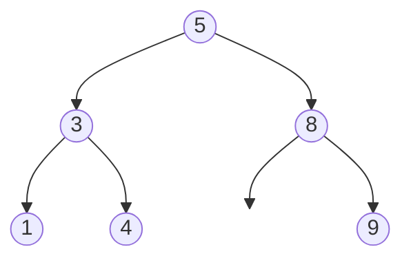
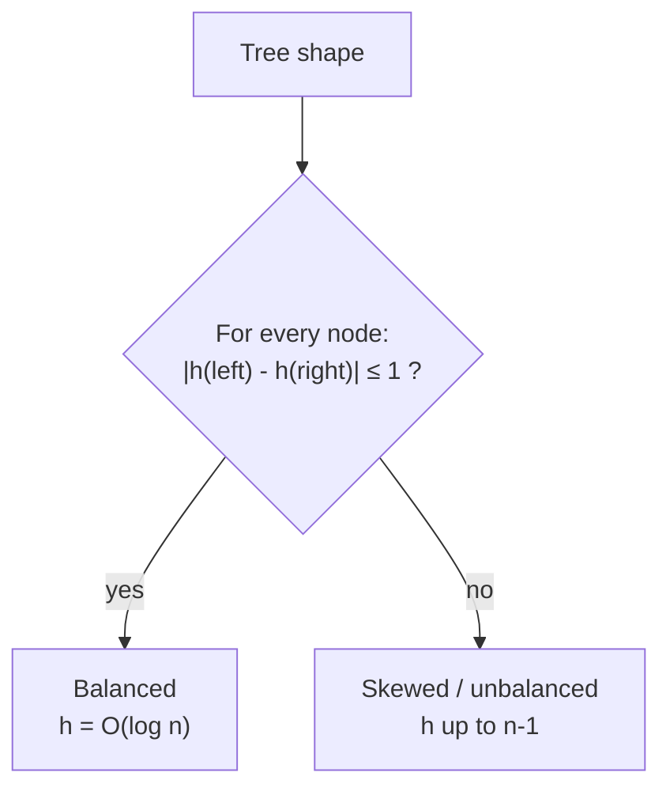
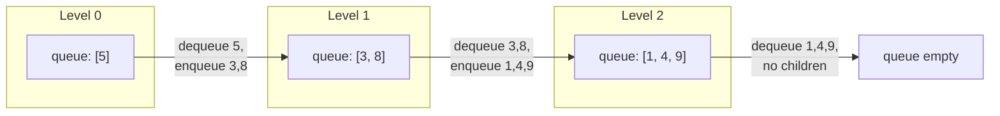
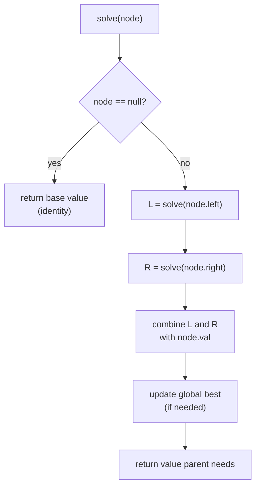
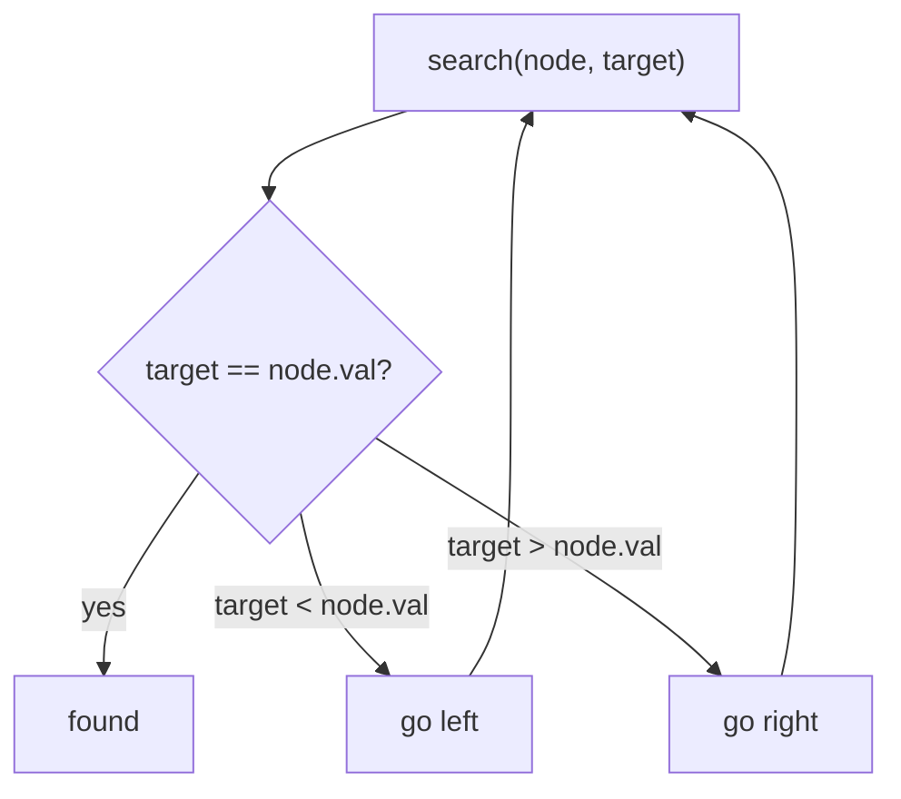
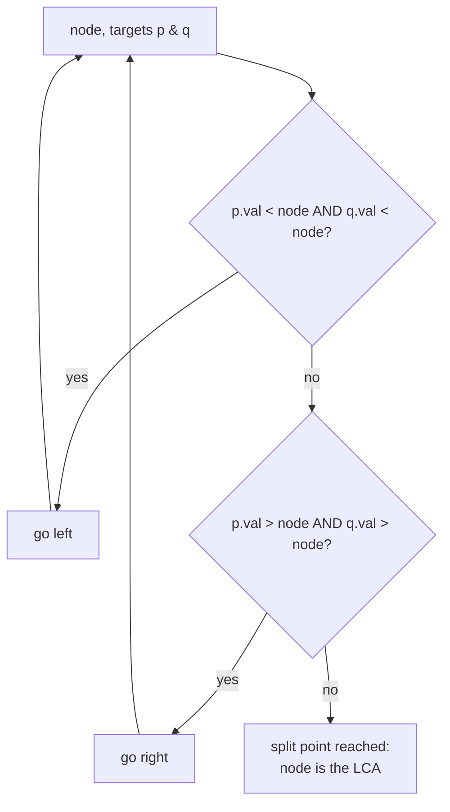

# Trees & Binary Search Trees (Reviewer)

A **[binary tree](algorithms-glossary-reviewer.md#binary-tree "A tree where every node has at most two children, left and right.")** is a hierarchical structure where each [node](algorithms-glossary-reviewer.md#node "A container in a linked structure holding a value plus references to neighbors.") has at most two [children](algorithms-glossary-reviewer.md#parent-child-and-sibling "Parent is directly above a node; child is below it; siblings share a parent.") (left and right). Most [tree](algorithms-glossary-reviewer.md#tree "A hierarchy of nodes with one root, no cycles, and one parent per node.") interview problems reduce to one idea: **recurse into the children, then combine their answers at the current node**. Master the three [depth-first](algorithms-glossary-reviewer.md#depth-first-search "Explores as far down one branch as possible before backtracking.") traversals ([preorder, inorder, postorder](algorithms-glossary-reviewer.md#preorder-inorder-and-postorder "Three depth-first orders differing in when the current node is visited.")), [breadth-first](algorithms-glossary-reviewer.md#breadth-first-search "Explores a structure level by level, visiting nearer nodes before farther ones.") [level-order](algorithms-glossary-reviewer.md#level-order-traversal "Visiting a tree's nodes one depth-level at a time, top to bottom."), and the "solve children then combine" [recursion](algorithms-glossary-reviewer.md#recursion "A function solving a problem by calling itself on smaller versions of it.") template, and the bulk of the tree question bank becomes mechanical.

A **[binary search tree](algorithms-glossary-reviewer.md#binary-search-tree "A binary tree where left subtree values are smaller and right are larger.") (BST)** adds an ordering [invariant](algorithms-glossary-reviewer.md#invariant "A condition that stays true at every step, used to prove correctness.") — every key in the left [subtree](algorithms-glossary-reviewer.md#subtree "A node together with all of its descendants, treated as a tree itself.") is smaller than the node, every key in the right subtree is larger — which turns the tree into a searchable structure: search, insert, and delete all run in `O(h)` where `h` is the [height](algorithms-glossary-reviewer.md#height-depth-and-level "Depth measures down from the root; height measures up from leaves; level groups by depth."). The single most important BST fact for interviews: **an inorder [traversal](algorithms-glossary-reviewer.md#tree-traversal "Visiting every node of a tree in a systematic order.") of a BST visits keys in sorted ascending order.** This reviewer covers the node model, all four traversals (recursive and iterative), the tree-DP template, BST operations and validation, lowest common ancestor, tree construction, and serialization — the topics that recur across exams and on-site loops.

Related: [Algorithm Patterns Index](algorithm-patterns-index-reviewer.md) · [Recursion & Divide and Conquer](recursion-and-divide-and-conquer-reviewer.md) · [Graphs](graphs-reviewer.md) · [Heaps & Priority Queues](heaps-and-priority-queues-reviewer.md) · [Tries](tries-reviewer.md) · [Backtracking](backtracking-reviewer.md) · [Glossary](algorithms-glossary-reviewer.md)

## Contents

- [The binary tree node model](#the-binary-tree-node-model)
- [Height, depth, and balance](#height-depth-and-balance)
- [DFS traversals: preorder, inorder, postorder](#dfs-traversals-preorder-inorder-postorder)
- [Iterative DFS with an explicit stack](#iterative-dfs-with-an-explicit-stack)
- [BFS / level-order traversal](#bfs--level-order-traversal)
- [The tree-DP recursion template](#the-tree-dp-recursion-template)
- [Classic tree-DP problems](#classic-tree-dp-problems)
- [The BST property and operations](#the-bst-property-and-operations)
- [Validating a BST](#validating-a-bst)
- [Kth smallest in a BST](#kth-smallest-in-a-bst)
- [Lowest common ancestor](#lowest-common-ancestor)
- [Construct a tree from traversals](#construct-a-tree-from-traversals)
- [Serialize and deserialize](#serialize-and-deserialize)
- [Same tree and subtree checks](#same-tree-and-subtree-checks)
- [Complexity summary](#complexity-summary)
- [Interview Q&A](#interview-qa)
- [Rapid-fire round](#rapid-fire-round)
- [Exam-style questions](#exam-style-questions)
- [30-second takeaway](#30-second-takeaway)
- [Quick recall checklist](#quick-recall-checklist)
- [References](#references)

---

## The binary tree node model

A binary tree is built from nodes; each node carries a value and references to its two children. [LeetCode](algorithms-glossary-reviewer.md#leetcode "An online platform of coding-interview problems with an automated judge.")'s canonical definition is a self-contained class.

Key points:
- A **node** has a value plus `left` and `right` references; a missing child is `null`.
- The **[root](algorithms-glossary-reviewer.md#root "The single topmost node of a tree, the one with no parent.")** is the single entry point; a node with both children `null` is a **[leaf](algorithms-glossary-reviewer.md#leaf "A node with no children; the endpoint of a branch.")**.
- An **empty tree** is represented by a `null` root — handle it as the base case in nearly every recursion.
- The tree has no [cycles](algorithms-glossary-reviewer.md#cycle "A path that starts and ends at the same vertex without reusing an edge.") and each non-root node has exactly one parent, so there is exactly one path between any two nodes.

```csharp
// Self-contained node used throughout this reviewer (matches LeetCode's TreeNode).
public class TreeNode
{
    public int val;
    public TreeNode? left;
    public TreeNode? right;

    public TreeNode(int val = 0, TreeNode? left = null, TreeNode? right = null)
    {
        this.val = val;
        this.left = left;
        this.right = right;
    }
}
```

The example tree used for every trace below is a valid BST:



*The running example: a BST with root 5, whose inorder traversal is the sorted sequence 1, 3, 4, 5, 8, 9.*

## Height, depth, and balance

These three terms are constantly confused; pin them down precisely.

Key points:
- **Depth of a node** — the number of edges from the **root** down to that node. The root has depth 0.
- **Height of a node** — the number of edges on the **longest path** from that node down to a leaf. A leaf has height 0.
- **Height of the tree** — the height of its root. LeetCode's "maximum depth" (LC 104) counts **nodes** on the longest root-to-leaf path, so it equals tree-height-in-edges plus 1.
- **[Balanced](algorithms-glossary-reviewer.md#balanced-tree "A tree kept near minimum height (about log n) so operations stay O(log n).")** — for **every** node, the heights of its left and right subtrees differ by at most 1 (LC 110). Balance is a per-node property, not just a root property.
- For `n` nodes, height ranges from `⌊log₂ n⌋` (perfectly balanced) to `n - 1` edges (a degenerate "[linked-list](algorithms-glossary-reviewer.md#linked-list "A chain of nodes each holding a value and a reference to the next node.")" tree). Recursion-stack space and BST operation cost both scale with height, so balance matters.
- A plain BST never re-balances itself, so adversarial inserts can skew it. **[Self-balancing trees](balanced-trees-and-avl-reviewer.md)** — AVL and red-black — rotate after each insert/delete to *guarantee* `O(log n)` height; **[B-trees](b-trees-reviewer.md)** push the same idea to high-fan-out nodes for on-disk and database indexes.



*Balance is the gap between O(log n) and O(n) for every height-bound operation.*

## DFS traversals: preorder, inorder, postorder

Depth-first search dives down one branch fully before backtracking. The three variants differ only in **when** you visit the current node relative to recursing into its children.

Key points:
- **Preorder** — visit node, then left subtree, then right subtree. Order: **Node, Left, Right**.
- **Inorder** — left subtree, node, right subtree. Order: **Left, Node, Right**. On a BST this yields **sorted** output.
- **Postorder** — left subtree, right subtree, node. Order: **Left, Right, Node**. Used when a node's result depends on its children (deletion, tree-DP).
- All three are `O(n)` time (each node visited once) and `O(h)` space for the recursion stack — `O(log n)` if balanced, `O(n)` if skewed.

```csharp
public void Preorder(TreeNode? node, IList<int> output)
{
    if (node is null) return;
    output.Add(node.val);          // Node
    Preorder(node.left, output);   // Left
    Preorder(node.right, output);  // Right
}

public void Inorder(TreeNode? node, IList<int> output)
{
    if (node is null) return;
    Inorder(node.left, output);    // Left
    output.Add(node.val);          // Node
    Inorder(node.right, output);   // Right
}

public void Postorder(TreeNode? node, IList<int> output)
{
    if (node is null) return;
    Postorder(node.left, output);  // Left
    Postorder(node.right, output); // Right
    output.Add(node.val);          // Node
}
```

Visit order for each traversal on the running example tree:

```text
            5
           / \
          3   8
         / \   \
        1   4   9

  traversal   visit order (node values)
  ---------   -------------------------------
  preorder    5 -> 3 -> 1 -> 4 -> 8 -> 9     (Node, Left, Right)
  inorder     1 -> 3 -> 4 -> 5 -> 8 -> 9     (Left, Node, Right)  <- sorted
  postorder   1 -> 4 -> 3 -> 9 -> 8 -> 5     (Left, Right, Node)
```

*Same tree, three orders — only the position of the "Node" visit moves; inorder on a BST is sorted.*

The "Invert Binary Tree" problem (LC 226 — Invert Binary Tree) is the simplest structural recursion: swap each node's children top-down.

```csharp
public TreeNode? InvertTree(TreeNode? root)
{
    if (root is null) return null;
    (root.left, root.right) = (InvertTree(root.right), InvertTree(root.left));
    return root;
}
```

The `depth-first-search/tree-traversal/binary-tree-traversal` folder in `leet-practice` drills these three orders directly.

## Iterative DFS with an explicit stack

Recursion uses the [call stack](algorithms-glossary-reviewer.md#call-stack "Memory tracking active function calls; each call pushes a frame, popped on return.") implicitly; the iterative form makes that [stack](algorithms-glossary-reviewer.md#stack "A last-in-first-out collection: you add and remove only at the top.") explicit. This is the standard whiteboard follow-up ("now do it without recursion").

Key points:
- A **`Stack<TreeNode>`** replaces the call stack; LIFO order mirrors the deepest-first dive.
- **Iterative preorder**: pop a node, emit it, push **right then left** so left is processed first.
- **Iterative inorder**: walk left pushing nodes, then pop-emit-go-right. This is the engine behind iterative BST in-order.
- Time stays `O(n)`; space is `O(h)` for the stack — same asymptotics as recursion, but no risk of a deep-recursion [stack overflow](algorithms-glossary-reviewer.md#recursion-depth-and-stack-overflow "How deep nested calls go; too deep exhausts the call stack and crashes.") on a skewed tree.

```csharp
public IList<int> PreorderIterative(TreeNode? root)
{
    var output = new List<int>();
    if (root is null) return output;

    var stack = new Stack<TreeNode>();
    stack.Push(root);
    while (stack.Count > 0)
    {
        TreeNode node = stack.Pop();
        output.Add(node.val);
        if (node.right is not null) stack.Push(node.right); // push right first
        if (node.left is not null) stack.Push(node.left);   // so left pops first
    }
    return output;
}

public IList<int> InorderIterative(TreeNode? root)
{
    var output = new List<int>();
    var stack = new Stack<TreeNode>();
    TreeNode? curr = root;
    while (curr is not null || stack.Count > 0)
    {
        while (curr is not null)        // dive to the leftmost node
        {
            stack.Push(curr);
            curr = curr.left;
        }
        curr = stack.Pop();             // leftmost unvisited
        output.Add(curr.val);           // visit
        curr = curr.right;              // then its right subtree
    }
    return output;
}
```

Iterative inorder stack trace on the running example tree:

```text
  tree:        5
              / \
             3   8
            / \   \
           1   4   9

  step  action                         stack (bottom..top)   output
  ----  -----------------------------  --------------------  ----------------------
   1    dive left from 5,3,1           [5, 3, 1]             []
   2    pop 1, visit, go right(null)   [5, 3]                [1]
   3    pop 3, visit, go right -> 4    [5]                   [1, 3]
   4    dive left from 4 (none)        [5, 4]                [1, 3]
   5    pop 4, visit, go right(null)   [5]                   [1, 3, 4]
   6    pop 5, visit, go right -> 8    []                    [1, 3, 4, 5]
   7    dive left from 8 (none)        [8]                   [1, 3, 4, 5]
   8    pop 8, visit, go right -> 9    []                    [1, 3, 4, 5, 8]
   9    dive left from 9 (none)        [9]                   [1, 3, 4, 5, 8]
  10    pop 9, visit, go right(null)   []                    [1, 3, 4, 5, 8, 9]
```

*The explicit stack reproduces inorder 1, 3, 4, 5, 8, 9 — the sorted BST order.*

## BFS / level-order traversal

Breadth-first search visits the tree **level by level**, top to bottom, left to right, using a FIFO [queue](algorithms-glossary-reviewer.md#queue "A first-in-first-out collection: add at the back, remove from the front."). This is the basis for level-order (LC 102 — Binary Tree Level Order Traversal) and its zigzag variant (LC 103 — Binary Tree Zigzag Level Order Traversal).

Key points:
- Use a **`Queue<TreeNode>`**; enqueue the root, then repeatedly dequeue a node and enqueue its non-null children.
- To **group by level**, snapshot `queue.Count` at the start of each outer iteration — that count is exactly the number of nodes on the current level.
- **Time `O(n)`**; **space `O(w)`** where `w` is the maximum level width. For a [complete binary tree](algorithms-glossary-reviewer.md#complete-binary-tree "Every level filled except the last, which fills left to right with no gaps.") the last level holds about `n/2` nodes, so [worst-case](algorithms-glossary-reviewer.md#best-average-and-worst-case "How an algorithm's cost varies across the luckiest, typical, and hardest inputs.") BFS space is `O(n)` — wider than DFS's `O(h)`.
- **Zigzag** (LC 103) reverses the emission direction on alternate levels; build each level list normally and reverse it when the level index is odd (or push to the front of a [deque](algorithms-glossary-reviewer.md#deque "A double-ended queue allowing O(1) add and remove at both ends.")).

```csharp
public IList<IList<int>> LevelOrder(TreeNode? root)
{
    var result = new List<IList<int>>();
    if (root is null) return result;

    var queue = new Queue<TreeNode>();
    queue.Enqueue(root);
    while (queue.Count > 0)
    {
        int levelSize = queue.Count;          // nodes on this level
        var level = new List<int>(levelSize);
        for (int i = 0; i < levelSize; i++)
        {
            TreeNode node = queue.Dequeue();
            level.Add(node.val);
            if (node.left is not null) queue.Enqueue(node.left);
            if (node.right is not null) queue.Enqueue(node.right);
        }
        result.Add(level);
    }
    return result;
}

public IList<IList<int>> ZigzagLevelOrder(TreeNode? root)
{
    var result = new List<IList<int>>();
    if (root is null) return result;

    var queue = new Queue<TreeNode>();
    queue.Enqueue(root);
    bool leftToRight = true;
    while (queue.Count > 0)
    {
        int levelSize = queue.Count;
        var level = new List<int>(levelSize);
        for (int i = 0; i < levelSize; i++)
        {
            TreeNode node = queue.Dequeue();
            level.Add(node.val);
            if (node.left is not null) queue.Enqueue(node.left);
            if (node.right is not null) queue.Enqueue(node.right);
        }
        if (!leftToRight) level.Reverse();    // flip direction on odd levels
        result.Add(level);
        leftToRight = !leftToRight;
    }
    return result;
}
```



*BFS processes the queue one full level at a time; output is [[5], [3, 8], [1, 4, 9]]. Zigzag flips level 1 to [8, 3], giving [[5], [8, 3], [1, 4, 9]].*

The `breadth-first-search/tree-traversal` folder in `leet-practice` holds the `level-order` and `zigzag-level-order` drills.

## The tree-DP recursion template

Most "compute something about the whole tree" problems share one shape: recurse to get each child's answer, then **combine at the current node**. This is "tree DP" — [dynamic programming](algorithms-glossary-reviewer.md#dynamic-programming "Solving problems with overlapping subproblems by computing each once and reusing it.") over the tree, evaluated in postorder (children before parent).

Key points:
- The recursion **returns a value describing the subtree rooted here** (a height, a sum, a boolean) so the parent can combine.
- Often you need **two different quantities**: one returned upward and one tracked as a global best. Carry the global best by reference / closure and return the value the parent needs.
- The [base case](algorithms-glossary-reviewer.md#base-case "The condition where a recursive function stops and returns a direct answer.") is the **`null` child**, returning the identity (height `-1` or `0`, sum `0`, etc.).
- Every such traversal is `O(n)` time and `O(h)` stack space.



*The universal tree-DP shape: descend to children, combine on the way back up.*

The cleanest instance is maximum depth (LC 104 — Maximum Depth of Binary Tree):

```csharp
public int MaxDepth(TreeNode? root)
{
    if (root is null) return 0;                         // empty subtree: depth 0
    int left = MaxDepth(root.left);
    int right = MaxDepth(root.right);
    return 1 + Math.Max(left, right);                   // this node adds 1
}
```

## Classic tree-DP problems

Four canonical problems, each a variation on "return one thing, track another."

Key points:
- **Diameter** (LC 543 — Diameter of Binary Tree) — longest path between any two nodes, counted in **edges**. At each node the longest path through it is `height(left) + height(right)`; return the height upward, track the max diameter globally.
- **Balanced** (LC 110 — Balanced Binary Tree) — return the height, but signal imbalance with a sentinel (`-1`) so you stop early; checking balance with a separate `MaxDepth` call inside a recursion is `O(n²)`, the height-plus-sentinel trick is `O(n)`.
- **Max path sum** (LC 124 — Binary Tree Maximum Path Sum) — a path may bend at one node but not pass through it twice. Return the best **straight** downward gain (`node.val + max(0, leftGain, rightGain)` constrained to one side), track the best **bent** sum (`node.val + leftGain + rightGain`) globally. Clamp negative child gains to 0.
- All four are single-pass postorder, `O(n)` time and `O(h)` space.

```csharp
public int DiameterOfBinaryTree(TreeNode? root)
{
    int best = 0;
    Height(root);
    return best;

    int Height(TreeNode? node)
    {
        if (node is null) return 0;            // height in nodes below null is 0
        int l = Height(node.left);
        int r = Height(node.right);
        best = Math.Max(best, l + r);          // path through node, in edges
        return 1 + Math.Max(l, r);
    }
}

public bool IsBalanced(TreeNode? root)
{
    return Check(root) != -1;

    int Check(TreeNode? node)
    {
        if (node is null) return 0;
        int l = Check(node.left);
        if (l == -1) return -1;                // left already unbalanced
        int r = Check(node.right);
        if (r == -1) return -1;                // right already unbalanced
        if (Math.Abs(l - r) > 1) return -1;    // this node unbalanced
        return 1 + Math.Max(l, r);
    }
}

public int MaxPathSum(TreeNode? root)
{
    int best = int.MinValue;
    Gain(root);
    return best;

    int Gain(TreeNode? node)
    {
        if (node is null) return 0;
        int l = Math.Max(0, Gain(node.left));    // drop negative branches
        int r = Math.Max(0, Gain(node.right));
        best = Math.Max(best, node.val + l + r); // path bending at this node
        return node.val + Math.Max(l, r);        // straight path for the parent
    }
}
```

Diameter trace on the running example tree (path lengths in edges):

```text
  tree:        5
              / \
             3   8
            / \   \
           1   4   9

  node  height(L)  height(R)  through = L + R  running best
  ----  ---------  ---------  ---------------  ------------
   1        0          0            0               0
   4        0          0            0               0
   3        1          1            2               2
   9        0          0            0               2
   8        0          1            1               2
   5        2          2            4               4   <- diameter
```

*The diameter is 4 edges: the path 1 - 3 - 5 - 8 - 9. The bend happens at the root.*

## The BST property and operations

A **binary search tree** orders its keys: for every node, all keys in the **left** subtree are strictly less, all keys in the **right** subtree are strictly greater (assuming no duplicates). This ordering makes search a guided descent.

Key points:
- **Search** — compare the target to the node; go left if smaller, right if larger, done if equal. `O(h)` time.
- **Insert** — search for the key; when you fall off the tree, attach a new leaf there. `O(h)` time, preserves the invariant.
- **Delete** — three cases: a leaf is removed directly; a node with one child is replaced by that child; a node with two children is replaced by its **inorder successor** (smallest key in the right subtree), then that successor is deleted from the right subtree. `O(h)` time.
- **`h` is `O(log n)` only if the tree is balanced.** A plain BST built from sorted inserts degenerates into a chain with `h = n - 1`; self-balancing trees (AVL, red-black) keep `h = O(log n)` — that is what backs .NET's `SortedDictionary<TKey,TValue>` and `SortedSet<T>` (see ../dotnet/csharp/collections-and-big-o-reviewer.md).

```csharp
public TreeNode? SearchBST(TreeNode? root, int target)
{
    TreeNode? node = root;
    while (node is not null && node.val != target)
        node = target < node.val ? node.left : node.right;
    return node;   // null if not found
}

public TreeNode InsertIntoBST(TreeNode? root, int value)
{
    if (root is null) return new TreeNode(value);
    if (value < root.val) root.left = InsertIntoBST(root.left, value);
    else                  root.right = InsertIntoBST(root.right, value);
    return root;
}

public TreeNode? DeleteNode(TreeNode? root, int key)
{
    if (root is null) return null;
    if (key < root.val) { root.left = DeleteNode(root.left, key); return root; }
    if (key > root.val) { root.right = DeleteNode(root.right, key); return root; }

    // found the node to delete
    if (root.left is null) return root.right;   // 0 or 1 child
    if (root.right is null) return root.left;

    // two children: replace with inorder successor (min of right subtree)
    TreeNode succ = root.right;
    while (succ.left is not null) succ = succ.left;
    root.val = succ.val;
    root.right = DeleteNode(root.right, succ.val);
    return root;
}
```



*BST search discards half the remaining tree at each step — O(h), which is O(log n) when balanced.*

## Validating a BST

LC 98 — Validate Binary Search Tree is the classic trap. The wrong answer compares each node only to its immediate children; the correct one threads a **valid (low, high) range** down the tree.

Key points:
- A node is valid only if its value lies strictly inside the open interval `(low, high)` inherited from ancestors — **comparing to the parent alone is insufficient**.
- Recurse left with the range `(low, node.val)` and right with `(node.val, high)`: every left descendant must stay below `node.val`, every right descendant above it.
- Use **`long`** bounds (or nullable bounds) so values equal to `int.MinValue` / `int.MaxValue` are handled — a node holding `int.MaxValue` must still pass.
- Equivalent alternative: an **inorder** traversal must be **strictly increasing**; track the previous value and fail if the current is not greater.
- Both approaches are `O(n)` time, `O(h)` space.

```csharp
public bool IsValidBST(TreeNode? root)
{
    return Validate(root, long.MinValue, long.MaxValue);

    static bool Validate(TreeNode? node, long low, long high)
    {
        if (node is null) return true;
        if (node.val <= low || node.val >= high) return false;     // outside (low, high)
        return Validate(node.left,  low, node.val)                 // tighten high
            && Validate(node.right, node.val, high);               // tighten low
    }
}
```

Bounds trace — a tree that is **not** a valid BST because the node `4` sits in the **right** subtree of `5` (so it must be greater than 5) yet holds the value 4. A parent-only check sees `4 < 8` and accepts it; the bounds check inherits `low = 5` from the root and rejects it:

```text
  tree (INVALID):     5
                     / \
                    3   8
                       / \
                      4   9      <- 4 is in 5's RIGHT subtree, must be > 5

  node  inherited (low, high)    check               result
  ----  -----------------------  ------------------  ------
   5    (-inf, +inf)             -inf < 5 < +inf     ok
   3    (-inf, 5)                -inf < 3 < 5        ok
   8    (5, +inf)                5 < 8 < +inf        ok
   4    (5, 8)                   5 < 4 ? NO          FAIL  (4 <= low=5)
```

*The window tightens on the way down: going right raises `low`, going left lowers `high`. Node 4 fails because it inherited `low = 5` from the root yet holds 4 — a parent-only check would miss this.*

## Kth smallest in a BST

LC 230 — Kth Smallest Element in a BST exploits the headline fact: **inorder traversal of a BST is sorted**. The `k`-th value emitted by inorder is the `k`-th smallest.

Key points:
- Run an **inorder** traversal and stop as soon as you have emitted `k` values.
- The **iterative** inorder is ideal here: you can break out of the loop early after the `k`-th pop, visiting only `O(h + k)` nodes instead of all `n`.
- Time is `O(h + k)` with the early-stopping iterative version (worst case `O(n)`), space `O(h)`.
- If the BST is modified often and you need many `k`-th queries, augment nodes with subtree sizes for `O(h)` per query — but that is beyond the base problem.

```csharp
public int KthSmallest(TreeNode root, int k)
{
    var stack = new Stack<TreeNode>();
    TreeNode? curr = root;
    while (curr is not null || stack.Count > 0)
    {
        while (curr is not null)        // dive left
        {
            stack.Push(curr);
            curr = curr.left;
        }
        curr = stack.Pop();
        if (--k == 0) return curr.val;  // k-th visited in sorted order
        curr = curr.right;
    }
    return -1; // unreachable for valid k in [1, n]
}
```

On the running example tree with `k = 3`, inorder visits 1, 3, **4**, ... so the answer is `4`.

## Lowest common ancestor

The **lowest common ancestor (LCA)** of two nodes is the deepest node that has both as descendants (a node is its own descendant). The BST version (LC 235 — Lowest Common Ancestor of a Binary Search Tree) is far simpler than the general one because ordering tells you which way to walk.

Key points:
- **BST shortcut** — from the root, if both targets are **less** than the node, go left; if both are **greater**, go right; otherwise the node is the **split point** and is the LCA. `O(h)` time, `O(1)` extra space (iterative).
- **General binary tree** — recurse; if the current node equals either target, return it; if both subtrees return non-null, the current node is the LCA; otherwise propagate the non-null side up. `O(n)` time, `O(h)` space.
- The BST method works because the LCA is exactly the first node whose value lies **between** the two targets (inclusive).

```csharp
// BST version: walk down using the ordering.
public TreeNode LowestCommonAncestorBST(TreeNode root, TreeNode p, TreeNode q)
{
    TreeNode node = root;
    while (true)
    {
        if (p.val < node.val && q.val < node.val) node = node.left!;
        else if (p.val > node.val && q.val > node.val) node = node.right!;
        else return node;          // split point: p and q diverge here
    }
}

// General binary tree version: postorder propagation.
public TreeNode? LowestCommonAncestor(TreeNode? root, TreeNode p, TreeNode q)
{
    if (root is null || root == p || root == q) return root;
    TreeNode? left = LowestCommonAncestor(root.left, p, q);
    TreeNode? right = LowestCommonAncestor(root.right, p, q);
    if (left is not null && right is not null) return root; // p and q on both sides
    return left ?? right;                                   // bubble up the found side
}
```



*In a BST, the LCA is the first node where p and q fall on opposite sides (or one equals the node).*

For example, the LCA of `1` and `4` in the running tree: both are less than `5` (go left to `3`); then `1 < 3` and `4 > 3` diverge, so `3` is the LCA.

## Construct a tree from traversals

LC 105 — Construct Binary Tree from Preorder and Inorder Traversal rebuilds a unique tree from two traversal orders.

Key points:
- **Preorder's first element is the root.** Find it in the inorder array: everything **left** of it is the left subtree's inorder, everything **right** is the right subtree's inorder.
- The left-inorder length tells you how to split the **preorder** array into the left and right preorder slices; recurse on each side.
- Build a **`Dictionary<int,int>`** from value to inorder index for `O(1)` root lookup, and carry a **moving preorder pointer** instead of slicing arrays — that gives `O(n)` time overall.
- Without the index map, repeated linear searches make it `O(n²)`. Space is `O(n)` for the map plus `O(h)` recursion.
- You need **two** traversals and one of them must be inorder (preorder + postorder alone cannot disambiguate a tree in general).

```csharp
public TreeNode? BuildTree(int[] preorder, int[] inorder)
{
    var indexOf = new Dictionary<int, int>(inorder.Length);
    for (int i = 0; i < inorder.Length; i++) indexOf[inorder[i]] = i;

    int pre = 0;
    return Build(0, inorder.Length - 1);

    TreeNode? Build(int inLo, int inHi)
    {
        if (inLo > inHi) return null;
        int rootVal = preorder[pre++];          // next root in preorder
        var node = new TreeNode(rootVal);
        int mid = indexOf[rootVal];             // split point in inorder
        node.left = Build(inLo, mid - 1);       // left subtree first (preorder)
        node.right = Build(mid + 1, inHi);
        return node;
    }
}
```

```text
  preorder = [5, 3, 1, 4, 8, 9]   inorder = [1, 3, 4, 5, 8, 9]

  root = preorder[0] = 5
  inorder split around 5:  [1, 3, 4] | 5 | [8, 9]
                            left subtree   right subtree

  left:  preorder slice [3, 1, 4], inorder [1, 3, 4]
         root 3 -> inorder [1] | 3 | [4]  -> left leaf 1, right leaf 4
  right: preorder slice [8, 9],    inorder [8, 9]
         root 8 -> inorder [] | 8 | [9]   -> no left, right leaf 9

  reconstructed:      5
                     / \
                    3   8
                   / \   \
                  1   4   9
```

*Preorder names the next root; inorder says how many nodes go left versus right.*

## Serialize and deserialize

LC 297 — Serialize and Deserialize Binary Tree turns a tree into a string and back. A clean approach is **preorder with explicit null markers**.

Key points:
- **Serialize** with preorder, writing a sentinel (e.g. `#`) for every `null` child. The null markers make the structure unambiguous, so preorder alone suffices to rebuild.
- **Deserialize** by consuming tokens in the same preorder: a value becomes a node and recursively builds its left then right; a `#` returns `null`.
- Both directions are `O(n)` time and `O(n)` space (the string plus `O(h)` recursion).
- A **BFS / level-order** encoding (LeetCode's display format) also works; the key requirement either way is that nulls are encoded so the shape is recoverable.

```csharp
public string Serialize(TreeNode? root)
{
    var sb = new System.Text.StringBuilder();
    Write(root);
    return sb.ToString();

    void Write(TreeNode? node)
    {
        if (node is null) { sb.Append("#,"); return; }
        sb.Append(node.val).Append(',');
        Write(node.left);
        Write(node.right);
    }
}

public TreeNode? Deserialize(string data)
{
    var tokens = new Queue<string>(data.Split(',', StringSplitOptions.RemoveEmptyEntries));
    return Read();

    TreeNode? Read()
    {
        string token = tokens.Dequeue();
        if (token == "#") return null;
        var node = new TreeNode(int.Parse(token));
        node.left = Read();
        node.right = Read();
        return node;
    }
}
```

For the running example tree, `Serialize` produces `5,3,1,#,#,4,#,#,8,#,9,#,#,` and `Deserialize` consumes those tokens in the same preorder to rebuild the identical tree.

## Same tree and subtree checks

Two small structural recursions that appear constantly as building blocks.

Key points:
- **Same tree** — two trees are identical when both roots are `null`, or both are non-null with equal values and recursively identical left and right subtrees. `O(min(n, m))` time, `O(min(h₁, h₂))` space.
- **Subtree** — tree `t` is a subtree of `s` if `t` equals some node's subtree in `s`. Try `IsSameTree` at each node of `s`: `O(n · m)` worst case naively (string/[hashing](algorithms-glossary-reviewer.md#hashing "Turning a key into a fixed-size integer used to place or find it in a table.") approaches reach `O(n + m)`).
- Both reduce to the same-tree primitive — get that exactly right and the rest follows.

```csharp
public bool IsSameTree(TreeNode? a, TreeNode? b)
{
    if (a is null && b is null) return true;          // both empty
    if (a is null || b is null) return false;         // exactly one empty
    return a.val == b.val
        && IsSameTree(a.left, b.left)
        && IsSameTree(a.right, b.right);
}

public bool IsSubtree(TreeNode? s, TreeNode? t)
{
    if (s is null) return t is null;                  // empty t is a subtree of anything
    if (IsSameTree(s, t)) return true;
    return IsSubtree(s.left, t) || IsSubtree(s.right, t);
}
```

## Complexity summary

| Operation | Time | Space (aux) | Notes |
| --- | --- | --- | --- |
| DFS traversal (any of pre/in/post) | `O(n)` | `O(h)` | recursion or explicit stack |
| BFS / level-order | `O(n)` | `O(w)` | `w` up to `n/2`, so `O(n)` worst |
| Max depth / diameter / balanced / max path sum | `O(n)` | `O(h)` | single postorder pass |
| BST search / insert / delete | `O(h)` | `O(h)` rec / `O(1)` iter | `h = O(log n)` balanced, `O(n)` skewed |
| Validate BST | `O(n)` | `O(h)` | bounds or inorder-increasing |
| Kth smallest (inorder, early stop) | `O(h + k)` | `O(h)` | worst case `O(n)` |
| LCA in BST | `O(h)` | `O(1)` iter | ordering-guided walk |
| LCA in general tree | `O(n)` | `O(h)` | postorder propagation |
| Build from preorder + inorder | `O(n)` | `O(n)` | with value→index map |
| Serialize / deserialize | `O(n)` | `O(n)` | preorder + null markers |

`h` is the tree height (edges): `Θ(log n)` when balanced, up to `n - 1` when skewed. `w` is the maximum level width.

## Interview Q&A

### Traversals

Q: What is the difference between preorder, inorder, and postorder?
A: They differ only in when the current node is visited relative to recursing: preorder is Node-Left-Right, inorder is Left-Node-Right, postorder is Left-Right-Node. Inorder on a BST yields sorted order; postorder is used when a node's result depends on its children.

Q: Why might you prefer iterative DFS over recursive?
A: To avoid a stack overflow on a deeply skewed tree (recursion depth up to `n`), and sometimes to break out early. The asymptotics are identical: `O(n)` time, `O(h)` space.

Q: When does DFS use more space than BFS, and vice versa?
A: DFS uses `O(h)` stack space; BFS uses `O(w)` queue space. For a balanced tree DFS is `O(log n)` while BFS is `O(n)` at the widest level — so BFS can use more. For a skewed tree DFS is `O(n)` while BFS is `O(1)` per level.

### BST

Q: Why is comparing only against the parent wrong when validating a BST?
A: A node must satisfy bounds inherited from all ancestors, not just its parent. A left child of `8` that is also in the right subtree of `5` must be greater than `5`; a parent-only check misses that. Thread a `(low, high)` range or verify inorder is strictly increasing.

Q: How do you find the k-th smallest element in a BST efficiently?
A: Inorder traversal emits values in sorted order; the k-th emitted value is the answer. Use iterative inorder and stop after the k-th pop for `O(h + k)` time.

Q: How do you delete a node with two children from a BST?
A: Replace its value with the inorder successor (the minimum of the right subtree), then delete that successor from the right subtree. This preserves the BST invariant.

Q: Why is LCA simpler in a BST than in a general binary tree?
A: Ordering tells you the direction: if both targets are smaller go left, if both larger go right, otherwise you have reached the split point — the LCA. That is an `O(h)` walk with `O(1)` space, versus an `O(n)` postorder search in a general tree.

### Tree DP and construction

Q: What is the "tree DP" template?
A: Recurse into both children to get their subtree answers, then combine them at the current node — evaluated in postorder. Often you return one quantity to the parent (e.g. height) while tracking a separate global best (e.g. diameter).

Q: Why is the naive balanced-tree check `O(n²)` and how do you make it `O(n)`?
A: Calling `MaxDepth` at every node recomputes heights repeatedly. Returning the height from the same recursion and using a `-1` sentinel for "already unbalanced" computes each height once, giving `O(n)`.

Q: Why does building a tree need two traversals, and why must one be inorder?
A: One traversal cannot fix the structure uniquely. Preorder (or postorder) identifies the root; inorder splits the remaining nodes into left and right subtrees around that root. Preorder + postorder together are ambiguous for trees with single-child nodes.

## Rapid-fire round

- inorder of a BST -> **sorted ascending order**
- preorder order -> **Node, Left, Right**
- postorder order -> **Left, Right, Node**
- traversal time complexity -> **`O(n)`**
- DFS recursion space -> **`O(h)`: `O(log n)` balanced, `O(n)` skewed**
- BFS data structure -> **a FIFO `Queue<TreeNode>`**
- group BFS by level -> **snapshot `queue.Count` at each level start**
- zigzag variant -> **reverse the list on odd levels**
- validate BST correctly -> **thread `(low, high)` bounds, not parent-only compares**
- BST search/insert/delete -> **`O(h)`**
- delete node with two children -> **swap in the inorder successor**
- kth smallest in BST -> **k-th value of inorder traversal**
- LCA in a BST -> **walk down to the split point, `O(h)`**
- LCA in a general tree -> **postorder; both sides non-null means current is LCA**
- build tree inputs -> **preorder for roots, inorder to split subtrees**
- serialize cleanly -> **preorder with `#` null markers**
- maximum depth base case -> **`null` returns 0**
- diameter is measured in -> **edges: `height(left) + height(right)`**
- balanced means -> **every node's subtree heights differ by at most 1**
- max path sum trick -> **clamp negative child gains to 0**

## Exam-style questions

**1. Identify the traversal.** A traversal of the running example tree prints `1 3 4 5 8 9`. Which traversal is it, and what does the sorted output tell you?

```text
        5
       / \
      3   8
     / \   \
    1   4   9
```

**Answer:** It is **inorder** (Left, Node, Right). Sorted ascending output confirms the tree is a **BST** — inorder of a BST is always sorted, which is the basis for `KthSmallest` and one validation method.

**2. The validation trap.** Does this tree pass a correct `IsValidBST`?

```text
        5
       / \
      1   8
         / \
        4   9
```

**Answer:** **No.** Node `4` is in the right subtree of `5`, so it inherits the bound `low = 5` and must be greater than 5, but `4 <= 5`. A parent-only check (`4 < 8` and `4` is `8`'s left child) would wrongly accept it. The bounds method (`Validate(node.right, node.val, high)` tightening `low` to 5) correctly rejects it.

**3. Diameter by hand.** Compute the diameter (in edges) of the running example tree and name the path.

**Answer:** **4 edges.** At each node the path through it is `height(left) + height(right)`. The root `5` has left height 2 (via `3 -> 1`) and right height 2 (via `8 -> 9`), giving `2 + 2 = 4`. The path is `1 - 3 - 5 - 8 - 9`. Note it does not pass through the root's value twice — it bends there.

**4. Level-order grouping.** What does `LevelOrder` return for the running example tree, and what does `ZigzagLevelOrder` return?

**Answer:** `LevelOrder` returns `[[5], [3, 8], [1, 4, 9]]`. `ZigzagLevelOrder` flips the odd-indexed level (level 1) to `[8, 3]`, giving `[[5], [8, 3], [1, 4, 9]]`. The grouping works by snapshotting `queue.Count` before draining each level.

**5. LCA walk.** Using the BST LCA algorithm, find the lowest common ancestor of `1` and `9` in the running example tree.

**Answer:** **5 (the root).** At the root `5`: `1 < 5` but `9 > 5`, so the targets diverge immediately — `5` is the split point and therefore the LCA. No descent is needed.

**6. Reconstruct.** Given `preorder = [3, 9, 20, 15, 7]` and `inorder = [9, 3, 15, 20, 7]`, draw the tree.

**Answer:** Root is `preorder[0] = 3`. In inorder, `[9]` is left of `3` and `[15, 20, 7]` is right. So `9` is the left child. For the right subtree, the next preorder root is `20`; inorder `[15]` is its left and `[7]` is its right. Result:

```text
        3
       / \
      9   20
         /  \
        15   7
```

## 30-second takeaway

> A binary tree is "recurse into children, combine at the node." The three DFS orders differ only in where the node-visit sits — and **inorder of a BST is sorted**, the single most useful fact in this whole topic. BFS with a `Queue<TreeNode>` gives level-order; snapshot `queue.Count` to group levels, reverse odd levels for zigzag. Traversals are `O(n)` time and `O(h)` stack space. The **tree-DP template** (max depth, diameter, balanced, max path sum) returns one value to the parent while tracking a global best. A BST gives `O(h)` search/insert/delete, `O(h)` LCA via the split point, and `O(h + k)` k-th smallest via early-stopping inorder — but only `O(log n)` when balanced, `O(n)` when skewed. **Validate a BST with `(low, high)` bounds, never parent-only compares.** Build a tree from preorder (roots) plus inorder (left/right split), and serialize cleanly with preorder plus null markers.

## Quick recall checklist

- **Node model** — value, `left`, `right`; `null` is the empty tree and the base case.
- **Height vs depth** — depth measured from the root down; height measured from a node to its deepest leaf.
- **Balanced** — every node's left/right subtree heights differ by at most 1.
- **Preorder** Node-Left-Right · **Inorder** Left-Node-Right · **Postorder** Left-Right-Node.
- **Inorder of a BST is sorted** — drives k-th smallest and validation.
- **Iterative DFS** — explicit `Stack<TreeNode>`; for preorder push right before left.
- **BFS** — `Queue<TreeNode>`; snapshot `queue.Count` per level; reverse odd levels for zigzag.
- **Traversal cost** — `O(n)` time, `O(h)` DFS space, `O(w)` BFS space.
- **Tree DP** — return one quantity upward, track a global best; postorder evaluation.
- **Diameter** — `height(left) + height(right)` in edges, tracked globally.
- **Balanced check** — height-with-`-1`-sentinel for `O(n)`, not repeated `MaxDepth` (`O(n²)`).
- **Max path sum** — clamp negative child gains to 0; bend at one node.
- **BST ops** — search/insert/delete are `O(h)`; delete-two-children uses the inorder successor.
- **Validate BST** — thread `(low, high)`; use `long` bounds; or check inorder strictly increasing.
- **Kth smallest** — inorder, stop after k pops; `O(h + k)`.
- **LCA in BST** — walk to the split point, `O(h)`, `O(1)` space.
- **LCA general** — postorder; both subtrees non-null means current node is the LCA.
- **Build tree** — preorder gives roots, inorder splits subtrees; map value→index for `O(n)`.
- **Serialize** — preorder with `#` null markers; deserialize consumes the same order.

## References

- [Tree (data structure) — Wikipedia](https://en.wikipedia.org/wiki/Tree_(data_structure))
- [Binary search tree — Wikipedia](https://en.wikipedia.org/wiki/Binary_search_tree)
- [Tree traversal — Wikipedia](https://en.wikipedia.org/wiki/Tree_traversal)
- [Lowest common ancestor — Wikipedia](https://en.wikipedia.org/wiki/Lowest_common_ancestor)
- [Data structures — cp-algorithms.com](https://cp-algorithms.com/)
- [Queue&lt;T&gt; — Microsoft Learn](https://learn.microsoft.com/en-us/dotnet/api/system.collections.generic.queue-1)
- [Stack&lt;T&gt; — Microsoft Learn](https://learn.microsoft.com/en-us/dotnet/api/system.collections.generic.stack-1)
- [SortedSet&lt;T&gt; — Microsoft Learn](https://learn.microsoft.com/en-us/dotnet/api/system.collections.generic.sortedset-1)
- [NeetCode roadmap](https://neetcode.io/roadmap)
- [LeetCode study plans](https://leetcode.com/studyplan/)
