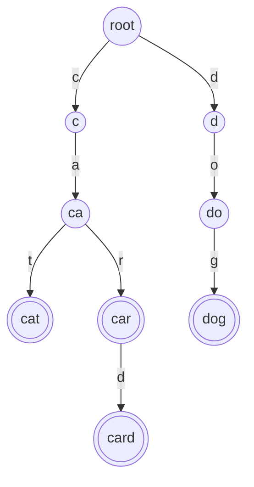
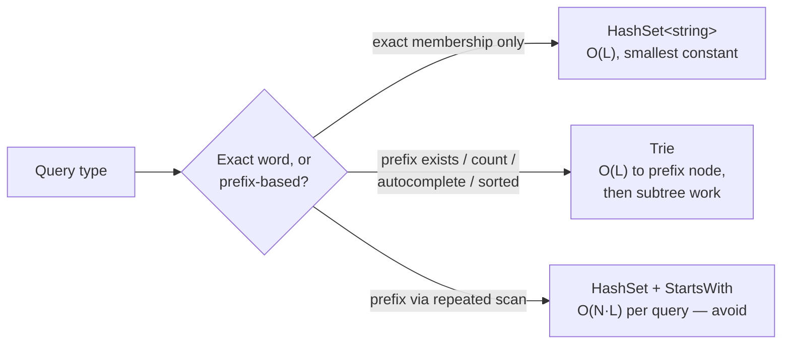
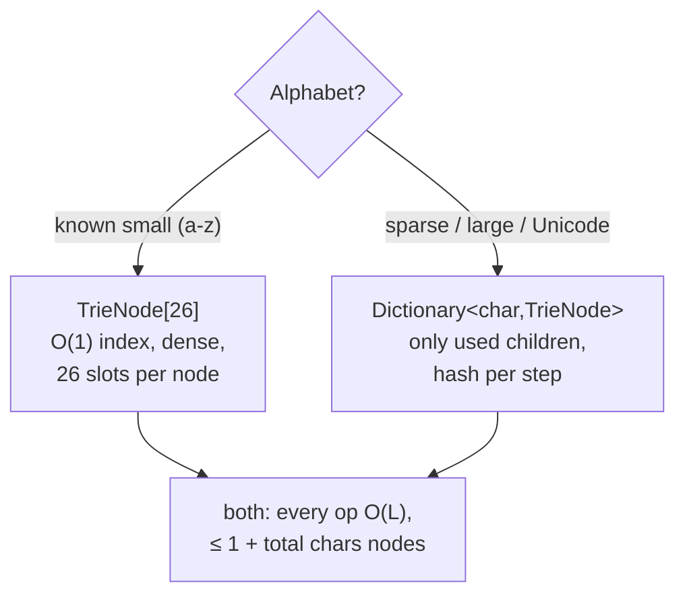
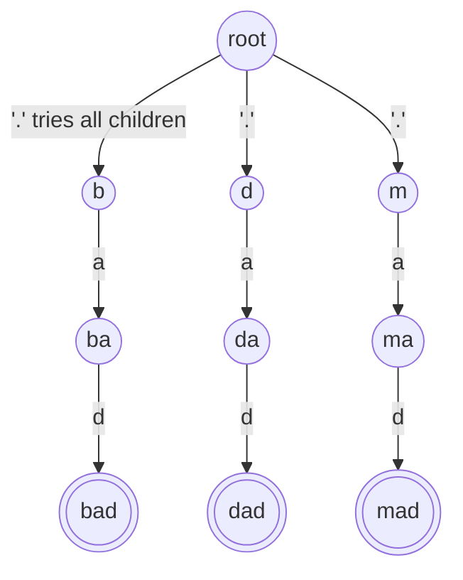
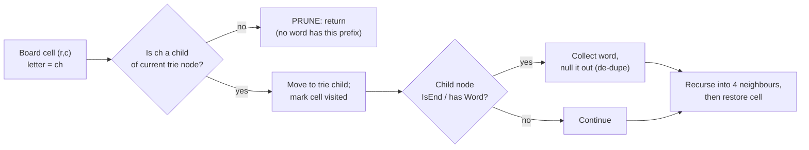
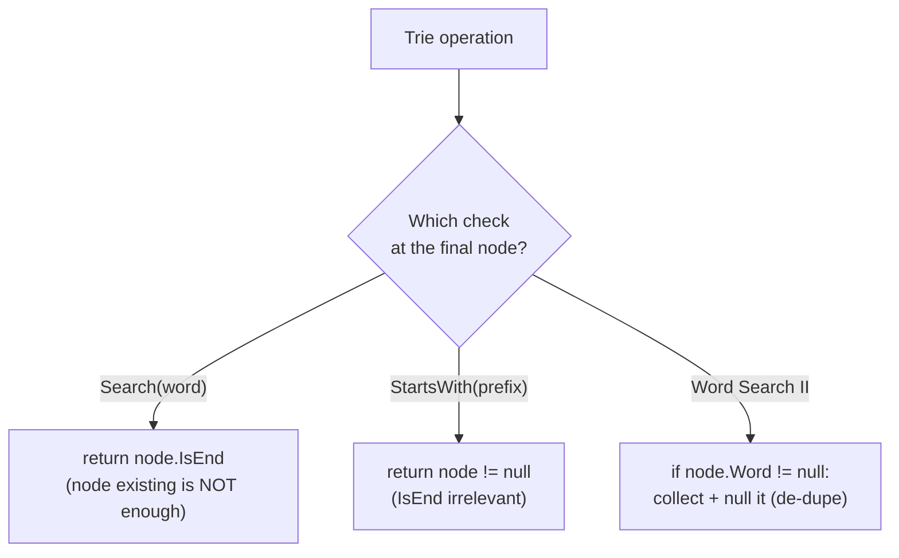

# Tries (Prefix Trees) (Reviewer)

A **trie** (pronounced "try", from re**trie**val; also called a **prefix tree**) is a [tree](algorithms-glossary-reviewer.md#tree "A hierarchy of nodes with one root, no cycles, and one parent per node.") keyed by the characters of the strings it stores. Each [edge](algorithms-glossary-reviewer.md#edge "A connection between two vertices, representing a relationship.") is labelled with one character, so the path from the [root](algorithms-glossary-reviewer.md#root "The single topmost node of a tree, the one with no parent.") down to a [node](algorithms-glossary-reviewer.md#node "A container in a linked structure holding a value plus references to neighbors.") spells a prefix, and a boolean `isEnd` flag on a node marks "a stored word ends exactly here". The single property that makes the [trie](algorithms-glossary-reviewer.md#trie "A tree where each path spells a string, so shared prefixes share nodes.") special: **every operation costs O(L) in the length of the query string, independent of how many words are in the structure**. A [hash set](algorithms-glossary-reviewer.md#hash-set "Stores unique keys with O(1) average membership testing and no values.") can tell you in O(L) whether one specific word is present, but it cannot answer "how many stored words start with `ca`?" without scanning everything. The trie answers prefix questions by walking L edges — that is the whole reason it exists.

This reviewer covers the trie node model (array[26] vs a children map), the three core operations (insert, full-word search, prefix search), the space tradeoff of storing many nodes versus sharing prefixes, wildcard/dot matching by branching the [DFS](algorithms-glossary-reviewer.md#depth-first-search "Explores as far down one branch as possible before backtracking.") at a `.`, and the killer combination — a trie of the target words walked in lockstep with a grid DFS to solve word-search-on-a-board with aggressive [pruning](algorithms-glossary-reviewer.md#pruning "Cutting off search branches that cannot lead to a valid or better solution."). It builds directly on the tree and DFS muscle practiced in the `depth-first-search` folder of `leet-practice`: a trie [traversal](algorithms-glossary-reviewer.md#tree-traversal "Visiting every node of a tree in a systematic order.") *is* a DFS, and the board solver *is* a [backtracking](algorithms-glossary-reviewer.md#backtracking "Explore all candidates by building one choice at a time and undoing dead ends.") DFS that consults a trie at every step.

Related: [Algorithm Patterns Index](algorithm-patterns-index-reviewer.md) · [Trees & BSTs](trees-and-binary-search-trees-reviewer.md) · [Backtracking](backtracking-reviewer.md) · [Arrays & Hashing](arrays-and-hashing-reviewer.md) · [Graphs](graphs-reviewer.md) · [Glossary](algorithms-glossary-reviewer.md)

## Contents

- [The trie node model](#the-trie-node-model)
- [Why a trie beats a hash set for prefixes](#why-a-trie-beats-a-hash-set-for-prefixes)
- [Insert, search, and startsWith](#insert-search-and-startswith)
- [Tracing insert then search node by node](#tracing-insert-then-search-node-by-node)
- [The space tradeoff: array[26] vs a children map](#the-space-tradeoff-array26-vs-a-children-map)
- [Wildcard / dot matching with DFS](#wildcard--dot-matching-with-dfs)
- [Word Search II: a trie over a grid DFS](#word-search-ii-a-trie-over-a-grid-dfs)
- [Trie vs hash set vs sorted array](#trie-vs-hash-set-vs-sorted-array)
- [Pitfalls and misconceptions](#pitfalls-and-misconceptions)
- [Complexity cheat-sheet](#complexity-cheat-sheet)
- [Interview Q&A](#interview-qa)
- [Rapid-fire round](#rapid-fire-round)
- [Exam-style questions](#exam-style-questions)
- [30-second takeaway](#30-second-takeaway)
- [Quick recall checklist](#quick-recall-checklist)
- [References](#references)

---

## The trie node model

A trie is built from nodes; each node holds a way to reach its children (one per possible next character) plus a boolean marking whether a complete word ends at that node. The root represents the empty prefix `""` and stores no character itself.

Key points:
- A **node** has `children` (indexed/keyed by the next character) and an `isEnd` flag. The character is encoded by the **edge** you took, not stored in the node.
- **`isEnd`** distinguishes a stored word from a mere prefix. With `cat` and `car` inserted, the node reached by `ca` exists but has `isEnd == false`; it is a prefix, not a word.
- **Shared prefixes share nodes**: `cat`, `car`, `card` all reuse the single `c → a` path, then branch. This sharing is what bounds the depth to the longest word and lets prefix queries be cheap.
- Two common child representations: a fixed **`TrieNode[26]`** [array](algorithms-glossary-reviewer.md#array "A fixed-size contiguous block of same-type elements accessed by position in O(1).") (one slot per lowercase letter, indexed `c - 'a'`) or a **`Dictionary<char, TrieNode>`**. The array is faster with a known small alphabet; the [map](algorithms-glossary-reviewer.md#hash-map "Stores key-value pairs and retrieves a value by key in O(1) average time.") is leaner for sparse or large alphabets.

```csharp
// Array-of-26 node: fast, dense, lowercase a-z only. Used for LC 208 / LC 212.
public class TrieNode
{
    public TrieNode?[] Children = new TrieNode?[26]; // index = c - 'a'
    public bool IsEnd;
}
```

Here is a trie holding `cat`, `car`, `card`, and `dog`. Double-circle nodes are word ends (`isEnd == true`); single-circle nodes are prefixes only.



*The running example trie: `c → a` is shared by cat/car/card; double-circle nodes (cat, car, card, dog) have isEnd = true, while root, c, ca, d, do are prefixes only.*

Notice that `car` is a word **and** a prefix of `card`: the `car` node has `isEnd == true` and still has a [child](algorithms-glossary-reviewer.md#parent-child-and-sibling "Parent is directly above a node; child is below it; siblings share a parent.") `d`. A node being a word end does not stop it from having children.

## Why a trie beats a hash set for prefixes

A `HashSet<string>` answers exact-membership in O(L) (hash the L-character word, compare). It is excellent at "is this exact word stored?" It is **terrible** at prefix questions, because membership of `"ca"` tells you nothing about words *starting with* `"ca"` — you would have to scan every stored word and test `StartsWith`, an O(N · L) sweep over N words.

Key points:
- **Exact membership**: hash set and trie are both O(L). The hash set has a smaller constant; if all you ever do is "contains this whole word", a hash set is simpler and usually wins.
- **Prefix membership / counting / enumeration**: the trie is O(L) to reach the prefix node, then O(1) for "does any word have this prefix?" (the node exists), or O(size-of-[subtree](algorithms-glossary-reviewer.md#subtree "A node together with all of its descendants, treated as a tree itself.")) to enumerate all completions. The hash set must scan all N words — O(N · L).
- **Autocomplete** ("give me all words starting with `ca`"): walk to the prefix node in O(L), then DFS its subtree to emit completions. A hash set cannot do this efficiently at all.
- **Lexicographic order falls out for free**: visiting a node's children in `a..z` order yields stored words in sorted order — a hash set has no order.



*Choose by the question you ask: a hash set is fine for exact membership, but only a trie makes prefix queries cost O(L) instead of O(N·L).*

## Insert, search, and startsWith

[LC](algorithms-glossary-reviewer.md#leetcode "An online platform of coding-interview problems with an automated judge.") 208 — Implement Trie (Prefix Tree) asks for exactly these three operations. All three walk the trie one character at a time from the root; the only differences are what they do when a child is missing and what they check at the end.

Key points:
- **Insert(word)**: for each character, follow the child edge, **creating** the node if absent; after the last character, set `IsEnd = true`. Time O(L), and up to O(L) new nodes allocated.
- **Search(word)**: walk the edges; if any child is missing, return `false`. After the last character, return the node's `IsEnd` — a prefix that is not a stored word must return `false`. Time O(L), no allocation.
- **StartsWith(prefix)**: identical walk, but at the end return `true` whether or not `IsEnd` is set — reaching the node is the whole answer. Time O(L).
- The **only** semantic difference between `Search` and `StartsWith` is the final `IsEnd` check. Forgetting it makes `Search("ca")` wrongly return `true` after inserting only `cat`.

```csharp
public class Trie
{
    private readonly TrieNode _root = new();

    public void Insert(string word)
    {
        TrieNode node = _root;
        foreach (char c in word)
        {
            int i = c - 'a';
            node.Children[i] ??= new TrieNode(); // create missing edge
            node = node.Children[i]!;
        }
        node.IsEnd = true; // mark the word end
    }

    public bool Search(string word)
    {
        TrieNode? node = Walk(word);
        return node is not null && node.IsEnd; // must be a real word end
    }

    public bool StartsWith(string prefix)
    {
        return Walk(prefix) is not null; // reaching the node is enough
    }

    // Follow edges char by char; return the node or null if any edge is missing.
    private TrieNode? Walk(string s)
    {
        TrieNode? node = _root;
        foreach (char c in s)
        {
            node = node!.Children[c - 'a'];
            if (node is null) return null;
        }
        return node;
    }
}
```

## Tracing insert then search node by node

Take a fresh trie, insert `card`, then run three queries against it. The trace shows the node pointer descending edge by edge and what each query concludes.

```text
INSERT "card"  (start at root; [E] = IsEnd set after the walk)

  step char  action                         path of nodes
  -    -     start at root                  root
  1    c     no child 'c' -> create, move   root - c
  2    a     no child 'a' -> create, move   root - c - a
  3    r     no child 'r' -> create, move   root - c - a - r
  4    d     no child 'd' -> create, move   root - c - a - r - d
  end  -     set IsEnd on last node         root - c - a - r - d[E]

trie now:  root --c--> c --a--> ca --r--> car --d--> card[E]
```

*Insert allocates one node per missing edge and sets IsEnd only on the final node — `card` is the only word end.*

```text
SEARCH / STARTSWITH against the trie above (only "card" has IsEnd)

Search("card"):
  c ok -> a ok -> r ok -> d ok -> last node IsEnd? YES  => true

Search("car"):
  c ok -> a ok -> r ok -> stop at 'car' node
                          last node IsEnd? NO           => false   (prefix, not a word)

StartsWith("car"):
  c ok -> a ok -> r ok -> reached a node                => true    (IsEnd irrelevant)

Search("care"):
  c ok -> a ok -> r ok -> e? child 'e' missing          => false   (edge absent)
```

*The walk is identical for all three; Search returns the final node's IsEnd, StartsWith returns "did we arrive?", and a missing edge short-circuits to false.*

## The space tradeoff: array[26] vs a children map

A trie trades memory for prefix speed. The number of nodes is bounded by the total characters inserted (worst case, no sharing) and shrinks as words share prefixes. The child representation drives the constant factor on that memory.

Key points:
- **Node count**: at most `1 + (total characters across all inserted words)` nodes; shared prefixes collapse common heads into one path, so realistic tries are far smaller than the worst case.
- **`TrieNode[26]`**: every node carries 26 references whether or not they are used. Dense and cache-friendly with O(1) indexing (`c - 'a'`), but a node with one child still pays for 26 slots — wasteful for **sparse** alphabets or huge character sets (Unicode would need a 100k+ array per node — infeasible).
- **`Dictionary<char, TrieNode>`**: a node stores only the children it actually has. Leaner for sparse or large alphabets and the natural choice for arbitrary characters; the cost is per-child hashing overhead and a worse constant on the walk.
- **Rule of thumb**: known small alphabet (lowercase a–z) → array[26]; arbitrary/sparse/Unicode → a map. Both keep every operation O(L); only the constant and the memory profile change.



*Same asymptotics either way — the choice is a constant-factor and memory-shape decision driven by the alphabet.*

```csharp
// Map-based node: only stores children that exist. Pick this for sparse/large alphabets.
public class MapTrieNode
{
    public Dictionary<char, MapTrieNode> Children = new();
    public bool IsEnd;
}
```

## Wildcard / dot matching with DFS

LC 211 — Design Add and Search Words Data Structure stores words with `AddWord`, but `Search` may contain `.` wildcards, each matching **any single character**. A plain linear walk no longer works: at a `.` you do not know which edge to take, so the search **branches** into every existing child and succeeds if **any** branch matches. That branching is a DFS.

Key points:
- **AddWord** is the ordinary trie insert — O(L), no wildcards in stored words.
- **Search** walks the trie, but [recurses](algorithms-glossary-reviewer.md#recursion "A function solving a problem by calling itself on smaller versions of it."): on a normal character take the one matching edge (fail if absent); on `.` recurse into **every** present child. Succeed if any recursive branch reaches the end of the pattern on a node with `IsEnd == true`.
- A `.` makes the work branch by the alphabet, so worst-case search is **O(26^d · L)** where d is the number of dots — but only over edges that actually exist, so in practice it is far smaller than the bound.
- The [base case](algorithms-glossary-reviewer.md#base-case "The condition where a recursive function stops and returns a direct answer.") is "consumed the whole pattern": return the current node's `IsEnd`. Reaching a missing edge on a literal returns `false` for that branch only.

```csharp
public class WordDictionary
{
    private readonly TrieNode _root = new();

    public void AddWord(string word)
    {
        TrieNode node = _root;
        foreach (char c in word)
        {
            int i = c - 'a';
            node.Children[i] ??= new TrieNode();
            node = node.Children[i]!;
        }
        node.IsEnd = true;
    }

    public bool Search(string word) => Dfs(word, 0, _root);

    private bool Dfs(string word, int idx, TrieNode node)
    {
        if (idx == word.Length) return node.IsEnd; // whole pattern consumed

        char c = word[idx];
        if (c == '.')
        {
            // wildcard: try every existing child
            foreach (TrieNode? child in node.Children)
                if (child is not null && Dfs(word, idx + 1, child))
                    return true;
            return false;
        }

        TrieNode? next = node.Children[c - 'a'];
        return next is not null && Dfs(word, idx + 1, next); // literal: one edge
    }
}
```

Suppose `bad`, `dad`, and `mad` are stored. The pattern `.ad` branches at the leading dot into all three first-letter children, then matches `a` and `d` literally.



*Search(".ad"): the dot forks the DFS into the b, d, and m subtrees; each then matches `a` then `d` literally and lands on an isEnd node, so the search returns true (any branch suffices).*

```text
Search(".ad")  with {bad, dad, mad} stored

idx=0 char '.'  at root -> branch into children {b, d, m}
  branch b: idx=1 'a' -> child 'a' ok -> idx=2 'd' -> child 'd' ok
            idx=3 == len -> node IsEnd? YES (bad)  => true  (short-circuit)
result: true   (b-branch matched; d- and m-branches not even tried)
```

*Literal characters keep the DFS on a single edge; only the dot multiplies the work, and the first matching branch short-circuits the rest.*

## Word Search II: a trie over a grid DFS

LC 212 — Word Search II asks: given an `m × n` board of letters and a list of `words`, return every word that can be traced through orthogonally-adjacent cells (no cell reused per word). The naive approach — run the single-word board DFS once per word — is wasteful. The trie approach **builds one trie of all the words**, then runs a single DFS over the board that walks the trie in lockstep: from each cell, you only continue in a direction if the board letter is an existing trie edge. The trie **prunes** the grid search to exactly the prefixes that some target word actually has.

Key points:
- **Build a trie of all `words`** up front. Store the full word string on the node where it ends (handy for collecting answers without rebuilding the string).
- **DFS each board cell** carrying the current trie node. Take a step to a neighbour only if that neighbour's letter is a present child of the current node — otherwise the prefix is dead and you stop. This is the pruning that makes it fast.
- **Collect on `IsEnd`**: when the current trie node marks a word end, add it to the results and **null out that node's word** so the same word is not added twice.
- **Backtrack the visited mark**: overwrite the board cell with a sentinel (e.g. `'#'`) before recursing and restore it after, so a cell is not reused within one path.
- **Complexity**: with `W` cells and a maximum word length `L`, worst case is roughly **O(W · 3^(L−1))** for the board DFS (first cell branches 4 ways, each later step at most 3 since you never step back), and **O(total characters in words)** to build the trie. The trie sharing collapses common prefixes across words, so in practice the explored space is a small fraction of that bound.
- **Optional pruning**: removing [leaf](algorithms-glossary-reviewer.md#leaf "A node with no children; the endpoint of a branch.") trie nodes as words are found shrinks the search further; the core solution does not require it.

```csharp
public class Solution
{
    private class Node
    {
        public Node?[] Children = new Node?[26];
        public string? Word; // non-null on the node where a word ends
    }

    public IList<string> FindWords(char[][] board, string[] words)
    {
        Node root = Build(words);
        var results = new List<string>();
        int rows = board.Length, cols = board[0].Length;

        for (int r = 0; r < rows; r++)
            for (int c = 0; c < cols; c++)
                Dfs(board, r, c, root, results);

        return results;
    }

    private static Node Build(string[] words)
    {
        var root = new Node();
        foreach (string w in words)
        {
            Node node = root;
            foreach (char ch in w)
            {
                int i = ch - 'a';
                node.Children[i] ??= new Node();
                node = node.Children[i]!;
            }
            node.Word = w; // store the whole word at its end node
        }
        return root;
    }

    private void Dfs(char[][] board, int r, int c, Node node, IList<string> results)
    {
        if (r < 0 || r >= board.Length || c < 0 || c >= board[0].Length) return;

        char ch = board[r][c];
        if (ch == '#') return;               // already on the current path
        Node? next = node.Children[ch - 'a'];
        if (next is null) return;            // PRUNE: no word has this prefix

        if (next.Word is not null)
        {
            results.Add(next.Word);
            next.Word = null;                // de-dupe: don't add the same word twice
        }

        board[r][c] = '#';                   // mark visited
        Dfs(board, r + 1, c, next, results);
        Dfs(board, r - 1, c, next, results);
        Dfs(board, r, c + 1, next, results);
        Dfs(board, r, c - 1, next, results);
        board[r][c] = ch;                    // restore (backtrack)
    }
}
```

The pruning is the whole point: at every cell the trie tells you, in O(1), whether continuing is even possible.

```text
board:            words = ["oath","pea","eat","rain"]
  o a a n
  e t a e
  i h k r
  i f l v

trie edges that exist from root: o, p, e, r  (first letters of the words)

DFS from (0,1)='a':  root has child 'a'?  NO  -> PRUNE immediately, never descend
DFS from (0,0)='o':  root has child 'o'?  YES -> follow trie node "o"
  neighbour (0,1)='a': node "o" has child 'a'? YES -> "oa"
    neighbour (1,1)='t': node "oa" has child 't'? YES -> "oat"
      neighbour (2,1)='h': node "oat" has child 'h'? YES -> "oath" IsEnd -> COLLECT "oath"
```

*Word Search II walks the board and the trie together: a cell is explored only when its letter is a live trie edge, so whole regions (like the leading `a` cells) are pruned in O(1) before any deep DFS.*



*The board DFS consults the trie at every cell: no matching edge means immediate prune; an IsEnd node means collect-and-de-dupe; either way it then recurses into neighbours and backtracks the visited mark.*

## Trie vs hash set vs sorted array

The right structure depends on whether you need exact membership, prefix queries, or ordered enumeration. N = number of stored words, L = query length, k = number of matches/completions.

| Operation | Trie | `HashSet<string>` | Sorted `string[]` (binary search) |
| --- | --- | --- | --- |
| Build / insert one word | O(L) per word | O(L) average | O(N) shift to insert; O(N log N) to sort once |
| Exact membership | O(L) | O(L) average, O(N·L) worst | O(L · log N) |
| Prefix exists? (`startsWith`) | **O(L)** | O(N·L) full scan | O(L · log N) lower-bound + compare |
| Count words with prefix | O(L) + subtree, or O(L) with counts | O(N·L) full scan | O(L · log N) for both ends of the range |
| Autocomplete (all completions) | O(L + k) to walk subtree | O(N·L) full scan | O(L · log N + k) over the range |
| Sorted enumeration | natural (visit children a..z) | not supported (no order) | natural (already sorted) |
| Memory profile | many nodes; shared prefixes save | one string per word | one string per word, contiguous |

*The trie's column is flat O(L) across every prefix operation; the hash set collapses to O(N·L) the moment a query is prefix-based, and a sorted array sits in between via binary search but cannot beat the trie's prefix flatness or support cheap incremental insert.*

## Pitfalls and misconceptions

Key points:
- **Forgetting `IsEnd` in Search**: returning "the node exists" makes `Search` behave like `StartsWith`. After inserting only `cat`, `Search("ca")` must return `false`; only the final `IsEnd` check enforces that.
- **A word end can still have children**: inserting `car` then `card` leaves the `car` node with `IsEnd == true` *and* a `d` child. Deleting a word must only clear `IsEnd` (and prune empty branches), never assume word-end nodes are leaves.
- **Not pruning the grid DFS in Word Search II**: if you DFS without checking the trie edge first, you re-explore dead prefixes and the solution degrades toward the [brute-force](algorithms-glossary-reviewer.md#brute-force "Trying every possibility directly; correct but often too slow.") per-word cost. The `Children[ch-'a'] is null -> return` check is the optimization.
- **Forgetting to de-dupe in Word Search II**: the same word can be reachable by multiple paths. Null out the node's stored word (or use a set) after collecting, or the result list contains duplicates.
- **Forgetting to restore the visited cell**: overwrite with a sentinel before recursing, then write the original letter back. Skipping the restore corrupts the board for sibling branches and other starting cells.
- **Memory blowup with array[26] on sparse alphabets**: 26 references per node is fine for a–z, but a wide or Unicode alphabet makes the array approach explode — switch to a `Dictionary<char,TrieNode>` so each node only stores the children it has.
- **Mistaking a hash set for a prefix engine**: `HashSet.Contains("ca")` is membership of the literal string `"ca"`, not "any word starts with ca". Prefix questions need a trie (or a sorted array's range), never a hash set scan.



*The recurring trap is the final-node decision: Search needs IsEnd, StartsWith needs only arrival, and the board solver collects-and-nulls to avoid duplicate words.*

## Complexity cheat-sheet

L = query/word length, N = number of words, W = board cells, d = number of `.` wildcards, k = matches.

| Operation (LC) | Structure | Time | Space | Note |
| --- | --- | --- | --- | --- |
| 208 Insert | array[26] trie | O(L) | O(L) new nodes worst | one node per missing edge |
| 208 Search (full word) | array[26] trie | O(L) | O(1) | final check is `IsEnd` |
| 208 StartsWith (prefix) | array[26] trie | O(L) | O(1) | arrival alone is the answer |
| 211 AddWord | array[26] trie | O(L) | O(L) new nodes worst | plain insert |
| 211 Search (with dots) | trie + DFS | O(26^d · L) worst | O(L) [recursion depth](algorithms-glossary-reviewer.md#recursion-depth-and-stack-overflow "How deep nested calls go; too deep exhausts the call stack and crashes.") | only over existing edges in practice |
| 212 Build trie | array[26] trie | O(total chars in words) | O(total chars) nodes | shared prefixes shrink it |
| 212 Board DFS | trie + grid backtrack | O(W · 3^(L−1)) worst | O(L) recursion + trie | prune when no trie edge |
| Autocomplete | trie + subtree DFS | O(L + k) | O(L) | walk to prefix, emit subtree |

*Every per-query trie operation is O(L) in the query length, independent of N — the dot search and board DFS are the only ones that branch, and they branch only over edges that actually exist.*

## Interview Q&A

### Trie fundamentals

Q: What exactly does a trie node store, and where is the character?
A: A node stores its children (an `array[26]` indexed by `c - 'a'`, or a `Dictionary<char,TrieNode>`) and an `isEnd` boolean. The character is *not* in the node — it is encoded by the edge you traversed to reach the node. The path from root to a node spells the prefix; `isEnd` says whether a stored word ends there.

Q: Why is a trie O(L) for prefix queries when a hash set is not?
A: The trie reaches the prefix node by walking exactly L edges, and the node's mere existence answers "does any word have this prefix?" A hash set stores whole words by hash; it has no notion of prefixes, so answering a prefix query means scanning all N words and testing `StartsWith` — O(N·L).

Q: What is the only difference between `Search` and `StartsWith`?
A: The final check. Both walk the same edges and fail identically on a missing edge. `Search` returns the final node's `isEnd` (it must be a real stored word); `StartsWith` returns `true` as soon as it arrives at the node, regardless of `isEnd`.

### Representation and space

Q: When do you choose `array[26]` over a `Dictionary<char,TrieNode>`?
A: When the alphabet is small and known (lowercase a–z). The array gives O(1) indexing, no hashing, and cache-friendly density. For sparse, large, or Unicode alphabets, the array wastes 26 (or far more) slots per node, so a dictionary that stores only the children that exist is leaner.

Q: How many nodes does a trie have, worst case?
A: At most `1 + (total number of characters across all inserted words)` — one root plus one node per character if no prefixes are shared. Shared prefixes collapse common heads into one path, so realistic tries are much smaller.

### Wildcards and the board

Q: How does dot-wildcard search (LC 211) work, and what is its cost?
A: It is a DFS over the trie. On a literal character, follow the single matching edge (fail if absent). On a `.`, recurse into every existing child and succeed if any branch matches. Worst case is O(26^d · L) for d dots, but the recursion only descends into edges that actually exist, so it is usually far cheaper.

Q: Why build a trie for Word Search II instead of running the single-word DFS per word?
A: The trie lets one board DFS handle all words at once and prunes aggressively: at each cell you continue only if the letter is a present trie edge, so dead prefixes are abandoned in O(1). Shared prefixes across words are explored once, not once per word. Running the single-word DFS N times re-explores the board N times with no shared pruning.

Q: In Word Search II, how do you avoid returning the same word twice?
A: After collecting a word at its `isEnd` node, null out the stored word on that node (or add to a `HashSet` of results). The same word can be reachable via multiple board paths, so without de-duping it would appear multiple times.

## Rapid-fire round

- What a trie node stores → **children (array[26] or map) plus an `isEnd` flag; the char is on the edge.**
- Cost of insert/search/startsWith → **O(L) in the word/prefix length, independent of N.**
- Only difference between Search and StartsWith → **Search checks the final node's `isEnd`; StartsWith just checks arrival.**
- Why a hash set is bad at prefixes → **no prefix notion; a prefix query becomes an O(N·L) full scan.**
- array[26] vs map for children → **array for known small alphabet (a–z); map for sparse/large/Unicode.**
- Worst-case node count → **1 + total characters across all words.**
- Dot wildcard in LC 211 → **branch the DFS into every existing child; succeed if any branch matches.**
- Cost of search with d dots → **O(26^d · L) worst case, over existing edges only.**
- Word Search II core idea → **one trie of all words; DFS the board, prune where no trie edge exists.**
- Word Search II de-dupe → **null the node's stored word after collecting.**
- Word Search II visited handling → **overwrite cell with `'#'`, recurse, then restore the letter.**
- Can a word-end node have children → **yes — `car` is a word and a prefix of `card`.**
- Sorted enumeration from a trie → **visit children in a..z order to emit words sorted.**
- Autocomplete cost → **O(L) to the prefix node, then O(k) to emit the k completions.**

## Exam-style questions

1. What do these calls return, and why?

```csharp
var t = new Trie();
t.Insert("apple");
Console.WriteLine(t.Search("apple"));   // (a)
Console.WriteLine(t.Search("app"));     // (b)
Console.WriteLine(t.StartsWith("app")); // (c)
t.Insert("app");
Console.WriteLine(t.Search("app"));     // (d)
```

**Answer:** (a) `True` — `apple` was inserted and its end node has `IsEnd`. (b) `False` — the `app` node exists as a prefix of `apple`, but no word `app` was inserted yet, so its `IsEnd` is `false` and `Search` returns it. (c) `True` — `StartsWith` only needs to reach the `app` node, which exists. (d) `True` — after inserting `app`, the `app` node's `IsEnd` is set, so now it is a real word. This is the canonical LC 208 example and shows why `Search` must check `IsEnd` while `StartsWith` must not.

2. State the [time complexity](algorithms-glossary-reviewer.md#time-complexity "How the number of steps an algorithm performs grows with input size.") of each call and explain the branching one.

```csharp
var wd = new WordDictionary();
wd.AddWord("bad"); wd.AddWord("dad"); wd.AddWord("mad");
wd.Search("pad");   // (a)
wd.Search("bad");   // (b)
wd.Search(".ad");   // (c)
wd.Search("b..");   // (d)
```

**Answer:** (a) O(L) and returns `false` — the literal `p` has no edge from the root, so it fails on the first character. (b) O(L) and returns `true` — a straight literal walk to an `IsEnd` node. (c) O(26^1 · L) worst case: the leading `.` branches into every existing first-letter child (here b, d, m), and each branch then matches `a`, `d` literally; it returns `true` on the first match (bad). (d) O(26^2 · L) worst case: two dots after `b` branch over the children at depths 1 and 2; with only `bad` under `b`, the real work is tiny, returning `true` via `bad`. The 26^d bound counts only branches that have existing edges, so practice is far below the bound.

3. This Word Search II inner step has a bug. What is it, and what does it cause?

```csharp
char ch = board[r][c];
Node? next = node.Children[ch - 'a'];
if (next is null) return;
if (next.Word is not null) results.Add(next.Word);  // collect
board[r][c] = '#';
Dfs(board, r + 1, c, next, results);
Dfs(board, r - 1, c, next, results);
Dfs(board, r, c + 1, next, results);
Dfs(board, r, c - 1, next, results);
board[r][c] = ch;
```

**Answer:** The collect step never nulls out `next.Word`, so a word reachable by more than one board path is added to `results` multiple times — the output contains duplicates. The fix is `results.Add(next.Word); next.Word = null;` (or collect into a `HashSet`). Note this snippet *is* correct about restoring the cell (`board[r][c] = ch`) and about pruning when `next is null`; the only defect is the missing de-dupe.

4. Why is the `if (next is null) return;` line the key to Word Search II's performance, and what is the worst-case board-DFS complexity with it in place?

```csharp
Node? next = node.Children[board[r][c] - 'a'];
if (next is null) return; // <-- this line
```

**Answer:** It prunes the grid search to only those prefixes some target word actually has. Without it you would DFS the board following any letters and re-explore enormous dead regions, approaching brute force. With it, the search descends only along live trie edges, and shared prefixes across words are explored once. The worst-case board-DFS complexity is O(W · 3^(L−1)) where W is the number of cells and L the longest word length — the first cell branches 4 ways and each subsequent step at most 3 (never stepping back onto the visited cell).

5. What is wrong with this attempt to implement `StartsWith` as a thin wrapper over `Search`?

```csharp
public bool StartsWith(string prefix) => Search(prefix);
```

**Answer:** It is wrong because `Search` returns the final node's `IsEnd`, but `StartsWith` must return `true` whenever the prefix node is *reached*, regardless of `IsEnd`. After inserting only `apple`, `StartsWith("app")` should be `true`, yet `Search("app")` is `false` (no word `app` ends there), so this wrapper would wrongly report `false`. `StartsWith` must do the same walk but return "did we arrive?" — i.e. `Walk(prefix) is not null` — not the word-end check.

## 30-second takeaway

> A **trie** keys a tree by character: each edge is a letter, the path to a node spells a prefix, and an `isEnd` flag marks where stored words end. Its defining strength is that **every operation is O(L) in the query length, independent of how many words are stored** — and prefix queries (exists / count / autocomplete) stay O(L) where a hash set degrades to an O(N·L) scan. `Insert`, `Search`, and `StartsWith` (LC 208) all walk the edges; `Search` ends on an `isEnd` check, `StartsWith` ends on arrival. Add dot-wildcards (LC 211) by turning `Search` into a DFS that branches into every child at a `.`. The headline application is Word Search II (LC 212): build one trie of all words, DFS the board carrying the current trie node, and **prune** the instant a cell's letter is not a live trie edge — collecting and nulling each word at its end node to de-dupe. Use `array[26]` for a known small alphabet, a `Dictionary<char,TrieNode>` for sparse/large/Unicode, and never forget the `isEnd` check or the visited-cell restore.

## Quick recall checklist

- A trie node = children (array[26] or `Dictionary<char,TrieNode>`) + `isEnd`; the character lives on the edge, not the node.
- Insert, Search, StartsWith are all O(L); the count of stored words N does not appear in the cost.
- `Search` returns the final node's `isEnd`; `StartsWith` returns whether the node was reached. That `isEnd` check is the only difference.
- A trie beats a hash set for *prefix* queries: O(L) vs O(N·L) full scan. For exact membership only, a hash set is simpler.
- Worst-case node count is `1 + total characters across all inserted words`; shared prefixes shrink it.
- `array[26]` for known small alphabets (a–z); switch to a map for sparse/large/Unicode to avoid 26-slot blowup.
- Dot wildcard (LC 211): DFS that follows one edge on a literal and branches into all children on `.`; O(26^d · L) worst case over existing edges.
- Word Search II (LC 212): one trie of all words; DFS the board with the current trie node; prune where the letter is not a child.
- De-dupe in Word Search II by nulling the stored word on the end node after collecting; restore each visited cell after recursing.
- A word-end node can still have children (`car` inside `card`); deletion only clears `isEnd` and prunes empties.
- The trie traversal and board solver are DFS — same muscle as the `depth-first-search` practice folder.

## References

- Trie — Wikipedia: https://en.wikipedia.org/wiki/Trie
- Aho-Corasick (trie-based multi-pattern matching) — cp-algorithms: https://cp-algorithms.com/string/aho_corasick.html
- `Dictionary<TKey,TValue>` — Microsoft Learn: https://learn.microsoft.com/dotnet/api/system.collections.generic.dictionary-2
- `HashSet<T>` — Microsoft Learn: https://learn.microsoft.com/dotnet/api/system.collections.generic.hashset-1
- Collections & Big-O reviewer (this repo): ../dotnet/csharp/collections-and-big-o-reviewer.md
- NeetCode roadmap (Tries): https://neetcode.io/roadmap
- LeetCode study plans hub: https://leetcode.com/studyplan/
