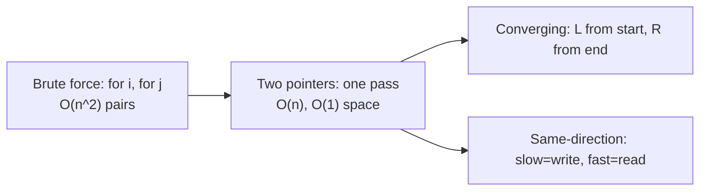
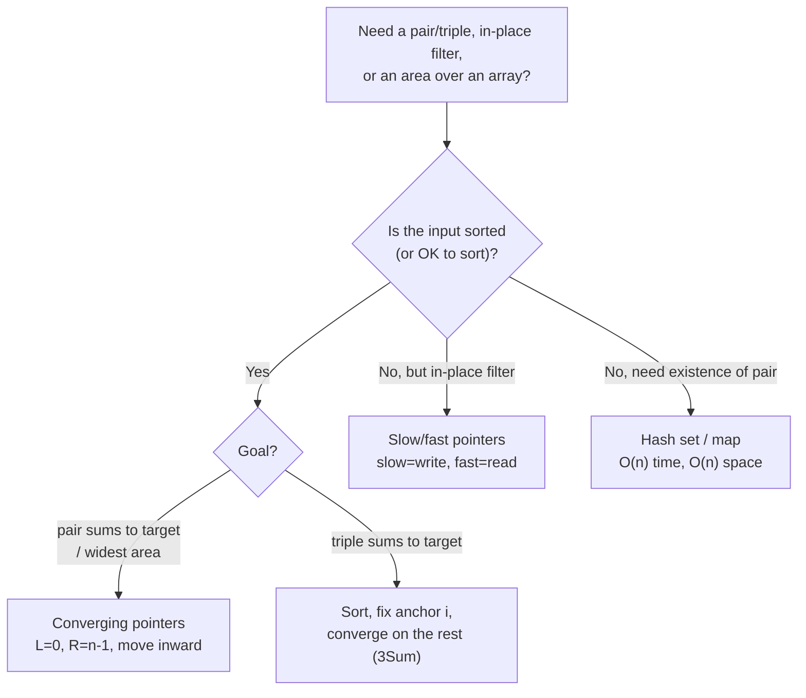
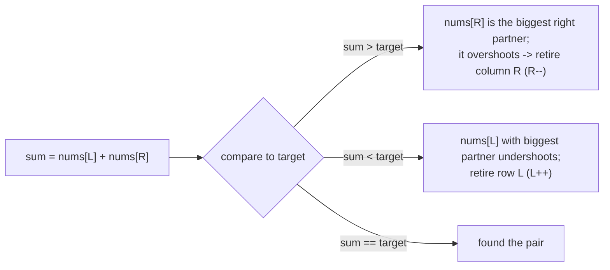
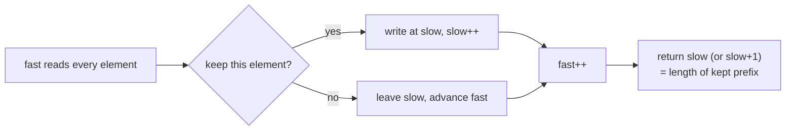
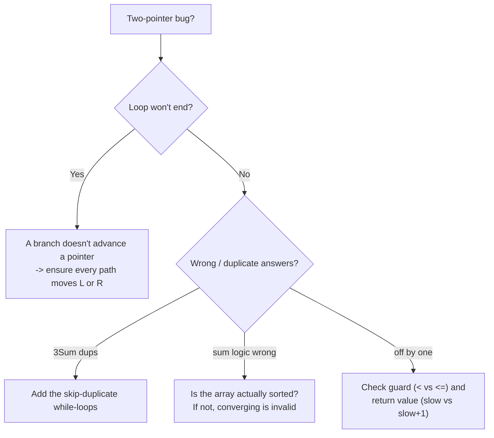

# Two Pointers (Reviewer)

The **[two-pointers](algorithms-glossary-reviewer.md#two-pointers "Two index variables moving through a sequence to solve it in one linear pass.")** pattern uses two indices that move through a sequence in a coordinated way so
that a single [linear](algorithms-glossary-reviewer.md#linear-time "Work grows in direct proportion to input size, about one unit per element.") pass replaces the [brute-force](algorithms-glossary-reviewer.md#brute-force "Trying every possibility directly; correct but often too slow.") `O(n^2)` nested scan. It comes in two flavors that
look different but share one idea — *each pointer only ever moves forward (or inward), so the total
work is bounded by `n`*. **Converging pointers** start at the two ends and walk toward each other;
they shine on **sorted** data, where the sort order tells you which pointer to move. **Same-direction
(slow/fast) pointers** both start at the front: the fast pointer reads ahead while the slow pointer
marks a write position, which is the canonical way to compact or filter an [array](algorithms-glossary-reviewer.md#array "A fixed-size contiguous block of same-type elements accessed by position in O(1).") **[in place](algorithms-glossary-reviewer.md#in-place "Transforms its input using only O(1) extra memory, rearranging in place.")**.

For interviews and exams this is one of the highest-leverage patterns: it turns a [quadratic](algorithms-glossary-reviewer.md#quadratic-time "Work grows like the square of n, typically a nested loop over the same data.")
double-loop into `O(n)` time and usually `O(1)` extra space, and it underpins a whole family of
classics — sorted two-sum, [palindrome](algorithms-glossary-reviewer.md#palindrome "A sequence that reads the same forwards and backwards, like racecar.") checks, in-place removal, 3Sum, container-with-most-water, and
trapping rain water. Recognizing *when* the structure of the problem (sortedness, "in place",
"pair/triple summing to X") licenses two pointers is the whole skill.

Related: [Algorithm Patterns Index](algorithm-patterns-index-reviewer.md) · [Sliding Window](sliding-window-reviewer.md) · [Arrays & Hashing](arrays-and-hashing-reviewer.md) · [Binary Search](binary-search-reviewer.md) · [Complexity & Big-O](complexity-and-big-o-reviewer.md) · [Glossary](algorithms-glossary-reviewer.md)

## Contents
- [The core idea: collapse the nested scan](#the-core-idea-collapse-the-nested-scan)
- [Choosing the variant: a decision flow](#choosing-the-variant-a-decision-flow)
- [Converging pointers on sorted data](#converging-pointers-on-sorted-data)
- [Why converging is correct on sorted input](#why-converging-is-correct-on-sorted-input)
- [Palindrome and reverse: converge in place](#palindrome-and-reverse-converge-in-place)
- [Container With Most Water](#container-with-most-water)
- [Same-direction (slow/fast) pointers: in-place compaction](#same-direction-slowfast-pointers-in-place-compaction)
- [Fast/slow vs cycle detection](#fastslow-vs-cycle-detection)
- [Three-pointer extension: 3Sum](#three-pointer-extension-3sum)
- [Trapping Rain Water](#trapping-rain-water)
- [Complexity cheat-sheet](#complexity-cheat-sheet)
- [Pitfalls](#pitfalls)
- [Interview Q&A](#interview-qa)
- [Rapid-fire round](#rapid-fire-round)
- [Exam-style questions](#exam-style-questions)
- [30-second takeaway](#30-second-takeaway)
- [Quick recall checklist](#quick-recall-checklist)
- [References](#references)

---

## The core idea: collapse the nested scan

The brute force for "find a pair that sums to target" tries every pair: an outer loop over `i` and an
inner loop over `j`, which is `O(n^2)`. Two pointers replaces both loops with a single sweep where
each step **discards one whole row or column of the search space**, so it finishes in `O(n)`.

Key points:

- Maintain **two indices** with an [invariant](algorithms-glossary-reviewer.md#invariant "A condition that stays true at every step, used to prove correctness.") that lets you safely move one of them at each step
  *without re-examining* what you skipped.
- Each pointer advances [monotonically](algorithms-glossary-reviewer.md#monotonic "Consistently moving one direction; never decreasing or never increasing.") (left only increases, right only decreases, or both increase).
  The loop runs at most `n` iterations total — that is what makes it linear.
- Extra space is typically **`O(1)`**: you carry a couple of indices and maybe a running best.
- The pattern needs a reason the skipped candidates can't be answers. For converging pointers that
  reason is **sortedness**; for slow/fast it is that you only ever keep a prefix.



*Two pointers turns the `i`/`j` double loop into a single coordinated sweep — converging from the ends, or slow/fast from the front.*

This directly maps to your practice repo: convergent variants live under `two-pointers/convergent`
and the compaction variants under `two-pointers/same-direction`.

## Choosing the variant: a decision flow

The first question is almost always **"is the array sorted (or can I sort it)?"** Sorted plus a
pair/triple-sum or area goal points to converging pointers. "Remove / move / dedupe in place" points
to slow/fast. If the data is unsorted and you only need existence of a pair, a [hash set](algorithms-glossary-reviewer.md#hash-set "Stores unique keys with O(1) average membership testing and no values.") is often the
better tool — see [Arrays & Hashing](arrays-and-hashing-reviewer.md).



*Decision tree: sortedness and the goal pick the variant; unsorted existence checks usually go to hashing instead.*

| Signal in the prompt | Variant | Time / Space |
| --- | --- | --- |
| Sorted array, "two numbers sum to target" | Converging | `O(n)` / `O(1)` |
| "Is it a palindrome", "reverse in place" | Converging | `O(n)` / `O(1)` |
| "Widest container", "trap rain water" | Converging | `O(n)` / `O(1)` |
| Sorted, "triplets sum to 0" | Sort + converge per anchor | `O(n^2)` / `O(1)`\* |
| "Remove / dedupe / move in place, keep order" | Slow/fast | `O(n)` / `O(1)` |
| Unsorted, "does any pair sum to X" | Hash set | `O(n)` / `O(n)` |

*\*3Sum is `O(n^2)` time; the `O(1)` is auxiliary space beyond the sort and ignoring the output list.*

## Converging pointers on sorted data

Start `L` at index `0` and `R` at index `n - 1`. Compare the combined value against the target and
move the pointer that brings you closer. The canonical case is **[LC](algorithms-glossary-reviewer.md#leetcode "An online platform of coding-interview problems with an automated judge.") 167 — Two Sum II - Input Array Is
Sorted**, which returns [1-indexed](algorithms-glossary-reviewer.md#index "The integer position of an element; 0-indexed starts at 0, 1-indexed at 1.") positions.

Key points:

- Compute `sum = nums[L] + nums[R]`. If `sum == target` you are done. If `sum > target` the only way
  to shrink it is to **move `R` left** (smaller value). If `sum < target`, **move `L` right**.
- Each move eliminates an entire set of pairs you never have to test — that's the `O(n)` win.
- Works because the array is **sorted ascending**; moving `R` left strictly decreases (or keeps) the
  sum, moving `L` right strictly increases (or keeps) it.
- Time `O(n)`, space `O(1)`. The hash-set Two Sum is also `O(n)` time but `O(n)` space — here we pay
  `O(1)` *because* the input is sorted.

```csharp
public int[] TwoSumSorted(int[] numbers, int target)
{
    int left = 0, right = numbers.Length - 1;
    while (left < right)
    {
        int sum = numbers[left] + numbers[right];
        if (sum == target)
            return new[] { left + 1, right + 1 }; // 1-indexed per LC 167
        if (sum > target)
            right--;   // sum too big -> need a smaller value
        else
            left++;    // sum too small -> need a bigger value
    }
    return Array.Empty<int>();
}
```

```text
nums = [2, 7, 11, 15]   target = 9
 index    0    1    2    3
          L              R     sum = 2 + 15 = 17 > 9  -> move R left
          L         R          sum = 2 + 11 = 13 > 9  -> move R left
          L    R               sum = 2 + 7  = 9       -> match, return [1, 2]
```

*Converging trace for LC 167: each oversized sum retreats `R`, until `L`/`R` land on the matching pair (1-indexed result `[1, 2]`).*

This is the `two-pointers/convergent/two-sum` exercise in `leet-practice`.

## Why converging is correct on sorted input

The subtle part is proving you never skip the answer. Picture the pairs as cells of a matrix where
row `i` is the left value and column `j` is the right value. With sorted input, sums increase as you
go right and increase as you go down.

Key points:

- At `(L, R)` with `sum > target`: `nums[R]` is the **largest** value still in play, and even paired
  with the **smallest** remaining left (`nums[L]`) it already overshoots. So `nums[R]` overshoots with
  *every* remaining left as well — column `R` can never hit the target and is exhausted, so we drop it
  with `R--`.
- Symmetrically, when `sum < target`, row `L` paired with the **largest** available partner (`R`) is
  still too small, so `nums[L]` cannot reach the target with any smaller partner either; row `L` is
  exhausted, so `L++`.
- Because each step retires exactly one row or one column, after at most `n` steps the whole space is
  covered. No valid pair is ever skipped.



*The sort order guarantees that each comparison retires one full row or column, so converging is exhaustive in `O(n)`.*

## Palindrome and reverse: converge in place

Two more converging classics need no arithmetic — they only compare or swap the two ends.

Key points:

- **LC 125 — Valid Palindrome**: skip non-alphanumeric characters, compare case-folded ends, fail on
  the first mismatch. `O(n)` time, `O(1)` space (no cleaned copy needed if you skip in place).
- **LC 344 — Reverse String**: swap `s[L]` and `s[R]`, then step inward until they cross. `O(n)` time,
  `O(1)` space because it mutates the input array.
- The loop guard is `left < right`. When they meet or cross, every element has been examined or
  swapped exactly once. Use `char.IsLetterOrDigit` and `char.ToLowerInvariant` for the palindrome.

```csharp
public bool IsPalindrome(string s)
{
    int left = 0, right = s.Length - 1;
    while (left < right)
    {
        while (left < right && !char.IsLetterOrDigit(s[left]))  left++;
        while (left < right && !char.IsLetterOrDigit(s[right])) right--;
        if (char.ToLowerInvariant(s[left]) != char.ToLowerInvariant(s[right]))
            return false;
        left++;
        right--;
    }
    return true;
}

public void ReverseString(char[] s)
{
    int left = 0, right = s.Length - 1;
    while (left < right)
    {
        (s[left], s[right]) = (s[right], s[left]); // tuple swap, no temp
        left++;
        right--;
    }
}
```

```text
ReverseString  s = ['h','e','l','l','o']
 index   0    1    2    3    4
         L                   R   swap h <-> o  -> ['o','e','l','l','h']
              L         R        swap e <-> l  -> ['o','l','l','e','h']
                   LR            L meets R     -> stop, done
```

*Reverse-in-place: swap the ends, step inward; when `L` reaches `R` (odd length) the middle stays put.*

These are `two-pointers/convergent/palindrome` and `two-pointers/convergent/reverse-string` in
`leet-practice`.

## Container With Most Water

**LC 11 — Container With Most Water**: heights form vertical walls; pick two to hold the most water.
Area `= width * min(height[L], height[R])`. The data is **not sorted**, yet converging still works —
the trick is the [greedy](algorithms-glossary-reviewer.md#greedy "Always take the choice that looks best right now, never reconsidering.") move rule.

Key points:

- Width `= R - L` shrinks every step, so the only way to ever beat the current area is to find a
  **taller shorter-wall**. Moving the **taller** wall can never help: width drops and the limiting
  height can't rise above the wall you kept.
- So **always move the pointer at the shorter wall**. That move discards every container that used the
  shorter wall (none of them could be wider, and the height is capped by that wall anyway).
- Track the running maximum area. Time `O(n)`, space `O(1)`.
- Common misconception: "it must be sorted." It need not be — the invariant here is about width
  monotonically shrinking, not about value order.

```csharp
public int MaxArea(int[] height)
{
    int left = 0, right = height.Length - 1, best = 0;
    while (left < right)
    {
        int area = (right - left) * Math.Min(height[left], height[right]);
        best = Math.Max(best, area);
        if (height[left] < height[right])
            left++;    // shorter wall on the left -> move it
        else
            right--;   // shorter (or equal) wall on the right -> move it
    }
    return best;
}
```

```text
height = [1, 8, 6, 2, 5, 4, 8, 3, 7]
 index     0  1  2  3  4  5  6  7  8

 L=0(1) R=8(7)  width 8  area 8*min(1,7)=8    best 8    L shorter -> L++
 L=1(8) R=8(7)  width 7  area 7*min(8,7)=49   best 49   R shorter -> R--
 L=1(8) R=7(3)  width 6  area 6*min(8,3)=18   best 49   R shorter -> R--
 L=1(8) R=6(8)  width 5  area 5*min(8,8)=40   best 49   tie    -> R--
 L=1(8) R=5(4)  width 4  area 4*min(8,4)=16   best 49   R shorter -> R--
 L=1(8) R=4(5)  width 3  area 3*min(8,5)=15   best 49   R shorter -> R--
 L=1(8) R=3(2)  width 2  area 2*min(8,2)=4    best 49   R shorter -> R--
 L=1(8) R=2(6)  width 1  area 1*min(8,6)=6    best 49   R shorter -> R--
 L=1   R=1                                    crossed -> stop, answer 49
```

*Container trace: we always advance the shorter wall, so each step can only plausibly improve area by raising the limiting height; the best stays 49.*

This is `two-pointers/convergent/container-most-water` in `leet-practice`.

## Same-direction (slow/fast) pointers: in-place compaction

Here both pointers start at the front. **`fast`** reads every element; **`slow`** marks the next write
slot for "kept" elements. You overwrite the array's prefix with the survivors, so no extra array is
needed.

Key points:

- **LC 26 — Remove Duplicates from Sorted Array**: keep one of each value. When `nums[fast]` differs
  from `nums[slow]`, advance `slow` and write `nums[fast]` there. Return `slow + 1` (the new length).
- **LC 27 — Remove Element**: keep everything that is not `val`; write each kept value at `slow` and
  bump `slow`. Return `slow`.
- **LC 283 — Move Zeroes**: keep non-zeros compacted to the front, then the tail is zeros. Swapping
  `nums[slow]` and `nums[fast]` on each non-zero keeps it stable in one pass.
- All three are `O(n)` time and `O(1)` space. The slow pointer is the **length of the kept prefix**.

```csharp
// LC 26 — Remove Duplicates from Sorted Array; returns new length k.
public int RemoveDuplicates(int[] nums)
{
    if (nums.Length == 0) return 0;
    int slow = 0; // last index of the unique prefix (also its position)
    for (int fast = 1; fast < nums.Length; fast++)
    {
        if (nums[fast] != nums[slow])
        {
            slow++;
            nums[slow] = nums[fast];
        }
    }
    return slow + 1;
}

// LC 27 — Remove Element; returns count of kept elements.
public int RemoveElement(int[] nums, int val)
{
    int slow = 0; // next write position
    for (int fast = 0; fast < nums.Length; fast++)
    {
        if (nums[fast] != val)
            nums[slow++] = nums[fast];
    }
    return slow;
}

// LC 283 — Move Zeroes; mutates in place, keeps non-zero order.
public void MoveZeroes(int[] nums)
{
    int slow = 0; // next slot for a non-zero
    for (int fast = 0; fast < nums.Length; fast++)
    {
        if (nums[fast] != 0)
        {
            (nums[slow], nums[fast]) = (nums[fast], nums[slow]);
            slow++;
        }
    }
}
```

```text
RemoveDuplicates  nums = [1, 1, 2, 2, 3]   (sorted)
 index           0  1  2  3  4
 start    slow=0 ^
 fast=1  nums[1]=1 == nums[0]=1   -> skip            [1, 1, 2, 2, 3]  slow=0  k=1
 fast=2  nums[2]=2 != nums[0]=1   -> slow=1, write 2 [1, 2, 2, 2, 3]  slow=1  k=2
 fast=3  nums[3]=2 == nums[1]=2   -> skip            [1, 2, 2, 2, 3]  slow=1  k=2
 fast=4  nums[4]=3 != nums[1]=2   -> slow=2, write 3 [1, 2, 3, 2, 3]  slow=2  k=3
 result: k = slow+1 = 3, unique prefix = [1, 2, 3]
```

*Slow/fast compaction: `slow` is the tail of the unique prefix; only a new value advances `slow` and gets written there. The tail past `k` is leftover garbage and is ignored.*

```text
MoveZeroes  nums = [0, 1, 0, 3, 12]
 index        0   1   2   3   4
 fast=0 nums[0]=0  -> skip                          [0, 1, 0, 3, 12]  slow=0
 fast=1 nums[1]=1  -> swap (slow0,fast1)            [1, 0, 0, 3, 12]  slow=1
 fast=2 nums[2]=0  -> skip                          [1, 0, 0, 3, 12]  slow=1
 fast=3 nums[3]=3  -> swap (slow1,fast3)            [1, 3, 0, 0, 12]  slow=2
 fast=4 nums[4]=12 -> swap (slow2,fast4)            [1, 3, 12, 0, 0]  slow=3
 result: [1, 3, 12, 0, 0]  (order of non-zeros preserved)
```

*Move Zeroes: each non-zero swaps into the next `slow` slot, sliding zeros to the back while keeping non-zero order stable.*

These map to `two-pointers/same-direction/remove-duplicates`, `.../remove-element`, and
`.../move-zeroes` in `leet-practice`.



*Same-direction template: `fast` scans, `slow` is the write head; the answer is the size of the compacted prefix.*

## Fast/slow vs cycle detection

The phrase "fast/slow pointers" is overloaded. The in-place compaction above advances both by one and
uses `slow` as a write index. There is a *different* fast/slow technique —
**[Floyd's tortoise and hare](algorithms-glossary-reviewer.md#fast-and-slow-pointers "One pointer moves twice as fast as another, meeting only if a cycle exists.")** — where `fast` moves **two** steps per `slow` step to detect a [cycle](algorithms-glossary-reviewer.md#cycle "A path that starts and ends at the same vertex without reusing an edge.") or find a midpoint.

Key points:

- **Compaction (this reviewer):** array indices, both move by one, `slow` = write position. Used for
  removal/dedup/move.
- **Floyd's cycle detection:** pointers over [linked-list](algorithms-glossary-reviewer.md#linked-list "A chain of nodes each holding a value and a reference to the next node.") [nodes](algorithms-glossary-reviewer.md#node "A container in a linked structure holding a value plus references to neighbors."), `fast` moves twice as fast; if there is
  a cycle they meet, otherwise `fast` falls off the end. Also finds the middle node in one pass.
- Do not conflate them: same vocabulary, different step ratio and different goal. Floyd's lives with
  the linked-list material — see [Linked Lists](linked-lists-reviewer.md) for tortoise-and-hare,
  cycle entry, and middle-of-list.

## Three-pointer extension: 3Sum

**LC 15 — 3Sum**: find all unique triplets summing to `0`. **Sort first**, then fix an anchor `i` and
run a converging two-pointer scan on the remainder — the anchor turns a 3-sum into a 2-sum.

Key points:

- After sorting, for each anchor `i`, set `L = i + 1`, `R = n - 1`, and converge looking for
  `nums[i] + nums[L] + nums[R] == 0`. Move `L` right when the sum is too small, `R` left when too big.
- **Skip duplicates** to avoid repeated triplets: skip a repeated anchor (`nums[i] == nums[i-1]`), and
  after recording a triplet, skip repeated `L` and `R` values.
- Early exit: once `nums[i] > 0`, no triplet can sum to `0` (the rest are all `≥ nums[i] > 0`).
- Time `O(n^2)` — [`O(n log n)`](algorithms-glossary-reviewer.md#linearithmic-time "A linear pass repeated a logarithmic number of times; good-sort speed.") sort plus an `O(n)` converge for each of `n` anchors. Space `O(1)`
  [auxiliary](algorithms-glossary-reviewer.md#auxiliary-space "Extra memory beyond the input, including temporaries and the call stack.") beyond the output (ignoring sort's internal stack).

```csharp
public IList<IList<int>> ThreeSum(int[] nums)
{
    Array.Sort(nums);
    var result = new List<IList<int>>();
    int n = nums.Length;

    for (int i = 0; i < n - 2; i++)
    {
        if (nums[i] > 0) break;                 // rest are positive -> no zero sum
        if (i > 0 && nums[i] == nums[i - 1]) continue; // skip duplicate anchor

        int left = i + 1, right = n - 1;
        while (left < right)
        {
            int sum = nums[i] + nums[left] + nums[right];
            if (sum < 0) left++;
            else if (sum > 0) right--;
            else
            {
                result.Add(new List<int> { nums[i], nums[left], nums[right] });
                left++;
                right--;
                while (left < right && nums[left] == nums[left - 1]) left++;    // skip dup L
                while (left < right && nums[right] == nums[right + 1]) right--; // skip dup R
            }
        }
    }
    return result;
}
```

```text
3Sum  input [-1, 0, 1, 2, -1, -4]  -> sort -> [-4, -1, -1, 0, 1, 2]
 index               0    1    2   3   4   5

 i=0 (-4)  L=1(-1) R=5(2)  sum -3 < 0 -> L++
           L=2(-1) R=5(2)  sum -3 < 0 -> L++ ... never reaches 0, no triplet
 i=1 (-1)  L=2(-1) R=5(2)  sum  0     -> record [-1,-1,2], L++,R--
           L=3(0)  R=4(1)  sum  0     -> record [-1, 0,1], L++,R-- -> cross
 i=2 (-1)  duplicate of i=1 -> skip
 i=3 (0)   L=4(1)  R=5(2)  sum  3 > 0 -> R-- -> cross, none
 result: [[-1, -1, 2], [-1, 0, 1]]
```

*3Sum trace: the anchor fixes one value; a converging two-pointer finds the matching pair, and duplicate skips keep the result set unique.*

## Trapping Rain Water

**LC 42 — Trapping Rain Water**: water trapped above bar `i` is `min(maxLeft, maxRight) - height[i]`.
The two-pointer solution computes this in one pass with `O(1)` space by tracking running maxima from
each side.

Key points:

- Keep `leftMax` (tallest bar seen from the left so far) and `rightMax` (tallest from the right). At
  the **lower** of the two boundary heights, the trapped water at that position is fully determined.
- If `height[L] < height[R]`, the left side is the bottleneck, so water at `L` is `leftMax - height[L]`
  (the taller right guarantees a `rightMax ≥ height[R] > height[L]`). Add it and advance `L`.
  Otherwise mirror on the right and advance `R`.
- The invariant: you always move the pointer on the **shorter** wall, because that side's water is
  capped by `leftMax`/`rightMax` already known, regardless of the far wall.
- Time `O(n)`, space `O(1)`. The prefix/suffix-array version is also `O(n)` time but uses `O(n)` space;
  two pointers trades it down to `O(1)`.

```csharp
public int Trap(int[] height)
{
    int left = 0, right = height.Length - 1;
    int leftMax = 0, rightMax = 0, water = 0;
    while (left < right)
    {
        if (height[left] < height[right])
        {
            leftMax = Math.Max(leftMax, height[left]);
            water += leftMax - height[left]; // left wall is the bottleneck
            left++;
        }
        else
        {
            rightMax = Math.Max(rightMax, height[right]);
            water += rightMax - height[right];
            right--;
        }
    }
    return water;
}
```

```text
height = [0,1,0,2,1,0,1,3,2,1,2,1]
 index     0 1 2 3 4 5 6 7 8 9 10 11

 step                              leftMax rightMax  +water  total
 hL=0 < hR=1   move L (i=0,h=0)      0       0        0       0
 hL=1 = hR=1   move R (i=11,h=1)     0       1        0       0
 hL=1 < hR=2   move L (i=1,h=1)      1       1        0       0
 hL=0 < hR=2   move L (i=2,h=0)      1       1        1       1
 hL=2 = hR=2   move R (i=10,h=2)     1       2        0       1
 hL=2 > hR=1   move R (i=9,h=1)      1       2        1       2
 hL=2 = hR=2   move R (i=8,h=2)      1       2        0       2
 hL=2 < hR=3   move L (i=3,h=2)      2       2        0       2
 hL=1 < hR=3   move L (i=4,h=1)      2       2        1       3
 hL=0 < hR=3   move L (i=5,h=0)      2       2        2       5
 hL=1 < hR=3   move L (i=6,h=1)      2       2        1       6
 L meets R (i=7) -> stop, total trapped = 6
```

*Trapping Rain Water: always advance the shorter side; its running max fixes the water there, so one `O(1)`-space pass totals 6 units.*

## Complexity cheat-sheet

| Problem | Technique | Time | Space | Notes |
| --- | --- | --- | --- | --- |
| LC 167 — Two Sum II - Input Array Is Sorted | Converging | `O(n)` | `O(1)` | Needs sorted input; 1-indexed result |
| LC 125 — Valid Palindrome | Converging | `O(n)` | `O(1)` | Skip non-alphanumeric in place |
| LC 344 — Reverse String | Converging | `O(n)` | `O(1)` | Swap ends inward |
| LC 11 — Container With Most Water | Converging (greedy) | `O(n)` | `O(1)` | Move the shorter wall; not sorted |
| LC 15 — 3Sum | Sort + converge per anchor | `O(n^2)` | `O(1)`\* | Skip duplicate anchor/L/R |
| LC 26 — Remove Duplicates from Sorted Array | Slow/fast | `O(n)` | `O(1)` | Returns new length `k` |
| LC 27 — Remove Element | Slow/fast | `O(n)` | `O(1)` | Returns kept count |
| LC 283 — Move Zeroes | Slow/fast (swap) | `O(n)` | `O(1)` | Stable; zeros to the back |
| LC 42 — Trapping Rain Water | Converging + running max | `O(n)` | `O(1)` | Move shorter side |

*\*Auxiliary space beyond the output list; the `Array.Sort` is in-place [introsort](algorithms-glossary-reviewer.md#introsort "Hybrid sort: quicksort that falls back to heap sort to guarantee O(n log n).") ([`O(log n)`](algorithms-glossary-reviewer.md#logarithmic-time "Each step discards a constant fraction, so steps equal the log of n.") stack).*

The whole table is `O(1)` or `O(log n)` extra space except where the *output itself* is large — that
constant-space property is the headline reason interviewers love this pattern over the hashing
alternative. For how the hashing alternative compares, see
[Arrays & Hashing](arrays-and-hashing-reviewer.md) and
[Collections & Big-O](../dotnet/csharp/collections-and-big-o-reviewer.md).

## Pitfalls

Key points:

- **Off-by-one on the loop guard.** Use `left < right` for converging (stop when they meet). Using
  `left <= right` can double-process the middle element or, for Two Sum, pair an element with itself.
- **A pointer that fails to advance → infinite loop.** Every branch of the loop body must move at least
  one pointer. In 3Sum, forgetting to advance both `L` and `R` after recording a match spins forever.
- **Applying converging to UNsorted data for sum problems.** Sorted-two-sum logic is only valid on
  sorted input. If the prompt's array is unsorted and you must return *original* indices, sorting
  destroys them — use a [hash map](algorithms-glossary-reviewer.md#hash-map "Stores key-value pairs and retrieves a value by key in O(1) average time.") instead (`O(n)` time, `O(n)` space).
- **Returning the wrong length in compaction.** LC 26 returns `slow + 1` (the prefix length), but LC 27
  returns `slow` (a write-counter). Mixing these up is a classic off-by-one.
- **Container/Trapping: moving the taller wall.** You must move the *shorter* wall; moving the taller
  one can only lose area / miss water because width shrinks and the limiting height can't improve.
- **Duplicates in 3Sum.** Skipping duplicate anchors and duplicate `L`/`R` values is what keeps the
  result set unique; omit it and you emit the same triplet many times.
- **Mutating during the scan.** Slow/fast compaction overwrites the prefix as it goes — that is fine
  because `fast ≥ slow` always, so you never read a slot you have not already consumed.



*Debugging decision tree for the common two-pointer failure modes.*

## Interview Q&A

### Fundamentals

Q: What is the two-pointer pattern in one sentence?
A: Use two coordinated indices that each move monotonically through a sequence so a single `O(n)` pass replaces an `O(n^2)` nested scan, usually with `O(1)` extra space.

Q: What are the two main variants and how do they differ?
A: **Converging** (pointers start at opposite ends and move inward — for sorted pair/area problems) and **same-direction / slow-fast** (both start at the front; `slow` is a write head — for in-place removal and compaction).

Q: Why is the pattern `O(n)` and not `O(n^2)`?
A: Each pointer only moves in one direction and never backtracks, so across the whole run the two pointers take at most `n` combined steps. There is no nested re-scan.

### Converging

Q: Why does sorted two-sum let you move just one pointer per step?
A: Because the array is sorted, `sum > target` means the right value is too big for any remaining left, so you drop the right (column); `sum < target` means the left is too small even with the biggest partner, so you drop the left (row). Each step retires a full row or column.

Q: Container With Most Water is not sorted — why does converging still work?
A: Width shrinks every step, so the only way to improve area is a taller limiting wall. Moving the taller wall can never raise the `min` height, so you always move the shorter wall, which safely discards all containers using it.

Q: In Trapping Rain Water, why move the pointer at the shorter wall?
A: The water above a column is `min(leftMax, rightMax) - height`. At the shorter boundary, that side's running max is the binding constraint regardless of the far wall, so the trapped amount there is already known and you can safely advance it.

### Same-direction

Q: What does the slow pointer represent in compaction problems?
A: The next write position, equivalently the length of the kept prefix so far. The fast pointer reads every element; you only write (and bump `slow`) for elements you keep.

Q: LC 26 returns `slow + 1` but LC 27 returns `slow` — why the difference?
A: In LC 26 `slow` is the *index* of the last unique element, so the length is `slow + 1`. In LC 27 `slow` is used as a *count / next-write* position that is incremented after each write, so it already equals the kept length.

Q: How is slow/fast compaction different from Floyd's cycle detection?
A: Compaction advances both pointers by one and uses `slow` as a write head over an array. Floyd's tortoise-and-hare advances `fast` two steps per `slow` step over linked-list nodes to detect a cycle or find a midpoint — same name, different ratio and goal.

### Extensions

Q: How does 3Sum reduce to two pointers?
A: Sort the array, then fix each anchor `i` and run a converging two-pointer scan on the suffix looking for the pair that sums to `-nums[i]`. The sort is what makes the inner converge valid.

Q: What is the complexity of 3Sum and where does it come from?
A: `O(n^2)` time — an `O(n log n)` sort plus, for each of `n` anchors, an `O(n)` converge — and `O(1)` auxiliary space beyond the output.

## Rapid-fire round

- Converging pointers require → **sorted input (for sum problems) or a width/area invariant.**
- Loop guard for converging → **`left < right`.**
- Sorted two-sum, `sum > target` → **move `right` left.**
- Sorted two-sum space vs hash two-sum → **`O(1)` vs `O(n)`.**
- Container With Most Water move rule → **advance the shorter wall.**
- Is Container With Most Water input sorted? → **no; the invariant is shrinking width.**
- Slow pointer meaning in compaction → **next write index / kept-prefix length.**
- LC 26 return value → **`slow + 1`.**
- LC 27 return value → **`slow`.**
- Move Zeroes stability → **stable; swap non-zeros forward.**
- 3Sum time / space → **`O(n^2)` / `O(1)` aux.**
- 3Sum duplicate handling → **skip repeated anchor, and repeated `L`/`R` after a match.**
- 3Sum early exit → **`nums[i] > 0` -> break.**
- Trapping Rain Water space (two-pointer) → **`O(1)`.**
- Trapping Rain Water move rule → **advance the shorter side; add its `max - height`.**
- Floyd's vs compaction → **`fast` moves 2x (cycle/midpoint) vs both move 1x (write head).**
- Cause of an infinite two-pointer loop → **a branch that doesn't advance a pointer.**
- Unsorted array, return original indices for a pair → **use a hash map, not two pointers.**

## Exam-style questions

1. What does this return for `numbers = [1, 3, 4, 5, 7, 11]`, `target = 9`?

```csharp
int left = 0, right = numbers.Length - 1;
while (left < right)
{
    int sum = numbers[left] + numbers[right];
    if (sum == target) return new[] { left + 1, right + 1 };
    if (sum > target) right--; else left++;
}
return Array.Empty<int>();
```

**Answer:** `[3, 4]`. Trace: `(1,11)=12>9 -> R--`; `(1,7)=8<9 -> L++`; `(3,7)=10>9 -> R--`;
`(3,5)=8<9 -> L++`; `(4,5)=9 ==` target, return `[left+1, right+1] = [3, 4]` (1-indexed positions of
`4` and `5`).

2. What is `k` and the meaningful prefix after running LC 26 on `nums = [0, 0, 1, 1, 1, 2]`?

```csharp
int slow = 0;
for (int fast = 1; fast < nums.Length; fast++)
    if (nums[fast] != nums[slow]) { slow++; nums[slow] = nums[fast]; }
// return slow + 1;
```

**Answer:** `k = 3`, prefix `[0, 1, 2]`. Writes happen at `fast=2` (`slow->1`, write `1`) and `fast=5`
(`slow->2`, write `2`); the `1`/`1` and `0`/`0` repeats are skipped. The elements past index `2` are
leftover and ignored.

3. Why is moving the **taller** wall in Container With Most Water never beneficial?

**Answer:** Area `= width * min(h[L], h[R])`. Each move shrinks width by one. If you move the taller
wall, the new pair's `min` height is still capped by the **shorter** wall you kept (or lower), so the
area cannot increase — you lose width with no chance of more height. Moving the shorter wall is the
only move that can raise the limiting height, so it is the correct greedy choice.

4. What does this print for `height = [4, 2, 0, 3, 2, 5]`?

```csharp
int left = 0, right = height.Length - 1, leftMax = 0, rightMax = 0, water = 0;
while (left < right)
{
    if (height[left] < height[right])
    { leftMax = Math.Max(leftMax, height[left]); water += leftMax - height[left]; left++; }
    else
    { rightMax = Math.Max(rightMax, height[right]); water += rightMax - height[right]; right--; }
}
Console.WriteLine(water);
```

**Answer:** `9`. The right wall `h[5]=5` is the tallest bar, so `height[left] < height[right]` holds
every step and `left` advances the whole way with `leftMax = 4`: at `L=0(4) +0`; `L=1(2) +2`
(water 2); `L=2(0) +4` (water 6); `L=3(3) +1` (water 7); `L=4(2) +2` (water 9); then `L` meets `R`
and the loop stops. Prints **`9`**.

5. Identify the bug:

```csharp
public IList<IList<int>> ThreeSum(int[] nums)
{
    Array.Sort(nums);
    var res = new List<IList<int>>();
    for (int i = 0; i < nums.Length - 2; i++)
    {
        int left = i + 1, right = nums.Length - 1;
        while (left < right)
        {
            int sum = nums[i] + nums[left] + nums[right];
            if (sum == 0) { res.Add(new List<int>{ nums[i], nums[left], nums[right] }); left++; right--; }
            else if (sum < 0) left++;
            else right--;
        }
    }
    return res;
}
```

**Answer:** It emits **duplicate triplets**. There is no skip for a repeated anchor
(`if (i > 0 && nums[i] == nums[i-1]) continue;`) nor for repeated `left`/`right` values after a match
(`while (left < right && nums[left] == nums[left-1]) left++;` and the mirror for `right`). For input
like `[-1,-1,0,1,1]` it would record `[-1,0,1]` more than once. The fix is to add those duplicate
skips; the core converging logic is otherwise correct.

## 30-second takeaway

> Two pointers replaces an `O(n^2)` nested scan with one `O(n)`, `O(1)`-space pass using two indices
> that never backtrack. **Converging** (ends moving inward) is for **sorted** pair sums, palindromes,
> and width/area greedies (Container, Trapping) — move the pointer that provably can't improve the
> answer (the overshooting end, or the shorter wall). **Slow/fast same-direction** is for **in-place**
> removal/dedup/move, where `slow` is the write head and the kept-prefix length. 3Sum is "sort, fix an
> anchor, converge on the rest" in `O(n^2)`. Watch the guard (`left < right`), always advance a
> pointer (or you loop forever), don't apply sorted logic to unsorted data, and skip duplicates in
> 3Sum.

## Quick recall checklist

- **Converging:** `L=0`, `R=n-1`, guard `left < right`, move the pointer that retires a row/column;
  needs **sorted** input for sum problems. `O(n)` / `O(1)`.
- **Sorted two-sum (LC 167):** `sum > target -> R--`, `sum < target -> L++`; return **1-indexed**.
- **Palindrome / reverse (LC 125 / 344):** compare or swap ends inward; skip non-alphanumeric for
  palindrome. `O(n)` / `O(1)`.
- **Container (LC 11):** `area = width * min(walls)`; **move the shorter wall**; not sorted. `O(n)`.
- **Slow/fast compaction (LC 26 / 27 / 283):** `slow` = write head / kept length; LC 26 returns
  `slow+1`, LC 27 returns `slow`, Move Zeroes swaps non-zeros forward (stable). `O(n)` / `O(1)`.
- **3Sum (LC 15):** sort, fix anchor `i`, converge for `-nums[i]`; **skip duplicate** anchor/`L`/`R`;
  break when `nums[i] > 0`. `O(n^2)` / `O(1)` aux.
- **Trapping Rain Water (LC 42):** track `leftMax`/`rightMax`, advance the **shorter** side, add
  `max - height`. `O(n)` / `O(1)`.
- **Floyd's tortoise/hare** (cycle/midpoint) is a *different* fast/slow — `fast` moves 2x — and lives
  with linked lists.
- **Pitfalls:** guard `<` vs `<=`, always advance a pointer, don't converge on unsorted sum data,
  return `slow` vs `slow+1` correctly, skip 3Sum duplicates.

## References

- Wikipedia — [Two pointers technique](https://en.wikipedia.org/wiki/Two_pointers_technique).
- Wikipedia — [Cycle detection (Floyd's algorithm)](https://en.wikipedia.org/wiki/Cycle_detection).
- NeetCode — [Roadmap](https://neetcode.io/roadmap) (Two Pointers and Sliding Window sections).
- LeetCode — [Study Plans hub](https://leetcode.com/studyplan/).
- Microsoft Learn — [`Array.Sort` Method](https://learn.microsoft.com/en-us/dotnet/api/system.array.sort).
- Microsoft Learn — [`Math.Min` Method](https://learn.microsoft.com/en-us/dotnet/api/system.math.min).
- Microsoft Learn — [`Char.IsLetterOrDigit` Method](https://learn.microsoft.com/en-us/dotnet/api/system.char.isletterordigit).
- Microsoft Learn — [Tuples (deconstruction and swap)](https://learn.microsoft.com/en-us/dotnet/csharp/language-reference/builtin-types/value-tuples).
